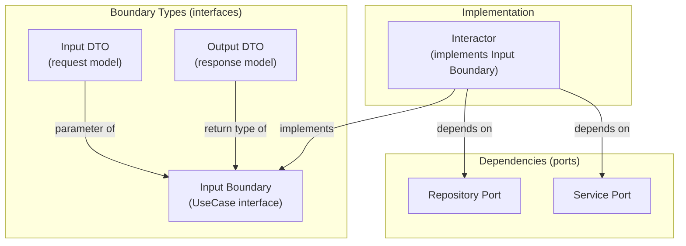
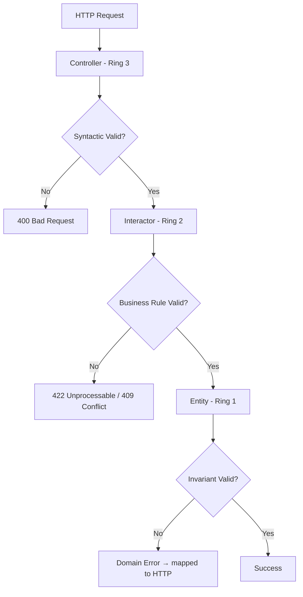
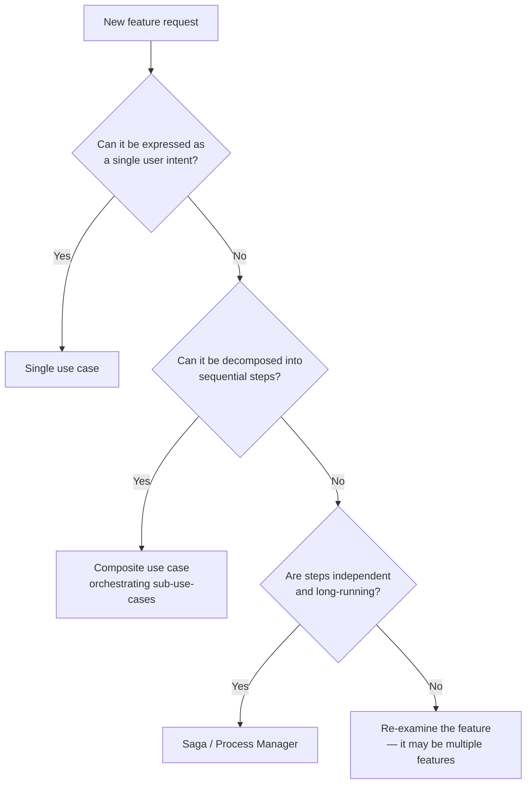

# Use Cases — Interactors and Boundaries

## Why Use Cases Are the Heart of Clean Architecture

In traditional layered architectures, business logic lives in a "service layer" — an amorphous collection of methods that grows until nobody can tell which rules belong to which feature. Clean Architecture replaces this with **use cases**: each application feature gets its own class with a single `execute` method, explicit input, and explicit output.

Uncle Bob borrowed the concept from Ivar Jacobson's Object-Oriented Software Engineering (1992), where use cases were the primary driver of system decomposition. The key insight: **users don't think in terms of database tables or API endpoints — they think in terms of tasks they want to accomplish.** A system's architecture should reflect those tasks.

## First Principles

### The Use Case as a Transaction Script

A use case interactor is essentially a **transaction script** — a procedure that takes input, manipulates domain objects, and produces output. But unlike a raw transaction script, it:

1. **Depends only on abstractions** (repository interfaces, service interfaces)
2. **Receives input through a formal boundary** (Input DTO)
3. **Produces output through a formal boundary** (Output DTO)
4. **Never sees HTTP, SQL, or framework types**

This makes every use case independently testable without any infrastructure.

### Formal Definition

A use case $U$ is a function:

$$
U: I \times S \rightarrow O \times S'
$$

Where:
- $I$ is the input data type
- $S$ is the system state before execution (database, external services)
- $O$ is the output data type
- $S'$ is the system state after execution

In practice, $S$ and $S'$ are mediated through repository/service interfaces, so the interactor signature is simply:

$$
U: I \rightarrow \text{Promise}<O>
$$

with side effects handled through injected ports.

## Core Mechanics

### The Three Components

Every use case consists of three parts:



### Component 1: Boundary Types

```typescript
// application/use-cases/transfer-funds/transfer-funds.types.ts

/** Input DTO — what the caller provides */
export interface TransferFundsInput {
  readonly fromAccountId: string;
  readonly toAccountId: string;
  readonly amount: number;
  readonly currency: string;
  readonly idempotencyKey: string;
  readonly initiatedBy: string;
}

/** Output DTO — what the caller receives */
export interface TransferFundsOutput {
  readonly transferId: string;
  readonly fromBalance: number;
  readonly toBalance: number;
  readonly currency: string;
  readonly completedAt: string;
}

/** Input Boundary — the contract */
export interface TransferFundsUseCase {
  execute(input: TransferFundsInput): Promise<TransferFundsOutput>;
}
```

::: warning Important
Input and output types must be **plain data** — primitives, arrays, and plain objects only. No entity references, no value objects, no classes with methods. This ensures the boundary is a true data contract.
:::

### Component 2: The Interactor

```typescript
// application/use-cases/transfer-funds/transfer-funds.interactor.ts
import type { TransferFundsInput, TransferFundsOutput, TransferFundsUseCase } from './transfer-funds.types';
import type { AccountRepository } from '../../ports/account.repository';
import type { TransferRepository } from '../../ports/transfer.repository';
import type { IdempotencyStore } from '../../ports/idempotency.store';
import type { EventBus } from '../../ports/event-bus';
import type { UnitOfWork } from '../../ports/unit-of-work';
import { AccountId } from '../../../domain/value-objects/account-id';
import { Money } from '../../../domain/value-objects/money';
import { Transfer } from '../../../domain/entities/transfer';
import {
  AccountNotFoundError,
  InsufficientFundsError,
  SameAccountTransferError,
  DuplicateTransferError,
} from '../../errors';

export class TransferFundsInteractor implements TransferFundsUseCase {
  constructor(
    private readonly accountRepo: AccountRepository,
    private readonly transferRepo: TransferRepository,
    private readonly idempotencyStore: IdempotencyStore,
    private readonly eventBus: EventBus,
    private readonly unitOfWork: UnitOfWork,
  ) {}

  async execute(input: TransferFundsInput): Promise<TransferFundsOutput> {
    // 1. Idempotency check
    const existing = await this.idempotencyStore.get(input.idempotencyKey);
    if (existing) {
      throw new DuplicateTransferError(input.idempotencyKey);
    }

    // 2. Validate same-account transfer
    if (input.fromAccountId === input.toAccountId) {
      throw new SameAccountTransferError();
    }

    // 3. Build value objects
    const fromId = AccountId.of(input.fromAccountId);
    const toId = AccountId.of(input.toAccountId);
    const amount = Money.of(input.amount, input.currency);

    // 4. Execute within a unit of work (transaction)
    return this.unitOfWork.execute(async () => {
      // 4a. Load accounts (with pessimistic lock for consistency)
      const fromAccount = await this.accountRepo.findByIdForUpdate(fromId);
      if (!fromAccount) throw new AccountNotFoundError(fromId);

      const toAccount = await this.accountRepo.findByIdForUpdate(toId);
      if (!toAccount) throw new AccountNotFoundError(toId);

      // 4b. Domain logic — entities enforce invariants
      fromAccount.debit(amount);
      toAccount.credit(amount);

      // 4c. Create transfer record
      const transfer = Transfer.create(
        this.transferRepo.nextId(),
        fromId,
        toId,
        amount,
        input.initiatedBy,
      );

      // 4d. Persist
      await this.accountRepo.save(fromAccount);
      await this.accountRepo.save(toAccount);
      await this.transferRepo.save(transfer);
      await this.idempotencyStore.set(input.idempotencyKey, transfer.id.value);

      // 4e. Publish events
      for (const event of [
        ...fromAccount.events,
        ...toAccount.events,
        ...transfer.events,
      ]) {
        await this.eventBus.publish(event);
      }

      fromAccount.clearEvents();
      toAccount.clearEvents();
      transfer.clearEvents();

      // 5. Build output
      return {
        transferId: transfer.id.value,
        fromBalance: fromAccount.balance.amount,
        toBalance: toAccount.balance.amount,
        currency: amount.currency,
        completedAt: transfer.completedAt.toISOString(),
      };
    });
  }
}
```

### Component 3: Port Interfaces

```typescript
// application/ports/account.repository.ts
import type { Account } from '../../domain/entities/account';
import type { AccountId } from '../../domain/value-objects/account-id';

export interface AccountRepository {
  findById(id: AccountId): Promise<Account | null>;
  findByIdForUpdate(id: AccountId): Promise<Account | null>;
  save(account: Account): Promise<void>;
}
```

```typescript
// application/ports/unit-of-work.ts
export interface UnitOfWork {
  execute<T>(work: () => Promise<T>): Promise<T>;
}
```

```typescript
// application/ports/idempotency.store.ts
export interface IdempotencyStore {
  get(key: string): Promise<string | null>;
  set(key: string, value: string, ttlMs?: number): Promise<void>;
}
```

## Input Validation Strategy

Input validation happens at two levels:

1. **Syntactic validation** (format, type, required fields) — belongs in the **adapter layer** (Ring 3)
2. **Semantic validation** (business rules, cross-field checks) — belongs in the **use case** (Ring 2) or **entity** (Ring 1)



### Syntactic Validation (Adapter Layer)

Use a schema validation library (Zod, io-ts, class-validator) in the controller:

```typescript
// adapters/http/validators/transfer-funds.validator.ts
import { z } from 'zod';

export const transferFundsSchema = z.object({
  fromAccountId: z.string().uuid('Invalid source account ID'),
  toAccountId: z.string().uuid('Invalid destination account ID'),
  amount: z.number().positive('Amount must be positive'),
  currency: z.string().length(3, 'Currency must be ISO 4217'),
  idempotencyKey: z.string().min(1, 'Idempotency key required'),
});

export type TransferFundsRequest = z.infer<typeof transferFundsSchema>;
```

```typescript
// adapters/http/controllers/transfer.controller.ts
import { transferFundsSchema } from '../validators/transfer-funds.validator';
import type { TransferFundsUseCase } from '../../../application/use-cases/transfer-funds/transfer-funds.types';

export class TransferController {
  constructor(private readonly transferFunds: TransferFundsUseCase) {}

  async handleTransfer(req: Request, res: Response, next: NextFunction): Promise<void> {
    try {
      // Syntactic validation at the boundary
      const parsed = transferFundsSchema.parse(req.body);

      const output = await this.transferFunds.execute({
        ...parsed,
        initiatedBy: req.user!.id,
      });

      res.status(200).json({ data: output });
    } catch (error) {
      next(error);
    }
  }
}
```

### Semantic Validation (Use Case / Entity)

Business rule validation happens inside the interactor or entity:

```typescript
// Inside the interactor:
if (input.fromAccountId === input.toAccountId) {
  throw new SameAccountTransferError();
}

// Inside the entity:
debit(amount: Money): void {
  if (this._balance.lessThan(amount)) {
    throw new InsufficientFundsError(this.id, this._balance, amount);
  }
  // ...
}
```

## Error Handling Patterns

### Domain Errors as Custom Classes

```typescript
// application/errors/index.ts
export abstract class ApplicationError extends Error {
  abstract readonly code: string;
  abstract readonly httpStatus: number;
}

export class AccountNotFoundError extends ApplicationError {
  readonly code = 'ACCOUNT_NOT_FOUND';
  readonly httpStatus = 404;

  constructor(public readonly accountId: AccountId) {
    super(`Account ${accountId.value} not found`);
  }
}

export class InsufficientFundsError extends ApplicationError {
  readonly code = 'INSUFFICIENT_FUNDS';
  readonly httpStatus = 422;

  constructor(
    public readonly accountId: AccountId,
    public readonly balance: Money,
    public readonly requested: Money,
  ) {
    super(
      `Account ${accountId.value} has ${balance.format()} but ${requested.format()} was requested`,
    );
  }
}

export class DuplicateTransferError extends ApplicationError {
  readonly code = 'DUPLICATE_TRANSFER';
  readonly httpStatus = 409;

  constructor(public readonly idempotencyKey: string) {
    super(`Transfer with idempotency key ${idempotencyKey} already processed`);
  }
}
```

### Error Mapping in the Adapter Layer

```typescript
// adapters/http/middleware/error-handler.ts
import { ApplicationError } from '../../../application/errors';
import { ZodError } from 'zod';

export function errorHandler(err: Error, req: Request, res: Response, next: NextFunction): void {
  if (err instanceof ApplicationError) {
    res.status(err.httpStatus).json({
      error: {
        code: err.code,
        message: err.message,
      },
    });
    return;
  }

  if (err instanceof ZodError) {
    res.status(400).json({
      error: {
        code: 'VALIDATION_ERROR',
        message: 'Invalid request',
        details: err.errors.map((e) => ({
          field: e.path.join('.'),
          message: e.message,
        })),
      },
    });
    return;
  }

  // Unknown error — log and return generic response
  console.error('Unhandled error:', err);
  res.status(500).json({
    error: {
      code: 'INTERNAL_ERROR',
      message: 'An unexpected error occurred',
    },
  });
}
```

## Use Case Composition Patterns

### Pattern 1: Sequential Composition

For workflows that are a linear sequence of steps:

```typescript
export class PlaceOrderInteractor implements PlaceOrderUseCase {
  constructor(
    private readonly validateInventory: ValidateInventoryUseCase,
    private readonly reserveInventory: ReserveInventoryUseCase,
    private readonly processPayment: ProcessPaymentUseCase,
    private readonly createOrder: CreateOrderUseCase,
  ) {}

  async execute(input: PlaceOrderInput): Promise<PlaceOrderOutput> {
    const validation = await this.validateInventory.execute({
      items: input.items,
    });

    if (!validation.allAvailable) {
      return { success: false, reason: 'INVENTORY_UNAVAILABLE', unavailable: validation.unavailable };
    }

    const reservation = await this.reserveInventory.execute({
      items: input.items,
      expiresInMs: 300_000, // 5 min
    });

    try {
      const payment = await this.processPayment.execute({
        amount: input.totalAmount,
        currency: input.currency,
        paymentMethodId: input.paymentMethodId,
      });

      const order = await this.createOrder.execute({
        customerId: input.customerId,
        items: input.items,
        paymentId: payment.paymentId,
        reservationId: reservation.reservationId,
      });

      return { success: true, orderId: order.orderId };
    } catch (error) {
      // Compensate on failure
      await this.reserveInventory.execute({
        items: input.items,
        action: 'RELEASE',
        reservationId: reservation.reservationId,
      });
      throw error;
    }
  }
}
```

### Pattern 2: Mediator / Command Bus

For large systems with many use cases, a mediator decouples the caller from the concrete interactor:

```typescript
// application/mediator/mediator.ts
export interface Command<TResult = void> {
  readonly type: string;
}

export interface CommandHandler<TCommand extends Command<TResult>, TResult = void> {
  execute(command: TCommand): Promise<TResult>;
}

export class Mediator {
  private handlers = new Map<string, CommandHandler<any, any>>();

  register<TCommand extends Command<TResult>, TResult>(
    commandType: string,
    handler: CommandHandler<TCommand, TResult>,
  ): void {
    this.handlers.set(commandType, handler);
  }

  async send<TResult>(command: Command<TResult>): Promise<TResult> {
    const handler = this.handlers.get(command.type);
    if (!handler) {
      throw new Error(`No handler registered for command: ${command.type}`);
    }
    return handler.execute(command);
  }
}
```

```typescript
// Usage in controller
export class OrderController {
  constructor(private readonly mediator: Mediator) {}

  async handleCreate(req: Request, res: Response): Promise<void> {
    const result = await this.mediator.send<CreateOrderResult>({
      type: 'CreateOrder',
      customerId: req.body.customerId,
      items: req.body.items,
    });
    res.status(201).json({ data: result });
  }
}
```

### Pattern 3: Pipeline with Cross-Cutting Concerns

Wrap use cases in a pipeline that handles logging, validation, authorization, and transactions:

```typescript
// application/pipeline/pipeline.ts
export interface PipelineBehavior<TInput, TOutput> {
  handle(input: TInput, next: () => Promise<TOutput>): Promise<TOutput>;
}

export class LoggingBehavior<TInput, TOutput> implements PipelineBehavior<TInput, TOutput> {
  constructor(private readonly logger: Logger) {}

  async handle(input: TInput, next: () => Promise<TOutput>): Promise<TOutput> {
    const start = performance.now();
    this.logger.info('Use case started', { input: this.sanitize(input) });

    try {
      const result = await next();
      const duration = performance.now() - start;
      this.logger.info('Use case completed', { durationMs: duration });
      return result;
    } catch (error) {
      const duration = performance.now() - start;
      this.logger.error('Use case failed', { error, durationMs: duration });
      throw error;
    }
  }

  private sanitize(input: TInput): Record<string, unknown> {
    const obj = input as Record<string, unknown>;
    const sanitized = { ...obj };
    for (const key of ['password', 'token', 'secret', 'cardNumber']) {
      if (key in sanitized) sanitized[key] = '***';
    }
    return sanitized;
  }
}

export class TransactionBehavior<TInput, TOutput> implements PipelineBehavior<TInput, TOutput> {
  constructor(private readonly unitOfWork: UnitOfWork) {}

  async handle(input: TInput, next: () => Promise<TOutput>): Promise<TOutput> {
    return this.unitOfWork.execute(next);
  }
}

export class AuthorizationBehavior<TInput, TOutput> implements PipelineBehavior<TInput, TOutput> {
  constructor(
    private readonly authorizer: Authorizer,
    private readonly requiredPermission: string,
  ) {}

  async handle(input: TInput, next: () => Promise<TOutput>): Promise<TOutput> {
    const userId = (input as any).initiatedBy ?? (input as any).userId;
    if (!userId) throw new UnauthorizedError('No user context');

    const allowed = await this.authorizer.check(userId, this.requiredPermission);
    if (!allowed) throw new ForbiddenError(userId, this.requiredPermission);

    return next();
  }
}
```

```typescript
// application/pipeline/pipeline-executor.ts
export class PipelineExecutor<TInput, TOutput> {
  private behaviors: PipelineBehavior<TInput, TOutput>[] = [];

  use(behavior: PipelineBehavior<TInput, TOutput>): this {
    this.behaviors.push(behavior);
    return this;
  }

  async execute(input: TInput, handler: (input: TInput) => Promise<TOutput>): Promise<TOutput> {
    const chain = this.behaviors.reduceRight<() => Promise<TOutput>>(
      (next, behavior) => () => behavior.handle(input, next),
      () => handler(input),
    );
    return chain();
  }
}
```

## Testing Use Cases

### Unit Testing with In-Memory Fakes

The interactor depends only on interfaces, so tests inject in-memory implementations:

```typescript
// __tests__/use-cases/transfer-funds.spec.ts
import { TransferFundsInteractor } from '../../application/use-cases/transfer-funds/transfer-funds.interactor';
import { InMemoryAccountRepository } from '../fakes/in-memory-account.repository';
import { InMemoryTransferRepository } from '../fakes/in-memory-transfer.repository';
import { InMemoryIdempotencyStore } from '../fakes/in-memory-idempotency.store';
import { FakeEventBus } from '../fakes/fake-event-bus';
import { FakeUnitOfWork } from '../fakes/fake-unit-of-work';
import { Account } from '../../domain/entities/account';
import { AccountId } from '../../domain/value-objects/account-id';
import { Money } from '../../domain/value-objects/money';

describe('TransferFundsInteractor', () => {
  let accountRepo: InMemoryAccountRepository;
  let transferRepo: InMemoryTransferRepository;
  let idempotencyStore: InMemoryIdempotencyStore;
  let eventBus: FakeEventBus;
  let unitOfWork: FakeUnitOfWork;
  let sut: TransferFundsInteractor;

  beforeEach(() => {
    accountRepo = new InMemoryAccountRepository();
    transferRepo = new InMemoryTransferRepository();
    idempotencyStore = new InMemoryIdempotencyStore();
    eventBus = new FakeEventBus();
    unitOfWork = new FakeUnitOfWork();

    sut = new TransferFundsInteractor(
      accountRepo,
      transferRepo,
      idempotencyStore,
      eventBus,
      unitOfWork,
    );
  });

  function createAccount(id: string, balance: number): Account {
    const account = Account.create(AccountId.of(id), Money.of(balance, 'USD'));
    accountRepo.seed(account);
    return account;
  }

  it('should transfer funds between two accounts', async () => {
    createAccount('acc-1', 1000);
    createAccount('acc-2', 500);

    const result = await sut.execute({
      fromAccountId: 'acc-1',
      toAccountId: 'acc-2',
      amount: 200,
      currency: 'USD',
      idempotencyKey: 'txn-1',
      initiatedBy: 'user-1',
    });

    expect(result.fromBalance).toBe(800);
    expect(result.toBalance).toBe(700);
    expect(result.currency).toBe('USD');
    expect(result.transferId).toBeDefined();
  });

  it('should reject transfer when insufficient funds', async () => {
    createAccount('acc-1', 50);
    createAccount('acc-2', 500);

    await expect(
      sut.execute({
        fromAccountId: 'acc-1',
        toAccountId: 'acc-2',
        amount: 200,
        currency: 'USD',
        idempotencyKey: 'txn-2',
        initiatedBy: 'user-1',
      }),
    ).rejects.toThrow(InsufficientFundsError);
  });

  it('should reject duplicate transfer (idempotency)', async () => {
    createAccount('acc-1', 1000);
    createAccount('acc-2', 500);

    await sut.execute({
      fromAccountId: 'acc-1',
      toAccountId: 'acc-2',
      amount: 100,
      currency: 'USD',
      idempotencyKey: 'txn-dup',
      initiatedBy: 'user-1',
    });

    await expect(
      sut.execute({
        fromAccountId: 'acc-1',
        toAccountId: 'acc-2',
        amount: 100,
        currency: 'USD',
        idempotencyKey: 'txn-dup',
        initiatedBy: 'user-1',
      }),
    ).rejects.toThrow(DuplicateTransferError);
  });

  it('should reject same-account transfer', async () => {
    createAccount('acc-1', 1000);

    await expect(
      sut.execute({
        fromAccountId: 'acc-1',
        toAccountId: 'acc-1',
        amount: 100,
        currency: 'USD',
        idempotencyKey: 'txn-3',
        initiatedBy: 'user-1',
      }),
    ).rejects.toThrow(SameAccountTransferError);
  });

  it('should publish domain events', async () => {
    createAccount('acc-1', 1000);
    createAccount('acc-2', 500);

    await sut.execute({
      fromAccountId: 'acc-1',
      toAccountId: 'acc-2',
      amount: 100,
      currency: 'USD',
      idempotencyKey: 'txn-4',
      initiatedBy: 'user-1',
    });

    expect(eventBus.published).toContainEqual(
      expect.objectContaining({ type: 'AccountDebited' }),
    );
    expect(eventBus.published).toContainEqual(
      expect.objectContaining({ type: 'AccountCredited' }),
    );
    expect(eventBus.published).toContainEqual(
      expect.objectContaining({ type: 'TransferCompleted' }),
    );
  });
});
```

### In-Memory Fakes

```typescript
// __tests__/fakes/in-memory-account.repository.ts
import type { AccountRepository } from '../../application/ports/account.repository';
import type { Account } from '../../domain/entities/account';
import type { AccountId } from '../../domain/value-objects/account-id';

export class InMemoryAccountRepository implements AccountRepository {
  private accounts = new Map<string, Account>();

  seed(account: Account): void {
    this.accounts.set(account.id.value, account);
  }

  async findById(id: AccountId): Promise<Account | null> {
    return this.accounts.get(id.value) ?? null;
  }

  async findByIdForUpdate(id: AccountId): Promise<Account | null> {
    // In-memory: no locking needed
    return this.findById(id);
  }

  async save(account: Account): Promise<void> {
    this.accounts.set(account.id.value, account);
  }
}
```

```typescript
// __tests__/fakes/fake-event-bus.ts
import type { EventBus, DomainEvent } from '../../application/ports/event-bus';

export class FakeEventBus implements EventBus {
  public published: DomainEvent[] = [];

  async publish(event: DomainEvent): Promise<void> {
    this.published.push(event);
  }
}
```

```typescript
// __tests__/fakes/fake-unit-of-work.ts
import type { UnitOfWork } from '../../application/ports/unit-of-work';

export class FakeUnitOfWork implements UnitOfWork {
  async execute<T>(work: () => Promise<T>): Promise<T> {
    return work(); // No transaction wrapping in tests
  }
}
```

## Edge Cases & Failure Modes

### 1. Use Case Knows Too Much

If an interactor has 5+ constructor parameters, it is doing too much. Decompose into smaller use cases.

| Symptom | Cause | Fix |
|---------|-------|-----|
| 8+ dependencies | God use case | Split into composed use cases |
| 200+ line execute method | Multiple responsibilities | Extract sub-use-cases |
| Complex if/else branching | Multiple behaviors in one handler | Strategy pattern or separate use cases |
| Test setup > 50 lines | Too many mocks | Reduce dependency count |

### 2. Use Case Returns an Entity

::: danger Anti-Pattern
```typescript
// WRONG: Returning domain entity from use case
async execute(input: GetOrderInput): Promise<Order> {
  return this.orderRepo.findById(OrderId.of(input.orderId));
}
```
This couples the caller to the entity's structure. When the entity changes (new field, renamed method), the caller breaks.
:::

::: tip Correct Approach
```typescript
// RIGHT: Return a plain DTO
async execute(input: GetOrderInput): Promise<GetOrderOutput> {
  const order = await this.orderRepo.findById(OrderId.of(input.orderId));
  if (!order) throw new OrderNotFoundError(input.orderId);

  return {
    orderId: order.id.value,
    status: order.status,
    total: order.total.amount,
    currency: order.total.currency,
    lineCount: order.lines.length,
    createdAt: order.createdAt.toISOString(),
  };
}
```
:::

### 3. Cross-Use-Case Transactions

When two use cases must execute atomically, do **not** call one from the other. Instead, create a **composite use case** that orchestrates both within a single unit of work.

### 4. Event Publishing Failure

If event publishing fails after persistence succeeds, you have an inconsistency. Solutions:

1. **Outbox pattern**: Write events to an outbox table in the same transaction
2. **Transactional event bus**: Use a broker that supports transactions (Kafka exactly-once)
3. **Eventual consistency**: Accept that events may be lost and implement compensation

## Performance Characteristics

### Interactor Execution Time Breakdown

For a typical `TransferFunds` use case:

| Phase | Time | Percentage |
|-------|------|-----------|
| Input validation | ~5 µs | 0.01% |
| Idempotency check (Redis) | ~0.5 ms | 1% |
| Load from account (Postgres) | ~2 ms | 4% |
| Load to account (Postgres) | ~2 ms | 4% |
| Domain logic (debit/credit) | ~10 µs | 0.02% |
| Persist accounts (Postgres) | ~3 ms | 6% |
| Persist transfer (Postgres) | ~2 ms | 4% |
| Publish events (Kafka) | ~5 ms | 10% |
| **Total** | **~15 ms** | **100%** |

The interactor itself (domain logic + orchestration) accounts for less than 0.1% of total time. The I/O operations dominate.

### Optimisation Opportunities

$$
T_{\text{total}} = T_{\text{orchestration}} + \sum_{i=1}^{n} T_{\text{io}_i}
$$

Reducing interactor complexity has negligible impact. The real wins come from:

1. **Parallel I/O**: Load both accounts concurrently with `Promise.all`
2. **Connection pooling**: Reuse database connections
3. **Batched writes**: Insert all entities in a single round-trip
4. **Async events**: Publish events outside the critical path

```typescript
// Optimized: Parallel account loading
const [fromAccount, toAccount] = await Promise.all([
  this.accountRepo.findByIdForUpdate(fromId),
  this.accountRepo.findByIdForUpdate(toId),
]);
```

## Mathematical Foundations — Use Case Complexity

### Cyclomatic Complexity

For an interactor with $E$ edges, $N$ nodes, and $P$ connected components in its control flow graph:

$$
V(G) = E - N + 2P
$$

A well-designed use case should have $V(G) \leq 10$. Higher values indicate the need for decomposition.

### Fan-Out Metric

The fan-out of a use case is the number of ports it depends on:

$$
F_o = |\{ p \in \text{Ports} : U \text{ depends on } p \}|
$$

Empirically, $F_o \leq 5$ correlates with maintainable interactors. Above that, defect density increases roughly quadratically:

$$
D \propto F_o^2
$$

::: info War Story
**The 47-Dependency Interactor**

A healthcare platform had a single "ProcessClaim" interactor that depended on 47 injected services — from policy lookup to fraud detection to billing to compliance reporting. A bug in the fraud detection port caused the entire claims pipeline to crash, taking down the billing system with it.

The team decomposed the interactor into 12 focused use cases orchestrated by a saga (see [Sagas & Process Managers](/architecture-patterns/cqrs-event-sourcing/sagas-process-managers)). Each use case had 3-4 dependencies. Defect rate dropped 78% in the following quarter, and the fraud detection subsystem could be deployed independently.

Key metric: before decomposition, a change to any of the 47 dependencies required retesting the entire claims pipeline (4-hour test suite). After decomposition, each use case's test suite ran in under 30 seconds.
:::

## Decision Framework

### Use Case Granularity



### When to Use the Pipeline Pattern

| Situation | Approach |
|-----------|----------|
| < 10 use cases in the system | Direct injection, no pipeline |
| 10-50 use cases, shared cross-cutting concerns | Pipeline behaviors |
| 50+ use cases, complex routing | Mediator + pipeline |
| Event-driven system | Command bus with handlers |

## Advanced Topics

### CQRS Split

In a CQRS system, read use cases (queries) and write use cases (commands) have different characteristics:

```typescript
// Write use case — full interactor with domain logic
export interface TransferFundsCommand {
  type: 'TransferFunds';
  fromAccountId: string;
  toAccountId: string;
  amount: number;
  currency: string;
}

// Read use case — direct database query, bypassing entities
export interface GetAccountBalanceQuery {
  type: 'GetAccountBalance';
  accountId: string;
}

export interface GetAccountBalanceResult {
  accountId: string;
  balance: number;
  currency: string;
  lastUpdated: string;
}

// Read handler can query the read model directly
export class GetAccountBalanceHandler implements QueryHandler<GetAccountBalanceQuery, GetAccountBalanceResult> {
  constructor(private readonly readDb: ReadDatabase) {}

  async execute(query: GetAccountBalanceQuery): Promise<GetAccountBalanceResult> {
    const row = await this.readDb.query(
      'SELECT account_id, balance, currency, updated_at FROM account_balances WHERE account_id = $1',
      [query.accountId],
    );
    if (!row) throw new AccountNotFoundError(query.accountId);
    return {
      accountId: row.account_id,
      balance: row.balance,
      currency: row.currency,
      lastUpdated: row.updated_at.toISOString(),
    };
  }
}
```

Read use cases are thin — they bypass the domain layer entirely and query a read-optimized store. See [CQRS Deep Dive](/architecture-patterns/cqrs-event-sourcing/cqrs-deep-dive) for the full pattern.

## Further Reading

- [Layers & Boundaries](./layers-and-boundaries) — the four rings and boundary-crossing mechanics
- [Entities vs Models](./entities-vs-models) — domain entities vs persistence vs API models
- [TypeScript Implementation](./typescript-implementation) — complete working project
- [CQRS Deep Dive](/architecture-patterns/cqrs-event-sourcing/cqrs-deep-dive) — separating read and write models
- [Sagas & Process Managers](/architecture-patterns/cqrs-event-sourcing/sagas-process-managers) — long-running use case orchestration
