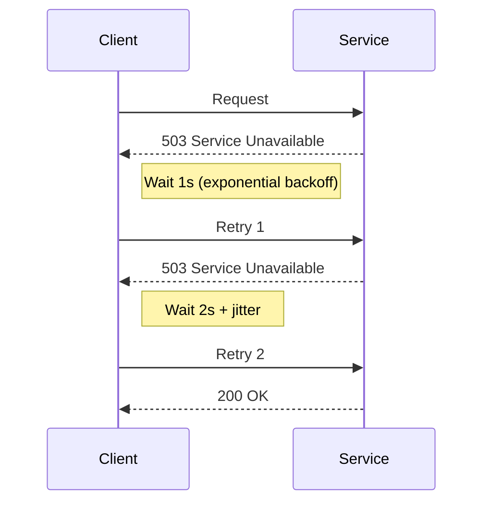
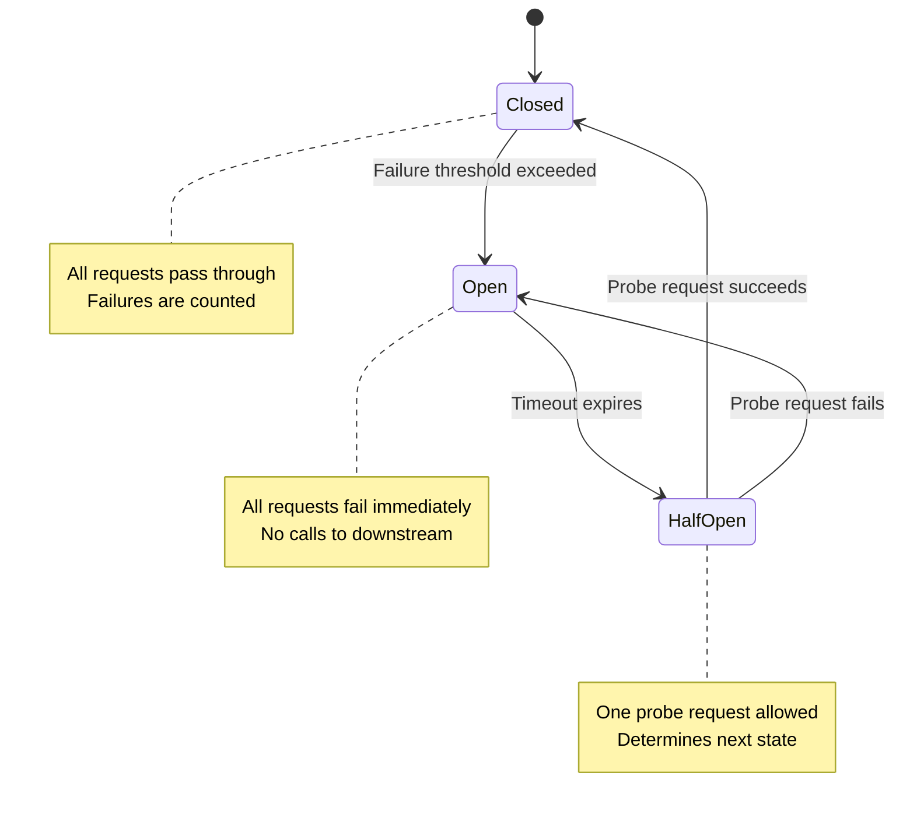
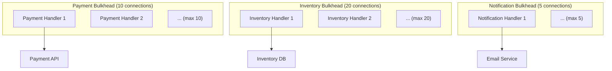
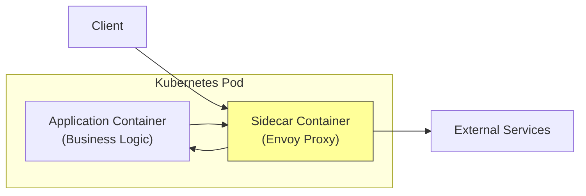
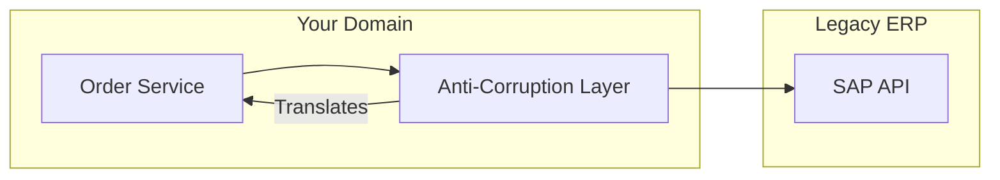
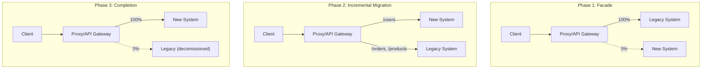
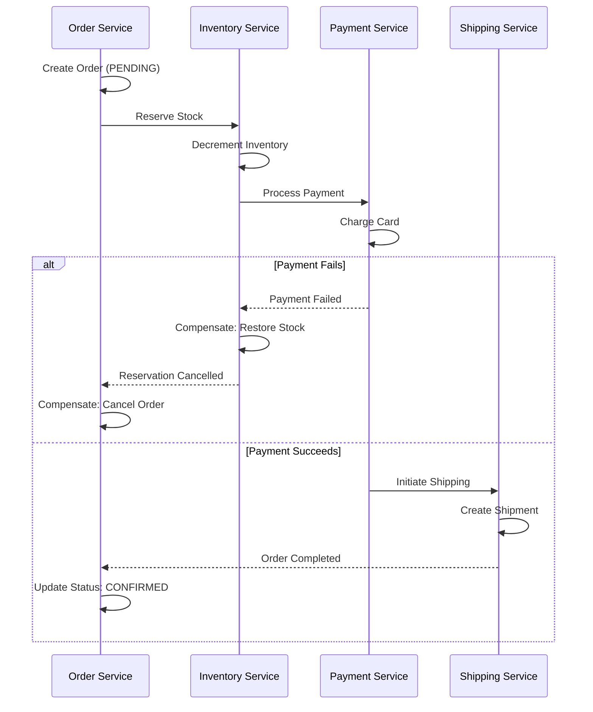
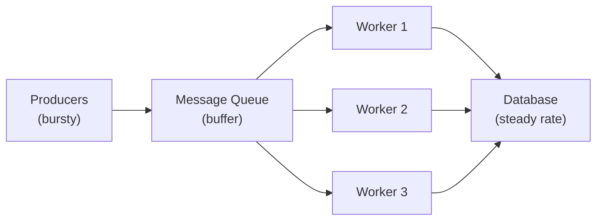
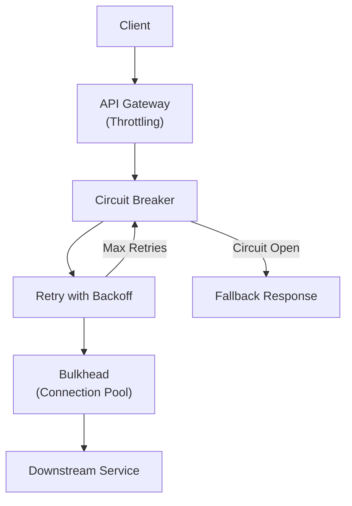

# Cloud Design Patterns

Distributed systems fail in ways that monoliths never do. Networks partition. Services go down. Latency spikes from 5ms to 5 seconds. Databases run out of connections. Message queues fill up. Third-party APIs return 500s for hours. A cloud design pattern is a repeatable solution to one of these failure modes — tested across millions of production systems, named so that engineers can communicate about resilience strategies without writing a novel.

These patterns are not academic. If you run services in production, you will implement most of them within your first year. The question is whether you implement them deliberately (before the outage) or reactively (at 3 AM while the pager is screaming).

## Resilience Patterns

### Retry Pattern

#### The Problem

Transient failures — network blips, momentary service overloads, DNS hiccups — are the most common failure mode in distributed systems. Most transient failures resolve within seconds. If you fail immediately on the first error, you create unnecessary user-facing failures.

#### The Pattern

Retry the failed operation with an appropriate strategy. The strategy determines how many times to retry, how long to wait between retries, and which failures are retryable.



#### TypeScript Implementation

```typescript
interface RetryOptions {
  maxRetries: number;
  baseDelayMs: number;
  maxDelayMs: number;
  retryableErrors?: (error: unknown) => boolean;
  onRetry?: (attempt: number, error: unknown, delayMs: number) => void;
}

async function withRetry<T>(
  fn: () => Promise<T>,
  options: RetryOptions,
): Promise<T> {
  const {
    maxRetries,
    baseDelayMs,
    maxDelayMs,
    retryableErrors = isRetryable,
    onRetry,
  } = options;

  let lastError: unknown;

  for (let attempt = 0; attempt <= maxRetries; attempt++) {
    try {
      return await fn();
    } catch (error) {
      lastError = error;

      if (attempt === maxRetries || !retryableErrors(error)) {
        throw error;
      }

      // Exponential backoff with full jitter
      const exponentialDelay = baseDelayMs * Math.pow(2, attempt);
      const jitter = Math.random() * exponentialDelay;
      const delay = Math.min(jitter, maxDelayMs);

      onRetry?.(attempt + 1, error, delay);
      await sleep(delay);
    }
  }

  throw lastError;
}

function isRetryable(error: unknown): boolean {
  if (error instanceof HttpError) {
    // Retry on server errors and rate limiting, not client errors
    return error.status >= 500 || error.status === 429;
  }
  if (error instanceof Error) {
    // Retry on network errors
    return ['ECONNREFUSED', 'ETIMEDOUT', 'ENOTFOUND'].includes(
      (error as NodeJS.ErrnoException).code ?? '',
    );
  }
  return false;
}

// Usage
const user = await withRetry(
  () => userService.findById('123'),
  {
    maxRetries: 3,
    baseDelayMs: 500,
    maxDelayMs: 10_000,
    onRetry: (attempt, error, delay) => {
      logger.warn({ attempt, error, delay }, 'Retrying request');
    },
  },
);
```

#### Go Implementation

```go
type RetryConfig struct {
    MaxRetries   int
    BaseDelay    time.Duration
    MaxDelay     time.Duration
    IsRetryable  func(error) bool
}

func WithRetry[T any](ctx context.Context, cfg RetryConfig, fn func(ctx context.Context) (T, error)) (T, error) {
    var lastErr error
    var zero T

    for attempt := 0; attempt <= cfg.MaxRetries; attempt++ {
        result, err := fn(ctx)
        if err == nil {
            return result, nil
        }
        lastErr = err

        if attempt == cfg.MaxRetries || (cfg.IsRetryable != nil && !cfg.IsRetryable(err)) {
            return zero, err
        }

        delay := time.Duration(float64(cfg.BaseDelay) * math.Pow(2, float64(attempt)))
        jitter := time.Duration(rand.Float64() * float64(delay))
        if jitter > cfg.MaxDelay {
            jitter = cfg.MaxDelay
        }

        select {
        case <-ctx.Done():
            return zero, ctx.Err()
        case <-time.After(jitter):
        }
    }
    return zero, lastErr
}
```

::: warning Retry Amplification
Retries can cause cascading failures. If Service A retries 3 times to Service B, and Service B retries 3 times to Service C, a failure in C generates 3 x 3 = 9 requests. Add more layers and the amplification becomes exponential. Always set a retry budget at the system level, and use circuit breakers to stop retrying when a service is clearly down.
:::

### Circuit Breaker Pattern

#### The Problem

When a downstream service is failing, continuing to send requests wastes resources, increases latency (because every request waits for a timeout), and prevents the failing service from recovering. You need a mechanism that detects failure and stops sending requests until the service recovers.

#### The Pattern

A circuit breaker monitors failures and transitions through three states:



#### TypeScript Implementation

```typescript
enum CircuitState {
  Closed = 'CLOSED',
  Open = 'OPEN',
  HalfOpen = 'HALF_OPEN',
}

interface CircuitBreakerOptions {
  failureThreshold: number;    // failures before opening
  recoveryTimeout: number;     // ms to wait before half-open
  monitorWindow: number;       // ms window for counting failures
  successThreshold: number;    // successes in half-open before closing
}

class CircuitBreaker {
  private state = CircuitState.Closed;
  private failures = 0;
  private successes = 0;
  private lastFailureTime = 0;
  private nextAttemptTime = 0;

  constructor(
    private readonly name: string,
    private readonly options: CircuitBreakerOptions,
  ) {}

  async execute<T>(fn: () => Promise<T>): Promise<T> {
    if (this.state === CircuitState.Open) {
      if (Date.now() < this.nextAttemptTime) {
        throw new CircuitOpenError(
          `Circuit ${this.name} is OPEN. Next attempt at ${new Date(this.nextAttemptTime).toISOString()}`,
        );
      }
      this.state = CircuitState.HalfOpen;
      this.successes = 0;
    }

    try {
      const result = await fn();
      this.onSuccess();
      return result;
    } catch (error) {
      this.onFailure();
      throw error;
    }
  }

  private onSuccess(): void {
    if (this.state === CircuitState.HalfOpen) {
      this.successes++;
      if (this.successes >= this.options.successThreshold) {
        this.state = CircuitState.Closed;
        this.failures = 0;
      }
    } else {
      this.failures = 0;
    }
  }

  private onFailure(): void {
    this.failures++;
    this.lastFailureTime = Date.now();

    if (this.failures >= this.options.failureThreshold) {
      this.state = CircuitState.Open;
      this.nextAttemptTime = Date.now() + this.options.recoveryTimeout;
    }
  }

  getState(): CircuitState { return this.state; }
}

// Usage
const paymentCircuit = new CircuitBreaker('payment-gateway', {
  failureThreshold: 5,
  recoveryTimeout: 30_000,
  monitorWindow: 60_000,
  successThreshold: 3,
});

async function chargeCustomer(amount: Money): Promise<PaymentResult> {
  return paymentCircuit.execute(() =>
    paymentGateway.charge(amount)
  );
}
```

### Throttling Pattern

Control the rate at which a system accepts requests. Throttling protects your service from being overwhelmed by legitimate traffic spikes or misbehaving clients.

```typescript
class TokenBucketThrottler {
  private tokens: number;
  private lastRefill: number;

  constructor(
    private readonly maxTokens: number,
    private readonly refillRate: number, // tokens per second
  ) {
    this.tokens = maxTokens;
    this.lastRefill = Date.now();
  }

  tryAcquire(): boolean {
    this.refill();
    if (this.tokens >= 1) {
      this.tokens -= 1;
      return true;
    }
    return false;
  }

  private refill(): void {
    const now = Date.now();
    const elapsed = (now - this.lastRefill) / 1000;
    this.tokens = Math.min(this.maxTokens, this.tokens + elapsed * this.refillRate);
    this.lastRefill = now;
  }
}
```

### Bulkhead Pattern

#### The Problem

A single slow dependency can consume all threads/connections in your application, causing every other feature to fail — even features that do not depend on the failing service. This is the "noisy neighbor" problem.

#### The Pattern

Bulkhead isolates different parts of the system into separate failure domains, like bulkheads in a ship. If one compartment floods, the others remain intact.



```typescript
class Bulkhead {
  private active = 0;

  constructor(
    private readonly name: string,
    private readonly maxConcurrent: number,
    private readonly maxQueue: number = 0,
  ) {}

  async execute<T>(fn: () => Promise<T>): Promise<T> {
    if (this.active >= this.maxConcurrent) {
      throw new BulkheadFullError(
        `Bulkhead ${this.name} is full (${this.active}/${this.maxConcurrent})`,
      );
    }

    this.active++;
    try {
      return await fn();
    } finally {
      this.active--;
    }
  }
}

// Usage — each dependency gets its own concurrency limit
const paymentBulkhead = new Bulkhead('payment', 10);
const inventoryBulkhead = new Bulkhead('inventory', 20);
const notificationBulkhead = new Bulkhead('notification', 5);

// If payment API is slow, it can only consume 10 connections
// Inventory and notification continue working normally
```

## Structural Patterns

### Sidecar Pattern

#### The Problem

You need to add cross-cutting capabilities (logging, monitoring, TLS termination, configuration reload) to your services. Embedding this logic in every service duplicates code and couples infrastructure concerns to business logic.

#### The Pattern

Deploy a helper process alongside each service instance. The sidecar shares the same lifecycle and network namespace as the main service but handles infrastructure concerns independently.



Real-world sidecars:
- **Envoy/Istio** — Traffic management, mTLS, observability
- **Fluentd/Filebeat** — Log collection and forwarding
- **Vault Agent** — Secret injection and rotation
- **CloudSQL Proxy** — Secure database connections in GCP

### Ambassador Pattern

A specialized sidecar that acts as an outbound proxy for a specific remote service. The ambassador handles connection pooling, retries, circuit breaking, and protocol translation — simplifying the main service's client code.

```yaml
# Kubernetes Pod with Ambassador sidecar
apiVersion: v1
kind: Pod
spec:
  containers:
    - name: app
      image: myapp:v1
      env:
        - name: REDIS_URL
          value: "localhost:6380"  # talks to ambassador, not Redis directly
    - name: redis-ambassador
      image: redis-ambassador:v1
      ports:
        - containerPort: 6380
      env:
        - name: REDIS_PRIMARY
          value: "redis-master.redis:6379"
        - name: REDIS_REPLICAS
          value: "redis-replica-0.redis:6379,redis-replica-1.redis:6379"
        # Ambassador handles read/write splitting, failover, connection pooling
```

### Anti-Corruption Layer

#### The Problem

You are integrating with a legacy system or third-party API that has a fundamentally different domain model. If you let the external model leak into your codebase, your domain becomes corrupted by concepts that do not belong.

#### The Pattern

Build a translation layer that converts between the external model and your internal model. Your domain code never sees the external model directly.



```typescript
// Legacy ERP returns data in its own model
interface SAPOrderResponse {
  VBELN: string;        // SAP order number
  KUNNR: string;        // customer number
  NETWR: string;        // net value (string!)
  WAERK: string;        // currency key
  ERDAT: string;        // creation date (YYYYMMDD)
  POSNR_VA: Array<{     // items
    MATNR: string;      // material number
    KWMENG: string;     // quantity (string!)
    NETPR: string;      // net price (string!)
  }>;
}

// Your clean domain model
interface Order {
  id: string;
  customerId: string;
  total: Money;
  createdAt: Date;
  items: OrderItem[];
}

// Anti-Corruption Layer — translates between worlds
class SAPOrderAdapter {
  constructor(private sapClient: SAPClient) {}

  async getOrder(orderId: string): Promise<Order> {
    const sapOrder = await this.sapClient.getOrder(orderId);
    return this.translate(sapOrder);
  }

  private translate(sap: SAPOrderResponse): Order {
    return {
      id: sap.VBELN,
      customerId: sap.KUNNR,
      total: Money.of(parseFloat(sap.NETWR), sap.WAERK),
      createdAt: this.parseDate(sap.ERDAT),
      items: sap.POSNR_VA.map(item => ({
        productId: item.MATNR,
        quantity: parseInt(item.KWMENG, 10),
        unitPrice: Money.of(parseFloat(item.NETPR), sap.WAERK),
      })),
    };
  }

  private parseDate(sapDate: string): Date {
    // SAP format: YYYYMMDD
    const year = parseInt(sapDate.slice(0, 4), 10);
    const month = parseInt(sapDate.slice(4, 6), 10) - 1;
    const day = parseInt(sapDate.slice(6, 8), 10);
    return new Date(year, month, day);
  }
}
```

This is closely related to the [Adapter pattern](/architecture-patterns/design-patterns/structural-patterns) and the [Anti-Corruption Layer in DDD](/architecture-patterns/domain-driven-design/anti-corruption-layer).

## Migration Patterns

### Strangler Fig Pattern

#### The Problem

You need to replace a legacy system with a new system, but you cannot do a big-bang rewrite. The legacy system is too large, too risky, and too business-critical to replace all at once.

#### The Pattern

Named after strangler fig trees that grow around a host tree and eventually replace it. You incrementally redirect functionality from the legacy system to the new system, one feature at a time, until the legacy system handles nothing and can be decommissioned.



```typescript
// API Gateway routing — gradual migration
const routes: RouteConfig[] = [
  // Already migrated — route to new system
  { path: '/api/users/*', target: 'https://users-service.internal' },
  { path: '/api/auth/*', target: 'https://auth-service.internal' },

  // In progress — canary deployment to new system
  {
    path: '/api/orders/*',
    targets: [
      { url: 'https://orders-service.internal', weight: 20 },  // new
      { url: 'https://legacy.internal/api/orders', weight: 80 }, // legacy
    ],
  },

  // Not yet migrated — route to legacy
  { path: '/api/products/*', target: 'https://legacy.internal/api/products' },
  { path: '/api/inventory/*', target: 'https://legacy.internal/api/inventory' },
];
```

::: tip Strangler Fig Success Factors
1. **Start with the API gateway** — Route all traffic through a single entry point before migrating anything.
2. **Migrate leaf services first** — Services with fewer dependencies are safer to migrate.
3. **Shadow traffic before switching** — Send traffic to both old and new systems, compare results, route real traffic only after confidence is established.
4. **Keep the legacy system working** — Do not modify the legacy system during migration. If you need to fix a bug, fix it in both systems.
:::

## Distributed Transaction Patterns

### Saga Pattern

#### The Problem

In a [microservices](/architecture-patterns/microservices/) architecture, a business operation often spans multiple services, each with its own database. You cannot use a traditional ACID transaction because there is no single transaction coordinator. You need a way to maintain data consistency across services without distributed transactions.

#### The Pattern

A Saga is a sequence of local transactions. Each service executes its local transaction and publishes an event. If any step fails, the saga executes compensating transactions to undo the work done by preceding steps.



#### Choreography-Based Saga

Each service listens for events and decides locally whether to act or compensate. There is no central coordinator.

```typescript
// Order Service — starts the saga
class OrderService {
  async createOrder(command: CreateOrderCommand): Promise<string> {
    const order = Order.create(command);
    order.setStatus('PENDING');
    await this.orderRepo.save(order);

    await this.eventBus.publish({
      type: 'OrderCreated',
      orderId: order.id,
      items: command.items,
      customerId: command.customerId,
    });

    return order.id;
  }

  // Compensating handler — triggered if downstream fails
  async onPaymentFailed(event: PaymentFailedEvent): Promise<void> {
    const order = await this.orderRepo.findById(event.orderId);
    if (!order) return;
    order.cancel(event.reason);
    await this.orderRepo.save(order);
  }
}

// Inventory Service — reacts to OrderCreated
class InventoryService {
  async onOrderCreated(event: OrderCreatedEvent): Promise<void> {
    try {
      const reservation = await this.reserveStock(event.items);
      await this.eventBus.publish({
        type: 'StockReserved',
        orderId: event.orderId,
        reservationId: reservation.id,
      });
    } catch (error) {
      await this.eventBus.publish({
        type: 'StockReservationFailed',
        orderId: event.orderId,
        reason: (error as Error).message,
      });
    }
  }

  // Compensating handler
  async onPaymentFailed(event: PaymentFailedEvent): Promise<void> {
    await this.releaseReservation(event.orderId);
  }
}
```

#### Orchestration-Based Saga

A central orchestrator (saga coordinator) tells each service what to do and handles compensation on failure.

```typescript
class CreateOrderSaga {
  private steps: SagaStep[] = [
    {
      name: 'reserveStock',
      execute: (ctx) => this.inventory.reserve(ctx.orderId, ctx.items),
      compensate: (ctx) => this.inventory.releaseReservation(ctx.orderId),
    },
    {
      name: 'processPayment',
      execute: (ctx) => this.payment.charge(ctx.customerId, ctx.total),
      compensate: (ctx) => this.payment.refund(ctx.paymentId),
    },
    {
      name: 'createShipment',
      execute: (ctx) => this.shipping.createShipment(ctx.orderId, ctx.address),
      compensate: (ctx) => this.shipping.cancelShipment(ctx.shipmentId),
    },
  ];

  async execute(command: CreateOrderCommand): Promise<SagaResult> {
    const context: SagaContext = { ...command, completedSteps: [] };

    for (const step of this.steps) {
      try {
        const result = await step.execute(context);
        Object.assign(context, result);
        context.completedSteps.push(step);
      } catch (error) {
        // Compensate in reverse order
        for (const completed of [...context.completedSteps].reverse()) {
          try {
            await completed.compensate(context);
          } catch (compensateError) {
            // Log and continue — compensation must be best-effort
            logger.error({ step: completed.name, error: compensateError },
              'Saga compensation failed — manual intervention required');
          }
        }
        return { success: false, error: (error as Error).message };
      }
    }

    return { success: true, orderId: context.orderId };
  }
}
```

| Aspect | Choreography | Orchestration |
|---|---|---|
| Coupling | Loose — services only know events | Tighter — orchestrator knows all steps |
| Complexity | Distributed — harder to trace | Centralized — easier to understand |
| Single point of failure | None | The orchestrator |
| Best for | Simple sagas (2-3 steps) | Complex sagas with branching logic |
| Observability | Requires distributed tracing | Saga state is visible in one place |

### Queue-Based Load Leveling

Buffer requests through a queue to protect a downstream service from traffic spikes. The queue absorbs bursts while workers process at a steady rate.



```typescript
// Producer — writes to queue at any rate
async function handleWebhook(req: Request): Promise<void> {
  await sqs.sendMessage({
    QueueUrl: process.env.PROCESSING_QUEUE,
    MessageBody: JSON.stringify(req.body),
  });
  // Return 202 Accepted immediately
}

// Consumer — processes at controlled rate
async function processMessage(message: SQSMessage): Promise<void> {
  const payload = JSON.parse(message.Body);
  await database.insert(payload); // database is protected from spikes
}
```

## Pattern Composition

In production systems, these patterns are composed together:



```typescript
// Composing resilience patterns
async function callPaymentService(request: PaymentRequest): Promise<PaymentResult> {
  // Layer 1: Circuit breaker — fail fast if service is down
  return paymentCircuit.execute(async () => {
    // Layer 2: Retry — handle transient failures
    return withRetry(
      async () => {
        // Layer 3: Bulkhead — limit concurrent calls
        return paymentBulkhead.execute(async () => {
          // Layer 4: Timeout — prevent hanging
          return withTimeout(
            () => httpClient.post('/payments', request),
            5000,
          );
        });
      },
      { maxRetries: 2, baseDelayMs: 500, maxDelayMs: 3000 },
    );
  });
}
```

::: tip Pattern Order Matters
The outermost pattern runs first. Circuit breaker should be outermost so that when the circuit is open, retries are not attempted. Bulkhead should be inside retry so that a retried request competes for the same pool. Timeout should be innermost so that each individual attempt has a time limit.
:::

## Further Reading

- [Microservices](/architecture-patterns/microservices/) — The architectural context where these patterns are essential
- [Event-Driven Architecture](/architecture-patterns/event-driven/) — Event patterns that complement resilience patterns
- [CQRS & Event Sourcing](/architecture-patterns/cqrs-event-sourcing/) — Saga pattern for distributed transactions in CQRS systems
- [Serverless Patterns](/architecture-patterns/cloud-native/serverless-patterns) — Applying these patterns in serverless architectures
- [Cloud-Native Overview](/architecture-patterns/cloud-native/) — The 12-Factor foundation these patterns build upon
- [Kubernetes](/infrastructure/kubernetes/) — Platform-level resilience with pod restarts and health checks