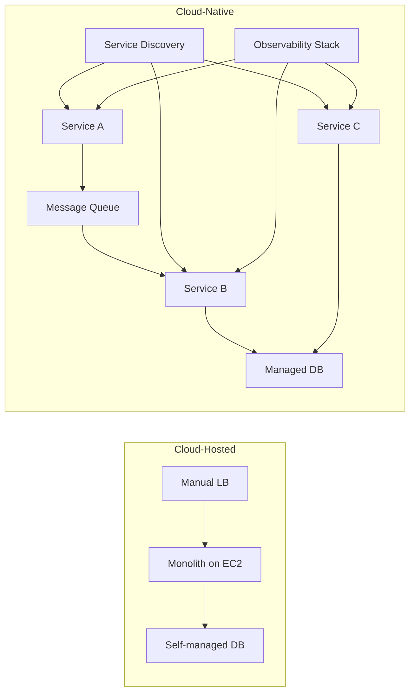
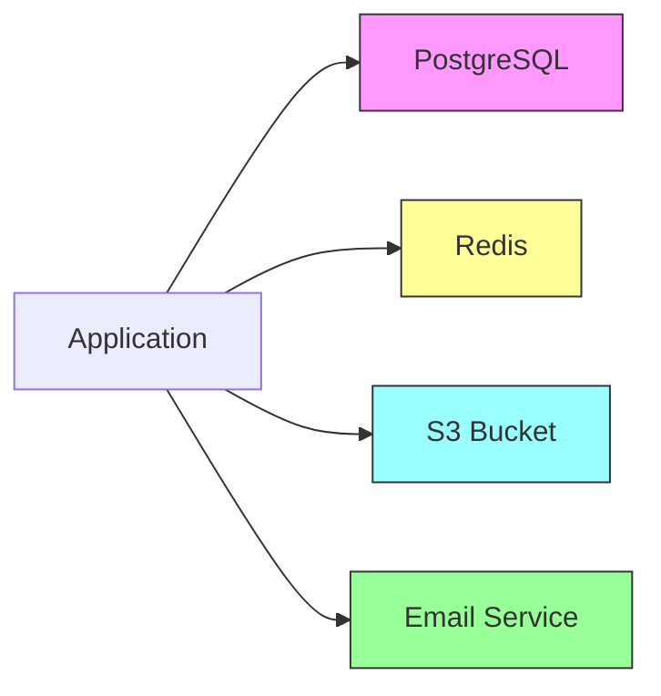
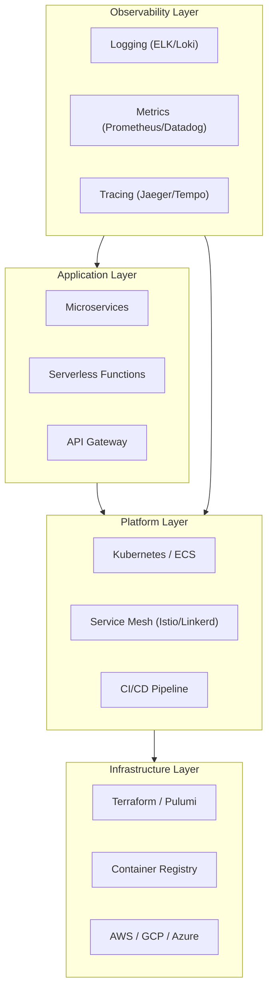

# Cloud-Native Architecture

Cloud-native is one of those terms that gets used so frequently and so loosely that it has nearly lost its meaning. Vendors call everything cloud-native. Job descriptions require cloud-native experience without defining what they mean. Conference talks use the term as an applause line.

Let us be precise. Cloud-native is not about running your application on AWS instead of a rack in a closet. It is not about using Kubernetes. It is not about microservices. It is a specific set of architectural principles and practices designed to exploit the advantages of cloud computing — namely, on-demand resources, horizontal scaling, and resilience through redundancy rather than redundancy through hardware.

## What Cloud-Native Actually Means

The Cloud Native Computing Foundation (CNCF) defines cloud-native systems as:

> Systems that are designed to be resilient, manageable, and observable. Combined with robust automation, they allow engineers to make high-impact changes frequently and predictably with minimal toil.

The key properties are:

1. **Containerized** — Each component is packaged in a container (or equivalent isolation unit) for reproducibility and portability.
2. **Dynamically orchestrated** — Containers are scheduled and managed by an orchestrator (Kubernetes, Nomad, ECS) that handles placement, scaling, and self-healing.
3. **Microservices-oriented** — The system is decomposed into loosely coupled services that can be developed, deployed, and scaled independently.
4. **Designed for failure** — Every component assumes other components will fail. Resilience is built in through retries, circuit breakers, timeouts, and graceful degradation.
5. **Observable** — Every component emits structured logs, metrics, and traces so that operators can understand system behavior without reading code.
6. **Immutable** — Infrastructure and deployments are immutable. You do not patch running instances — you deploy new ones.
7. **Declarative** — Desired state is declared (Terraform, Kubernetes manifests, Helm charts), and controllers reconcile actual state to match.

## Cloud-Native vs Cloud-Hosted

This distinction is critical. Most organizations that claim to be cloud-native are actually cloud-hosted — they have lifted their existing application onto EC2 instances or Cloud Run without changing the architecture.

| Aspect | Cloud-Hosted | Cloud-Native |
|---|---|---|
| **Deployment** | VM or container, single instance | Containers, multiple replicas, auto-scaled |
| **State** | In-process sessions, local disk | Externalized to managed services |
| **Scaling** | Vertical (bigger instance) | Horizontal (more instances) |
| **Failure model** | Prevent failure (HA pairs) | Expect failure (self-healing) |
| **Updates** | Blue-green or manual | Rolling, canary, progressive delivery |
| **Configuration** | Config files on disk | Environment variables, config maps, secrets managers |
| **Database** | Self-managed on VM | Managed service (RDS, Cloud SQL, Atlas) |
| **Networking** | Static IPs, load balancers | Service discovery, service mesh |
| **Observability** | Application logs to file | Structured logs + metrics + distributed traces |
| **Infrastructure** | ClickOps or scripts | Infrastructure as Code |



::: warning Lift-and-Shift Is Not Cloud-Native
Moving a monolith from on-premises to EC2 gives you cloud billing, not cloud benefits. You get the cost (pay-per-use, network egress charges) without the advantages (elastic scaling, self-healing, independent deployability). True cloud-native requires architectural change, not just infrastructure change.
:::

## The Twelve-Factor App

The twelve-factor methodology, published by Heroku in 2011, predates the cloud-native movement but remains its intellectual foundation. Every cloud-native system should satisfy these twelve factors.

### I. Codebase

**One codebase tracked in revision control, many deploys.**

A twelve-factor app has exactly one codebase per application, deployed to multiple environments (dev, staging, production). If you have multiple codebases, you have multiple apps — each should be a separate twelve-factor app that communicates via APIs.

```
# One repo, multiple deploy targets
main branch  -->  dev environment
             -->  staging environment
             -->  production environment
```

### II. Dependencies

**Explicitly declare and isolate dependencies.**

Never rely on system-level packages being installed. Use a dependency manifest (`package.json`, `go.mod`, `requirements.txt`, `pom.xml`) and a dependency isolation tool (node_modules, Go modules, virtualenv, Maven).

```json
{
  "dependencies": {
    "express": "^4.18.0",
    "pg": "^8.11.0",
    "redis": "^4.6.0"
  }
}
```

### III. Config

**Store config in the environment.**

Configuration that varies between deployments (database URLs, API keys, feature flags) must be stored in environment variables — not in config files checked into the repo.

```typescript
// GOOD — config from environment
const config = {
  databaseUrl: process.env.DATABASE_URL,
  redisUrl: process.env.REDIS_URL,
  apiKey: process.env.STRIPE_API_KEY,
  logLevel: process.env.LOG_LEVEL ?? 'info',
};

// BAD — hardcoded config
const config = {
  databaseUrl: 'postgresql://localhost:5432/myapp',
  redisUrl: 'redis://localhost:6379',
};
```

### IV. Backing Services

**Treat backing services as attached resources.**

A backing service (database, message queue, cache, SMTP server) should be attachable and detachable via configuration. Swapping a local PostgreSQL for Amazon RDS should require only a URL change — no code change.



### V. Build, Release, Run

**Strictly separate build and run stages.**

- **Build**: Converts code into an executable artifact (Docker image, compiled binary).
- **Release**: Combines the build with environment-specific config.
- **Run**: Executes the release in an environment.

You must never modify code at runtime. Every change goes through the build pipeline.

### VI. Processes

**Execute the app as one or more stateless processes.**

Any state that needs to persist must be stored in a backing service (database, Redis, S3). Processes can be started and stopped at any time without data loss. This enables horizontal scaling — you can run 1 instance or 100 instances of the same stateless process.

```typescript
// BAD — in-process state
const sessions = new Map<string, SessionData>(); // lost on restart

// GOOD — externalized state
const sessions = new RedisSessionStore(process.env.REDIS_URL);
```

### VII. Port Binding

**Export services via port binding.**

The app is completely self-contained and exports its service by binding to a port. It does not rely on an external web server like Apache or Nginx being injected into the runtime — it includes its own HTTP server.

```typescript
const app = express();
const port = parseInt(process.env.PORT ?? '3000', 10);
app.listen(port, () => console.log(`Listening on port ${port}`));
```

### VIII. Concurrency

**Scale out via the process model.**

Instead of scaling up (bigger instance), scale out (more instances). Different workload types run as different process types: web processes handle HTTP requests, worker processes handle background jobs, clock processes handle scheduled tasks.

```yaml
# Procfile — declares process types
web: node dist/server.js
worker: node dist/worker.js
clock: node dist/scheduler.js
```

### IX. Disposability

**Maximize robustness with fast startup and graceful shutdown.**

Processes should start quickly (seconds, not minutes) and shut down gracefully when they receive SIGTERM. Graceful shutdown means finishing in-flight requests, releasing database connections, and acknowledging pending messages.

```typescript
process.on('SIGTERM', async () => {
  console.log('SIGTERM received, shutting down gracefully');
  server.close(async () => {
    await pool.end();        // close database connections
    await redis.quit();      // close Redis connection
    process.exit(0);
  });

  // Force exit after 30 seconds
  setTimeout(() => process.exit(1), 30_000);
});
```

### X. Dev/Prod Parity

**Keep development, staging, and production as similar as possible.**

Minimize the gaps:
- **Time gap**: Deploy hours after writing code, not weeks.
- **Personnel gap**: Developers who write code should observe it in production.
- **Tooling gap**: Use the same backing services in dev and prod. Do not use SQLite in dev and PostgreSQL in prod.

::: tip Docker Compose for Parity
Docker Compose is the simplest way to achieve dev/prod parity for backing services. Run the same PostgreSQL version, the same Redis version, and the same message broker locally that you run in production. See [Docker Compose Patterns](/infrastructure/docker/compose-patterns) for production-ready configurations.
:::

### XI. Logs

**Treat logs as event streams.**

An application should write logs to `stdout` as a stream of events. It should never manage log files, log rotation, or log shipping. The execution environment captures the stream and routes it to the appropriate destination (CloudWatch, Datadog, Elasticsearch).

```typescript
// GOOD — structured JSON to stdout
const logger = pino({
  level: process.env.LOG_LEVEL ?? 'info',
  formatters: {
    level: (label) => ({ level: label }),
  },
});

logger.info({ orderId: '123', userId: '456' }, 'Order placed');
// {"level":"info","orderId":"123","userId":"456","msg":"Order placed","time":1711000000}
```

### XII. Admin Processes

**Run admin/management tasks as one-off processes.**

Database migrations, console sessions, and one-time scripts should run as one-off processes in an identical environment to the running app — same code, same config, same dependencies. Never SSH into production to run scripts manually.

```bash
# Run migrations as a one-off process
kubectl run migration --image=myapp:v1.2.3 --rm -it -- npm run migrate

# Or as a Kubernetes Job
kubectl apply -f migration-job.yaml
```

## Beyond Twelve Factors

The original twelve factors were written for Heroku-style PaaS in 2011. Modern cloud-native systems often add:

| Factor | Description |
|---|---|
| **API First** | Design the API contract before the implementation |
| **Telemetry** | Emit metrics, traces, and structured logs from every service |
| **Security** | Treat security as a first-class concern, not a bolt-on |
| **Ephemeral Compute** | Design for spot instances, preemptible VMs, and serverless |
| **GitOps** | Git as the single source of truth for infrastructure and config |

## Cloud-Native Technology Stack



## The Migration Path

Organizations rarely start cloud-native. They evolve through stages:

1. **Cloud-hosted monolith** — Lift-and-shift to VMs. Quick wins: managed databases, auto-scaling groups.
2. **Containerized monolith** — Package in Docker, deploy on ECS/Kubernetes. Gains: reproducibility, faster deploys.
3. **Modular monolith** — Enforce module boundaries inside the monolith. Gains: testability, team independence.
4. **Strangler Fig decomposition** — Extract high-value bounded contexts into services one at a time. Gains: independent deployment, targeted scaling.
5. **Fully cloud-native** — Independent services, event-driven communication, progressive delivery, full observability.

::: danger Do Not Skip Steps
Jumping from step 1 to step 5 is the most common and most expensive mistake in cloud-native adoption. Each step builds the organizational capabilities (CI/CD maturity, operational skills, monitoring infrastructure) needed for the next step. See the [Strangler Fig pattern](/architecture-patterns/cloud-native/cloud-design-patterns) for the incremental migration approach.
:::

## What's Next

This section covers the architectural patterns that make cloud-native systems work in production:

- [Serverless Patterns](/architecture-patterns/cloud-native/serverless-patterns) — Function composition, cold start mitigation, event-driven serverless, and anti-patterns
- [Cloud Design Patterns](/architecture-patterns/cloud-native/cloud-design-patterns) — Retry, Circuit Breaker, Sidecar, Strangler Fig, Saga, Bulkhead, and more

For the infrastructure that supports cloud-native architecture, see:

- [Kubernetes](/infrastructure/kubernetes/) — Container orchestration and self-healing
- [Docker](/infrastructure/docker/) — Containerization and multi-stage builds
- [Terraform](/infrastructure/terraform/) — Infrastructure as Code
- [Microservices](/architecture-patterns/microservices/) — Decomposition strategies and communication patterns
- [Event-Driven Architecture](/architecture-patterns/event-driven/) — Asynchronous communication between services