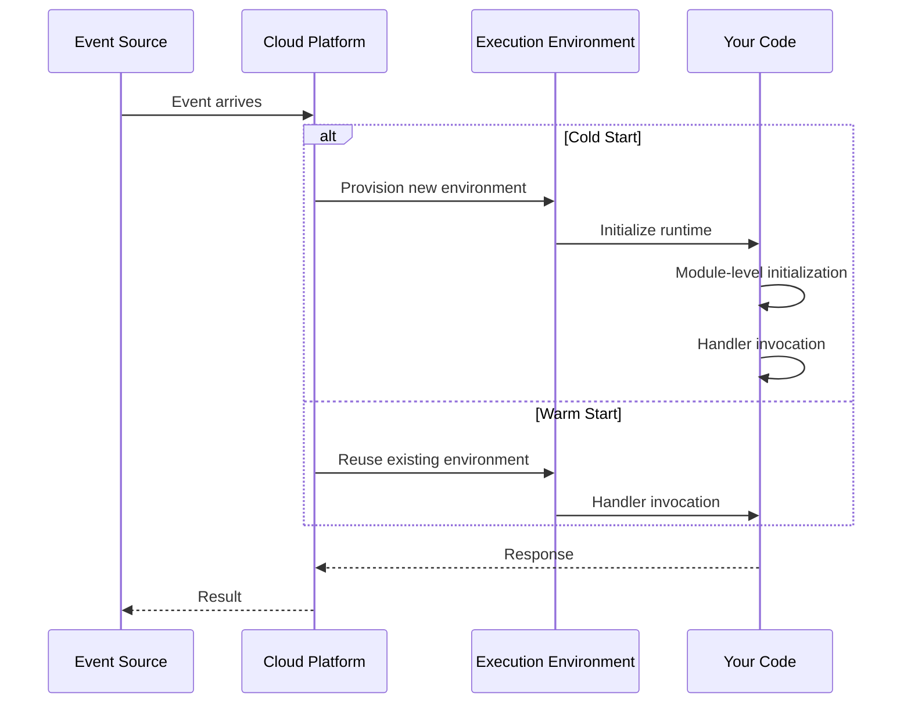
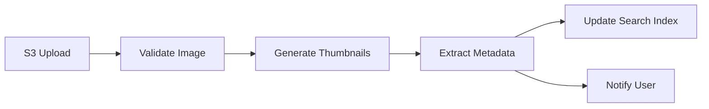
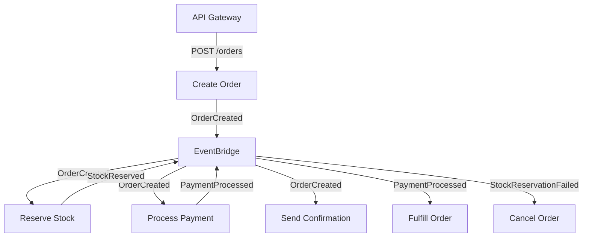

# Serverless Patterns

Serverless computing is the logical extreme of the cloud-native promise: you write functions, the platform handles everything else — provisioning, scaling, patching, and capacity planning. You pay only for what you use, measured in milliseconds and megabytes rather than hours and instances.

This sounds like magic, and like all magic, it has rules. Serverless forces architectural constraints that are genuinely different from containerized services: statelessness is not optional, cold starts are real, execution duration is bounded, and the mental model shifts from "long-running process" to "event handler." These constraints produce a distinct set of patterns and anti-patterns that you must understand before committing to serverless for a production workload.

## The Serverless Execution Model

Understanding the execution model is prerequisite to understanding every pattern in this section.



Key properties:
- **Event-triggered** — Functions execute in response to events: HTTP requests, queue messages, storage changes, scheduled timers, database streams.
- **Stateless execution** — Each invocation is independent. You cannot store state between invocations in memory or local disk (it may or may not persist).
- **Bounded duration** — AWS Lambda allows up to 15 minutes. Cloud Functions allows up to 60 minutes. Edge workers are typically limited to milliseconds.
- **Concurrent scaling** — The platform creates as many instances as needed, up to a concurrency limit. You go from 0 to 1,000 instances in seconds.
- **Pay-per-invocation** — You pay for the number of invocations and the duration of each invocation, not for idle capacity.

## Function Composition Patterns

### Single-Purpose Function

The most fundamental pattern: one function does one thing, triggered by one event type.

```typescript
// AWS Lambda — single-purpose function
import { SQSHandler } from 'aws-lambda';

export const processOrder: SQSHandler = async (event) => {
  for (const record of event.Records) {
    const order = JSON.parse(record.body) as OrderEvent;

    await validateOrder(order);
    await chargePayment(order);
    await updateInventory(order);
    await sendConfirmation(order);
  }
};
```

::: tip One Function, One Responsibility
Resist the temptation to build a "router function" that handles multiple event types. Each function should have a single trigger and a single purpose. This keeps functions small, independently deployable, and independently scalable.
:::

### Function Chaining (Sequential Pipeline)

Multiple functions execute in sequence, where each function's output is the next function's input. Use this when processing has distinct stages with different resource requirements or error handling needs.



#### AWS Step Functions (Recommended for Complex Chains)

```json
{
  "StartAt": "ValidateImage",
  "States": {
    "ValidateImage": {
      "Type": "Task",
      "Resource": "arn:aws:lambda:us-east-1:123:function:validate-image",
      "Next": "GenerateThumbnails",
      "Catch": [{
        "ErrorEquals": ["InvalidImageError"],
        "Next": "RejectImage"
      }]
    },
    "GenerateThumbnails": {
      "Type": "Task",
      "Resource": "arn:aws:lambda:us-east-1:123:function:generate-thumbnails",
      "Next": "ParallelPostProcessing"
    },
    "ParallelPostProcessing": {
      "Type": "Parallel",
      "Branches": [
        {
          "StartAt": "ExtractMetadata",
          "States": {
            "ExtractMetadata": {
              "Type": "Task",
              "Resource": "arn:aws:lambda:us-east-1:123:function:extract-metadata",
              "End": true
            }
          }
        },
        {
          "StartAt": "NotifyUser",
          "States": {
            "NotifyUser": {
              "Type": "Task",
              "Resource": "arn:aws:lambda:us-east-1:123:function:notify-user",
              "End": true
            }
          }
        }
      ],
      "Next": "UpdateSearchIndex"
    },
    "UpdateSearchIndex": {
      "Type": "Task",
      "Resource": "arn:aws:lambda:us-east-1:123:function:update-index",
      "End": true
    },
    "RejectImage": {
      "Type": "Task",
      "Resource": "arn:aws:lambda:us-east-1:123:function:reject-image",
      "End": true
    }
  }
}
```

### Fan-Out / Fan-In

A single event triggers multiple functions in parallel, and the results are aggregated. Use this for embarrassingly parallel workloads like batch processing, multi-provider search, or parallel API calls.

```typescript
// Fan-out: SNS topic triggers multiple Lambda functions
// Each subscriber processes the same event independently

// fan-out-publisher.ts
import { SNSClient, PublishCommand } from '@aws-sdk/client-sns';

const sns = new SNSClient({});

export async function publishOrderEvent(order: Order): Promise<void> {
  await sns.send(new PublishCommand({
    TopicArn: process.env.ORDER_TOPIC_ARN,
    Message: JSON.stringify(order),
    MessageAttributes: {
      eventType: { DataType: 'String', StringValue: 'OrderPlaced' },
    },
  }));
  // All subscribers receive this: inventory, analytics, notification, fraud detection
}

// fan-in-aggregator.ts — collects results from parallel processing
import { DynamoDBClient, QueryCommand } from '@aws-sdk/client-dynamodb';

export async function aggregateResults(batchId: string): Promise<BatchResult> {
  const db = new DynamoDBClient({});
  const results = await db.send(new QueryCommand({
    TableName: process.env.RESULTS_TABLE,
    KeyConditionExpression: 'batchId = :bid',
    ExpressionAttributeValues: { ':bid': { S: batchId } },
  }));

  const completed = results.Items?.length ?? 0;
  const expected = parseInt(process.env.EXPECTED_WORKERS ?? '0', 10);

  if (completed === expected) {
    return assembleReport(results.Items!);
  }

  return { status: 'pending', completed, expected };
}
```

### Event-Driven Choreography

Functions react to events independently without central orchestration. Each function publishes events that other functions may consume. This is the serverless equivalent of [Event Choreography](/architecture-patterns/event-driven/event-choreography).



```typescript
// EventBridge rule routes events to the right function
// Each function publishes its result back to EventBridge

import { EventBridgeClient, PutEventsCommand } from '@aws-sdk/client-eventbridge';

const eventBridge = new EventBridgeClient({});

export async function reserveStock(event: OrderCreatedEvent): Promise<void> {
  try {
    await inventory.reserve(event.detail.items);

    await eventBridge.send(new PutEventsCommand({
      Entries: [{
        Source: 'inventory-service',
        DetailType: 'StockReserved',
        Detail: JSON.stringify({
          orderId: event.detail.orderId,
          reservationId: crypto.randomUUID(),
        }),
      }],
    }));
  } catch (error) {
    await eventBridge.send(new PutEventsCommand({
      Entries: [{
        Source: 'inventory-service',
        DetailType: 'StockReservationFailed',
        Detail: JSON.stringify({
          orderId: event.detail.orderId,
          reason: (error as Error).message,
        }),
      }],
    }));
  }
}
```

## Cold Starts and Mitigation

Cold starts are the most discussed operational concern in serverless. A cold start occurs when the platform must provision a new execution environment — downloading the code, starting the runtime, initializing the module, and running your initialization code.

### Cold Start Duration by Runtime

| Runtime | Typical Cold Start | With VPC | Notes |
|---|---|---|---|
| Node.js | 100-500ms | 200-800ms | Fastest cold starts |
| Python | 150-600ms | 250-900ms | Depends on imports |
| Go | 50-200ms | 100-400ms | Compiled, minimal runtime |
| Java | 1-8 seconds | 2-10 seconds | JVM startup dominates |
| .NET | 500ms-3s | 1-5s | GraalVM Native helps |
| Rust | 50-150ms | 100-300ms | Comparable to Go |

### Mitigation Strategies

#### 1. Provisioned Concurrency (AWS Lambda)

Pre-warms a specified number of execution environments. Eliminates cold starts for provisioned instances but costs money even when idle.

```yaml
# serverless.yml
functions:
  api:
    handler: dist/handler.main
    provisionedConcurrency: 5  # 5 warm instances always ready
    events:
      - httpApi: '*'
```

::: warning Cost of Provisioned Concurrency
Provisioned concurrency charges for the provisioned instances whether they receive traffic or not. Use it for latency-critical functions (API endpoints, payment processing) and skip it for background workers where cold start latency is acceptable.
:::

#### 2. Minimal Bundle Size

Smaller deployment packages mean faster downloads and faster module initialization.

```typescript
// vite.config.ts — bundle for Lambda
import { defineConfig } from 'vite';

export default defineConfig({
  build: {
    target: 'node20',
    lib: { entry: 'src/handler.ts', formats: ['es'] },
    rollupOptions: {
      external: ['@aws-sdk/client-dynamodb'], // AWS SDK v3 is in the Lambda runtime
    },
    minify: true,
    sourcemap: true,
  },
});
```

#### 3. Lazy Initialization

Defer expensive initialization until the first invocation that actually needs it, rather than doing it at module load time.

```typescript
// Module-level: runs during cold start
let dbPool: Pool | null = null;

function getPool(): Pool {
  if (!dbPool) {
    dbPool = new Pool({
      connectionString: process.env.DATABASE_URL,
      max: 1, // Lambda runs one request at a time
    });
  }
  return dbPool;
}

// Handler: runs every invocation
export const handler = async (event: APIGatewayProxyEvent) => {
  const pool = getPool(); // lazy init on first call, reused after
  const users = await pool.query('SELECT * FROM users LIMIT 10');
  return { statusCode: 200, body: JSON.stringify(users.rows) };
};
```

#### 4. SnapStart (AWS Lambda for Java)

AWS Lambda SnapStart takes a snapshot of the initialized execution environment after the init phase and restores from the snapshot on cold start, reducing Java cold starts from seconds to milliseconds.

#### 5. Keep-Alive Pings

Schedule a CloudWatch Events rule to invoke the function every 5-10 minutes to keep it warm. This is a hack — provisioned concurrency is the proper solution — but it works for low-budget scenarios.

## Platform-Specific Patterns

### AWS Lambda

Lambda is the most mature serverless platform with the broadest event source integration.

```typescript
// Lambda with API Gateway v2 (HTTP API)
import { APIGatewayProxyHandlerV2 } from 'aws-lambda';

export const handler: APIGatewayProxyHandlerV2 = async (event) => {
  const { pathParameters, body, requestContext } = event;
  const userId = pathParameters?.id;

  switch (requestContext.http.method) {
    case 'GET':
      const user = await userService.findById(userId!);
      return { statusCode: 200, body: JSON.stringify(user) };
    case 'PUT':
      const updates = JSON.parse(body ?? '{}');
      await userService.update(userId!, updates);
      return { statusCode: 204 };
    default:
      return { statusCode: 405 };
  }
};
```

### Cloudflare Workers (Edge Serverless)

Workers run on Cloudflare's edge network — in 300+ data centers worldwide. Cold starts are under 5ms because Workers use V8 isolates instead of containers.

```typescript
// Cloudflare Worker — runs at the edge
export default {
  async fetch(request: Request, env: Env): Promise<Response> {
    const url = new URL(request.url);

    if (url.pathname.startsWith('/api/')) {
      return handleAPI(request, env);
    }

    // Edge caching with stale-while-revalidate
    const cacheKey = new Request(url.toString(), request);
    const cache = caches.default;
    let response = await cache.match(cacheKey);

    if (!response) {
      response = await fetch(request);
      response = new Response(response.body, response);
      response.headers.set('Cache-Control', 's-maxage=60, stale-while-revalidate=300');
      await cache.put(cacheKey, response.clone());
    }

    return response;
  },
};

async function handleAPI(request: Request, env: Env): Promise<Response> {
  // Use Durable Objects for state, D1 for SQL, KV for key-value
  const db = env.DB; // D1 database binding
  const result = await db.prepare('SELECT * FROM users WHERE id = ?')
    .bind(request.headers.get('x-user-id'))
    .first();

  return Response.json(result);
}
```

### Vercel Functions (Web-Optimized Serverless)

```typescript
// Vercel Edge Function — runs on Vercel's edge network
export const config = { runtime: 'edge' };

export default async function handler(request: Request): Promise<Response> {
  const { searchParams } = new URL(request.url);
  const query = searchParams.get('q');

  const results = await fetch(`${process.env.SEARCH_API}/search?q=${query}`);
  return new Response(results.body, {
    headers: { 'Content-Type': 'application/json' },
  });
}
```

## Serverless Anti-Patterns

### The Lambda Monolith

Putting your entire Express/Fastify app inside a single Lambda function. You lose all benefits of serverless (per-function scaling, per-function monitoring, per-function permissions) and gain all the downsides (large cold starts, coarse-grained IAM, coupled deployment).

```typescript
// BAD — Lambda monolith
import express from 'express';
import serverless from 'serverless-http';

const app = express();
app.get('/users', handleUsers);
app.get('/orders', handleOrders);
app.get('/products', handleProducts);
app.post('/payments', handlePayments);
// ... 50 more routes

export const handler = serverless(app);
```

::: danger Lambda Monolith
If your Lambda function has more than 3-4 routes, you are building a monolith inside a serverless platform. Split into separate functions per resource or per use case. Each function gets its own IAM role (least privilege), its own scaling behavior, and its own cold start profile.
:::

### Synchronous Chains

Calling Lambda from Lambda synchronously creates tight coupling, compounded latency, and doubled costs (both functions run concurrently during the call).

```typescript
// BAD — synchronous Lambda-to-Lambda
export const processOrder = async (event: any) => {
  const inventory = await lambda.invoke({
    FunctionName: 'check-inventory',
    Payload: JSON.stringify(event),
  }).promise();

  const payment = await lambda.invoke({
    FunctionName: 'process-payment',
    Payload: JSON.stringify({ ...event, inventory: JSON.parse(inventory.Payload!) }),
  }).promise();
  // Latency = Lambda1 + Lambda2 + Lambda3, cost = all running simultaneously
};

// GOOD — async via queue or Step Functions
export const processOrder = async (event: any) => {
  await sqs.sendMessage({
    QueueUrl: process.env.INVENTORY_QUEUE_URL,
    MessageBody: JSON.stringify(event),
  }).promise();
  // Returns immediately, downstream functions process asynchronously
};
```

### Unbounded Concurrency

Lambda scales to thousands of concurrent instances by default. If your function writes to a database with a connection limit of 100, 1,000 concurrent Lambdas will overwhelm it.

```typescript
// Solution: Use RDS Proxy or connection pooling
const pool = new Pool({
  connectionString: process.env.DATABASE_URL, // Points to RDS Proxy
  max: 1, // Each Lambda instance gets ONE connection
});
```

### Function as Database

Using Lambda invocations to serve data that should live in a database or cache. If your function exists solely to read from DynamoDB and return JSON, consider API Gateway's direct DynamoDB integration — no Lambda needed.

## Cost Optimization

| Strategy | Impact | Complexity |
|---|---|---|
| Right-size memory allocation | High — CPU scales with memory | Low |
| Minimize bundle size | Medium — faster cold starts | Low |
| Use ARM64 (Graviton) | 20% cheaper, 15% faster | Low |
| Batch SQS processing | High — amortize invocation cost | Medium |
| Use reserved concurrency | Prevents runaway scaling costs | Low |
| DynamoDB over RDS | Eliminates connection pooling issues | Medium |
| Step Functions Express for high-volume | 25x cheaper than Standard for short workflows | Medium |

## Further Reading

- [Cloud Design Patterns](/architecture-patterns/cloud-native/cloud-design-patterns) — Retry, Circuit Breaker, and Saga patterns for serverless
- [Cloud-Native Overview](/architecture-patterns/cloud-native/) — 12-Factor principles that underpin serverless
- [Event-Driven Architecture](/architecture-patterns/event-driven/) — Event patterns that trigger serverless functions
- [AWS Lambda](/infrastructure/aws/lambda) — AWS-specific Lambda deep dive
- [Microservices](/architecture-patterns/microservices/) — When to use serverless vs. containers