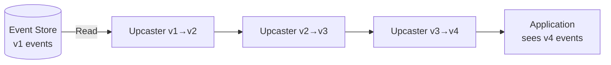
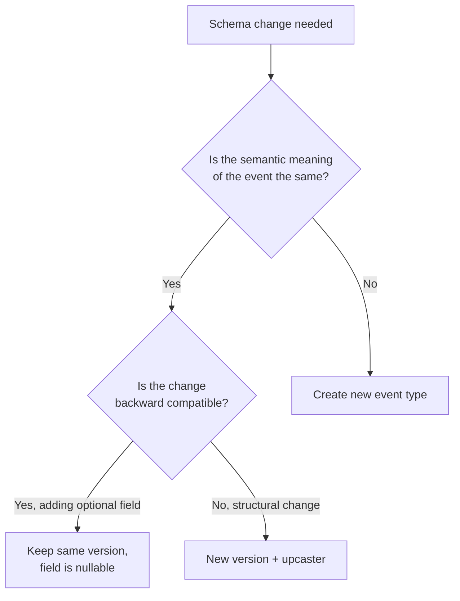

# Event Upcasting — Schema Evolution for Events

## Why Upcasting Exists

In a traditional database, when you change a schema, you write a migration that transforms existing data in place. In an event-sourced system, **events are immutable** — you never modify them. They are the historical record of what happened, and changing them would violate the fundamental contract of event sourcing.

But business requirements change. An `OrderPlaced` event that was sufficient in 2024 may lack fields required in 2026. A field that was a string might need to become a structured object. An event that contained a single address might need to contain multiple addresses.

**Upcasting** is the process of transforming old event schemas into newer versions at read time, without modifying the stored events. When an event is loaded from the store, it passes through a chain of upcasters that progressively transform it from its original version to the latest version.



### The Alternative: Lazy Migration

Some systems take the approach of migrating all events in the store when the schema changes. This is:

1. **Expensive**: Billions of events may need rewriting
2. **Risky**: A bug in migration corrupts the immutable event log
3. **Slow**: Migration can take hours/days for large stores
4. **Violates immutability**: Events should never change

Upcasting avoids all of these by transforming events on-the-fly during reads.

## First Principles

### Event Versioning

Every event type has a **schema version**. When the schema changes, the version increments:

```
OrderPlaced_v1: { orderId, customerId, total }
OrderPlaced_v2: { orderId, customerId, total, currency }     ← added field
OrderPlaced_v3: { orderId, customerId, amount: { value, currency } } ← restructured
```

New events are always written at the latest version. Old events remain at their original version in the store.

### The Upcasting Function

An upcaster is a pure function that transforms an event from version $n$ to version $n+1$:

$$
U_n: E_n \rightarrow E_{n+1}
$$

A chain of upcasters transforms from version $i$ to version $j$:

$$
U_{i \rightarrow j} = U_{j-1} \circ U_{j-2} \circ \ldots \circ U_i
$$

This composition is associative, which allows upcasters to be chained freely.

### Properties of Good Upcasters

1. **Pure**: No side effects, no I/O, deterministic
2. **Total**: Handles every possible input of the source version
3. **Non-lossy**: Does not discard information (when possible)
4. **Composable**: Can be chained with other upcasters
5. **Fast**: Must execute in microseconds (runs on every event load)

## Core Mechanics

### Event Envelope

Every stored event includes metadata about its version:

```typescript
// domain/events/event-envelope.ts
export interface EventEnvelope {
  /** Unique event identifier */
  eventId: string;
  /** Type of the event (e.g., 'OrderPlaced') */
  eventType: string;
  /** Schema version of this specific stored event */
  schemaVersion: number;
  /** The aggregate this event belongs to */
  aggregateId: string;
  /** Aggregate type (e.g., 'Order') */
  aggregateType: string;
  /** Position in the aggregate's event stream */
  aggregateVersion: number;
  /** The event payload (shape depends on schemaVersion) */
  payload: Record<string, unknown>;
  /** Event metadata (correlationId, causationId, userId, etc.) */
  metadata: Record<string, unknown>;
  /** When the event was stored */
  timestamp: Date;
}
```

### The Upcaster Interface

```typescript
// infrastructure/upcasting/upcaster.ts
export interface Upcaster {
  /** The event type this upcaster handles */
  readonly eventType: string;
  /** The version this upcaster transforms FROM */
  readonly fromVersion: number;
  /** The version this upcaster transforms TO */
  readonly toVersion: number;

  /**
   * Transform the event payload from fromVersion to toVersion.
   * Must be a pure function.
   */
  upcast(payload: Record<string, unknown>): Record<string, unknown>;
}
```

### Upcaster Chain

```typescript
// infrastructure/upcasting/upcaster-chain.ts
import type { Upcaster } from './upcaster';
import type { EventEnvelope } from '../../domain/events/event-envelope';

export class UpcasterChain {
  private upcasters: Map<string, Upcaster[]> = new Map();
  private latestVersions: Map<string, number> = new Map();

  register(upcaster: Upcaster): void {
    const key = upcaster.eventType;
    const chain = this.upcasters.get(key) ?? [];
    chain.push(upcaster);
    // Sort by fromVersion to ensure correct ordering
    chain.sort((a, b) => a.fromVersion - b.fromVersion);
    this.upcasters.set(key, chain);

    // Track latest version per event type
    const currentLatest = this.latestVersions.get(key) ?? 1;
    this.latestVersions.set(key, Math.max(currentLatest, upcaster.toVersion));
  }

  /**
   * Upcast an event envelope to the latest schema version.
   * Returns a new envelope with the transformed payload and updated schemaVersion.
   */
  upcast(envelope: EventEnvelope): EventEnvelope {
    const chain = this.upcasters.get(envelope.eventType);
    if (!chain || chain.length === 0) {
      return envelope; // No upcasters registered for this type
    }

    let currentPayload = { ...envelope.payload };
    let currentVersion = envelope.schemaVersion;

    for (const upcaster of chain) {
      if (upcaster.fromVersion === currentVersion) {
        currentPayload = upcaster.upcast(currentPayload);
        currentVersion = upcaster.toVersion;
      }
    }

    return {
      ...envelope,
      payload: currentPayload,
      schemaVersion: currentVersion,
    };
  }

  /**
   * Get the latest schema version for an event type.
   */
  getLatestVersion(eventType: string): number {
    return this.latestVersions.get(eventType) ?? 1;
  }

  /**
   * Upcast a batch of events (optimized for event stream loading).
   */
  upcastAll(envelopes: EventEnvelope[]): EventEnvelope[] {
    return envelopes.map((e) => this.upcast(e));
  }
}
```

### Concrete Upcasters

```typescript
// infrastructure/upcasting/order-placed-upcasters.ts
import type { Upcaster } from './upcaster';

/**
 * v1 → v2: Added 'currency' field.
 * v1 did not include currency (assumed USD).
 */
export class OrderPlacedV1ToV2 implements Upcaster {
  readonly eventType = 'OrderPlaced';
  readonly fromVersion = 1;
  readonly toVersion = 2;

  upcast(payload: Record<string, unknown>): Record<string, unknown> {
    return {
      ...payload,
      currency: 'USD', // Default for legacy events
    };
  }
}

/**
 * v2 → v3: Restructured 'total' + 'currency' into 'amount' object.
 * v2: { orderId, customerId, total: 99.99, currency: 'USD' }
 * v3: { orderId, customerId, amount: { value: 99.99, currency: 'USD' } }
 */
export class OrderPlacedV2ToV3 implements Upcaster {
  readonly eventType = 'OrderPlaced';
  readonly fromVersion = 2;
  readonly toVersion = 3;

  upcast(payload: Record<string, unknown>): Record<string, unknown> {
    const { total, currency, ...rest } = payload;
    return {
      ...rest,
      amount: {
        value: total,
        currency: currency,
      },
    };
  }
}

/**
 * v3 → v4: Added 'items' array and 'shippingAddress'.
 * Old events did not include line items or address.
 */
export class OrderPlacedV3ToV4 implements Upcaster {
  readonly eventType = 'OrderPlaced';
  readonly fromVersion = 3;
  readonly toVersion = 4;

  upcast(payload: Record<string, unknown>): Record<string, unknown> {
    return {
      ...payload,
      items: [], // Unknown for legacy events
      shippingAddress: null, // Unknown for legacy events
      itemCount: 0,
    };
  }
}

/**
 * v4 → v5: Renamed 'customerId' to 'buyerId' (ubiquitous language change).
 */
export class OrderPlacedV4ToV5 implements Upcaster {
  readonly eventType = 'OrderPlaced';
  readonly fromVersion = 4;
  readonly toVersion = 5;

  upcast(payload: Record<string, unknown>): Record<string, unknown> {
    const { customerId, ...rest } = payload;
    return {
      ...rest,
      buyerId: customerId,
    };
  }
}
```

### Registering Upcasters

```typescript
// infrastructure/upcasting/register-upcasters.ts
import { UpcasterChain } from './upcaster-chain';
import {
  OrderPlacedV1ToV2,
  OrderPlacedV2ToV3,
  OrderPlacedV3ToV4,
  OrderPlacedV4ToV5,
} from './order-placed-upcasters';
import { CustomerAddressChangedV1ToV2 } from './customer-address-changed-upcasters';
import { PaymentProcessedV1ToV2 } from './payment-processed-upcasters';

export function createUpcasterChain(): UpcasterChain {
  const chain = new UpcasterChain();

  // OrderPlaced: v1 → v5
  chain.register(new OrderPlacedV1ToV2());
  chain.register(new OrderPlacedV2ToV3());
  chain.register(new OrderPlacedV3ToV4());
  chain.register(new OrderPlacedV4ToV5());

  // CustomerAddressChanged: v1 → v2
  chain.register(new CustomerAddressChangedV1ToV2());

  // PaymentProcessed: v1 → v2
  chain.register(new PaymentProcessedV1ToV2());

  return chain;
}
```

### Integration with Event Store

```typescript
// infrastructure/persistence/event-store.ts
import type { Pool } from 'pg';
import type { UpcasterChain } from '../upcasting/upcaster-chain';
import type { EventEnvelope } from '../../domain/events/event-envelope';

export class PostgresEventStore {
  constructor(
    private readonly pool: Pool,
    private readonly upcasterChain: UpcasterChain,
  ) {}

  async loadEvents(
    aggregateId: string,
    fromVersion: number = 0,
  ): Promise<EventEnvelope[]> {
    const result = await this.pool.query(
      `SELECT event_id, event_type, schema_version, aggregate_id,
              aggregate_type, aggregate_version, payload, metadata, created_at
       FROM events
       WHERE aggregate_id = $1 AND aggregate_version >= $2
       ORDER BY aggregate_version ASC`,
      [aggregateId, fromVersion],
    );

    const rawEnvelopes: EventEnvelope[] = result.rows.map((row) => ({
      eventId: row.event_id,
      eventType: row.event_type,
      schemaVersion: row.schema_version,
      aggregateId: row.aggregate_id,
      aggregateType: row.aggregate_type,
      aggregateVersion: row.aggregate_version,
      payload: JSON.parse(row.payload),
      metadata: JSON.parse(row.metadata),
      timestamp: row.created_at,
    }));

    // Upcast all events to their latest schema versions
    return this.upcasterChain.upcastAll(rawEnvelopes);
  }

  async appendEvents(
    aggregateId: string,
    aggregateType: string,
    events: Array<{
      eventType: string;
      payload: Record<string, unknown>;
      metadata?: Record<string, unknown>;
    }>,
    expectedVersion: number,
  ): Promise<void> {
    const client = await this.pool.connect();
    try {
      await client.query('BEGIN');

      // Optimistic concurrency check
      const versionCheck = await client.query(
        `SELECT COALESCE(MAX(aggregate_version), -1) as max_ver
         FROM events WHERE aggregate_id = $1`,
        [aggregateId],
      );

      if (parseInt(versionCheck.rows[0].max_ver) !== expectedVersion) {
        throw new ConcurrencyError(aggregateId, expectedVersion);
      }

      let version = expectedVersion;
      for (const event of events) {
        version++;
        const schemaVersion = this.upcasterChain.getLatestVersion(event.eventType);

        await client.query(
          `INSERT INTO events (event_id, event_type, schema_version, aggregate_id,
                              aggregate_type, aggregate_version, payload, metadata, created_at)
           VALUES ($1, $2, $3, $4, $5, $6, $7, $8, NOW())`,
          [
            crypto.randomUUID(),
            event.eventType,
            schemaVersion, // Always write at latest version
            aggregateId,
            aggregateType,
            version,
            JSON.stringify(event.payload),
            JSON.stringify(event.metadata ?? {}),
          ],
        );
      }

      await client.query('COMMIT');
    } catch (error) {
      await client.query('ROLLBACK');
      throw error;
    } finally {
      client.release();
    }
  }
}
```

## Common Schema Evolution Patterns

### Pattern 1: Add a Field

The simplest and most common change — add a new field with a default value:

```typescript
// v1: { orderId, customerId, total }
// v2: { orderId, customerId, total, priority }
export class AddPriorityField implements Upcaster {
  readonly eventType = 'OrderPlaced';
  readonly fromVersion = 1;
  readonly toVersion = 2;

  upcast(payload: Record<string, unknown>): Record<string, unknown> {
    return { ...payload, priority: 'normal' };
  }
}
```

### Pattern 2: Remove a Field

When removing a field, the upcaster simply omits it:

```typescript
// v2: { orderId, customerId, total, legacyField }
// v3: { orderId, customerId, total }
export class RemoveLegacyField implements Upcaster {
  readonly eventType = 'OrderPlaced';
  readonly fromVersion = 2;
  readonly toVersion = 3;

  upcast(payload: Record<string, unknown>): Record<string, unknown> {
    const { legacyField, ...rest } = payload;
    return rest;
  }
}
```

::: warning
Removing fields loses information. If the field might be needed later, keep it in the event and handle it as optional in the consumer.
:::

### Pattern 3: Rename a Field

```typescript
// v1: { orderId, customer_id, total }
// v2: { orderId, customerId, total }
export class RenameCustomerIdField implements Upcaster {
  readonly eventType = 'OrderPlaced';
  readonly fromVersion = 1;
  readonly toVersion = 2;

  upcast(payload: Record<string, unknown>): Record<string, unknown> {
    const { customer_id, ...rest } = payload;
    return { ...rest, customerId: customer_id };
  }
}
```

### Pattern 4: Change Field Type

```typescript
// v1: { orderId, total: "99.99" }   ← string
// v2: { orderId, total: 99.99 }     ← number
export class ChangeToNumberField implements Upcaster {
  readonly eventType = 'OrderPlaced';
  readonly fromVersion = 1;
  readonly toVersion = 2;

  upcast(payload: Record<string, unknown>): Record<string, unknown> {
    return {
      ...payload,
      total: typeof payload.total === 'string'
        ? parseFloat(payload.total as string)
        : payload.total,
    };
  }
}
```

### Pattern 5: Restructure (Flatten or Nest)

```typescript
// v1: { orderId, street, city, state, zip }
// v2: { orderId, address: { street, city, state, zip } }
export class NestAddressFields implements Upcaster {
  readonly eventType = 'OrderPlaced';
  readonly fromVersion = 1;
  readonly toVersion = 2;

  upcast(payload: Record<string, unknown>): Record<string, unknown> {
    const { street, city, state, zip, ...rest } = payload;
    return {
      ...rest,
      address: { street, city, state, postalCode: zip },
    };
  }
}
```

### Pattern 6: Split Event into Multiple Events

Sometimes an event needs to become two events. This requires a special upcaster that returns multiple events:

```typescript
// infrastructure/upcasting/splitting-upcaster.ts
export interface SplittingUpcaster {
  readonly eventType: string;
  readonly fromVersion: number;

  /**
   * Transform one event into one or more events.
   */
  upcast(envelope: EventEnvelope): EventEnvelope[];
}

export class OrderPlacedSplitter implements SplittingUpcaster {
  readonly eventType = 'OrderPlacedWithPayment';
  readonly fromVersion = 1;

  /**
   * v1 combined order placement and payment into a single event.
   * Split into OrderPlaced + PaymentReceived.
   */
  upcast(envelope: EventEnvelope): EventEnvelope[] {
    const { paymentId, paymentAmount, paymentMethod, ...orderPayload } = envelope.payload;

    return [
      {
        ...envelope,
        eventType: 'OrderPlaced',
        schemaVersion: 1,
        payload: orderPayload,
      },
      {
        ...envelope,
        eventId: `${envelope.eventId}-payment`,
        eventType: 'PaymentReceived',
        schemaVersion: 1,
        payload: {
          orderId: envelope.aggregateId,
          paymentId,
          amount: paymentAmount,
          method: paymentMethod,
        },
      },
    ];
  }
}
```

### Pattern 7: Merge Events

Less common — collapse two event types into one. Handle this in the consumer or projection rather than the upcaster.

## Edge Cases & Failure Modes

### 1. Missing Upcaster in Chain

If version 2→3 is registered but 1→2 is missing, events at v1 cannot be upcasted to v3.

```typescript
// Validation at startup
validateChain(eventType: string): void {
  const chain = this.upcasters.get(eventType);
  if (!chain || chain.length === 0) return;

  for (let i = 0; i < chain.length - 1; i++) {
    if (chain[i].toVersion !== chain[i + 1].fromVersion) {
      throw new Error(
        `Gap in upcaster chain for ${eventType}: ` +
        `v${chain[i].toVersion} → v${chain[i + 1].fromVersion}`,
      );
    }
  }
}
```

### 2. Upcaster Introduces Bug

If an upcaster has a bug, all reads of old events produce incorrect data. Mitigation:

- **Test every upcaster** with real event samples from production
- **Version-specific snapshot invalidation**: When fixing an upcaster, invalidate snapshots created with the buggy version
- **Event replay capability**: Be able to rebuild all projections from scratch

### 3. Performance Impact on Large Event Streams

Upcasting adds overhead per event:

| Event Count | Upcast Steps per Event | Total Overhead |
|------------|----------------------|---------------|
| 100 | 4 | 0.2 ms |
| 1,000 | 4 | 2 ms |
| 10,000 | 4 | 20 ms |
| 100,000 | 4 | 200 ms |

For aggregates with high event counts, combine upcasting with [snapshots](./snapshots). Once a snapshot is created at the latest version, events before the snapshot never need upcasting.

### 4. Handling Unknown Event Types

When a new event type is added but old consumers don't know about it:

```typescript
// Consumer gracefully ignores unknown events
protected apply(event: EventEnvelope): void {
  const handler = this.eventHandlers.get(event.eventType);
  if (!handler) {
    console.warn(`Unknown event type: ${event.eventType} v${event.schemaVersion}`);
    return; // Skip gracefully
  }
  handler(event.payload);
}
```

## Performance Characteristics

### Upcasting Cost

Benchmarked: single upcaster step on a typical event payload (~500 bytes JSON):

| Operation | Time | Notes |
|-----------|------|-------|
| Object spread + field add | 0.3 µs | Adding a field |
| Object spread + field remove | 0.4 µs | Destructuring + spread |
| Object spread + field rename | 0.5 µs | Destructure + new key |
| Object spread + restructure | 0.8 µs | Nested object creation |
| JSON parse (for comparison) | 5 µs | Deserialization baseline |

Upcasting overhead per event (4 steps): ~2 µs
JSON deserialization per event: ~5 µs

Upcasting adds ~40% overhead to event deserialization, which is negligible compared to I/O.

### Memory Impact

Each upcasting step creates a new object (spread operator). For 1,000 events with 4 steps each:

$$
\text{Temporary objects} = 1000 \times 4 = 4000 \text{ objects} \approx 2\text{MB}
$$

All intermediate objects are short-lived and collected in the next GC cycle.

## Mathematical Foundations

### Category Theory Perspective

Upcasters form a **category** where:
- **Objects** are event schema versions: $V_1, V_2, \ldots, V_n$
- **Morphisms** are upcasters: $U_{i \rightarrow j}: V_i \rightarrow V_j$
- **Composition** is function composition: $U_{j \rightarrow k} \circ U_{i \rightarrow j} = U_{i \rightarrow k}$
- **Identity** is the no-op upcaster: $U_{i \rightarrow i} = \text{id}$

This satisfies:
- **Associativity**: $(U_3 \circ U_2) \circ U_1 = U_3 \circ (U_2 \circ U_1)$
- **Identity**: $U \circ \text{id} = U = \text{id} \circ U$

### Information Loss

For an upcaster $U: V_n \rightarrow V_{n+1}$, define information loss:

$$
L(U) = H(V_n) - H(U(V_n))
$$

Where $H$ is the Shannon entropy of the event's information content.

- $L(U) = 0$: Lossless (field rename, restructure, add with derivable default)
- $L(U) > 0$: Lossy (field removal)
- $L(U) < 0$: Information-adding (field add with non-derivable default)

Aim for $L(U) \leq 0$ — never lose information in upcasting.

::: info War Story
**The Currency Migration That Nearly Crashed EUR Payments**

A payment platform stored payment events with `amount: 1999` (integer cents) and `currency: "EUR"`. When they restructured to `amount: { value: 19.99, currency: "EUR" }`, the upcaster correctly divided by 100 for USD (2 decimal places) but also divided by 100 for JPY (Japanese Yen), which has **0 decimal places**. A payment of 1999 JPY was upcasted to 19.99 JPY — a 100x error.

The bug existed in production for 3 weeks before a Japanese merchant reported incorrect payment amounts. During that time, 2,847 JPY payments were recorded with the wrong amount in projections and read models.

**The fix:**

```typescript
upcast(payload: Record<string, unknown>): Record<string, unknown> {
  const amount = payload.amount as number;
  const currency = payload.currency as string;

  // Currencies with 0 decimal places
  const zeroDecimalCurrencies = ['JPY', 'KRW', 'VND', 'CLP'];
  const divisor = zeroDecimalCurrencies.includes(currency) ? 1 : 100;

  return {
    ...payload,
    amount: {
      value: amount / divisor,
      currency,
    },
  };
}
```

**Lessons:**
1. Test upcasters with real production event samples from ALL regions
2. Upcasters that involve numeric conversion must consider locale-specific rules
3. Projection rebuild capability is not optional — it is the recovery mechanism
:::

## Decision Framework

### When to Create a New Event Version vs. a New Event Type



| Change Type | Approach | Example |
|------------|----------|---------|
| Add optional field | No version bump needed | Add `metadata` to `OrderPlaced` |
| Add required field | New version + upcaster | Add `currency` with default |
| Remove field | New version + upcaster | Remove deprecated `legacyId` |
| Rename field | New version + upcaster | Rename `customer_id` to `buyerId` |
| Change field type | New version + upcaster | String to number |
| Change event meaning | New event type | Split `OrderPlaced` into `OrderCreated` + `OrderSubmitted` |

### Upcasting vs. Consumer-Side Handling

| Approach | Pros | Cons |
|----------|------|------|
| **Upcasting (recommended)** | Single source of truth, consumers see latest version | Must maintain upcaster chain |
| **Consumer-side version switching** | No central upcaster infrastructure | Every consumer handles every version |
| **Copy-transform migration** | Events in store are always latest | Mutates immutable store, expensive |

## Advanced Topics

### Automated Upcaster Generation

For simple changes (add field, rename field), auto-generate upcasters from a schema diff:

```typescript
// tools/generate-upcaster.ts
interface SchemaChange {
  type: 'add' | 'remove' | 'rename' | 'changeType';
  field: string;
  newField?: string;
  defaultValue?: unknown;
  transform?: (value: unknown) => unknown;
}

function generateUpcaster(
  eventType: string,
  fromVersion: number,
  changes: SchemaChange[],
): string {
  const className = `${eventType}V${fromVersion}ToV${fromVersion + 1}`;
  const lines = [`export class ${className} implements Upcaster {`];
  lines.push(`  readonly eventType = '${eventType}';`);
  lines.push(`  readonly fromVersion = ${fromVersion};`);
  lines.push(`  readonly toVersion = ${fromVersion + 1};`);
  lines.push(`  upcast(payload: Record<string, unknown>): Record<string, unknown> {`);

  // Build destructuring for removed/renamed fields
  const destructured = changes
    .filter(c => c.type === 'remove' || c.type === 'rename')
    .map(c => c.field);

  if (destructured.length > 0) {
    lines.push(`    const { ${destructured.join(', ')}, ...rest } = payload;`);
    lines.push(`    return {`);
    lines.push(`      ...rest,`);
  } else {
    lines.push(`    return {`);
    lines.push(`      ...payload,`);
  }

  for (const change of changes) {
    if (change.type === 'add') {
      lines.push(`      ${change.field}: ${JSON.stringify(change.defaultValue)},`);
    } else if (change.type === 'rename') {
      lines.push(`      ${change.newField}: ${change.field},`);
    }
  }

  lines.push(`    };`);
  lines.push(`  }`);
  lines.push(`}`);

  return lines.join('\n');
}
```

### Upcasting for Projections

Projections also need to handle multiple event versions. The upcaster chain should be applied before the projection processes the event:

```typescript
class ProjectionEngine {
  constructor(
    private readonly upcasterChain: UpcasterChain,
    private readonly projections: Projection[],
  ) {}

  async processEvent(rawEnvelope: EventEnvelope): Promise<void> {
    // Upcast to latest version
    const upcastedEnvelope = this.upcasterChain.upcast(rawEnvelope);

    // Apply to all projections
    for (const projection of this.projections) {
      if (projection.handles(upcastedEnvelope.eventType)) {
        await projection.apply(upcastedEnvelope);
      }
    }
  }
}
```

### Testing Upcasters

```typescript
describe('OrderPlaced upcasters', () => {
  const chain = createUpcasterChain();

  it('should upcast v1 to v5', () => {
    const v1Event: EventEnvelope = {
      eventId: 'evt-1',
      eventType: 'OrderPlaced',
      schemaVersion: 1,
      aggregateId: 'order-123',
      aggregateType: 'Order',
      aggregateVersion: 1,
      payload: { orderId: 'order-123', customerId: 'cust-1', total: 99.99 },
      metadata: {},
      timestamp: new Date(),
    };

    const result = chain.upcast(v1Event);

    expect(result.schemaVersion).toBe(5);
    expect(result.payload).toEqual({
      orderId: 'order-123',
      buyerId: 'cust-1',      // renamed from customerId
      amount: { value: 99.99, currency: 'USD' },  // restructured
      items: [],               // added in v4
      shippingAddress: null,   // added in v4
      itemCount: 0,            // added in v4
    });
  });

  it('should handle v3 events (only apply v3→v4→v5)', () => {
    const v3Event: EventEnvelope = {
      eventId: 'evt-2',
      eventType: 'OrderPlaced',
      schemaVersion: 3,
      aggregateId: 'order-456',
      aggregateType: 'Order',
      aggregateVersion: 1,
      payload: {
        orderId: 'order-456',
        customerId: 'cust-2',
        amount: { value: 49.99, currency: 'EUR' },
      },
      metadata: {},
      timestamp: new Date(),
    };

    const result = chain.upcast(v3Event);

    expect(result.schemaVersion).toBe(5);
    expect(result.payload.buyerId).toBe('cust-2');  // renamed
    expect(result.payload.items).toEqual([]);        // added
  });

  it('should pass through latest version unchanged', () => {
    const v5Event: EventEnvelope = {
      eventId: 'evt-3',
      eventType: 'OrderPlaced',
      schemaVersion: 5,
      aggregateId: 'order-789',
      aggregateType: 'Order',
      aggregateVersion: 1,
      payload: {
        orderId: 'order-789',
        buyerId: 'cust-3',
        amount: { value: 150, currency: 'USD' },
        items: [{ productId: 'p1', qty: 2 }],
        shippingAddress: { city: 'NYC' },
        itemCount: 1,
      },
      metadata: {},
      timestamp: new Date(),
    };

    const result = chain.upcast(v5Event);

    expect(result.schemaVersion).toBe(5);
    expect(result.payload).toEqual(v5Event.payload);
  });
});
```

## Further Reading

- [Event Sourcing Deep Dive](/architecture-patterns/cqrs-event-sourcing/event-sourcing-deep-dive) — the foundation
- [Snapshots](./snapshots) — snapshot schema evolution
- [Projections](/architecture-patterns/cqrs-event-sourcing/projections) — rebuilding projections after schema changes
- [Event Schema Evolution](/architecture-patterns/event-driven/event-schema-evolution) — schema evolution for integration events
- [Aggregate Design](/architecture-patterns/cqrs-event-sourcing/aggregate-design) — aggregate boundaries affect event schemas
