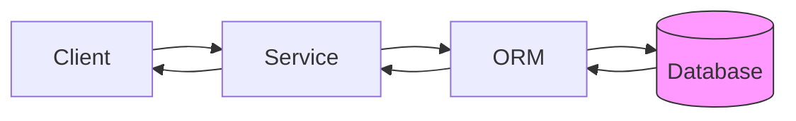
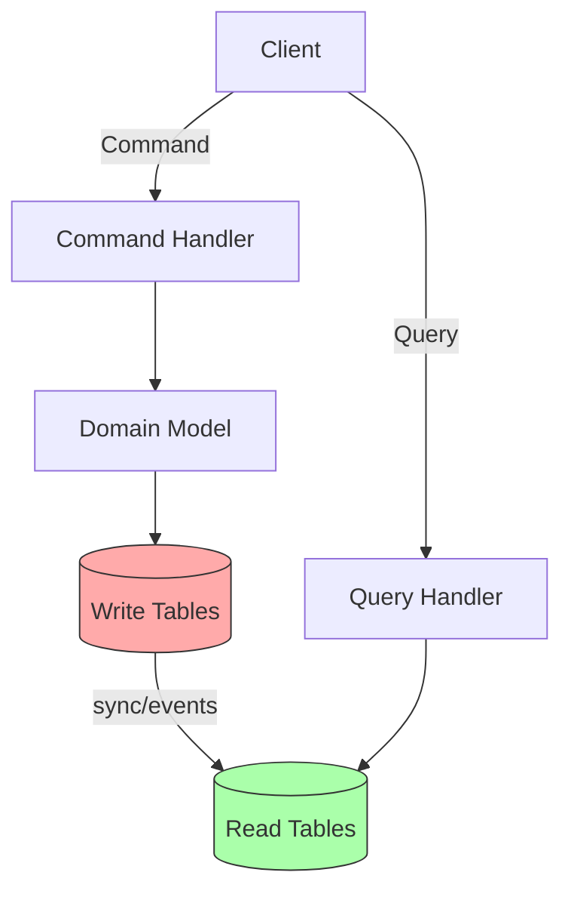
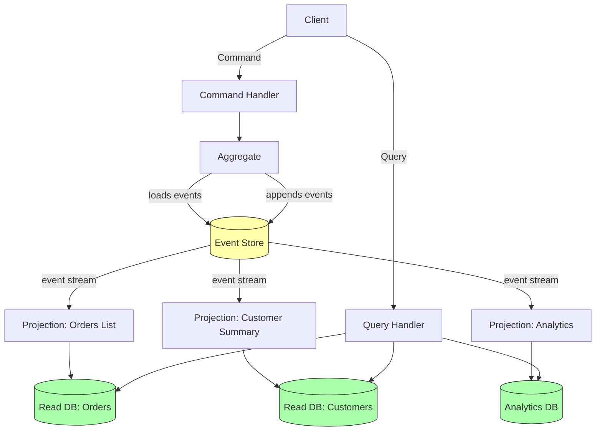

# CQRS & Event Sourcing

Every software system eventually hits the same wall: the data model that makes writes safe and consistent is terrible for reads, and the model that makes reads fast and flexible is terrible for writes. CRUD tries to paper over this tension with a single unified model. CQRS and Event Sourcing are the architectural answer to what happens when that papering over stops working.

These are not new ideas. Greg Young formalized CQRS in 2010, and the core concept of Event Sourcing traces back to accounting ledgers — a domain that discovered immutable append-only records thousands of years before computer science existed. What is new is the widespread recognition that these patterns solve real, recurring problems in modern software systems.

This section covers both patterns at production depth: not just what they are, but why they exist, how they fail, and when you should reach for them versus when you should not.

## The Core Problem: CRUD Doesn't Scale for Complex Domains

Consider a banking application. A `BankAccount` table might look like:

```
| id | owner_id | balance | status | updated_at |
|----|----------|---------|--------|------------|
| 1  | 42       | 1500.00 | active | 2026-03-17 |
```

This works fine for simple cases. But now ask yourself:

- **Why** is the balance 1500.00? What sequence of transactions produced it?
- **Who** changed the status to `active`? When? Why?
- **What** was the balance last Tuesday at 3pm?
- If a bug ran for two hours and corrupted balances, **how do you recover**?
- If you need to add a new feature that aggregates per-customer transaction counts, **how do you backfill**?

The answer to every one of these questions is "you cannot, unless you built an audit log separately." CRUD discards history. Every `UPDATE` overwrites the previous state, permanently destroying the information about what happened and why.

This is not just an audit concern. It affects:

**Debugging**: When production data is corrupt, CRUD systems require forensic archaeology through application logs to figure out what happened. Event-sourced systems can replay the exact sequence of events.

**Business intelligence**: Aggregate read patterns are fundamentally different from transactional write patterns. Trying to serve both from the same normalized schema forces you to choose between write performance and read performance.

**Correctness**: Complex business rules often depend on history. "A customer can only reverse a charge within 30 days of the original transaction" requires knowing when the original transaction happened. "A user can place a new order only if their previous order has shipped" requires knowing order history.

**Temporal queries**: Regulatory compliance often requires point-in-time state reconstruction. "What did this account look like on December 31st?" is trivially answered by event sourcing and requires either temporal tables or custom audit infrastructure with CRUD.

## What CQRS Is

**Command Query Responsibility Segregation** (CQRS) is the architectural pattern of using separate models for reading data and writing data.

The name comes from Bertrand Meyer's **Command Query Separation** (CQS) principle at the method level: a method should either return a value (query) or change state (command), never both. CQRS lifts this principle to the architectural level.

In a traditional CRUD application, you have one model that handles everything:

```
Client → Service → Repository → Database
              ↑           ↑
         (reads same)  (writes same)
           model         table
```

In CQRS, you have two separate stacks:

```
Client → Command Handler → Domain Model → Event Store / Write DB
Client → Query Handler  → Read Model   → Read DB (denormalized)
```

The write side (command side) is optimized for correctness and consistency. It enforces business invariants, processes one aggregate at a time, and does not care about query performance.

The read side (query side) is optimized for read performance. It maintains denormalized, pre-joined, pre-aggregated views of the data specifically designed for each query's access pattern. Adding a new read requirement means adding a new read model — not adding joins to the domain model.

**Critical clarification**: CQRS does not require separate databases. The simplest CQRS implementation uses the same database with separate tables for the write model and read model. Separate databases are an optimization, not a requirement.

## What Event Sourcing Is

**Event Sourcing** is the architectural pattern where the state of a domain object is not stored directly, but is instead derived by replaying a sequence of immutable events that describe everything that has happened to it.

Instead of storing `{ balance: 1500.00 }`, you store:

```
AccountOpened        { initial_balance: 1000.00, timestamp: 2026-01-01 }
MoneyDeposited       { amount: 700.00, timestamp: 2026-02-15 }
MoneyWithdrawn       { amount: 200.00, timestamp: 2026-03-10 }
```

The current balance (1500.00) is computed by replaying these three events. The event log is the source of truth. The computed state is a cache.

This gives you:

- **Complete audit history**: Every state change is recorded as a fact.
- **Temporal queries**: Replay only events up to a point in time to get state at that time.
- **Event-driven integration**: Other systems can subscribe to the event stream and react.
- **Bug recovery**: If a bug processed events incorrectly, fix the bug and replay the events. The correct state emerges.
- **New projections**: If you need a new read model, build it by replaying historical events from position 0.

**The tradeoff**: Event sourcing increases complexity significantly. Loading an aggregate requires replaying all its events (mitigated by snapshots). Schema evolution requires upcasting. The mental model shift is substantial.

## How CQRS and Event Sourcing Complement Each Other

CQRS and Event Sourcing are independent patterns. You can use either without the other:

- **CQRS without Event Sourcing**: Separate read/write models, but the write side uses normal state storage. The events that update read models might be published explicitly when commands are processed.
- **Event Sourcing without CQRS**: Use event sourcing as your storage mechanism but have a single model serving both reads and writes (uncommon and usually ill-advised for anything beyond simple systems).

They complement each other naturally because:

1. Event sourcing produces a natural event stream as a byproduct of every write.
2. CQRS needs something to keep read models updated when writes happen.
3. The event stream from Event Sourcing is exactly the mechanism needed to update CQRS read models.

When combined (CQRS+ES), the architecture looks like:

```
Command → Command Handler → Aggregate (replays events) → New events appended
                                                        ↓
                                               Event Store (append-only)
                                                        ↓
                                               Projections subscribe
                                                        ↓
                                               Read Models updated
                                                        ↓
Query → Query Handler → Read Model → Response
```

## Architecture Diagrams

### Traditional CRUD



### CQRS (Same Database)



### CQRS + Event Sourcing



## The Misconception: "CQRS Means Separate Databases"

This is one of the most persistent misconceptions in the field, and it causes teams to over-engineer their solutions or dismiss CQRS as too complex for their scale.

CQRS is about separate **models**, not separate **infrastructure**. The spectrum of CQRS implementations:

| Level | Description | When Appropriate |
|-------|-------------|-----------------|
| 0 | CRUD single model | Simple CRUD apps, early stage |
| 1 | Separate read/write services in same codebase | Complex business logic, teams > 3 |
| 2 | Separate tables in same DB for write model and read models | Read/write perf divergence |
| 3 | Separate databases (e.g., PostgreSQL writes, Redis reads) | Read scale requirements |
| 4 | CQRS + Event Sourcing + separate event store | Complex domains, audit requirements |

Starting at level 4 when you need level 1 is engineering malpractice. The pattern is a tool, not a cargo cult.

::: tip The Rule
The question is not "should we use CQRS?" The question is "how much CQRS do we need right now?" Start with the minimum viable separation and evolve.
:::

## When You Need This vs When It's Overkill

### Reach for CQRS when:

- Read and write models have **fundamentally different shapes** — e.g., writes are normalized per-aggregate, reads are denormalized summaries.
- **Read performance** is degraded by joins required to serve the write model's structure.
- You have **different teams** responsible for query optimization vs. business logic.
- You need **explicit audit trails** of what changed and when.
- The domain has **complex business rules** that are difficult to express in a CRUD model.
- You're building with **DDD** and have well-defined aggregates and domain events.

### Reach for Event Sourcing when:

- You need **temporal queries** — "what was the state at time T?"
- You need **complete audit history** for regulatory compliance.
- You need to **recover from bugs** by replaying events with fixed logic.
- You have **multiple downstream consumers** that need to react to state changes.
- The domain is **event-centric** by nature (financial transactions, order management, workflow engines).
- You need to **retroactively add new views** of existing data without backfilling.

### It's overkill when:

- You have a **simple CRUD** application with no complex business rules.
- The **team is small** (1-3 developers) and the overhead of learning these patterns is disproportionate.
- The domain is **read-heavy with simple writes** (e.g., a blog or a product catalog with no complex invariants).
- You're building an **MVP** and product/market fit is not established — the operational complexity will slow you down when pivoting.
- **Eventual consistency is unacceptable** for your use case (CQRS read models are eventually consistent by default).

::: warning The Honesty Check
Before adopting CQRS + Event Sourcing, honestly answer: "Does our domain have enough complexity to justify the operational overhead?" If you cannot name three specific business invariants that your domain enforces, the answer is probably no.
:::

::: danger The Anti-Pattern
Using CQRS+ES to look sophisticated, then spending 80% of development time fighting the infrastructure instead of building business features, is a failure mode that kills projects. The patterns serve the business, not the other way around.
:::

## Mathematical Foundation: Why This Works

CQRS+ES has a formal grounding in mathematics. An event-sourced aggregate is a **left fold** over the event sequence:

$$\text{State} = \text{fold}(\text{apply}, \text{initial}, \text{events})$$

Where `fold` in Haskell notation is:

$$\text{foldl} :: (b \rightarrow a \rightarrow b) \rightarrow b \rightarrow [a] \rightarrow b$$

The `apply` function is a state transition function:

$$\text{apply} :: \text{State} \rightarrow \text{Event} \rightarrow \text{State}$$

This gives event sourcing its reliability guarantee: as long as `apply` is a pure function (no side effects, deterministic), replaying the same sequence of events will always produce the same state. The system is **referentially transparent** with respect to its history.

Projections are also folds, but they project into different target types:

$$\text{ReadModel} = \text{foldl}(\text{project}, \text{emptyReadModel}, \text{events})$$

Multiple different projections can be derived from the same event sequence, each being an independent fold into a different target type.

## The Naming Confusion in the Industry

A brief note on terminology, because this causes significant confusion:

- **Greg Young** coined "CQRS" in 2010, building on Udi Dahan's earlier work on service-oriented CQRS.
- **Martin Fowler** documented it and added nuance about when to use it.
- **Sagas** vs **Process Managers**: in CQRS literature, these terms are sometimes used interchangeably. In this section, we use "Saga" for choreography-based long-running processes and "Process Manager" for orchestration-based ones.
- **Domain Events** vs **Integration Events**: Domain events are internal to a bounded context; integration events cross context boundaries.
- **Projection** vs **View**: a view is a static snapshot; a projection is a process that builds and maintains a view from events.

::: info War Story
A team spent three months debating whether their architecture was "really CQRS" because they used the same database for reads and writes. They were convinced by a consultant that CQRS "requires" separate databases, so they spent six weeks migrating to a separate Redis cluster for reads — solving a performance problem they didn't have, in a system with 200 users. The real CQRS benefit (separated business logic from query concerns) was never achieved because they ran out of budget. This is what happens when pattern names become gatekeeping instead of tools.
:::

## Learning Path

Work through these pages in order if you're new to the patterns. If you have specific questions, jump to the relevant page.

| Page | Topic | Difficulty | Lines |
|------|-------|-----------|-------|
| [CQRS Deep Dive](./cqrs-deep-dive) | Commands, queries, handlers, read models | Intermediate | 800+ |
| [Event Sourcing Deep Dive](./event-sourcing-deep-dive) | Events as truth, event store, projections | Intermediate | 800+ |
| [Aggregate Design](./aggregate-design) | Consistency boundaries, invariants, DDD | Advanced | 700+ |
| [Projections](./projections) | Building and maintaining read models | Intermediate | 700+ |
| [Snapshots](./snapshots) | Performance optimization for large aggregates | Advanced | 600+ |
| [Sagas & Process Managers](./sagas-process-managers) | Long-running processes, compensation | Advanced | 800+ |
| [Event Upcasting](./event-upcasting) | Schema evolution for immutable events | Expert | 600+ |

## Prerequisites

Before diving in, ensure you understand:

- **TypeScript**: All code examples are in TypeScript with full type safety.
- **PostgreSQL**: Event store implementations use PostgreSQL.
- **Domain-Driven Design basics**: Aggregates, entities, value objects, bounded contexts.
- **Async/await and Promises**: Event processing is inherently asynchronous.
- **Basic distributed systems concepts**: Eventual consistency, idempotency, at-least-once delivery.

If any of these are gaps, address them first. CQRS+ES adds significant complexity on top of these fundamentals — trying to learn everything simultaneously leads to confusion about which layer is causing which problem.

## The Production Reality

Running CQRS+ES in production means operating:

- An **event store** (EventStoreDB, or PostgreSQL with a `events` table) that must be highly available.
- **Projection workers** that subscribe to the event stream and maintain read models — these must handle failures, restarts, and out-of-order delivery.
- **Monitoring** for projection lag — the time between when an event is written and when the read model reflects it.
- **Snapshot jobs** for aggregates with large event histories.
- **Upcasting infrastructure** for backward-compatible schema evolution.

This is not a reason to avoid the patterns. It is a reason to make the adoption decision deliberately, with eyes open to the operational requirements.

The following pages cover each of these areas in full production depth, with complete TypeScript implementations, real benchmarks, and war stories from systems that have run these patterns at scale.
