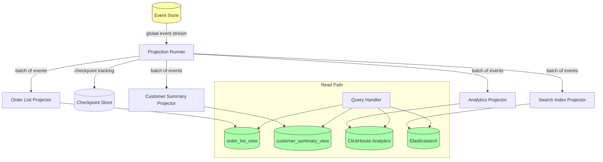

# Projections

## Projection vs View: Why the Distinction Matters

In traditional database parlance, a "view" is a saved query — a named SELECT statement that is re-executed every time you query it. Views are derived from current state. They are always up to date because they read from the underlying tables at query time.

A **projection** in event sourcing is different in a fundamental way: it is not a query over current state. It is a **process** that consumes events and builds a materialized, pre-computed data structure. The projection runs continuously (or on demand), updating its output as new events arrive. The output — the **read model** — is what gets queried.

Why project instead of view?

**Performance**: Database views that join multiple tables are re-computed on every query. For complex reports (12 joins, 3 aggregations), this is expensive. A projection pre-computes the result and stores it in a structure that can be queried in O(log n) time.

**Flexibility of storage**: Database views must live in the same database as the source data. Projections can write to any storage — Elasticsearch, Redis, a separate PostgreSQL database, an in-memory cache. The event stream is the source; the target is whatever serves the query best.

**Independent scaling**: The read model can be scaled independently of the write model. Add read replicas, increase cache size, move to a faster storage engine — without touching the event store.

**Rebuild-ability**: If you add a new field or change the projection logic, you can rebuild the read model from scratch by replaying all historical events. A database view cannot retroactively fix its "history" — it only reflects current state.

**Multiple views from one source**: Different projections can derive completely different read models from the same event stream. The same `OrderPlaced` event contributes to the order list view, the customer summary view, the revenue analytics projection, the warehouse picking queue, and the fraud detection model — all independently.

## Types of Projections

### Online (Synchronous) Projections

The projection runs in the same transaction as the command handler. The read model is updated atomically with the write.

```typescript
class OrderCommandHandler {
  async handle(command: PlaceOrderCommand): Promise<void> {
    await this.db.transaction(async (tx) => {
      // Write side
      const order = Order.place(command)
      await tx.execute(
        `INSERT INTO orders (id, customer_id, status) VALUES ($1, $2, $3)`,
        [order.id, order.customerId, order.status]
      )

      // Projection: update read model in same transaction
      await tx.execute(
        `INSERT INTO order_list_view (id, customer_name, status, total, placed_at)
         VALUES ($1, $2, $3, $4, $5)`,
        [order.id, command.customerName, 'pending', order.total, new Date()]
      )
    })
  }
}
```

**When to use**: When strong consistency is required and the read model update is simple.

**Tradeoffs**: Couples command handler to read model schema. Complex read model updates slow down the write transaction. Cannot use different storage for reads.

### Async (Eventual) Projections

The projection runs asynchronously, consuming events published after a successful write.

```typescript
// Separate projector process
class OrderListViewProjector implements Projector {
  readonly name = 'order-list-view'

  async handle(event: StoredEvent): Promise<void> {
    switch (event.eventType) {
      case 'OrderPlaced':
        await this.handleOrderPlaced(event.data as OrderPlacedEvent)
        break
      case 'OrderConfirmed':
        await this.handleOrderConfirmed(event.data as OrderConfirmedEvent)
        break
      case 'OrderShipped':
        await this.handleOrderShipped(event.data as OrderShippedEvent)
        break
      case 'OrderCancelled':
        await this.handleOrderCancelled(event.data as OrderCancelledEvent)
        break
    }
  }

  private async handleOrderPlaced(event: OrderPlacedEvent): Promise<void> {
    await this.db.execute(
      `INSERT INTO order_list_view (
        id, customer_id, customer_name, status,
        item_count, total, placed_at, last_updated_at
      ) VALUES ($1, $2, $3, $4, $5, $6, $7, $7)
      ON CONFLICT (id) DO NOTHING`,  // Idempotent!
      [
        event.orderId,
        event.customerId,
        event.customerName,
        'pending',
        event.items.length,
        event.total,
        event.occurredAt
      ]
    )
  }

  private async handleOrderShipped(event: OrderShippedEvent): Promise<void> {
    await this.db.execute(
      `UPDATE order_list_view
       SET status = 'shipped',
           tracking_number = $2,
           carrier = $3,
           last_updated_at = $4
       WHERE id = $1`,
      [event.orderId, event.trackingNumber, event.carrier, event.occurredAt]
    )
  }
}
```

**When to use**: Most projections. Allows loose coupling, separate storage, and independent scaling.

**Tradeoffs**: Eventual consistency. Read model may lag behind write model by milliseconds to seconds.

### Temporal Projections

Projects that compute state at a specific point in time. These are rebuilt on demand rather than maintained continuously.

```typescript
// Point-in-time projection — computed on request
async function getOrderStateAt(orderId: string, asOf: Date): Promise<OrderState> {
  const events = await eventStore.loadStream(`order-${orderId}`)
  const relevantEvents = events.filter(e => e.occurredAt <= asOf)

  const projector = new OrderStateProjector()
  for (const event of relevantEvents) {
    await projector.handle(event)
  }

  return projector.state
}
```

**When to use**: Regulatory compliance, dispute resolution, historical reporting.

**Tradeoffs**: Expensive — requires event replay on every request. Mitigate with caching for common time points.

## Projection Architecture



## Complete Projection Runner Implementation

```typescript
// projection-runner.ts

interface Projector {
  readonly name: string
  handle(event: StoredEvent): Promise<void>
}

interface CheckpointStore {
  get(projectorName: string): Promise<{ globalPosition: bigint } | null>
  save(projectorName: string, globalPosition: bigint): Promise<void>
}

interface ProjectionRunnerConfig {
  batchSize: number            // Events per batch
  pollIntervalMs: number       // How often to poll when caught up
  maxRetries: number           // Max retries per event before dead-lettering
  retryDelayMs: number         // Base delay for exponential backoff
}

class ProjectionRunner {
  private running = false
  private readonly config: ProjectionRunnerConfig

  constructor(
    private readonly eventStore: EventStore,
    private readonly projector: Projector,
    private readonly checkpointStore: CheckpointStore,
    config?: Partial<ProjectionRunnerConfig>
  ) {
    this.config = {
      batchSize: 500,
      pollIntervalMs: 100,
      maxRetries: 3,
      retryDelayMs: 100,
      ...config
    }
  }

  async start(): Promise<void> {
    this.running = true

    const checkpoint = await this.checkpointStore.get(this.projector.name)
    let currentPosition = checkpoint?.globalPosition ?? 0n

    console.log(
      `[${this.projector.name}] Starting from position ${currentPosition}`
    )

    while (this.running) {
      const events = await this.fetchBatch(currentPosition)

      if (events.length === 0) {
        // Caught up — wait before polling
        await this.sleep(this.config.pollIntervalMs)
        continue
      }

      for (const event of events) {
        await this.processWithRetry(event)
        currentPosition = event.globalPosition + 1n

        // Save checkpoint after each event
        // For performance, save every N events instead
        await this.checkpointStore.save(this.projector.name, event.globalPosition)
      }

      console.log(
        `[${this.projector.name}] Processed batch of ${events.length} events, position ${currentPosition}`
      )
    }
  }

  async stop(): Promise<void> {
    this.running = false
  }

  private async fetchBatch(fromPosition: bigint): Promise<StoredEvent[]> {
    return this.eventStore.loadEventsFromPosition(fromPosition, this.config.batchSize)
  }

  private async processWithRetry(event: StoredEvent): Promise<void> {
    let lastError: Error | null = null

    for (let attempt = 0; attempt < this.config.maxRetries; attempt++) {
      try {
        await this.projector.handle(event)
        return
      } catch (error) {
        lastError = error as Error
        console.error(
          `[${this.projector.name}] Error processing event ${event.globalPosition} ` +
          `(attempt ${attempt + 1}/${this.config.maxRetries}):`,
          error
        )
        if (attempt < this.config.maxRetries - 1) {
          await this.sleep(this.config.retryDelayMs * Math.pow(2, attempt))
        }
      }
    }

    // All retries exhausted — dead letter the event
    await this.handleDeadLetter(event, lastError!)
    // Continue processing; don't let one bad event stop the projector
  }

  private async handleDeadLetter(event: StoredEvent, error: Error): Promise<void> {
    // Write to dead letter store and alert monitoring
    console.error(
      `[${this.projector.name}] Dead lettered event ${event.globalPosition}:`,
      { eventType: event.eventType, error: error.message }
    )
    // TODO: alert PagerDuty, write to dead_letter_events table
  }

  private sleep(ms: number): Promise<void> {
    return new Promise(resolve => setTimeout(resolve, ms))
  }
}

// Checkpoint store implementation
class PostgresCheckpointStore implements CheckpointStore {
  constructor(private pool: Pool) {}

  async get(projectorName: string): Promise<{ globalPosition: bigint } | null> {
    const result = await this.pool.query<{ global_position: string }>(
      `SELECT global_position FROM projection_checkpoints WHERE projector_name = $1`,
      [projectorName]
    )
    if (result.rows.length === 0) return null
    return { globalPosition: BigInt(result.rows[0].global_position) }
  }

  async save(projectorName: string, globalPosition: bigint): Promise<void> {
    await this.pool.query(
      `INSERT INTO projection_checkpoints (projector_name, global_position, updated_at)
       VALUES ($1, $2, NOW())
       ON CONFLICT (projector_name)
       DO UPDATE SET global_position = EXCLUDED.global_position, updated_at = NOW()`,
      [projectorName, globalPosition.toString()]
    )
  }
}
```

## Idempotent Projection Handlers

A projection handler **must be idempotent**: processing the same event twice must produce the same result as processing it once. This is non-negotiable because:

- Message brokers guarantee **at-least-once delivery** — events may be delivered multiple times.
- During projection rebuild, events are replayed from the beginning.
- After a crash, the runner restarts from the last checkpoint, which may re-process events already handled before the crash.

Idempotency strategies:

### Strategy 1: Upsert (Most Common)

```typescript
async handleOrderPlaced(event: OrderPlacedEvent): Promise<void> {
  // ON CONFLICT DO NOTHING: if the row already exists, skip — idempotent
  await this.db.execute(
    `INSERT INTO order_list_view (id, customer_id, status, total, placed_at)
     VALUES ($1, $2, $3, $4, $5)
     ON CONFLICT (id) DO NOTHING`,
    [event.orderId, event.customerId, 'pending', event.total, event.occurredAt]
  )
}
```

### Strategy 2: Event ID Tracking

```typescript
async handle(storedEvent: StoredEvent): Promise<void> {
  // Check if we've already processed this event ID
  const alreadyProcessed = await this.db.queryScalar<boolean>(
    `SELECT EXISTS(
       SELECT 1 FROM processed_events
       WHERE projector_name = $1 AND event_id = $2
     )`,
    [this.name, storedEvent.eventId]
  )

  if (alreadyProcessed) return

  // Process the event
  await this.applyEvent(storedEvent)

  // Mark as processed
  await this.db.execute(
    `INSERT INTO processed_events (projector_name, event_id, processed_at)
     VALUES ($1, $2, NOW())`,
    [this.name, storedEvent.eventId]
  )
}
```

### Strategy 3: Version-Based Update

```typescript
async handleOrderStatusChanged(event: OrderStatusChangedEvent): Promise<void> {
  // Only update if the event version is newer than what we have
  await this.db.execute(
    `UPDATE order_list_view
     SET status = $2, last_updated_at = $3, event_version = $4
     WHERE id = $1 AND event_version < $4`,  // Only update if newer
    [event.orderId, event.newStatus, event.occurredAt, event.aggregateVersion]
  )
}
```

## Projection Rebuild: When and How

You need to rebuild a projection when:

- You changed the projection logic (added a field, fixed a bug, changed an aggregation).
- The read model's storage was corrupted.
- You added a new projection that needs to process historical events.
- An event was upcasted and the projection needs to re-process it with the new schema.

### Blue-Green Projection Rebuild

The safest rebuild strategy is blue-green: build a new version of the read model in parallel with the existing one, then switch.

```typescript
// Blue-green rebuild strategy
class ProjectionRebuilder {
  async rebuild(projectorFactory: () => Projector): Promise<void> {
    const timestamp = Date.now()
    const newTableName = `order_list_view_${timestamp}`

    // Step 1: Create new table (the "green" version)
    await this.db.execute(`
      CREATE TABLE ${newTableName} (LIKE order_list_view INCLUDING ALL)
    `)

    // Step 2: Build new projector that writes to the new table
    const tempProjector = projectorFactory()
    tempProjector.setTargetTable(newTableName)

    // Step 3: Replay all events into the new table
    const runner = new ProjectionRunner(
      this.eventStore,
      tempProjector,
      new InMemoryCheckpointStore()  // Temporary checkpoint for rebuild
    )

    // Run until caught up (no more events)
    await runner.runUntilCaughtUp()

    // Step 4: Atomic swap
    await this.db.transaction(async (tx) => {
      // Rename old table to backup
      await tx.execute(`ALTER TABLE order_list_view RENAME TO order_list_view_old_${timestamp}`)
      // Rename new table to production
      await tx.execute(`ALTER TABLE ${newTableName} RENAME TO order_list_view`)
    })

    console.log(`Rebuild complete. Old table: order_list_view_old_${timestamp}`)

    // Step 5: Drop old table after verification
    // (Do this manually after verifying the new projection is correct)
  }
}
```

### Position Tracking During Rebuild

During rebuild, you don't want to interfere with the live projector's checkpoint. Use a separate checkpoint namespace:

```typescript
class InMemoryCheckpointStore implements CheckpointStore {
  private checkpoints = new Map<string, bigint>()

  async get(name: string): Promise<{ globalPosition: bigint } | null> {
    const pos = this.checkpoints.get(name)
    return pos !== undefined ? { globalPosition: pos } : null
  }

  async save(name: string, pos: bigint): Promise<void> {
    this.checkpoints.set(name, pos)
  }
}
```

### Rebuild Performance

Rebuilding a projection that needs to process 10 million events:

| Event count | Events/second | Estimated time |
|-------------|--------------|----------------|
| 100,000 | 10,000 | 10 seconds |
| 1,000,000 | 10,000 | 1.7 minutes |
| 10,000,000 | 10,000 | 16.7 minutes |
| 10,000,000 | 50,000 | 3.3 minutes |

To increase rebuild throughput:
- **Batch database writes**: Accumulate 100-1000 events, then write in a single batch INSERT.
- **Disable indexing during rebuild**: Drop indexes, rebuild, re-add indexes.
- **Parallel projectors**: If projections are independent, run multiple rebuilds in parallel.
- **Read-only replica**: Read events from a PostgreSQL read replica to avoid load on the primary.

```typescript
// High-throughput rebuild with batching
class BatchingProjector implements Projector {
  private buffer: Array<{ sql: string; params: unknown[] }> = []
  private readonly batchSize = 1000

  readonly name: string

  async handle(event: StoredEvent): Promise<void> {
    const operation = this.buildOperation(event)
    if (operation) {
      this.buffer.push(operation)
    }

    if (this.buffer.length >= this.batchSize) {
      await this.flush()
    }
  }

  async flush(): Promise<void> {
    if (this.buffer.length === 0) return

    // Execute all buffered operations in one transaction
    await this.db.transaction(async (tx) => {
      for (const { sql, params } of this.buffer) {
        await tx.execute(sql, params)
      }
    })

    this.buffer = []
  }

  private buildOperation(
    event: StoredEvent
  ): { sql: string; params: unknown[] } | null {
    switch (event.eventType) {
      case 'OrderPlaced': {
        const e = event.data as OrderPlacedEvent
        return {
          sql: `INSERT INTO order_list_view (id, customer_id, status, total, placed_at)
                VALUES ($1, $2, $3, $4, $5) ON CONFLICT (id) DO NOTHING`,
          params: [e.orderId, e.customerId, 'pending', e.total, e.occurredAt]
        }
      }
      // ... other events
      default:
        return null
    }
  }
}
```

## Multiple Projections from the Same Events

The power of projections: one event stream, many read models. The `OrderPlaced` event alone feeds:

```typescript
// 1. Order list for the customer portal
class OrderListViewProjector implements Projector {
  async handle(event: StoredEvent): Promise<void> {
    if (event.eventType === 'OrderPlaced') {
      const e = event.data as OrderPlacedEvent
      await this.db.execute(
        `INSERT INTO order_list_view (id, customer_id, customer_name, status, total, item_count)
         VALUES ($1, $2, $3, 'pending', $4, $5) ON CONFLICT (id) DO NOTHING`,
        [e.orderId, e.customerId, e.customerName, e.total, e.items.length]
      )
    }
  }
}

// 2. Revenue analytics projection
class RevenueAnalyticsProjector implements Projector {
  async handle(event: StoredEvent): Promise<void> {
    if (event.eventType === 'OrderPlaced') {
      const e = event.data as OrderPlacedEvent
      // Aggregate by day, category
      for (const item of e.items) {
        await this.db.execute(
          `INSERT INTO daily_revenue (date, product_id, revenue, order_count)
           VALUES ($1, $2, $3, 1)
           ON CONFLICT (date, product_id)
           DO UPDATE SET
             revenue = daily_revenue.revenue + EXCLUDED.revenue,
             order_count = daily_revenue.order_count + 1`,
          [
            e.occurredAt.toISOString().split('T')[0],
            item.productId,
            item.quantity * item.unitPrice
          ]
        )
      }
    }
  }
}

// 3. Warehouse picking queue
class WarehousePickingProjector implements Projector {
  async handle(event: StoredEvent): Promise<void> {
    if (event.eventType === 'OrderConfirmed') {
      const e = event.data as OrderConfirmedEvent
      // Load the order details from the order list view and create picking tasks
      const order = await this.db.queryOne(
        `SELECT * FROM order_list_view WHERE id = $1`, [e.orderId]
      )
      if (order) {
        await this.db.execute(
          `INSERT INTO picking_queue (order_id, warehouse_zone, priority, created_at)
           VALUES ($1, $2, $3, NOW())`,
          [e.orderId, this.determineZone(order), this.calculatePriority(order)]
        )
      }
    }
  }
}

// 4. Elasticsearch search index
class OrderSearchProjector implements Projector {
  async handle(event: StoredEvent): Promise<void> {
    if (event.eventType === 'OrderPlaced') {
      const e = event.data as OrderPlacedEvent
      await this.elasticsearch.index({
        index: 'orders',
        id: e.orderId,
        document: {
          id: e.orderId,
          customerName: e.customerName,
          status: 'pending',
          total: e.total,
          placedAt: e.occurredAt,
          productNames: e.items.map(i => i.productName),
          searchText: `${e.customerName} ${e.items.map(i => i.productName).join(' ')}`
        }
      })
    }
  }
}
```

## Projection Failure Handling

### Dead Letter Queue

When a projection handler fails after all retries, the event goes to a dead letter queue. This prevents one bad event from blocking all subsequent processing.

```typescript
class DeadLetterProjector implements Projector {
  readonly name = 'dead-letter'

  async handle(event: StoredEvent): Promise<void> {
    await this.db.execute(
      `INSERT INTO dead_letter_events (
        projector_name, event_id, global_position, event_type,
        stream_id, error_message, failed_at, retry_count
      ) VALUES ($1, $2, $3, $4, $5, $6, NOW(), $7)`,
      [
        this.failedProjectorName,
        event.eventId,
        event.globalPosition,
        event.eventType,
        event.streamId,
        this.lastError?.message ?? 'Unknown error',
        this.retryCount
      ]
    )
  }
}

// Reprocessing dead letters
class DeadLetterReprocessor {
  async reprocess(projectorName: string): Promise<void> {
    const deadLettered = await this.db.query<DeadLetterEvent>(
      `SELECT * FROM dead_letter_events
       WHERE projector_name = $1
       ORDER BY global_position ASC`,
      [projectorName]
    )

    const projector = this.projectorRegistry.get(projectorName)!

    for (const dlEvent of deadLettered) {
      const event = await this.eventStore.loadEventById(dlEvent.eventId)
      if (!event) continue

      try {
        await projector.handle(event)
        await this.db.execute(
          `DELETE FROM dead_letter_events WHERE id = $1`,
          [dlEvent.id]
        )
      } catch (error) {
        // Still failing — update error message and retry count
        await this.db.execute(
          `UPDATE dead_letter_events SET error_message = $2, retry_count = retry_count + 1 WHERE id = $1`,
          [dlEvent.id, (error as Error).message]
        )
      }
    }
  }
}
```

### Projection Lag Monitoring

Projection lag (the delay between event creation and projection update) is a key operational metric.

```typescript
// Monitoring query
const lagQuery = `
  SELECT
    pc.projector_name,
    pc.global_position AS current_position,
    (SELECT MAX(global_position) FROM events) AS max_position,
    (SELECT MAX(global_position) FROM events) - pc.global_position AS lag_events,
    NOW() - (
      SELECT occurred_at FROM events
      WHERE global_position = pc.global_position
    ) AS lag_time
  FROM projection_checkpoints pc
  ORDER BY lag_events DESC
`

// Alert if lag exceeds threshold
async function checkProjectionHealth(): Promise<void> {
  const lags = await db.query(lagQuery)
  for (const lag of lags) {
    if (lag.lag_events > 1000) {
      await alerting.fire({
        name: 'ProjectionLagHigh',
        projector: lag.projector_name,
        lagEvents: lag.lag_events,
        lagTime: lag.lag_time
      })
    }
  }
}
```

## Technology Choices for Read Models

### PostgreSQL Read Models

Best for: Relational queries, ordering, filtering, pagination.

```sql
-- Order list view with all data pre-joined
CREATE TABLE order_list_view (
  id              UUID PRIMARY KEY,
  customer_id     UUID NOT NULL,
  customer_name   TEXT NOT NULL,
  customer_email  TEXT NOT NULL,
  status          TEXT NOT NULL,
  item_count      INTEGER NOT NULL,
  total           DECIMAL(10, 2) NOT NULL,
  placed_at       TIMESTAMPTZ NOT NULL,
  last_updated_at TIMESTAMPTZ NOT NULL,
  tracking_number TEXT,
  carrier         TEXT,
  event_version   INTEGER NOT NULL DEFAULT 0
);

CREATE INDEX order_list_customer_idx ON order_list_view (customer_id, placed_at DESC);
CREATE INDEX order_list_status_idx ON order_list_view (status, placed_at DESC);
```

### Redis Read Models

Best for: Low-latency lookups, counters, leaderboards.

```typescript
class RedisOrderSummaryProjector implements Projector {
  readonly name = 'redis-order-summary'

  async handle(event: StoredEvent): Promise<void> {
    if (event.eventType === 'OrderPlaced') {
      const e = event.data as OrderPlacedEvent
      // Store as Redis hash
      await this.redis.hSet(`order:${e.orderId}`, {
        customerId: e.customerId,
        status: 'pending',
        total: e.total.toString(),
        placedAt: e.occurredAt.toISOString()
      })
      // Set expiry for orders older than 90 days
      await this.redis.expire(`order:${e.orderId}`, 90 * 24 * 3600)

      // Update customer order count
      await this.redis.incr(`customer:${e.customerId}:order_count`)

      // Add to customer's order list (sorted set by timestamp)
      await this.redis.zAdd(`customer:${e.customerId}:orders`, {
        score: e.occurredAt.getTime(),
        value: e.orderId
      })
    }
  }
}

// Query: get customer's 10 most recent orders
async function getRecentOrders(customerId: string, count: number = 10): Promise<string[]> {
  return redis.zRange(`customer:${customerId}:orders`, 0, count - 1, { REV: true })
}
```

### Elasticsearch Read Models

Best for: Full-text search, faceted filtering, relevance ranking.

```typescript
class ElasticsearchOrderProjector implements Projector {
  readonly name = 'elasticsearch-orders'

  async handle(event: StoredEvent): Promise<void> {
    switch (event.eventType) {
      case 'OrderPlaced':
        await this.index(event.data as OrderPlacedEvent)
        break
      case 'OrderStatusChanged':
        await this.updateStatus(event.data as OrderStatusChangedEvent)
        break
    }
  }

  private async index(event: OrderPlacedEvent): Promise<void> {
    await this.es.index({
      index: 'orders',
      id: event.orderId,
      document: {
        customerId: event.customerId,
        customerName: event.customerName,
        status: 'pending',
        total: event.total,
        placedAt: event.occurredAt,
        // Full-text search fields
        productNames: event.items.map(i => i.productName),
        skus: event.items.map(i => i.sku),
        // Suggest field for autocomplete
        suggest: {
          input: [event.customerName, ...event.items.map(i => i.productName)]
        }
      }
    })
  }
}
```

## Cross-Aggregate Projections

Some read models need data from multiple aggregates. The projection receives events from all relevant aggregates and joins them in the read model.

```typescript
// Customer order summary: needs data from both Order and Customer aggregates
class CustomerSummaryProjector implements Projector {
  readonly name = 'customer-summary'

  async handle(event: StoredEvent): Promise<void> {
    switch (event.eventType) {
      case 'CustomerRegistered':
        await this.initializeCustomerSummary(event.data as CustomerRegisteredEvent)
        break
      case 'OrderPlaced':
        await this.incrementOrderCount(event.data as OrderPlacedEvent)
        break
      case 'OrderCancelled':
        await this.decrementOrderCount(event.data as OrderCancelledEvent)
        break
      case 'CustomerTierChanged':
        await this.updateTier(event.data as CustomerTierChangedEvent)
        break
    }
  }

  private async initializeCustomerSummary(event: CustomerRegisteredEvent): Promise<void> {
    await this.db.execute(
      `INSERT INTO customer_summary (id, name, email, tier, order_count, total_spend, registered_at)
       VALUES ($1, $2, $3, 'standard', 0, 0, $4)
       ON CONFLICT (id) DO NOTHING`,
      [event.customerId, event.name, event.email, event.occurredAt]
    )
  }

  private async incrementOrderCount(event: OrderPlacedEvent): Promise<void> {
    await this.db.execute(
      `UPDATE customer_summary
       SET order_count = order_count + 1,
           total_spend = total_spend + $2,
           last_order_at = $3
       WHERE id = $1`,
      [event.customerId, event.total, event.occurredAt]
    )
  }
}
```

::: warning Cross-Aggregate Ordering
Events from different aggregates can arrive in any order relative to each other, even if they were produced in a specific order. Your cross-aggregate projector must handle events out of sequence. Use timestamps and idempotent upserts to handle this correctly.
:::

## Performance Characteristics

| Operation | Complexity | Typical Latency |
|-----------|-----------|----------------|
| Single event processing | O(1) | 1-10ms |
| Batch processing (1000 events) | O(n) | 100-500ms |
| Full rebuild (1M events, batched) | O(n) | 1-5 minutes |
| Read model query (indexed) | O(log n) | 1-5ms |
| Read model query (full scan) | O(n) | Seconds to minutes |

The projection lag SLA should be defined as part of your system's consistency requirements. Most systems accept 1-5 seconds of lag for operational views and up to 1 minute for analytics views.

$$\text{ProjectionLag}(t) = \max(0, \text{EventTimestamp}(t) - \text{ProjectionTimestamp}(t))$$

::: info War Story
A digital media company ran a recommendation engine that was served by a projection over user engagement events (views, likes, shares, purchases). The projection was built correctly, with proper checkpointing and idempotent handlers. What they didn't build was monitoring.

Three weeks after a code deployment that introduced a bug in the projector's `VideoViewedEvent` handler, a database administrator noticed that the projection's checkpoint table hadn't advanced in three weeks. The projector had silently crashed on startup (a null pointer dereference in the new code), and the alert that should have fired was misconfigured to check the wrong metric.

For three weeks, 12 million user engagement events had been written to the event store but not processed by the recommendation projector. The recommendation engine was serving stale data from three weeks prior.

The fix: correct the bug and restart the projector. It caught up in 4 hours by processing events at high throughput in batch mode. Users noticed improved recommendations immediately.

The lesson: projection lag monitoring is not optional. You need alerts for: projector not advancing (position stuck), lag exceeding threshold (too far behind), dead letter queue growing (events failing), and projector process not running (heartbeat check).
:::

## Mathematical Foundation

A projection is formally a **fold** (left reduce) over the event stream:

$$\text{ReadModel} = \text{foldl}(f, \text{initial}, \text{events})$$

Where the projection function $f: \text{ReadModel} \times \text{Event} \rightarrow \text{ReadModel}$ maps each event to a state transition on the read model.

Multiple projections are independent folds over the same sequence:

$$\text{RM}_1 = \text{foldl}(f_1, \emptyset, \text{events})$$
$$\text{RM}_2 = \text{foldl}(f_2, \emptyset, \text{events})$$

The commutativity property — that the order of projection execution doesn't matter — holds if and only if each projection is independent (their folds don't share state). This is why projections must be decoupled from each other.

The checkpoint is a saved intermediate fold result:

$$\text{checkpoint}(k) = \text{foldl}(f, \emptyset, [e_1, ..., e_k])$$

Resuming from a checkpoint:

$$\text{foldl}(f, \text{checkpoint}(k), [e_{k+1}, ..., e_n]) = \text{foldl}(f, \emptyset, [e_1, ..., e_n])$$

This equality holds if and only if $f$ is idempotent with respect to duplicate event processing, which is why idempotency is a hard requirement.
