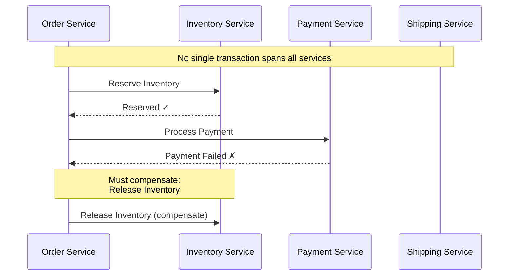
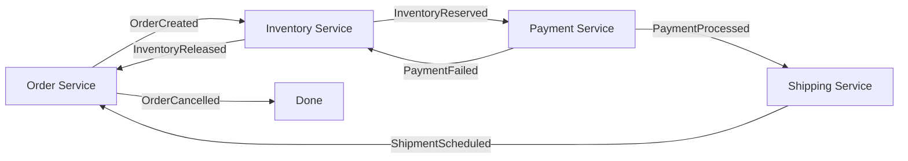
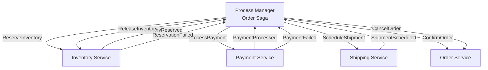
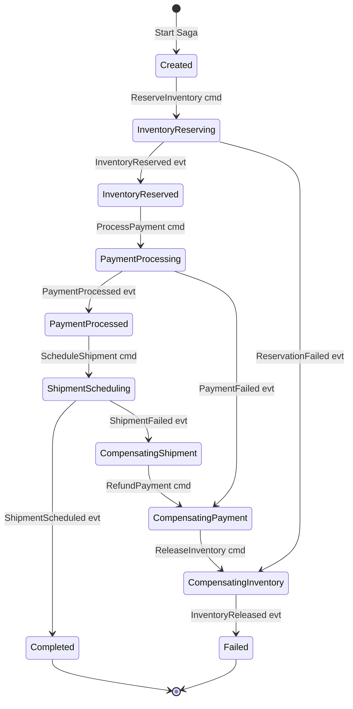
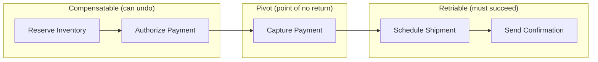

# Sagas & Process Managers

## Why They Exist

In a monolithic system with a single database, a business process like "place an order" is a single ACID transaction. In a distributed system, this process spans multiple services and databases — there is no single transaction boundary. You cannot use distributed two-phase commit (2PC) in practice because it blocks all participants if the coordinator fails, and it does not scale.

Hector Garcia-Molina and Kenneth Salem introduced **sagas** in their 1987 paper as an alternative to long-lived transactions. A saga is a sequence of local transactions, where each transaction updates a single service and publishes an event or command to trigger the next step. If a step fails, previously completed steps are undone through **compensating transactions**.

A **process manager** is a more general pattern that routes events and commands through a state machine, making decisions about which step to execute next based on the current state and incoming events. Sagas are a specific use case of process managers.

### The Fundamental Problem



Without sagas, you would need to manually code compensation logic for every possible failure point in every process. Sagas formalize this.

## First Principles

### Saga Definition

A saga $S$ is a sequence of transactions $T_1, T_2, \ldots, T_n$ paired with compensating transactions $C_1, C_2, \ldots, C_{n-1}$:

$$
S = (T_1, C_1), (T_2, C_2), \ldots, (T_{n-1}, C_{n-1}), T_n
$$

If $T_k$ fails (for $k \leq n$), the compensation sequence is:

$$
C_{k-1}, C_{k-2}, \ldots, C_1
$$

Note: the last transaction $T_n$ has no compensating transaction — if it fails, we compensate $T_{n-1}$ through $T_1$.

### Semantic vs. ACID Guarantees

| Property | ACID Transaction | Saga |
|----------|-----------------|------|
| Atomicity | All or nothing | Eventual — via compensations |
| Consistency | Immediate | Eventual |
| Isolation | Full | None — intermediate states visible |
| Durability | Yes | Yes (each local TX is durable) |

The lack of isolation is the most challenging aspect. Other services can see partially completed sagas.

### Compensating Transaction Properties

A compensating transaction $C_i$ must:

1. **Undo the semantic effect** of $T_i$ (not necessarily restore the exact previous state)
2. Be **idempotent** (can be executed multiple times safely)
3. **Never fail permanently** (must eventually succeed, possibly after retries)
4. Be **commutative** with concurrent operations where possible

::: warning
Not all operations are reversible. Sending an email, making a phone call, or physically shipping a package cannot be "undone." For these, use **pivot transactions** — steps that commit the saga irreversibly once reached.
:::

## Choreography vs. Orchestration

### Choreography-Based Saga

Each service listens for events and knows what to do next:



**Pros**: No central coordinator, each service is autonomous.
**Cons**: Hard to understand the full flow, difficult to add new steps, complex error handling.

### Orchestration-Based Saga (Process Manager)

A central coordinator tells each service what to do:



**Pros**: Clear flow visualization, easy to add steps, centralized error handling.
**Cons**: Single point of coordination, process manager can become complex.

## Core Implementation — The Process Manager

### State Machine Design



### TypeScript Process Manager

```typescript
// application/sagas/order-saga/order-saga.types.ts
export enum OrderSagaState {
  Created = 'CREATED',
  InventoryReserving = 'INVENTORY_RESERVING',
  InventoryReserved = 'INVENTORY_RESERVED',
  PaymentProcessing = 'PAYMENT_PROCESSING',
  PaymentProcessed = 'PAYMENT_PROCESSED',
  ShipmentScheduling = 'SHIPMENT_SCHEDULING',
  Completed = 'COMPLETED',

  // Compensation states
  CompensatingShipment = 'COMPENSATING_SHIPMENT',
  CompensatingPayment = 'COMPENSATING_PAYMENT',
  CompensatingInventory = 'COMPENSATING_INVENTORY',
  Failed = 'FAILED',
  TimedOut = 'TIMED_OUT',
}

export interface OrderSagaData {
  orderId: string;
  customerId: string;
  items: Array<{
    productId: string;
    quantity: number;
    price: number;
  }>;
  totalAmount: number;
  currency: string;
  paymentMethodId: string;
  reservationId?: string;
  paymentId?: string;
  shipmentId?: string;
  failureReason?: string;
  startedAt: Date;
  completedAt?: Date;
}
```

```typescript
// application/sagas/saga-base.ts
import type { DomainEvent } from '../../domain/events/domain-event';

export interface SagaCommand {
  type: string;
  payload: Record<string, unknown>;
  targetService: string;
}

export interface SagaTransition {
  newState: string;
  commands: SagaCommand[];
}

export abstract class SagaBase<TState extends string, TData> {
  constructor(
    public readonly id: string,
    protected _state: TState,
    protected _data: TData,
    protected _version: number = 0,
  ) {}

  get state(): TState { return this._state; }
  get data(): TData { return this._data; }
  get version(): number { return this._version; }

  /**
   * Handle an incoming event and return the state transition + outgoing commands.
   */
  abstract handle(event: DomainEvent): SagaTransition | null;

  /**
   * Check if this saga should handle a given event.
   */
  abstract canHandle(event: DomainEvent): boolean;

  /**
   * Check if the saga is in a terminal state.
   */
  abstract isComplete(): boolean;

  /**
   * Transition to a new state.
   */
  protected transition(newState: TState, dataUpdates?: Partial<TData>): void {
    this._state = newState;
    if (dataUpdates) {
      this._data = { ...this._data, ...dataUpdates };
    }
    this._version++;
  }
}
```

```typescript
// application/sagas/order-saga/order-saga.ts
import { SagaBase } from '../saga-base';
import type { SagaCommand, SagaTransition } from '../saga-base';
import type { DomainEvent } from '../../../domain/events/domain-event';
import { OrderSagaState } from './order-saga.types';
import type { OrderSagaData } from './order-saga.types';

export class OrderSaga extends SagaBase<OrderSagaState, OrderSagaData> {
  private static readonly TIMEOUT_MS = 5 * 60 * 1000; // 5 minutes

  static start(orderId: string, data: Omit<OrderSagaData, 'startedAt'>): OrderSaga {
    const saga = new OrderSaga(
      `order-saga-${orderId}`,
      OrderSagaState.Created,
      { ...data, startedAt: new Date() },
    );
    return saga;
  }

  canHandle(event: DomainEvent): boolean {
    return event.aggregateId === this._data.orderId ||
           event.payload.orderId === this._data.orderId;
  }

  isComplete(): boolean {
    return this._state === OrderSagaState.Completed ||
           this._state === OrderSagaState.Failed ||
           this._state === OrderSagaState.TimedOut;
  }

  handle(event: DomainEvent): SagaTransition | null {
    // Check for timeout
    if (this.isTimedOut()) {
      return this.handleTimeout();
    }

    switch (this._state) {
      case OrderSagaState.Created:
        return this.onCreated(event);
      case OrderSagaState.InventoryReserving:
        return this.onInventoryReserving(event);
      case OrderSagaState.InventoryReserved:
        return this.onInventoryReserved(event);
      case OrderSagaState.PaymentProcessing:
        return this.onPaymentProcessing(event);
      case OrderSagaState.PaymentProcessed:
        return this.onPaymentProcessed(event);
      case OrderSagaState.ShipmentScheduling:
        return this.onShipmentScheduling(event);
      case OrderSagaState.CompensatingShipment:
        return this.onCompensatingShipment(event);
      case OrderSagaState.CompensatingPayment:
        return this.onCompensatingPayment(event);
      case OrderSagaState.CompensatingInventory:
        return this.onCompensatingInventory(event);
      default:
        return null;
    }
  }

  /** Begin the saga — reserve inventory */
  begin(): SagaTransition {
    this.transition(OrderSagaState.InventoryReserving);
    return {
      newState: this._state,
      commands: [{
        type: 'ReserveInventory',
        targetService: 'inventory-service',
        payload: {
          orderId: this._data.orderId,
          items: this._data.items.map(i => ({
            productId: i.productId,
            quantity: i.quantity,
          })),
        },
      }],
    };
  }

  private onCreated(_event: DomainEvent): SagaTransition {
    return this.begin();
  }

  private onInventoryReserving(event: DomainEvent): SagaTransition | null {
    if (event.type === 'InventoryReserved') {
      this.transition(OrderSagaState.InventoryReserved, {
        reservationId: event.payload.reservationId as string,
      });
      return {
        newState: this._state,
        commands: [{
          type: 'ProcessPayment',
          targetService: 'payment-service',
          payload: {
            orderId: this._data.orderId,
            amount: this._data.totalAmount,
            currency: this._data.currency,
            paymentMethodId: this._data.paymentMethodId,
          },
        }],
      };
    }

    if (event.type === 'ReservationFailed') {
      this.transition(OrderSagaState.Failed, {
        failureReason: event.payload.reason as string,
      });
      return {
        newState: this._state,
        commands: [{
          type: 'CancelOrder',
          targetService: 'order-service',
          payload: {
            orderId: this._data.orderId,
            reason: `Inventory reservation failed: ${event.payload.reason}`,
          },
        }],
      };
    }

    return null;
  }

  private onInventoryReserved(_event: DomainEvent): SagaTransition {
    this.transition(OrderSagaState.PaymentProcessing);
    return {
      newState: this._state,
      commands: [{
        type: 'ProcessPayment',
        targetService: 'payment-service',
        payload: {
          orderId: this._data.orderId,
          amount: this._data.totalAmount,
          currency: this._data.currency,
          paymentMethodId: this._data.paymentMethodId,
        },
      }],
    };
  }

  private onPaymentProcessing(event: DomainEvent): SagaTransition | null {
    if (event.type === 'PaymentProcessed') {
      this.transition(OrderSagaState.PaymentProcessed, {
        paymentId: event.payload.paymentId as string,
      });
      return {
        newState: this._state,
        commands: [{
          type: 'ScheduleShipment',
          targetService: 'shipping-service',
          payload: {
            orderId: this._data.orderId,
            customerId: this._data.customerId,
            items: this._data.items,
          },
        }],
      };
    }

    if (event.type === 'PaymentFailed') {
      // Compensate: release inventory
      this.transition(OrderSagaState.CompensatingInventory, {
        failureReason: `Payment failed: ${event.payload.reason}`,
      });
      return {
        newState: this._state,
        commands: [{
          type: 'ReleaseInventory',
          targetService: 'inventory-service',
          payload: {
            orderId: this._data.orderId,
            reservationId: this._data.reservationId,
          },
        }],
      };
    }

    return null;
  }

  private onPaymentProcessed(_event: DomainEvent): SagaTransition {
    this.transition(OrderSagaState.ShipmentScheduling);
    return {
      newState: this._state,
      commands: [{
        type: 'ScheduleShipment',
        targetService: 'shipping-service',
        payload: {
          orderId: this._data.orderId,
          customerId: this._data.customerId,
          items: this._data.items,
        },
      }],
    };
  }

  private onShipmentScheduling(event: DomainEvent): SagaTransition | null {
    if (event.type === 'ShipmentScheduled') {
      this.transition(OrderSagaState.Completed, {
        shipmentId: event.payload.shipmentId as string,
        completedAt: new Date(),
      });
      return {
        newState: this._state,
        commands: [{
          type: 'ConfirmOrder',
          targetService: 'order-service',
          payload: {
            orderId: this._data.orderId,
            paymentId: this._data.paymentId,
            shipmentId: event.payload.shipmentId,
          },
        }],
      };
    }

    if (event.type === 'ShipmentFailed') {
      // Compensate: refund payment, then release inventory
      this.transition(OrderSagaState.CompensatingPayment, {
        failureReason: `Shipment failed: ${event.payload.reason}`,
      });
      return {
        newState: this._state,
        commands: [{
          type: 'RefundPayment',
          targetService: 'payment-service',
          payload: {
            orderId: this._data.orderId,
            paymentId: this._data.paymentId,
          },
        }],
      };
    }

    return null;
  }

  private onCompensatingShipment(event: DomainEvent): SagaTransition | null {
    if (event.type === 'ShipmentCancelled') {
      this.transition(OrderSagaState.CompensatingPayment);
      return {
        newState: this._state,
        commands: [{
          type: 'RefundPayment',
          targetService: 'payment-service',
          payload: { orderId: this._data.orderId, paymentId: this._data.paymentId },
        }],
      };
    }
    return null;
  }

  private onCompensatingPayment(event: DomainEvent): SagaTransition | null {
    if (event.type === 'PaymentRefunded') {
      this.transition(OrderSagaState.CompensatingInventory);
      return {
        newState: this._state,
        commands: [{
          type: 'ReleaseInventory',
          targetService: 'inventory-service',
          payload: {
            orderId: this._data.orderId,
            reservationId: this._data.reservationId,
          },
        }],
      };
    }
    return null;
  }

  private onCompensatingInventory(event: DomainEvent): SagaTransition | null {
    if (event.type === 'InventoryReleased') {
      this.transition(OrderSagaState.Failed);
      return {
        newState: this._state,
        commands: [{
          type: 'CancelOrder',
          targetService: 'order-service',
          payload: {
            orderId: this._data.orderId,
            reason: this._data.failureReason ?? 'Saga compensation completed',
          },
        }],
      };
    }
    return null;
  }

  private isTimedOut(): boolean {
    return Date.now() - this._data.startedAt.getTime() > OrderSaga.TIMEOUT_MS;
  }

  private handleTimeout(): SagaTransition {
    const currentState = this._state;
    this.transition(OrderSagaState.TimedOut, {
      failureReason: `Saga timed out in state: ${currentState}`,
    });

    // Determine what needs compensating based on what was completed
    const commands: SagaCommand[] = [];

    if (this._data.paymentId) {
      commands.push({
        type: 'RefundPayment',
        targetService: 'payment-service',
        payload: { orderId: this._data.orderId, paymentId: this._data.paymentId },
      });
    }

    if (this._data.reservationId) {
      commands.push({
        type: 'ReleaseInventory',
        targetService: 'inventory-service',
        payload: { orderId: this._data.orderId, reservationId: this._data.reservationId },
      });
    }

    commands.push({
      type: 'CancelOrder',
      targetService: 'order-service',
      payload: { orderId: this._data.orderId, reason: 'Saga timed out' },
    });

    return { newState: this._state, commands };
  }
}
```

### Saga Coordinator (Orchestrator)

```typescript
// infrastructure/saga/saga-coordinator.ts
import type { SagaBase, SagaCommand } from '../../application/sagas/saga-base';
import type { DomainEvent } from '../../domain/events/domain-event';
import type { CommandBus } from '../../application/ports/command-bus';

interface SagaRepository {
  findById(sagaId: string): Promise<SagaBase<any, any> | null>;
  findBySagaType(type: string, correlationKey: string): Promise<SagaBase<any, any> | null>;
  save(saga: SagaBase<any, any>): Promise<void>;
}

export class SagaCoordinator {
  constructor(
    private readonly sagaRepo: SagaRepository,
    private readonly commandBus: CommandBus,
  ) {}

  async handleEvent(event: DomainEvent): Promise<void> {
    // Find the saga that should handle this event
    const saga = await this.findSagaForEvent(event);
    if (!saga) return;

    if (saga.isComplete()) return;

    // Process the event through the saga's state machine
    const transition = saga.handle(event);
    if (!transition) return;

    // Persist the updated saga state
    await this.sagaRepo.save(saga);

    // Dispatch outgoing commands
    for (const command of transition.commands) {
      await this.commandBus.dispatch(command);
    }
  }

  async startSaga(saga: SagaBase<any, any>): Promise<void> {
    await this.sagaRepo.save(saga);

    // Begin the saga's first step
    if ('begin' in saga && typeof saga.begin === 'function') {
      const transition = saga.begin();
      await this.sagaRepo.save(saga);

      for (const command of transition.commands) {
        await this.commandBus.dispatch(command);
      }
    }
  }

  private async findSagaForEvent(event: DomainEvent): Promise<SagaBase<any, any> | null> {
    // Try to find by orderId in the event payload
    const orderId = event.aggregateId || (event.payload.orderId as string);
    if (!orderId) return null;

    return this.sagaRepo.findBySagaType('OrderSaga', orderId);
  }
}
```

### Saga Persistence

```typescript
// infrastructure/saga/postgres-saga-repository.ts
import type { Pool } from 'pg';
import { OrderSaga } from '../../application/sagas/order-saga/order-saga';

export class PostgresSagaRepository {
  constructor(private readonly pool: Pool) {}

  async findById(sagaId: string): Promise<OrderSaga | null> {
    const result = await this.pool.query(
      `SELECT id, state, data, version FROM sagas WHERE id = $1`,
      [sagaId],
    );

    if (result.rows.length === 0) return null;

    const row = result.rows[0];
    const data = JSON.parse(row.data);
    data.startedAt = new Date(data.startedAt);

    return new OrderSaga(row.id, row.state, data, row.version);
  }

  async findBySagaType(type: string, correlationKey: string): Promise<OrderSaga | null> {
    const result = await this.pool.query(
      `SELECT id, state, data, version FROM sagas
       WHERE saga_type = $1 AND correlation_key = $2
       AND state NOT IN ('COMPLETED', 'FAILED', 'TIMED_OUT')`,
      [type, correlationKey],
    );

    if (result.rows.length === 0) return null;

    const row = result.rows[0];
    const data = JSON.parse(row.data);
    data.startedAt = new Date(data.startedAt);

    return new OrderSaga(row.id, row.state, data, row.version);
  }

  async save(saga: OrderSaga): Promise<void> {
    await this.pool.query(
      `INSERT INTO sagas (id, saga_type, correlation_key, state, data, version, updated_at)
       VALUES ($1, $2, $3, $4, $5, $6, NOW())
       ON CONFLICT (id) DO UPDATE SET
         state = EXCLUDED.state,
         data = EXCLUDED.data,
         version = EXCLUDED.version,
         updated_at = NOW()
       WHERE sagas.version = $6 - 1`, // Optimistic locking
      [
        saga.id,
        'OrderSaga',
        saga.data.orderId,
        saga.state,
        JSON.stringify(saga.data),
        saga.version,
      ],
    );
  }
}
```

```sql
-- Saga store schema
CREATE TABLE sagas (
  id VARCHAR(255) PRIMARY KEY,
  saga_type VARCHAR(100) NOT NULL,
  correlation_key VARCHAR(255) NOT NULL,
  state VARCHAR(50) NOT NULL,
  data JSONB NOT NULL,
  version INTEGER NOT NULL DEFAULT 0,
  created_at TIMESTAMP WITH TIME ZONE NOT NULL DEFAULT NOW(),
  updated_at TIMESTAMP WITH TIME ZONE NOT NULL DEFAULT NOW()
);

CREATE INDEX idx_sagas_type_key ON sagas (saga_type, correlation_key);
CREATE INDEX idx_sagas_state ON sagas (state) WHERE state NOT IN ('COMPLETED', 'FAILED', 'TIMED_OUT');
```

## Edge Cases & Failure Modes

### 1. Coordinator Crash

If the saga coordinator crashes mid-processing, the saga must be recoverable:

```typescript
// Periodic saga recovery: find stuck sagas and retry
class SagaRecovery {
  constructor(
    private readonly pool: Pool,
    private readonly coordinator: SagaCoordinator,
  ) {}

  async recoverStuckSagas(): Promise<number> {
    const result = await this.pool.query(
      `SELECT id FROM sagas
       WHERE state NOT IN ('COMPLETED', 'FAILED', 'TIMED_OUT')
       AND updated_at < NOW() - INTERVAL '5 minutes'`,
    );

    let recovered = 0;
    for (const row of result.rows) {
      try {
        const saga = await this.coordinator.sagaRepo.findById(row.id);
        if (saga && !saga.isComplete()) {
          // Re-trigger the timeout handler to force compensation
          const timeout = saga.handle({
            type: 'SagaRecoveryTick',
            aggregateId: saga.data.orderId,
            occurredAt: new Date(),
            payload: {},
          });
          if (timeout) {
            await this.coordinator.sagaRepo.save(saga);
            for (const cmd of timeout.commands) {
              await this.coordinator.commandBus.dispatch(cmd);
            }
          }
          recovered++;
        }
      } catch (error) {
        console.error(`Failed to recover saga ${row.id}:`, error);
      }
    }

    return recovered;
  }
}
```

### 2. Compensation Failure

If a compensating action fails, it must be retried:

```typescript
class RetryableCommandBus implements CommandBus {
  constructor(
    private readonly delegate: CommandBus,
    private readonly maxRetries: number = 5,
  ) {}

  async dispatch(command: SagaCommand): Promise<void> {
    let lastError: Error | undefined;

    for (let attempt = 0; attempt <= this.maxRetries; attempt++) {
      try {
        await this.delegate.dispatch(command);
        return;
      } catch (error) {
        lastError = error as Error;
        const backoff = Math.min(1000 * Math.pow(2, attempt), 30_000);
        const jitter = Math.random() * 1000;
        await new Promise((r) => setTimeout(r, backoff + jitter));
      }
    }

    // All retries exhausted — escalate to dead letter queue
    console.error(
      `CRITICAL: Command ${command.type} failed after ${this.maxRetries} retries`,
      lastError,
    );
    await this.sendToDeadLetterQueue(command, lastError!);
  }
}
```

### 3. Non-Compensatable Steps (Pivot Transactions)

Some steps cannot be undone. The pivot transaction divides the saga into compensatable and non-compensatable phases:



Before the pivot: compensate on failure.
After the pivot: retry on failure (the money is captured, we must fulfill).

### 4. Concurrent Sagas for Same Aggregate

Two sagas may attempt to operate on the same aggregate simultaneously. Use idempotency keys and optimistic locking:

```typescript
// Each saga command includes an idempotency key
const command: SagaCommand = {
  type: 'ReserveInventory',
  targetService: 'inventory-service',
  payload: {
    orderId: this._data.orderId,
    idempotencyKey: `${this.id}-reserve-${this._version}`,
    items: this._data.items,
  },
};
```

## Performance Characteristics

### Saga Execution Time

For a 4-step order saga with network calls:

| Step | Time (p50) | Time (p99) | Notes |
|------|-----------|-----------|-------|
| Reserve Inventory | 25 ms | 80 ms | Database lock + write |
| Process Payment | 150 ms | 500 ms | External payment gateway |
| Schedule Shipment | 30 ms | 100 ms | Internal service call |
| Confirm Order | 10 ms | 30 ms | Database update |
| **Total (happy path)** | **215 ms** | **710 ms** | |
| **Total (compensation)** | **350 ms** | **1.2 sec** | Reverse all steps |

### Saga Store Performance

| Operation | Time | Notes |
|-----------|------|-------|
| Create saga | 2 ms | INSERT |
| Update saga state | 1.5 ms | UPDATE with version check |
| Find saga by correlation key | 0.5 ms | Indexed lookup |
| Recovery scan (1000 sagas) | 15 ms | Index scan on state + updated_at |

## Mathematical Foundations

### Saga Correctness

A saga is **correct** if, for every possible execution:

1. Either all transactions complete successfully: $T_1, T_2, \ldots, T_n$
2. Or a prefix completes and the rest is compensated: $T_1, \ldots, T_k, C_k, \ldots, C_1$

Formally, a saga execution $E$ is valid iff:

$$
E \in \{ (T_1, \ldots, T_n) \} \cup \bigcup_{k=1}^{n-1} \{ (T_1, \ldots, T_k, C_k, \ldots, C_1) \}
$$

### State Space Complexity

For a saga with $n$ steps and $m$ possible events per step, the state space is:

$$
|S| = 2n + 1 \quad \text{(forward states + compensation states + terminal)}
$$

The total number of valid transitions:

$$
|T| \leq n \cdot m + n \quad \text{(step transitions + compensation transitions)}
$$

For the order saga: $|S| = 11$ states, $|T| = 14$ transitions.

::: info War Story
**The Phantom Order**

An e-commerce company's order saga had a subtle bug: when payment processing timed out (neither success nor failure event received), the saga remained in the `PaymentProcessing` state indefinitely. The timeout handler was set to 5 minutes but the payment gateway sometimes took 6 minutes to respond.

After 5 minutes, the saga coordinator triggered compensation: release inventory, cancel order. But then 1 minute later, the delayed `PaymentProcessed` event arrived. The coordinator found no active saga (it was already in `Failed` state) and discarded the event.

Result: the customer was charged but their order was cancelled, and the inventory was released. The payment was "phantom" — money captured with no corresponding order.

**The fix involved three changes:**

1. **Idempotent payment capture**: The payment service checked if a corresponding order was still active before capturing
2. **Saga event replay**: On saga completion/failure, replay any pending events to detect late arrivals
3. **Reconciliation job**: A nightly job compared all captured payments against confirmed orders and flagged mismatches for manual review

The reconciliation job caught 3 phantom payments in its first week of operation.
:::

## Decision Framework

### Choreography vs. Orchestration

| Factor | Choreography | Orchestration |
|--------|-------------|---------------|
| Number of steps | ≤ 3 | > 3 |
| Compensation complexity | Simple | Complex |
| Team autonomy | High (each team owns their events) | Lower (coordinator team) |
| Visibility | Requires distributed tracing | Centralized state machine |
| Testing | Integration tests required | Unit test the state machine |
| Adding new steps | Modify multiple services | Modify coordinator only |

### When to Use Sagas vs. Alternatives

| Scenario | Pattern | Why |
|----------|---------|-----|
| 2-3 services, simple compensation | Choreography saga | Low overhead |
| 4+ services, complex compensation | Orchestrated saga (process manager) | Centralized control |
| All steps are idempotent and retriable | Retry pipeline | Simpler than saga |
| At most one external call | Request-response with retry | No saga needed |
| Steps are independent | Parallel execution with compensation | Better throughput |
| Long-running (hours/days) | Process manager with persistent state | Survives restarts |

## Advanced Topics

### Event-Sourced Saga

The saga itself can be event-sourced for full auditability:

```typescript
class EventSourcedOrderSaga {
  private events: SagaEvent[] = [];
  private state: OrderSagaState = OrderSagaState.Created;
  private data: OrderSagaData;

  handle(event: DomainEvent): SagaCommand[] {
    const sagaEvents = this.decide(event);
    for (const se of sagaEvents) {
      this.apply(se);
      this.events.push(se);
    }
    return this.pendingCommands();
  }

  // Rebuild from event history
  static fromEvents(events: SagaEvent[]): EventSourcedOrderSaga {
    const saga = new EventSourcedOrderSaga();
    for (const event of events) {
      saga.apply(event);
    }
    return saga;
  }
}
```

### Parallel Steps

When steps are independent, execute them in parallel:

```typescript
begin(): SagaTransition {
  this.transition(OrderSagaState.ParallelReserving);
  return {
    newState: this._state,
    commands: [
      // Both execute simultaneously
      {
        type: 'ReserveInventory',
        targetService: 'inventory-service',
        payload: { orderId: this._data.orderId, items: this._data.items },
      },
      {
        type: 'AuthorizePayment',
        targetService: 'payment-service',
        payload: { orderId: this._data.orderId, amount: this._data.totalAmount },
      },
    ],
  };
}

// Wait for both to complete before proceeding
private onParallelReserving(event: DomainEvent): SagaTransition | null {
  if (event.type === 'InventoryReserved') {
    this._data.inventoryReserved = true;
  }
  if (event.type === 'PaymentAuthorized') {
    this._data.paymentAuthorized = true;
  }

  if (this._data.inventoryReserved && this._data.paymentAuthorized) {
    // Both complete — proceed to next step
    return this.proceedToCapture();
  }

  // Handle failures
  if (event.type === 'ReservationFailed' || event.type === 'PaymentAuthorizationFailed') {
    return this.compensateParallel(event);
  }

  return null; // Wait for the other step
}
```

## Further Reading

- [Event Sourcing Deep Dive](/architecture-patterns/cqrs-event-sourcing/event-sourcing-deep-dive) — foundation for event-sourced sagas
- [Aggregate Design](/architecture-patterns/cqrs-event-sourcing/aggregate-design) — transaction boundaries
- [Eventual Consistency](/architecture-patterns/event-driven/eventual-consistency) — the consistency model sagas operate within
- [Event Orchestration](/architecture-patterns/event-driven/event-orchestration) — centralized event coordination
- [Event Choreography](/architecture-patterns/event-driven/event-choreography) — decentralized event coordination
- [Snapshots](./snapshots) — optimizing saga state loading
