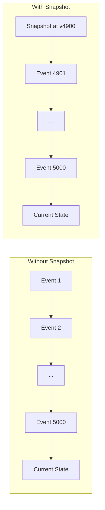
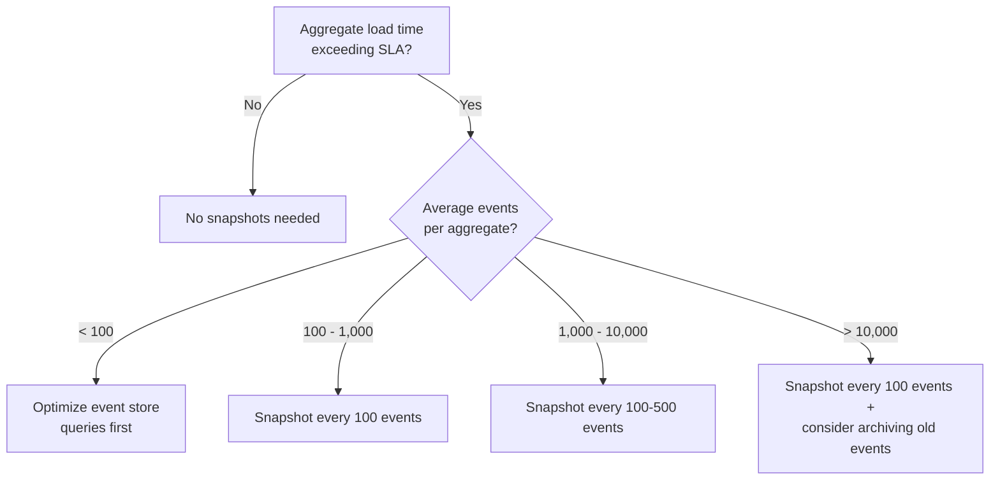

# Snapshots

## Why Snapshots Exist

In an event-sourced system, the current state of an aggregate is reconstructed by replaying all events from the beginning. For an aggregate with 10 events this takes microseconds. For an aggregate with 10,000 events, it takes milliseconds. For an aggregate with 1,000,000 events, it takes seconds — potentially too slow for a synchronous API response.

Snapshots solve this by periodically saving a **materialized view of the aggregate's state** at a specific event version. When loading the aggregate, the system loads the snapshot first, then replays only the events that occurred *after* the snapshot.



Without snapshot: replay 5,000 events.
With snapshot: load snapshot + replay 100 events.

## First Principles

### The Reconstruction Time Problem

The time to load an aggregate grows linearly with the number of events:

$$
T_{\text{load}} = T_{\text{read}}(n) + T_{\text{replay}}(n)
$$

Where:
- $T_{\text{read}}(n) = T_{\text{base}} + n \cdot T_{\text{per\_event}}$ — time to read $n$ events from the store
- $T_{\text{replay}}(n) = n \cdot T_{\text{apply}}$ — time to apply $n$ events to rebuild state

Typical values:

| Component | Time per Event | Notes |
|-----------|---------------|-------|
| Event store read (PostgreSQL) | 0.05 ms | Indexed by aggregate_id, ordered by version |
| Event deserialization | 0.01 ms | JSON.parse per event |
| Event application | 0.005 ms | State mutation |
| **Total per event** | **~0.065 ms** | |

So for $n$ events:

$$
T_{\text{load}}(n) \approx 10\text{ms} + 0.065 \cdot n \text{ ms}
$$

| Events | Load Time | Acceptable? |
|--------|-----------|-------------|
| 100 | 16 ms | Yes |
| 1,000 | 75 ms | Borderline |
| 10,000 | 660 ms | Too slow for APIs |
| 100,000 | 6.5 sec | Unacceptable |
| 1,000,000 | 65 sec | Unacceptable |

### With Snapshots

If a snapshot exists at version $v_s$ and the current version is $v_c$:

$$
T_{\text{load}} = T_{\text{snapshot\_read}} + T_{\text{deserialize\_snapshot}} + (v_c - v_s) \cdot T_{\text{per\_event}}
$$

With snapshots every 100 events:

| Events | Events to Replay | Load Time |
|--------|-----------------|-----------|
| 100 | 100 (no snapshot yet) | 16 ms |
| 1,000 | ≤ 100 | ~18 ms |
| 10,000 | ≤ 100 | ~18 ms |
| 100,000 | ≤ 100 | ~18 ms |
| 1,000,000 | ≤ 100 | ~18 ms |

Snapshots cap load time regardless of total event count.

### When NOT to Snapshot

If your aggregates rarely exceed a few hundred events, snapshots add complexity without benefit. Profile first, then add snapshots only where needed.

## Core Mechanics

### Snapshot Store Interface

```typescript
// domain/ports/snapshot-store.ts
export interface Snapshot<TState> {
  aggregateId: string;
  aggregateType: string;
  version: number;
  state: TState;
  createdAt: Date;
}

export interface SnapshotStore {
  load<TState>(
    aggregateId: string,
    aggregateType: string,
  ): Promise<Snapshot<TState> | null>;

  save<TState>(snapshot: Snapshot<TState>): Promise<void>;

  delete(aggregateId: string, aggregateType: string): Promise<void>;
}
```

### Event-Sourced Aggregate Base with Snapshot Support

```typescript
// domain/aggregate/event-sourced-aggregate.ts
import type { DomainEvent } from '../events/domain-event';

export abstract class EventSourcedAggregate<TState> {
  private _uncommittedEvents: DomainEvent[] = [];
  private _version: number = 0;

  protected abstract state: TState;

  get version(): number {
    return this._version;
  }

  get uncommittedEvents(): ReadonlyArray<DomainEvent> {
    return this._uncommittedEvents;
  }

  clearUncommittedEvents(): void {
    this._uncommittedEvents = [];
  }

  /**
   * Reconstruct from events only (no snapshot).
   */
  loadFromHistory(events: DomainEvent[]): void {
    for (const event of events) {
      this.applyEvent(event, false);
    }
  }

  /**
   * Reconstruct from snapshot + subsequent events.
   */
  loadFromSnapshot(snapshotState: TState, snapshotVersion: number, events: DomainEvent[]): void {
    this.state = snapshotState;
    this._version = snapshotVersion;

    for (const event of events) {
      this.applyEvent(event, false);
    }
  }

  /**
   * Get the current state for snapshotting.
   * Returns a deep copy to prevent mutation.
   */
  getSnapshotState(): TState {
    return structuredClone(this.state);
  }

  /**
   * Apply a new event (command side).
   */
  protected raise(event: DomainEvent): void {
    this.applyEvent(event, true);
  }

  private applyEvent(event: DomainEvent, isNew: boolean): void {
    this.apply(event);
    this._version++;

    if (isNew) {
      this._uncommittedEvents.push(event);
    }
  }

  /**
   * Apply an event to the state.
   * Subclasses implement this as a pure state transition.
   */
  protected abstract apply(event: DomainEvent): void;
}
```

### Concrete Aggregate Example

```typescript
// domain/model/account/account.aggregate.ts
import { EventSourcedAggregate } from '../../aggregate/event-sourced-aggregate';
import type { DomainEvent } from '../../events/domain-event';

interface AccountState {
  id: string;
  ownerId: string;
  balance: number;
  currency: string;
  isActive: boolean;
  transactionCount: number;
  createdAt: string;
}

export class AccountAggregate extends EventSourcedAggregate<AccountState> {
  protected state: AccountState = {
    id: '',
    ownerId: '',
    balance: 0,
    currency: 'USD',
    isActive: false,
    transactionCount: 0,
    createdAt: '',
  };

  get id(): string { return this.state.id; }
  get balance(): number { return this.state.balance; }
  get currency(): string { return this.state.currency; }
  get isActive(): boolean { return this.state.isActive; }
  get transactionCount(): number { return this.state.transactionCount; }

  // Commands
  static open(id: string, ownerId: string, currency: string): AccountAggregate {
    const account = new AccountAggregate();
    account.raise({
      type: 'AccountOpened',
      aggregateId: id,
      occurredAt: new Date(),
      payload: { ownerId, currency },
    });
    return account;
  }

  deposit(amount: number, reference: string): void {
    if (!this.state.isActive) throw new Error('Account is closed');
    if (amount <= 0) throw new Error('Deposit amount must be positive');

    this.raise({
      type: 'MoneyDeposited',
      aggregateId: this.state.id,
      occurredAt: new Date(),
      payload: { amount, reference, currency: this.state.currency },
    });
  }

  withdraw(amount: number, reference: string): void {
    if (!this.state.isActive) throw new Error('Account is closed');
    if (amount <= 0) throw new Error('Withdrawal amount must be positive');
    if (amount > this.state.balance) throw new Error('Insufficient funds');

    this.raise({
      type: 'MoneyWithdrawn',
      aggregateId: this.state.id,
      occurredAt: new Date(),
      payload: { amount, reference, currency: this.state.currency },
    });
  }

  close(): void {
    if (!this.state.isActive) throw new Error('Account already closed');
    if (this.state.balance !== 0) throw new Error('Balance must be zero to close');

    this.raise({
      type: 'AccountClosed',
      aggregateId: this.state.id,
      occurredAt: new Date(),
      payload: {},
    });
  }

  // Event application (pure state transitions)
  protected apply(event: DomainEvent): void {
    switch (event.type) {
      case 'AccountOpened':
        this.state = {
          id: event.aggregateId,
          ownerId: event.payload.ownerId as string,
          balance: 0,
          currency: event.payload.currency as string,
          isActive: true,
          transactionCount: 0,
          createdAt: event.occurredAt.toISOString(),
        };
        break;

      case 'MoneyDeposited':
        this.state.balance += event.payload.amount as number;
        this.state.transactionCount++;
        break;

      case 'MoneyWithdrawn':
        this.state.balance -= event.payload.amount as number;
        this.state.transactionCount++;
        break;

      case 'AccountClosed':
        this.state.isActive = false;
        break;
    }
  }
}
```

### Event-Sourced Repository with Snapshot Integration

```typescript
// infrastructure/persistence/event-sourced-repository.ts
import type { Pool } from 'pg';
import type { SnapshotStore, Snapshot } from '../../domain/ports/snapshot-store';
import type { DomainEvent } from '../../domain/events/domain-event';
import { AccountAggregate } from '../../domain/model/account/account.aggregate';

export interface EventStoreRow {
  event_id: string;
  aggregate_id: string;
  aggregate_type: string;
  event_type: string;
  payload: string;
  metadata: string;
  version: number;
  created_at: Date;
}

export class EventSourcedAccountRepository {
  private readonly SNAPSHOT_INTERVAL = 100; // Snapshot every 100 events

  constructor(
    private readonly pool: Pool,
    private readonly snapshotStore: SnapshotStore,
  ) {}

  async findById(accountId: string): Promise<AccountAggregate | null> {
    // 1. Try to load snapshot
    const snapshot = await this.snapshotStore.load<AccountState>(
      accountId,
      'Account',
    );

    // 2. Load events after snapshot (or all events if no snapshot)
    const fromVersion = snapshot ? snapshot.version + 1 : 0;
    const events = await this.loadEvents(accountId, fromVersion);

    if (!snapshot && events.length === 0) {
      return null; // Aggregate doesn't exist
    }

    // 3. Reconstruct aggregate
    const aggregate = new AccountAggregate();

    if (snapshot) {
      aggregate.loadFromSnapshot(snapshot.state, snapshot.version, events);
    } else {
      aggregate.loadFromHistory(events);
    }

    return aggregate;
  }

  async save(aggregate: AccountAggregate): Promise<void> {
    const events = aggregate.uncommittedEvents;
    if (events.length === 0) return;

    const client = await this.pool.connect();
    try {
      await client.query('BEGIN');

      // Optimistic concurrency: check current version
      const versionCheck = await client.query(
        `SELECT COALESCE(MAX(version), -1) as max_version
         FROM events WHERE aggregate_id = $1`,
        [aggregate.id],
      );

      const currentVersion = parseInt(versionCheck.rows[0].max_version);
      const expectedVersion = aggregate.version - events.length;

      if (currentVersion !== expectedVersion) {
        throw new OptimisticConcurrencyError(
          aggregate.id,
          expectedVersion,
          currentVersion,
        );
      }

      // Append events
      let version = currentVersion;
      for (const event of events) {
        version++;
        await client.query(
          `INSERT INTO events (event_id, aggregate_id, aggregate_type, event_type, payload, metadata, version, created_at)
           VALUES ($1, $2, $3, $4, $5, $6, $7, $8)`,
          [
            crypto.randomUUID(),
            event.aggregateId,
            'Account',
            event.type,
            JSON.stringify(event.payload),
            JSON.stringify({}),
            version,
            event.occurredAt,
          ],
        );
      }

      await client.query('COMMIT');

      // 4. Create snapshot if interval reached
      if (aggregate.version % this.SNAPSHOT_INTERVAL === 0 ||
          aggregate.version - (await this.getLastSnapshotVersion(aggregate.id)) >= this.SNAPSHOT_INTERVAL) {
        await this.createSnapshot(aggregate);
      }

      aggregate.clearUncommittedEvents();
    } catch (error) {
      await client.query('ROLLBACK');
      throw error;
    } finally {
      client.release();
    }
  }

  private async createSnapshot(aggregate: AccountAggregate): Promise<void> {
    const snapshot: Snapshot<any> = {
      aggregateId: aggregate.id,
      aggregateType: 'Account',
      version: aggregate.version,
      state: aggregate.getSnapshotState(),
      createdAt: new Date(),
    };

    await this.snapshotStore.save(snapshot);
  }

  private async getLastSnapshotVersion(aggregateId: string): Promise<number> {
    const snapshot = await this.snapshotStore.load(aggregateId, 'Account');
    return snapshot?.version ?? 0;
  }

  private async loadEvents(aggregateId: string, fromVersion: number): Promise<DomainEvent[]> {
    const result = await this.pool.query<EventStoreRow>(
      `SELECT event_type, aggregate_id, payload, created_at, version
       FROM events
       WHERE aggregate_id = $1 AND version >= $2
       ORDER BY version ASC`,
      [aggregateId, fromVersion],
    );

    return result.rows.map((row) => ({
      type: row.event_type,
      aggregateId: row.aggregate_id,
      occurredAt: row.created_at,
      payload: JSON.parse(row.payload),
    }));
  }
}
```

### PostgreSQL Snapshot Store

```typescript
// infrastructure/persistence/postgres-snapshot-store.ts
import type { Pool } from 'pg';
import type { SnapshotStore, Snapshot } from '../../domain/ports/snapshot-store';

export class PostgresSnapshotStore implements SnapshotStore {
  constructor(private readonly pool: Pool) {}

  async load<TState>(
    aggregateId: string,
    aggregateType: string,
  ): Promise<Snapshot<TState> | null> {
    const result = await this.pool.query(
      `SELECT aggregate_id, aggregate_type, version, state, created_at
       FROM snapshots
       WHERE aggregate_id = $1 AND aggregate_type = $2
       ORDER BY version DESC
       LIMIT 1`,
      [aggregateId, aggregateType],
    );

    if (result.rows.length === 0) return null;

    const row = result.rows[0];
    return {
      aggregateId: row.aggregate_id,
      aggregateType: row.aggregate_type,
      version: row.version,
      state: JSON.parse(row.state) as TState,
      createdAt: row.created_at,
    };
  }

  async save<TState>(snapshot: Snapshot<TState>): Promise<void> {
    await this.pool.query(
      `INSERT INTO snapshots (aggregate_id, aggregate_type, version, state, created_at)
       VALUES ($1, $2, $3, $4, $5)
       ON CONFLICT (aggregate_id, aggregate_type)
       DO UPDATE SET version = EXCLUDED.version, state = EXCLUDED.state, created_at = EXCLUDED.created_at`,
      [
        snapshot.aggregateId,
        snapshot.aggregateType,
        snapshot.version,
        JSON.stringify(snapshot.state),
        snapshot.createdAt,
      ],
    );
  }

  async delete(aggregateId: string, aggregateType: string): Promise<void> {
    await this.pool.query(
      'DELETE FROM snapshots WHERE aggregate_id = $1 AND aggregate_type = $2',
      [aggregateId, aggregateType],
    );
  }
}
```

### Database Schema

```sql
-- Event store table
CREATE TABLE events (
  event_id UUID PRIMARY KEY,
  aggregate_id VARCHAR(255) NOT NULL,
  aggregate_type VARCHAR(100) NOT NULL,
  event_type VARCHAR(100) NOT NULL,
  payload JSONB NOT NULL,
  metadata JSONB NOT NULL DEFAULT '{}',
  version INTEGER NOT NULL,
  created_at TIMESTAMP WITH TIME ZONE NOT NULL DEFAULT NOW(),
  UNIQUE (aggregate_id, version)
);

CREATE INDEX idx_events_aggregate ON events (aggregate_id, version);

-- Snapshot store table
CREATE TABLE snapshots (
  aggregate_id VARCHAR(255) NOT NULL,
  aggregate_type VARCHAR(100) NOT NULL,
  version INTEGER NOT NULL,
  state JSONB NOT NULL,
  created_at TIMESTAMP WITH TIME ZONE NOT NULL DEFAULT NOW(),
  PRIMARY KEY (aggregate_id, aggregate_type)
);
```

## Snapshot Strategies

### Strategy 1: Every N Events

The simplest strategy — create a snapshot every $N$ events:

```typescript
private shouldSnapshot(aggregate: EventSourcedAggregate<any>): boolean {
  return aggregate.version % this.SNAPSHOT_INTERVAL === 0;
}
```

**Pros**: Simple, predictable.
**Cons**: Fixed interval may be suboptimal (wasted snapshots for rarely-loaded aggregates).

### Strategy 2: Time-Based

Snapshot if the last snapshot is older than a threshold:

```typescript
private async shouldSnapshot(aggregateId: string): Promise<boolean> {
  const snapshot = await this.snapshotStore.load(aggregateId, 'Account');
  if (!snapshot) return true;

  const age = Date.now() - snapshot.createdAt.getTime();
  return age > 24 * 60 * 60 * 1000; // Re-snapshot daily
}
```

### Strategy 3: Event Count Since Last Snapshot

Snapshot when the number of events since the last snapshot exceeds a threshold:

```typescript
private async shouldSnapshot(
  aggregate: EventSourcedAggregate<any>,
  lastSnapshotVersion: number,
): Promise<boolean> {
  const eventsSinceSnapshot = aggregate.version - lastSnapshotVersion;
  return eventsSinceSnapshot >= this.SNAPSHOT_INTERVAL;
}
```

### Strategy 4: Adaptive (Cost-Based)

Snapshot based on load frequency — aggregates loaded often benefit more from snapshots:

```typescript
class AdaptiveSnapshotStrategy {
  private loadCounts = new Map<string, number>();

  recordLoad(aggregateId: string): void {
    const count = this.loadCounts.get(aggregateId) ?? 0;
    this.loadCounts.set(aggregateId, count + 1);
  }

  shouldSnapshot(
    aggregateId: string,
    currentVersion: number,
    lastSnapshotVersion: number,
  ): boolean {
    const loadCount = this.loadCounts.get(aggregateId) ?? 0;
    const eventsSince = currentVersion - lastSnapshotVersion;

    // Hot aggregates: snapshot more aggressively
    if (loadCount > 100 && eventsSince > 20) return true;

    // Cold aggregates: snapshot less frequently
    if (loadCount < 10 && eventsSince > 500) return true;

    // Default
    return eventsSince >= 100;
  }
}
```

### Decision Matrix

| Strategy | Best For | Complexity | Snapshot Count |
|----------|---------|-----------|---------------|
| Every N events | Simple systems, uniform access | Low | Predictable |
| Time-based | Regulatory compliance (daily state) | Low | Calendar-driven |
| Events since last | Most production systems | Medium | Adaptive to write rate |
| Cost-based adaptive | High-traffic systems | High | Optimal |

## Edge Cases & Failure Modes

### 1. Snapshot Corruption

If a snapshot becomes corrupted (bad serialization, schema change), the aggregate must be rebuildable from events alone:

```typescript
async findById(aggregateId: string): Promise<AccountAggregate | null> {
  try {
    const snapshot = await this.snapshotStore.load(aggregateId, 'Account');
    if (snapshot) {
      const events = await this.loadEvents(aggregateId, snapshot.version + 1);
      const aggregate = new AccountAggregate();
      aggregate.loadFromSnapshot(snapshot.state, snapshot.version, events);
      return aggregate;
    }
  } catch (error) {
    // Snapshot corruption — fall back to full replay
    console.warn(`Corrupt snapshot for ${aggregateId}, falling back to full replay:`, error);
    await this.snapshotStore.delete(aggregateId, 'Account');
  }

  // Full replay
  const allEvents = await this.loadEvents(aggregateId, 0);
  if (allEvents.length === 0) return null;

  const aggregate = new AccountAggregate();
  aggregate.loadFromHistory(allEvents);

  // Create a fresh snapshot
  await this.createSnapshot(aggregate);

  return aggregate;
}
```

### 2. Schema Evolution in Snapshots

When the aggregate state shape changes, old snapshots become incompatible. Options:

| Approach | Pros | Cons |
|----------|------|------|
| **Versioned snapshots** | Clean migration | Requires migration code |
| **Delete all snapshots on deploy** | Simple | Temporary performance hit (cold start) |
| **Lazy migration** | No downtime | Complexity in deserialization |

```typescript
// Versioned snapshot with migration
interface VersionedSnapshot<TState> extends Snapshot<TState> {
  schemaVersion: number;
}

function migrateAccountState(state: any, fromVersion: number): AccountState {
  let current = state;
  if (fromVersion < 2) {
    // v1 → v2: Added 'currency' field
    current = { ...current, currency: current.currency ?? 'USD' };
  }
  if (fromVersion < 3) {
    // v2 → v3: Renamed 'txCount' to 'transactionCount'
    current = {
      ...current,
      transactionCount: current.txCount ?? current.transactionCount ?? 0,
    };
    delete current.txCount;
  }
  return current;
}
```

### 3. Concurrent Snapshot Writes

Multiple instances may attempt to create a snapshot simultaneously. The UPSERT in the snapshot store handles this:

```sql
-- ON CONFLICT ensures only one snapshot exists per aggregate
INSERT INTO snapshots (aggregate_id, aggregate_type, version, state, created_at)
VALUES ($1, $2, $3, $4, $5)
ON CONFLICT (aggregate_id, aggregate_type)
DO UPDATE SET version = EXCLUDED.version, state = EXCLUDED.state, created_at = EXCLUDED.created_at
WHERE EXCLUDED.version > snapshots.version; -- Only update if newer
```

### 4. Large Snapshot Size

Some aggregates have large state (e.g., an order with 10,000 line items). Compress before storing:

```typescript
import { gzip, gunzip } from 'node:zlib';
import { promisify } from 'node:util';

const compress = promisify(gzip);
const decompress = promisify(gunzip);

async save<TState>(snapshot: Snapshot<TState>): Promise<void> {
  const json = JSON.stringify(snapshot.state);
  const compressed = await compress(Buffer.from(json));

  await this.pool.query(
    `INSERT INTO snapshots (aggregate_id, aggregate_type, version, state_compressed, created_at)
     VALUES ($1, $2, $3, $4, $5)
     ON CONFLICT (aggregate_id, aggregate_type)
     DO UPDATE SET version = EXCLUDED.version, state_compressed = EXCLUDED.state_compressed`,
    [snapshot.aggregateId, snapshot.aggregateType, snapshot.version, compressed, snapshot.createdAt],
  );
}
```

## Performance Characteristics

### Benchmark: Load Times with Various Snapshot Intervals

Aggregate with 50,000 events, PostgreSQL 16, Node.js 22:

| Snapshot Interval | Events to Replay | Load Time (p50) | Load Time (p99) |
|-------------------|-----------------|-----------------|-----------------|
| No snapshots | 50,000 | 3,200 ms | 4,100 ms |
| Every 10,000 | ≤ 10,000 | 680 ms | 850 ms |
| Every 1,000 | ≤ 1,000 | 85 ms | 110 ms |
| Every 100 | ≤ 100 | 18 ms | 25 ms |
| Every 50 | ≤ 50 | 15 ms | 20 ms |
| Every 10 | ≤ 10 | 12 ms | 16 ms |

Below 100 events, the snapshot read + deserialize time dominates (~10 ms). Snapshotting more frequently provides diminishing returns.

### Storage Overhead

| Scenario | Event Store Size | Snapshot Store Size | Overhead |
|----------|-----------------|--------------------|---------|
| 100K aggregates, 100 events each, snapshot every 100 | 10 GB | 500 MB | 5% |
| 100K aggregates, 10K events each, snapshot every 100 | 1 TB | 500 MB | 0.05% |
| 10K aggregates, 1M events each, snapshot every 1000 | 10 TB | 50 MB | 0.0005% |

Snapshot storage is negligible compared to event storage.

## Mathematical Foundations

### Optimal Snapshot Interval

Let:
- $C_s$ = cost of creating a snapshot (time + storage)
- $C_e$ = cost of replaying one event
- $L$ = number of loads between writes (load-to-write ratio)
- $W$ = number of writes between loads (write-to-load ratio)

The total cost per load with snapshot interval $N$:

$$
C_{\text{total}}(N) = \underbrace{\frac{C_s}{L}}_{\text{amortized snapshot cost}} + \underbrace{\frac{N}{2} \cdot C_e}_{\text{expected replay cost}}
$$

The expected number of events to replay is $N/2$ (uniform distribution between 0 and $N-1$).

Minimizing $C_{\text{total}}$:

$$
\frac{dC_{\text{total}}}{dN} = 0 \implies N^* = \sqrt{\frac{2 \cdot C_s \cdot L}{C_e}}
$$

Example: $C_s = 5\text{ms}$, $C_e = 0.065\text{ms}$, $L = 10$ (loaded 10 times per snapshot creation):

$$
N^* = \sqrt{\frac{2 \times 5 \times 10}{0.065}} = \sqrt{1538} \approx 39
$$

Optimal interval: snapshot every ~40 events.

::: info War Story
**The Account That Took 45 Seconds to Load**

A banking platform used event sourcing for customer accounts. One corporate account had 2.3 million events over 5 years (averaging 1,200 deposits, withdrawals, and adjustments per day). Without snapshots, loading this account took 45 seconds — far beyond the 3-second API timeout.

The team implemented snapshots with a 500-event interval. Load time dropped to 35 ms. But during the initial deployment, a bug in the snapshot serialization caused all snapshots to be written with an empty state object. When accounts were loaded, they appeared to have zero balance.

The team detected the issue within 4 minutes through balance reconciliation alerts. Because the event store was the source of truth and was untouched, they simply deleted all snapshots and let them rebuild lazily on the next load. Full recovery took 0 minutes of data loss — the events were always correct. The corrupt snapshots were just a performance optimization, not a source of truth.

This incident validated the core event sourcing principle: **events are the source of truth; snapshots are disposable caches**.
:::

## Decision Framework

### When to Add Snapshots



### Snapshot vs. Alternatives

| Approach | When to Use | Complexity |
|----------|------------|-----------|
| **Snapshots** | High event counts, same aggregate type | Medium |
| **Event archiving** | Very old events never needed | Medium |
| **Aggregate splitting** | Aggregate has too many responsibilities | High (domain redesign) |
| **CQRS read model** | Read path is slow, write path is fine | Medium |
| **In-memory caching** | Same aggregate loaded repeatedly | Low |

## Advanced Topics

### Snapshot Rebuild Pipeline

For bulk rebuilding snapshots (e.g., after schema migration):

```typescript
async function rebuildAllSnapshots(
  pool: Pool,
  snapshotStore: SnapshotStore,
  batchSize: number = 100,
): Promise<void> {
  let offset = 0;
  let processed = 0;

  while (true) {
    const aggregateIds = await pool.query(
      `SELECT DISTINCT aggregate_id FROM events
       WHERE aggregate_type = 'Account'
       ORDER BY aggregate_id
       LIMIT $1 OFFSET $2`,
      [batchSize, offset],
    );

    if (aggregateIds.rows.length === 0) break;

    for (const row of aggregateIds.rows) {
      const events = await loadAllEvents(pool, row.aggregate_id);
      const aggregate = new AccountAggregate();
      aggregate.loadFromHistory(events);

      await snapshotStore.save({
        aggregateId: row.aggregate_id,
        aggregateType: 'Account',
        version: aggregate.version,
        state: aggregate.getSnapshotState(),
        createdAt: new Date(),
      });

      processed++;
    }

    offset += batchSize;
    console.log(`Rebuilt ${processed} snapshots...`);
  }

  console.log(`Finished: ${processed} snapshots rebuilt`);
}
```

### In-Memory Snapshot Cache

For hot aggregates, cache snapshots in memory to avoid the database read:

```typescript
class CachedSnapshotStore implements SnapshotStore {
  private cache = new Map<string, { snapshot: Snapshot<any>; accessedAt: number }>();
  private readonly maxSize: number;
  private readonly ttlMs: number;

  constructor(
    private readonly delegate: SnapshotStore,
    options: { maxSize?: number; ttlMs?: number } = {},
  ) {
    this.maxSize = options.maxSize ?? 10_000;
    this.ttlMs = options.ttlMs ?? 60_000;
  }

  async load<TState>(aggregateId: string, aggregateType: string): Promise<Snapshot<TState> | null> {
    const key = `${aggregateType}:${aggregateId}`;
    const cached = this.cache.get(key);

    if (cached && Date.now() - cached.accessedAt < this.ttlMs) {
      cached.accessedAt = Date.now();
      return cached.snapshot as Snapshot<TState>;
    }

    const snapshot = await this.delegate.load<TState>(aggregateId, aggregateType);

    if (snapshot) {
      this.evictIfFull();
      this.cache.set(key, { snapshot, accessedAt: Date.now() });
    }

    return snapshot;
  }

  async save<TState>(snapshot: Snapshot<TState>): Promise<void> {
    await this.delegate.save(snapshot);
    const key = `${snapshot.aggregateType}:${snapshot.aggregateId}`;
    this.cache.set(key, { snapshot, accessedAt: Date.now() });
  }

  private evictIfFull(): void {
    if (this.cache.size < this.maxSize) return;
    // Evict least recently accessed
    let oldestKey = '';
    let oldestTime = Infinity;
    for (const [key, entry] of this.cache) {
      if (entry.accessedAt < oldestTime) {
        oldestTime = entry.accessedAt;
        oldestKey = key;
      }
    }
    if (oldestKey) this.cache.delete(oldestKey);
  }
}
```

## Further Reading

- [Event Sourcing Deep Dive](/architecture-patterns/cqrs-event-sourcing/event-sourcing-deep-dive) — the foundation
- [Aggregate Design](/architecture-patterns/cqrs-event-sourcing/aggregate-design) — aggregate boundaries
- [Event Upcasting](./event-upcasting) — handling schema changes (which affect snapshots)
- [Projections](/architecture-patterns/cqrs-event-sourcing/projections) — read-side materialized views
- [Sagas & Process Managers](./sagas-process-managers) — long-running processes
