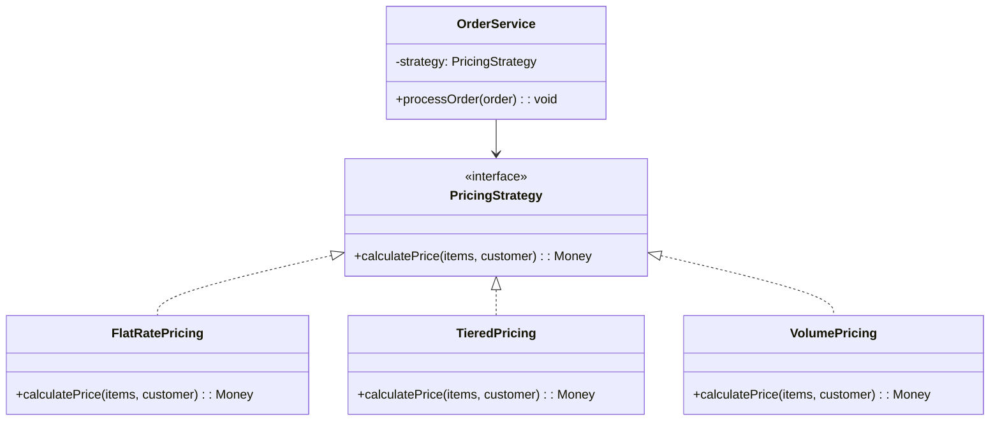
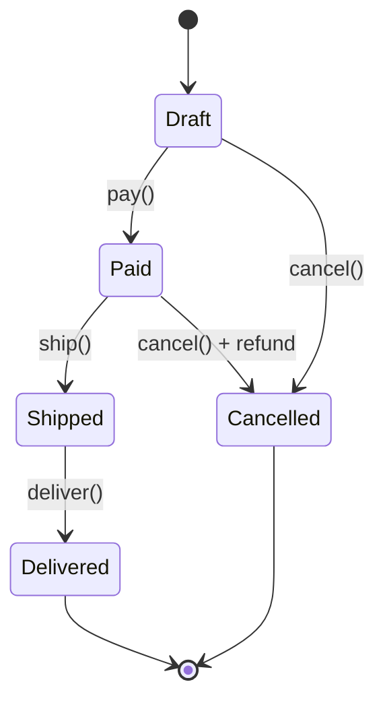

# Behavioral Patterns

Behavioral patterns deal with **how objects communicate, delegate, and coordinate** their responsibilities. If creational patterns answer "how do I make things?" and structural patterns answer "how do I assemble things?", behavioral patterns answer "how do things talk to each other?"

This is the largest and most practically relevant category of design patterns. Most of the complexity in real-world software systems is not in how objects are created or structured — it is in how they interact. A poorly designed communication model leads to tight coupling, cascading changes, and systems that are impossible to extend without modifying existing code.

The modern evolution of behavioral patterns is significant. Many patterns that originally required class hierarchies and inheritance can now be expressed more concisely with first-class functions, closures, and event emitters. Understanding both the classical form and the functional form is essential because you will encounter both in real codebases.

## Strategy

### The Problem

You have an algorithm that needs to vary based on context. Perhaps your e-commerce platform supports multiple pricing strategies (flat rate, tiered, volume discount, promotional). Embedding all variations in a single function with conditionals creates a monolith that grows with every new strategy and requires modifying existing code to add new behavior.

### The Pattern

Strategy defines a family of algorithms, encapsulates each one behind a common interface, and makes them interchangeable. The client code selects which strategy to use without knowing its internal implementation.



### TypeScript — Classical and Functional

```typescript
// Classical: interface + classes
interface CompressionStrategy {
  compress(data: Buffer): Promise<Buffer>;
  decompress(data: Buffer): Promise<Buffer>;
  readonly name: string;
}

class GzipStrategy implements CompressionStrategy {
  readonly name = 'gzip';
  async compress(data: Buffer): Promise<Buffer> {
    return new Promise((resolve, reject) =>
      zlib.gzip(data, (err, result) => err ? reject(err) : resolve(result))
    );
  }
  async decompress(data: Buffer): Promise<Buffer> {
    return new Promise((resolve, reject) =>
      zlib.gunzip(data, (err, result) => err ? reject(err) : resolve(result))
    );
  }
}

class BrotliStrategy implements CompressionStrategy {
  readonly name = 'brotli';
  async compress(data: Buffer): Promise<Buffer> {
    return new Promise((resolve, reject) =>
      zlib.brotliCompress(data, (err, result) => err ? reject(err) : resolve(result))
    );
  }
  async decompress(data: Buffer): Promise<Buffer> {
    return new Promise((resolve, reject) =>
      zlib.brotliDecompress(data, (err, result) => err ? reject(err) : resolve(result))
    );
  }
}

// Functional: strategy as a function (simpler when the interface is one method)
type SortStrategy<T> = (items: T[]) => T[];

const sortByPrice: SortStrategy<Product> = (items) =>
  [...items].sort((a, b) => a.price.cents - b.price.cents);

const sortByRating: SortStrategy<Product> = (items) =>
  [...items].sort((a, b) => b.rating - a.rating);

const sortByRelevance: SortStrategy<Product> = (items) =>
  [...items].sort((a, b) => b.relevanceScore - a.relevanceScore);

// Usage — strategy selected at runtime
function displayProducts(products: Product[], sortBy: SortStrategy<Product>) {
  const sorted = sortBy(products);
  return sorted.map(renderProductCard);
}
```

### Go Implementation

```go
// Strategy as interface
type RateLimiter interface {
    Allow(key string) (bool, error)
}

// Fixed window strategy
type FixedWindowLimiter struct {
    store    Store
    limit    int
    windowMs int64
}

func (f *FixedWindowLimiter) Allow(key string) (bool, error) {
    window := time.Now().UnixMilli() / f.windowMs
    windowKey := fmt.Sprintf("%s:%d", key, window)
    count, err := f.store.Increment(windowKey, f.windowMs)
    if err != nil {
        return false, err
    }
    return count <= f.limit, nil
}

// Sliding window strategy
type SlidingWindowLimiter struct {
    store    Store
    limit    int
    windowMs int64
}

func (s *SlidingWindowLimiter) Allow(key string) (bool, error) {
    now := time.Now().UnixMilli()
    count, err := s.store.CountInRange(key, now-s.windowMs, now)
    if err != nil {
        return false, err
    }
    if count >= s.limit {
        return false, nil
    }
    return true, s.store.Add(key, now)
}

// Client code does not know which strategy is active
type APIHandler struct {
    limiter RateLimiter
}
```

::: tip Strategy vs. If/Else
Use Strategy when the number of algorithms is open-ended and new ones are added over time. If you have 2-3 fixed options that will never change, a simple `if/else` or `switch` is clearer. The pattern pays for itself when adding a new strategy requires zero changes to existing code.
:::

## Observer

### The Problem

When one object changes state, multiple other objects need to react — but the state-owner should not know about or depend on the reactors. A user updates their profile, and the search index needs updating, the analytics service needs a signal, and the cache needs invalidation. Hardwiring all these reactions into the profile update code creates a tightly coupled mess.

### The Pattern

Observer defines a one-to-many dependency between objects so that when one object changes state, all its dependents are notified and updated automatically. This is the foundation of every event system, reactive library, and pub/sub mechanism.

### TypeScript — Typed Event Emitter

```typescript
type EventMap = {
  'user:created': { userId: string; email: string };
  'user:updated': { userId: string; changes: Partial<UserProfile> };
  'order:placed': { orderId: string; userId: string; total: Money };
  'order:shipped': { orderId: string; trackingNumber: string };
};

class TypedEventEmitter<T extends Record<string, unknown>> {
  private listeners = new Map<keyof T, Set<(payload: any) => void>>();

  on<K extends keyof T>(event: K, handler: (payload: T[K]) => void): () => void {
    if (!this.listeners.has(event)) {
      this.listeners.set(event, new Set());
    }
    this.listeners.get(event)!.add(handler);

    // Return unsubscribe function
    return () => {
      this.listeners.get(event)?.delete(handler);
    };
  }

  emit<K extends keyof T>(event: K, payload: T[K]): void {
    const handlers = this.listeners.get(event);
    if (!handlers) return;
    for (const handler of handlers) {
      try {
        handler(payload);
      } catch (error) {
        console.error(`Error in event handler for ${String(event)}:`, error);
      }
    }
  }
}

// Usage
const events = new TypedEventEmitter<EventMap>();

// Subscribers — each reacts independently
const unsubSearch = events.on('user:updated', async ({ userId, changes }) => {
  await searchIndex.updateUser(userId, changes);
});

events.on('user:updated', async ({ userId }) => {
  await cache.invalidate(`user:${userId}`);
});

events.on('order:placed', async ({ orderId, userId, total }) => {
  await analytics.track('purchase', { orderId, userId, amount: total.cents });
});

// Publisher — does not know about subscribers
class UserService {
  constructor(private events: TypedEventEmitter<EventMap>) {}

  async updateProfile(userId: string, changes: Partial<UserProfile>): Promise<void> {
    await this.userRepo.update(userId, changes);
    this.events.emit('user:updated', { userId, changes });
  }
}
```

### Event-Driven Architecture: Observer at Scale

The Observer pattern is the in-process version of [Event-Driven Architecture](/architecture-patterns/event-driven/). When you move from in-process events to distributed events (Kafka, RabbitMQ, SNS), the pattern is the same — the difference is the transport mechanism and the consistency guarantees.

| Aspect | In-Process Observer | Distributed Events |
|---|---|---|
| Transport | Function calls | Message broker |
| Delivery guarantee | At-most-once (sync) | At-least-once (with acks) |
| Ordering | Guaranteed | Partition-level ordering |
| Latency | Microseconds | Milliseconds to seconds |
| Failure isolation | Shared fate | Independent consumers |
| Scaling | Single process | Horizontal consumer scaling |

::: warning Observer Memory Leaks
The most common Observer bug is forgetting to unsubscribe. In long-running applications, leaked subscriptions cause memory leaks and phantom handlers. Always store the unsubscribe function and call it when the subscriber is destroyed. In React, this means cleaning up in `useEffect` return. In Node.js services, clean up on shutdown.
:::

## Command

### The Problem

You need to encapsulate actions as objects — either to queue them, log them, undo them, or replay them. A text editor needs undo/redo. A task queue needs serializable operations. A [CQRS](/architecture-patterns/cqrs-event-sourcing/) system needs to separate the intent of a mutation from its execution.

### The Pattern

Command encapsulates a request as an object, thereby letting you parameterize clients with different requests, queue or log requests, and support undo operations.

### TypeScript Implementation

```typescript
interface Command {
  execute(): Promise<void>;
  undo(): Promise<void>;
  describe(): string;
}

class MoveWidgetCommand implements Command {
  private previousPosition: Position | null = null;

  constructor(
    private widget: Widget,
    private newPosition: Position,
  ) {}

  async execute(): Promise<void> {
    this.previousPosition = this.widget.position;
    this.widget.moveTo(this.newPosition);
  }

  async undo(): Promise<void> {
    if (this.previousPosition) {
      this.widget.moveTo(this.previousPosition);
    }
  }

  describe(): string {
    return `Move ${this.widget.id} to (${this.newPosition.x}, ${this.newPosition.y})`;
  }
}

class ResizeWidgetCommand implements Command {
  private previousSize: Size | null = null;

  constructor(
    private widget: Widget,
    private newSize: Size,
  ) {}

  async execute(): Promise<void> {
    this.previousSize = this.widget.size;
    this.widget.resizeTo(this.newSize);
  }

  async undo(): Promise<void> {
    if (this.previousSize) {
      this.widget.resizeTo(this.previousSize);
    }
  }

  describe(): string {
    return `Resize ${this.widget.id} to ${this.newSize.width}x${this.newSize.height}`;
  }
}

// Command history — enables undo/redo
class CommandHistory {
  private executed: Command[] = [];
  private undone: Command[] = [];

  async execute(command: Command): Promise<void> {
    await command.execute();
    this.executed.push(command);
    this.undone = []; // clear redo stack on new action
  }

  async undo(): Promise<void> {
    const command = this.executed.pop();
    if (command) {
      await command.undo();
      this.undone.push(command);
    }
  }

  async redo(): Promise<void> {
    const command = this.undone.pop();
    if (command) {
      await command.execute();
      this.executed.push(command);
    }
  }

  getHistory(): string[] {
    return this.executed.map(c => c.describe());
  }
}
```

### Command in CQRS

In [CQRS architectures](/architecture-patterns/cqrs-event-sourcing/), the Command pattern is fundamental. Commands represent the intent to change state, and the command handler decides whether and how to execute that intent:

```typescript
// CQRS command — immutable data, no execute method
interface PlaceOrderCommand {
  readonly type: 'PlaceOrder';
  readonly userId: string;
  readonly items: ReadonlyArray<{ sku: string; quantity: number }>;
  readonly shippingAddress: Address;
}

// Command handler — contains all the execution logic
class PlaceOrderHandler {
  constructor(
    private orderRepo: OrderRepository,
    private inventory: InventoryService,
    private events: EventBus,
  ) {}

  async handle(command: PlaceOrderCommand): Promise<string> {
    // Validate
    for (const item of command.items) {
      const available = await this.inventory.check(item.sku, item.quantity);
      if (!available) throw new InsufficientStockError(item.sku);
    }

    // Execute
    const order = Order.create(command.userId, command.items, command.shippingAddress);
    await this.orderRepo.save(order);

    // Publish domain events
    this.events.publish({ type: 'OrderPlaced', orderId: order.id, ...command });

    return order.id;
  }
}
```

## Chain of Responsibility

### The Problem

A request needs to be processed by a series of handlers, where each handler either processes the request, passes it to the next handler, or both. You want to add, remove, or reorder handlers without modifying the others. This is the pattern behind every middleware system in web frameworks.

### TypeScript — Middleware Pipeline

```typescript
type Context = {
  req: Request;
  res: Response;
  user?: AuthenticatedUser;
  startTime?: number;
  [key: string]: unknown;
};

type Next = () => Promise<void>;
type Middleware = (ctx: Context, next: Next) => Promise<void>;

// Timing middleware
const timing: Middleware = async (ctx, next) => {
  ctx.startTime = performance.now();
  await next();
  const duration = performance.now() - (ctx.startTime ?? 0);
  ctx.res.setHeader('X-Response-Time', `${duration.toFixed(2)}ms`);
};

// Authentication middleware
const authenticate: Middleware = async (ctx, next) => {
  const token = ctx.req.headers.authorization?.replace('Bearer ', '');
  if (!token) {
    ctx.res.status = 401;
    ctx.res.body = { error: 'Authentication required' };
    return; // do NOT call next — chain stops here
  }
  try {
    ctx.user = await verifyToken(token);
    await next(); // authenticated — continue chain
  } catch {
    ctx.res.status = 401;
    ctx.res.body = { error: 'Invalid token' };
  }
};

// Rate limiting middleware
const rateLimit = (limit: number, windowMs: number): Middleware => {
  const store = new Map<string, { count: number; resetAt: number }>();

  return async (ctx, next) => {
    const key = ctx.user?.id ?? ctx.req.ip;
    const now = Date.now();
    const record = store.get(key);

    if (record && record.resetAt > now && record.count >= limit) {
      ctx.res.status = 429;
      ctx.res.body = { error: 'Rate limit exceeded' };
      return;
    }

    if (!record || record.resetAt <= now) {
      store.set(key, { count: 1, resetAt: now + windowMs });
    } else {
      record.count++;
    }

    await next();
  };
};

// Pipeline composition
class Pipeline {
  private middlewares: Middleware[] = [];

  use(middleware: Middleware): this {
    this.middlewares.push(middleware);
    return this;
  }

  async execute(ctx: Context): Promise<void> {
    const runner = this.compose(this.middlewares);
    await runner(ctx, async () => {});
  }

  private compose(middlewares: Middleware[]): Middleware {
    return (ctx, next) => {
      let index = -1;
      const dispatch = async (i: number): Promise<void> => {
        if (i <= index) throw new Error('next() called multiple times');
        index = i;
        const fn = i < middlewares.length ? middlewares[i] : next;
        await fn(ctx, () => dispatch(i + 1));
      };
      return dispatch(0);
    };
  }
}

// Usage
const pipeline = new Pipeline()
  .use(timing)
  .use(authenticate)
  .use(rateLimit(100, 60_000));
```

### Go — HTTP Middleware

```go
type Middleware func(http.Handler) http.Handler

func Logging(logger *slog.Logger) Middleware {
    return func(next http.Handler) http.Handler {
        return http.HandlerFunc(func(w http.ResponseWriter, r *http.Request) {
            start := time.Now()
            wrapped := &responseWriter{ResponseWriter: w, status: 200}
            next.ServeHTTP(wrapped, r)
            logger.Info("request",
                "method", r.Method,
                "path", r.URL.Path,
                "status", wrapped.status,
                "duration", time.Since(start),
            )
        })
    }
}

func Recovery(logger *slog.Logger) Middleware {
    return func(next http.Handler) http.Handler {
        return http.HandlerFunc(func(w http.ResponseWriter, r *http.Request) {
            defer func() {
                if err := recover(); err != nil {
                    logger.Error("panic recovered", "error", err)
                    w.WriteHeader(http.StatusInternalServerError)
                }
            }()
            next.ServeHTTP(w, r)
        })
    }
}

// Chain applies middleware in order
func Chain(handler http.Handler, middlewares ...Middleware) http.Handler {
    for i := len(middlewares) - 1; i >= 0; i-- {
        handler = middlewares[i](handler)
    }
    return handler
}

// Usage
mux := http.NewServeMux()
mux.HandleFunc("/api/users", handleUsers)
handler := Chain(mux, Recovery(logger), Logging(logger), CORS(), Auth(jwtSecret))
```

## State

### The Problem

An object's behavior changes based on its internal state, and the transitions between states have complex rules. An order can be `draft`, `pending_payment`, `paid`, `shipped`, `delivered`, or `cancelled` — and each state allows different operations. Embedding this logic in a single class with conditionals on every method creates unmaintainable code.

### TypeScript Implementation

```typescript
interface OrderState {
  readonly name: string;
  pay(order: Order): OrderState;
  ship(order: Order): OrderState;
  deliver(order: Order): OrderState;
  cancel(order: Order): OrderState;
}

class DraftState implements OrderState {
  readonly name = 'draft';

  pay(order: Order): OrderState {
    order.recordPayment();
    return new PaidState();
  }

  ship(): OrderState { throw new InvalidTransitionError('draft', 'ship'); }
  deliver(): OrderState { throw new InvalidTransitionError('draft', 'deliver'); }

  cancel(order: Order): OrderState {
    order.recordCancellation('Customer cancelled draft order');
    return new CancelledState();
  }
}

class PaidState implements OrderState {
  readonly name = 'paid';

  pay(): OrderState { throw new InvalidTransitionError('paid', 'pay'); }

  ship(order: Order): OrderState {
    order.recordShipment();
    return new ShippedState();
  }

  deliver(): OrderState { throw new InvalidTransitionError('paid', 'deliver'); }

  cancel(order: Order): OrderState {
    order.recordRefund();
    order.recordCancellation('Customer cancelled after payment — refund issued');
    return new CancelledState();
  }
}

class ShippedState implements OrderState {
  readonly name = 'shipped';
  pay(): OrderState { throw new InvalidTransitionError('shipped', 'pay'); }
  ship(): OrderState { throw new InvalidTransitionError('shipped', 'ship'); }

  deliver(order: Order): OrderState {
    order.recordDelivery();
    return new DeliveredState();
  }

  cancel(): OrderState {
    throw new InvalidTransitionError('shipped', 'cancel');
  }
}

// State machine visualization
```



## Template Method

### The Problem

Multiple classes share the same overall algorithm but differ in specific steps. You want to define the algorithm skeleton once and let subclasses override the varying steps without changing the algorithm's structure.

### TypeScript Implementation

```typescript
abstract class DataExporter {
  // Template method — defines the algorithm skeleton
  async export(query: ExportQuery): Promise<ExportResult> {
    const data = await this.fetchData(query);
    const validated = this.validate(data);
    const transformed = this.transform(validated);
    const serialized = this.serialize(transformed);
    const location = await this.write(serialized, query.outputPath);

    return { recordCount: validated.length, location };
  }

  // Concrete steps — shared by all exporters
  private validate(data: RawRecord[]): ValidRecord[] {
    return data.filter(record => {
      if (!record.id) return false;
      if (!record.timestamp) return false;
      return true;
    }) as ValidRecord[];
  }

  // Abstract steps — subclasses must implement
  protected abstract fetchData(query: ExportQuery): Promise<RawRecord[]>;
  protected abstract transform(data: ValidRecord[]): TransformedRecord[];
  protected abstract serialize(data: TransformedRecord[]): Buffer;

  // Hook — subclasses may override
  protected async write(data: Buffer, path: string): Promise<string> {
    await fs.writeFile(path, data);
    return path;
  }
}

class CSVExporter extends DataExporter {
  protected async fetchData(query: ExportQuery): Promise<RawRecord[]> {
    return this.db.query(query.sql);
  }

  protected transform(data: ValidRecord[]): TransformedRecord[] {
    return data.map(record => ({
      ...record,
      timestamp: record.timestamp.toISOString(),
    }));
  }

  protected serialize(data: TransformedRecord[]): Buffer {
    const headers = Object.keys(data[0]).join(',');
    const rows = data.map(r => Object.values(r).join(','));
    return Buffer.from([headers, ...rows].join('\n'));
  }
}

class S3ParquetExporter extends DataExporter {
  protected async fetchData(query: ExportQuery): Promise<RawRecord[]> {
    return this.warehouse.query(query.sql);
  }

  protected transform(data: ValidRecord[]): TransformedRecord[] {
    return data; // Parquet preserves types
  }

  protected serialize(data: TransformedRecord[]): Buffer {
    return parquet.serialize(data);
  }

  // Override hook to write to S3 instead of local filesystem
  protected async write(data: Buffer, path: string): Promise<string> {
    const s3Key = `exports/${path}`;
    await this.s3.putObject({ Bucket: this.bucket, Key: s3Key, Body: data });
    return `s3://${this.bucket}/${s3Key}`;
  }
}
```

::: tip Template Method vs. Strategy
Template Method uses inheritance to vary steps within a fixed algorithm. Strategy uses composition to swap the entire algorithm. Prefer Strategy when the algorithms are independent and interchangeable. Use Template Method when there is a shared algorithm skeleton with predictable variation points. In modern code, Template Method is less common because composition (passing functions) is generally preferred over inheritance.
:::

## Functional Alternatives

Many behavioral patterns have simpler functional equivalents in modern languages:

| Pattern | Classical (OOP) | Functional Equivalent |
|---|---|---|
| Strategy | Interface + classes | Higher-order function parameter |
| Observer | Subject/Observer classes | Event emitter / RxJS Observable |
| Command | Command interface + classes | Closure capturing state |
| Chain of Responsibility | Handler chain classes | Function composition / pipe |
| Template Method | Abstract class + overrides | Higher-order function with callbacks |
| State | State interface + classes | Discriminated union + reducer |

```typescript
// State as discriminated union + reducer (functional approach)
type OrderState =
  | { status: 'draft' }
  | { status: 'paid'; paidAt: Date }
  | { status: 'shipped'; shippedAt: Date; trackingNumber: string }
  | { status: 'delivered'; deliveredAt: Date }
  | { status: 'cancelled'; reason: string };

type OrderAction =
  | { type: 'PAY' }
  | { type: 'SHIP'; trackingNumber: string }
  | { type: 'DELIVER' }
  | { type: 'CANCEL'; reason: string };

function orderReducer(state: OrderState, action: OrderAction): OrderState {
  switch (state.status) {
    case 'draft':
      if (action.type === 'PAY') return { status: 'paid', paidAt: new Date() };
      if (action.type === 'CANCEL') return { status: 'cancelled', reason: action.reason };
      throw new InvalidTransitionError(state.status, action.type);
    case 'paid':
      if (action.type === 'SHIP') return { status: 'shipped', shippedAt: new Date(), trackingNumber: action.trackingNumber };
      if (action.type === 'CANCEL') return { status: 'cancelled', reason: action.reason };
      throw new InvalidTransitionError(state.status, action.type);
    case 'shipped':
      if (action.type === 'DELIVER') return { status: 'delivered', deliveredAt: new Date() };
      throw new InvalidTransitionError(state.status, action.type);
    default:
      throw new InvalidTransitionError(state.status, action.type);
  }
}
```

## Further Reading

- [Creational Patterns](/architecture-patterns/design-patterns/creational-patterns) — Factory, Builder, and Prototype
- [Structural Patterns](/architecture-patterns/design-patterns/structural-patterns) — Adapter, Decorator, Proxy, and Facade
- [Event-Driven Architecture](/architecture-patterns/event-driven/) — Observer pattern at distributed scale
- [CQRS & Event Sourcing](/architecture-patterns/cqrs-event-sourcing/) — Command pattern as architectural foundation
- [Cloud Design Patterns](/architecture-patterns/cloud-native/cloud-design-patterns) — Circuit Breaker, Retry, and Saga as behavioral patterns for distributed systems