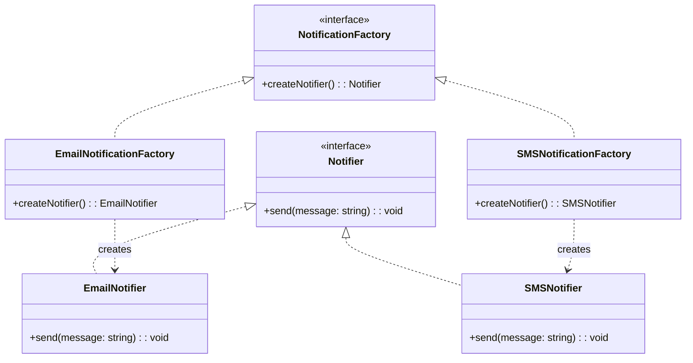
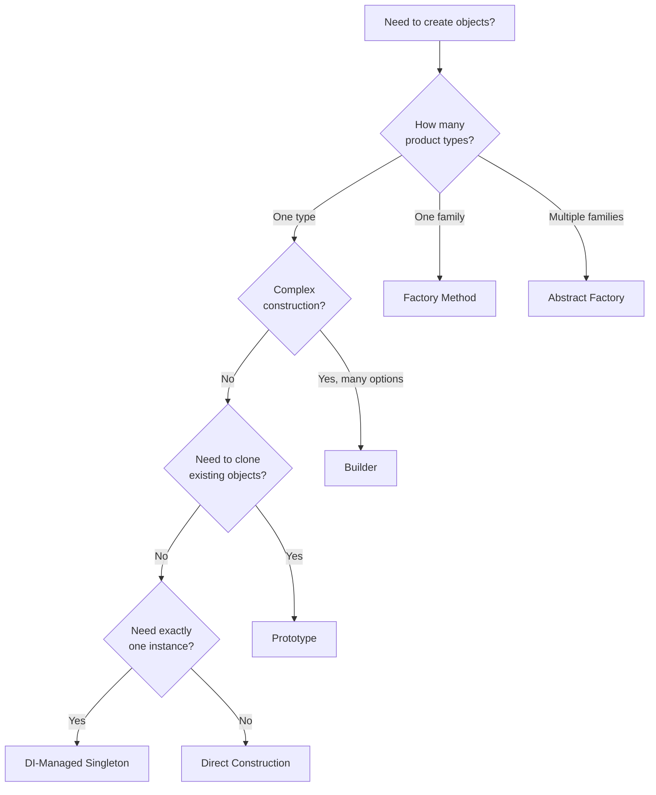

# Creational Patterns

Creational patterns solve a deceptively fundamental problem: **how do you create objects without hardcoding the exact classes you instantiate?** The moment you write `new ConcreteClass()` directly in your business logic, you have coupled your code to that specific implementation. When requirements change — and they always do — that coupling cascades into modifications across your entire codebase.

The underlying principle behind every creational pattern is the same: **separate the decision of which object to create from the code that uses the object.** The patterns differ in how they achieve this separation and which trade-offs they accept.

## Factory Method

### The Problem

You are building a notification system. Today you send emails. Tomorrow the product team wants SMS. Next quarter they want push notifications. If your business logic directly instantiates `EmailNotifier`, every new channel requires modifying the business logic — not because the business rules changed, but because the creation logic changed.

### The Pattern

Factory Method defines an interface for creating objects but lets subclasses or implementing classes decide which class to instantiate. The creation logic is extracted into a method that can be overridden.



### TypeScript Implementation

```typescript
// The product interface
interface Notifier {
  send(recipient: string, message: string): Promise<void>;
}

// Concrete products
class EmailNotifier implements Notifier {
  constructor(private smtpClient: SMTPClient) {}

  async send(recipient: string, message: string): Promise<void> {
    await this.smtpClient.sendMail({
      to: recipient,
      subject: 'Notification',
      body: message,
    });
  }
}

class SMSNotifier implements Notifier {
  constructor(private twilioClient: TwilioClient) {}

  async send(recipient: string, message: string): Promise<void> {
    await this.twilioClient.messages.create({
      to: recipient,
      body: message,
    });
  }
}

// Factory function (modern TypeScript prefers functions over classes)
type NotifierType = 'email' | 'sms' | 'push';

function createNotifier(type: NotifierType, config: AppConfig): Notifier {
  switch (type) {
    case 'email':
      return new EmailNotifier(new SMTPClient(config.smtp));
    case 'sms':
      return new SMSNotifier(new TwilioClient(config.twilio));
    case 'push':
      return new PushNotifier(new FCMClient(config.firebase));
    default:
      throw new Error(`Unknown notifier type: ${type satisfies never}`);
  }
}

// Usage — business logic is decoupled from creation
async function notifyUser(userId: string, message: string) {
  const prefs = await getUserPreferences(userId);
  const notifier = createNotifier(prefs.preferredChannel, appConfig);
  await notifier.send(prefs.contactInfo, message);
}
```

### Go Implementation

```go
type Notifier interface {
    Send(ctx context.Context, recipient, message string) error
}

type EmailNotifier struct {
    client *smtp.Client
}

func (e *EmailNotifier) Send(ctx context.Context, recipient, message string) error {
    return e.client.SendMail(ctx, recipient, message)
}

type SMSNotifier struct {
    client *twilio.Client
}

func (s *SMSNotifier) Send(ctx context.Context, recipient, message string) error {
    return s.client.SendSMS(ctx, recipient, message)
}

func NewNotifier(notifierType string, cfg *Config) (Notifier, error) {
    switch notifierType {
    case "email":
        return &EmailNotifier{client: smtp.NewClient(cfg.SMTP)}, nil
    case "sms":
        return &SMSNotifier{client: twilio.NewClient(cfg.Twilio)}, nil
    default:
        return nil, fmt.Errorf("unknown notifier type: %s", notifierType)
    }
}
```

::: tip When to Use Factory Method
Use Factory Method when you need to create objects that share an interface but differ in implementation, and the calling code should not know or care which concrete implementation it receives. This is especially common in plugin architectures, provider-based systems, and anywhere you need to swap implementations based on configuration or runtime context.
:::

## Abstract Factory

### The Problem

You are building a cross-platform UI toolkit. Each platform (web, iOS, Android) has its own button, input field, and modal component. You need to create families of related components that are guaranteed to be compatible with each other — you cannot mix a web button with an iOS modal.

### The Pattern

Abstract Factory provides an interface for creating families of related objects without specifying their concrete classes. Unlike Factory Method (which creates one product), Abstract Factory creates entire product families.

```typescript
// Abstract products
interface Button {
  render(): string;
  onClick(handler: () => void): void;
}

interface TextField {
  render(): string;
  getValue(): string;
}

interface Modal {
  render(): string;
  open(): void;
  close(): void;
}

// Abstract factory
interface UIFactory {
  createButton(label: string): Button;
  createTextField(placeholder: string): TextField;
  createModal(title: string): Modal;
}

// Concrete factory — all products are guaranteed compatible
class WebUIFactory implements UIFactory {
  createButton(label: string): Button {
    return new WebButton(label);
  }
  createTextField(placeholder: string): TextField {
    return new WebTextField(placeholder);
  }
  createModal(title: string): Modal {
    return new WebModal(title);
  }
}

class IOSUIFactory implements UIFactory {
  createButton(label: string): Button {
    return new IOSButton(label);
  }
  createTextField(placeholder: string): TextField {
    return new IOSTextField(placeholder);
  }
  createModal(title: string): Modal {
    return new IOSModal(title);
  }
}

// Client code — completely platform-agnostic
function renderLoginForm(factory: UIFactory) {
  const emailField = factory.createTextField('Enter email');
  const passwordField = factory.createTextField('Enter password');
  const submitButton = factory.createButton('Sign In');
  const errorModal = factory.createModal('Login Failed');

  return { emailField, passwordField, submitButton, errorModal };
}
```

::: warning Abstract Factory vs Factory Method
Abstract Factory is significantly more complex than Factory Method and is only justified when you need to create families of related objects that must be used together. If you only create one type of object, use Factory Method. If the objects from different families can be mixed freely, you do not need Abstract Factory.
:::

## Builder

### The Problem

You have an object with many configuration options — some required, some optional, some dependent on each other. Constructor parameters become unwieldy, and it is easy to pass arguments in the wrong order. You need a way to construct complex objects step by step with validation at the end.

### The Pattern

Builder separates the construction of a complex object from its representation, allowing the same construction process to create different representations.

### TypeScript Implementation

```typescript
interface QueryConfig {
  readonly table: string;
  readonly columns: string[];
  readonly conditions: WhereClause[];
  readonly orderBy: OrderClause[];
  readonly limit?: number;
  readonly offset?: number;
  readonly joins: JoinClause[];
}

class QueryBuilder {
  private table = '';
  private columns: string[] = [];
  private conditions: WhereClause[] = [];
  private orderClauses: OrderClause[] = [];
  private limitValue?: number;
  private offsetValue?: number;
  private joinClauses: JoinClause[] = [];

  from(table: string): this {
    this.table = table;
    return this;
  }

  select(...columns: string[]): this {
    this.columns.push(...columns);
    return this;
  }

  where(column: string, operator: Operator, value: unknown): this {
    this.conditions.push({ column, operator, value });
    return this;
  }

  orderBy(column: string, direction: 'ASC' | 'DESC' = 'ASC'): this {
    this.orderClauses.push({ column, direction });
    return this;
  }

  limit(n: number): this {
    this.limitValue = n;
    return this;
  }

  offset(n: number): this {
    this.offsetValue = n;
    return this;
  }

  join(table: string, on: string, type: JoinType = 'INNER'): this {
    this.joinClauses.push({ table, on, type });
    return this;
  }

  build(): QueryConfig {
    if (!this.table) {
      throw new Error('Table is required — call .from() before .build()');
    }
    if (this.columns.length === 0) {
      this.columns = ['*'];
    }
    if (this.offsetValue !== undefined && this.limitValue === undefined) {
      throw new Error('OFFSET requires LIMIT');
    }

    return Object.freeze({
      table: this.table,
      columns: [...this.columns],
      conditions: [...this.conditions],
      orderBy: [...this.orderClauses],
      limit: this.limitValue,
      offset: this.offsetValue,
      joins: [...this.joinClauses],
    });
  }
}

// Usage
const query = new QueryBuilder()
  .from('users')
  .select('id', 'name', 'email')
  .where('status', '=', 'active')
  .where('created_at', '>', '2026-01-01')
  .join('orders', 'orders.user_id = users.id', 'LEFT')
  .orderBy('created_at', 'DESC')
  .limit(50)
  .offset(100)
  .build();
```

### Go Implementation

```go
type ServerConfig struct {
    Host         string
    Port         int
    ReadTimeout  time.Duration
    WriteTimeout time.Duration
    MaxConns     int
    TLS          *TLSConfig
}

type ServerBuilder struct {
    config ServerConfig
    errors []error
}

func NewServerBuilder() *ServerBuilder {
    return &ServerBuilder{
        config: ServerConfig{
            Host:         "0.0.0.0",
            Port:         8080,
            ReadTimeout:  30 * time.Second,
            WriteTimeout: 30 * time.Second,
            MaxConns:     1000,
        },
    }
}

func (b *ServerBuilder) WithHost(host string) *ServerBuilder {
    b.config.Host = host
    return b
}

func (b *ServerBuilder) WithPort(port int) *ServerBuilder {
    if port < 1 || port > 65535 {
        b.errors = append(b.errors, fmt.Errorf("invalid port: %d", port))
    }
    b.config.Port = port
    return b
}

func (b *ServerBuilder) WithTLS(cert, key string) *ServerBuilder {
    b.config.TLS = &TLSConfig{CertFile: cert, KeyFile: key}
    return b
}

func (b *ServerBuilder) Build() (*ServerConfig, error) {
    if len(b.errors) > 0 {
        return nil, fmt.Errorf("builder validation failed: %v", b.errors)
    }
    config := b.config // copy
    return &config, nil
}
```

::: tip Builder Is Everywhere
Builder is one of the most practically useful patterns in modern code. You see it in query builders (Knex, GORM), HTTP request builders, test fixture factories, configuration objects, and CLI argument parsers. If you have a constructor with more than 3-4 parameters, consider a builder.
:::

## Singleton

### The Problem

You need exactly one instance of a class — a database connection pool, a configuration manager, a logging service. Creating multiple instances would waste resources or cause inconsistencies.

### Why Singleton Is Usually Wrong

Singleton is the most misused pattern in the GoF catalog. The problems:

1. **Global mutable state** — Singletons are global variables with a fancy name. They make code harder to reason about because any function anywhere can read or modify shared state.
2. **Hidden dependencies** — When a function calls `Logger.getInstance()`, the dependency on the logger is hidden inside the function body instead of being declared in its signature.
3. **Testing nightmare** — Singletons persist across tests. You cannot easily substitute a mock because the calling code fetches the instance itself.
4. **Concurrency hazards** — In multi-threaded environments, lazy initialization of singletons requires careful synchronization.

```typescript
// BAD: Classic Singleton — do not do this
class DatabaseConnection {
  private static instance: DatabaseConnection;

  private constructor() {}

  static getInstance(): DatabaseConnection {
    if (!DatabaseConnection.instance) {
      DatabaseConnection.instance = new DatabaseConnection();
    }
    return DatabaseConnection.instance;
  }
}

// Usage — hidden dependency, untestable
function getUsers() {
  const db = DatabaseConnection.getInstance(); // where did this come from?
  return db.query('SELECT * FROM users');
}
```

### The Modern Alternative: DI-Managed Singletons

Instead of enforcing single-instance behavior in the class itself, let the dependency injection container manage the lifecycle:

```typescript
// GOOD: Regular class, singleton lifecycle managed externally
class DatabasePool {
  constructor(private config: DatabaseConfig) {}

  async query<T>(sql: string, params?: unknown[]): Promise<T[]> {
    // ...implementation
  }
}

// Registration — container ensures single instance
container.register(DatabasePool, {
  lifecycle: Lifecycle.Singleton,
  factory: () => new DatabasePool(container.resolve(DatabaseConfig)),
});

// Usage — explicit dependency, testable
class UserRepository {
  constructor(private db: DatabasePool) {} // dependency is visible

  async findAll(): Promise<User[]> {
    return this.db.query<User>('SELECT * FROM users');
  }
}
```

::: danger Avoid Singleton
In virtually every case where you think you need a Singleton, what you actually need is a single instance managed by your DI container. This gives you the same "one instance" guarantee without global state, hidden dependencies, or testing pain. See [Dependency Injection Deep Dive](/architecture-patterns/design-patterns/dependency-injection) for the full story.
:::

## Prototype

### The Problem

You need to create objects that are slight variations of existing objects. Constructing from scratch is either expensive (requires database queries or API calls) or complex (many interdependent fields). You want to clone an existing object and modify only what differs.

### TypeScript Implementation

```typescript
interface Cloneable<T> {
  clone(): T;
}

class DashboardWidget implements Cloneable<DashboardWidget> {
  constructor(
    public readonly id: string,
    public readonly type: WidgetType,
    public readonly position: { x: number; y: number },
    public readonly size: { width: number; height: number },
    public readonly config: Record<string, unknown>,
    public readonly dataSource: DataSourceConfig,
  ) {}

  clone(): DashboardWidget {
    return new DashboardWidget(
      crypto.randomUUID(), // new ID for the clone
      this.type,
      { ...this.position },
      { ...this.size },
      structuredClone(this.config), // deep clone nested objects
      structuredClone(this.dataSource),
    );
  }

  withPosition(x: number, y: number): DashboardWidget {
    return new DashboardWidget(
      this.id, this.type, { x, y },
      this.size, this.config, this.dataSource,
    );
  }
}

// Usage — clone existing widget and customize
const originalChart = new DashboardWidget(
  'w1', 'line-chart',
  { x: 0, y: 0 }, { width: 6, height: 4 },
  { title: 'Revenue', color: 'blue' },
  { endpoint: '/api/revenue', interval: 60000 },
);

const clonedChart = originalChart.clone().withPosition(6, 0);
```

::: tip Prototype in Practice
Modern JavaScript's `structuredClone()` and the spread operator have made many uses of the Prototype pattern trivial. The pattern is most valuable when cloning involves business logic (like generating new IDs) or when you want to enforce immutability through clone-and-modify semantics.
:::

## Anti-Patterns and Common Mistakes

### Factory Overengineering

Do not create a factory for every class. Factories are justified when:
- The construction logic is complex
- The calling code should not know the concrete type
- You need to swap implementations based on configuration or context

If you always create the same concrete type and the construction is trivial, just use `new`.

### Builder Without Validation

A builder that does not validate in `build()` is just a verbose constructor. The value of Builder comes from:
- Enforcing required fields
- Validating field combinations (e.g., OFFSET requires LIMIT)
- Producing immutable objects from mutable construction state

### Singleton Abuse

The number one rule: **if you are reaching for Singleton, reach for Dependency Injection instead.** The only legitimate use case for true Singleton (enforced in the class itself) is when the single-instance constraint is a physical reality — like a hardware device driver — rather than a design preference.

## Decision Guide



## Further Reading

- [Structural Patterns](/architecture-patterns/design-patterns/structural-patterns) — Adapter, Decorator, Proxy, and Facade
- [Behavioral Patterns](/architecture-patterns/design-patterns/behavioral-patterns) — Strategy, Observer, Command, and State
- [Dependency Injection Deep Dive](/architecture-patterns/design-patterns/dependency-injection) — The modern replacement for half the creational patterns
- [Clean Architecture](/architecture-patterns/clean-architecture/) — How creational patterns fit into layered architecture
- [Hexagonal Architecture](/architecture-patterns/hexagonal/) — Ports and adapters rely heavily on Factory Method