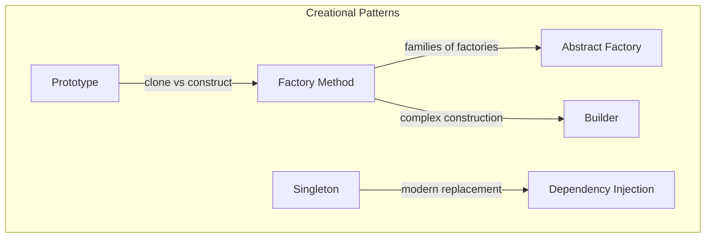
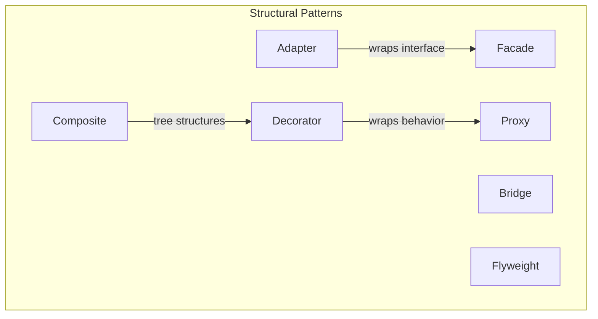
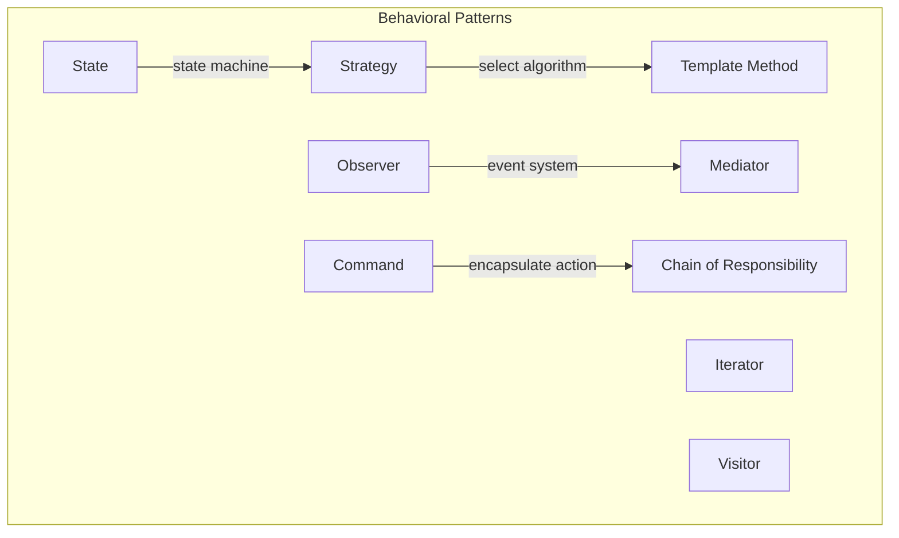
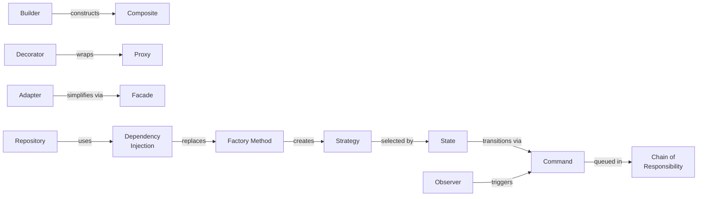

# Design Patterns

Design patterns are named solutions to recurring problems in software design. They are not copy-paste code snippets. They are not frameworks. They are not libraries. They are a shared vocabulary for describing structural relationships between objects and the forces that make those relationships necessary.

If you have been writing software for more than a year, you have already used design patterns — you just may not have known their names. Every time you wrapped a third-party API behind a clean interface, you used the Adapter pattern. Every time you built a notification system where multiple components reacted to a single event, you used the Observer pattern. Every time you used middleware in Express or Koa, you walked the Chain of Responsibility.

Naming these patterns matters because names are the foundation of communication. When you say "we should put a Facade over the payment subsystem," every engineer on the team immediately understands the structural intent without you drawing a diagram. When a code reviewer says "this is really a Strategy pattern, extract the interface," both of you know what the resulting code should look like.

## The Gang of Four Legacy

In 1994, Erich Gamma, Richard Helm, Ralph Johnson, and John Vlissides published *Design Patterns: Elements of Reusable Object-Oriented Software*. The book catalogued 23 patterns organized into three categories: creational, structural, and behavioral. It became one of the most influential software engineering books ever written, and the authors became known as the "Gang of Four" (GoF).

The book was a product of its time. The examples were in C++ and Smalltalk. The patterns assumed class-based inheritance hierarchies. Some patterns (like Iterator) have been absorbed into language features. Others (like Singleton) have become notorious anti-patterns when misapplied.

But the core insight of the book remains as relevant today as it was in 1994: **software design problems recur, and naming recurring solutions accelerates communication and reduces mistakes.** The specific implementations change — we use interfaces and composition instead of abstract classes, closures instead of command objects, dependency injection instead of manual wiring — but the underlying structural problems remain the same.

### What Has Changed Since 1994

| Aspect | 1994 (GoF Era) | Modern Era |
|---|---|---|
| Language paradigm | Class-based OOP (C++, Smalltalk) | Multi-paradigm (TypeScript, Go, Rust, Kotlin) |
| Composition model | Inheritance hierarchies | Interfaces, composition, traits |
| Concurrency | Threads and locks | Async/await, channels, actors |
| Deployment | Single-process monoliths | Distributed services, serverless |
| State management | In-process objects | Distributed state, event sourcing |
| Dependency management | Manual wiring | IoC containers, DI frameworks |
| Functional features | Rare | First-class functions, closures, higher-order functions |

### What Has NOT Changed

- The need to separate concerns that change for different reasons
- The need to program to interfaces rather than implementations
- The need to favor composition over inheritance
- The need to encapsulate what varies
- The need to manage dependencies between components

## The Three Categories

The Gang of Four organized their 23 patterns into three categories based on their purpose. This categorization is still the most useful mental model for navigating patterns.

### Creational Patterns

Creational patterns deal with **object creation mechanisms** — how objects are instantiated, configured, and assembled. The core problem they solve is decoupling the code that uses objects from the code that creates them. This decoupling is essential because the creation logic often needs to change independently from the usage logic.

| Pattern | Problem It Solves | Modern Relevance |
|---|---|---|
| **Factory Method** | Defer instantiation to subclasses | High — used everywhere in plugin systems |
| **Abstract Factory** | Create families of related objects | Medium — useful for cross-platform code |
| **Builder** | Construct complex objects step by step | Very High — config objects, query builders, test fixtures |
| **Singleton** | Ensure one instance exists globally | Low — usually an anti-pattern; use DI instead |
| **Prototype** | Clone existing objects instead of constructing from scratch | Medium — useful for immutable data with `structuredClone` |
| **Dependency Injection** | Externalize dependency creation | Very High — the modern creational pattern |

::: tip
If you are building modern TypeScript or Go applications, the patterns you will use most frequently from this category are **Builder** and **Dependency Injection**. Factory Method appears often in library and framework design. Singleton should be avoided in favor of DI-managed singletons.
:::

Deep dive: [Creational Patterns](/architecture-patterns/design-patterns/creational-patterns)

### Structural Patterns

Structural patterns deal with **how objects and classes are composed** to form larger structures. They answer the question: "I have these existing pieces — how do I assemble them into something that solves my problem without modifying them?"

| Pattern | Problem It Solves | Modern Relevance |
|---|---|---|
| **Adapter** | Make incompatible interfaces work together | Very High — API integrations, legacy wrappers |
| **Bridge** | Separate abstraction from implementation | Medium — driver/provider architectures |
| **Composite** | Treat individual objects and groups uniformly | High — UI trees, file systems, org charts |
| **Decorator** | Add behavior without modifying existing code | Very High — middleware, logging, caching |
| **Facade** | Simplify complex subsystems | Very High — SDK design, service aggregation |
| **Flyweight** | Share state to reduce memory usage | Medium — string interning, connection pools |
| **Proxy** | Control access to another object | Very High — caching, lazy loading, access control |

Deep dive: [Structural Patterns](/architecture-patterns/design-patterns/structural-patterns)

### Behavioral Patterns

Behavioral patterns deal with **communication between objects** — how objects interact, delegate responsibilities, and coordinate workflows. They are the most numerous category because communication is the hardest part of software design.

| Pattern | Problem It Solves | Modern Relevance |
|---|---|---|
| **Strategy** | Swap algorithms at runtime | Very High — payment processors, serializers |
| **Observer** | Notify dependents of state changes | Very High — event systems, reactive programming |
| **Command** | Encapsulate actions as objects | High — undo/redo, task queues, CQRS |
| **Chain of Responsibility** | Pass requests along a handler chain | Very High — middleware, validation pipelines |
| **State** | Change behavior based on internal state | High — workflows, order processing |
| **Template Method** | Define algorithm skeleton, defer steps | Medium — framework hooks, lifecycle methods |
| **Mediator** | Centralize complex communication | Medium — chat rooms, air traffic control |
| **Iterator** | Traverse collections without exposing internals | Absorbed — built into every modern language |
| **Visitor** | Add operations to objects without modifying them | Low — AST processing, rarely used elsewhere |

Deep dive: [Behavioral Patterns](/architecture-patterns/design-patterns/behavioral-patterns)

## Patterns Beyond the Gang of Four

The original 23 patterns are not the end of the story. Several patterns that did not exist in 1994 have become essential in modern software:

| Pattern | Category | Where It Lives |
|---|---|---|
| **Dependency Injection** | Creational | [DI Deep Dive](/architecture-patterns/design-patterns/dependency-injection) |
| **Repository** | Structural/Data | [Repository Pattern](/architecture-patterns/design-patterns/repository-pattern) |
| **Circuit Breaker** | Behavioral/Resilience | [Cloud Design Patterns](/architecture-patterns/cloud-native/cloud-design-patterns) |
| **Saga** | Behavioral/Distributed | [CQRS & Event Sourcing](/architecture-patterns/cqrs-event-sourcing/) |
| **Strangler Fig** | Structural/Migration | [Cloud Design Patterns](/architecture-patterns/cloud-native/cloud-design-patterns) |
| **Sidecar** | Structural/Infrastructure | [Cloud Design Patterns](/architecture-patterns/cloud-native/cloud-design-patterns) |

## How to Learn Patterns Effectively

::: warning Common Mistake
The biggest mistake engineers make with design patterns is pattern hunting — forcing patterns into code where they are not needed. If your code is simple and readable without a pattern, do not add one. Patterns are tools for managing complexity, not decorations for simple code.
:::

The right way to learn patterns:

1. **Start with the problem, not the pattern.** Read the "Problem It Solves" column first. If you do not have that problem, you do not need the pattern.
2. **Recognize patterns you already use.** Most experienced engineers use 5-8 patterns regularly without knowing their names. Naming them makes it easier to discuss design decisions.
3. **Learn the top 8 deeply, the rest shallowly.** Strategy, Observer, Factory Method, Builder, Adapter, Decorator, Proxy, and Chain of Responsibility cover 90% of real-world usage.
4. **Study real codebases.** The Express.js middleware pipeline is Chain of Responsibility. React's component model is Composite. Redux is a combination of Observer, Command, and State.

## Pattern Relationships

Patterns do not exist in isolation. They compose, compete, and complement each other:

- **Factory Method vs. Abstract Factory**: Factory Method creates one product; Abstract Factory creates families of products.
- **Strategy vs. State**: Both change behavior, but Strategy is selected externally while State transitions internally.
- **Decorator vs. Proxy**: Both wrap objects, but Decorator adds behavior while Proxy controls access.
- **Adapter vs. Facade**: Adapter makes one interface compatible with another; Facade simplifies a complex subsystem.
- **Command vs. Strategy**: Both encapsulate behavior, but Command has an execute/undo lifecycle while Strategy is stateless selection.

## What's Next

This section covers the patterns that matter most in modern software engineering, with implementations in TypeScript, Go, Java, and Python:

- [Creational Patterns](/architecture-patterns/design-patterns/creational-patterns) — Factory, Builder, Prototype, and why Singleton is usually wrong
- [Structural Patterns](/architecture-patterns/design-patterns/structural-patterns) — Adapter, Decorator, Proxy, Facade, and real-world middleware
- [Behavioral Patterns](/architecture-patterns/design-patterns/behavioral-patterns) — Strategy, Observer, Command, Chain of Responsibility, and State
- [Dependency Injection Deep Dive](/architecture-patterns/design-patterns/dependency-injection) — The modern creational pattern that replaces half the GoF
- [Repository Pattern](/architecture-patterns/design-patterns/repository-pattern) — Clean data access with Unit of Work and CQRS integration

For patterns that emerge specifically in distributed and cloud environments, see [Cloud Design Patterns](/architecture-patterns/cloud-native/cloud-design-patterns) and [Cloud-Native Architecture](/architecture-patterns/cloud-native/).