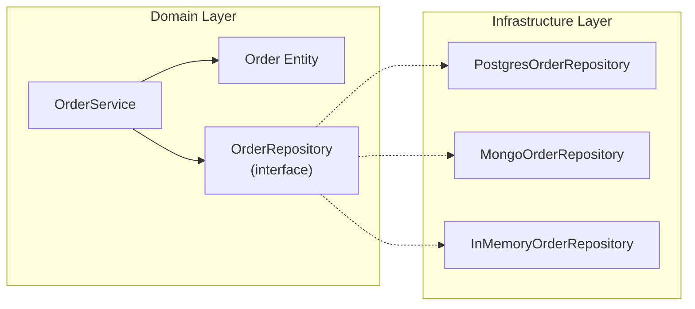
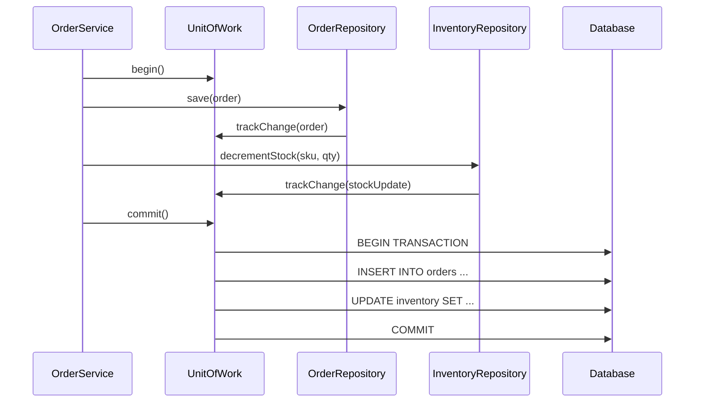
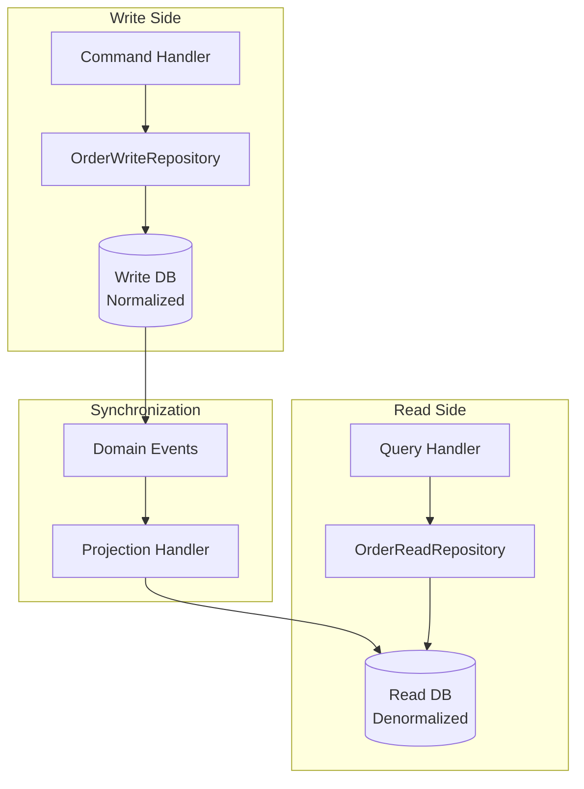

# Repository Pattern

The Repository pattern is one of the most important patterns in application architecture. It provides an abstraction over data access that makes your business logic independent of the storage mechanism. When done correctly, the rest of your application cannot tell whether data comes from PostgreSQL, MongoDB, an in-memory store, or a REST API — and it should not care.

The pattern was popularized by Martin Fowler in *Patterns of Enterprise Application Architecture* (2002) and later became a cornerstone of [Domain-Driven Design](/architecture-patterns/domain-driven-design/). Eric Evans defined a Repository as "an object that mediates between the domain and data mapping layers, acting like an in-memory domain object collection."

## Why Repositories Exist

Without a repository, data access logic leaks into business logic:

```typescript
// WITHOUT Repository — SQL mixed with business rules
class OrderService {
  async cancelOrder(orderId: string): Promise<void> {
    const result = await this.pool.query(
      'SELECT * FROM orders WHERE id = $1', [orderId]
    );
    const order = result.rows[0];
    if (!order) throw new OrderNotFoundError(orderId);

    if (order.status === 'shipped') {
      throw new CannotCancelShippedOrderError(orderId);
    }

    await this.pool.query(
      'UPDATE orders SET status = $1, cancelled_at = $2 WHERE id = $3',
      ['cancelled', new Date(), orderId]
    );

    // Now refund...
    await this.pool.query(
      'INSERT INTO refunds (order_id, amount, status) VALUES ($1, $2, $3)',
      [orderId, order.total, 'pending']
    );
  }
}
```

Problems with this approach:

1. **SQL is scattered** across every service that touches orders
2. **Schema changes** require modifying every service
3. **Testing requires a database** — you cannot test business rules without Postgres
4. **No query reuse** — the same WHERE clause is duplicated across services
5. **Domain model is absent** — you work with raw rows, not domain objects

## The Repository Solution



```typescript
// Domain layer — defines what data access looks like
interface OrderRepository {
  findById(id: string): Promise<Order | null>;
  findByCustomer(customerId: string, options?: PaginationOptions): Promise<Order[]>;
  findPendingOrders(): Promise<Order[]>;
  save(order: Order): Promise<void>;
  delete(id: string): Promise<void>;
}

// Domain service — pure business logic, no SQL
class OrderService {
  constructor(
    private orderRepo: OrderRepository,
    private paymentGateway: PaymentGateway,
    private eventBus: EventBus,
  ) {}

  async cancelOrder(orderId: string): Promise<void> {
    const order = await this.orderRepo.findById(orderId);
    if (!order) throw new OrderNotFoundError(orderId);

    order.cancel(); // domain logic lives on the entity

    await this.orderRepo.save(order);
    await this.paymentGateway.refund(order.paymentId, order.total);
    this.eventBus.publish({ type: 'OrderCancelled', orderId: order.id });
  }
}
```

## Generic Repository vs Specific Repository

### Generic Repository

A generic repository provides CRUD operations for any entity type:

```typescript
interface Repository<T, ID> {
  findById(id: ID): Promise<T | null>;
  findAll(options?: PaginationOptions): Promise<T[]>;
  save(entity: T): Promise<void>;
  delete(id: ID): Promise<void>;
  count(): Promise<number>;
}

class PostgresRepository<T, ID> implements Repository<T, ID> {
  constructor(
    private pool: Pool,
    private tableName: string,
    private mapper: RowMapper<T>,
  ) {}

  async findById(id: ID): Promise<T | null> {
    const result = await this.pool.query(
      `SELECT * FROM ${this.tableName} WHERE id = $1`,
      [id],
    );
    return result.rows[0] ? this.mapper.toDomain(result.rows[0]) : null;
  }

  async save(entity: T): Promise<void> {
    const row = this.mapper.toRow(entity);
    const columns = Object.keys(row);
    const values = Object.values(row);
    const placeholders = columns.map((_, i) => `$${i + 1}`);

    await this.pool.query(
      `INSERT INTO ${this.tableName} (${columns.join(', ')})
       VALUES (${placeholders.join(', ')})
       ON CONFLICT (id) DO UPDATE SET
       ${columns.map((col, i) => `${col} = $${i + 1}`).join(', ')}`,
      values,
    );
  }

  async delete(id: ID): Promise<void> {
    await this.pool.query(
      `DELETE FROM ${this.tableName} WHERE id = $1`,
      [id],
    );
  }

  async findAll(options?: PaginationOptions): Promise<T[]> {
    const limit = options?.limit ?? 100;
    const offset = options?.offset ?? 0;
    const result = await this.pool.query(
      `SELECT * FROM ${this.tableName} ORDER BY id LIMIT $1 OFFSET $2`,
      [limit, offset],
    );
    return result.rows.map(row => this.mapper.toDomain(row));
  }

  async count(): Promise<number> {
    const result = await this.pool.query(
      `SELECT COUNT(*) as count FROM ${this.tableName}`,
    );
    return parseInt(result.rows[0].count, 10);
  }
}
```

::: warning Generic Repository Trap
Generic repositories are seductive but dangerous. The problem is that they expose a uniform interface that does not match domain semantics. Not every entity supports `delete`. Not every entity should be fetched with `findAll`. An `AuditLog` should be append-only. A `User` needs `findByEmail`. A generic repository either exposes unsafe operations or becomes a leaky abstraction that you subclass for every entity anyway.
:::

### Specific Repository (Recommended)

Specific repositories define the exact operations each aggregate needs:

```typescript
// Each repository has a domain-specific interface
interface OrderRepository {
  findById(id: OrderId): Promise<Order | null>;
  findByCustomer(customerId: CustomerId, pagination: Pagination): Promise<PaginatedResult<Order>>;
  findPendingShipment(): Promise<Order[]>;
  findExpiredReservations(cutoff: Date): Promise<Order[]>;
  save(order: Order): Promise<void>;
  // No delete — orders are never deleted, only cancelled
}

interface ProductRepository {
  findById(id: ProductId): Promise<Product | null>;
  findBySku(sku: string): Promise<Product | null>;
  findByCategory(categoryId: CategoryId, pagination: Pagination): Promise<PaginatedResult<Product>>;
  search(query: string, filters: ProductFilters): Promise<PaginatedResult<Product>>;
  save(product: Product): Promise<void>;
  archive(id: ProductId): Promise<void>; // soft delete
  // No hard delete — products with order history must be preserved
}

interface AuditLogRepository {
  append(entry: AuditEntry): Promise<void>;
  findByEntity(entityType: string, entityId: string): Promise<AuditEntry[]>;
  findByUser(userId: string, timeRange: TimeRange): Promise<AuditEntry[]>;
  // Append-only — no update, no delete
}
```

### Generic vs Specific Decision

| Aspect | Generic Repository | Specific Repository |
|---|---|---|
| Code reuse | High — one class for all entities | Low — each entity has its own repo |
| Domain alignment | Poor — uniform CRUD for everything | Excellent — operations match domain |
| Safety | Risky — exposes delete on immutable entities | Safe — only allowed operations exposed |
| Query optimization | Difficult — generic queries are hard to optimize | Easy — each query is purpose-built |
| Testing | Easy to mock generically | More mocks to write, but more meaningful |
| Best for | Simple CRUD apps, prototypes | Complex domains, DDD, production systems |

## Unit of Work

The Unit of Work pattern tracks changes to multiple entities during a business transaction and commits them atomically. It answers the question: "How do I save changes to multiple repositories in a single database transaction?"



### TypeScript Implementation

```typescript
interface UnitOfWork {
  begin(): Promise<void>;
  commit(): Promise<void>;
  rollback(): Promise<void>;
  getOrderRepository(): OrderRepository;
  getInventoryRepository(): InventoryRepository;
}

class PostgresUnitOfWork implements UnitOfWork {
  private client: PoolClient | null = null;

  constructor(private pool: Pool) {}

  async begin(): Promise<void> {
    this.client = await this.pool.connect();
    await this.client.query('BEGIN');
  }

  async commit(): Promise<void> {
    if (!this.client) throw new Error('Transaction not started');
    await this.client.query('COMMIT');
    this.client.release();
    this.client = null;
  }

  async rollback(): Promise<void> {
    if (!this.client) throw new Error('Transaction not started');
    await this.client.query('ROLLBACK');
    this.client.release();
    this.client = null;
  }

  getOrderRepository(): OrderRepository {
    if (!this.client) throw new Error('Transaction not started');
    return new PostgresOrderRepository(this.client);
  }

  getInventoryRepository(): InventoryRepository {
    if (!this.client) throw new Error('Transaction not started');
    return new PostgresInventoryRepository(this.client);
  }
}

// Usage — multiple repos, one transaction
class PlaceOrderHandler {
  constructor(private uowFactory: () => UnitOfWork) {}

  async handle(command: PlaceOrderCommand): Promise<string> {
    const uow = this.uowFactory();
    await uow.begin();

    try {
      const orderRepo = uow.getOrderRepository();
      const inventoryRepo = uow.getInventoryRepository();

      // Reserve stock
      for (const item of command.items) {
        await inventoryRepo.decrementStock(item.sku, item.quantity);
      }

      // Create order
      const order = Order.create(command.userId, command.items);
      await orderRepo.save(order);

      await uow.commit();
      return order.id;
    } catch (error) {
      await uow.rollback();
      throw error;
    }
  }
}
```

### Go Implementation

```go
type UnitOfWork interface {
    OrderRepo() OrderRepository
    InventoryRepo() InventoryRepository
    Commit(ctx context.Context) error
    Rollback(ctx context.Context) error
}

type pgUnitOfWork struct {
    tx        pgx.Tx
    orderRepo *PostgresOrderRepository
    invRepo   *PostgresInventoryRepository
}

func NewUnitOfWork(ctx context.Context, pool *pgxpool.Pool) (UnitOfWork, error) {
    tx, err := pool.Begin(ctx)
    if err != nil {
        return nil, fmt.Errorf("begin transaction: %w", err)
    }
    return &pgUnitOfWork{
        tx:        tx,
        orderRepo: NewPostgresOrderRepository(tx),
        invRepo:   NewPostgresInventoryRepository(tx),
    }, nil
}

func (u *pgUnitOfWork) OrderRepo() OrderRepository      { return u.orderRepo }
func (u *pgUnitOfWork) InventoryRepo() InventoryRepository { return u.invRepo }
func (u *pgUnitOfWork) Commit(ctx context.Context) error   { return u.tx.Commit(ctx) }
func (u *pgUnitOfWork) Rollback(ctx context.Context) error { return u.tx.Rollback(ctx) }
```

## Repository with CQRS

In a [CQRS architecture](/architecture-patterns/cqrs-event-sourcing/), the repository concept splits into two sides: a write repository for commands and a read repository (often called a "read model" or "query store") for queries.



```typescript
// Write repository — works with domain aggregates
interface OrderWriteRepository {
  findById(id: OrderId): Promise<Order | null>;
  save(order: Order): Promise<void>;
  // No query methods — writes only
}

// Read repository — works with read models (DTOs)
interface OrderReadRepository {
  getOrderSummary(orderId: string): Promise<OrderSummaryDTO | null>;
  getOrdersByCustomer(customerId: string, page: Pagination): Promise<PaginatedResult<OrderListItemDTO>>;
  getRevenueByDateRange(start: Date, end: Date): Promise<RevenueReportDTO>;
  searchOrders(query: OrderSearchQuery): Promise<PaginatedResult<OrderListItemDTO>>;
  // No save methods — reads only
}

// Read models are flat DTOs optimized for the UI
interface OrderSummaryDTO {
  orderId: string;
  customerName: string;
  customerEmail: string;
  items: Array<{
    productName: string;
    sku: string;
    quantity: number;
    unitPrice: number;
    lineTotal: number;
  }>;
  subtotal: number;
  tax: number;
  shipping: number;
  total: number;
  status: string;
  placedAt: string;
  shippedAt: string | null;
  trackingNumber: string | null;
}

// Read repository implementation — optimized queries, no ORM overhead
class PostgresOrderReadRepository implements OrderReadRepository {
  constructor(private pool: Pool) {}

  async getOrderSummary(orderId: string): Promise<OrderSummaryDTO | null> {
    const result = await this.pool.query(
      `SELECT
        o.id as "orderId",
        c.name as "customerName",
        c.email as "customerEmail",
        o.subtotal, o.tax, o.shipping, o.total,
        o.status, o.placed_at as "placedAt",
        o.shipped_at as "shippedAt",
        o.tracking_number as "trackingNumber",
        json_agg(json_build_object(
          'productName', p.name,
          'sku', p.sku,
          'quantity', oi.quantity,
          'unitPrice', oi.unit_price,
          'lineTotal', oi.line_total
        )) as items
       FROM orders o
       JOIN customers c ON c.id = o.customer_id
       JOIN order_items oi ON oi.order_id = o.id
       JOIN products p ON p.id = oi.product_id
       WHERE o.id = $1
       GROUP BY o.id, c.name, c.email`,
      [orderId],
    );
    return result.rows[0] ?? null;
  }
}
```

## Java Implementation with Spring Data

```java
// Spring Data JPA — interface-only repository
public interface OrderRepository extends JpaRepository<OrderEntity, UUID> {

    // Spring generates the query from the method name
    List<OrderEntity> findByCustomerIdOrderByCreatedAtDesc(UUID customerId);

    List<OrderEntity> findByStatusAndCreatedAtBefore(
        OrderStatus status, LocalDateTime cutoff
    );

    // Custom query for complex cases
    @Query("""
        SELECT o FROM OrderEntity o
        JOIN FETCH o.items
        WHERE o.id = :id
    """)
    Optional<OrderEntity> findByIdWithItems(@Param("id") UUID id);

    // Native query for performance-critical reads
    @Query(value = """
        SELECT DATE(created_at) as date, SUM(total) as revenue, COUNT(*) as order_count
        FROM orders
        WHERE created_at BETWEEN :start AND :end
        GROUP BY DATE(created_at)
        ORDER BY date
    """, nativeQuery = true)
    List<DailyRevenueProjection> getDailyRevenue(
        @Param("start") LocalDateTime start,
        @Param("end") LocalDateTime end
    );
}

// Domain repository wraps the Spring Data repository
// to map between JPA entities and domain objects
@Repository
public class JpaOrderRepository implements OrderRepository {
    private final SpringDataOrderRepository springRepo;
    private final OrderMapper mapper;

    public JpaOrderRepository(SpringDataOrderRepository springRepo, OrderMapper mapper) {
        this.springRepo = springRepo;
        this.mapper = mapper;
    }

    @Override
    public Optional<Order> findById(OrderId id) {
        return springRepo.findByIdWithItems(id.value())
                         .map(mapper::toDomain);
    }

    @Override
    public void save(Order order) {
        OrderEntity entity = mapper.toEntity(order);
        springRepo.save(entity);
    }
}
```

## In-Memory Repository for Testing

Every repository interface should have an in-memory implementation for testing. This eliminates the need for database containers in unit tests:

```typescript
class InMemoryOrderRepository implements OrderRepository {
  private orders = new Map<string, Order>();

  async findById(id: OrderId): Promise<Order | null> {
    return this.orders.get(id.value) ?? null;
  }

  async findByCustomer(
    customerId: CustomerId,
    pagination: Pagination,
  ): Promise<PaginatedResult<Order>> {
    const all = [...this.orders.values()]
      .filter(o => o.customerId.equals(customerId))
      .sort((a, b) => b.createdAt.getTime() - a.createdAt.getTime());

    const items = all.slice(pagination.offset, pagination.offset + pagination.limit);
    return { items, total: all.length };
  }

  async findPendingShipment(): Promise<Order[]> {
    return [...this.orders.values()].filter(
      o => o.status === 'paid',
    );
  }

  async save(order: Order): Promise<void> {
    // Deep clone to prevent test state leakage
    this.orders.set(order.id.value, structuredClone(order));
  }

  // Test helper — not part of the interface
  clear(): void {
    this.orders.clear();
  }

  seed(orders: Order[]): void {
    for (const order of orders) {
      this.orders.set(order.id.value, order);
    }
  }
}
```

## Anti-Patterns

### Leaky Repository

A repository that exposes the underlying data access technology:

```typescript
// BAD — leaks Knex query builder through the interface
interface OrderRepository {
  findById(id: string): Promise<Order | null>;
  query(): Knex.QueryBuilder; // LEAKED ABSTRACTION
}

// GOOD — pure domain interface
interface OrderRepository {
  findById(id: string): Promise<Order | null>;
  findByFilters(filters: OrderFilters): Promise<PaginatedResult<Order>>;
}
```

### Repository as Dumping Ground

A repository that grows to include business logic, validation, or cross-cutting concerns:

```typescript
// BAD — repository does too much
class OrderRepository {
  async save(order: Order): Promise<void> {
    this.validateOrder(order);     // validation belongs in the domain
    await this.persist(order);
    await this.sendEmail(order);   // side effects do not belong here
    await this.invalidateCache(order.id); // caching is a separate concern
    this.logger.info('Order saved'); // logging is a separate concern
  }
}
```

### N+1 Query Repository

A repository that fetches related data lazily, causing N+1 queries:

```typescript
// BAD — causes N+1 when iterating orders
async findAll(): Promise<Order[]> {
  const rows = await this.pool.query('SELECT * FROM orders');
  return Promise.all(
    rows.map(async row => {
      const items = await this.pool.query(
        'SELECT * FROM order_items WHERE order_id = $1', [row.id]
      ); // N additional queries!
      return this.mapper.toDomain(row, items);
    })
  );
}

// GOOD — eager load with JOIN
async findAll(): Promise<Order[]> {
  const rows = await this.pool.query(`
    SELECT o.*, json_agg(oi.*) as items
    FROM orders o
    LEFT JOIN order_items oi ON oi.order_id = o.id
    GROUP BY o.id
  `);
  return rows.map(row => this.mapper.toDomain(row));
}
```

## Further Reading

- [Domain-Driven Design](/architecture-patterns/domain-driven-design/) — Repository as a DDD tactical pattern
- [CQRS & Event Sourcing](/architecture-patterns/cqrs-event-sourcing/) — Separate read and write repositories
- [Dependency Injection](/architecture-patterns/design-patterns/dependency-injection) — How repositories are wired into services
- [Clean Architecture](/architecture-patterns/clean-architecture/) — Repository interfaces live in the domain layer
- [Hexagonal Architecture](/architecture-patterns/hexagonal/) — Repositories are output adapters behind ports