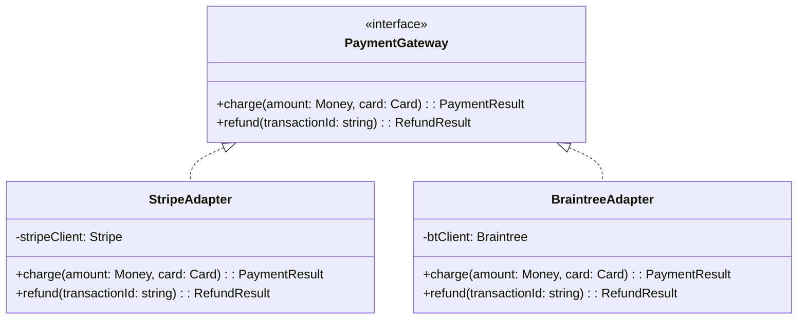
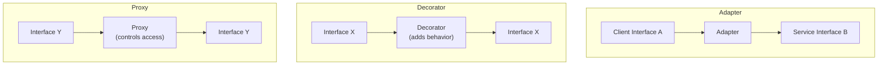
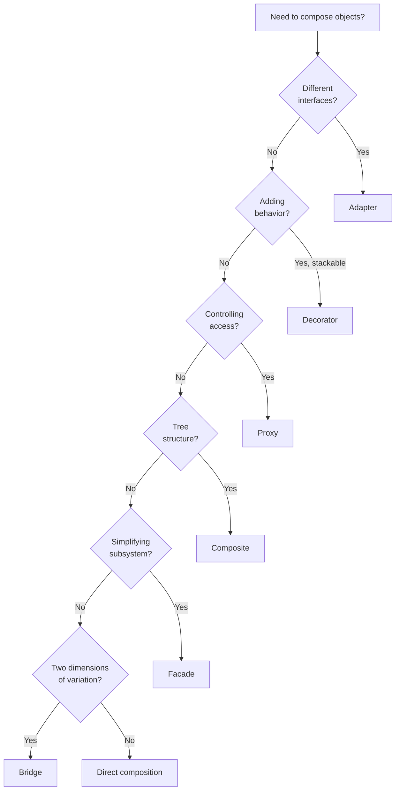

# Structural Patterns

Structural patterns answer a deceptively simple question: **how do you compose objects and classes into larger structures while keeping those structures flexible and efficient?** They deal with the static relationships between components — the inheritance hierarchies, the interface contracts, the wrapper chains — that determine how a system is assembled.

The reason these patterns matter in practice is that software is built from pre-existing pieces that were not designed to work together. You integrate third-party APIs with incompatible interfaces. You layer cross-cutting concerns (logging, caching, authentication) onto existing services. You simplify complex subsystems behind clean facades. Structural patterns give you composable strategies for assembling components without modifying them.

## Adapter

### The Problem

You have existing code that works with one interface, and a new component that exposes a different interface. You cannot modify either side — perhaps the existing code is your tested business logic and the new component is a third-party library. You need a translator between them.

### The Pattern

Adapter wraps an object with an incompatible interface and exposes the interface your code expects. It is the most commonly used structural pattern in real-world systems, especially when integrating external services.



### TypeScript Implementation

```typescript
// Your domain interface
interface PaymentGateway {
  charge(amount: Money, card: CardDetails): Promise<PaymentResult>;
  refund(transactionId: string, amount?: Money): Promise<RefundResult>;
}

// Third-party Stripe SDK has its own types and method signatures
// You cannot change it — it's an npm package

class StripeAdapter implements PaymentGateway {
  constructor(private stripe: Stripe) {}

  async charge(amount: Money, card: CardDetails): Promise<PaymentResult> {
    try {
      const paymentIntent = await this.stripe.paymentIntents.create({
        amount: amount.cents, // Stripe uses cents, your domain uses Money
        currency: amount.currency.toLowerCase(),
        payment_method_data: {
          type: 'card',
          card: {
            number: card.number,
            exp_month: card.expiryMonth,
            exp_year: card.expiryYear,
            cvc: card.cvv,
          },
        },
        confirm: true,
      });

      return {
        success: paymentIntent.status === 'succeeded',
        transactionId: paymentIntent.id,
        gatewayResponse: paymentIntent.status,
      };
    } catch (error) {
      return {
        success: false,
        transactionId: '',
        gatewayResponse: error instanceof Error ? error.message : 'Unknown error',
      };
    }
  }

  async refund(transactionId: string, amount?: Money): Promise<RefundResult> {
    const refund = await this.stripe.refunds.create({
      payment_intent: transactionId,
      amount: amount?.cents, // partial refund if amount provided
    });

    return {
      success: refund.status === 'succeeded',
      refundId: refund.id,
    };
  }
}

// Business logic never knows about Stripe
class OrderService {
  constructor(private paymentGateway: PaymentGateway) {}

  async processOrder(order: Order): Promise<void> {
    const result = await this.paymentGateway.charge(
      order.total,
      order.paymentMethod,
    );
    if (!result.success) {
      throw new PaymentFailedError(result.gatewayResponse);
    }
    order.markPaid(result.transactionId);
  }
}
```

### Go Implementation

```go
// Your domain interface
type PaymentGateway interface {
    Charge(ctx context.Context, amount Money, card CardDetails) (*PaymentResult, error)
    Refund(ctx context.Context, txID string, amount *Money) (*RefundResult, error)
}

// Adapter wraps the Stripe SDK
type StripeAdapter struct {
    client *stripe.Client
}

func NewStripeAdapter(apiKey string) *StripeAdapter {
    return &StripeAdapter{client: stripe.NewClient(apiKey)}
}

func (s *StripeAdapter) Charge(ctx context.Context, amount Money, card CardDetails) (*PaymentResult, error) {
    params := &stripe.PaymentIntentParams{
        Amount:   stripe.Int64(amount.Cents),
        Currency: stripe.String(strings.ToLower(amount.Currency)),
    }
    pi, err := s.client.PaymentIntents.New(params)
    if err != nil {
        return &PaymentResult{Success: false}, fmt.Errorf("stripe charge failed: %w", err)
    }
    return &PaymentResult{
        Success:       pi.Status == stripe.PaymentIntentStatusSucceeded,
        TransactionID: pi.ID,
    }, nil
}
```

::: tip Adapter Is Your Integration Strategy
Every third-party service integration should go through an adapter. This is not over-engineering — it is insurance. When Stripe changes their API, or when you need to switch to a different payment provider, you change one adapter class. Your entire business logic layer remains untouched.
:::

## Bridge

### The Problem

You have an abstraction that can vary along two independent dimensions. For example, a notification system that varies by channel (email, SMS, push) and by urgency (immediate, batched, digest). Without Bridge, you end up with a combinatorial explosion: `ImmediateEmailNotification`, `BatchedEmailNotification`, `ImmediateSMSNotification`, etc.

### The Pattern

Bridge separates an abstraction from its implementation so that both can vary independently. The abstraction holds a reference to an implementation and delegates to it.

```typescript
// Implementation dimension: delivery channel
interface DeliveryChannel {
  deliver(recipient: string, content: string): Promise<void>;
}

class EmailChannel implements DeliveryChannel {
  async deliver(recipient: string, content: string): Promise<void> {
    await sendEmail({ to: recipient, body: content });
  }
}

class SMSChannel implements DeliveryChannel {
  async deliver(recipient: string, content: string): Promise<void> {
    await sendSMS({ to: recipient, body: content.slice(0, 160) });
  }
}

// Abstraction dimension: delivery strategy
abstract class NotificationSender {
  constructor(protected channel: DeliveryChannel) {}
  abstract send(recipients: string[], message: string): Promise<void>;
}

class ImmediateSender extends NotificationSender {
  async send(recipients: string[], message: string): Promise<void> {
    await Promise.all(
      recipients.map(r => this.channel.deliver(r, message))
    );
  }
}

class BatchedSender extends NotificationSender {
  private queue: Array<{ recipient: string; message: string }> = [];

  async send(recipients: string[], message: string): Promise<void> {
    for (const r of recipients) {
      this.queue.push({ recipient: r, message });
    }
  }

  async flush(): Promise<void> {
    const batch = this.queue.splice(0);
    for (const item of batch) {
      await this.channel.deliver(item.recipient, item.message);
    }
  }
}

// Compose freely: any strategy + any channel
const urgentEmail = new ImmediateSender(new EmailChannel());
const batchedSMS = new BatchedSender(new SMSChannel());
```

## Composite

### The Problem

You need to treat individual objects and groups of objects uniformly. A file system has files and directories — but directories contain files and other directories. A UI has buttons and panels — but panels contain buttons and other panels. You want client code to work with both leaves and containers through the same interface.

### TypeScript Implementation

```typescript
interface PricingComponent {
  getPrice(): Money;
  getDescription(): string;
}

// Leaf
class Product implements PricingComponent {
  constructor(
    private name: string,
    private price: Money,
  ) {}

  getPrice(): Money { return this.price; }
  getDescription(): string { return this.name; }
}

// Leaf with behavior
class DiscountedProduct implements PricingComponent {
  constructor(
    private product: PricingComponent,
    private discountPercent: number,
  ) {}

  getPrice(): Money {
    return this.product.getPrice().multiply(1 - this.discountPercent / 100);
  }

  getDescription(): string {
    return `${this.product.getDescription()} (${this.discountPercent}% off)`;
  }
}

// Composite
class Bundle implements PricingComponent {
  private items: PricingComponent[] = [];

  constructor(private name: string) {}

  add(item: PricingComponent): this {
    this.items.push(item);
    return this;
  }

  getPrice(): Money {
    return this.items.reduce(
      (sum, item) => sum.add(item.getPrice()),
      Money.zero('USD'),
    );
  }

  getDescription(): string {
    const itemList = this.items.map(i => i.getDescription()).join(', ');
    return `${this.name} [${itemList}]`;
  }
}

// Client code works with both uniformly
const laptop = new Product('Laptop', Money.of(999, 'USD'));
const mouse = new Product('Mouse', Money.of(29, 'USD'));
const keyboard = new Product('Keyboard', Money.of(79, 'USD'));

const peripheralBundle = new Bundle('Peripheral Pack')
  .add(new DiscountedProduct(mouse, 10))
  .add(new DiscountedProduct(keyboard, 10));

const workstationBundle = new Bundle('Workstation')
  .add(laptop)
  .add(peripheralBundle); // bundles nest inside bundles

console.log(workstationBundle.getPrice()); // calculates recursively
```

## Decorator

### The Problem

You need to add behavior to objects dynamically without modifying their class. You want these additions to be stackable — adding logging, caching, and retry logic to a service, where each concern is independent and composable.

### The Pattern

Decorator wraps an object with the same interface and adds behavior before, after, or around the wrapped object's methods. This is the pattern behind middleware in Express, Koa, and every HTTP framework.


### TypeScript Implementation

```typescript
interface HttpClient {
  request<T>(config: RequestConfig): Promise<T>;
}

// Base implementation
class FetchHttpClient implements HttpClient {
  async request<T>(config: RequestConfig): Promise<T> {
    const response = await fetch(config.url, {
      method: config.method,
      headers: config.headers,
      body: config.body ? JSON.stringify(config.body) : undefined,
    });
    if (!response.ok) throw new HttpError(response.status, await response.text());
    return response.json() as Promise<T>;
  }
}

// Decorator: Logging
class LoggingHttpClient implements HttpClient {
  constructor(
    private inner: HttpClient,
    private logger: Logger,
  ) {}

  async request<T>(config: RequestConfig): Promise<T> {
    const start = performance.now();
    this.logger.info(`HTTP ${config.method} ${config.url}`);
    try {
      const result = await this.inner.request<T>(config);
      const duration = performance.now() - start;
      this.logger.info(`HTTP ${config.method} ${config.url} completed in ${duration}ms`);
      return result;
    } catch (error) {
      const duration = performance.now() - start;
      this.logger.error(`HTTP ${config.method} ${config.url} failed after ${duration}ms`, error);
      throw error;
    }
  }
}

// Decorator: Retry with exponential backoff
class RetryHttpClient implements HttpClient {
  constructor(
    private inner: HttpClient,
    private maxRetries: number = 3,
    private baseDelayMs: number = 1000,
  ) {}

  async request<T>(config: RequestConfig): Promise<T> {
    let lastError: Error | undefined;
    for (let attempt = 0; attempt <= this.maxRetries; attempt++) {
      try {
        return await this.inner.request<T>(config);
      } catch (error) {
        lastError = error as Error;
        if (attempt < this.maxRetries && this.isRetryable(error)) {
          const delay = this.baseDelayMs * Math.pow(2, attempt);
          await new Promise(resolve => setTimeout(resolve, delay));
        }
      }
    }
    throw lastError;
  }

  private isRetryable(error: unknown): boolean {
    return error instanceof HttpError && error.status >= 500;
  }
}

// Decorator: Caching
class CachingHttpClient implements HttpClient {
  private cache = new Map<string, { data: unknown; expiry: number }>();

  constructor(
    private inner: HttpClient,
    private ttlMs: number = 60_000,
  ) {}

  async request<T>(config: RequestConfig): Promise<T> {
    if (config.method !== 'GET') {
      return this.inner.request<T>(config);
    }

    const key = `${config.method}:${config.url}`;
    const cached = this.cache.get(key);
    if (cached && cached.expiry > Date.now()) {
      return cached.data as T;
    }

    const result = await this.inner.request<T>(config);
    this.cache.set(key, { data: result, expiry: Date.now() + this.ttlMs });
    return result;
  }
}

// Stack decorators — order matters
const httpClient: HttpClient = new RetryHttpClient(
  new CachingHttpClient(
    new LoggingHttpClient(
      new FetchHttpClient(),
      logger,
    ),
    60_000,
  ),
  3,
);
```

::: warning Decorator Order Matters
When stacking decorators, the outermost decorator runs first. In the example above, `RetryHttpClient` wraps `CachingHttpClient`, which means retries happen around cache lookups. If you swapped the order, cache lookups would happen inside each retry — a very different behavior. Always think carefully about the ordering semantics.
:::

## Facade

### The Problem

You have a complex subsystem with many classes and interactions. Client code does not need to know about all those internals — it needs a simple, high-level interface that covers the 80% use case. The subsystem can still be used directly by power users who need fine-grained control.

### TypeScript Implementation

```typescript
// Complex subsystem — multiple services with intricate interactions
class InventoryService {
  async checkAvailability(sku: string, quantity: number): Promise<boolean> { /* ... */ }
  async reserveStock(sku: string, quantity: number): Promise<string> { /* ... */ }
  async releaseReservation(reservationId: string): Promise<void> { /* ... */ }
}

class PaymentService {
  async authorize(amount: Money, card: CardDetails): Promise<AuthResult> { /* ... */ }
  async capture(authId: string): Promise<CaptureResult> { /* ... */ }
  async void(authId: string): Promise<void> { /* ... */ }
}

class ShippingService {
  async calculateRates(items: CartItem[], address: Address): Promise<ShippingRate[]> { /* ... */ }
  async createShipment(order: Order, rate: ShippingRate): Promise<Shipment> { /* ... */ }
}

class NotificationService {
  async sendOrderConfirmation(order: Order): Promise<void> { /* ... */ }
  async sendShippingNotification(shipment: Shipment): Promise<void> { /* ... */ }
}

// Facade — simple interface over complex subsystem
class CheckoutFacade {
  constructor(
    private inventory: InventoryService,
    private payment: PaymentService,
    private shipping: ShippingService,
    private notifications: NotificationService,
  ) {}

  async checkout(cart: Cart, paymentDetails: CardDetails): Promise<Order> {
    // Step 1: Check inventory
    for (const item of cart.items) {
      const available = await this.inventory.checkAvailability(item.sku, item.quantity);
      if (!available) {
        throw new OutOfStockError(item.sku);
      }
    }

    // Step 2: Reserve stock
    const reservations: string[] = [];
    try {
      for (const item of cart.items) {
        const id = await this.inventory.reserveStock(item.sku, item.quantity);
        reservations.push(id);
      }

      // Step 3: Authorize payment
      const auth = await this.payment.authorize(cart.total, paymentDetails);
      if (!auth.success) throw new PaymentError(auth.reason);

      // Step 4: Capture payment
      const capture = await this.payment.capture(auth.authorizationId);

      // Step 5: Create order
      const order = Order.create(cart, capture.transactionId);

      // Step 6: Notify
      await this.notifications.sendOrderConfirmation(order);

      return order;
    } catch (error) {
      // Compensating actions — release reservations on failure
      await Promise.allSettled(
        reservations.map(id => this.inventory.releaseReservation(id))
      );
      throw error;
    }
  }
}
```

::: tip Facade vs. API Gateway
In [Microservices](/architecture-patterns/microservices/) architecture, the API Gateway pattern is essentially a Facade over distributed services. The same principle applies at both the in-process and inter-process levels: hide internal complexity behind a simple, purpose-built interface.
:::

## Proxy

### The Problem

You need to control access to an object. Perhaps you want to defer expensive initialization until the object is actually needed (lazy loading). Perhaps you want to check permissions before allowing access. Perhaps you want to cache results transparently. You need an intermediary that looks like the real object but adds a control layer.

### TypeScript Implementation

```typescript
// Virtual proxy — lazy loading
class LazyImage implements ImageRenderer {
  private realImage: HighResImage | null = null;

  constructor(private path: string) {}

  async render(canvas: Canvas): Promise<void> {
    if (!this.realImage) {
      this.realImage = await HighResImage.loadFromDisk(this.path);
    }
    return this.realImage.render(canvas);
  }
}

// Protection proxy — access control
class SecureDocumentRepository implements DocumentRepository {
  constructor(
    private inner: DocumentRepository,
    private authService: AuthService,
  ) {}

  async getDocument(id: string, user: User): Promise<Document> {
    const hasAccess = await this.authService.checkPermission(
      user, 'document:read', id,
    );
    if (!hasAccess) {
      throw new ForbiddenError(`User ${user.id} cannot access document ${id}`);
    }
    return this.inner.getDocument(id, user);
  }

  async deleteDocument(id: string, user: User): Promise<void> {
    const hasAccess = await this.authService.checkPermission(
      user, 'document:delete', id,
    );
    if (!hasAccess) {
      throw new ForbiddenError(`User ${user.id} cannot delete document ${id}`);
    }
    return this.inner.deleteDocument(id, user);
  }
}
```

### Go Implementation — Caching Proxy

```go
type UserRepository interface {
    FindByID(ctx context.Context, id string) (*User, error)
    FindByEmail(ctx context.Context, email string) (*User, error)
}

type CachedUserRepository struct {
    inner UserRepository
    cache *redis.Client
    ttl   time.Duration
}

func NewCachedUserRepository(inner UserRepository, cache *redis.Client, ttl time.Duration) *CachedUserRepository {
    return &CachedUserRepository{inner: inner, cache: cache, ttl: ttl}
}

func (c *CachedUserRepository) FindByID(ctx context.Context, id string) (*User, error) {
    key := fmt.Sprintf("user:%s", id)

    // Check cache first
    data, err := c.cache.Get(ctx, key).Bytes()
    if err == nil {
        var user User
        if err := json.Unmarshal(data, &user); err == nil {
            return &user, nil
        }
    }

    // Cache miss — fetch from inner repository
    user, err := c.inner.FindByID(ctx, id)
    if err != nil {
        return nil, err
    }

    // Populate cache
    data, _ = json.Marshal(user)
    c.cache.Set(ctx, key, data, c.ttl)

    return user, nil
}
```

## Decorator vs Proxy vs Adapter

These three patterns all involve wrapping an object, but they serve different purposes:

| Aspect | Adapter | Decorator | Proxy |
|---|---|---|---|
| **Purpose** | Convert interface | Add behavior | Control access |
| **Interface change** | Yes (maps A to B) | No (same interface) | No (same interface) |
| **Awareness** | Client knows adapter interface | Client unaware of wrapping | Client unaware of proxy |
| **Composition** | Usually single wrapper | Often stacked (chains) | Usually single wrapper |
| **Real-world example** | Stripe SDK wrapper | Logging middleware | Caching layer, auth check |



## Patterns in the Wild

| Framework/Library | Pattern | Usage |
|---|---|---|
| Express/Koa middleware | Decorator + Chain of Responsibility | Each middleware wraps the next handler |
| React Higher-Order Components | Decorator | `withAuth(Component)` adds auth behavior |
| gRPC interceptors | Decorator | Logging, tracing, auth interceptors |
| Prisma Client | Facade | Simple API over complex SQL generation |
| API Gateway | Facade + Proxy | Simplifies microservice access with auth |
| Protocol Buffers | Adapter | Serialization adapter between services |
| Redis caching layer | Proxy | Transparent cache in front of database |

## Decision Guide



## Further Reading

- [Creational Patterns](/architecture-patterns/design-patterns/creational-patterns) — Factory, Builder, and Prototype
- [Behavioral Patterns](/architecture-patterns/design-patterns/behavioral-patterns) — Strategy, Observer, Command, and Chain of Responsibility
- [Dependency Injection Deep Dive](/architecture-patterns/design-patterns/dependency-injection) — Constructor injection is the backbone of Adapter, Decorator, and Proxy
- [Repository Pattern](/architecture-patterns/design-patterns/repository-pattern) — A specialized Facade over data access
- [Microservices](/architecture-patterns/microservices/) — API Gateway as Facade, Service Mesh as Proxy, protocol adapters
- [Cloud Design Patterns](/architecture-patterns/cloud-native/cloud-design-patterns) — Sidecar as Proxy, Anti-Corruption Layer as Adapter