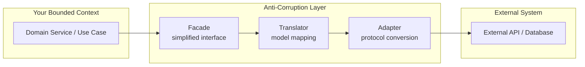
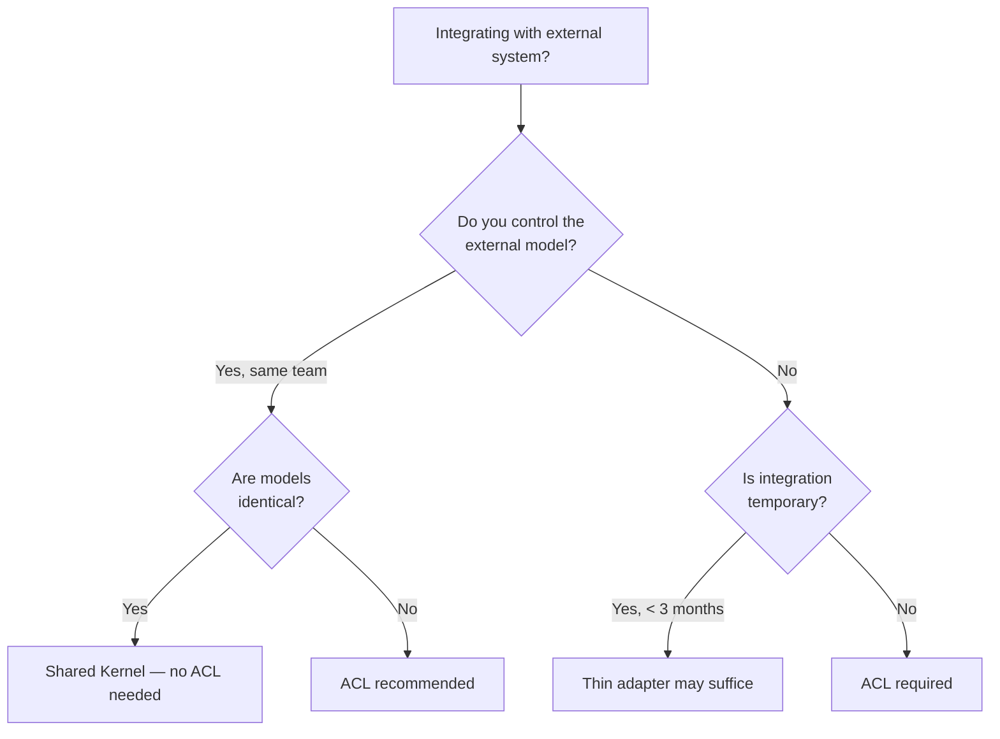
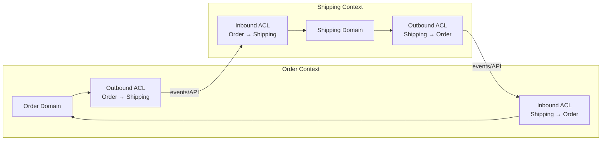

# Anti-Corruption Layer (ACL)

## Why It Exists

When your system integrates with another system — a legacy monolith, a third-party API, a partner's SOAP service, or even another bounded context within your own organization — the external system's model will contaminate your domain model unless you actively prevent it.

Eric Evans introduced the Anti-Corruption Layer in *Domain-Driven Design* (2003) as a defensive integration pattern. The name is intentionally dramatic: external models **corrupt** your domain when they leak in. An ACL is a translation layer that intercepts all communication between your bounded context and the external system, converting foreign concepts into your domain's language.

### The Problem It Solves

Consider an e-commerce system that integrates with a legacy ERP for inventory:

```
Without ACL:
┌──────────────────┐         ┌────────────────────┐
│  Order Service   │────────>│   Legacy ERP       │
│  (your domain)   │<────────│   (their model)    │
│                  │         │                    │
│  Order.erpSkuId  │         │  ITEM_MASTER table │
│  Order.erpLocId  │         │  LOC_CODE column   │
│  Order.erpQtyAvl │         │  QTY_AVL field     │
└──────────────────┘         └────────────────────┘
```

Your domain entities now contain ERP-specific field names, data formats, and assumptions. When the ERP is replaced (which always eventually happens), your entire domain must change.

```
With ACL:
┌──────────────────┐    ┌─────────────┐    ┌────────────────────┐
│  Order Service   │───>│    ACL      │───>│   Legacy ERP       │
│  (your domain)   │<───│  Translator │<───│   (their model)    │
│                  │    │  + Adapter  │    │                    │
│  Order.productId │    │             │    │  ITEM_MASTER table │
│  Order.warehouse │    │  maps       │    │  LOC_CODE column   │
│  Order.available │    │  concepts   │    │  QTY_AVL field     │
└──────────────────┘    └─────────────┘    └────────────────────┘
```

Your domain uses its own ubiquitous language. The ACL translates between the two models.

## First Principles

### Model Integrity

Every bounded context has a **model integrity boundary** — the perimeter within which the ubiquitous language is consistent and the domain model is coherent. The ACL is a guard at this perimeter.

Without the ACL, model integrity degrades according to the contamination rate:

$$
I(t) = I_0 \cdot e^{-\lambda \cdot n \cdot t}
$$

Where:
- $I_0$ = initial model integrity (1.0 = perfect)
- $\lambda$ = contamination rate per integration point
- $n$ = number of unprotected integration points
- $t$ = time in months

With even 3 unprotected integration points and a modest contamination rate of 0.05/month:

$$
I(12) = 1.0 \cdot e^{-0.05 \times 3 \times 12} = e^{-1.8} \approx 0.17
$$

After 12 months, only 17% of the original model integrity remains. With an ACL ($\lambda \approx 0$), integrity is preserved.

### The Three Components of an ACL

An Anti-Corruption Layer consists of three collaborating components:



1. **Facade**: Provides a simplified, domain-aligned interface that your code calls. Hides the complexity of the external system.
2. **Translator**: Converts between your domain model and the external system's model. Maps concepts, not just field names.
3. **Adapter**: Handles protocol-level concerns — HTTP calls, SOAP envelopes, database queries, message formats.

## Core Mechanics

### Component 1: The Adapter (Infrastructure Concern)

The adapter handles the raw communication with the external system:

```typescript
// acl/adapters/erp-api.adapter.ts
import type { AxiosInstance } from 'axios';

/** Raw ERP response shapes — exactly as the external API returns them */
export interface ErpItemResponse {
  ITEM_ID: string;
  SKU_CODE: string;
  ITEM_DESC: string;
  UOM: string;          // Unit of measure: 'EA', 'CS', 'PL'
  STD_COST: string;     // String representation of decimal
  LOC_CODE: string;
  QTY_ON_HAND: number;
  QTY_RESERVED: number;
  QTY_AVL: number;
  LAST_RECV_DT: string; // Format: 'YYYYMMDD'
  STATUS_FLG: string;   // 'A' = active, 'I' = inactive, 'D' = discontinued
}

export interface ErpReserveRequest {
  ITEM_ID: string;
  LOC_CODE: string;
  QTY: number;
  REF_NBR: string;      // Reference number for the reservation
  REF_TYPE: string;     // 'SO' = sales order, 'TO' = transfer order
}

export interface ErpReserveResponse {
  RSV_ID: string;
  STATUS: 'OK' | 'FAIL';
  MSG: string;
  QTY_RESERVED: number;
}

export class ErpApiAdapter {
  constructor(
    private readonly http: AxiosInstance,
    private readonly baseUrl: string,
  ) {}

  async getItem(itemId: string): Promise<ErpItemResponse | null> {
    try {
      const response = await this.http.get<ErpItemResponse>(
        `${this.baseUrl}/api/items/${itemId}`,
        {
          headers: { 'X-API-Key': process.env.ERP_API_KEY },
          timeout: 5000,
        },
      );
      return response.data;
    } catch (error: any) {
      if (error.response?.status === 404) return null;
      throw new ExternalSystemError('ERP', `Failed to fetch item ${itemId}`, error);
    }
  }

  async getItemBySku(skuCode: string): Promise<ErpItemResponse | null> {
    try {
      const response = await this.http.get<{ items: ErpItemResponse[] }>(
        `${this.baseUrl}/api/items`,
        {
          params: { SKU_CODE: skuCode },
          headers: { 'X-API-Key': process.env.ERP_API_KEY },
          timeout: 5000,
        },
      );
      return response.data.items[0] ?? null;
    } catch (error: any) {
      if (error.response?.status === 404) return null;
      throw new ExternalSystemError('ERP', `Failed to fetch item by SKU ${skuCode}`, error);
    }
  }

  async reserveInventory(request: ErpReserveRequest): Promise<ErpReserveResponse> {
    try {
      const response = await this.http.post<ErpReserveResponse>(
        `${this.baseUrl}/api/reservations`,
        request,
        {
          headers: { 'X-API-Key': process.env.ERP_API_KEY },
          timeout: 10000,
        },
      );
      return response.data;
    } catch (error: any) {
      throw new ExternalSystemError('ERP', 'Failed to reserve inventory', error);
    }
  }
}
```

### Component 2: The Translator (Concept Mapping)

The translator maps between the external system's concepts and your domain's concepts:

```typescript
// acl/translators/inventory.translator.ts
import type { ErpItemResponse, ErpReserveRequest, ErpReserveResponse } from '../adapters/erp-api.adapter';
import { ProductId } from '../../domain/value-objects/product-id';
import { WarehouseId } from '../../domain/value-objects/warehouse-id';
import { Money } from '../../domain/value-objects/money';
import { StockLevel } from '../../domain/value-objects/stock-level';
import { ProductAvailability } from '../../domain/value-objects/product-availability';
import type { InventoryReservation } from '../../domain/entities/inventory-reservation';
import type { OrderId } from '../../domain/value-objects/order-id';

export class InventoryTranslator {
  /**
   * Translates an ERP item response into our domain's ProductAvailability concept.
   *
   * Key translations:
   * - SKU_CODE → ProductId (our domain identifies products by SKU)
   * - LOC_CODE → WarehouseId (our domain calls locations "warehouses")
   * - QTY_AVL → StockLevel with availability semantics
   * - STATUS_FLG → boolean availability flag
   * - STD_COST → Money (our domain concept, not ERP's string format)
   * - UOM → handled internally (we always work in individual units)
   */
  static toProductAvailability(erpItem: ErpItemResponse): ProductAvailability {
    const productId = ProductId.of(erpItem.SKU_CODE);
    const warehouseId = WarehouseId.of(erpItem.LOC_CODE);

    // ERP tracks quantities in different UOMs; we normalize to individual units
    const availableQty = this.normalizeQuantity(erpItem.QTY_AVL, erpItem.UOM);
    const onHandQty = this.normalizeQuantity(erpItem.QTY_ON_HAND, erpItem.UOM);
    const reservedQty = this.normalizeQuantity(erpItem.QTY_RESERVED, erpItem.UOM);

    // ERP cost is a string like "12.5000"; we convert to Money
    const cost = Money.of(parseFloat(erpItem.STD_COST), 'USD');

    // ERP status flags map to our availability concept
    const isActive = erpItem.STATUS_FLG === 'A';
    const isDiscontinued = erpItem.STATUS_FLG === 'D';

    // ERP date format YYYYMMDD → Date
    const lastReceivedAt = this.parseErpDate(erpItem.LAST_RECV_DT);

    return ProductAvailability.create({
      productId,
      warehouseId,
      stockLevel: StockLevel.of(onHandQty, reservedQty, availableQty),
      unitCost: cost,
      isActive,
      isDiscontinued,
      lastReceivedAt,
    });
  }

  /**
   * Translates a domain reservation request into the ERP's format.
   */
  static toErpReserveRequest(
    productId: ProductId,
    warehouseId: WarehouseId,
    quantity: number,
    orderId: OrderId,
  ): ErpReserveRequest {
    return {
      ITEM_ID: productId.value,  // ERP uses ITEM_ID, we use productId
      LOC_CODE: warehouseId.value,
      QTY: quantity,
      REF_NBR: orderId.value,
      REF_TYPE: 'SO',            // Always 'Sales Order' from our context
    };
  }

  /**
   * Translates ERP reservation response into our domain's InventoryReservation.
   */
  static toInventoryReservation(
    erpResponse: ErpReserveResponse,
    productId: ProductId,
    orderId: OrderId,
  ): { success: boolean; reservationId: string | null; failureReason: string | null } {
    if (erpResponse.STATUS === 'OK') {
      return {
        success: true,
        reservationId: erpResponse.RSV_ID,
        failureReason: null,
      };
    }

    // Translate ERP error codes to domain-meaningful reasons
    const reasonMap: Record<string, string> = {
      'INSUF_QTY': 'Insufficient inventory available',
      'ITEM_INACTIVE': 'Product is no longer active',
      'LOC_CLOSED': 'Warehouse is closed for new reservations',
    };

    return {
      success: false,
      reservationId: null,
      failureReason: reasonMap[erpResponse.MSG] ?? `Unknown ERP error: ${erpResponse.MSG}`,
    };
  }

  /** ERP stores quantity in cases (CS=12 units) and pallets (PL=48 units) */
  private static normalizeQuantity(qty: number, uom: string): number {
    const multipliers: Record<string, number> = {
      'EA': 1,
      'CS': 12,
      'PL': 48,
    };
    return qty * (multipliers[uom] ?? 1);
  }

  /** Parse ERP date format 'YYYYMMDD' to Date */
  private static parseErpDate(erpDate: string): Date | null {
    if (!erpDate || erpDate === '00000000') return null;
    const year = parseInt(erpDate.substring(0, 4), 10);
    const month = parseInt(erpDate.substring(4, 6), 10) - 1;
    const day = parseInt(erpDate.substring(6, 8), 10);
    return new Date(year, month, day);
  }
}
```

### Component 3: The Facade (Domain-Aligned Interface)

The facade provides the interface your domain code actually calls:

```typescript
// acl/facades/inventory.facade.ts
import type { ErpApiAdapter } from '../adapters/erp-api.adapter';
import { InventoryTranslator } from '../translators/inventory.translator';
import type { ProductId } from '../../domain/value-objects/product-id';
import type { WarehouseId } from '../../domain/value-objects/warehouse-id';
import type { OrderId } from '../../domain/value-objects/order-id';
import type { ProductAvailability } from '../../domain/value-objects/product-availability';

/**
 * Facade for inventory operations.
 * This is what use case interactors depend on (via interface).
 * Implements the port defined in the application layer.
 */
export interface InventoryService {
  checkAvailability(productId: ProductId): Promise<ProductAvailability | null>;
  reserveForOrder(
    productId: ProductId,
    warehouseId: WarehouseId,
    quantity: number,
    orderId: OrderId,
  ): Promise<ReservationResult>;
}

export interface ReservationResult {
  success: boolean;
  reservationId: string | null;
  failureReason: string | null;
}

/** Concrete implementation using the ERP ACL */
export class ErpInventoryService implements InventoryService {
  constructor(private readonly erpAdapter: ErpApiAdapter) {}

  async checkAvailability(productId: ProductId): Promise<ProductAvailability | null> {
    // Use the adapter to call the ERP
    const erpItem = await this.erpAdapter.getItemBySku(productId.value);

    if (!erpItem) return null;

    // Use the translator to convert ERP concepts to our domain
    return InventoryTranslator.toProductAvailability(erpItem);
  }

  async reserveForOrder(
    productId: ProductId,
    warehouseId: WarehouseId,
    quantity: number,
    orderId: OrderId,
  ): Promise<ReservationResult> {
    // Translate domain request to ERP format
    const erpRequest = InventoryTranslator.toErpReserveRequest(
      productId, warehouseId, quantity, orderId,
    );

    // Call ERP through adapter
    const erpResponse = await this.erpAdapter.reserveInventory(erpRequest);

    // Translate ERP response back to domain concepts
    return InventoryTranslator.toInventoryReservation(
      erpResponse, productId, orderId,
    );
  }
}
```

## ACL for Event-Based Integration

When integrating via events (Kafka, RabbitMQ, etc.), the ACL translates incoming events from the external system's schema to your domain's event format:

```typescript
// acl/event-translators/shipping-event.translator.ts

/** External shipping system's event format */
interface ShippingSystemEvent {
  event_type: 'SHIPMENT_CREATED' | 'SHIPMENT_IN_TRANSIT' | 'SHIPMENT_DELIVERED' | 'SHIPMENT_FAILED';
  shipment_id: string;
  order_ref: string;
  carrier_code: string;
  tracking_nbr: string;
  status_dt: string;      // ISO 8601
  est_delivery_dt: string; // ISO 8601
  items: Array<{
    sku: string;
    qty: number;
  }>;
}

/** Our domain event format */
interface OrderShipmentUpdate {
  type: 'OrderShipped' | 'OrderInTransit' | 'OrderDelivered' | 'ShipmentFailed';
  orderId: string;
  shipmentId: string;
  carrier: string;
  trackingNumber: string;
  statusAt: Date;
  estimatedDelivery: Date | null;
  items: Array<{
    productId: string;
    quantity: number;
  }>;
}

export class ShippingEventTranslator {
  static translate(externalEvent: ShippingSystemEvent): OrderShipmentUpdate | null {
    const typeMap: Record<string, OrderShipmentUpdate['type']> = {
      'SHIPMENT_CREATED': 'OrderShipped',
      'SHIPMENT_IN_TRANSIT': 'OrderInTransit',
      'SHIPMENT_DELIVERED': 'OrderDelivered',
      'SHIPMENT_FAILED': 'ShipmentFailed',
    };

    const domainType = typeMap[externalEvent.event_type];
    if (!domainType) {
      // Unknown event type — log and skip
      console.warn(`Unknown shipping event type: ${externalEvent.event_type}`);
      return null;
    }

    const carrierMap: Record<string, string> = {
      'FEDX': 'FedEx',
      'UPS1': 'UPS',
      'USPS': 'USPS',
      'DHL1': 'DHL',
    };

    return {
      type: domainType,
      orderId: externalEvent.order_ref,
      shipmentId: externalEvent.shipment_id,
      carrier: carrierMap[externalEvent.carrier_code] ?? externalEvent.carrier_code,
      trackingNumber: externalEvent.tracking_nbr,
      statusAt: new Date(externalEvent.status_dt),
      estimatedDelivery: externalEvent.est_delivery_dt
        ? new Date(externalEvent.est_delivery_dt)
        : null,
      items: externalEvent.items.map((item) => ({
        productId: item.sku,
        quantity: item.qty,
      })),
    };
  }
}
```

```typescript
// acl/consumers/shipping-event.consumer.ts
import type { Consumer, EachMessagePayload } from 'kafkajs';
import { ShippingEventTranslator } from '../event-translators/shipping-event.translator';
import type { OrderShipmentHandler } from '../../application/handlers/order-shipment.handler';

export class ShippingEventConsumer {
  constructor(
    private readonly consumer: Consumer,
    private readonly handler: OrderShipmentHandler,
  ) {}

  async start(): Promise<void> {
    await this.consumer.subscribe({ topic: 'shipping.events', fromBeginning: false });

    await this.consumer.run({
      eachMessage: async (payload: EachMessagePayload) => {
        const raw = JSON.parse(payload.message.value!.toString());

        // ACL: Translate external event to domain event
        const domainEvent = ShippingEventTranslator.translate(raw);

        if (domainEvent) {
          await this.handler.handle(domainEvent);
        }
      },
    });
  }
}
```

## ACL for Database Integration (Shared Database)

When you must read from a legacy database shared with another team:

```typescript
// acl/adapters/legacy-customer-db.adapter.ts
import type { Pool } from 'pg';

/** Legacy database schema — columns named in Hungarian notation */
interface LegacyCustomerRow {
  intCustID: number;
  strCustName: string;
  strAddr1: string;
  strAddr2: string | null;
  strCity: string;
  strState: string;
  strZip: string;
  strCountry: string;
  dtCreated: Date;
  bitActive: boolean;
  intCreditLimit: number;    // Stored in cents
  strTaxExemptNbr: string | null;
}

export class LegacyCustomerDbAdapter {
  constructor(private readonly pool: Pool) {}

  async findById(customerId: number): Promise<LegacyCustomerRow | null> {
    const result = await this.pool.query<LegacyCustomerRow>(
      'SELECT * FROM tblCustomers WHERE intCustID = $1',
      [customerId],
    );
    return result.rows[0] ?? null;
  }
}
```

```typescript
// acl/translators/customer.translator.ts
import type { LegacyCustomerRow } from '../adapters/legacy-customer-db.adapter';
import { Customer } from '../../domain/entities/customer';
import { CustomerId } from '../../domain/value-objects/customer-id';
import { Address } from '../../domain/value-objects/address';
import { Money } from '../../domain/value-objects/money';

export class CustomerTranslator {
  static toDomain(row: LegacyCustomerRow): Customer {
    return Customer.reconstitute({
      id: CustomerId.of(row.intCustID.toString()),
      name: row.strCustName.trim(),
      address: Address.of({
        line1: row.strAddr1.trim(),
        line2: row.strAddr2?.trim() ?? null,
        city: row.strCity.trim(),
        state: row.strState.trim(),
        postalCode: row.strZip.trim(),
        country: this.normalizeCountry(row.strCountry),
      }),
      isActive: row.bitActive,
      creditLimit: Money.of(row.intCreditLimit / 100, 'USD'), // Cents to dollars
      taxExempt: row.strTaxExemptNbr !== null,
      createdAt: row.dtCreated,
    });
  }

  private static normalizeCountry(legacy: string): string {
    const map: Record<string, string> = {
      'US': 'US', 'USA': 'US', 'United States': 'US',
      'CA': 'CA', 'CAN': 'CA', 'Canada': 'CA',
      'UK': 'GB', 'GB': 'GB', 'United Kingdom': 'GB',
    };
    return map[legacy.trim()] ?? legacy.trim();
  }
}
```

## Edge Cases & Failure Modes

### 1. External System Downtime

The ACL must handle external system failures gracefully:

```typescript
export class ResilientErpInventoryService implements InventoryService {
  private readonly circuitBreaker: CircuitBreaker;
  private readonly cache: Map<string, { data: ProductAvailability; expiresAt: number }>;

  constructor(
    private readonly erpAdapter: ErpApiAdapter,
    private readonly fallbackTtlMs: number = 300_000, // 5 min cache
  ) {
    this.circuitBreaker = new CircuitBreaker({
      failureThreshold: 5,
      resetTimeMs: 30_000,
    });
    this.cache = new Map();
  }

  async checkAvailability(productId: ProductId): Promise<ProductAvailability | null> {
    try {
      return await this.circuitBreaker.execute(async () => {
        const erpItem = await this.erpAdapter.getItemBySku(productId.value);
        if (!erpItem) return null;

        const availability = InventoryTranslator.toProductAvailability(erpItem);

        // Cache for fallback
        this.cache.set(productId.value, {
          data: availability,
          expiresAt: Date.now() + this.fallbackTtlMs,
        });

        return availability;
      });
    } catch (error) {
      // Fallback to cached data
      const cached = this.cache.get(productId.value);
      if (cached && cached.expiresAt > Date.now()) {
        return cached.data;
      }
      throw error; // No cache, propagate failure
    }
  }
}
```

### 2. Schema Drift

External systems change their API without warning. Defensive parsing prevents cascading failures:

```typescript
static toProductAvailability(erpItem: unknown): ProductAvailability {
  // Validate shape before translation
  const item = erpItem as Record<string, unknown>;

  const skuCode = typeof item.SKU_CODE === 'string' ? item.SKU_CODE : '';
  if (!skuCode) {
    throw new TranslationError('Missing SKU_CODE in ERP response');
  }

  const qtyAvl = typeof item.QTY_AVL === 'number' ? item.QTY_AVL : 0;
  const stdCost = typeof item.STD_COST === 'string'
    ? parseFloat(item.STD_COST)
    : 0;

  // Continue with known defaults for optional fields...
}
```

### 3. Bidirectional Translation Loss

Some concepts exist in one system but not the other. Document these gaps:

| Our Concept | ERP Equivalent | Translation Notes |
|-------------|---------------|-------------------|
| Product.category | None | We derive from SKU prefix |
| Product.weight | ITEM_WEIGHT (in lbs) | Convert to kg |
| None | ITEM_CLASS | Ignored — not relevant to our domain |
| Order.priority | None | We add REF_TYPE suffix: 'SO-RUSH' |
| None | COST_CENTER | Hard-coded based on warehouse |

### 4. Performance Degradation

ACL adds latency. Measure and mitigate:

| Concern | Impact | Mitigation |
|---------|--------|------------|
| HTTP call to external API | 50-500 ms | Caching, circuit breaker |
| Object translation | 10-50 µs | Negligible |
| Schema validation | 5-20 µs | Negligible |
| Retry on failure | 200-2000 ms | Exponential backoff with jitter |

## Performance Characteristics

### Throughput Impact

With a circuit breaker and 5-minute cache:

| Scenario | Latency | Throughput |
|----------|---------|-----------|
| Cache hit | ~0.1 ms | ~100,000 req/s |
| Cache miss, ERP responds | ~80 ms | ~12 req/s (per connection) |
| ERP down, circuit open | ~0.1 ms (cached) | ~100,000 req/s |
| ERP down, no cache | immediate error | N/A |

### Memory Overhead

For caching 10,000 products:

$$
\text{Memory} = 10{,}000 \times 500\,\text{bytes/product} = 5\,\text{MB}
$$

Negligible for any production Node.js process.

::: info War Story
**The Integration That Corrupted Three Bounded Contexts**

A retail company integrated their order management, warehouse management, and customer service systems directly with a third-party loyalty program API. The loyalty API used a "points" model that represented monetary value differently in each market (1 point = $0.01 in US, 1 point = 1 yen in Japan, 1 point = 0.1 RMB in China).

Without an ACL, all three systems adopted the loyalty API's "points" abstraction directly. When the loyalty program provider changed their points-to-currency ratio during a promotional period, all three systems calculated discounts incorrectly. The bug lived in production for 6 hours before detection, resulting in $340K in over-discounted orders.

After the incident, the team built an ACL with a `LoyaltyTranslator` that converted "points" to their domain's `Money` value object at the boundary. The translator encapsulated the market-specific conversion logic in one place. When the next promotion changed the ratio, they updated one line in the translator and deployed in 10 minutes.
:::

## Mathematical Foundations — Coupling Theory

### Afferent and Efferent Coupling

Without an ACL, every class that touches the external system has efferent coupling to it:

$$
C_e^{\text{no ACL}} = \sum_{i=1}^{n} c_i
$$

Where $c_i$ is the number of external type references in class $i$ and $n$ is the number of classes that use the external system.

With an ACL, only the ACL components have efferent coupling:

$$
C_e^{\text{ACL}} = c_{\text{adapter}} + c_{\text{translator}}
$$

Typically $C_e^{\text{ACL}} \ll C_e^{\text{no ACL}}$ because $n$ grows with the codebase but the ACL is fixed-size.

### Change Impact Analysis

The probability that an external API change requires code changes in your domain:

$$
P(\text{domain change} | \text{API change}) = \begin{cases} 0 & \text{with ACL} \\ \frac{n_{\text{affected}}}{n_{\text{total}}} & \text{without ACL} \end{cases}
$$

With an ACL, external changes are absorbed entirely within the translation layer.

## Decision Framework

### When to Build an ACL



### ACL vs Other Integration Patterns

| Pattern | When to Use | Complexity | Protection |
|---------|------------|-----------|-----------|
| **Shared Kernel** | Two teams co-own a model subset | Low | None (by design) |
| **Conformist** | You adopt external model as-is | Low | None |
| **ACL** | You protect your model from external | Medium-High | Full |
| **Open Host Service** | You publish a clean API for others | Medium | Protects consumers |
| **Published Language** | Standard format (e.g., FHIR, FIX) | Medium | By standardization |

### ACL Sizing Guide

| Integration Complexity | ACL Size | Team Effort |
|-----------------------|----------|-------------|
| Simple REST API, 3-5 endpoints | ~300 LoC | 2-3 days |
| Complex API with 20+ endpoints | ~1,500 LoC | 1-2 weeks |
| Legacy SOAP/XML system | ~3,000 LoC | 2-4 weeks |
| Shared database with 50+ tables | ~5,000 LoC | 1-2 months |
| Full ERP integration | ~10,000+ LoC | 2-6 months |

## Advanced Topics

### ACL for Microservice Boundaries

Even between your own microservices, ACLs prevent model leakage:

```typescript
// In the Order service, an ACL for the Product service
export class ProductServiceAcl implements ProductCatalog {
  constructor(private readonly httpClient: AxiosInstance) {}

  async getProduct(productId: ProductId): Promise<Product | null> {
    // Call Product service API
    const response = await this.httpClient.get(`/api/products/${productId.value}`);
    if (!response.data) return null;

    // Translate Product service's model to Order service's concept of a product
    // Order service only cares about: id, name, price, isAvailable
    // Product service returns: 30+ fields about manufacturing, SEO, images, etc.
    return {
      id: ProductId.of(response.data.id),
      name: response.data.title, // They call it "title", we call it "name"
      price: Money.of(response.data.pricing.retail, response.data.pricing.currency),
      isAvailable: response.data.inventory.status === 'IN_STOCK',
    };
  }
}
```

### Bi-directional ACL

When two bounded contexts communicate in both directions:



Each context has its own ACL for both directions. The translation is not necessarily symmetric — each side extracts only the concepts it cares about.

### Testing ACLs

```typescript
describe('InventoryTranslator', () => {
  it('should translate ERP item to ProductAvailability', () => {
    const erpItem: ErpItemResponse = {
      ITEM_ID: 'ITM-001',
      SKU_CODE: 'WIDGET-100',
      ITEM_DESC: 'Standard Widget',
      UOM: 'CS',           // Case = 12 units
      STD_COST: '15.5000',
      LOC_CODE: 'WH-EAST',
      QTY_ON_HAND: 100,    // 100 cases = 1200 units
      QTY_RESERVED: 20,    // 20 cases = 240 units
      QTY_AVL: 80,         // 80 cases = 960 units
      LAST_RECV_DT: '20260315',
      STATUS_FLG: 'A',
    };

    const result = InventoryTranslator.toProductAvailability(erpItem);

    expect(result.productId.value).toBe('WIDGET-100');
    expect(result.warehouseId.value).toBe('WH-EAST');
    expect(result.stockLevel.available).toBe(960); // Normalized to units
    expect(result.unitCost.amount).toBe(15.5);
    expect(result.isActive).toBe(true);
    expect(result.lastReceivedAt).toEqual(new Date(2026, 2, 15));
  });

  it('should handle discontinued items', () => {
    const erpItem: ErpItemResponse = {
      // ... same as above but:
      STATUS_FLG: 'D',
      QTY_AVL: 0,
    };

    const result = InventoryTranslator.toProductAvailability(erpItem);
    expect(result.isDiscontinued).toBe(true);
    expect(result.stockLevel.available).toBe(0);
  });
});
```

## Further Reading

- [Strategic Design](/architecture-patterns/domain-driven-design/strategic-design) — bounded contexts and context mapping
- [Specification Pattern](./specification-pattern) — encoding business rules
- [DDD TypeScript Implementation](./typescript-implementation) — full project with ACL integration
- [Event Schema Evolution](/architecture-patterns/event-driven/event-schema-evolution) — handling schema changes in event-based ACLs
- [Clean Architecture: Layers & Boundaries](/architecture-patterns/clean-architecture/layers-and-boundaries) — ACL as an adapter in Ring 3
