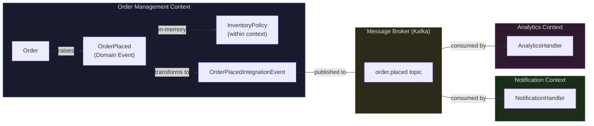
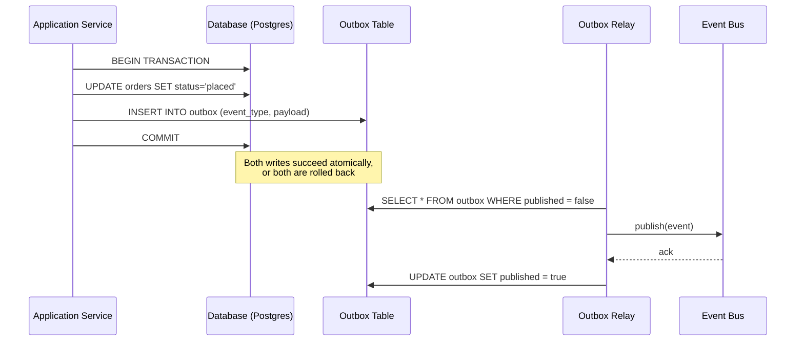

# DDD Domain Events

A domain event is a record of something significant that happened in the domain. Not a system event (a file was written, a thread was created), not a technical event (a database was queried) — but a business event: an order was placed, a payment was received, a customer's shipping address was changed.

Domain events are facts. They are immutable records of what happened at a specific point in time. They represent the past tense of your ubiquitous language: `OrderPlaced`, `PaymentReceived`, `ShippingAddressChanged`.

## 1. Why Domain Events Exist

### The Problem: Tight Coupling Between Aggregates

When an order is placed in an e-commerce system, multiple things need to happen:
- Inventory must be reserved for the ordered items
- A payment must be initiated
- A confirmation email must be sent to the customer
- Analytics must record the conversion
- The warehouse must be notified

The naive implementation puts all of this in the `placeOrder()` method, or in an application service that calls each service in sequence:

```typescript
// Naive approach — tight coupling, violation of open/closed principle
class OrderApplicationService {
  async placeOrder(command: PlaceOrderCommand): Promise<void> {
    const order = await this.orderRepository.findById(command.orderId)
    order.place()
    await this.orderRepository.save(order)

    // Every new reaction requires modifying this method
    await this.inventoryService.reserve(order)
    await this.paymentService.initiate(order)
    await this.emailService.sendConfirmation(order)
    await this.analyticsService.trackConversion(order)
    await this.warehouseService.notify(order)
  }
}
```

Problems:
- Adding a new reaction (e.g., loyalty points accrual) requires modifying `placeOrder()`
- All reactions happen synchronously in the same transaction — if the email service is slow, the user waits
- If the email service throws, the entire operation may be rolled back (order not placed because email failed)
- `OrderApplicationService` depends on every service that cares about order placement

### The Solution: Invert the Dependency

Domain events invert the dependency. Instead of `placeOrder()` calling every interested service, it publishes an `OrderPlaced` event. Each interested service subscribes to the event independently:

```typescript
// Event-driven approach — loose coupling, open/closed
class OrderApplicationService {
  async placeOrder(command: PlaceOrderCommand): Promise<void> {
    const order = await this.orderRepository.findById(command.orderId)
    order.place() // aggregate raises OrderPlaced internally
    await this.orderRepository.save(order)
    await this.eventBus.publishAll(order.domainEvents)
    order.clearDomainEvents()
    // Done. OrderApplicationService has no idea who reacts.
  }
}

// Each handler is independent — adding a new one doesn't change OrderApplicationService
class ReserveInventoryOnOrderPlaced {
  handle(event: OrderPlaced): Promise<void> { ... }
}

class InitiatePaymentOnOrderPlaced {
  handle(event: OrderPlaced): Promise<void> { ... }
}

class SendConfirmationEmailOnOrderPlaced {
  handle(event: OrderPlaced): Promise<void> { ... }
}
```

## 2. What Is a Domain Event

### Core Characteristics

**A domain event is:**
- A **fact about the past** — immutable, named in the past tense
- **Raised by an aggregate** — it is the aggregate that has the knowledge to know when something significant happened
- **Named in the ubiquitous language** — domain experts recognise the name
- **Self-contained** — carries all the information needed to react to it without requiring additional queries

**A domain event is not:**
- A command (which is a request for something to happen)
- A query result
- An infrastructure event (file saved, cache invalidated)
- A system notification (health check passed)

### Domain Event Base Class

```typescript
abstract class DomainEvent {
  readonly eventId: string
  readonly occurredAt: Date
  readonly aggregateId: string
  readonly aggregateType: string
  readonly eventVersion: number

  constructor(aggregateId: string, aggregateType: string) {
    this.eventId = uuidv7()
    this.occurredAt = new Date()
    this.aggregateId = aggregateId
    this.aggregateType = aggregateType
    this.eventVersion = 1
  }

  // Subclasses provide their specific event type name
  abstract get eventType(): string
}
```

### Concrete Domain Events

```typescript
class OrderPlaced extends DomainEvent {
  readonly customerId: string
  readonly items: ReadonlyArray<{
    productId: string
    productName: string
    quantity: number
    unitPriceAmount: number
    unitPriceCurrency: string
  }>
  readonly totalAmount: number
  readonly totalCurrency: string

  constructor(
    orderId: OrderId,
    customerId: CustomerId,
    items: ReadonlyArray<OrderLine>,
    total: Money,
  ) {
    super(orderId, 'Order')
    this.customerId = customerId.value
    this.items = items.map(line => ({
      productId: line.productId.value,
      productName: line.productName,
      quantity: line.quantity.value,
      unitPriceAmount: line.unitPrice.amount,
      unitPriceCurrency: line.unitPrice.currency,
    }))
    this.totalAmount = total.amount
    this.totalCurrency = total.currency
  }

  get eventType(): string { return 'order.placed' }
}

class OrderCancelled extends DomainEvent {
  readonly reason: string
  readonly customerId: string

  constructor(orderId: OrderId, customerId: CustomerId, reason: string) {
    super(orderId, 'Order')
    this.reason = reason
    this.customerId = customerId.value
  }

  get eventType(): string { return 'order.cancelled' }
}

class ItemAddedToOrder extends DomainEvent {
  readonly productId: string
  readonly productName: string
  readonly quantity: number
  readonly unitPriceAmount: number
  readonly unitPriceCurrency: string

  constructor(
    orderId: OrderId,
    productId: ProductId,
    productName: string,
    quantity: Quantity,
    unitPrice: Money,
  ) {
    super(orderId, 'Order')
    this.productId = productId.value
    this.productName = productName
    this.quantity = quantity.value
    this.unitPriceAmount = unitPrice.amount
    this.unitPriceCurrency = unitPrice.currency
  }

  get eventType(): string { return 'order.item_added' }
}
```

## 3. Raising Domain Events from Aggregates

There are two common approaches to raising domain events from aggregates.

### Approach 1: Collect Events in the Aggregate (Recommended)

The aggregate maintains a private list of events raised during the current operation. After the aggregate is saved, the application service dispatches the collected events.

```typescript
abstract class AggregateRoot<TId extends string> extends Entity<TId> {
  private _domainEvents: DomainEvent[] = []

  protected raise(event: DomainEvent): void {
    this._domainEvents.push(event)
  }

  get domainEvents(): ReadonlyArray<DomainEvent> {
    return [...this._domainEvents]
  }

  clearDomainEvents(): void {
    this._domainEvents = []
  }
}

class Order extends AggregateRoot<OrderIdBrand> {
  place(): void {
    this.guardPlacementInvariants()
    this._status = OrderStatus.Placed
    this.raise(new OrderPlaced(this._id, this._customerId, this._lines, this.total))
  }

  cancel(reason: string): void {
    this.guardCancellationInvariants()
    this._status = OrderStatus.Cancelled
    this.raise(new OrderCancelled(this._id, this._customerId, reason))
  }
}

// Application service dispatches after save
class PlaceOrderHandler {
  constructor(
    private readonly orderRepository: OrderRepository,
    private readonly eventBus: EventBus,
  ) {}

  async handle(command: PlaceOrderCommand): Promise<void> {
    const order = await this.orderRepository.findById(command.orderId)
    if (!order) throw new NotFoundException('Order not found')

    order.place()

    // Save first, then dispatch events
    await this.orderRepository.save(order)
    await this.eventBus.publishAll(order.domainEvents)
    order.clearDomainEvents()
  }
}
```

**Why save before publishing?** If publishing fails after saving, events can be replayed. If saving fails after publishing, a handler has reacted to an event for a state change that didn't persist — much harder to recover from.

### Approach 2: Static Mediator (Alternative)

```typescript
class DomainEvents {
  private static handlers: Map<string, DomainEventHandler<any>[]> = new Map()

  static register<T extends DomainEvent>(
    eventType: string,
    handler: DomainEventHandler<T>,
  ): void {
    const existing = this.handlers.get(eventType) ?? []
    this.handlers.set(eventType, [...existing, handler])
  }

  static async dispatch(event: DomainEvent): Promise<void> {
    const handlers = this.handlers.get(event.eventType) ?? []
    await Promise.all(handlers.map(h => h.handle(event)))
  }
}

// Aggregate raises events directly via mediator
class Order extends AggregateRoot<OrderIdBrand> {
  place(): void {
    this.guardPlacementInvariants()
    this._status = OrderStatus.Placed
    // Raises immediately — problematic if called before transaction commits
    DomainEvents.dispatch(new OrderPlaced(this._id, this._customerId, this._lines, this.total))
  }
}
```

This approach is simpler but has a significant problem: events are dispatched immediately, possibly before the database transaction commits. If the transaction is rolled back, event handlers have already run with stale data.

**Use the collect-and-dispatch approach (Approach 1) in production systems.**

## 4. Event Handler Interface and Implementation

```typescript
interface DomainEventHandler<T extends DomainEvent> {
  handle(event: T): Promise<void>
}

// Concrete handler: reserve inventory when order is placed
class ReserveInventoryOnOrderPlaced
  implements DomainEventHandler<OrderPlaced>
{
  constructor(private readonly inventoryService: InventoryService) {}

  async handle(event: OrderPlaced): Promise<void> {
    const reservations = event.items.map(item => ({
      productId: item.productId,
      quantity: item.quantity,
    }))

    try {
      await this.inventoryService.reserveBatch(reservations, event.aggregateId)
    } catch (error) {
      // Log and potentially raise a compensating event
      // Do not re-throw unless you want to affect the main transaction
      logger.error('Failed to reserve inventory', { event, error })
      // Could raise InventoryReservationFailed event here
    }
  }
}

// Event bus that dispatches to registered handlers
class InProcessEventBus implements EventBus {
  private handlers: Map<string, DomainEventHandler<any>[]> = new Map()

  register<T extends DomainEvent>(
    eventType: string,
    handler: DomainEventHandler<T>,
  ): void {
    const existing = this.handlers.get(eventType) ?? []
    this.handlers.set(eventType, [...existing, handler])
  }

  async publish(event: DomainEvent): Promise<void> {
    const handlers = this.handlers.get(event.eventType) ?? []
    await Promise.all(handlers.map(h => h.handle(event)))
  }

  async publishAll(events: ReadonlyArray<DomainEvent>): Promise<void> {
    for (const event of events) {
      await this.publish(event)
    }
  }
}
```

## 5. Domain Events vs Application Events vs Integration Events

These three types of events are often conflated. Understanding their differences determines where to publish and how to handle them.

### Domain Events

**Scope:** Within a single bounded context.

**Audience:** Other parts of the same bounded context — other aggregates, projections, policies within the same context.

**Format:** Rich domain objects — can carry domain types directly (Money, CustomerId, etc.).

**Transport:** In-memory, synchronous or asynchronous within the same process.

**Retention:** Usually not stored (unless event sourcing). Fire-and-forget.

**Example:** `OrderPlaced` raised by the Order aggregate, consumed by the InventoryReservationPolicy within the Order Management context.

### Application Events

**Scope:** Within a single application (potentially spanning bounded contexts in a monolith).

**Audience:** Application-layer handlers that may cross context boundaries.

**Format:** Serialisable (JSON), context-agnostic data.

**Transport:** In-memory message bus.

**Example:** An event bus within a monolith that routes events between modules.

### Integration Events

**Scope:** Across bounded contexts, across services, potentially across organisations.

**Audience:** Other services, external consumers.

**Format:** Strictly versioned, serialisable (Avro, Protobuf, or JSON with schema registry). Uses the Published Language pattern.

**Transport:** Message broker (Kafka, RabbitMQ, SQS).

**Retention:** Stored in the message broker with a configurable retention period. Consumers can replay.

**Example:** An `OrderPlacedIntegrationEvent` published to Kafka by the Order Management service, consumed by the Notification service and the Analytics service.



### The Translation Layer

Domain events often need to be translated to integration events before being published externally. This translation happens in an application service or an outbound adapter:

```typescript
class OrderEventPublisher {
  constructor(private readonly integrationEventBus: IntegrationEventBus) {}

  async onOrderPlaced(event: OrderPlaced): Promise<void> {
    // Translate domain event to integration event
    const integrationEvent: OrderPlacedIntegrationEvent = {
      eventId: event.eventId,
      occurredAt: event.occurredAt.toISOString(),
      orderId: event.aggregateId,
      customerId: event.customerId,
      totalAmount: event.totalAmount,
      totalCurrency: event.totalCurrency,
      itemCount: event.items.length,
      // Note: we may not publish internal details like exact line items
      // depending on what the Published Language exposes
    }

    await this.integrationEventBus.publish(
      'order.placed',
      integrationEvent,
    )
  }
}
```

## 6. Event Storming: Discovering Domain Events

Event storming is a collaborative workshop technique invented by Alberto Brandolini for discovering domain events, commands, aggregates, and policies in a domain.

### The Workshop Setup

**Participants:** Domain experts, product managers, engineers, UX designers — anyone who understands a part of the domain.

**Materials:** A long roll of paper on a wall (or a large collaborative whiteboard tool). Sticky notes in multiple colours:
- Orange: domain events
- Blue: commands
- Yellow: aggregates / actors
- Purple/pink: policies (when event happens, then command is triggered)
- Red: problems / hotspots

### The Process

**Phase 1: Chaotic exploration (30-60 minutes)**

Everyone writes domain events on orange stickies — past-tense significant things that happen in the system — and places them on the wall. No discussion, no ordering. Quantity over quality. The goal is to get everything out of people's heads.

**Phase 2: Enforce the timeline (30-60 minutes)**

As a group, arrange events in chronological order along the timeline. Conflicts surface: two people have different mental models of when or why an event occurs. These conflicts reveal hidden complexity and differing understanding — exactly what you want to surface.

**Phase 3: Add commands and aggregates**

For each event, add the command that triggered it (blue sticky) and the aggregate that raised it (yellow sticky). This reveals the request-response structure of the domain.

**Phase 4: Add policies**

Add policies (pink sticky): "Whenever X happens, Y is triggered." These are the reactive logic of the system. `When OrderPlaced, then ReserveInventory`. `When PaymentFailed, then CancelOrder`.

**Phase 5: Identify bounded contexts**

Group clusters of events, commands, and aggregates that belong together. Discuss boundaries. Mark problem areas (red stickies) where the model is unclear.

### What Event Storming Reveals

- The complete event timeline of a business process
- Missing events (things that happen but weren't modelled)
- Naming disagreements (same concept, different names — reveals hidden contexts)
- Process hotspots (areas of high complexity, high frequency, or high risk)
- The natural aggregate boundaries (clusters of events around a central aggregate)
- The policies that link aggregates

## 7. Domain Events as the Bridge to Event Sourcing

Event sourcing is a persistence pattern where the state of an aggregate is derived from its history of domain events, rather than from a current snapshot.

In a conventional system:
- Current state is stored in the database
- Events are optional side effects of state changes

In an event-sourced system:
- Events are the source of truth
- Current state is derived by replaying events

```typescript
// Event-sourced aggregate rebuilds state from events
class Order extends AggregateRoot<OrderIdBrand> {
  private _status: OrderStatus = OrderStatus.Draft
  private _lines: OrderLine[] = []

  // Apply method handles each event type
  protected apply(event: DomainEvent): void {
    if (event instanceof OrderPlaced) {
      this._status = OrderStatus.Placed
    } else if (event instanceof ItemAddedToOrder) {
      const line = OrderLine.fromEvent(event)
      this._lines.push(line)
    } else if (event instanceof OrderCancelled) {
      this._status = OrderStatus.Cancelled
    }
  }

  // Rebuild from event history
  static reconstitute(events: DomainEvent[]): Order {
    const order = new Order()
    for (const event of events) {
      order.apply(event)
    }
    order.version = events.length
    return order
  }

  // Operations raise events, then apply them
  place(): void {
    this.guardPlacementInvariants()
    const event = new OrderPlaced(this._id, this._customerId, this._lines, this.total)
    this.raise(event) // collect for dispatch
    this.apply(event) // update internal state
  }
}
```

The DDD domain events pattern is a natural gateway to event sourcing. The discipline of capturing all state changes as named domain events (rather than just mutating state directly) makes the transition to event sourcing mechanical.

## 8. The Transactional Outbox Pattern

The fundamental problem with domain event publishing: how do you guarantee that events are published if and only if the database transaction commits?

**The dual write problem:**
```
save(order)  ← succeeds
publish(OrderPlaced) ← fails or process crashes
// Now: order is placed in DB, but no handlers reacted
// Inventory was never reserved. Payment was never initiated.
```

The solution is the **transactional outbox pattern**:

1. Within the same database transaction that saves the aggregate, also write the events to an `outbox` table
2. A separate process (or the same process on the next cycle) reads events from the outbox and publishes them to the event bus
3. After successful publishing, mark events as published (or delete them from the outbox)



### TypeScript Outbox Implementation

```typescript
// Outbox record persisted alongside aggregate
interface OutboxRecord {
  id: string
  aggregateId: string
  aggregateType: string
  eventType: string
  payload: object
  occurredAt: Date
  publishedAt: Date | null
  retryCount: number
}

// Repository saves aggregate AND outbox records in the same transaction
class PostgresOrderRepository implements OrderRepository {
  async save(order: Order): Promise<void> {
    const client = await this.db.connect()
    try {
      await client.query('BEGIN')

      // Save aggregate state
      await this.saveOrderState(client, order)

      // Write domain events to outbox (same transaction)
      for (const event of order.domainEvents) {
        await client.query(
          `INSERT INTO outbox (id, aggregate_id, aggregate_type, event_type, payload, occurred_at)
           VALUES ($1, $2, $3, $4, $5, $6)`,
          [
            event.eventId,
            event.aggregateId,
            event.aggregateType,
            event.eventType,
            JSON.stringify(event),
            event.occurredAt,
          ]
        )
      }

      await client.query('COMMIT')
    } catch (error) {
      await client.query('ROLLBACK')
      throw error
    } finally {
      client.release()
    }
  }
}

// Outbox relay: runs on a schedule, publishes unpublished events
class OutboxRelay {
  constructor(
    private readonly db: Pool,
    private readonly eventBus: IntegrationEventBus,
  ) {}

  async relay(): Promise<void> {
    const client = await this.db.connect()
    try {
      // Lock rows for this relay instance (FOR UPDATE SKIP LOCKED)
      const result = await client.query<OutboxRecord>(
        `SELECT * FROM outbox
         WHERE published_at IS NULL AND retry_count < 5
         ORDER BY occurred_at ASC
         LIMIT 100
         FOR UPDATE SKIP LOCKED`
      )

      for (const record of result.rows) {
        try {
          await this.eventBus.publish(record.event_type, record.payload)

          await client.query(
            `UPDATE outbox SET published_at = NOW() WHERE id = $1`,
            [record.id]
          )
        } catch (error) {
          await client.query(
            `UPDATE outbox SET retry_count = retry_count + 1 WHERE id = $1`,
            [record.id]
          )
          logger.error('Failed to publish outbox event', { record, error })
        }
      }
    } finally {
      client.release()
    }
  }
}
```

### Change Data Capture as an Alternative

Instead of an application-managed outbox, Change Data Capture (CDC) tools like Debezium can capture database changes from the write-ahead log (WAL) and publish them as events.

**Advantages of CDC:**
- Zero application code for the outbox
- Works with existing tables without schema changes
- Very low latency (WAL is tailed directly)

**Disadvantages:**
- Requires CDC infrastructure (Debezium, Kafka Connect)
- Published events reflect database rows, not domain events — may require transformation
- Harder to test

The choice between the outbox pattern and CDC depends on infrastructure constraints and the importance of event semantics. The outbox pattern gives you full control over the event structure; CDC gives you automatic reliability.

## 9. War Story: Lost Events After Transaction Commit

::: info War Story
We were building an order management system for a retail client. Order placement triggered several reactions: inventory reservation, payment initiation, warehouse notification, customer email.

We implemented domain events using the static mediator approach (Approach 2 from above). The `Order.place()` method called `DomainEvents.dispatch(new OrderPlaced(...))` synchronously. All the handlers ran, and life was good in development.

Six weeks after launch, operations reported that occasionally, customers were receiving order confirmation emails but their inventory wasn't being reserved. Orders were being placed but items weren't being held, leading to overselling.

After three days of investigation, we found the bug. The `dispatch()` in `Order.place()` was running inside the database transaction. The sequence was:

1. Begin transaction
2. `Order.place()` runs, raises event
3. `DomainEvents.dispatch()` runs synchronously
4. `ReserveInventoryHandler` runs — calls inventory service HTTP endpoint
5. Inventory service reserves stock — **this committed to the inventory database**
6. `SendEmailHandler` runs — email queued in SendGrid
7. Back in our code: `await orderRepository.save(order)` — **this fails with a deadlock**
8. Transaction rolls back — order is NOT placed in our database
9. But: inventory is reserved, email is queued

The root issue: handlers that had external effects (HTTP calls, email queue) ran before the transaction committed. When the transaction rolled back, the external effects were not rolled back.

The fix:
1. Switch to collect-and-dispatch (Approach 1) — events collected during aggregate operations
2. Dispatch events only after `repository.save()` returns successfully
3. Wrap integration side effects in the outbox pattern for external calls

This added two days of refactoring but completely eliminated the class of bug. The lesson: events with external side effects must be dispatched after the transaction commits, full stop. The collect-and-dispatch pattern enforces this as a structural property of the code.
:::

## 10. Advanced: Domain Event Metadata and Correlation

In a production system, events need metadata for debugging, distributed tracing, and audit purposes.

```typescript
abstract class DomainEvent {
  readonly eventId: string
  readonly occurredAt: Date
  readonly aggregateId: string
  readonly aggregateType: string
  readonly eventVersion: number

  // Distributed tracing
  readonly correlationId: string  // Groups related events across services
  readonly causationId: string    // The event or command that caused this event
  readonly userId: string | null  // User who triggered the originating command

  constructor(
    aggregateId: string,
    aggregateType: string,
    context: EventContext,
  ) {
    this.eventId = uuidv7()
    this.occurredAt = new Date()
    this.aggregateId = aggregateId
    this.aggregateType = aggregateType
    this.eventVersion = 1
    this.correlationId = context.correlationId
    this.causationId = context.causationId
    this.userId = context.userId ?? null
  }
}

// Context propagated through command handling
interface EventContext {
  correlationId: string
  causationId: string  // Usually the command ID
  userId?: string
}

// Application service propagates context to events
class PlaceOrderHandler {
  async handle(command: PlaceOrderCommand): Promise<void> {
    const order = await this.orderRepository.findById(command.orderId)

    const eventContext: EventContext = {
      correlationId: command.correlationId,
      causationId: command.commandId,
      userId: command.userId,
    }

    order.place(eventContext)
    await this.orderRepository.save(order)
    await this.eventBus.publishAll(order.domainEvents)
    order.clearDomainEvents()
  }
}
```

This metadata enables:
- Linking all events caused by a single user action (correlationId)
- Tracing the chain of causation between events (causationId)
- Auditing which user triggered each change (userId)
- Distributed tracing across services (correlationId maps to a trace ID)

---

::: tip Next Steps
Domain events are the foundation for the [Anti-Corruption Layer](./anti-corruption-layer.md) — understanding how events flow across context boundaries without letting external models contaminate your domain.
:::
