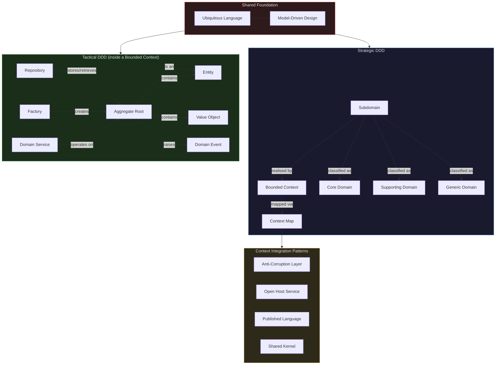

# Domain-Driven Design

Domain-Driven Design (DDD) is a software development approach that centres the development process on a rich understanding of the domain in which the software operates. The premise is both simple and radical: the most important thing you can do on a complex software project is deeply understand the problem you're solving, build a shared language with the people who understand that problem, and let that understanding drive every technical decision.

Eric Evans coined the term and formalised the approach in his 2003 book *Domain-Driven Design: Tackling Complexity in the Heart of Software* — often called "the Blue Book." The book emerged from Evans' experience watching talented engineers build technically impressive systems that nonetheless failed to solve the actual business problem, or succeeded initially but became impossible to change as the business evolved.

## 1. Why DDD Exists: The Problem It Solves

### The Enterprise Software Complexity Crisis

By the late 1990s, enterprise software had a well-documented crisis. Large projects routinely failed — running over budget, missing deadlines, and delivering systems that didn't meet business needs. The failure mode wasn't typically a lack of engineering talent. Engineers were building systems that worked technically but were disconnected from the reality of the business.

The core problem was a **translation gap**. Business stakeholders spoke the language of their domain — in insurance, they talked about "policies," "riders," "endorsements," "subrogation." Engineers translated these concepts into database tables, service methods, and class names — `PolicyRecord`, `updatePolicy()`, `p_data`. Over time, the translation accumulated errors and the code stopped reflecting how the business actually thought about the problem.

When a business requirement changed, engineers had to first understand the business concept, then figure out which of the many technical artifacts mapped to it, then make changes across all of them. Each change introduced risk of inconsistency. The system became increasingly brittle.

### What Evans Observed

Evans identified three compounding problems:

**1. The model lived in the analysts' heads.** Business analysts wrote requirements documents. Engineers read them, built something, and moved on. The document became stale immediately. The actual model of how the business worked existed nowhere in the code.

**2. There was no shared language.** Business stakeholders, analysts, and engineers all had different names for the same concepts. "Account" meant one thing to the sales team, something different to the finance team, and something else again to the engineers who built the account service. Every conversation required constant translation.

**3. The technical architecture fought the domain.** Layered architectures with database-centric design put persistence concerns at the centre. The domain model was an afterthought — a thin veneer over stored procedures or an ORM mapping to a relational schema that had been designed by a DBA thinking about normalisation, not business concepts.

### The Solution DDD Proposes

DDD proposes that software development is a knowledge-crunching activity. The most valuable output of the early phases of a project isn't a requirements document or a data model — it's a shared, refined understanding of the domain expressed as a working model that engineers and domain experts develop together.

This model becomes the centre of the software. The code is a direct expression of the model. When the model changes, the code changes. When someone reads the code, they understand the business.

## 2. First Principles

### The Model Is Not the Data Schema

The most common misunderstanding of DDD is treating it as a fancy way of doing database design. The domain model is not an ER diagram. It is a conceptual model of the problem domain — the entities, concepts, rules, and processes that exist in the business reality.

A relational database schema is one possible representation of that model in storage. It is an implementation detail. The domain model can be stored in many ways — relational, document, event store, in-memory. The model itself is independent of storage.

### Ubiquitous Language

The first core idea is **ubiquitous language**: a shared vocabulary developed by engineers and domain experts together, used in all communication — conversations, documents, code.

The language is not invented by engineers and handed to business stakeholders, nor is it the existing business jargon adopted wholesale. It is developed collaboratively, refined through conversations, and it must be precise. Ambiguous terms get clarified. Conflicting uses of the same term reveal separate concepts that need separate names.

When the ubiquitous language is established:
- Class names in the code match business terms
- Method names express business operations
- Variable names express domain concepts
- Test names describe business behaviours
- Database table names (even if different from class names) can be mapped meaningfully

A conversation between a developer and a domain expert uses the same words as the code. There is no translation layer.

### Model-Driven Design

The second core idea is **model-driven design**: the code is a direct implementation of the model. The model is not a diagram that gets translated into code. The model lives in the code.

This is different from UML-driven design where diagrams are the source of truth and code is generated from them (or written to match them, then immediately diverges). In DDD, the model evolves through code. When engineers discover that the code is hard to write, that's feedback that the model is wrong.

The model is continuously refined as understanding deepens. This refinement happens in code — refactoring the code is refactoring the model.

## 3. Strategic vs Tactical DDD

DDD operates at two levels that address different problems.

### Strategic DDD

Strategic DDD addresses the large-scale structure of the system. It answers:
- How do we organise a large complex domain into manageable parts?
- How do different parts of the system relate to each other?
- Where should we invest the most engineering effort?

Strategic DDD tools:
- **Bounded Contexts** — explicit boundaries within which a model is defined and applies
- **Context Mapping** — relationships and integration patterns between bounded contexts
- **Subdomains** — natural divisions of the problem domain
- **Core Domain** — the part of the domain that is the business's competitive advantage

Strategic DDD can be applied without any tactical DDD. You can identify your bounded contexts and design their relationships even if the implementation inside each context is a simple CRUD service.

### Tactical DDD

Tactical DDD addresses the design of the model within a single bounded context. It answers:
- How do we structure the objects within this context?
- How do we enforce business rules?
- How do we handle state changes?

Tactical DDD tools:
- **Entities** — objects with identity
- **Value Objects** — objects defined by their attributes
- **Aggregates** — consistency boundaries around clusters of related objects
- **Domain Services** — business logic that doesn't belong to any single entity
- **Repositories** — collection-like interfaces for aggregates
- **Domain Events** — notifications of significant occurrences in the domain
- **Factories** — complex object creation

Tactical DDD is optional and should only be applied where the domain complexity justifies it.

## 4. Core Concepts: The DDD Concept Map



## 5. When DDD Is Worth It

DDD has a real cost. It requires sustained collaboration between engineers and domain experts. It produces more code than CRUD. It demands continuous refactoring as the model is refined. It takes time to develop the ubiquitous language.

That cost is justified when the system has **complex business logic** — not technical complexity (distributed systems, performance at scale) but domain complexity (intricate business rules, complex workflows, many edge cases that reflect business reality rather than technical constraints).

### Indicators that DDD is appropriate

**Deep domain logic.** The business has rules that take years to understand fully. Insurance underwriting, financial derivatives pricing, clinical treatment protocols, supply chain optimisation. The rules are numerous, interconnected, and change as the business learns.

**High cost of model errors.** When the software misrepresents the domain, real money is lost, regulations are violated, or customers are harmed. The precision of DDD's model pays for itself in avoided errors.

**Long-lived software.** Software that will be actively developed for five or more years benefits from a model that accurately represents the domain, because the model guides every subsequent change. CRUD systems accrued over a long period become incomprehensible messes. Systems with strong domain models remain navigable.

**Domain knowledge as competitive advantage.** If the software encodes deep understanding of the domain that competitors lack, the model itself is a competitive moat. Investing in the model is investing in the moat.

**Multiple teams working on related problems.** Strategic DDD's bounded contexts give teams clear ownership and explicit contracts for integration, reducing coordination overhead.

### Specific conditions for applying tactical DDD

Even in a system where strategic DDD is warranted, tactical DDD should only be applied to parts of the system where the business logic is genuinely complex:

- Aggregates with complex invariants to enforce
- Business rules that span multiple entities
- State machines with complex transitions and guards
- Calculations that involve intricate domain logic

## 6. When to Skip DDD

DDD is not the answer for every problem. It is frequently over-applied, which produces unnecessarily complex systems without proportional benefit.

### Skip DDD when building CRUD applications

Most business applications are, at their core, CRUD — Create, Read, Update, Delete. A user fills out a form. The data is validated. It is stored. It is retrieved and displayed. It is updated. Business rules are simple: required fields, format validation, uniqueness constraints.

For these systems, DDD adds ceremony without value. A simple three-layer architecture (controller, service, repository) with an ORM is the right choice. You can always introduce DDD concepts later if complexity grows, but starting with full DDD for a CRUD app is engineering hubris.

### Skip DDD for simple REST APIs

An API that proxies to a database, applies simple transformation, and returns results does not benefit from a domain model. A data-centric approach — request DTOs, a thin service layer, a repository — is cleaner and faster to build.

### Skip DDD when domain expertise is unavailable

DDD requires access to domain experts who can participate in model refinement. If your domain experts are not available (or not willing to engage) for regular conversations with engineers, you cannot develop ubiquitous language or validate your model. DDD without domain expert collaboration produces an engineer's guess at a domain model, which is worse than no model at all.

### Skip DDD for infrastructure-oriented systems

Systems that are primarily about infrastructure — monitoring, deployment pipelines, log aggregation, network management — are technical in nature. Their "domain" is the technical infrastructure itself, which is already well-modelled by existing frameworks and tools. DDD does not add much here.

## 7. Common Misconceptions

### "DDD is about the ORM annotations"

The most damaging misconception: treating DDD as a way of designing database schemas, with entities mapped directly to ORM models. This produces anemic domain models — classes with only getters and setters, and no business logic. All the logic ends up in service classes, which is effectively a transaction script pattern with extra steps.

A proper DDD entity encapsulates its own invariants. It knows what operations are valid. It rejects invalid state changes. It raises domain events when significant things happen. The ORM is infrastructure — a detail hidden behind a repository.

### "DDD means microservices"

DDD's bounded contexts are often presented alongside microservices, but they are independent concepts. You can implement bounded contexts as modules within a monolith. A monolith with well-defined bounded contexts is far better than microservices with poorly defined boundaries. Boundary definition is the hard part; the deployment topology is a separate decision.

### "DDD is too academic for startups"

Strategic DDD — identifying your core domain and investing appropriately in it — is valuable at any scale. The bounded context concept helps even a two-person team avoid building a God object. You don't need to apply every tactical pattern; start with the concepts that solve your actual problems.

### "Value Objects are just DTOs"

Data Transfer Objects (DTOs) are anemic data carriers with no behaviour. Value Objects in DDD are rich domain concepts with behaviour. A `Money` value object knows how to add two amounts, convert currencies, and format itself for display. It enforces invariants — negative amounts are impossible. It provides a semantic type that prevents passing a price where a tax amount is expected.

### "Aggregates should be large"

A common mistake is creating large aggregates that encompass everything related to a concept. This is driven by a fear of eventual consistency — if everything is in one aggregate, all operations are transactional. But large aggregates create contention (only one transaction can modify an aggregate at a time), are harder to reason about, and tend to accumulate responsibilities that should be elsewhere.

Aggregates should be as small as possible while still enforcing their invariants. The goal is a small, highly consistent cluster, not a comprehensive unit.

## 8. The Learning Path Through This Section

This section covers DDD comprehensively across six sub-pages:

### [Strategic Design](./strategic-design.md)
The large-scale structure of DDD. Bounded contexts and their relationships through context mapping. How to identify your core domain. How strategic design applies to microservices. Start here if you're thinking about system architecture.

### [Tactical Design](./tactical-design.md)
The building blocks within a bounded context. Entities, value objects, aggregates, domain services, repositories, factories. Complete TypeScript implementations with production-grade patterns. Start here if you're implementing a domain model.

### [Domain Events](./domain-events.md)
How significant occurrences in the domain are captured as first-class events. The difference between domain events, application events, and integration events. Event storming. The bridge to event sourcing.

### [Anti-Corruption Layer](./anti-corruption-layer.md)
How to integrate with legacy systems and external APIs without letting their models pollute your domain. Facade, adapter, and translator patterns. Testing strategies.

### [Specification Pattern](./specification-pattern.md)
Encapsulating business rules as composable predicates. Combining specifications with boolean operators. Translating specifications to database queries.

### [TypeScript Implementation](./typescript-implementation.md)
A complete, production-ready DDD implementation in TypeScript. The full Order Management bounded context with all tactical patterns, application layer, tests, and project structure.

## 9. Decision Framework

Use this framework to decide how much DDD to apply:

```
Is this system domain-complex (not just technically complex)?
├── No → Use simple layered architecture + ORM
└── Yes
    ├── Will this system be actively developed for 3+ years?
    │   ├── No → Lightweight tactical patterns only (aggregates + value objects)
    │   └── Yes → Full strategic + tactical DDD
    │
    ├── Do you have access to domain experts?
    │   ├── No → Strategic DDD only (bounded contexts), defer tactical
    │   └── Yes → Full DDD engagement
    │
    └── Which parts of the domain are complex?
        ├── Core domain (competitive advantage) → Maximum DDD investment
        ├── Supporting subdomain → Moderate tactical DDD
        └── Generic subdomain → Buy/use an existing solution
```

## 10. A Note on DDD and Modern Architecture

DDD was articulated in 2003, before microservices, cloud-native architecture, event sourcing, and CQRS became mainstream. Yet it has proven remarkably durable. The core ideas — ubiquitous language, bounded contexts, model-driven design — are more relevant now than ever.

Modern distributed systems face exactly the problem DDD addresses: how do you decompose a complex domain into parts that can evolve independently while remaining coherent? DDD's bounded contexts provide the answer. How do you capture the history of what has happened in the domain? Domain events, extended to event sourcing, provide the answer.

DDD is not a methodology from another era to be applied mechanically. It is a set of principles and patterns for managing complexity in software that reflects a business domain. Apply the principles. Adapt the patterns to your context. Invest proportionally to the complexity you face.

The rest of this section shows you exactly how to do that.

---

::: tip Getting Started
If you are new to DDD, read the pages in order: Strategic Design → Tactical Design → Domain Events. Then read Anti-Corruption Layer and Specification Pattern when you encounter those specific needs. The TypeScript Implementation page is reference material to return to as you build.
:::

::: warning Prerequisites
This section assumes you are comfortable with TypeScript, have built at least one non-trivial backend system, and understand basic OOP concepts (encapsulation, polymorphism, interfaces). Some sections reference CQRS and event sourcing — familiarity with those concepts helps but is not required.
:::
