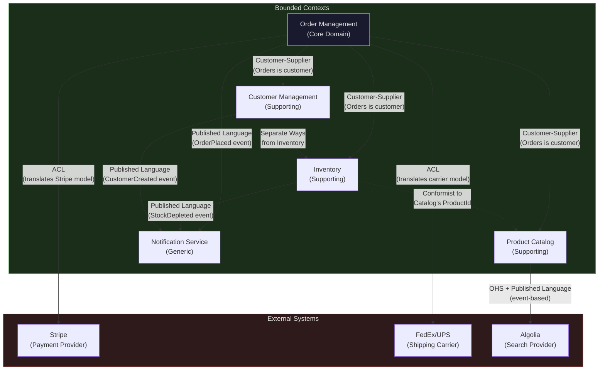

# DDD Strategic Design

Strategic design is the part of Domain-Driven Design that addresses the large-scale structure of complex systems. It answers the questions that matter most at the architectural level: How do we divide a large, complex domain into manageable parts? How do those parts relate to each other? Where should we concentrate engineering investment?

Strategic design operates above the code level. You can apply it without writing a single class or method. Its primary outputs are **bounded context definitions**, a **context map**, and a **subdomain classification** that guides investment decisions. These outputs become the architectural blueprint for the system.

## 1. Why Strategic Design Exists

### The God Domain Problem

Before strategic design, large systems tended toward one of two failure modes.

The first was the **unified model** — a single domain model that attempted to capture every concept in the entire organisation. In an e-commerce company, this model tried to represent customers (as the marketing team understands them), customers (as the support team understands them), customers (as the billing team understands them), and customers (as the fraud detection team understands them) — all as a single `Customer` class.

This produces a class with dozens of fields, most of which are null in any given context, and behaviour that is conditionally valid depending on the operation being performed. The model becomes incoherent because it tries to serve too many masters with conflicting needs.

The second failure mode was **no model at all** — each team built their own system independently, with no shared language or explicit contracts between them. Integration happened through database sharing, direct SQL queries across service boundaries, or ad-hoc API calls that were never formally defined.

Strategic design resolves both failure modes. Different parts of the domain get different models, each precise within its own context. Integration between contexts is explicit and well-defined.

### The Naming Ambiguity Problem

A specific symptom that drove Evans to formalise bounded contexts was the pervasive problem of names that mean different things in different parts of the organisation.

Consider "Account" in a bank:
- In retail banking, an Account is a deposit account — a bucket of money belonging to a customer
- In accounting, an Account is a line in the general ledger — an abstract categorisation of financial transactions
- In customer relations, an Account is the customer relationship — the set of products, contacts, and history associated with a customer
- In investment banking, an Account is a trading account — a portfolio of positions and a margin facility

These four things are related but genuinely different concepts. A single `Account` class cannot represent all four without becoming a sprawling, incoherent mess. Bounded contexts give each team their own `Account` concept, precise within their context, with explicit translations at the boundaries.

## 2. Bounded Context: The Foundational Concept

### Definition

A bounded context is **an explicit boundary within which a particular domain model applies and is internally consistent**. Inside the boundary, every term in the ubiquitous language has a single, unambiguous meaning. Outside the boundary, the same term may mean something different.

The boundary is not primarily a technical boundary (though it often aligns with technical boundaries). It is first a **linguistic boundary** — a context within which the language is consistent.

### The Ideal Alignment

Ideally, a bounded context has:

**One model.** A single, coherent domain model that all code within the context uses. No concept has two different representations within the same context.

**One team.** A single team owns and develops the context. This team owns the language within the context. They are the authority on what terms mean and how concepts relate. When there is more than one team working in the same context, language drift occurs — teams develop different understandings of the same concepts, and the model becomes inconsistent.

**One codebase (usually).** The context is typically implemented in a single deployable unit — a service, a module, a bounded module within a monolith. This is not an absolute rule; a bounded context can span multiple deployment units (a command service and a query service in a CQRS architecture, for example), but it is the common case.

**One database (usually).** Each context manages its own data. Sharing a database schema between two contexts creates implicit coupling — changes to the schema for one context can break the other.

### One Concept, Different Meanings: The Customer Example

The best illustration of bounded contexts is what happens to a single concept — "Customer" — across different contexts in a typical e-commerce platform.

**In the Sales context:** Customer is a prospect or buyer. The model cares about contact information, purchase history, lifetime value, loyalty tier, and preferred payment methods. The identity is the customer's profile. Operations include: `acquire()`, `upgradeToVIP()`, `calculateLifetimeValue()`.

**In the Support context:** Customer is a person who needs help. The model cares about contact channels, open tickets, product ownership, and escalation history. The identity is the support relationship. Operations include: `openTicket()`, `escalate()`, `resolveIssue()`.

**In the Billing context:** Customer is a billing entity. The model cares about billing address, payment instruments, outstanding balance, and invoice history. The identity is the billing account. Operations include: `charge()`, `issueRefund()`, `applyCredit()`.

**In the Fraud Detection context:** Customer is a risk profile. The model cares about behavioural signals — unusual purchase patterns, device fingerprints, geographic anomalies. The identity is the risk subject. Operations include: `scoreRisk()`, `flagSuspiciousActivity()`.

These four models share an identifier (the customer ID) but are entirely different objects. Forcing them into a single class produces a class that is useful to nobody and correct for nobody. Each context has its own `Customer` model, optimised for its own needs.

```mermaid
graph LR
    subgraph Sales["Sales Context"]
        SC[Customer\n- contactInfo\n- purchaseHistory\n- loyaltyTier\n- acquire()\n- upgradeToVIP()]
    end

    subgraph Support["Support Context"]
        SUC[Customer\n- supportTickets\n- productOwnership\n- escalationHistory\n- openTicket()\n- escalate()]
    end

    subgraph Billing["Billing Context"]
        BC[Customer\n- billingAddress\n- paymentInstruments\n- outstandingBalance\n- charge()\n- issueRefund()]
    end

    subgraph Fraud["Fraud Context"]
        FC[Customer\n- riskScore\n- deviceFingerprints\n- behaviouralSignals\n- scoreRisk()\n- flagSuspicious()]
    end

    ID[Customer ID] --> SC
    ID --> SUC
    ID --> BC
    ID --> FC

    style Sales fill:#1a1a2e,stroke:#4a90d9,color:#e0e0e0
    style Support fill:#1a2e1a,stroke:#4a9d4a,color:#e0e0e0
    style Billing fill:#2e1a1a,stroke:#d94a4a,color:#e0e0e0
    style Fraud fill:#2e2a1a,stroke:#d9a44a,color:#e0e0e0
```

### Bounded Context vs. Microservice

Bounded contexts and microservices are often conflated but are distinct concepts.

A **bounded context** is a conceptual boundary around a model with consistent language. It is a modelling concept.

A **microservice** is a deployment unit — a separately deployable process. It is an operational concept.

The relationship: a bounded context *might* be deployed as a microservice. But it might also be a module within a monolith. Multiple related bounded contexts might be deployed together in the early stages of a system. A mature system might extract bounded contexts into microservices as scaling needs emerge.

Starting a system as a monolith with explicit bounded context boundaries (clear module boundaries, no direct cross-context model access) is often the right approach. The bounded context boundaries become the seams along which microservices can later be extracted without major refactoring.

## 3. Context Mapping: Relationships Between Bounded Contexts

A context map is a diagram (or document) that shows all bounded contexts and their relationships. It is a critical output of strategic design. Every bounded context exists in relationship to other contexts — they share data, exchange events, or call each other's APIs. Those relationships have different patterns, each with different implications.

Evans identified eight relationship patterns. Here is each one with its characteristics and when to use it.

### Partnership

**What it is:** Two teams have a mutually dependent relationship. They collaborate closely, coordinate changes, and jointly plan integration. Success or failure is shared.

**When to use it:** When two bounded contexts evolve together because their functionality is closely related, and both teams are willing and able to coordinate regularly.

**Risks:** Partnership requires genuine collaboration. If one team becomes more constrained than the other, the relationship degrades into Customer-Supplier. Partnership also creates mutual dependency — a breaking change in either context requires coordination.

**Signs it's breaking down:** One team starts building their own version of the shared integration. Meetings become contentious. Release coordination becomes a bottleneck.

```
Partnership (bidirectional coordination):
  TeamA ←→ TeamB
  (coordinate changes, mutual success)
```

### Shared Kernel

**What it is:** Two bounded contexts share a subset of the domain model. This shared portion is co-owned by both teams. Changes to the shared kernel require agreement from both teams.

**When to use it:** When two contexts genuinely share concepts that cannot be duplicated without unacceptable divergence — often identifiers, common value types, or shared domain events.

**Risks:** The shared kernel creates coupling. Both teams must agree on every change. It can become a coordination bottleneck. The kernel tends to grow over time as each team adds things it wants to share.

**Best practice:** Keep the shared kernel minimal. Define it formally. Resist the temptation to add things to it.

```
Shared Kernel:
  [Context A] --[uses]--> [Shared Kernel] <--[uses]-- [Context B]
  Both teams own the kernel jointly
```

### Customer-Supplier

**What it is:** An upstream context (supplier) provides something that a downstream context (customer) depends on. The downstream team can request features or changes from the upstream team, but the upstream team decides whether and when to implement them.

**When to use it:** When there is a clear data or service dependency and one team has priority over another.

**The dynamic:** The upstream team has leverage. They can prioritise their own roadmap. The downstream team must adapt to upstream API changes. A healthy Customer-Supplier relationship involves the upstream team consulting with downstream consumers before making breaking changes, and the downstream team clearly communicating their needs.

**When it breaks down:** When the upstream team ignores downstream needs entirely, the downstream team starts working around the upstream API in hacky ways, or builds their own copy of upstream data. This is when the relationship degrades to Conformist.

### Conformist

**What it is:** The downstream context adopts the upstream context's model wholesale. There is no attempt to translate or adapt. The downstream team conforms to whatever the upstream team provides.

**When to use it:** When the upstream is an external system or SaaS provider whose model is well-designed and whose interface the downstream team has no power to influence. Also when the upstream team is unresponsive to downstream needs and the downstream team has no leverage.

**Implication:** The downstream context takes on the conceptual burden of the upstream model. If the upstream model is poor, the downstream code reflects that poorness. The upstream team's decisions directly impact the downstream team's design quality.

**Example:** Integrating with Stripe. Stripe has a well-defined model (Charge, PaymentIntent, Customer, Subscription). The integration code often conforms to this model rather than translating it, because Stripe's model is well-designed and the integration team has no influence over it.

### Anti-Corruption Layer

**What it is:** The downstream context creates a translation layer that converts the upstream model into the downstream context's own model. The downstream context's code only interacts with the translated model, never directly with the upstream representation.

**When to use it:** When the upstream model is different from, or inferior to, the downstream model. When direct adoption of the upstream model would pollute the downstream context's design. When the upstream is a legacy system or an external system with a poorly designed interface.

**Investment:** Building and maintaining an ACL has a cost. The translation code must be kept current as the upstream changes. Caching and performance must be considered. But the investment protects the downstream context from upstream complexity.

**See:** [Anti-Corruption Layer](./anti-corruption-layer.md) for the complete pattern with TypeScript implementation.

### Open Host Service

**What it is:** The upstream context defines a protocol — a set of services with a formal, well-documented interface — that downstream contexts can use. The protocol is designed for external consumption and is kept stable.

**When to use it:** When many downstream contexts need to integrate with the same upstream context. Rather than building custom integrations for each, the upstream defines a general-purpose API.

**Example:** An internal platform team providing authentication services to all other teams defines an Open Host Service. They maintain backward compatibility, version the API, and provide documentation. Each downstream team integrates with the published protocol.

**Relationship to Published Language:** Open Host Service is the access mechanism; Published Language is the language used in that mechanism. They are often used together.

### Published Language

**What it is:** The integration between contexts uses a well-documented, shared language — typically a formal schema (JSON Schema, Protocol Buffers, Avro) or a standardised ontology.

**When to use it:** When the integration language needs to be stable, versioned, and understandable by many parties — including teams outside the organisation.

**Example:** An event-driven system where domain events are published using a formal Avro schema registry. The schema is the published language. All consumers are expected to use the schema.

**Difference from Shared Kernel:** The Published Language is a communication format, not shared code. It can be consumed by any language/platform. The Shared Kernel is code that runs in both contexts.

### Separate Ways

**What it is:** Two contexts have no integration. They solve their problems independently. Any apparent overlap is resolved by each context implementing its own solution.

**When to use it:** When the cost of integration exceeds the benefit. When two contexts touch on similar concepts but their implementations would diverge so much that integration creates more friction than value.

**Example:** Two business units in a large corporation both need a "reporting" capability. Each unit's reporting needs are so specific that sharing a reporting service would require so much configuration and customisation that it is simpler for each to build its own.

**Risk:** Separate Ways can be an excuse to avoid necessary integration. It should be a deliberate decision, not the default.

## 4. Context Map for an E-Commerce Platform

Here is a realistic context map for a moderately complex e-commerce platform with five bounded contexts.



**Reading the map:**

- **Order Management** is the Core Domain — the primary source of business value. It depends on Inventory, Customers, and Catalog as supporting contexts, acting as a customer in Customer-Supplier relationships. It protects itself from external providers (Stripe, FedEx) via Anti-Corruption Layers.
- **Inventory** conforms to Catalog's ProductId — it uses Catalog's identifier for products rather than defining its own.
- **Notifications** is generic — it receives events from multiple upstream contexts via a Published Language (event schemas) and sends notifications through appropriate channels.
- **Customers** and **Inventory** go Separate Ways — they have no integration because there is no business need for inventory to know about customers or vice versa.

## 5. Subdomains vs Bounded Contexts

This is a conceptual distinction that trips up many practitioners.

### Subdomains

A **subdomain** is a part of the problem space — a naturally occurring division of the business domain. Subdomains exist independently of how you choose to structure your software. They are discovered, not invented.

In an e-commerce business, the natural subdomains are:
- Order processing
- Inventory management
- Customer management
- Payment processing
- Shipping and logistics
- Product catalogue management
- Search and discovery
- Notification and communication

These are the actual problems the business has to solve. They exist whether you build software or not.

### Bounded Contexts

A **bounded context** is a part of the solution space — an explicit software boundary that you create. It is a decision about how to structure your software. Bounded contexts are designed, not discovered.

Ideally, bounded contexts align one-to-one with subdomains. Each subdomain gets its own bounded context with its own model, language, and team. But reality is messier:

**One subdomain, multiple bounded contexts:** A complex subdomain (like order processing) might be split into multiple contexts (order entry, order fulfilment, order reporting) as it grows.

**One bounded context, multiple subdomains:** An early-stage startup might not have the team capacity to separate every subdomain. Multiple subdomains are implemented in the same bounded context, which is OK initially — the key is recognising the distinction so you can separate them later.

**Legacy systems:** A legacy system might span multiple subdomains without any intentional bounded context design. Context mapping helps you understand how to integrate with or gradually decompose it.

```
Problem Space          Solution Space
───────────────        ───────────────
Subdomain     ─────►   Bounded Context
(discovered)           (designed)

A subdomain can map to 1, many, or partial bounded contexts.
A bounded context can contain 1 or many subdomains (usually a sign of immaturity).
```

## 6. Distillation: Finding Your Core Domain

Not all subdomains are equal. DDD's distillation concept asks you to classify each subdomain:

### Core Domain

The core domain is the part of the domain that is **the business's primary source of competitive differentiation**. It is the reason the business exists and the place where the software provides unique, hard-to-replicate value.

For Amazon in 2003: recommendation engine, logistics optimisation, and seller marketplace.
For Spotify: music discovery, playlist generation, and audio streaming quality.
For a legal practice management software vendor: matter management, billing, and document automation tailored to legal workflows.

**Investment signal:** Apply the maximum engineering talent and DDD rigor to the core domain. This is where the model must be most precise, the ubiquitous language most carefully developed, and the implementation most carefully crafted.

### Supporting Subdomain

A supporting subdomain is **necessary for the business to function but does not differentiate it from competitors**. Inventory management is necessary for an e-commerce business but is not a differentiator — it is not the reason customers choose you.

**Investment signal:** Build it yourself (because buying a generic solution won't fit your specific needs) but apply less rigor. A simpler architecture is acceptable. Hire less senior engineers. Incur some technical debt if necessary.

### Generic Subdomain

A generic subdomain is **a well-understood problem with available off-the-shelf solutions**. Authentication, email sending, PDF generation, payment processing.

**Investment signal:** Buy it or use an open source solution. Do not build it yourself. The only reason to build a generic subdomain is if the available solutions are inadequate for your scale or have unacceptable constraints.

### The Distillation Matrix

| Subdomain | Differentiation | Build vs Buy | DDD Investment |
|-----------|----------------|--------------|----------------|
| Core | High | Build (always) | Maximum |
| Supporting | Medium | Build (usually) | Moderate |
| Generic | None | Buy/use existing | Minimal |

## 7. Strategic Design in a Microservices Architecture

When a system is implemented as microservices, bounded contexts provide the natural boundary for service decomposition.

### The Ideal Alignment

Each microservice should implement one bounded context. This gives the service:
- A clear, single responsibility (the context's model)
- An autonomous team (the context's team)
- An isolated data store (the context's data)
- Explicit contracts for integration (the context's API)

### Common Anti-Patterns

**The CRUD Microservice:** A microservice for each entity (`customer-service`, `order-service`, `product-service`) that just exposes CRUD operations on a database table. This is not DDD. The "services" don't have bounded contexts — they don't have domain logic or ubiquitous language. They are just data access layers masquerading as microservices.

**Premature decomposition:** Splitting into microservices before bounded contexts are well-understood. You cut along the wrong boundaries and spend the next year dealing with chatty inter-service communication and distributed transactions that should have been local.

**Sharing a database:** Two microservices that both write to the same database tables. This violates bounded context isolation. Changes to the schema affect both services. There is no clear ownership.

### The Strangler Fig Pattern for Migration

When migrating a monolith to microservices using bounded context design:

1. Map the existing monolith's bounded contexts (they exist implicitly — find them).
2. Identify the best candidate for extraction: a bounded context with clear boundaries, low coupling to other contexts, and a clear value proposition for independent deployment.
3. Build the new service with a proper bounded context design.
4. Use an Anti-Corruption Layer in the new service to integrate with the remaining monolith.
5. Gradually migrate traffic from the monolith to the new service.
6. When migration is complete, remove the monolith's implementation of that subdomain.
7. Repeat for the next bounded context.

## 8. Mathematical Formalisation

The complexity that strategic design manages can be expressed formally.

Let $n$ be the number of concepts in a domain. In a unified model, every concept must be consistent with every other concept. The number of consistency constraints grows as $O(n^2)$ — for 100 concepts, there are potentially 10,000 pairings to keep consistent.

With bounded contexts, each context contains $k_i$ concepts (where $\sum k_i = n$). The consistency constraints within each context are $O(k_i^2)$. The total internal constraints are $\sum O(k_i^2)$, which, by the convexity of the square function, is substantially less than $O(n^2)$ when the concepts are distributed across contexts.

The integration overhead between contexts is an additional cost proportional to the number of integration points. But this cost is explicit and bounded, whereas the cost of maintaining consistency in a unified model is hidden and unbounded.

$$\text{Total Complexity} = \sum_{i=1}^{m} O(k_i^2) + O(\text{integration points})$$

$$\text{vs. Unified Model Complexity} = O\!\left(\left(\sum_{i=1}^{m} k_i\right)^2\right) = O(n^2)$$

For any non-trivial domain with multiple contexts, $\sum k_i^2 \ll n^2$, making the bounded context approach qualitatively simpler to reason about.

## 9. War Story: The Hidden Bounded Context

::: info War Story
We were working on a B2B SaaS platform for professional services firms. The system had been growing for four years and had the classic symptoms of a big ball of mud: a `Client` entity with 87 fields, a service layer that was a 3000-line `ClientService` class, and a team that dreaded touching anything in the client management area because changes had unpredictable ripple effects.

We started a DDD engagement. The first step was event storming — bringing the product managers, domain experts, and engineering leads into a room with sticky notes and mapping out everything that happened in the system.

By the end of the first day, something interesting emerged. The domain experts were talking about "clients" in two completely different ways and getting confused with each other. The account managers talked about clients as sales relationships — prospects, pipeline stages, contract negotiations. The delivery team talked about clients as project contexts — who was working on what, which documents existed, what the deadlines were.

We had assumed "client management" was one bounded context. It was actually two: **Client Acquisition** (the sales domain) and **Client Engagement** (the project delivery domain). They shared only the client identifier.

Once we separated the contexts on a whiteboard, the 87-field `Client` entity fell apart: 31 fields belonged to Client Acquisition, 38 fields belonged to Client Engagement, and 18 fields were genuinely shared (name, contact info, identifier).

We refactored the monolith over three months. Two modules, two team sub-teams, two clear models. The `ClientService` shrank to two focused service classes of about 400 lines each. New features in the sales area stopped breaking delivery features. Developer confidence returned.

The lesson: when a model feels wrong, when entities accumulate fields that seem unrelated, when service classes grow without bound — look for hidden bounded contexts. The model is often trying to serve two masters simultaneously.
:::

## 10. Context Mapping in Practice

### Creating a Context Map

1. **Identify all bounded contexts.** List every part of the system that has (or should have) its own model. Include external systems as contexts.

2. **For each pair of contexts that integrate, identify the relationship:**
   - Who depends on whom? (direction of data/service flow)
   - Who has power in the relationship? (Customer-Supplier vs Partnership)
   - Is there a translation layer? (ACL)
   - Is there a formal protocol? (OHS + Published Language)

3. **Draw the map.** Conventions: upstream contexts on the left or top. Downstream contexts on the right or bottom. Annotate relationships with the pattern name.

4. **Validate with the teams.** Each team should recognise their context on the map and agree with their relationships.

### Evolving the Context Map

The context map is a living document. It should be updated:
- When a new bounded context is added
- When integration patterns change (an ACL is replaced by a published language, for example)
- When a legacy system is replaced or decommissioned
- When bounded context boundaries are redrawn

### Signals That a Context Map Is Wrong

**Teams fighting over model ownership:** Two teams both want to own the definition of a concept. This usually means the concept lives in the wrong bounded context.

**An integration that is always breaking:** An integration that requires constant maintenance often indicates that the wrong relationship pattern was chosen — typically, an implicit conformist relationship where an ACL was needed.

**A context map that nobody updates:** If the map stops being maintained, it no longer reflects reality. Designate a map owner responsible for keeping it current.

**A context that is huge while others are tiny:** A context that keeps absorbing concepts from other contexts is probably two or more contexts that haven't been separated yet.

---

::: tip Next Steps
After understanding strategic design, move to [Tactical Design](./tactical-design.md) to learn how to implement a domain model within a bounded context using entities, value objects, aggregates, and domain services.
:::
