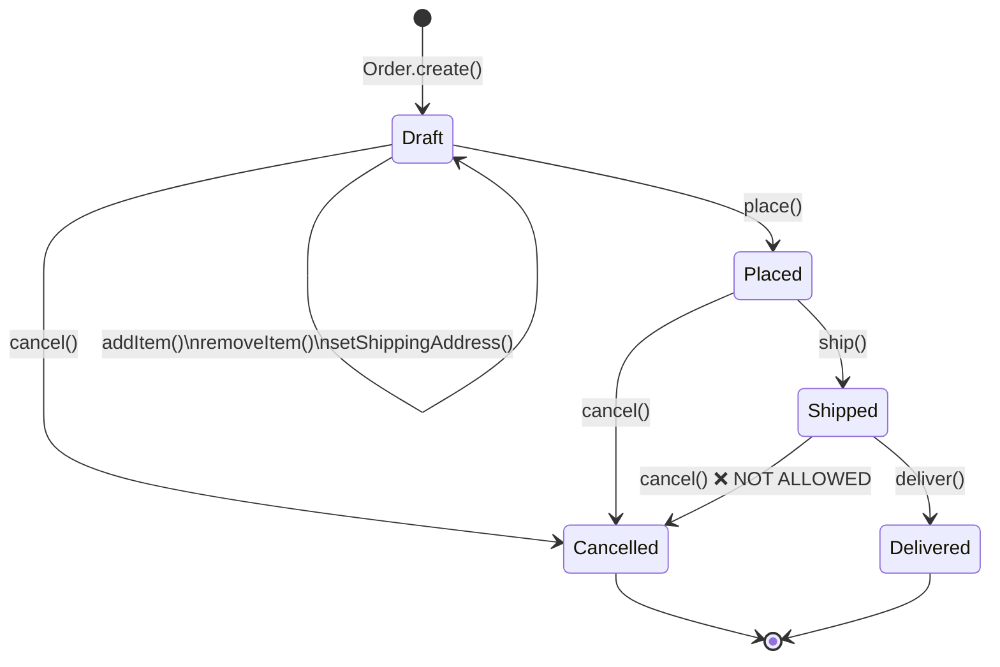

# DDD Tactical Design

Tactical design is the toolkit for implementing a domain model within a single bounded context. While strategic design answers "what are the parts of the system and how do they relate?", tactical design answers "how do we structure the code within one part?".

The tactical patterns are not arbitrary OOP conventions. Each one exists to solve a specific problem that arises when modelling complex domains. Understanding the problem each pattern solves is as important as understanding the pattern itself.

## 1. Why These Patterns Exist

Without tactical patterns, a domain model degrades into one of two anti-patterns.

**The Anemic Domain Model** (Martin Fowler's term): classes that look like domain objects (they have names like `Order`, `Customer`, `Product`) but contain no business logic. They are pure data containers — getters, setters, and maybe some field validation. All the actual business logic lives in service classes. The model exists in name only; the code is effectively a transaction script behind a thin object facade.

**The God Service**: a service class (often called `OrderService`, `BusinessLogicService`, or in extreme cases, `MainService`) that grows without bound as every piece of business logic gets added to it. It accumulates dependencies, becomes impossible to test in isolation, and must be modified for every new feature regardless of what the feature actually touches.

The tactical patterns distribute business logic into the right places — into the objects that own the data and are responsible for maintaining invariants.

## 2. Entities

### What an Entity Is

An entity is a domain object that has **identity** — a unique identifier that distinguishes it from all other entities of the same type, regardless of the values of its attributes.

Two entities with the same identifier are the same entity, even if every other attribute is different. This reflects the real world: a person is the same person even after they change their name, address, and phone number. The identity persists through time and through changes to the object's state.

This is what distinguishes entities from value objects: identity vs equality by value.

### Identity Strategies

How you assign identity to entities has significant implications.

**UUID (Universally Unique Identifier):** Generated by the application before insertion into the database. Decouples identity creation from persistence — the entity knows its ID from the moment of construction, before any database interaction.

```typescript
// UUID identity assigned at construction time
const orderId = OrderId.generate() // creates a UUID
const order = new Order(orderId, customerId, items)
// order.id is known before database insertion
```

Advantages: No database round-trip to get an ID. Entities can be created and referenced in memory without being persisted. Works naturally with event sourcing.

Disadvantages: UUIDs are not sequential, which can hurt database index performance (random inserts into a B-tree index). Use UUID v7 (timestamp-ordered) to mitigate this.

**Sequential database ID (auto-increment / serial):** Generated by the database on insert. The entity does not know its ID until after it is persisted.

Advantages: Compact, sequential, good for database index performance.

Disadvantages: Requires a database round-trip before the entity has an ID. Cannot create an entity that references another entity before both are persisted. Identity creation is coupled to persistence.

**Natural key:** An identifier from the real world — order number, tax registration number, ISBN, stock ticker symbol.

Use natural keys when: the domain genuinely has a natural identity, the identity is stable (doesn't change), and it is unique in your context.

Avoid when: the "natural" identity might not be unique across all contexts, or when the external system that provides the identity might have errors or duplicates.

### TypeScript Entity Base Class

```typescript
import { v7 as uuidv7 } from 'uuid'

// Branded type for type-safe IDs
type Brand<T, B> = T & { __brand: B }
type EntityId<T extends string> = Brand<string, T>

function createId<T extends string>(): EntityId<T> {
  return uuidv7() as EntityId<T>
}

abstract class Entity<TId extends string> {
  protected readonly _id: EntityId<TId>
  private readonly _createdAt: Date
  private _updatedAt: Date

  constructor(id: EntityId<TId>) {
    this._id = id
    this._createdAt = new Date()
    this._updatedAt = new Date()
  }

  get id(): EntityId<TId> {
    return this._id
  }

  get createdAt(): Date {
    return this._createdAt
  }

  get updatedAt(): Date {
    return this._updatedAt
  }

  // Equality is identity-based
  equals(other: Entity<TId>): boolean {
    if (other === null || other === undefined) return false
    if (!(other instanceof this.constructor)) return false
    return this._id === other._id
  }

  protected touch(): void {
    this._updatedAt = new Date()
  }
}

// Concrete usage
type OrderIdBrand = 'OrderId'
type OrderId = EntityId<OrderIdBrand>

class Order extends Entity<OrderIdBrand> {
  private _status: OrderStatus
  private _items: OrderLine[]
  private _customerId: CustomerId

  constructor(id: OrderId, customerId: CustomerId) {
    super(id)
    this._status = OrderStatus.Pending
    this._items = []
    this._customerId = customerId
  }

  static create(customerId: CustomerId): Order {
    const id = createId<OrderIdBrand>()
    return new Order(id, customerId)
  }
}
```

### Entity Invariants

Entities are responsible for maintaining their own invariants — conditions that must always be true about the entity's state. This is the core reason for rich domain models: the entity itself refuses to enter invalid state.

```typescript
class Order extends Entity<OrderIdBrand> {
  private _items: OrderLine[]
  private _status: OrderStatus

  addItem(product: ProductId, quantity: Quantity, unitPrice: Money): void {
    // Invariant: cannot add items to a placed or cancelled order
    if (this._status !== OrderStatus.Pending) {
      throw new DomainException(
        `Cannot add items to an order in status ${this._status}`
      )
    }

    // Invariant: quantity must be positive
    if (quantity.value <= 0) {
      throw new DomainException('Item quantity must be positive')
    }

    const existingLine = this._items.find(
      line => line.productId.equals(product)
    )

    if (existingLine) {
      existingLine.increaseQuantity(quantity)
    } else {
      this._items.push(new OrderLine(product, quantity, unitPrice))
    }

    this.touch()
  }
}
```

## 3. Value Objects

### What a Value Object Is

A value object is a domain object that has **no identity**. Two value objects are equal if and only if all their attributes are equal. They are defined entirely by their values.

Value objects are **immutable**. Once created, their state never changes. "Changing" a value object means creating a new one.

Consider money: `$10.00` and another `$10.00` are the same thing. There is no `$10.00` that has an identity separate from the other `$10.00`. If you add `$5.00` to `$10.00`, you don't modify the original — you get a new value: `$15.00`.

### Why Value Objects Matter: Primitive Obsession

**Primitive obsession** is the anti-pattern of using primitive types (string, number, boolean) to represent domain concepts. It leads to:

```typescript
// Primitive obsession - error-prone
function calculateShipping(
  weightKg: number,
  distanceKm: number,
  price: number,  // Is this in USD? EUR? Cents? Dollars?
): number {       // What unit is this return value?
  // ...
}

// Wrong call compiles fine:
calculateShipping(distanceKm, weightKg, price) // arguments swapped — no error
```

Value objects solve this by giving domain concepts their own types:

```typescript
// Rich value objects - safe
function calculateShipping(
  weight: Weight,
  distance: Distance,
  price: Money,
): Money {
  // Arguments can't be swapped — types prevent it
}
```

### TypeScript Value Object Base Class

```typescript
abstract class ValueObject<T extends Record<string, unknown>> {
  protected readonly props: Readonly<T>

  constructor(props: T) {
    this.props = Object.freeze({ ...props })
    this.validate()
  }

  // Override to validate invariants
  protected validate(): void {
    // Default: no validation
  }

  equals(other: ValueObject<T>): boolean {
    if (other === null || other === undefined) return false
    if (other.constructor !== this.constructor) return false
    return JSON.stringify(this.props) === JSON.stringify(other.props)
  }

  // Structural "copy with modification" — returns a new instance
  protected copyWith(props: Partial<T>): this {
    return new (this.constructor as new (props: T) => this)({
      ...this.props,
      ...props,
    })
  }
}
```

### Money Value Object

```typescript
type Currency = 'USD' | 'EUR' | 'GBP' | 'JPY'

interface MoneyProps {
  amount: number  // stored in minor units (cents)
  currency: Currency
}

class Money extends ValueObject<MoneyProps> {
  protected validate(): void {
    if (!Number.isInteger(this.props.amount)) {
      throw new DomainException('Money amount must be an integer (minor units)')
    }
    if (this.props.amount < 0) {
      throw new DomainException('Money amount cannot be negative')
    }
  }

  static of(amount: number, currency: Currency): Money {
    return new Money({ amount: Math.round(amount), currency })
  }

  static zero(currency: Currency): Money {
    return new Money({ amount: 0, currency })
  }

  get amount(): number { return this.props.amount }
  get currency(): Currency { return this.props.currency }

  // Returns a human-readable string like "$10.00"
  format(): string {
    const formatter = new Intl.NumberFormat('en-US', {
      style: 'currency',
      currency: this.props.currency,
    })
    const displayAmount = this.props.currency === 'JPY'
      ? this.props.amount
      : this.props.amount / 100
    return formatter.format(displayAmount)
  }

  add(other: Money): Money {
    this.assertSameCurrency(other)
    return new Money({
      amount: this.props.amount + other.props.amount,
      currency: this.props.currency,
    })
  }

  subtract(other: Money): Money {
    this.assertSameCurrency(other)
    const result = this.props.amount - other.props.amount
    if (result < 0) {
      throw new DomainException('Subtraction would result in negative money')
    }
    return new Money({ amount: result, currency: this.props.currency })
  }

  multiply(factor: number): Money {
    return new Money({
      amount: Math.round(this.props.amount * factor),
      currency: this.props.currency,
    })
  }

  isGreaterThan(other: Money): boolean {
    this.assertSameCurrency(other)
    return this.props.amount > other.props.amount
  }

  isZero(): boolean {
    return this.props.amount === 0
  }

  private assertSameCurrency(other: Money): void {
    if (this.props.currency !== other.props.currency) {
      throw new DomainException(
        `Currency mismatch: ${this.props.currency} vs ${other.props.currency}`
      )
    }
  }
}
```

### Email Value Object

```typescript
interface EmailProps {
  value: string
}

class Email extends ValueObject<EmailProps> {
  private static readonly PATTERN =
    /^[a-zA-Z0-9._%+\-]+@[a-zA-Z0-9.\-]+\.[a-zA-Z]{2,}$/

  protected validate(): void {
    if (!Email.PATTERN.test(this.props.value)) {
      throw new DomainException(`Invalid email address: ${this.props.value}`)
    }
  }

  static of(value: string): Email {
    return new Email({ value: value.toLowerCase().trim() })
  }

  get value(): string { return this.props.value }

  get domain(): string {
    return this.props.value.split('@')[1]
  }

  get localPart(): string {
    return this.props.value.split('@')[0]
  }
}
```

### DateRange Value Object

```typescript
interface DateRangeProps {
  start: Date
  end: Date
}

class DateRange extends ValueObject<DateRangeProps> {
  protected validate(): void {
    if (this.props.start >= this.props.end) {
      throw new DomainException('DateRange start must be before end')
    }
  }

  static of(start: Date, end: Date): DateRange {
    return new DateRange({ start, end })
  }

  get start(): Date { return new Date(this.props.start) }
  get end(): Date { return new Date(this.props.end) }

  get durationMs(): number {
    return this.props.end.getTime() - this.props.start.getTime()
  }

  get durationDays(): number {
    return this.durationMs / (1000 * 60 * 60 * 24)
  }

  contains(date: Date): boolean {
    return date >= this.props.start && date <= this.props.end
  }

  overlaps(other: DateRange): boolean {
    return this.props.start < other.props.end &&
           other.props.start < this.props.end
  }

  extendBy(days: number): DateRange {
    const newEnd = new Date(this.props.end)
    newEnd.setDate(newEnd.getDate() + days)
    return DateRange.of(this.props.start, newEnd)
  }
}
```

## 4. Aggregates

### What an Aggregate Is

An aggregate is a **cluster of related entities and value objects that are treated as a unit for data changes**. The aggregate defines a consistency boundary: all changes to the objects within the aggregate must satisfy the aggregate's invariants, and those changes are applied atomically.

Every aggregate has one entity designated as the **aggregate root** — the only object within the aggregate that external code can hold a reference to. All access to the aggregate goes through the root.

### The Rules of Aggregates

**Rule 1: Only aggregate roots can be referenced from outside the aggregate.**

External code never holds a direct reference to a non-root entity within an aggregate. If it needs to access an internal entity, it goes through the root. This ensures that all state changes flow through the root, which can enforce invariants.

**Rule 2: Aggregates reference other aggregates by identity only.**

One aggregate does not hold a reference to another aggregate's root object. It holds only the other aggregate's ID. This prevents aggregate boundaries from becoming entangled — if `Order` held a reference to `Customer`, a change to `Customer` might require `Order` to be updated.

**Rule 3: One transaction, one aggregate (usually).**

A database transaction should modify at most one aggregate. This is the key to scalability: aggregates can be stored, loaded, and modified independently. If a business operation requires modifying two aggregates, it should be modelled as two separate transactions triggered by a domain event — one aggregate changes, raises an event, and a handler reacts by changing the other aggregate.

This rule has exceptions, but violating it should be deliberate and explicitly justified.

**Rule 4: Aggregates should be small.**

A common mistake is creating large aggregates. Large aggregates create contention — only one transaction can modify an aggregate at a time, so a large aggregate with many sub-entities becomes a bottleneck. They also accumulate invariants that belong to different bounded contexts.

Design aggregates around their invariants. Ask: "What invariants must always hold across these objects?" The objects that share an invariant belong together; the rest should be in separate aggregates.

### Order Aggregate Example

```typescript
class Order extends Entity<OrderIdBrand> {
  private _customerId: CustomerId
  private _status: OrderStatus
  private _lines: OrderLine[]
  private _shippingAddress: Address | null
  private _domainEvents: DomainEvent[]

  // Private constructor — use factory method
  private constructor(
    id: OrderId,
    customerId: CustomerId,
  ) {
    super(id)
    this._customerId = customerId
    this._status = OrderStatus.Draft
    this._lines = []
    this._shippingAddress = null
    this._domainEvents = []
  }

  // Factory method — encapsulates creation logic
  static create(customerId: CustomerId): Order {
    const id = createId<OrderIdBrand>()
    const order = new Order(id, customerId)
    order.raise(new OrderDraftCreated(id, customerId))
    return order
  }

  // Business operation with invariant enforcement
  addItem(
    productId: ProductId,
    productName: string,
    quantity: Quantity,
    unitPrice: Money,
  ): void {
    this.guardAgainstModificationOfNonDraftOrder()

    // Invariant: max 50 line items
    if (this._lines.length >= 50) {
      throw new DomainException('Order cannot have more than 50 line items')
    }

    const existingLine = this._lines.find(l => l.productId.equals(productId))

    if (existingLine) {
      existingLine.increaseQuantity(quantity)
    } else {
      this._lines.push(
        OrderLine.create(productId, productName, quantity, unitPrice)
      )
    }

    this.touch()
  }

  removeItem(productId: ProductId): void {
    this.guardAgainstModificationOfNonDraftOrder()

    const index = this._lines.findIndex(l => l.productId.equals(productId))
    if (index === -1) {
      throw new DomainException(`Product ${productId.value} not found in order`)
    }

    this._lines.splice(index, 1)
    this.touch()
  }

  setShippingAddress(address: Address): void {
    this.guardAgainstModificationOfNonDraftOrder()
    this._shippingAddress = address
    this.touch()
  }

  place(): void {
    // Invariant: must be in Draft status
    if (this._status !== OrderStatus.Draft) {
      throw new DomainException('Only draft orders can be placed')
    }

    // Invariant: must have at least one item
    if (this._lines.length === 0) {
      throw new DomainException('Cannot place an empty order')
    }

    // Invariant: must have a shipping address
    if (!this._shippingAddress) {
      throw new DomainException('Order must have a shipping address before placement')
    }

    this._status = OrderStatus.Placed
    this.touch()
    this.raise(new OrderPlaced(this._id, this._customerId, this._lines, this.total))
  }

  cancel(reason: string): void {
    if (this._status === OrderStatus.Shipped) {
      throw new DomainException('Cannot cancel a shipped order')
    }
    if (this._status === OrderStatus.Cancelled) {
      throw new DomainException('Order is already cancelled')
    }

    this._status = OrderStatus.Cancelled
    this.touch()
    this.raise(new OrderCancelled(this._id, reason))
  }

  // Computed value — encapsulated in aggregate
  get total(): Money {
    if (this._lines.length === 0) return Money.zero('USD')
    return this._lines.reduce(
      (sum, line) => sum.add(line.lineTotal),
      Money.zero(this._lines[0].unitPrice.currency)
    )
  }

  get status(): OrderStatus { return this._status }
  get customerId(): CustomerId { return this._customerId }
  get lines(): ReadonlyArray<OrderLine> { return [...this._lines] }

  // Domain event infrastructure
  get domainEvents(): ReadonlyArray<DomainEvent> {
    return [...this._domainEvents]
  }

  clearDomainEvents(): void {
    this._domainEvents = []
  }

  private raise(event: DomainEvent): void {
    this._domainEvents.push(event)
  }

  private guardAgainstModificationOfNonDraftOrder(): void {
    if (this._status !== OrderStatus.Draft) {
      throw new DomainException(
        `Cannot modify order in status ${this._status}`
      )
    }
  }
}
```

### OrderLine: A Non-Root Entity Within the Aggregate

```typescript
type OrderLineIdBrand = 'OrderLineId'
type OrderLineId = EntityId<OrderLineIdBrand>

class OrderLine extends Entity<OrderLineIdBrand> {
  private _productId: ProductId
  private _productName: string
  private _quantity: Quantity
  private _unitPrice: Money

  private constructor(
    id: OrderLineId,
    productId: ProductId,
    productName: string,
    quantity: Quantity,
    unitPrice: Money,
  ) {
    super(id)
    this._productId = productId
    this._productName = productName
    this._quantity = quantity
    this._unitPrice = unitPrice
  }

  static create(
    productId: ProductId,
    productName: string,
    quantity: Quantity,
    unitPrice: Money,
  ): OrderLine {
    return new OrderLine(
      createId<OrderLineIdBrand>(),
      productId,
      productName,
      quantity,
      unitPrice,
    )
  }

  // Only accessible within the aggregate (Order calls this)
  increaseQuantity(additional: Quantity): void {
    this._quantity = this._quantity.add(additional)
  }

  get productId(): ProductId { return this._productId }
  get productName(): string { return this._productName }
  get quantity(): Quantity { return this._quantity }
  get unitPrice(): Money { return this._unitPrice }

  get lineTotal(): Money {
    return this._unitPrice.multiply(this._quantity.value)
  }
}
```

## 5. Domain Services

### What a Domain Service Is

A domain service encapsulates business logic that doesn't naturally belong to any single entity or value object. It operates on domain objects (entities, value objects, aggregates) and is named after a domain concept — a process, a calculation, a rule.

Domain services are **stateless**. They don't hold state between calls. They receive domain objects as arguments and return domain objects or results.

### Identifying Domain Services

Ask: "Who is responsible for this operation?" If you cannot answer with a single entity or value object, it's likely a domain service.

Classic cases:
- An operation that involves multiple aggregates
- A calculation that requires external information (pricing from a price list, tax rates from a tax service)
- A business rule that applies across multiple objects
- A process that coordinates a multi-step workflow

### Example: DiscountCalculator Domain Service

```typescript
interface DiscountPolicy {
  calculateDiscount(order: Order, customer: CustomerProfile): Money
}

class DiscountCalculator implements DiscountPolicy {
  // Business rule: discount depends on both order value and customer tier
  // This logic doesn't belong to Order (it doesn't know about CustomerProfile)
  // Nor to CustomerProfile (it doesn't know about Order structure)
  // It's a domain service that operates on both
  calculateDiscount(order: Order, customer: CustomerProfile): Money {
    const baseDiscount = this.calculateVolumeDiscount(order.total)
    const loyaltyBonus = this.calculateLoyaltyBonus(customer.tier, order.total)
    const seasonalDiscount = this.calculateSeasonalDiscount(order.total)

    // Apply discounts additively, but never exceed 30%
    const totalDiscountRate = Math.min(
      baseDiscount + loyaltyBonus + seasonalDiscount,
      0.30
    )

    return order.total.multiply(totalDiscountRate)
  }

  private calculateVolumeDiscount(orderTotal: Money): number {
    if (orderTotal.amount >= 100_000) return 0.10 // $1000+
    if (orderTotal.amount >= 50_000) return 0.05  // $500+
    if (orderTotal.amount >= 25_000) return 0.02  // $250+
    return 0
  }

  private calculateLoyaltyBonus(tier: CustomerTier, orderTotal: Money): number {
    const bonusByTier: Record<CustomerTier, number> = {
      [CustomerTier.Bronze]: 0,
      [CustomerTier.Silver]: 0.02,
      [CustomerTier.Gold]: 0.05,
      [CustomerTier.Platinum]: 0.10,
    }
    return bonusByTier[tier]
  }

  private calculateSeasonalDiscount(orderTotal: Money): number {
    const now = new Date()
    const month = now.getMonth() + 1
    // Holiday season discount (November, December)
    if (month === 11 || month === 12) return 0.03
    return 0
  }
}
```

### ShippingCostCalculator Domain Service

```typescript
interface ShippingRate {
  baseRate: Money
  perKgRate: Money
  maxDays: number
}

class ShippingCostCalculator {
  private readonly rates: Record<ShippingMethod, ShippingRate>

  constructor(rates: Record<ShippingMethod, ShippingRate>) {
    this.rates = rates
  }

  calculate(
    items: ReadonlyArray<OrderLine>,
    destination: Address,
    method: ShippingMethod,
  ): Money {
    const totalWeight = this.calculateTotalWeight(items)
    const rate = this.rates[method]

    const weightCost = rate.perKgRate.multiply(totalWeight)
    const baseCost = rate.baseRate
    const distanceSurcharge = this.calculateDistanceSurcharge(destination, rate)

    return baseCost.add(weightCost).add(distanceSurcharge)
  }

  private calculateTotalWeight(items: ReadonlyArray<OrderLine>): number {
    // In a real implementation, product weight would come from a ProductWeight value object
    return items.reduce((sum, item) => sum + item.quantity.value * 0.5, 0)
  }

  private calculateDistanceSurcharge(
    destination: Address,
    rate: ShippingRate,
  ): Money {
    // Remote areas get a surcharge
    const remotePostcodes = ['9999', '9998'] // example
    if (remotePostcodes.includes(destination.postcode)) {
      return rate.baseRate.multiply(0.5)
    }
    return Money.zero('USD')
  }
}
```

## 6. Repositories

### What a Repository Is

A repository provides a **collection-like interface** for accessing and storing aggregates. From the domain's perspective, a repository is like a collection in memory — you can add aggregates to it, remove them, find them by various criteria, and get them by ID. The fact that the collection is backed by a database is an implementation detail.

### Repository Interface: Domain Layer

The repository interface is defined in the domain layer, alongside the aggregate it manages. The interface uses domain concepts — it receives and returns domain objects.

```typescript
// In the domain layer — no database-specific code
interface OrderRepository {
  findById(id: OrderId): Promise<Order | null>
  findByCustomerId(customerId: CustomerId): Promise<Order[]>
  findPlacedBetween(start: Date, end: Date): Promise<Order[]>
  save(order: Order): Promise<void>
  remove(order: Order): Promise<void>
  nextId(): OrderId  // Generates next available ID
}
```

### Repository Implementation: Infrastructure Layer

The implementation lives in the infrastructure layer and depends on a specific database client.

```typescript
// In the infrastructure layer — database-specific
class PostgresOrderRepository implements OrderRepository {
  constructor(private readonly db: Pool) {}

  async findById(id: OrderId): Promise<Order | null> {
    const result = await this.db.query(
      `SELECT o.*, json_agg(ol.*) as lines
       FROM orders o
       LEFT JOIN order_lines ol ON ol.order_id = o.id
       WHERE o.id = $1
       GROUP BY o.id`,
      [id]
    )

    if (result.rows.length === 0) return null
    return this.toDomain(result.rows[0])
  }

  async save(order: Order): Promise<void> {
    const client = await this.db.connect()
    try {
      await client.query('BEGIN')

      await client.query(
        `INSERT INTO orders (id, customer_id, status, shipping_address, created_at, updated_at)
         VALUES ($1, $2, $3, $4, $5, $6)
         ON CONFLICT (id) DO UPDATE SET
           status = EXCLUDED.status,
           shipping_address = EXCLUDED.shipping_address,
           updated_at = EXCLUDED.updated_at`,
        [
          order.id,
          order.customerId.value,
          order.status,
          order.shippingAddress ? JSON.stringify(order.shippingAddress) : null,
          order.createdAt,
          order.updatedAt,
        ]
      )

      // Upsert all lines
      for (const line of order.lines) {
        await client.query(
          `INSERT INTO order_lines (id, order_id, product_id, product_name, quantity, unit_price_amount, unit_price_currency)
           VALUES ($1, $2, $3, $4, $5, $6, $7)
           ON CONFLICT (id) DO UPDATE SET
             quantity = EXCLUDED.quantity`,
          [
            line.id,
            order.id,
            line.productId.value,
            line.productName,
            line.quantity.value,
            line.unitPrice.amount,
            line.unitPrice.currency,
          ]
        )
      }

      await client.query('COMMIT')
    } catch (error) {
      await client.query('ROLLBACK')
      throw error
    } finally {
      client.release()
    }
  }

  async findByCustomerId(customerId: CustomerId): Promise<Order[]> {
    const result = await this.db.query(
      `SELECT o.*, json_agg(ol.*) as lines
       FROM orders o
       LEFT JOIN order_lines ol ON ol.order_id = o.id
       WHERE o.customer_id = $1
       GROUP BY o.id
       ORDER BY o.created_at DESC`,
      [customerId.value]
    )
    return result.rows.map(row => this.toDomain(row))
  }

  async findPlacedBetween(start: Date, end: Date): Promise<Order[]> {
    const result = await this.db.query(
      `SELECT o.*, json_agg(ol.*) as lines
       FROM orders o
       LEFT JOIN order_lines ol ON ol.order_id = o.id
       WHERE o.status = 'placed' AND o.updated_at BETWEEN $1 AND $2
       GROUP BY o.id`,
      [start, end]
    )
    return result.rows.map(row => this.toDomain(row))
  }

  async remove(order: Order): Promise<void> {
    await this.db.query('DELETE FROM orders WHERE id = $1', [order.id])
  }

  nextId(): OrderId {
    return createId<OrderIdBrand>()
  }

  // Reconstruct domain object from persistence record
  private toDomain(row: any): Order {
    return Order.reconstitute({
      id: row.id as OrderId,
      customerId: CustomerId.of(row.customer_id),
      status: row.status as OrderStatus,
      shippingAddress: row.shipping_address
        ? Address.fromJSON(row.shipping_address)
        : null,
      lines: (row.lines || [])
        .filter((l: any) => l !== null)
        .map((l: any) => OrderLine.reconstitute({
          id: l.id as OrderLineId,
          productId: ProductId.of(l.product_id),
          productName: l.product_name,
          quantity: Quantity.of(l.quantity),
          unitPrice: Money.of(l.unit_price_amount, l.unit_price_currency),
        })),
      createdAt: row.created_at,
      updatedAt: row.updated_at,
    })
  }
}
```

## 7. Factories

A factory encapsulates the complex logic of creating a domain object. When construction of an aggregate requires significant logic or external information, that logic lives in a factory rather than in the aggregate constructor or in application code.

```typescript
class OrderFactory {
  constructor(
    private readonly customerRepository: CustomerRepository,
    private readonly productCatalog: ProductCatalog,
  ) {}

  async createFromCart(
    customerId: CustomerId,
    cartItems: CartItem[],
  ): Promise<Order> {
    // Validate customer exists
    const customer = await this.customerRepository.findById(customerId)
    if (!customer) {
      throw new DomainException(`Customer ${customerId.value} not found`)
    }

    // Resolve current prices from catalog
    const order = Order.create(customerId)

    for (const cartItem of cartItems) {
      const product = await this.productCatalog.findById(cartItem.productId)
      if (!product) {
        throw new DomainException(`Product ${cartItem.productId.value} not found`)
      }
      if (!product.isAvailable()) {
        throw new DomainException(`Product ${product.name} is not available`)
      }

      order.addItem(
        product.id,
        product.name,
        Quantity.of(cartItem.quantity),
        product.currentPrice,
      )
    }

    return order
  }
}
```

## 8. Bringing It Together: Aggregate Lifecycle



## 9. Performance Characteristics

### Aggregate Loading Cost

Loading an aggregate requires loading all its entities and value objects. An `Order` with 50 line items requires loading 51 rows (1 order + 50 lines). This is predictable and bounded by the aggregate's design.

If aggregates grow large (hundreds of items), loading cost becomes significant. Solutions:
- Load the aggregate root first, load children lazily when needed
- Use pagination within the aggregate (for display purposes — not for invariant enforcement)
- Question whether the aggregate boundary is correct (perhaps some entities should be separate aggregates)

### Concurrency and Optimistic Locking

Since only one transaction can modify an aggregate at a time, concurrent modifications must be handled. Optimistic locking is the standard approach:

```typescript
// Add a version field to the aggregate
class Order extends Entity<OrderIdBrand> {
  private _version: number = 0

  get version(): number { return this._version }

  incrementVersion(): void {
    this._version++
  }
}

// In the repository, include version in the WHERE clause
await client.query(
  `UPDATE orders SET status = $1, version = version + 1, updated_at = $2
   WHERE id = $3 AND version = $4`,
  [order.status, new Date(), order.id, order.version]
)

// If rowCount === 0, another transaction modified the aggregate first
if (result.rowCount === 0) {
  throw new ConcurrencyException(
    `Order ${order.id} was modified by another transaction`
  )
}
```

## 10. Formal Model

The aggregate consistency boundary can be expressed formally.

Let $A$ be an aggregate with root entity $R$ and member entities $\{E_1, ..., E_n\}$. Let $I(A)$ be the set of invariants that must hold across all members of $A$.

For any operation $op$ on $A$:
$$\forall i \in I(A): i \text{ holds before } op \implies i \text{ holds after } op$$

The aggregate root $R$ is the only entry point for all operations. For any external entity $B \notin A$:
$$B \text{ references } E_k \in A \implies B \text{ references } R_{\text{id}} \text{ only}$$

The transaction boundary corresponds exactly to the aggregate boundary:
$$\text{Transaction}(op) = \text{exactly one aggregate } A$$

When multiple aggregates must be consistent, the consistency is **eventual**, mediated by domain events:
$$A_1.op_1() \to \text{raise event } e \to A_2.op_2(\text{in reaction to } e)$$

---

::: tip Next
Understand [Domain Events](./domain-events.md) — how aggregates communicate with the rest of the system about significant occurrences, without coupling to other aggregates or services.
:::
