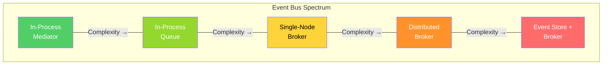
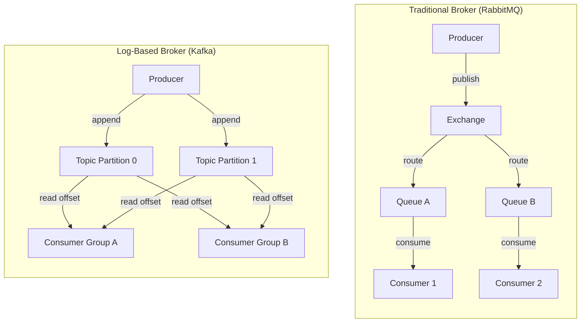
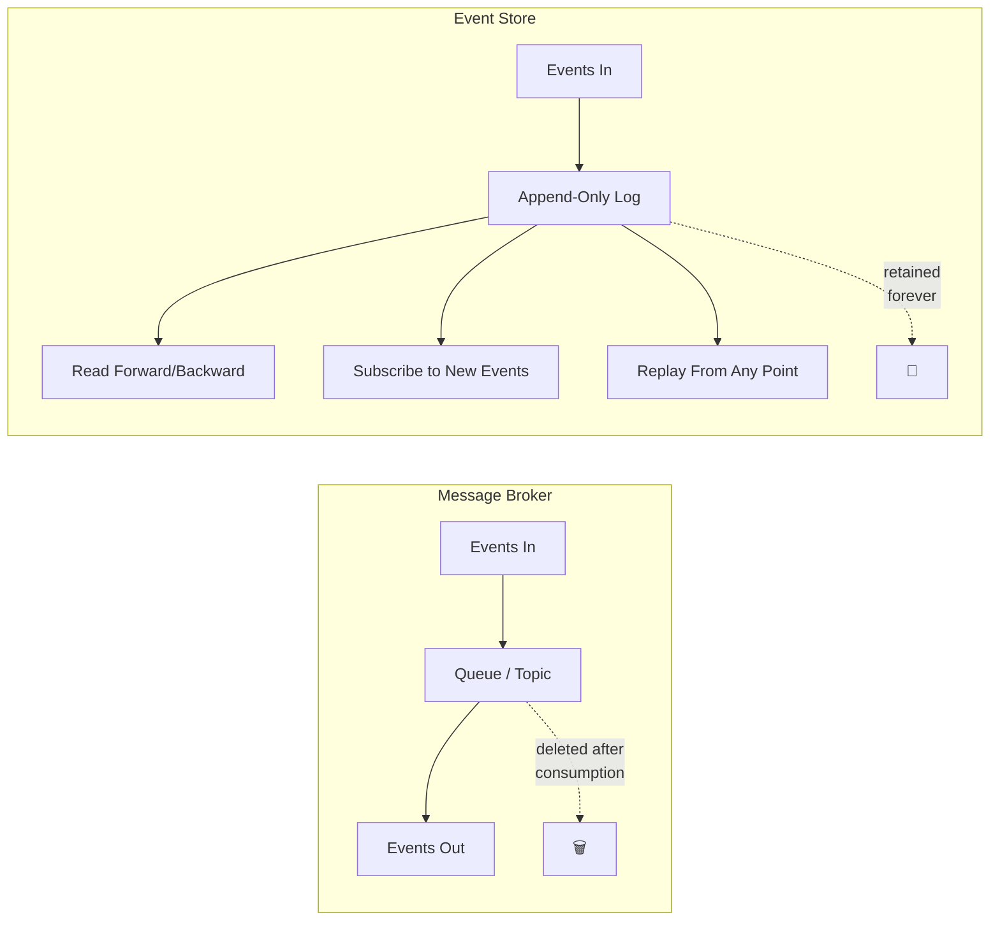
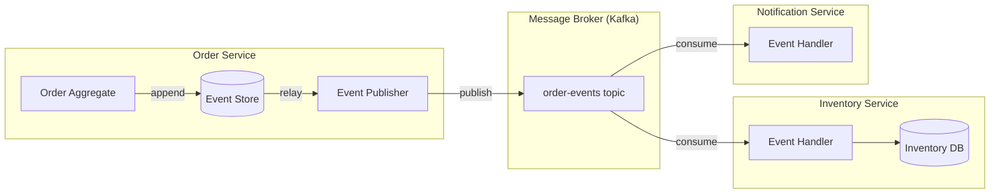
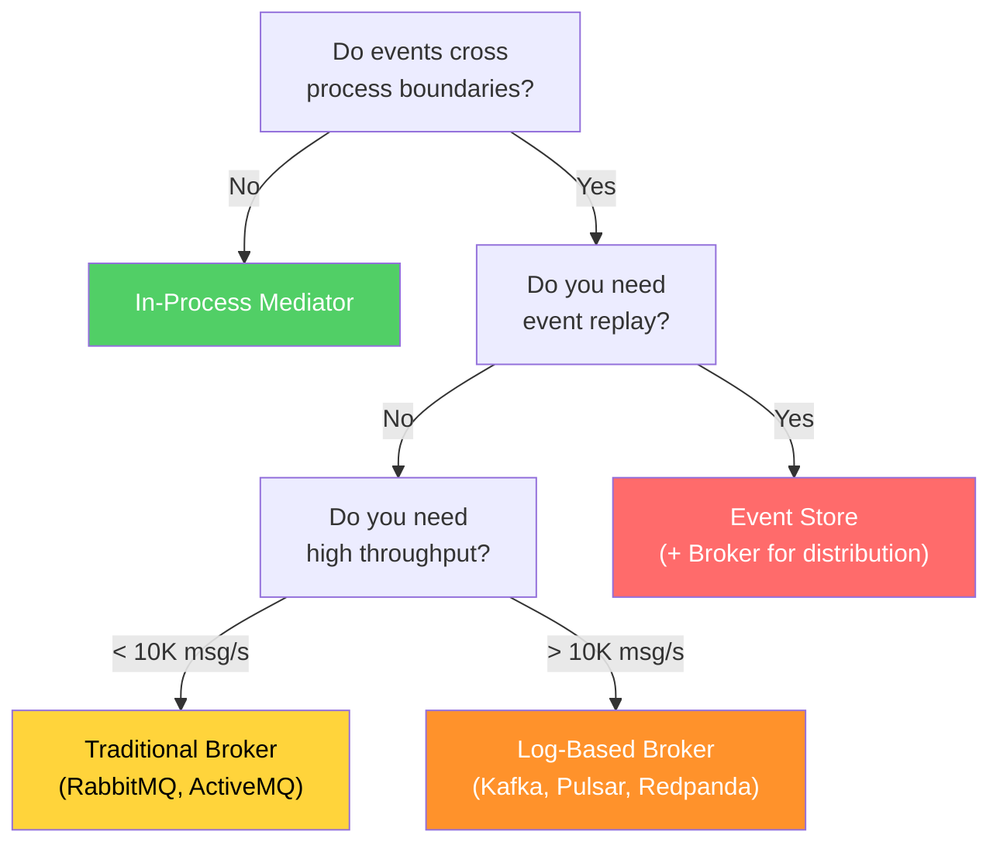
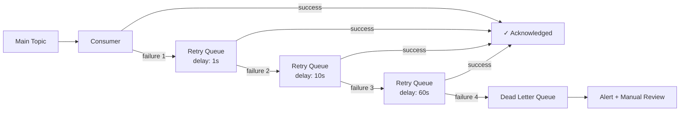

# Event Bus Patterns

An event bus is the backbone of any event-driven system. It is the infrastructure responsible for getting events from producers to consumers — reliably, at scale, and without coupling them together. The term "event bus" is deceptively simple because it hides a spectrum of implementations with radically different trade-offs: an in-process mediator that routes events between objects in the same application, a message broker that routes events between distributed services, and an event store that persists every event ever produced for replay and auditing.

Choosing the wrong bus architecture is one of the most expensive mistakes in event-driven systems. Use an in-process mediator when you need a distributed broker and you get zero durability, zero scaling, and zero decoupling. Use a distributed broker when you need an in-process mediator and you get unnecessary operational complexity, network latency, and infrastructure cost.

## First Principles: What Does an Event Bus Do?

At its core, an event bus performs three functions:

1. **Routing** — getting events from producers to the right consumers
2. **Decoupling** — ensuring producers and consumers do not need to know about each other
3. **Buffering** — absorbing differences in production and consumption rates

The differences between bus implementations come down to where these functions happen (in-process vs distributed), how durable the buffering is (memory vs disk vs replicated log), and what delivery guarantees are provided (at-most-once, at-least-once, exactly-once).



## Pattern 1: In-Process Mediator

The simplest event bus. Events are dispatched synchronously (or asynchronously via microtasks) within a single process. No network, no serialization, no broker.

### When to Use

- Decoupling modules within a monolith or a single microservice
- Separating domain logic from side effects (sending emails, updating caches)
- Implementing the domain events pattern from DDD
- You want testability without external infrastructure

### When NOT to Use

- Events must cross process boundaries
- You need durability (events survive crashes)
- You need to scale consumers independently

### TypeScript Implementation

```typescript
// event-bus/InProcessEventBus.ts

type EventHandler<T = unknown> = (event: T) => Promise<void>;

interface EventSubscription {
  unsubscribe(): void;
}

class InProcessEventBus {
  private handlers: Map<string, Set<EventHandler>> = new Map();

  /**
   * Subscribe to an event type.
   * Returns a subscription object for cleanup.
   */
  subscribe<T>(eventType: string, handler: EventHandler<T>): EventSubscription {
    if (!this.handlers.has(eventType)) {
      this.handlers.set(eventType, new Set());
    }

    const handlerSet = this.handlers.get(eventType)!;
    handlerSet.add(handler as EventHandler);

    return {
      unsubscribe: () => {
        handlerSet.delete(handler as EventHandler);
        if (handlerSet.size === 0) {
          this.handlers.delete(eventType);
        }
      },
    };
  }

  /**
   * Publish an event to all registered handlers.
   * Handlers execute concurrently. Errors are collected, not thrown.
   */
  async publish<T>(eventType: string, event: T): Promise<PublishResult> {
    const handlerSet = this.handlers.get(eventType);
    if (!handlerSet || handlerSet.size === 0) {
      return { delivered: 0, errors: [] };
    }

    const errors: Array<{ handler: string; error: Error }> = [];
    const promises = Array.from(handlerSet).map(async (handler) => {
      try {
        await handler(event);
      } catch (err) {
        errors.push({
          handler: handler.name || 'anonymous',
          error: err instanceof Error ? err : new Error(String(err)),
        });
      }
    });

    await Promise.allSettled(promises);

    return {
      delivered: handlerSet.size - errors.length,
      errors,
    };
  }

  /**
   * Publish and wait for all handlers to complete.
   * Unlike publish(), this throws if ANY handler fails.
   */
  async publishAndWait<T>(eventType: string, event: T): Promise<void> {
    const handlerSet = this.handlers.get(eventType);
    if (!handlerSet || handlerSet.size === 0) return;

    await Promise.all(
      Array.from(handlerSet).map((handler) => handler(event)),
    );
  }

  /**
   * Remove all handlers. Useful in tests.
   */
  clear(): void {
    this.handlers.clear();
  }
}

interface PublishResult {
  delivered: number;
  errors: Array<{ handler: string; error: Error }>;
}
```

### Using the In-Process Mediator

```typescript
// application/PlaceOrderUseCase.ts

class PlaceOrderUseCase {
  constructor(
    private readonly orderRepo: OrderRepository,
    private readonly eventBus: InProcessEventBus,
  ) {}

  async execute(command: PlaceOrderCommand): Promise<string> {
    // 1. Domain logic
    const order = Order.create({
      customerId: command.customerId,
      items: command.items,
    });

    // 2. Persist
    await this.orderRepo.save(order);

    // 3. Publish domain events (in-process)
    for (const event of order.domainEvents) {
      await this.eventBus.publish(event.eventType, event);
    }
    order.clearDomainEvents();

    return order.id;
  }
}

// Handlers register themselves — no coupling to the use case
class SendOrderConfirmationHandler {
  constructor(
    private readonly emailService: EmailService,
    private readonly eventBus: InProcessEventBus,
  ) {
    this.eventBus.subscribe('OrderPlaced', this.handle.bind(this));
  }

  async handle(event: OrderPlacedEvent): Promise<void> {
    await this.emailService.sendOrderConfirmation(
      event.data.customerId,
      event.data.orderId,
      event.data.totalAmount,
    );
  }
}

class UpdateInventoryHandler {
  constructor(
    private readonly inventoryService: InventoryService,
    private readonly eventBus: InProcessEventBus,
  ) {
    this.eventBus.subscribe('OrderPlaced', this.handle.bind(this));
  }

  async handle(event: OrderPlacedEvent): Promise<void> {
    for (const item of event.data.items) {
      await this.inventoryService.reserve(item.productId, item.quantity);
    }
  }
}
```

### The Mediator Pattern Variant

A more structured version where the mediator knows about handler types at compile time:

```typescript
// event-bus/TypedMediator.ts

// Define event map at the type level
interface DomainEventMap {
  'OrderPlaced': OrderPlacedEvent;
  'OrderConfirmed': OrderConfirmedEvent;
  'OrderCancelled': OrderCancelledEvent;
  'PaymentReceived': PaymentReceivedEvent;
  'InventoryReserved': InventoryReservedEvent;
}

class TypedMediator {
  private handlers = new Map<string, Set<EventHandler>>();

  on<K extends keyof DomainEventMap>(
    eventType: K,
    handler: (event: DomainEventMap[K]) => Promise<void>,
  ): EventSubscription {
    if (!this.handlers.has(eventType as string)) {
      this.handlers.set(eventType as string, new Set());
    }
    const set = this.handlers.get(eventType as string)!;
    set.add(handler as EventHandler);

    return {
      unsubscribe: () => {
        set.delete(handler as EventHandler);
      },
    };
  }

  async emit<K extends keyof DomainEventMap>(
    eventType: K,
    event: DomainEventMap[K],
  ): Promise<void> {
    const set = this.handlers.get(eventType as string);
    if (!set) return;

    await Promise.allSettled(
      Array.from(set).map((handler) => handler(event)),
    );
  }
}

// Usage — fully type-safe
const mediator = new TypedMediator();

mediator.on('OrderPlaced', async (event) => {
  // event is typed as OrderPlacedEvent
  console.log(event.data.orderId); // ✓ autocomplete works
});

// mediator.on('OrderPlaced', async (event: PaymentReceivedEvent) => {});
// ↑ Compile error: PaymentReceivedEvent is not assignable to OrderPlacedEvent
```

## Pattern 2: Message Broker (Distributed Event Bus)

When events need to cross process boundaries — between microservices, between containers, between data centers — you need a message broker.

### The Two Broker Models



| Aspect | Traditional Broker (RabbitMQ) | Log-Based Broker (Kafka) |
|---|---|---|
| **Model** | Messages are pushed to consumers and removed from the queue after acknowledgment | Messages are appended to an immutable log; consumers track their own offset |
| **Delivery** | At-most-once or at-least-once | At-least-once (effectively exactly-once with idempotent consumers) |
| **Ordering** | Per-queue FIFO | Per-partition ordering |
| **Replay** | Not possible (messages are deleted after consumption) | Possible (consumers can reset their offset to any point) |
| **Retention** | Until consumed | Time-based or size-based (days, weeks, forever) |
| **Throughput** | Tens of thousands of messages/second | Millions of messages/second |
| **Use case** | Task queues, request/reply, RPC | Event streaming, event sourcing, log aggregation |

### RabbitMQ-Style Broker Implementation

```typescript
// infrastructure/RabbitMQEventBus.ts

import amqp, { Channel, Connection, ConsumeMessage } from 'amqplib';

interface BrokerConfig {
  url: string;
  exchange: string;
  exchangeType: 'topic' | 'fanout' | 'direct';
  prefetchCount: number;
}

class RabbitMQEventBus {
  private connection: Connection | null = null;
  private channel: Channel | null = null;

  constructor(private readonly config: BrokerConfig) {}

  async connect(): Promise<void> {
    this.connection = await amqp.connect(this.config.url);
    this.channel = await this.connection.createChannel();

    // Declare the exchange
    await this.channel.assertExchange(
      this.config.exchange,
      this.config.exchangeType,
      { durable: true },
    );

    // Prefetch limits how many unacknowledged messages a consumer gets
    await this.channel.prefetch(this.config.prefetchCount);
  }

  /**
   * Publish an event to the exchange with a routing key.
   * The routing key determines which queues receive the message.
   */
  async publish<T>(eventType: string, event: T): Promise<void> {
    if (!this.channel) throw new Error('Not connected');

    const message = JSON.stringify({
      eventId: generateUUID(),
      eventType,
      timestamp: new Date().toISOString(),
      data: event,
    });

    this.channel.publish(
      this.config.exchange,
      eventType, // routing key
      Buffer.from(message),
      {
        persistent: true,        // Survive broker restarts
        contentType: 'application/json',
        messageId: generateUUID(),
        timestamp: Date.now(),
      },
    );
  }

  /**
   * Subscribe to events matching a routing pattern.
   * Each service gets its own queue, bound to the exchange.
   */
  async subscribe(
    queueName: string,
    routingPattern: string,
    handler: (event: unknown) => Promise<void>,
  ): Promise<void> {
    if (!this.channel) throw new Error('Not connected');

    // Declare queue (durable = survives broker restart)
    await this.channel.assertQueue(queueName, {
      durable: true,
      deadLetterExchange: `${this.config.exchange}.dlx`,
    });

    // Bind queue to exchange with routing pattern
    await this.channel.bindQueue(
      queueName,
      this.config.exchange,
      routingPattern,
    );

    // Consume messages
    await this.channel.consume(queueName, async (msg: ConsumeMessage | null) => {
      if (!msg) return;

      try {
        const event = JSON.parse(msg.content.toString());
        await handler(event);

        // Acknowledge — message is removed from queue
        this.channel!.ack(msg);
      } catch (error) {
        // Negative acknowledge — message goes to dead letter queue
        // requeue: false prevents infinite retry loops
        this.channel!.nack(msg, false, false);

        console.error('Event processing failed:', {
          queue: queueName,
          messageId: msg.properties.messageId,
          error: error instanceof Error ? error.message : String(error),
        });
      }
    });
  }

  async disconnect(): Promise<void> {
    await this.channel?.close();
    await this.connection?.close();
  }
}
```

### Kafka-Style Broker Implementation

```typescript
// infrastructure/KafkaEventBus.ts

import { Kafka, Producer, Consumer, EachMessagePayload } from 'kafkajs';

interface KafkaConfig {
  brokers: string[];
  clientId: string;
  groupId: string;
}

class KafkaEventBus {
  private kafka: Kafka;
  private producer: Producer;
  private consumer: Consumer;

  constructor(private readonly config: KafkaConfig) {
    this.kafka = new Kafka({
      clientId: config.clientId,
      brokers: config.brokers,
    });
    this.producer = this.kafka.producer({
      idempotent: true, // Exactly-once production
    });
    this.consumer = this.kafka.consumer({
      groupId: config.groupId,
    });
  }

  async connect(): Promise<void> {
    await this.producer.connect();
    await this.consumer.connect();
  }

  /**
   * Publish an event to a Kafka topic.
   * The key determines the partition (events with the same key
   * go to the same partition, preserving ordering).
   */
  async publish<T>(
    topic: string,
    key: string,
    event: T,
  ): Promise<void> {
    const envelope = {
      eventId: generateUUID(),
      eventType: topic,
      timestamp: new Date().toISOString(),
      data: event,
    };

    await this.producer.send({
      topic,
      messages: [
        {
          key,   // Partition key — e.g., orderId
          value: JSON.stringify(envelope),
          headers: {
            'event-type': topic,
            'event-id': envelope.eventId,
            'correlation-id': getCorrelationId(),
          },
        },
      ],
    });
  }

  /**
   * Subscribe to one or more topics.
   * Kafka consumer groups ensure each message is processed
   * by exactly one consumer in the group.
   */
  async subscribe(
    topics: string[],
    handler: (event: unknown, metadata: EventMetadata) => Promise<void>,
  ): Promise<void> {
    for (const topic of topics) {
      await this.consumer.subscribe({ topic, fromBeginning: false });
    }

    await this.consumer.run({
      eachMessage: async ({ topic, partition, message }: EachMessagePayload) => {
        if (!message.value) return;

        const event = JSON.parse(message.value.toString());
        const metadata: EventMetadata = {
          topic,
          partition,
          offset: message.offset,
          key: message.key?.toString() ?? '',
          timestamp: message.timestamp,
          headers: Object.fromEntries(
            Object.entries(message.headers ?? {}).map(
              ([k, v]) => [k, v?.toString() ?? ''],
            ),
          ),
        };

        await handler(event, metadata);
      },
    });
  }

  async disconnect(): Promise<void> {
    await this.producer.disconnect();
    await this.consumer.disconnect();
  }
}

interface EventMetadata {
  topic: string;
  partition: number;
  offset: string;
  key: string;
  timestamp: string;
  headers: Record<string, string>;
}
```

## Pattern 3: Event Store

An event store is a specialized database that stores events as the primary source of truth. Unlike a message broker where events are transient (consumed and discarded), an event store retains every event forever. This enables event sourcing, temporal queries, and full system replay.

### Event Store vs Message Broker



| Feature | Message Broker | Event Store |
|---|---|---|
| **Primary purpose** | Route events to consumers | Store events as source of truth |
| **Retention** | Until consumed (or TTL) | Forever |
| **Replay** | Limited (Kafka) or none (RabbitMQ) | Full replay from any point |
| **Querying** | By topic/routing key | By stream, by type, by time range |
| **Ordering** | Per-partition (Kafka) | Per-stream (strict) |
| **Optimistic concurrency** | No | Yes (expected version on append) |
| **Use case** | Inter-service communication | Event sourcing, audit trail |

### TypeScript Event Store Implementation

```typescript
// infrastructure/EventStore.ts

interface StoredEvent {
  eventId: string;
  streamId: string;
  streamVersion: number;
  eventType: string;
  data: unknown;
  metadata: Record<string, string>;
  timestamp: string;
  globalPosition: number;
}

interface AppendResult {
  streamVersion: number;
  globalPosition: number;
}

interface ReadOptions {
  fromVersion?: number;
  toVersion?: number;
  maxCount?: number;
  direction?: 'forward' | 'backward';
}

class EventStore {
  constructor(private readonly db: Database) {}

  /**
   * Append events to a stream with optimistic concurrency control.
   * If expectedVersion does not match the current stream version,
   * the append is rejected (someone else wrote first).
   */
  async appendToStream(
    streamId: string,
    expectedVersion: number,
    events: Array<{ eventType: string; data: unknown; metadata?: Record<string, string> }>,
  ): Promise<AppendResult> {
    return this.db.transaction(async (tx) => {
      // Check current version (optimistic concurrency)
      const result = await tx.query(
        `SELECT MAX(stream_version) as current_version
         FROM events
         WHERE stream_id = $1`,
        [streamId],
      );

      const currentVersion = result.rows[0]?.current_version ?? -1;

      if (currentVersion !== expectedVersion) {
        throw new OptimisticConcurrencyError(
          `Expected version ${expectedVersion}, but stream is at version ${currentVersion}`,
        );
      }

      // Append each event
      let version = expectedVersion;
      let lastPosition = 0;

      for (const event of events) {
        version += 1;
        const insertResult = await tx.query(
          `INSERT INTO events (
            event_id, stream_id, stream_version, event_type,
            data, metadata, timestamp
          ) VALUES ($1, $2, $3, $4, $5, $6, NOW())
          RETURNING global_position`,
          [
            generateUUID(),
            streamId,
            version,
            event.eventType,
            JSON.stringify(event.data),
            JSON.stringify(event.metadata ?? {}),
          ],
        );
        lastPosition = insertResult.rows[0].global_position;
      }

      return {
        streamVersion: version,
        globalPosition: lastPosition,
      };
    });
  }

  /**
   * Read events from a specific stream.
   */
  async readStream(
    streamId: string,
    options: ReadOptions = {},
  ): Promise<StoredEvent[]> {
    const {
      fromVersion = 0,
      maxCount = 1000,
      direction = 'forward',
    } = options;

    const orderBy = direction === 'forward' ? 'ASC' : 'DESC';

    const result = await this.db.query(
      `SELECT event_id, stream_id, stream_version, event_type,
              data, metadata, timestamp, global_position
       FROM events
       WHERE stream_id = $1 AND stream_version >= $2
       ORDER BY stream_version ${orderBy}
       LIMIT $3`,
      [streamId, fromVersion, maxCount],
    );

    return result.rows.map(this.mapRow);
  }

  /**
   * Read all events across all streams (global ordering).
   * Used for building projections and read models.
   */
  async readAllEvents(
    fromPosition: number = 0,
    maxCount: number = 1000,
  ): Promise<StoredEvent[]> {
    const result = await this.db.query(
      `SELECT event_id, stream_id, stream_version, event_type,
              data, metadata, timestamp, global_position
       FROM events
       WHERE global_position > $1
       ORDER BY global_position ASC
       LIMIT $2`,
      [fromPosition, maxCount],
    );

    return result.rows.map(this.mapRow);
  }

  /**
   * Subscribe to new events in real time.
   * Uses PostgreSQL LISTEN/NOTIFY for push-based subscriptions.
   */
  async subscribeToAll(
    fromPosition: number,
    handler: (event: StoredEvent) => Promise<void>,
  ): Promise<Subscription> {
    let currentPosition = fromPosition;
    let running = true;

    // Catch up on missed events first
    const catchUp = async () => {
      while (running) {
        const events = await this.readAllEvents(currentPosition, 100);
        if (events.length === 0) break;

        for (const event of events) {
          await handler(event);
          currentPosition = event.globalPosition;
        }
      }
    };

    // Then listen for new events
    const listen = async () => {
      const client = await this.db.connect();
      await client.query('LISTEN new_event');

      client.on('notification', async () => {
        if (!running) return;
        await catchUp();
      });
    };

    await catchUp();
    await listen();

    return {
      stop: () => { running = false; },
    };
  }

  private mapRow(row: Record<string, unknown>): StoredEvent {
    return {
      eventId: row.event_id as string,
      streamId: row.stream_id as string,
      streamVersion: row.stream_version as number,
      eventType: row.event_type as string,
      data: JSON.parse(row.data as string),
      metadata: JSON.parse(row.metadata as string),
      timestamp: row.timestamp as string,
      globalPosition: row.global_position as number,
    };
  }
}

class OptimisticConcurrencyError extends Error {
  constructor(message: string) {
    super(message);
    this.name = 'OptimisticConcurrencyError';
  }
}

interface Subscription {
  stop(): void;
}
```

### Event Store Schema (PostgreSQL)

```sql
-- The events table is append-only. Never UPDATE or DELETE.
CREATE TABLE events (
    global_position BIGSERIAL PRIMARY KEY,
    event_id        UUID NOT NULL UNIQUE,
    stream_id       VARCHAR(255) NOT NULL,
    stream_version  INTEGER NOT NULL,
    event_type      VARCHAR(255) NOT NULL,
    data            JSONB NOT NULL,
    metadata        JSONB NOT NULL DEFAULT '{}',
    timestamp       TIMESTAMPTZ NOT NULL DEFAULT NOW(),

    -- Optimistic concurrency: unique version per stream
    CONSTRAINT uq_stream_version UNIQUE (stream_id, stream_version)
);

-- Index for reading streams
CREATE INDEX idx_events_stream_id ON events (stream_id, stream_version);

-- Index for reading by event type (for projections)
CREATE INDEX idx_events_event_type ON events (event_type, global_position);

-- Trigger to notify subscribers of new events
CREATE OR REPLACE FUNCTION notify_new_event()
RETURNS TRIGGER AS $$
BEGIN
    PERFORM pg_notify('new_event', NEW.global_position::text);
    RETURN NEW;
END;
$$ LANGUAGE plpgsql;

CREATE TRIGGER trg_new_event
AFTER INSERT ON events
FOR EACH ROW EXECUTE FUNCTION notify_new_event();
```

## Pattern 4: Hybrid Topology

In practice, most production systems combine patterns. The event store acts as the source of truth for a single service's aggregate, while a message broker distributes integration events across services.



### The Outbox Pattern: Reliable Event Publishing

The biggest challenge in hybrid topologies is atomicity: how do you save state to the database AND publish an event to the broker atomically? If you save first and the publish fails, the event is lost. If you publish first and the save fails, you have a phantom event.

The outbox pattern solves this:

```typescript
// infrastructure/OutboxEventPublisher.ts

class OutboxEventPublisher {
  constructor(
    private readonly db: Database,
    private readonly broker: KafkaEventBus,
  ) {}

  /**
   * Save aggregate state and outbox events in the SAME transaction.
   * A background process relays outbox events to the broker.
   */
  async saveAndPublish(
    aggregate: AggregateRoot,
    saveState: (tx: Transaction) => Promise<void>,
  ): Promise<void> {
    await this.db.transaction(async (tx) => {
      // 1. Save aggregate state
      await saveState(tx);

      // 2. Write events to outbox table (same transaction!)
      for (const event of aggregate.domainEvents) {
        await tx.query(
          `INSERT INTO outbox (
            event_id, event_type, payload, created_at, published
          ) VALUES ($1, $2, $3, NOW(), false)`,
          [event.eventId, event.eventType, JSON.stringify(event)],
        );
      }
    });
    // If the transaction commits, both state AND outbox are saved.
    // If it rolls back, neither is saved.
  }

  /**
   * Background process: relay unpublished outbox events to broker.
   * Runs on a timer (e.g., every 100ms).
   */
  async relayOutboxEvents(): Promise<void> {
    const events = await this.db.query(
      `SELECT event_id, event_type, payload
       FROM outbox
       WHERE published = false
       ORDER BY created_at ASC
       LIMIT 100`,
    );

    for (const row of events.rows) {
      try {
        await this.broker.publish(
          row.event_type,
          row.event_id,
          JSON.parse(row.payload),
        );

        await this.db.query(
          `UPDATE outbox SET published = true, published_at = NOW()
           WHERE event_id = $1`,
          [row.event_id],
        );
      } catch (error) {
        // Will retry on next cycle
        console.error(`Failed to relay event ${row.event_id}:`, error);
        break; // Preserve ordering — stop on first failure
      }
    }
  }
}
```

::: warning Outbox Cleanup
The outbox table grows forever if you do not clean it up. Add a scheduled job that deletes published events older than a retention period (e.g., 7 days). Keep unpublished events until they are successfully relayed.
:::

## Choosing the Right Event Bus

### Decision Tree



### Decision Matrix

| Criterion | In-Process | RabbitMQ | Kafka | Event Store | Hybrid |
|---|---|---|---|---|---|
| **Complexity** | Trivial | Low-Medium | Medium-High | Medium | High |
| **Durability** | None | Queue-level | Log-level | Full | Full |
| **Replay** | No | No | Yes (retention period) | Yes (forever) | Yes |
| **Ordering** | Guaranteed | Per-queue | Per-partition | Per-stream | Per-stream + partition |
| **Throughput** | Process-bound | 10K-100K/s | 1M+/s | Depends on DB | Depends |
| **Operational cost** | Zero | Low | Medium | Low (PostgreSQL) | Medium |
| **Best for** | Monolith modules | Task queues, RPC | Event streaming | Event sourcing | Production event-sourced systems |

### Scaling Considerations

```typescript
// Partition strategy for Kafka — choose the right key

// GOOD: Partition by aggregate ID
// All events for the same order go to the same partition → ordering guaranteed
await kafka.publish('order-events', order.id, event);

// GOOD: Partition by customer ID for customer-centric operations
await kafka.publish('customer-events', customer.id, event);

// BAD: Random partition key
// Events for the same order may go to different partitions → ordering lost
await kafka.publish('order-events', generateUUID(), event);

// BAD: Single partition key for everything
// All events go to one partition → no parallelism
await kafka.publish('order-events', 'all', event);
```

## Consumer Patterns

### Competing Consumers

Multiple instances of the same service consume from the same queue/topic. Each message is processed by exactly one instance. Use this for horizontal scaling.

```typescript
// Three instances of InventoryService in the same consumer group
// Kafka assigns partitions to consumers in the group:
//   Instance 1 → Partitions 0, 1
//   Instance 2 → Partitions 2, 3
//   Instance 3 → Partitions 4, 5
// Each message is processed by exactly one instance

const consumer = kafka.consumer({ groupId: 'inventory-service' });
await consumer.subscribe({ topic: 'order-events' });
```

### Fan-Out Consumers

Multiple different services consume the same events. Each service gets every message. Use this for different services that need to react to the same event.

```typescript
// Each service has its own consumer group → each gets all messages
// InventoryService (groupId: 'inventory-service') → gets all order events
// NotificationService (groupId: 'notification-service') → gets all order events
// AnalyticsService (groupId: 'analytics-service') → gets all order events
```

### Idempotent Consumer

Events may be delivered more than once (at-least-once delivery). Consumers must handle duplicates gracefully.

```typescript
// infrastructure/IdempotentEventHandler.ts

class IdempotentEventHandler<T> {
  constructor(
    private readonly db: Database,
    private readonly innerHandler: (event: T) => Promise<void>,
  ) {}

  async handle(event: T & { eventId: string }): Promise<void> {
    // Check if already processed
    const existing = await this.db.query(
      `SELECT 1 FROM processed_events WHERE event_id = $1`,
      [event.eventId],
    );

    if (existing.rows.length > 0) {
      console.log(`Event ${event.eventId} already processed, skipping`);
      return;
    }

    // Process the event
    await this.innerHandler(event);

    // Mark as processed (inside the same transaction as the handler's work)
    await this.db.query(
      `INSERT INTO processed_events (event_id, processed_at)
       VALUES ($1, NOW())
       ON CONFLICT (event_id) DO NOTHING`,
      [event.eventId],
    );
  }
}
```

## Error Handling and Dead Letter Queues

When an event handler fails, the event must go somewhere. The dead letter queue (DLQ) is the standard pattern:



```typescript
// infrastructure/RetryableEventHandler.ts

interface RetryConfig {
  maxRetries: number;
  backoffMs: number[];
  deadLetterTopic: string;
}

class RetryableEventHandler<T> {
  constructor(
    private readonly handler: (event: T) => Promise<void>,
    private readonly broker: KafkaEventBus,
    private readonly config: RetryConfig,
  ) {}

  async handle(event: T & { eventId: string; _retryCount?: number }): Promise<void> {
    const retryCount = event._retryCount ?? 0;

    try {
      await this.handler(event);
    } catch (error) {
      if (retryCount < this.config.maxRetries) {
        // Schedule retry with backoff
        const delay = this.config.backoffMs[retryCount] ?? 60000;
        console.warn(
          `Event ${event.eventId} failed (attempt ${retryCount + 1}/${this.config.maxRetries}), ` +
          `retrying in ${delay}ms`,
        );

        setTimeout(async () => {
          await this.broker.publish(
            'retry-topic',
            event.eventId,
            { ...event, _retryCount: retryCount + 1 },
          );
        }, delay);
      } else {
        // Max retries exhausted — send to dead letter queue
        console.error(
          `Event ${event.eventId} failed after ${this.config.maxRetries} retries, ` +
          `sending to DLQ`,
        );

        await this.broker.publish(
          this.config.deadLetterTopic,
          event.eventId,
          {
            originalEvent: event,
            error: error instanceof Error ? error.message : String(error),
            failedAt: new Date().toISOString(),
            retryCount,
          },
        );
      }
    }
  }
}
```

## Testing Event Bus Implementations

```typescript
// __tests__/InProcessEventBus.test.ts

describe('InProcessEventBus', () => {
  let bus: InProcessEventBus;

  beforeEach(() => {
    bus = new InProcessEventBus();
  });

  it('delivers events to all subscribers', async () => {
    const received: string[] = [];

    bus.subscribe('test.event', async (e: any) => received.push(`handler1:${e.value}`));
    bus.subscribe('test.event', async (e: any) => received.push(`handler2:${e.value}`));

    await bus.publish('test.event', { value: 'hello' });

    expect(received).toContain('handler1:hello');
    expect(received).toContain('handler2:hello');
    expect(received).toHaveLength(2);
  });

  it('does not deliver events to unsubscribed handlers', async () => {
    const received: string[] = [];

    const sub = bus.subscribe('test.event', async () => received.push('got it'));
    sub.unsubscribe();

    await bus.publish('test.event', { value: 'hello' });

    expect(received).toHaveLength(0);
  });

  it('isolates errors between handlers', async () => {
    const received: string[] = [];

    bus.subscribe('test.event', async () => { throw new Error('boom'); });
    bus.subscribe('test.event', async () => received.push('still works'));

    const result = await bus.publish('test.event', {});

    expect(received).toContain('still works');
    expect(result.errors).toHaveLength(1);
    expect(result.errors[0].error.message).toBe('boom');
  });

  it('does not deliver events for unrelated event types', async () => {
    const received: string[] = [];

    bus.subscribe('type.a', async () => received.push('a'));
    bus.subscribe('type.b', async () => received.push('b'));

    await bus.publish('type.a', {});

    expect(received).toEqual(['a']);
  });
});

// __tests__/EventStore.test.ts

describe('EventStore', () => {
  let store: EventStore;

  beforeEach(async () => {
    store = new EventStore(testDb);
    await testDb.query('DELETE FROM events');
  });

  it('appends events with optimistic concurrency', async () => {
    const result = await store.appendToStream('order-123', -1, [
      { eventType: 'OrderPlaced', data: { orderId: '123' } },
      { eventType: 'OrderConfirmed', data: { orderId: '123' } },
    ]);

    expect(result.streamVersion).toBe(1); // 0-indexed: event 0, event 1

    const events = await store.readStream('order-123');
    expect(events).toHaveLength(2);
    expect(events[0].eventType).toBe('OrderPlaced');
    expect(events[1].eventType).toBe('OrderConfirmed');
  });

  it('rejects concurrent writes to the same stream', async () => {
    await store.appendToStream('order-123', -1, [
      { eventType: 'OrderPlaced', data: {} },
    ]);

    // Both try to write at version 0 — second should fail
    await expect(
      store.appendToStream('order-123', -1, [
        { eventType: 'OrderConfirmed', data: {} },
      ]),
    ).rejects.toThrow(OptimisticConcurrencyError);
  });
});
```

::: tip Summary
The event bus is not a single pattern but a spectrum. Start with the simplest option that meets your needs. In-process mediators for module decoupling within a service. RabbitMQ for inter-service communication without replay needs. Kafka for high-throughput event streaming. Event stores for event sourcing. And hybrid topologies for production systems that need the best of all worlds.
:::

::: info Key Takeaway
The most common mistake is choosing a bus architecture based on what you might need instead of what you actually need. A team that starts with Kafka "just in case" pays for that complexity on day one but may not need replay or million-message throughput for years, if ever. Start simple. In-process mediator plus PostgreSQL outbox covers a surprising number of use cases. Graduate to Kafka when the numbers demand it.
:::
