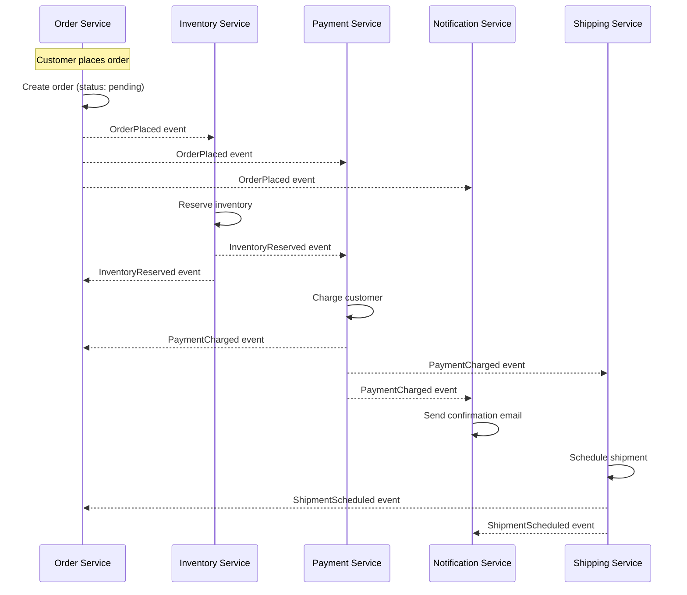
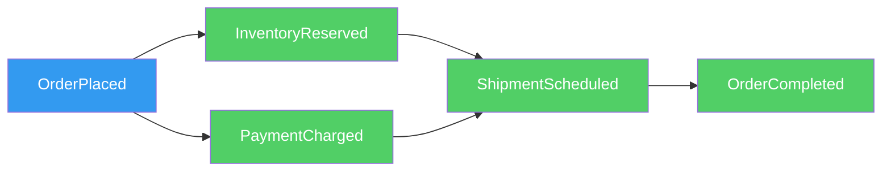
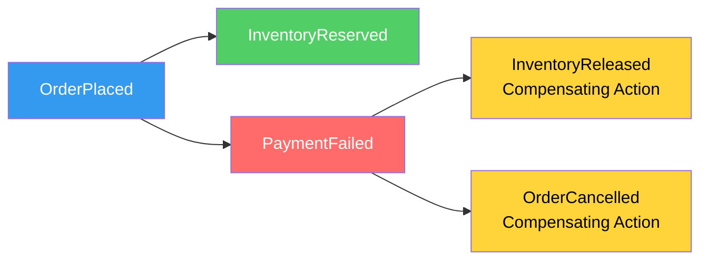
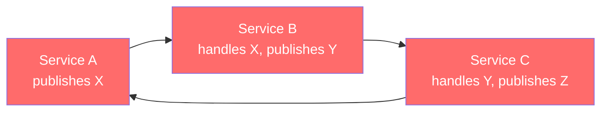

# Event Choreography

Event choreography is a coordination pattern where services react to events independently — there is no central controller directing the flow. Each service listens for events, does its work, and publishes new events that trigger the next step. The overall business process emerges from the interactions between autonomous services, like dancers in a ballet who each know their own routine and react to the music and each other's movements without a choreographer giving instructions.

This is the opposite of orchestration, where a central orchestrator explicitly tells each service what to do and when. Choreography trades explicit control flow for loose coupling — the producer does not know or care which services react to its events.

## First Principles: Why Choreography?

In a command-driven (orchestrated) system, the coordinator is a single point of coupling. Every service it calls is a dependency, and adding a new step means modifying the coordinator. The coordinator becomes a god object that knows about every service in the system.

Choreography eliminates this coupling by removing the coordinator entirely:

```
Orchestration (centralized):
  OrderOrchestrator:
    1. call InventoryService.reserve()
    2. call PaymentService.charge()
    3. call NotificationService.send()
    4. call ShippingService.schedule()
    // Adding a new step = changing the orchestrator
    // Orchestrator depends on ALL services

Choreography (decentralized):
  OrderService publishes "OrderPlaced"
    → InventoryService hears it, reserves stock, publishes "InventoryReserved"
    → PaymentService hears it, charges customer, publishes "PaymentCharged"
    → NotificationService hears "PaymentCharged", sends confirmation
    → ShippingService hears "InventoryReserved" + "PaymentCharged", schedules delivery
    // Adding a new step = adding a new subscriber. No existing service changes.
```

## When Choreography Is the Right Choice

Choreography works well when:

1. **The process is simple** — fewer than 5-6 steps with minimal branching
2. **Services are truly independent** — each service can complete its work without waiting for others
3. **New reactions are added frequently** — subscribers can be added without changing existing services
4. **No single team owns the end-to-end process** — different teams own different reactions
5. **Eventual consistency is acceptable** — there is no need for immediate confirmation of the entire flow

Choreography breaks down when:

1. **The process has complex conditional logic** — if-else branches become implicit and hard to trace
2. **Ordering matters** — choreography provides no guaranteed ordering across services
3. **The process is long-running** — tracking the state of a distributed flow across 10+ services becomes a nightmare
4. **You need a holistic view of the flow** — there is no single place that describes the business process
5. **Compensating actions are complex** — rolling back across many autonomous services is error-prone

## A Complete Choreography Example: Order Fulfillment



### TypeScript Implementation

```typescript
// order-service/src/application/PlaceOrderHandler.ts

class PlaceOrderHandler {
  constructor(
    private readonly orderRepo: OrderRepository,
    private readonly eventBus: EventBus,
  ) {}

  async handle(command: PlaceOrderCommand): Promise<string> {
    const order = Order.create({
      customerId: command.customerId,
      items: command.items,
    });

    await this.orderRepo.save(order);

    // Publish event — does NOT know or care who reacts
    await this.eventBus.publish('order.placed', {
      eventId: generateUUID(),
      orderId: order.id,
      customerId: order.customerId,
      items: order.items.map(i => ({
        productId: i.productId,
        quantity: i.quantity,
        unitPrice: i.unitPrice,
      })),
      totalAmount: order.totalAmount,
      placedAt: new Date().toISOString(),
    });

    return order.id;
  }
}
```

```typescript
// inventory-service/src/application/OrderPlacedHandler.ts

class OrderPlacedHandler {
  constructor(
    private readonly inventoryRepo: InventoryRepository,
    private readonly eventBus: EventBus,
  ) {}

  async handle(event: OrderPlacedEvent): Promise<void> {
    const reservations: Reservation[] = [];

    try {
      // Reserve each item
      for (const item of event.data.items) {
        const reservation = await this.inventoryRepo.reserve(
          item.productId,
          item.quantity,
          event.data.orderId,
        );
        reservations.push(reservation);
      }

      // Success — publish InventoryReserved
      await this.eventBus.publish('inventory.reserved', {
        eventId: generateUUID(),
        correlationId: event.correlationId,
        orderId: event.data.orderId,
        reservations: reservations.map(r => ({
          reservationId: r.id,
          productId: r.productId,
          quantity: r.quantity,
        })),
        reservedAt: new Date().toISOString(),
      });
    } catch (error) {
      // Failure — publish InventoryReservationFailed (triggers compensation)
      // Release any partial reservations
      for (const reservation of reservations) {
        await this.inventoryRepo.release(reservation.id);
      }

      await this.eventBus.publish('inventory.reservation_failed', {
        eventId: generateUUID(),
        correlationId: event.correlationId,
        orderId: event.data.orderId,
        reason: error instanceof Error ? error.message : 'Unknown error',
        failedAt: new Date().toISOString(),
      });
    }
  }
}
```

```typescript
// payment-service/src/application/OrderPlacedHandler.ts

class PaymentOrderPlacedHandler {
  constructor(
    private readonly paymentGateway: PaymentGateway,
    private readonly paymentRepo: PaymentRepository,
    private readonly eventBus: EventBus,
  ) {}

  async handle(event: OrderPlacedEvent): Promise<void> {
    try {
      // Charge the customer
      const paymentResult = await this.paymentGateway.charge({
        customerId: event.data.customerId,
        amount: event.data.totalAmount,
        currency: 'USD',
        idempotencyKey: event.data.orderId, // Prevent double-charging
      });

      // Save payment record
      await this.paymentRepo.save({
        paymentId: paymentResult.id,
        orderId: event.data.orderId,
        amount: event.data.totalAmount,
        status: 'charged',
      });

      // Publish success event
      await this.eventBus.publish('payment.charged', {
        eventId: generateUUID(),
        correlationId: event.correlationId,
        orderId: event.data.orderId,
        paymentId: paymentResult.id,
        amount: event.data.totalAmount,
        chargedAt: new Date().toISOString(),
      });
    } catch (error) {
      await this.eventBus.publish('payment.charge_failed', {
        eventId: generateUUID(),
        correlationId: event.correlationId,
        orderId: event.data.orderId,
        reason: error instanceof Error ? error.message : 'Payment failed',
        failedAt: new Date().toISOString(),
      });
    }
  }
}
```

```typescript
// shipping-service/src/application/EventHandlers.ts

// The shipping service needs BOTH inventory reserved AND payment charged
// before it can schedule a shipment. This is where choreography gets tricky.

interface PendingShipment {
  orderId: string;
  inventoryReserved: boolean;
  paymentCharged: boolean;
  reservations?: Reservation[];
  paymentId?: string;
}

class ShippingEventHandler {
  private pending: Map<string, PendingShipment> = new Map();

  constructor(
    private readonly shippingService: ShippingService,
    private readonly eventBus: EventBus,
  ) {}

  async onInventoryReserved(event: InventoryReservedEvent): Promise<void> {
    const orderId = event.data.orderId;
    const pending = this.getOrCreatePending(orderId);
    pending.inventoryReserved = true;
    pending.reservations = event.data.reservations;

    await this.tryScheduleShipment(pending);
  }

  async onPaymentCharged(event: PaymentChargedEvent): Promise<void> {
    const orderId = event.data.orderId;
    const pending = this.getOrCreatePending(orderId);
    pending.paymentCharged = true;
    pending.paymentId = event.data.paymentId;

    await this.tryScheduleShipment(pending);
  }

  private async tryScheduleShipment(pending: PendingShipment): Promise<void> {
    // Only proceed when BOTH prerequisites are met
    if (!pending.inventoryReserved || !pending.paymentCharged) {
      return; // Still waiting for the other event
    }

    const shipment = await this.shippingService.schedule({
      orderId: pending.orderId,
      items: pending.reservations!,
    });

    await this.eventBus.publish('shipment.scheduled', {
      eventId: generateUUID(),
      orderId: pending.orderId,
      shipmentId: shipment.id,
      estimatedDelivery: shipment.estimatedDelivery,
      scheduledAt: new Date().toISOString(),
    });

    // Clean up
    this.pending.delete(pending.orderId);
  }

  private getOrCreatePending(orderId: string): PendingShipment {
    if (!this.pending.has(orderId)) {
      this.pending.set(orderId, {
        orderId,
        inventoryReserved: false,
        paymentCharged: false,
      });
    }
    return this.pending.get(orderId)!;
  }
}
```

::: warning The Join Problem
Notice how the ShippingService must track partial state while waiting for multiple prerequisite events. This "join problem" is one of choreography's biggest pain points. The pending state must be durable (what if the service restarts?), it must handle timeouts (what if one event never arrives?), and it must handle duplicate events (what if InventoryReserved is delivered twice?). This is exactly where choreography starts to break down and orchestration becomes attractive.
:::

## Choreography-Based Saga

A saga is a pattern for managing distributed transactions across multiple services. In a choreography-based saga, each service listens for events, does its work, and publishes the result. If any step fails, the failing service publishes a failure event, and other services react by executing compensating actions.

### The Happy Path



### The Compensation Path



### TypeScript Saga Participants

```typescript
// order-service/src/application/SagaParticipant.ts

// The Order Service listens for downstream results and updates order status

class OrderSagaParticipant {
  constructor(
    private readonly orderRepo: OrderRepository,
    private readonly eventBus: EventBus,
  ) {
    // Register handlers for all relevant events
    eventBus.subscribe('inventory.reserved', this.onInventoryReserved.bind(this));
    eventBus.subscribe('inventory.reservation_failed', this.onInventoryFailed.bind(this));
    eventBus.subscribe('payment.charged', this.onPaymentCharged.bind(this));
    eventBus.subscribe('payment.charge_failed', this.onPaymentFailed.bind(this));
    eventBus.subscribe('shipment.scheduled', this.onShipmentScheduled.bind(this));
  }

  async onInventoryReserved(event: InventoryReservedEvent): Promise<void> {
    const order = await this.orderRepo.findById(event.data.orderId);
    if (!order) return;

    order.markInventoryReserved();
    await this.orderRepo.save(order);
  }

  async onInventoryFailed(event: InventoryReservationFailedEvent): Promise<void> {
    const order = await this.orderRepo.findById(event.data.orderId);
    if (!order) return;

    order.cancel(`Inventory reservation failed: ${event.data.reason}`);
    await this.orderRepo.save(order);

    // Publish cancellation event so other services can compensate
    await this.eventBus.publish('order.cancelled', {
      eventId: generateUUID(),
      correlationId: event.correlationId,
      orderId: order.id,
      reason: event.data.reason,
      cancelledAt: new Date().toISOString(),
    });
  }

  async onPaymentFailed(event: PaymentChargeFailedEvent): Promise<void> {
    const order = await this.orderRepo.findById(event.data.orderId);
    if (!order) return;

    order.cancel(`Payment failed: ${event.data.reason}`);
    await this.orderRepo.save(order);

    // Publish cancellation — this triggers inventory release
    await this.eventBus.publish('order.cancelled', {
      eventId: generateUUID(),
      correlationId: event.correlationId,
      orderId: order.id,
      reason: event.data.reason,
      cancelledAt: new Date().toISOString(),
    });
  }

  async onPaymentCharged(event: PaymentChargedEvent): Promise<void> {
    const order = await this.orderRepo.findById(event.data.orderId);
    if (!order) return;

    order.markPaymentReceived(event.data.paymentId);
    await this.orderRepo.save(order);
  }

  async onShipmentScheduled(event: ShipmentScheduledEvent): Promise<void> {
    const order = await this.orderRepo.findById(event.data.orderId);
    if (!order) return;

    order.markShipmentScheduled(event.data.shipmentId);
    await this.orderRepo.save(order);
  }
}
```

```typescript
// inventory-service/src/application/CompensationHandler.ts

// Inventory Service compensates when an order is cancelled

class InventoryCompensationHandler {
  constructor(
    private readonly inventoryRepo: InventoryRepository,
    private readonly eventBus: EventBus,
  ) {
    eventBus.subscribe('order.cancelled', this.onOrderCancelled.bind(this));
  }

  async onOrderCancelled(event: OrderCancelledEvent): Promise<void> {
    // Find reservations for this order and release them
    const reservations = await this.inventoryRepo.findReservationsByOrderId(
      event.data.orderId,
    );

    for (const reservation of reservations) {
      await this.inventoryRepo.release(reservation.id);
    }

    await this.eventBus.publish('inventory.released', {
      eventId: generateUUID(),
      correlationId: event.correlationId,
      orderId: event.data.orderId,
      releasedReservations: reservations.map(r => r.id),
      releasedAt: new Date().toISOString(),
    });
  }
}
```

```typescript
// payment-service/src/application/CompensationHandler.ts

// Payment Service refunds when an order is cancelled after payment

class PaymentCompensationHandler {
  constructor(
    private readonly paymentRepo: PaymentRepository,
    private readonly paymentGateway: PaymentGateway,
    private readonly eventBus: EventBus,
  ) {
    eventBus.subscribe('order.cancelled', this.onOrderCancelled.bind(this));
  }

  async onOrderCancelled(event: OrderCancelledEvent): Promise<void> {
    const payment = await this.paymentRepo.findByOrderId(event.data.orderId);
    if (!payment || payment.status !== 'charged') {
      return; // No payment to refund
    }

    const refund = await this.paymentGateway.refund({
      paymentId: payment.paymentId,
      amount: payment.amount,
      reason: event.data.reason,
    });

    payment.status = 'refunded';
    payment.refundId = refund.id;
    await this.paymentRepo.save(payment);

    await this.eventBus.publish('payment.refunded', {
      eventId: generateUUID(),
      correlationId: event.correlationId,
      orderId: event.data.orderId,
      paymentId: payment.paymentId,
      refundId: refund.id,
      amount: payment.amount,
      refundedAt: new Date().toISOString(),
    });
  }
}
```

## Correlation and Tracing

In choreography, there is no central point that tracks the flow. You need infrastructure to correlate related events.

### Correlation ID Pattern

```typescript
// shared/correlation.ts

// Every event in a business flow shares a correlation ID
// The first event in the flow generates the correlation ID
// All subsequent events carry the same correlation ID

interface CorrelatedEvent {
  eventId: string;        // Unique to this event
  correlationId: string;  // Shared across the entire flow
  causationId: string;    // ID of the event that caused this one
}

function createFirstEvent(eventType: string, data: unknown): CorrelatedEvent {
  const eventId = generateUUID();
  return {
    eventId,
    correlationId: eventId,  // First event IS its own correlation
    causationId: eventId,    // First event IS its own cause
  };
}

function createSubsequentEvent(
  eventType: string,
  data: unknown,
  causingEvent: CorrelatedEvent,
): CorrelatedEvent {
  return {
    eventId: generateUUID(),
    correlationId: causingEvent.correlationId,  // Same correlation
    causationId: causingEvent.eventId,          // Caused by the previous event
  };
}
```

### Distributed Tracing Integration

```typescript
// infrastructure/TracingEventBus.ts

import { trace, context, SpanKind } from '@opentelemetry/api';

class TracingEventBus implements EventBus {
  private tracer = trace.getTracer('event-bus');

  constructor(private readonly inner: EventBus) {}

  async publish(eventType: string, event: CorrelatedEvent): Promise<void> {
    const span = this.tracer.startSpan(`publish ${eventType}`, {
      kind: SpanKind.PRODUCER,
      attributes: {
        'event.type': eventType,
        'event.id': event.eventId,
        'event.correlation_id': event.correlationId,
        'event.causation_id': event.causationId,
      },
    });

    try {
      // Inject trace context into event metadata for propagation
      const traceContext = {};
      trace.propagation.inject(context.active(), traceContext);
      event.metadata = { ...event.metadata, ...traceContext };

      await this.inner.publish(eventType, event);
    } finally {
      span.end();
    }
  }

  async subscribe(
    eventType: string,
    handler: (event: CorrelatedEvent) => Promise<void>,
  ): Promise<void> {
    await this.inner.subscribe(eventType, async (event: CorrelatedEvent) => {
      // Extract trace context from event metadata
      const parentContext = trace.propagation.extract(
        context.active(),
        event.metadata ?? {},
      );

      const span = this.tracer.startSpan(
        `handle ${eventType}`,
        { kind: SpanKind.CONSUMER },
        parentContext,
      );

      try {
        await context.with(trace.setSpan(parentContext, span), () =>
          handler(event),
        );
      } catch (error) {
        span.recordException(error as Error);
        throw error;
      } finally {
        span.end();
      }
    });
  }
}
```

## Monitoring Choreographed Flows

Since there is no orchestrator, you need observability tools to understand the flow:

### Flow Tracker Service

```typescript
// flow-tracker-service/src/FlowTracker.ts

// A read-model service that subscribes to ALL events and builds
// a view of each business flow's progress.
// This does NOT control the flow — it only observes.

interface FlowStep {
  eventType: string;
  eventId: string;
  timestamp: string;
  service: string;
  status: 'completed' | 'failed';
}

interface FlowState {
  correlationId: string;
  orderId: string;
  steps: FlowStep[];
  status: 'in_progress' | 'completed' | 'failed' | 'timed_out';
  startedAt: string;
  completedAt?: string;
}

class FlowTracker {
  constructor(
    private readonly db: Database,
    private readonly eventBus: EventBus,
    private readonly alertService: AlertService,
  ) {
    // Subscribe to all relevant events
    const eventTypes = [
      'order.placed',
      'inventory.reserved',
      'inventory.reservation_failed',
      'inventory.released',
      'payment.charged',
      'payment.charge_failed',
      'payment.refunded',
      'shipment.scheduled',
      'order.cancelled',
    ];

    for (const eventType of eventTypes) {
      eventBus.subscribe(eventType, (event: CorrelatedEvent) =>
        this.trackStep(event, eventType),
      );
    }
  }

  private async trackStep(event: CorrelatedEvent, eventType: string): Promise<void> {
    const flow = await this.getOrCreateFlow(event.correlationId, event);

    flow.steps.push({
      eventType,
      eventId: event.eventId,
      timestamp: event.timestamp,
      service: event.source,
      status: eventType.includes('failed') ? 'failed' : 'completed',
    });

    // Update flow status
    if (this.isFlowComplete(flow)) {
      flow.status = 'completed';
      flow.completedAt = event.timestamp;
    } else if (this.isFlowFailed(flow)) {
      flow.status = 'failed';
      flow.completedAt = event.timestamp;
    }

    await this.saveFlow(flow);
  }

  /**
   * Detect stalled flows — flows that have not progressed
   * within the expected time window.
   */
  async detectStalledFlows(): Promise<FlowState[]> {
    const stalledFlows = await this.db.query(
      `SELECT * FROM flows
       WHERE status = 'in_progress'
       AND started_at < NOW() - INTERVAL '5 minutes'`,
    );

    for (const flow of stalledFlows.rows) {
      flow.status = 'timed_out';
      await this.saveFlow(flow);
      await this.alertService.alert({
        severity: 'warning',
        message: `Flow ${flow.correlationId} timed out after 5 minutes`,
        context: { orderId: flow.orderId, lastStep: flow.steps.at(-1) },
      });
    }

    return stalledFlows.rows;
  }

  private isFlowComplete(flow: FlowState): boolean {
    const stepTypes = new Set(flow.steps.map(s => s.eventType));
    return stepTypes.has('shipment.scheduled');
  }

  private isFlowFailed(flow: FlowState): boolean {
    const stepTypes = new Set(flow.steps.map(s => s.eventType));
    return stepTypes.has('order.cancelled');
  }

  private async getOrCreateFlow(
    correlationId: string,
    event: CorrelatedEvent,
  ): Promise<FlowState> {
    const existing = await this.db.query(
      'SELECT * FROM flows WHERE correlation_id = $1',
      [correlationId],
    );

    if (existing.rows.length > 0) {
      return existing.rows[0];
    }

    return {
      correlationId,
      orderId: (event as any).data?.orderId ?? '',
      steps: [],
      status: 'in_progress',
      startedAt: event.timestamp,
    };
  }

  private async saveFlow(flow: FlowState): Promise<void> {
    await this.db.query(
      `INSERT INTO flows (correlation_id, order_id, steps, status, started_at, completed_at)
       VALUES ($1, $2, $3, $4, $5, $6)
       ON CONFLICT (correlation_id) DO UPDATE SET
         steps = $3, status = $4, completed_at = $6`,
      [
        flow.correlationId,
        flow.orderId,
        JSON.stringify(flow.steps),
        flow.status,
        flow.startedAt,
        flow.completedAt ?? null,
      ],
    );
  }
}
```

## Common Choreography Pitfalls

### Pitfall 1: Cyclic Event Chains



If Service C publishes an event that triggers Service A, you get an infinite loop. Guard against this by checking if an event has already been processed for a given correlation ID.

```typescript
// Guard against cyclic processing
class CycleGuard {
  private processed = new Set<string>();

  shouldProcess(correlationId: string, step: string): boolean {
    const key = `${correlationId}:${step}`;
    if (this.processed.has(key)) {
      console.warn(`Cycle detected: ${key} already processed`);
      return false;
    }
    this.processed.add(key);
    return true;
  }
}
```

### Pitfall 2: Temporal Coupling

Service B expects to receive Event X before Event Y, but in a distributed system, message ordering is not guaranteed across topics. Design handlers to be order-independent or use the pending state pattern (as shown in the ShippingEventHandler above).

### Pitfall 3: The Invisible Process

With orchestration, you can read the orchestrator code to understand the business process. With choreography, you must mentally trace event subscriptions across all services to understand the flow. Document the flow explicitly, even if the code is decentralized:

```typescript
// docs/flows/order-fulfillment.ts
// This file documents the choreographed flow. It is NOT executable code.
// It exists purely to make the implicit flow explicit.

/**
 * ORDER FULFILLMENT FLOW (Choreography)
 *
 * Trigger: Customer places an order
 *
 * Happy Path:
 *   1. OrderService       → publishes "order.placed"
 *   2. InventoryService   → handles "order.placed" → publishes "inventory.reserved"
 *   3. PaymentService     → handles "order.placed" → publishes "payment.charged"
 *   4. ShippingService    → handles "inventory.reserved" + "payment.charged"
 *                         → publishes "shipment.scheduled"
 *   5. NotificationService → handles "payment.charged" → sends email
 *   6. OrderService       → handles "shipment.scheduled" → marks order complete
 *
 * Failure Paths:
 *   - InventoryService fails:
 *     publishes "inventory.reservation_failed"
 *     → OrderService cancels order → publishes "order.cancelled"
 *     → PaymentService refunds (if already charged)
 *
 *   - PaymentService fails:
 *     publishes "payment.charge_failed"
 *     → OrderService cancels order → publishes "order.cancelled"
 *     → InventoryService releases reservation
 *
 * Timeout:
 *   - FlowTracker detects stalled flows after 5 minutes
 *   - Alert sent to operations team
 */
```

### Pitfall 4: Missing Compensations

Every service that modifies state must have a compensation handler. If you add a new subscriber that reserves resources, you MUST also add a handler that releases those resources when the flow fails.

```typescript
// Checklist for adding a new choreography participant:
// [ ] Handler for the triggering event
// [ ] Success event published after completing work
// [ ] Failure event published if work fails
// [ ] Compensation handler for upstream failure events
// [ ] Idempotent processing (handle duplicate events)
// [ ] Timeout handling (what if a prerequisite event never arrives?)
// [ ] Flow tracker updated with new step
// [ ] Documentation updated with new participant
```

## Testing Choreographed Flows

Testing choreography requires verifying that the correct events are published and that compensation works correctly:

```typescript
// __tests__/OrderFulfillmentChoreography.test.ts

describe('Order Fulfillment Choreography', () => {
  let orderService: PlaceOrderHandler;
  let inventoryHandler: OrderPlacedHandler;
  let paymentHandler: PaymentOrderPlacedHandler;
  let eventBus: InProcessEventBus;
  let publishedEvents: Array<{ type: string; data: unknown }>;

  beforeEach(() => {
    eventBus = new InProcessEventBus();
    publishedEvents = [];

    // Capture all published events
    const originalPublish = eventBus.publish.bind(eventBus);
    eventBus.publish = async (type, data) => {
      publishedEvents.push({ type, data });
      return originalPublish(type, data);
    };

    orderService = new PlaceOrderHandler(mockOrderRepo, eventBus);
    inventoryHandler = new OrderPlacedHandler(mockInventoryRepo, eventBus);
    paymentHandler = new PaymentOrderPlacedHandler(
      mockPaymentGateway, mockPaymentRepo, eventBus,
    );

    // Wire up choreography
    eventBus.subscribe('order.placed', inventoryHandler.handle.bind(inventoryHandler));
    eventBus.subscribe('order.placed', paymentHandler.handle.bind(paymentHandler));
  });

  it('happy path: publishes inventory reserved and payment charged', async () => {
    await orderService.handle({
      customerId: 'cust-1',
      items: [{ productId: 'prod-1', quantity: 2, unitPrice: 10 }],
    });

    const eventTypes = publishedEvents.map(e => e.type);
    expect(eventTypes).toContain('order.placed');
    expect(eventTypes).toContain('inventory.reserved');
    expect(eventTypes).toContain('payment.charged');
  });

  it('compensation path: releases inventory when payment fails', async () => {
    // Make payment gateway fail
    mockPaymentGateway.charge = async () => { throw new Error('Insufficient funds'); };

    // Wire up compensation
    const compensationHandler = new InventoryCompensationHandler(
      mockInventoryRepo, eventBus,
    );
    eventBus.subscribe('order.cancelled', compensationHandler.onOrderCancelled.bind(compensationHandler));

    const orderSaga = new OrderSagaParticipant(mockOrderRepo, eventBus);

    await orderService.handle({
      customerId: 'cust-1',
      items: [{ productId: 'prod-1', quantity: 2, unitPrice: 10 }],
    });

    const eventTypes = publishedEvents.map(e => e.type);
    expect(eventTypes).toContain('payment.charge_failed');
    expect(eventTypes).toContain('order.cancelled');
    expect(eventTypes).toContain('inventory.released');
  });
});
```

## Choreography vs Orchestration: Quick Comparison

| Aspect | Choreography | Orchestration |
|---|---|---|
| **Coupling** | Very loose — no central coordinator | Moderate — orchestrator knows all participants |
| **Visibility** | Implicit flow — hard to trace | Explicit flow — read the orchestrator |
| **Adding steps** | Add a subscriber — no existing changes | Modify the orchestrator |
| **Error handling** | Each service compensates independently | Orchestrator manages compensation |
| **Complexity** | Simple flows: low. Complex flows: very high | Consistent regardless of flow complexity |
| **Single point of failure** | None | The orchestrator |
| **Best for** | Simple fan-out reactions | Complex multi-step business processes |

::: info When to Switch from Choreography to Orchestration
If you find yourself building a flow tracker service that essentially reconstructs the entire business process from observed events, you are reinventing an orchestrator with worse tooling. At that point, switch to explicit orchestration. A good rule of thumb: if the choreography requires more than 5 event types or has more than 2 conditional branches, orchestration will be simpler to understand, test, and maintain.
:::

::: tip Summary
Choreography is powerful for simple, fan-out reactions where services are truly independent. It shines when new subscribers are added frequently and when no single team owns the end-to-end process. But it has a ceiling — as flows become more complex, the implicit nature of choreography becomes a liability. Monitor your choreographed flows explicitly, document the implicit process, and be ready to graduate to orchestration when the complexity demands it.
:::
