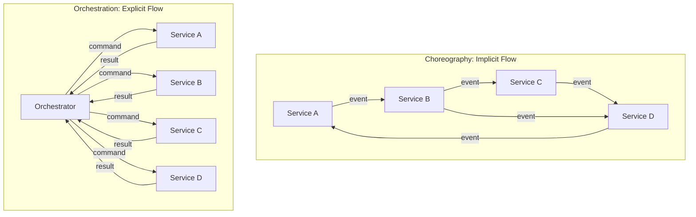
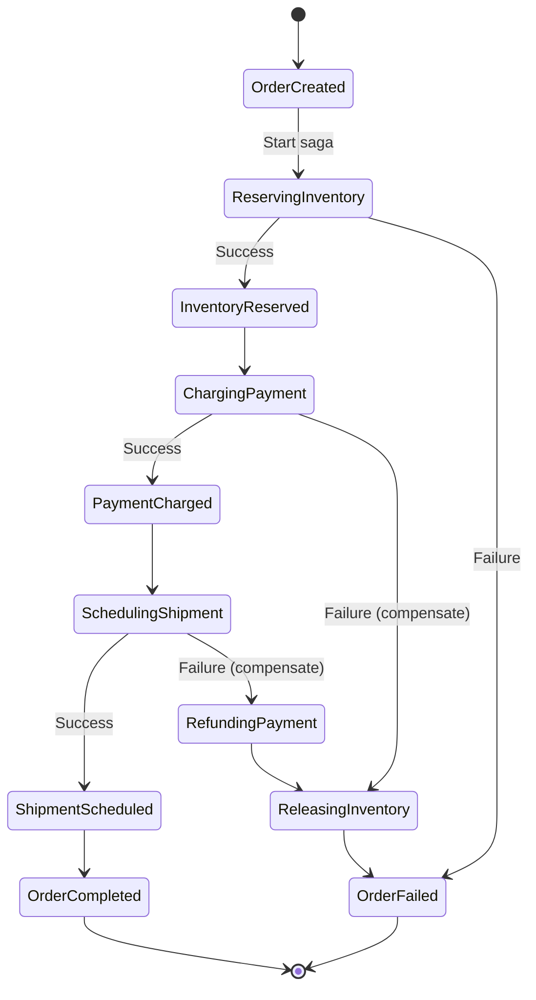
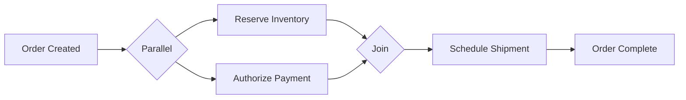
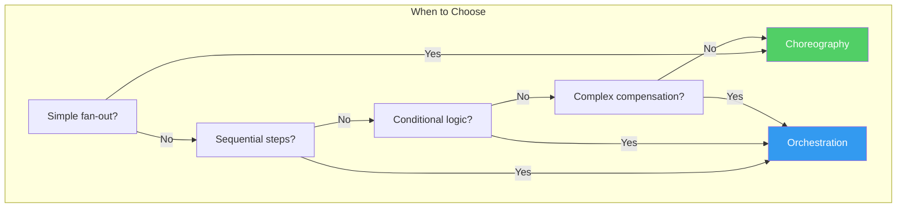
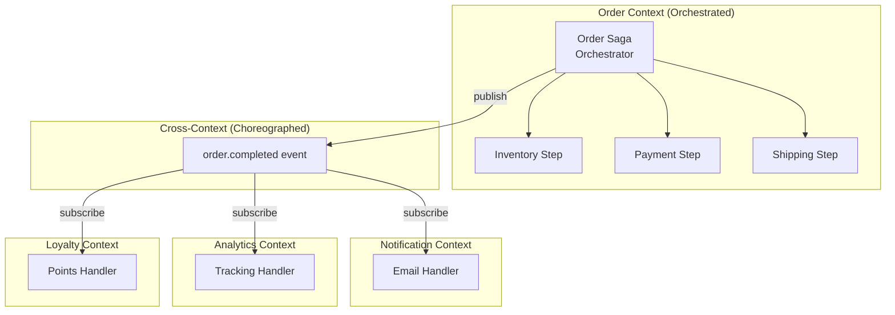

# Event Orchestration

Event orchestration is a coordination pattern where a central orchestrator explicitly defines and controls the sequence of steps in a distributed business process. The orchestrator sends commands to participating services, waits for their responses (events), decides what to do next based on the results, and manages compensating actions when something fails.

This is the opposite of choreography. Where choreography distributes the process knowledge across all participating services, orchestration concentrates it in one place. The orchestrator is the single source of truth for the business process — you can read its code and understand the entire flow without examining any other service.

## First Principles: Why Orchestration?

Choreography works beautifully for simple fan-out patterns. But real business processes are rarely simple fan-out:

- **Order fulfillment** requires sequential steps: reserve inventory THEN charge payment THEN schedule shipping
- **Loan application** has branching: if credit score > 700, auto-approve; otherwise, route to manual review
- **Travel booking** must coordinate flights, hotels, and car rentals with all-or-nothing semantics
- **Insurance claims** follow a multi-week process with human approval steps, document collection, and conditional payouts

These processes have **conditional logic**, **sequential dependencies**, **timeouts**, and **complex compensation**. Encoding all of this implicitly through event subscriptions creates invisible spaghetti. An orchestrator makes this explicit.



## When Orchestration Is the Right Choice

Orchestration is appropriate when:

1. **The process has sequential dependencies** — step 3 cannot start until step 2 completes
2. **The process has conditional branching** — different paths based on intermediate results
3. **Compensation is complex** — rolling back requires a specific order and conditional logic
4. **A single team owns the end-to-end process** — the orchestrator belongs to the team that owns the business process
5. **You need process visibility** — the orchestrator is a clear, readable description of the flow
6. **The process is long-running** — it may span minutes, hours, or days with human interaction steps

Orchestration is NOT appropriate when:

1. **The flow is simple fan-out** — one event triggers independent reactions in multiple services
2. **No team owns the process** — if different teams own different steps and nobody owns the whole flow, an orchestrator creates a political bottleneck
3. **The flow changes constantly** — if new steps are added weekly by different teams, choreography allows them to add subscribers without coordinating

## The Orchestration-Based Saga Pattern

A saga is a sequence of local transactions where each transaction updates a service and publishes an event. If a step fails, the saga executes compensating transactions to undo the preceding steps.

In an orchestration-based saga, the orchestrator manages the entire saga lifecycle:



### TypeScript Orchestrator Implementation

```typescript
// order-service/src/sagas/OrderFulfillmentSaga.ts

// Saga state — persisted to database so it survives crashes
interface OrderSagaState {
  sagaId: string;
  orderId: string;
  customerId: string;
  items: Array<{ productId: string; quantity: number; unitPrice: number }>;
  totalAmount: number;
  status: OrderSagaStatus;
  reservationIds: string[];
  paymentId: string | null;
  shipmentId: string | null;
  failureReason: string | null;
  createdAt: string;
  updatedAt: string;
}

type OrderSagaStatus =
  | 'started'
  | 'reserving_inventory'
  | 'inventory_reserved'
  | 'charging_payment'
  | 'payment_charged'
  | 'scheduling_shipment'
  | 'completed'
  | 'releasing_inventory'    // Compensation
  | 'refunding_payment'      // Compensation
  | 'failed';

class OrderFulfillmentSaga {
  constructor(
    private readonly sagaRepo: SagaRepository<OrderSagaState>,
    private readonly commandBus: CommandBus,
    private readonly eventBus: EventBus,
  ) {
    // Register event handlers that the orchestrator listens to
    this.eventBus.subscribe('inventory.reserved', this.onInventoryReserved.bind(this));
    this.eventBus.subscribe('inventory.reservation_failed', this.onInventoryFailed.bind(this));
    this.eventBus.subscribe('payment.charged', this.onPaymentCharged.bind(this));
    this.eventBus.subscribe('payment.charge_failed', this.onPaymentFailed.bind(this));
    this.eventBus.subscribe('shipment.scheduled', this.onShipmentScheduled.bind(this));
    this.eventBus.subscribe('shipment.scheduling_failed', this.onShipmentFailed.bind(this));
    this.eventBus.subscribe('payment.refunded', this.onPaymentRefunded.bind(this));
    this.eventBus.subscribe('inventory.released', this.onInventoryReleased.bind(this));
  }

  /**
   * Start the saga — entry point
   */
  async start(command: PlaceOrderCommand): Promise<string> {
    const sagaState: OrderSagaState = {
      sagaId: generateUUID(),
      orderId: generateUUID(),
      customerId: command.customerId,
      items: command.items,
      totalAmount: command.items.reduce(
        (sum, i) => sum + i.quantity * i.unitPrice, 0,
      ),
      status: 'started',
      reservationIds: [],
      paymentId: null,
      shipmentId: null,
      failureReason: null,
      createdAt: new Date().toISOString(),
      updatedAt: new Date().toISOString(),
    };

    await this.sagaRepo.save(sagaState);

    // Step 1: Reserve inventory
    await this.reserveInventory(sagaState);

    return sagaState.orderId;
  }

  // --- Forward Steps ---

  private async reserveInventory(state: OrderSagaState): Promise<void> {
    state.status = 'reserving_inventory';
    state.updatedAt = new Date().toISOString();
    await this.sagaRepo.save(state);

    // Send command to Inventory Service
    await this.commandBus.send('inventory.reserve', {
      sagaId: state.sagaId,
      orderId: state.orderId,
      items: state.items.map(i => ({
        productId: i.productId,
        quantity: i.quantity,
      })),
    });
  }

  private async chargePayment(state: OrderSagaState): Promise<void> {
    state.status = 'charging_payment';
    state.updatedAt = new Date().toISOString();
    await this.sagaRepo.save(state);

    await this.commandBus.send('payment.charge', {
      sagaId: state.sagaId,
      orderId: state.orderId,
      customerId: state.customerId,
      amount: state.totalAmount,
      currency: 'USD',
    });
  }

  private async scheduleShipment(state: OrderSagaState): Promise<void> {
    state.status = 'scheduling_shipment';
    state.updatedAt = new Date().toISOString();
    await this.sagaRepo.save(state);

    await this.commandBus.send('shipping.schedule', {
      sagaId: state.sagaId,
      orderId: state.orderId,
      items: state.items,
    });
  }

  private async completeSaga(state: OrderSagaState): Promise<void> {
    state.status = 'completed';
    state.updatedAt = new Date().toISOString();
    await this.sagaRepo.save(state);

    await this.eventBus.publish('order.completed', {
      eventId: generateUUID(),
      orderId: state.orderId,
      completedAt: new Date().toISOString(),
    });
  }

  // --- Event Handlers (Forward Path) ---

  private async onInventoryReserved(event: InventoryReservedEvent): Promise<void> {
    const state = await this.sagaRepo.findBySagaId(event.data.sagaId);
    if (!state || state.status !== 'reserving_inventory') return;

    state.status = 'inventory_reserved';
    state.reservationIds = event.data.reservations.map(r => r.reservationId);
    await this.sagaRepo.save(state);

    // Proceed to next step
    await this.chargePayment(state);
  }

  private async onPaymentCharged(event: PaymentChargedEvent): Promise<void> {
    const state = await this.sagaRepo.findBySagaId(event.data.sagaId);
    if (!state || state.status !== 'charging_payment') return;

    state.status = 'payment_charged';
    state.paymentId = event.data.paymentId;
    await this.sagaRepo.save(state);

    // Proceed to next step
    await this.scheduleShipment(state);
  }

  private async onShipmentScheduled(event: ShipmentScheduledEvent): Promise<void> {
    const state = await this.sagaRepo.findBySagaId(event.data.sagaId);
    if (!state || state.status !== 'scheduling_shipment') return;

    state.shipmentId = event.data.shipmentId;

    // All steps completed — saga is done
    await this.completeSaga(state);
  }

  // --- Compensation Handlers ---

  private async onInventoryFailed(event: InventoryReservationFailedEvent): Promise<void> {
    const state = await this.sagaRepo.findBySagaId(event.data.sagaId);
    if (!state) return;

    // No compensation needed — nothing to undo
    state.status = 'failed';
    state.failureReason = `Inventory reservation failed: ${event.data.reason}`;
    await this.sagaRepo.save(state);

    await this.eventBus.publish('order.failed', {
      eventId: generateUUID(),
      orderId: state.orderId,
      reason: state.failureReason,
    });
  }

  private async onPaymentFailed(event: PaymentChargeFailedEvent): Promise<void> {
    const state = await this.sagaRepo.findBySagaId(event.data.sagaId);
    if (!state) return;

    state.failureReason = `Payment failed: ${event.data.reason}`;

    // Compensate: release inventory reservation
    await this.releaseInventory(state);
  }

  private async onShipmentFailed(event: ShipmentSchedulingFailedEvent): Promise<void> {
    const state = await this.sagaRepo.findBySagaId(event.data.sagaId);
    if (!state) return;

    state.failureReason = `Shipment scheduling failed: ${event.data.reason}`;

    // Compensate: refund payment first, then release inventory
    await this.refundPayment(state);
  }

  // --- Compensation Steps ---

  private async refundPayment(state: OrderSagaState): Promise<void> {
    state.status = 'refunding_payment';
    state.updatedAt = new Date().toISOString();
    await this.sagaRepo.save(state);

    await this.commandBus.send('payment.refund', {
      sagaId: state.sagaId,
      paymentId: state.paymentId!,
      amount: state.totalAmount,
      reason: state.failureReason!,
    });
  }

  private async releaseInventory(state: OrderSagaState): Promise<void> {
    state.status = 'releasing_inventory';
    state.updatedAt = new Date().toISOString();
    await this.sagaRepo.save(state);

    await this.commandBus.send('inventory.release', {
      sagaId: state.sagaId,
      reservationIds: state.reservationIds,
    });
  }

  private async onPaymentRefunded(event: PaymentRefundedEvent): Promise<void> {
    const state = await this.sagaRepo.findBySagaId(event.data.sagaId);
    if (!state || state.status !== 'refunding_payment') return;

    // After refunding, release inventory
    await this.releaseInventory(state);
  }

  private async onInventoryReleased(event: InventoryReleasedEvent): Promise<void> {
    const state = await this.sagaRepo.findBySagaId(event.data.sagaId);
    if (!state || state.status !== 'releasing_inventory') return;

    // Compensation complete — saga failed
    state.status = 'failed';
    state.updatedAt = new Date().toISOString();
    await this.sagaRepo.save(state);

    await this.eventBus.publish('order.failed', {
      eventId: generateUUID(),
      orderId: state.orderId,
      reason: state.failureReason!,
    });
  }
}
```

## State Machine Orchestrator

A more formalized approach models the saga as an explicit state machine. This makes the transitions between states — and the conditions for each transition — crystal clear.

```typescript
// shared/StateMachine.ts

interface Transition<TState extends string, TEvent extends string> {
  from: TState;
  event: TEvent;
  to: TState;
  action?: () => Promise<void>;
  guard?: () => boolean;
}

class StateMachine<TState extends string, TEvent extends string> {
  private currentState: TState;
  private transitions: Transition<TState, TEvent>[];
  private onTransitionCallbacks: Array<
    (from: TState, event: TEvent, to: TState) => void
  > = [];

  constructor(initialState: TState, transitions: Transition<TState, TEvent>[]) {
    this.currentState = initialState;
    this.transitions = transitions;
  }

  get state(): TState {
    return this.currentState;
  }

  async send(event: TEvent): Promise<TState> {
    const transition = this.transitions.find(
      t => t.from === this.currentState && t.event === event,
    );

    if (!transition) {
      throw new InvalidTransitionError(
        `No transition from "${this.currentState}" on event "${event}"`,
      );
    }

    if (transition.guard && !transition.guard()) {
      throw new GuardFailedError(
        `Guard failed for transition ${this.currentState} → ${transition.to}`,
      );
    }

    const previousState = this.currentState;
    this.currentState = transition.to;

    // Notify listeners
    for (const callback of this.onTransitionCallbacks) {
      callback(previousState, event, transition.to);
    }

    // Execute action
    if (transition.action) {
      await transition.action();
    }

    return this.currentState;
  }

  onTransition(callback: (from: TState, event: TEvent, to: TState) => void): void {
    this.onTransitionCallbacks.push(callback);
  }

  getAvailableEvents(): TEvent[] {
    return this.transitions
      .filter(t => t.from === this.currentState)
      .map(t => t.event);
  }
}

class InvalidTransitionError extends Error {
  constructor(message: string) {
    super(message);
    this.name = 'InvalidTransitionError';
  }
}

class GuardFailedError extends Error {
  constructor(message: string) {
    super(message);
    this.name = 'GuardFailedError';
  }
}
```

### State Machine Saga

```typescript
// order-service/src/sagas/OrderSagaStateMachine.ts

type SagaState =
  | 'idle'
  | 'reserving_inventory'
  | 'charging_payment'
  | 'scheduling_shipment'
  | 'completed'
  | 'compensating_payment'
  | 'compensating_inventory'
  | 'failed';

type SagaEvent =
  | 'START'
  | 'INVENTORY_RESERVED'
  | 'INVENTORY_FAILED'
  | 'PAYMENT_CHARGED'
  | 'PAYMENT_FAILED'
  | 'SHIPMENT_SCHEDULED'
  | 'SHIPMENT_FAILED'
  | 'PAYMENT_REFUNDED'
  | 'INVENTORY_RELEASED';

function createOrderSagaMachine(
  context: SagaContext,
): StateMachine<SagaState, SagaEvent> {
  return new StateMachine<SagaState, SagaEvent>('idle', [
    // Forward path
    {
      from: 'idle',
      event: 'START',
      to: 'reserving_inventory',
      action: () => context.reserveInventory(),
    },
    {
      from: 'reserving_inventory',
      event: 'INVENTORY_RESERVED',
      to: 'charging_payment',
      action: () => context.chargePayment(),
    },
    {
      from: 'charging_payment',
      event: 'PAYMENT_CHARGED',
      to: 'scheduling_shipment',
      action: () => context.scheduleShipment(),
    },
    {
      from: 'scheduling_shipment',
      event: 'SHIPMENT_SCHEDULED',
      to: 'completed',
      action: () => context.completeOrder(),
    },

    // Compensation path
    {
      from: 'reserving_inventory',
      event: 'INVENTORY_FAILED',
      to: 'failed',
      action: () => context.failOrder('Inventory reservation failed'),
    },
    {
      from: 'charging_payment',
      event: 'PAYMENT_FAILED',
      to: 'compensating_inventory',
      action: () => context.releaseInventory(),
    },
    {
      from: 'scheduling_shipment',
      event: 'SHIPMENT_FAILED',
      to: 'compensating_payment',
      action: () => context.refundPayment(),
    },
    {
      from: 'compensating_payment',
      event: 'PAYMENT_REFUNDED',
      to: 'compensating_inventory',
      action: () => context.releaseInventory(),
    },
    {
      from: 'compensating_inventory',
      event: 'INVENTORY_RELEASED',
      to: 'failed',
      action: () => context.failOrder('Order compensation complete'),
    },
  ]);
}

interface SagaContext {
  reserveInventory(): Promise<void>;
  chargePayment(): Promise<void>;
  scheduleShipment(): Promise<void>;
  completeOrder(): Promise<void>;
  releaseInventory(): Promise<void>;
  refundPayment(): Promise<void>;
  failOrder(reason: string): Promise<void>;
}
```

### Using the State Machine Orchestrator

```typescript
// order-service/src/sagas/OrderSagaOrchestrator.ts

class OrderSagaOrchestrator {
  private machines: Map<string, StateMachine<SagaState, SagaEvent>> = new Map();

  constructor(
    private readonly sagaRepo: SagaRepository<OrderSagaState>,
    private readonly commandBus: CommandBus,
    private readonly eventBus: EventBus,
  ) {
    this.registerEventHandlers();
  }

  async startSaga(command: PlaceOrderCommand): Promise<string> {
    const sagaId = generateUUID();
    const state: OrderSagaState = {
      sagaId,
      orderId: generateUUID(),
      customerId: command.customerId,
      items: command.items,
      totalAmount: command.items.reduce((s, i) => s + i.quantity * i.unitPrice, 0),
      status: 'idle',
      reservationIds: [],
      paymentId: null,
      shipmentId: null,
      failureReason: null,
      createdAt: new Date().toISOString(),
      updatedAt: new Date().toISOString(),
    };

    await this.sagaRepo.save(state);

    const machine = createOrderSagaMachine(this.createContext(state));
    this.machines.set(sagaId, machine);

    // Log every transition
    machine.onTransition((from, event, to) => {
      console.log(`Saga ${sagaId}: ${from} --[${event}]--> ${to}`);
    });

    // Start the saga
    await machine.send('START');

    return state.orderId;
  }

  private registerEventHandlers(): void {
    const eventMap: Record<string, SagaEvent> = {
      'inventory.reserved': 'INVENTORY_RESERVED',
      'inventory.reservation_failed': 'INVENTORY_FAILED',
      'payment.charged': 'PAYMENT_CHARGED',
      'payment.charge_failed': 'PAYMENT_FAILED',
      'shipment.scheduled': 'SHIPMENT_SCHEDULED',
      'shipment.scheduling_failed': 'SHIPMENT_FAILED',
      'payment.refunded': 'PAYMENT_REFUNDED',
      'inventory.released': 'INVENTORY_RELEASED',
    };

    for (const [eventType, sagaEvent] of Object.entries(eventMap)) {
      this.eventBus.subscribe(eventType, async (event: any) => {
        const sagaId = event.data.sagaId;
        const machine = this.machines.get(sagaId);
        if (!machine) return;

        // Update state data from event
        const state = await this.sagaRepo.findBySagaId(sagaId);
        if (!state) return;

        this.updateStateFromEvent(state, eventType, event);
        await this.sagaRepo.save(state);

        // Drive the state machine
        await machine.send(sagaEvent);
      });
    }
  }

  private updateStateFromEvent(
    state: OrderSagaState,
    eventType: string,
    event: any,
  ): void {
    switch (eventType) {
      case 'inventory.reserved':
        state.reservationIds = event.data.reservations.map(
          (r: any) => r.reservationId,
        );
        break;
      case 'payment.charged':
        state.paymentId = event.data.paymentId;
        break;
      case 'shipment.scheduled':
        state.shipmentId = event.data.shipmentId;
        break;
    }
    state.updatedAt = new Date().toISOString();
  }

  private createContext(state: OrderSagaState): SagaContext {
    return {
      reserveInventory: () => this.commandBus.send('inventory.reserve', {
        sagaId: state.sagaId,
        orderId: state.orderId,
        items: state.items,
      }),
      chargePayment: () => this.commandBus.send('payment.charge', {
        sagaId: state.sagaId,
        orderId: state.orderId,
        customerId: state.customerId,
        amount: state.totalAmount,
      }),
      scheduleShipment: () => this.commandBus.send('shipping.schedule', {
        sagaId: state.sagaId,
        orderId: state.orderId,
        items: state.items,
      }),
      completeOrder: async () => {
        state.status = 'completed';
        await this.sagaRepo.save(state);
        await this.eventBus.publish('order.completed', {
          orderId: state.orderId,
        });
      },
      releaseInventory: () => this.commandBus.send('inventory.release', {
        sagaId: state.sagaId,
        reservationIds: state.reservationIds,
      }),
      refundPayment: () => this.commandBus.send('payment.refund', {
        sagaId: state.sagaId,
        paymentId: state.paymentId!,
        amount: state.totalAmount,
      }),
      failOrder: async (reason: string) => {
        state.status = 'failed';
        state.failureReason = reason;
        await this.sagaRepo.save(state);
        await this.eventBus.publish('order.failed', {
          orderId: state.orderId,
          reason,
        });
      },
    };
  }
}
```

## Timeout Handling

Orchestrators must handle the case where a participating service never responds. Without timeouts, a saga can hang forever:

```typescript
// sagas/SagaTimeoutManager.ts

class SagaTimeoutManager {
  private timers: Map<string, NodeJS.Timeout> = new Map();

  constructor(
    private readonly sagaRepo: SagaRepository<OrderSagaState>,
    private readonly eventBus: EventBus,
  ) {}

  /**
   * Set a timeout for a saga step.
   * If the step does not complete within the timeout,
   * the saga is moved to compensation.
   */
  setStepTimeout(
    sagaId: string,
    stepName: string,
    timeoutMs: number,
  ): void {
    const timerKey = `${sagaId}:${stepName}`;

    // Clear any existing timer for this step
    this.clearTimeout(timerKey);

    const timer = setTimeout(async () => {
      const state = await this.sagaRepo.findBySagaId(sagaId);
      if (!state) return;

      // Only timeout if still waiting for this step
      if (state.status === stepName) {
        console.warn(`Saga ${sagaId} timed out waiting for ${stepName}`);

        await this.eventBus.publish('saga.step_timed_out', {
          sagaId,
          step: stepName,
          timedOutAt: new Date().toISOString(),
        });
      }

      this.timers.delete(timerKey);
    }, timeoutMs);

    this.timers.set(timerKey, timer);
  }

  clearTimeout(timerKey: string): void {
    const existing = this.timers.get(timerKey);
    if (existing) {
      clearTimeout(existing);
      this.timers.delete(timerKey);
    }
  }

  clearAllForSaga(sagaId: string): void {
    for (const [key, timer] of this.timers.entries()) {
      if (key.startsWith(`${sagaId}:`)) {
        clearTimeout(timer);
        this.timers.delete(key);
      }
    }
  }
}

// Usage in the orchestrator:
// After sending a command, set a timeout:
private async reserveInventory(state: OrderSagaState): Promise<void> {
  state.status = 'reserving_inventory';
  await this.sagaRepo.save(state);

  await this.commandBus.send('inventory.reserve', { /* ... */ });

  // If inventory service doesn't respond in 30 seconds, timeout
  this.timeoutManager.setStepTimeout(
    state.sagaId,
    'reserving_inventory',
    30_000,
  );
}
```

## Parallel Steps in Orchestration

Some steps can execute in parallel. For example, inventory reservation and payment authorization can happen simultaneously:



```typescript
// sagas/ParallelStepOrchestrator.ts

interface ParallelStepState {
  inventoryReserved: boolean;
  paymentAuthorized: boolean;
}

class ParallelOrderSaga {
  constructor(
    private readonly sagaRepo: SagaRepository<ParallelOrderSagaState>,
    private readonly commandBus: CommandBus,
    private readonly eventBus: EventBus,
  ) {}

  async start(command: PlaceOrderCommand): Promise<string> {
    const state = this.createInitialState(command);
    await this.sagaRepo.save(state);

    // Launch both steps in parallel
    await Promise.all([
      this.commandBus.send('inventory.reserve', {
        sagaId: state.sagaId,
        orderId: state.orderId,
        items: state.items,
      }),
      this.commandBus.send('payment.authorize', {
        sagaId: state.sagaId,
        orderId: state.orderId,
        customerId: state.customerId,
        amount: state.totalAmount,
      }),
    ]);

    state.status = 'awaiting_parallel_steps';
    state.parallelSteps = { inventoryReserved: false, paymentAuthorized: false };
    await this.sagaRepo.save(state);

    return state.orderId;
  }

  async onInventoryReserved(event: InventoryReservedEvent): Promise<void> {
    const state = await this.sagaRepo.findBySagaId(event.data.sagaId);
    if (!state || state.status !== 'awaiting_parallel_steps') return;

    state.parallelSteps.inventoryReserved = true;
    state.reservationIds = event.data.reservations.map(r => r.reservationId);
    await this.sagaRepo.save(state);

    await this.tryProceedToShipping(state);
  }

  async onPaymentAuthorized(event: PaymentAuthorizedEvent): Promise<void> {
    const state = await this.sagaRepo.findBySagaId(event.data.sagaId);
    if (!state || state.status !== 'awaiting_parallel_steps') return;

    state.parallelSteps.paymentAuthorized = true;
    state.paymentId = event.data.paymentId;
    await this.sagaRepo.save(state);

    await this.tryProceedToShipping(state);
  }

  private async tryProceedToShipping(state: ParallelOrderSagaState): Promise<void> {
    // Only proceed when BOTH parallel steps are complete
    if (!state.parallelSteps.inventoryReserved || !state.parallelSteps.paymentAuthorized) {
      return;
    }

    // Capture the payment (authorize → capture is a two-step process)
    await this.commandBus.send('payment.capture', {
      sagaId: state.sagaId,
      paymentId: state.paymentId,
    });

    state.status = 'scheduling_shipment';
    await this.sagaRepo.save(state);

    await this.commandBus.send('shipping.schedule', {
      sagaId: state.sagaId,
      orderId: state.orderId,
      items: state.items,
    });
  }

  private createInitialState(command: PlaceOrderCommand): ParallelOrderSagaState {
    return {
      sagaId: generateUUID(),
      orderId: generateUUID(),
      customerId: command.customerId,
      items: command.items,
      totalAmount: command.items.reduce((s, i) => s + i.quantity * i.unitPrice, 0),
      status: 'started',
      parallelSteps: { inventoryReserved: false, paymentAuthorized: false },
      reservationIds: [],
      paymentId: null,
      shipmentId: null,
      failureReason: null,
      createdAt: new Date().toISOString(),
      updatedAt: new Date().toISOString(),
    };
  }
}
```

## Orchestration vs Choreography: Detailed Comparison



| Criterion | Choreography | Orchestration |
|---|---|---|
| **Coupling** | Very loose — no central coordinator | Moderate — orchestrator knows all participants |
| **Process visibility** | Implicit — must trace subscriptions across services | Explicit — read the orchestrator |
| **Adding new reactions** | Easy — add a subscriber | Requires modifying the orchestrator |
| **Sequential dependencies** | Awkward — requires join state tracking | Natural — built into the flow |
| **Conditional branching** | Very hard — implicit in event handlers | Natural — if/else in the orchestrator |
| **Compensation** | Each service manages independently | Centralized in the orchestrator |
| **Testing** | Integration tests across services | Unit test the state machine |
| **Single point of failure** | None | The orchestrator (mitigated by persistence) |
| **Debugging** | Hard — trace events across services | Easy — check orchestrator state |
| **Timeout handling** | Each service must handle its own | Centralized in the orchestrator |

### Hybrid Approach

Many systems use both patterns: orchestration within a bounded context (where a single team owns the flow) and choreography between bounded contexts (where different teams own different reactions).



## Testing Orchestrated Sagas

The state machine approach makes testing straightforward:

```typescript
// __tests__/OrderSagaStateMachine.test.ts

describe('OrderSagaStateMachine', () => {
  let machine: StateMachine<SagaState, SagaEvent>;
  let context: SagaContext;
  let actions: string[];

  beforeEach(() => {
    actions = [];
    context = {
      reserveInventory: async () => { actions.push('reserveInventory'); },
      chargePayment: async () => { actions.push('chargePayment'); },
      scheduleShipment: async () => { actions.push('scheduleShipment'); },
      completeOrder: async () => { actions.push('completeOrder'); },
      releaseInventory: async () => { actions.push('releaseInventory'); },
      refundPayment: async () => { actions.push('refundPayment'); },
      failOrder: async (reason) => { actions.push(`failOrder:${reason}`); },
    };
    machine = createOrderSagaMachine(context);
  });

  it('happy path: start → inventory → payment → shipment → complete', async () => {
    await machine.send('START');
    expect(machine.state).toBe('reserving_inventory');

    await machine.send('INVENTORY_RESERVED');
    expect(machine.state).toBe('charging_payment');

    await machine.send('PAYMENT_CHARGED');
    expect(machine.state).toBe('scheduling_shipment');

    await machine.send('SHIPMENT_SCHEDULED');
    expect(machine.state).toBe('completed');

    expect(actions).toEqual([
      'reserveInventory',
      'chargePayment',
      'scheduleShipment',
      'completeOrder',
    ]);
  });

  it('compensation: payment failure triggers inventory release', async () => {
    await machine.send('START');
    await machine.send('INVENTORY_RESERVED');
    await machine.send('PAYMENT_FAILED');

    expect(machine.state).toBe('compensating_inventory');
    expect(actions).toContain('releaseInventory');

    await machine.send('INVENTORY_RELEASED');
    expect(machine.state).toBe('failed');
  });

  it('compensation: shipment failure triggers full rollback', async () => {
    await machine.send('START');
    await machine.send('INVENTORY_RESERVED');
    await machine.send('PAYMENT_CHARGED');
    await machine.send('SHIPMENT_FAILED');

    expect(machine.state).toBe('compensating_payment');
    expect(actions).toContain('refundPayment');

    await machine.send('PAYMENT_REFUNDED');
    expect(machine.state).toBe('compensating_inventory');

    await machine.send('INVENTORY_RELEASED');
    expect(machine.state).toBe('failed');
  });

  it('rejects invalid transitions', async () => {
    await expect(machine.send('INVENTORY_RESERVED')).rejects.toThrow(
      InvalidTransitionError,
    );
  });

  it('provides available events for current state', async () => {
    expect(machine.getAvailableEvents()).toEqual(['START']);

    await machine.send('START');
    expect(machine.getAvailableEvents()).toEqual([
      'INVENTORY_RESERVED',
      'INVENTORY_FAILED',
    ]);
  });
});
```

## Saga Persistence and Recovery

The saga state must survive process crashes. When the orchestrator restarts, it must recover in-flight sagas:

```typescript
// sagas/SagaRecovery.ts

class SagaRecoveryService {
  constructor(
    private readonly sagaRepo: SagaRepository<OrderSagaState>,
    private readonly orchestrator: OrderSagaOrchestrator,
  ) {}

  /**
   * Called on startup. Finds all in-flight sagas and resumes them.
   */
  async recoverInFlightSagas(): Promise<void> {
    const inFlightSagas = await this.sagaRepo.findByStatuses([
      'reserving_inventory',
      'charging_payment',
      'scheduling_shipment',
      'compensating_payment',
      'compensating_inventory',
    ]);

    console.log(`Recovering ${inFlightSagas.length} in-flight sagas`);

    for (const saga of inFlightSagas) {
      try {
        await this.orchestrator.resume(saga);
        console.log(`Recovered saga ${saga.sagaId} (status: ${saga.status})`);
      } catch (error) {
        console.error(`Failed to recover saga ${saga.sagaId}:`, error);
      }
    }
  }
}
```

::: info War Story
A payment platform migrated from choreography to orchestration for their settlement process. The choreography version had 8 services publishing events to each other, and when a settlement failed, the compensation path involved 5 services rolling back in a specific order. The team spent 3 months debugging a race condition where the refund event arrived before the charge confirmation event, causing the system to refund a payment that had not been recorded yet. With the orchestrated saga, the state machine made this impossible — the refund step could only be reached after the charge step completed. The state machine also made it trivial to add a new "compliance check" step between authorization and capture. What would have required changes to 3 services in the choreographed version was a single transition added to the state machine.
:::

::: tip Summary
Use orchestration when your business process has sequential steps, conditional logic, complex compensation, or needs to be understood by reading a single piece of code. The state machine approach is particularly powerful because it makes invalid states unrepresentable and invalid transitions impossible. Combine orchestration within bounded contexts with choreography between them for the best of both worlds.
:::
