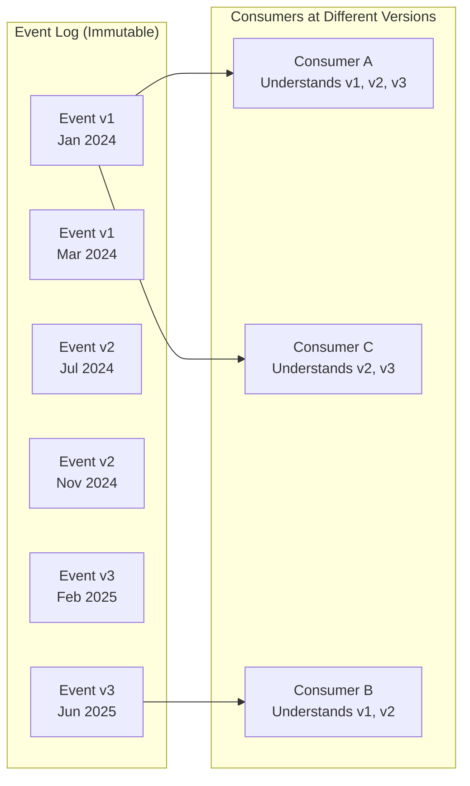
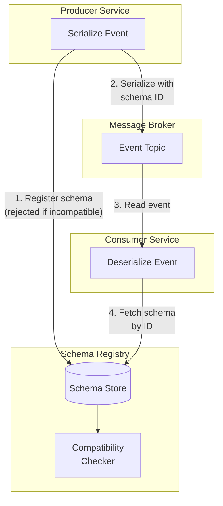
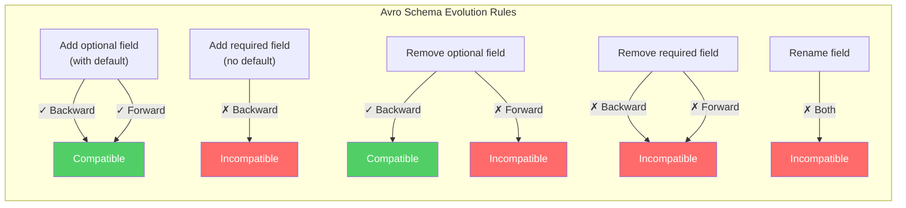

# Event Schema Evolution

Event schemas will change. New fields get added, old fields get removed, field types change, and entire event structures get redesigned. In a monolith, changing a data structure is a refactor — your compiler catches every caller. In an event-driven system, changing an event schema can silently break every consumer, corrupt data pipelines, and crash services that process events from before the change.

Schema evolution is the discipline of changing event schemas safely — ensuring that old consumers can read new events, new consumers can read old events, and the system continues to function during the transition period when both old and new versions coexist.

## First Principles: Why Schema Evolution Is Hard

In a request/response API (REST, gRPC), schema evolution is manageable because:
1. **Clients and servers are updated together** (or at least within a deployment window)
2. **Old requests are gone** — once a client upgrades, it stops sending old formats
3. **Versioning is explicit** — `/api/v1/orders` vs `/api/v2/orders`

Events are fundamentally different because:
1. **Events are immutable** — an event published in 2024 with schema v1 is still in the log in 2026
2. **Consumers upgrade independently** — consumer A may upgrade to schema v3 while consumer B is still on v1
3. **Events are replayed** — rebuilding a read model means processing events from the beginning of time, across all schema versions
4. **The time window is infinite** — unlike API requests, events may be years old



## Compatibility Modes

There are four types of schema compatibility:

### Backward Compatibility

**New schema can read data written by old schema.**

The new consumer can process events produced by old producers. This is the most common requirement — when you deploy a new version of a consumer, it must be able to process events that were published before the upgrade.

Rules for backward compatibility:
- **You CAN add new fields** (with defaults)
- **You CAN remove optional fields**
- **You CANNOT remove required fields**
- **You CANNOT change field types**

```typescript
// Version 1: Original event
interface OrderPlacedV1 {
  eventType: 'order.placed';
  eventVersion: 1;
  data: {
    orderId: string;
    customerId: string;
    totalAmount: number;
    placedAt: string;
  };
}

// Version 2: Backward compatible — added currency field with default
interface OrderPlacedV2 {
  eventType: 'order.placed';
  eventVersion: 2;
  data: {
    orderId: string;
    customerId: string;
    totalAmount: number;
    currency: string;    // NEW: defaults to 'USD' if missing
    placedAt: string;
    channel?: string;    // NEW: optional field
  };
}

// V2 consumer reading V1 event:
function handleOrderPlaced(event: OrderPlacedV1 | OrderPlacedV2): void {
  const currency = 'currency' in event.data
    ? event.data.currency
    : 'USD'; // Default for V1 events

  const channel = 'channel' in event.data
    ? event.data.channel
    : undefined; // Optional, may not exist
}
```

### Forward Compatibility

**Old schema can read data written by new schema.**

The old consumer can process events produced by new producers. This is important during rolling deployments — the new producer may start publishing v2 events while some consumer instances are still running v1 code.

Rules for forward compatibility:
- **You CAN add new fields** (old consumers ignore them)
- **You CAN remove optional fields**
- **You CANNOT remove required fields** that old consumers depend on
- **You CANNOT change field types**

```typescript
// Forward compatibility: V1 consumer receiving V2 event
// The V1 consumer simply ignores the 'currency' and 'channel' fields
// it doesn't know about. It reads orderId, customerId, totalAmount,
// and placedAt — all still present.
```

### Full Compatibility (Backward + Forward)

**Both old and new schemas can read data written by the other.**

This is the gold standard. It means you can deploy producers and consumers in any order, roll back freely, and replay old events through new consumers.

### Breaking Changes (No Compatibility)

When you fundamentally restructure an event — rename fields, change types, split into multiple events — you have a breaking change. Handle this by creating a new event type entirely.

```typescript
// BREAKING CHANGE: Don't do this to an existing event
// Instead, create a new event type

// Old: OrderPlacedV1 with totalAmount as number
// New: OrderPlacedV2 with totalAmount as { value: number, currency: string }
// This is a type change — breaking.

// CORRECT approach: Create a new event type
interface OrderPlacedWithCurrency {
  eventType: 'order.placed_v2'; // New event type
  data: {
    orderId: string;
    customerId: string;
    total: {
      value: number;
      currency: string;
    };
    placedAt: string;
  };
}

// Publish BOTH during transition period:
await eventBus.publish('order.placed', legacyFormat);
await eventBus.publish('order.placed_v2', newFormat);
// After all consumers migrate, stop publishing the old one.
```

## Schema Registry

A schema registry is a centralized service that stores and validates event schemas. It enforces compatibility rules automatically — if a producer tries to register a new schema version that breaks backward compatibility, the registry rejects it.



### TypeScript Schema Registry

```typescript
// infrastructure/SchemaRegistry.ts

interface SchemaDefinition {
  schemaId: string;
  eventType: string;
  version: number;
  schema: JSONSchema;
  compatibility: 'backward' | 'forward' | 'full' | 'none';
  registeredAt: string;
}

interface JSONSchema {
  type: string;
  properties: Record<string, {
    type: string;
    description?: string;
    default?: unknown;
  }>;
  required: string[];
  additionalProperties: boolean;
}

class SchemaRegistry {
  constructor(private readonly db: Database) {}

  /**
   * Register a new schema version.
   * Validates compatibility with the previous version.
   */
  async register(
    eventType: string,
    schema: JSONSchema,
    compatibility: 'backward' | 'forward' | 'full' | 'none' = 'backward',
  ): Promise<SchemaDefinition> {
    // Get the latest version for this event type
    const latest = await this.getLatestSchema(eventType);

    if (latest && compatibility !== 'none') {
      // Validate compatibility
      const violations = this.checkCompatibility(
        latest.schema,
        schema,
        compatibility,
      );

      if (violations.length > 0) {
        throw new SchemaIncompatibleError(
          `Schema for "${eventType}" is not ${compatibility} compatible:\n` +
          violations.map(v => `  - ${v}`).join('\n'),
        );
      }
    }

    const version = latest ? latest.version + 1 : 1;
    const schemaId = `${eventType}:v${version}`;

    const definition: SchemaDefinition = {
      schemaId,
      eventType,
      version,
      schema,
      compatibility,
      registeredAt: new Date().toISOString(),
    };

    await this.db.query(
      `INSERT INTO schemas (schema_id, event_type, version, schema, compatibility, registered_at)
       VALUES ($1, $2, $3, $4, $5, $6)`,
      [schemaId, eventType, version, JSON.stringify(schema), compatibility, definition.registeredAt],
    );

    return definition;
  }

  async getLatestSchema(eventType: string): Promise<SchemaDefinition | null> {
    const result = await this.db.query(
      `SELECT * FROM schemas
       WHERE event_type = $1
       ORDER BY version DESC
       LIMIT 1`,
      [eventType],
    );

    return result.rows[0] ?? null;
  }

  async getSchema(eventType: string, version: number): Promise<SchemaDefinition | null> {
    const result = await this.db.query(
      `SELECT * FROM schemas
       WHERE event_type = $1 AND version = $2`,
      [eventType, version],
    );

    return result.rows[0] ?? null;
  }

  /**
   * Check compatibility between old and new schemas.
   * Returns an array of violation descriptions.
   */
  private checkCompatibility(
    oldSchema: JSONSchema,
    newSchema: JSONSchema,
    mode: 'backward' | 'forward' | 'full',
  ): string[] {
    const violations: string[] = [];

    if (mode === 'backward' || mode === 'full') {
      // New consumer reads old data:
      // Old required fields must still exist in new schema
      for (const field of oldSchema.required) {
        if (!newSchema.properties[field]) {
          violations.push(
            `Backward: Required field "${field}" was removed from new schema`,
          );
        }
      }

      // Field types must not change
      for (const [field, oldDef] of Object.entries(oldSchema.properties)) {
        const newDef = newSchema.properties[field];
        if (newDef && newDef.type !== oldDef.type) {
          violations.push(
            `Backward: Field "${field}" type changed from "${oldDef.type}" to "${newDef.type}"`,
          );
        }
      }

      // New required fields must have defaults (so old events without them work)
      for (const field of newSchema.required) {
        if (!oldSchema.properties[field]) {
          const newDef = newSchema.properties[field];
          if (!newDef || newDef.default === undefined) {
            violations.push(
              `Backward: New required field "${field}" has no default value`,
            );
          }
        }
      }
    }

    if (mode === 'forward' || mode === 'full') {
      // Old consumer reads new data:
      // New schema must not remove fields that old schema requires
      for (const field of oldSchema.required) {
        if (!newSchema.properties[field]) {
          violations.push(
            `Forward: Required field "${field}" was removed (old consumers need it)`,
          );
        }
      }
    }

    return violations;
  }
}

class SchemaIncompatibleError extends Error {
  constructor(message: string) {
    super(message);
    this.name = 'SchemaIncompatibleError';
  }
}
```

### Validating Events Against Schemas

```typescript
// infrastructure/SchemaValidator.ts

import Ajv, { ValidateFunction } from 'ajv';

class SchemaValidator {
  private ajv = new Ajv({ allErrors: true, useDefaults: true });
  private validators = new Map<string, ValidateFunction>();

  constructor(private readonly registry: SchemaRegistry) {}

  /**
   * Validate an event against its registered schema.
   * Also applies default values for missing optional fields.
   */
  async validate(event: {
    eventType: string;
    eventVersion: number;
    data: unknown;
  }): Promise<ValidationResult> {
    const cacheKey = `${event.eventType}:v${event.eventVersion}`;

    let validator = this.validators.get(cacheKey);
    if (!validator) {
      const schemaDef = await this.registry.getSchema(
        event.eventType,
        event.eventVersion,
      );

      if (!schemaDef) {
        return {
          valid: false,
          errors: [`No schema registered for ${cacheKey}`],
        };
      }

      validator = this.ajv.compile(schemaDef.schema);
      this.validators.set(cacheKey, validator);
    }

    const valid = validator(event.data);

    return {
      valid: valid as boolean,
      errors: valid
        ? []
        : (validator.errors ?? []).map(e => `${e.instancePath} ${e.message}`),
    };
  }
}

interface ValidationResult {
  valid: boolean;
  errors: string[];
}
```

## Avro Serialization

Apache Avro is the standard serialization format for event-driven systems, particularly with Kafka. It provides compact binary encoding and built-in schema evolution support.

### Avro Schema Example

```json
{
  "type": "record",
  "name": "OrderPlaced",
  "namespace": "com.example.events",
  "fields": [
    {
      "name": "orderId",
      "type": "string",
      "doc": "Unique identifier for the order"
    },
    {
      "name": "customerId",
      "type": "string",
      "doc": "Customer who placed the order"
    },
    {
      "name": "totalAmount",
      "type": "double",
      "doc": "Total order amount in the specified currency"
    },
    {
      "name": "currency",
      "type": "string",
      "default": "USD",
      "doc": "ISO 4217 currency code"
    },
    {
      "name": "channel",
      "type": ["null", "string"],
      "default": null,
      "doc": "Sales channel (web, mobile, api)"
    },
    {
      "name": "placedAt",
      "type": "string",
      "doc": "ISO 8601 timestamp"
    }
  ]
}
```

### Avro Compatibility Rules



### TypeScript Avro Integration

```typescript
// infrastructure/AvroSerializer.ts

import { Type } from 'avsc';

class AvroEventSerializer {
  private types = new Map<string, Type>();

  constructor(private readonly registry: SchemaRegistry) {}

  /**
   * Register an Avro schema for an event type.
   */
  registerType(eventType: string, avroSchema: object): void {
    const type = Type.forSchema(avroSchema as any);
    this.types.set(eventType, type);
  }

  /**
   * Serialize an event to a compact binary format.
   * Includes a 5-byte header: magic byte + 4-byte schema ID.
   */
  serialize(eventType: string, data: Record<string, unknown>): Buffer {
    const type = this.types.get(eventType);
    if (!type) {
      throw new Error(`No Avro schema registered for ${eventType}`);
    }

    // Validate against schema
    const errors: string[] = [];
    type.isValid(data, { errorHook: (path, val, type) => {
      errors.push(`${path.join('.')}: expected ${type}, got ${typeof val}`);
    }});

    if (errors.length > 0) {
      throw new Error(`Avro validation failed:\n${errors.join('\n')}`);
    }

    return type.toBuffer(data);
  }

  /**
   * Deserialize binary data back to an object.
   * Handles schema evolution: reads with the writer's schema,
   * then resolves to the reader's schema.
   */
  deserialize(
    eventType: string,
    buffer: Buffer,
    writerSchemaVersion?: number,
  ): Record<string, unknown> {
    const readerType = this.types.get(eventType);
    if (!readerType) {
      throw new Error(`No Avro schema registered for ${eventType}`);
    }

    // If writer used a different schema version, resolve the difference
    if (writerSchemaVersion) {
      const writerType = this.types.get(`${eventType}:v${writerSchemaVersion}`);
      if (writerType) {
        const resolver = readerType.createResolver(writerType);
        return readerType.fromBuffer(buffer, resolver);
      }
    }

    return readerType.fromBuffer(buffer);
  }
}
```

## Versioned Events Pattern

The simplest approach to schema evolution: include the version number in the event and use a version-aware deserializer.

```typescript
// events/VersionedEventHandler.ts

// Define all versions of an event
interface OrderPlacedV1Data {
  orderId: string;
  customerId: string;
  totalAmount: number;
  placedAt: string;
}

interface OrderPlacedV2Data {
  orderId: string;
  customerId: string;
  totalAmount: number;
  currency: string;
  placedAt: string;
}

interface OrderPlacedV3Data {
  orderId: string;
  customerId: string;
  total: { value: number; currency: string };
  items: Array<{ productId: string; quantity: number }>;
  channel: 'web' | 'mobile' | 'api';
  placedAt: string;
}

// Upcaster: converts old versions to the latest version
class OrderPlacedUpcaster {
  /**
   * Upcast any version of OrderPlaced to the latest version.
   * This is a pure function — the original event is not modified.
   */
  upcast(event: { eventVersion: number; data: unknown }): OrderPlacedV3Data {
    switch (event.eventVersion) {
      case 1:
        return this.upcastV1ToV3(event.data as OrderPlacedV1Data);
      case 2:
        return this.upcastV2ToV3(event.data as OrderPlacedV2Data);
      case 3:
        return event.data as OrderPlacedV3Data;
      default:
        throw new Error(`Unknown OrderPlaced version: ${event.eventVersion}`);
    }
  }

  private upcastV1ToV3(v1: OrderPlacedV1Data): OrderPlacedV3Data {
    return {
      orderId: v1.orderId,
      customerId: v1.customerId,
      total: {
        value: v1.totalAmount,
        currency: 'USD', // V1 didn't have currency — assume USD
      },
      items: [], // V1 didn't have items — empty array
      channel: 'web', // V1 didn't have channel — assume web
      placedAt: v1.placedAt,
    };
  }

  private upcastV2ToV3(v2: OrderPlacedV2Data): OrderPlacedV3Data {
    return {
      orderId: v2.orderId,
      customerId: v2.customerId,
      total: {
        value: v2.totalAmount,
        currency: v2.currency,
      },
      items: [], // V2 didn't have items — empty array
      channel: 'web', // V2 didn't have channel — assume web
      placedAt: v2.placedAt,
    };
  }
}

// Handler only deals with the latest version
class OrderPlacedHandler {
  constructor(private readonly upcaster: OrderPlacedUpcaster) {}

  async handle(event: { eventVersion: number; data: unknown }): Promise<void> {
    // Upcast to latest version regardless of what was stored
    const data = this.upcaster.upcast(event);

    // Now work with the latest version only
    console.log(`Order ${data.orderId}: ${data.total.value} ${data.total.currency}`);
    console.log(`Channel: ${data.channel}`);
    console.log(`Items: ${data.items.length}`);
  }
}
```

## Event Upcasting Pipeline

For systems with many event types and many versions, a generic upcasting pipeline:

```typescript
// infrastructure/UpcastingPipeline.ts

interface EventUpcaster<TFrom = unknown, TTo = unknown> {
  eventType: string;
  fromVersion: number;
  toVersion: number;
  upcast(data: TFrom): TTo;
}

class UpcastingPipeline {
  private upcasters: Map<string, EventUpcaster[]> = new Map();

  /**
   * Register an upcaster for a specific version transition.
   */
  register(upcaster: EventUpcaster): void {
    const key = upcaster.eventType;
    if (!this.upcasters.has(key)) {
      this.upcasters.set(key, []);
    }
    this.upcasters.get(key)!.push(upcaster);

    // Sort by fromVersion so the chain is in order
    this.upcasters.get(key)!.sort((a, b) => a.fromVersion - b.fromVersion);
  }

  /**
   * Upcast an event from its stored version to the target version.
   * Chains upcasters: v1 → v2 → v3 → ... → target
   */
  upcast(
    eventType: string,
    fromVersion: number,
    targetVersion: number,
    data: unknown,
  ): unknown {
    if (fromVersion === targetVersion) {
      return data; // Already at target version
    }

    if (fromVersion > targetVersion) {
      throw new Error(
        `Cannot downcast from v${fromVersion} to v${targetVersion}`,
      );
    }

    const chain = this.upcasters.get(eventType) ?? [];
    let currentData = data;
    let currentVersion = fromVersion;

    for (const upcaster of chain) {
      if (upcaster.fromVersion < currentVersion) continue;
      if (upcaster.fromVersion > currentVersion) {
        throw new Error(
          `Missing upcaster for ${eventType} v${currentVersion} → v${upcaster.fromVersion}`,
        );
      }
      if (currentVersion >= targetVersion) break;

      currentData = upcaster.upcast(currentData);
      currentVersion = upcaster.toVersion;
    }

    if (currentVersion !== targetVersion) {
      throw new Error(
        `Could not upcast ${eventType} from v${fromVersion} to v${targetVersion}. ` +
        `Reached v${currentVersion}.`,
      );
    }

    return currentData;
  }
}

// Register upcasters for OrderPlaced
const pipeline = new UpcastingPipeline();

pipeline.register({
  eventType: 'order.placed',
  fromVersion: 1,
  toVersion: 2,
  upcast: (data: OrderPlacedV1Data): OrderPlacedV2Data => ({
    ...data,
    currency: 'USD',
  }),
});

pipeline.register({
  eventType: 'order.placed',
  fromVersion: 2,
  toVersion: 3,
  upcast: (data: OrderPlacedV2Data): OrderPlacedV3Data => ({
    orderId: data.orderId,
    customerId: data.customerId,
    total: { value: data.totalAmount, currency: data.currency },
    items: [],
    channel: 'web',
    placedAt: data.placedAt,
  }),
});

// Usage: upcast from any version to v3
const v3Data = pipeline.upcast('order.placed', 1, 3, v1EventData);
```

## JSON Schema Evolution

For systems that use JSON (without Avro), define and validate schemas using JSON Schema:

```typescript
// schemas/OrderPlacedSchemas.ts

const OrderPlacedV1Schema = {
  $id: 'https://example.com/schemas/order-placed/v1',
  type: 'object',
  properties: {
    orderId: { type: 'string' },
    customerId: { type: 'string' },
    totalAmount: { type: 'number' },
    placedAt: { type: 'string', format: 'date-time' },
  },
  required: ['orderId', 'customerId', 'totalAmount', 'placedAt'],
  additionalProperties: false,
};

const OrderPlacedV2Schema = {
  $id: 'https://example.com/schemas/order-placed/v2',
  type: 'object',
  properties: {
    orderId: { type: 'string' },
    customerId: { type: 'string' },
    totalAmount: { type: 'number' },
    currency: { type: 'string', default: 'USD' },
    channel: { type: 'string', enum: ['web', 'mobile', 'api'] },
    placedAt: { type: 'string', format: 'date-time' },
  },
  required: ['orderId', 'customerId', 'totalAmount', 'currency', 'placedAt'],
  additionalProperties: false,
};
```

## Contract Testing for Events

Schema evolution must be validated automatically. Contract testing ensures producers and consumers agree on the event format:

```typescript
// __tests__/contracts/OrderPlacedContract.test.ts

describe('OrderPlaced Event Contract', () => {
  const registry = new SchemaRegistry(testDb);
  const validator = new SchemaValidator(registry);

  beforeAll(async () => {
    // Register schemas
    await registry.register('order.placed', OrderPlacedV1Schema, 'full');
    await registry.register('order.placed', OrderPlacedV2Schema, 'full');
  });

  describe('backward compatibility', () => {
    it('V2 consumer can read V1 events', () => {
      const v1Event = {
        eventType: 'order.placed',
        eventVersion: 1,
        data: {
          orderId: 'ord-1',
          customerId: 'cust-1',
          totalAmount: 99.99,
          placedAt: '2025-01-15T10:00:00Z',
        },
      };

      // V2 handler should process V1 event without errors
      const upcaster = new OrderPlacedUpcaster();
      const upcasted = upcaster.upcast(v1Event);

      expect(upcasted.orderId).toBe('ord-1');
      expect(upcasted.total.currency).toBe('USD'); // Default applied
    });
  });

  describe('forward compatibility', () => {
    it('V1 consumer can read V2 events (ignoring unknown fields)', () => {
      const v2Event = {
        eventType: 'order.placed',
        eventVersion: 2,
        data: {
          orderId: 'ord-1',
          customerId: 'cust-1',
          totalAmount: 99.99,
          currency: 'EUR',
          channel: 'mobile',
          placedAt: '2025-01-15T10:00:00Z',
        },
      };

      // V1 consumer should be able to read the fields it knows about
      const v1View: OrderPlacedV1Data = {
        orderId: v2Event.data.orderId,
        customerId: v2Event.data.customerId,
        totalAmount: v2Event.data.totalAmount,
        placedAt: v2Event.data.placedAt,
      };

      expect(v1View.orderId).toBe('ord-1');
      expect(v1View.totalAmount).toBe(99.99);
    });
  });

  describe('schema registration', () => {
    it('rejects incompatible schema changes', async () => {
      // Try to register a schema that removes a required field
      const breakingSchema = {
        type: 'object',
        properties: {
          orderId: { type: 'string' },
          // customerId removed — breaking change!
          totalAmount: { type: 'number' },
          placedAt: { type: 'string' },
        },
        required: ['orderId', 'totalAmount', 'placedAt'],
        additionalProperties: false,
      };

      await expect(
        registry.register('order.placed', breakingSchema, 'backward'),
      ).rejects.toThrow(SchemaIncompatibleError);
    });
  });
});
```

## Migration Strategies

### Strategy 1: Dual Publishing

Publish both old and new event versions during the transition period:

```typescript
// During migration: publish both V1 and V2
class DualPublishingOrderService {
  async placeOrder(command: PlaceOrderCommand): Promise<string> {
    const order = Order.create(command);
    await this.orderRepo.save(order);

    // Publish V1 for old consumers
    await this.eventBus.publish('order.placed', {
      eventVersion: 1,
      data: {
        orderId: order.id,
        customerId: order.customerId,
        totalAmount: order.totalAmount,
        placedAt: order.placedAt,
      },
    });

    // Publish V2 for new consumers
    await this.eventBus.publish('order.placed', {
      eventVersion: 2,
      data: {
        orderId: order.id,
        customerId: order.customerId,
        totalAmount: order.totalAmount,
        currency: order.currency,
        channel: order.channel,
        placedAt: order.placedAt,
      },
    });

    return order.id;
  }
}
```

### Strategy 2: Lazy Upcasting

Upcast events on read (when the consumer processes them):

```typescript
// Consumer upcasts on read — no changes to stored events
class LazyUpcastingConsumer {
  constructor(
    private readonly pipeline: UpcastingPipeline,
    private readonly handler: OrderPlacedHandler,
  ) {}

  async processEvent(rawEvent: StoredEvent): Promise<void> {
    const latestVersion = 3;
    const upcastedData = this.pipeline.upcast(
      rawEvent.eventType,
      rawEvent.eventVersion,
      latestVersion,
      rawEvent.data,
    );

    await this.handler.handle({
      ...rawEvent,
      eventVersion: latestVersion,
      data: upcastedData,
    });
  }
}
```

### Strategy 3: Event Store Migration

Rewrite old events in the event store with the new schema (destructive — use with caution):

```typescript
// WARNING: This modifies the event store. Use only when
// lazy upcasting is not feasible (e.g., performance).
class EventStoreMigrator {
  constructor(
    private readonly eventStore: EventStore,
    private readonly pipeline: UpcastingPipeline,
  ) {}

  async migrateEvents(
    eventType: string,
    fromVersion: number,
    toVersion: number,
    batchSize: number = 1000,
  ): Promise<MigrationResult> {
    let totalMigrated = 0;
    let lastPosition = 0;

    while (true) {
      const events = await this.eventStore.readByType(
        eventType,
        fromVersion,
        lastPosition,
        batchSize,
      );

      if (events.length === 0) break;

      for (const event of events) {
        const upcastedData = this.pipeline.upcast(
          eventType,
          fromVersion,
          toVersion,
          event.data,
        );

        await this.eventStore.updateEventData(
          event.eventId,
          toVersion,
          upcastedData,
        );

        totalMigrated++;
        lastPosition = event.globalPosition;
      }

      console.log(`Migrated ${totalMigrated} events so far...`);
    }

    return { totalMigrated };
  }
}
```

## Best Practices Checklist

```
Schema Evolution Checklist:

Before changing an event schema:
[ ] Identify all consumers of this event type
[ ] Determine the compatibility mode (backward, forward, full)
[ ] Verify the change is compatible using the schema registry
[ ] Write contract tests for the old and new versions
[ ] Plan the migration strategy (dual publish, lazy upcast, or migration)

When adding a field:
[ ] Add a default value (for backward compatibility)
[ ] Make it optional if old events won't have it
[ ] Document the new field in the schema

When removing a field:
[ ] Verify no consumers depend on it
[ ] Keep it optional (with null) for one release cycle
[ ] Remove it in the next release

When changing a field type:
[ ] DON'T change the type — create a new field or new event type instead
[ ] If you must, create a new event type with a new name

After deployment:
[ ] Monitor consumer error rates for deserialization failures
[ ] Verify all consumers can process both old and new events
[ ] Clean up dual publishing after all consumers upgrade
```

::: info War Story
An e-commerce platform changed the `totalAmount` field in their `OrderPlaced` event from a number (cents as integer) to an object (`{ value: number, currency: string }`). They deployed the producer first. Within 30 seconds, the analytics pipeline crashed because it tried to do arithmetic on an object. The notification service crashed because it tried to format a number for display but got `[object Object]`. The inventory service was fine because it did not use the `totalAmount` field. The fix was to create a new event type `order.placed_v2` with the new structure, publish both versions during the transition, and migrate consumers one at a time. The lesson: never change a field's type in an existing event schema — always create a new event type for breaking changes.
:::

::: tip Summary
Schema evolution is the tax you pay for the benefits of event-driven architecture. Pay it consciously by choosing a compatibility mode, using a schema registry to enforce it, writing contract tests to verify it, and using upcasting to handle the transition. The most important rule: never change the type of an existing field in an existing event. Add new fields with defaults, remove optional fields after all consumers stop using them, and create new event types for breaking structural changes.
:::
