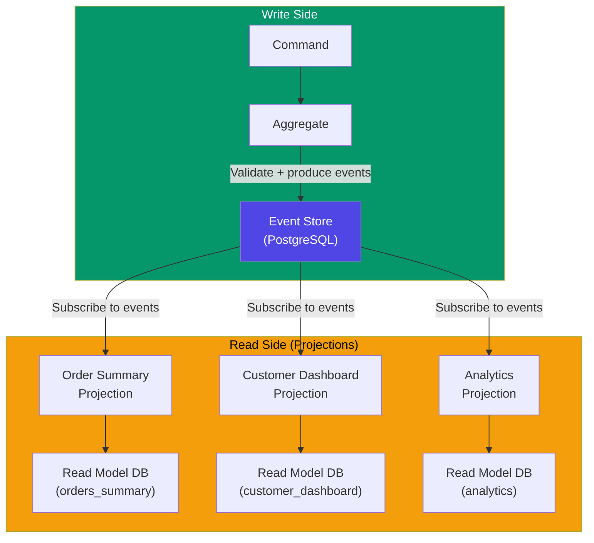
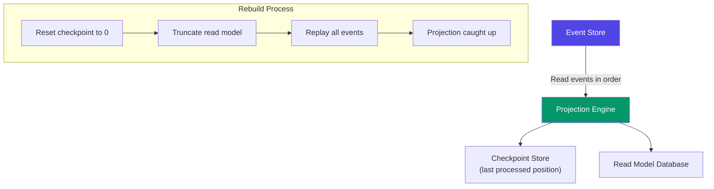
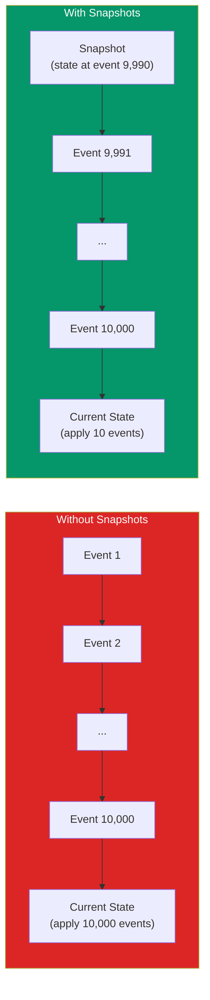

# Event Sourcing in Practice

The theory of event sourcing is straightforward: instead of storing current state, store the sequence of events that produced that state. The practice is where teams struggle. How do you design the event store? How do you rebuild projections when the schema changes? How do you handle a stream with 10 million events without loading all of them? How do you test a system where state is derived from history?

This page answers every practical question. It assumes you understand the fundamentals of event sourcing (see [Event Sourcing Deep Dive](/architecture-patterns/cqrs-event-sourcing/event-sourcing-deep-dive)) and focuses on implementation — the code, the data models, the operational procedures, and the mistakes that will cost you time if you make them.

## Event Store Design

The event store is the single source of truth in an event-sourced system. Every write goes through it. Every read (eventually) derives from it. Getting the event store design right is the most important decision in the entire architecture.

### Event Store Schema (PostgreSQL)

PostgreSQL is a solid choice for an event store. It provides ACID transactions, LISTEN/NOTIFY for real-time subscriptions, and you already know how to operate it.

```sql
-- Event store schema
CREATE TABLE events (
    -- Global position — monotonically increasing across all streams
    global_position BIGSERIAL PRIMARY KEY,

    -- Stream identity
    stream_id TEXT NOT NULL,
    stream_position INTEGER NOT NULL,

    -- Event data
    event_type TEXT NOT NULL,
    data JSONB NOT NULL,
    metadata JSONB NOT NULL DEFAULT '{}',

    -- Timestamps
    created_at TIMESTAMPTZ NOT NULL DEFAULT now(),

    -- Optimistic concurrency — no two events in the same stream
    -- can have the same position
    UNIQUE (stream_id, stream_position)
);

-- Index for reading a stream
CREATE INDEX idx_events_stream ON events (stream_id, stream_position);

-- Index for reading all events in order (for projections)
CREATE INDEX idx_events_global ON events (global_position);

-- Index for reading events by type (for specific projections)
CREATE INDEX idx_events_type ON events (event_type, global_position);

-- Notification trigger for real-time subscriptions
CREATE OR REPLACE FUNCTION notify_new_event() RETURNS TRIGGER AS $$
BEGIN
    PERFORM pg_notify('new_event', json_build_object(
        'global_position', NEW.global_position,
        'stream_id', NEW.stream_id,
        'event_type', NEW.event_type
    )::text);
    RETURN NEW;
END;
$$ LANGUAGE plpgsql;

CREATE TRIGGER events_notify
    AFTER INSERT ON events
    FOR EACH ROW EXECUTE FUNCTION notify_new_event();
```

### Event Store Architecture



### TypeScript Event Store Implementation

```typescript
// event-store.ts
import { Pool } from 'pg';

interface DomainEvent {
  eventType: string;
  data: Record<string, unknown>;
  metadata?: Record<string, unknown>;
}

interface StoredEvent extends DomainEvent {
  globalPosition: number;
  streamId: string;
  streamPosition: number;
  createdAt: Date;
}

class PostgresEventStore {
  constructor(private pool: Pool) {}

  // Append events to a stream with optimistic concurrency
  async appendToStream(
    streamId: string,
    expectedVersion: number,
    events: DomainEvent[]
  ): Promise<StoredEvent[]> {
    const client = await this.pool.connect();
    try {
      await client.query('BEGIN');

      // Check current stream version
      const result = await client.query(
        'SELECT COALESCE(MAX(stream_position), -1) AS version FROM events WHERE stream_id = $1',
        [streamId]
      );
      const currentVersion = result.rows[0].version;

      if (currentVersion !== expectedVersion) {
        throw new ConcurrencyError(
          `Expected version ${expectedVersion} but found ${currentVersion} for stream ${streamId}`
        );
      }

      const stored: StoredEvent[] = [];
      for (let i = 0; i < events.length; i++) {
        const event = events[i];
        const position = expectedVersion + 1 + i;

        const insertResult = await client.query(
          `INSERT INTO events (stream_id, stream_position, event_type, data, metadata)
           VALUES ($1, $2, $3, $4, $5)
           RETURNING global_position, created_at`,
          [streamId, position, event.eventType, event.data, event.metadata || {}]
        );

        stored.push({
          ...event,
          globalPosition: insertResult.rows[0].global_position,
          streamId,
          streamPosition: position,
          createdAt: insertResult.rows[0].created_at,
        });
      }

      await client.query('COMMIT');
      return stored;
    } catch (err) {
      await client.query('ROLLBACK');
      throw err;
    } finally {
      client.release();
    }
  }

  // Read all events for a stream
  async readStream(streamId: string, fromPosition = 0): Promise<StoredEvent[]> {
    const result = await this.pool.query(
      `SELECT global_position, stream_id, stream_position, event_type, data, metadata, created_at
       FROM events
       WHERE stream_id = $1 AND stream_position >= $2
       ORDER BY stream_position ASC`,
      [streamId, fromPosition]
    );

    return result.rows.map(row => ({
      globalPosition: row.global_position,
      streamId: row.stream_id,
      streamPosition: row.stream_position,
      eventType: row.event_type,
      data: row.data,
      metadata: row.metadata,
      createdAt: row.created_at,
    }));
  }

  // Read all events globally (for projections)
  async readAll(fromPosition = 0, limit = 1000): Promise<StoredEvent[]> {
    const result = await this.pool.query(
      `SELECT global_position, stream_id, stream_position, event_type, data, metadata, created_at
       FROM events
       WHERE global_position > $1
       ORDER BY global_position ASC
       LIMIT $2`,
      [fromPosition, limit]
    );

    return result.rows.map(row => ({
      globalPosition: row.global_position,
      streamId: row.stream_id,
      streamPosition: row.stream_position,
      eventType: row.event_type,
      data: row.data,
      metadata: row.metadata,
      createdAt: row.created_at,
    }));
  }
}

class ConcurrencyError extends Error {
  constructor(message: string) {
    super(message);
    this.name = 'ConcurrencyError';
  }
}
```

### EventStoreDB Alternative

For teams that want a purpose-built event store, EventStoreDB is the leading option:

```typescript
// Using EventStoreDB client
import { EventStoreDBClient, jsonEvent, FORWARDS, START } from '@eventstore/db-client';

const client = EventStoreDBClient.connectionString(
  'esdb://localhost:2113?tls=false'
);

// Append events
const event = jsonEvent({
  type: 'OrderPlaced',
  data: { orderId: '123', customerId: '456', total: 99.99 },
  metadata: { userId: '789', correlationId: 'abc' },
});

await client.appendToStream(`order-123`, event, {
  expectedRevision: 'no_stream', // First event in stream
});

// Read stream
const events = client.readStream('order-123', {
  direction: FORWARDS,
  fromRevision: START,
});

for await (const resolvedEvent of events) {
  console.log(resolvedEvent.event?.type, resolvedEvent.event?.data);
}
```

| Feature | PostgreSQL Event Store | EventStoreDB |
|---------|----------------------|---------------|
| Setup complexity | Low (you already run PG) | Medium (new service) |
| Subscriptions | LISTEN/NOTIFY (basic) | Built-in persistent subscriptions |
| Projections | Custom code | Built-in JavaScript projections |
| Scalability | Millions of events | Billions of events |
| Operations | You know how to run PG | Learn new operational model |
| Community | Large (PostgreSQL) | Smaller (specialized) |

## Projection Rebuilding

Projections transform the event stream into read-optimized views. They will need to be rebuilt when:
1. A bug in the projection logic is fixed
2. A new projection is added
3. The read model schema changes

### Projection Architecture



### Projection Implementation

```typescript
// projection-engine.ts

interface Projection {
  name: string;
  handle(event: StoredEvent): Promise<void>;
  reset(): Promise<void>;
}

class ProjectionEngine {
  private checkpoints = new Map<string, number>();

  constructor(
    private eventStore: PostgresEventStore,
    private checkpointStore: CheckpointStore
  ) {}

  async run(projection: Projection): Promise<void> {
    // Load last checkpoint
    const checkpoint = await this.checkpointStore.get(projection.name);
    let lastPosition = checkpoint ?? 0;

    // Process events in batches
    while (true) {
      const events = await this.eventStore.readAll(lastPosition, 500);

      if (events.length === 0) {
        // Caught up — wait for new events
        await this.waitForNewEvents();
        continue;
      }

      for (const event of events) {
        await projection.handle(event);
        lastPosition = event.globalPosition;
      }

      // Save checkpoint after each batch
      await this.checkpointStore.save(projection.name, lastPosition);
    }
  }

  async rebuild(projection: Projection): Promise<void> {
    console.log(`Rebuilding projection: ${projection.name}`);

    // Reset projection state
    await projection.reset();
    await this.checkpointStore.save(projection.name, 0);

    // Replay all events
    let lastPosition = 0;
    let totalProcessed = 0;

    while (true) {
      const events = await this.eventStore.readAll(lastPosition, 1000);
      if (events.length === 0) break;

      for (const event of events) {
        await projection.handle(event);
        lastPosition = event.globalPosition;
        totalProcessed++;
      }

      await this.checkpointStore.save(projection.name, lastPosition);
      console.log(`Processed ${totalProcessed} events...`);
    }

    console.log(`Rebuild complete. Processed ${totalProcessed} events.`);
  }

  private async waitForNewEvents(): Promise<void> {
    // Use PostgreSQL LISTEN/NOTIFY or polling
    return new Promise(resolve => setTimeout(resolve, 1000));
  }
}
```

### Example Projection: Order Summary

```typescript
// projections/order-summary.ts

class OrderSummaryProjection implements Projection {
  name = 'order-summary';

  constructor(private db: Pool) {}

  async handle(event: StoredEvent): Promise<void> {
    switch (event.eventType) {
      case 'OrderPlaced':
        await this.db.query(
          `INSERT INTO order_summaries (order_id, customer_id, total, status, placed_at)
           VALUES ($1, $2, $3, 'placed', $4)
           ON CONFLICT (order_id) DO UPDATE SET
             customer_id = $2, total = $3, status = 'placed', placed_at = $4`,
          [event.data.orderId, event.data.customerId, event.data.total, event.createdAt]
        );
        break;

      case 'OrderShipped':
        await this.db.query(
          `UPDATE order_summaries SET status = 'shipped', shipped_at = $2 WHERE order_id = $1`,
          [event.data.orderId, event.createdAt]
        );
        break;

      case 'OrderCancelled':
        await this.db.query(
          `UPDATE order_summaries SET status = 'cancelled', cancelled_at = $2, cancel_reason = $3
           WHERE order_id = $1`,
          [event.data.orderId, event.createdAt, event.data.reason]
        );
        break;
    }
  }

  async reset(): Promise<void> {
    await this.db.query('TRUNCATE TABLE order_summaries');
  }
}
```

::: tip Blue-Green Projection Rebuilds
For zero-downtime projection rebuilds: create a new table (or database) for the new projection version, rebuild into it, then swap the old and new tables using a view or DNS change. The old projection continues serving reads during the rebuild.
:::

## Snapshots for Performance

As event streams grow, loading an aggregate requires reading thousands or millions of events. Snapshots solve this by periodically saving the current state.

### Snapshot Strategy



### Snapshot Implementation

```sql
-- Snapshot storage table
CREATE TABLE snapshots (
    stream_id TEXT NOT NULL,
    stream_position INTEGER NOT NULL,
    state JSONB NOT NULL,
    created_at TIMESTAMPTZ NOT NULL DEFAULT now(),
    PRIMARY KEY (stream_id)
);
```

```typescript
// aggregate-repository.ts

class AggregateRepository<T extends Aggregate> {
  private snapshotInterval = 100; // Snapshot every 100 events

  constructor(
    private eventStore: PostgresEventStore,
    private snapshotStore: SnapshotStore,
    private aggregateFactory: () => T
  ) {}

  async load(streamId: string): Promise<T> {
    const aggregate = this.aggregateFactory();

    // Try to load snapshot first
    const snapshot = await this.snapshotStore.get(streamId);

    if (snapshot) {
      aggregate.restoreFromSnapshot(snapshot.state);
      aggregate.version = snapshot.streamPosition;
    }

    // Load events after snapshot (or from beginning if no snapshot)
    const events = await this.eventStore.readStream(
      streamId,
      snapshot ? snapshot.streamPosition + 1 : 0
    );

    for (const event of events) {
      aggregate.apply(event);
      aggregate.version = event.streamPosition;
    }

    return aggregate;
  }

  async save(aggregate: T): Promise<void> {
    const uncommittedEvents = aggregate.getUncommittedEvents();

    if (uncommittedEvents.length === 0) return;

    // Append events
    await this.eventStore.appendToStream(
      aggregate.streamId,
      aggregate.version,
      uncommittedEvents
    );

    // Create snapshot if threshold reached
    const newVersion = aggregate.version + uncommittedEvents.length;
    if (newVersion % this.snapshotInterval === 0) {
      await this.snapshotStore.save(
        aggregate.streamId,
        newVersion,
        aggregate.toSnapshot()
      );
    }

    aggregate.clearUncommittedEvents();
  }
}
```

::: warning Snapshot Versioning
When you change your aggregate's internal representation, old snapshots become incompatible. Either: (1) version your snapshot schema and write migration code, or (2) delete all snapshots and let them regenerate naturally from events. Option 2 is simpler and causes only a temporary performance hit.
:::

## Testing Event-Sourced Systems

Event-sourced systems have a natural testing pattern: **Given** (past events) → **When** (command) → **Then** (expected new events).

### Given-When-Then Pattern

```typescript
// tests/order-aggregate.test.ts

describe('Order Aggregate', () => {
  it('should place an order', () => {
    // Given: no previous events (new stream)
    const order = new OrderAggregate();

    // When: place order command
    order.place({
      orderId: 'order-1',
      customerId: 'cust-1',
      items: [{ productId: 'prod-1', quantity: 2, price: 29.99 }],
    });

    // Then: OrderPlaced event produced
    const events = order.getUncommittedEvents();
    expect(events).toHaveLength(1);
    expect(events[0].eventType).toBe('OrderPlaced');
    expect(events[0].data.total).toBe(59.98);
  });

  it('should not ship a cancelled order', () => {
    // Given: order was placed and then cancelled
    const order = new OrderAggregate();
    order.apply({
      eventType: 'OrderPlaced',
      data: { orderId: 'order-1', customerId: 'cust-1', total: 59.98 },
    });
    order.apply({
      eventType: 'OrderCancelled',
      data: { orderId: 'order-1', reason: 'Customer request' },
    });

    // When: attempt to ship
    // Then: error thrown
    expect(() => order.ship()).toThrow('Cannot ship a cancelled order');
    expect(order.getUncommittedEvents()).toHaveLength(0);
  });

  it('should rebuild state from events', () => {
    // Given: a series of events
    const events = [
      { eventType: 'OrderPlaced', data: { orderId: '1', total: 100 } },
      { eventType: 'OrderShipped', data: { orderId: '1', trackingId: 'TRK-1' } },
    ];

    // When: rebuild aggregate
    const order = new OrderAggregate();
    events.forEach(e => order.apply(e));

    // Then: state matches expected
    expect(order.status).toBe('shipped');
    expect(order.trackingId).toBe('TRK-1');
  });
});
```

### Testing Projections

```typescript
describe('Order Summary Projection', () => {
  it('should create summary on OrderPlaced', async () => {
    const projection = new OrderSummaryProjection(testDb);

    await projection.handle({
      eventType: 'OrderPlaced',
      data: { orderId: '1', customerId: 'c1', total: 99.99 },
      globalPosition: 1,
      streamId: 'order-1',
      streamPosition: 0,
      createdAt: new Date(),
      metadata: {},
    });

    const result = await testDb.query(
      'SELECT * FROM order_summaries WHERE order_id = $1',
      ['1']
    );
    expect(result.rows[0].status).toBe('placed');
    expect(result.rows[0].total).toBe('99.99');
  });
});
```

## Common Pitfalls and Anti-Patterns

### Pitfall 1: Too Many Event Types

```typescript
// BAD: Dozens of granular events for every field change
'UserNameChanged'
'UserEmailChanged'
'UserPhoneChanged'
'UserAddressLine1Changed'
'UserAddressLine2Changed'
// ... leads to 50+ event types per aggregate

// GOOD: Meaningful business events
'UserProfileUpdated'   // Contains all changed fields
'UserAddressChanged'   // Contains the new complete address
```

### Pitfall 2: Storing Derived Data in Events

```typescript
// BAD: Storing calculated values that can change
{
  eventType: 'OrderPlaced',
  data: {
    items: [...],
    subtotal: 99.99,
    taxRate: 0.08,          // Tax rates change!
    tax: 8.00,
    shippingCost: 5.99,     // Shipping rates change!
    total: 113.98,
    loyaltyPoints: 114,     // Points formula changes!
  }
}

// GOOD: Store facts, derive calculations
{
  eventType: 'OrderPlaced',
  data: {
    items: [
      { productId: 'p1', quantity: 2, priceAtTime: 49.99 }
    ],
    shippingAddress: { ... },
    paymentMethod: 'card_ending_4242',
  }
}
// Tax, shipping, points are calculated by projections using current rules
```

### Pitfall 3: Large Events

Events should be small facts, not entire documents. If an event is larger than 1KB, reconsider what you are storing.

### Pitfall 4: Using Events for Integration

```typescript
// BAD: Using internal domain events directly as integration events
// Internal events change as the domain evolves, breaking consumers

// GOOD: Publish separate integration events with stable contracts
domainEvent: 'OrderPlacedV3'       // Internal, changes freely
integrationEvent: 'order.placed'    // External, versioned, stable API
```

### Pitfall 5: Not Planning for Schema Evolution

Events are immutable — you cannot change old events. When the schema of an event needs to change, use upcasting:

```typescript
// Upcast old event format to current format
function upcast(event: StoredEvent): StoredEvent {
  if (event.eventType === 'OrderPlaced') {
    // v1 had 'amount', v2 renamed to 'total'
    if ('amount' in event.data && !('total' in event.data)) {
      return {
        ...event,
        data: {
          ...event.data,
          total: event.data.amount,
        },
      };
    }
  }
  return event;
}
```

## Cross-References

- [Event Sourcing Deep Dive](/architecture-patterns/cqrs-event-sourcing/event-sourcing-deep-dive) — theory and fundamentals
- [CQRS Deep Dive](/architecture-patterns/cqrs-event-sourcing/cqrs-deep-dive) — command and query separation
- [Projections](/architecture-patterns/cqrs-event-sourcing/projections) — building read models
- [Snapshots](/architecture-patterns/cqrs-event-sourcing/snapshots) — snapshot strategies
- [Event Upcasting](/architecture-patterns/cqrs-event-sourcing/event-upcasting) — schema evolution
- [Sagas & Process Managers](/architecture-patterns/cqrs-event-sourcing/sagas-process-managers) — long-running processes
- [PostgreSQL DBA Guide](/system-design/databases/postgresql-dba) — operating the event store

## Summary

| Aspect | Recommendation |
|--------|---------------|
| Event store | PostgreSQL for most teams, EventStoreDB for high-volume |
| Concurrency | Optimistic concurrency with stream version checks |
| Projections | Batch processing with checkpoints, rebuild capability |
| Snapshots | Every 100-500 events, with version-aware deserialization |
| Testing | Given-When-Then pattern for aggregates, integration tests for projections |
| Schema evolution | Upcasting, never modify stored events |
| Event design | Small, business-meaningful facts — not CRUD operations |

Event sourcing in practice is not about the event store — that part is straightforward. The complexity lies in projection management, schema evolution, and maintaining the discipline to store facts rather than state. Get those three things right, and event sourcing gives you a complete audit trail, temporal queries, and the ability to ask questions of your data that you have not thought of yet.
