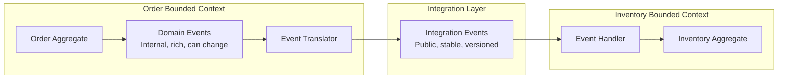
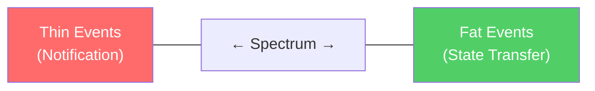

# Event Types in Event-Driven Architecture

Not all events are created equal. The term "event" is overloaded in software architecture — it can mean a domain event within a bounded context, an integration event between services, a notification to trigger a side effect, or a state transfer to replicate data. Each type has different semantics, different coupling characteristics, and different design constraints.

Understanding the taxonomy of events is critical because choosing the wrong type leads to either too much coupling (fat integration events that expose internal domain models) or too little information (thin events that force consumers to call back for details, creating hidden synchronous coupling).

## First Principles: What Is an Event?

An event is an immutable record of a fact that happened in the past. Events are:

- **Past tense** — "OrderPlaced" not "PlaceOrder" (that's a command)
- **Immutable** — once published, an event cannot be changed (you can publish a corrective event)
- **Factual** — they state what happened, not what should happen
- **Owned** — each event has exactly one producer (the service where the fact originated)

The fundamental distinction from commands:

| Aspect | Command | Event |
|---|---|---|
| **Tense** | Imperative ("PlaceOrder") | Past tense ("OrderPlaced") |
| **Direction** | One sender → one receiver | One publisher → many subscribers |
| **Coupling** | Sender knows receiver | Publisher doesn't know subscribers |
| **Semantics** | "Do this thing" | "This thing happened" |
| **Failure** | Sender handles failure | Each subscriber handles its own failure |
| **Can be rejected** | Yes (validation may fail) | No (it already happened) |

## Domain Events

Domain events represent something meaningful that happened within a bounded context. They are part of the ubiquitous language of the domain.

```typescript
// Domain events are the primary output of domain model operations.
// They capture business facts in domain language.

// Good domain events — named in business language
interface OrderPlaced {
  eventType: 'OrderPlaced';
  orderId: string;
  customerId: string;
  items: Array<{
    productId: string;
    productName: string;
    quantity: number;
    unitPrice: number;
  }>;
  totalAmount: number;
  placedAt: string;
}

interface PaymentReceived {
  eventType: 'PaymentReceived';
  paymentId: string;
  orderId: string;
  amount: number;
  method: 'credit_card' | 'bank_transfer' | 'wallet';
  receivedAt: string;
}

interface ShipmentDispatched {
  eventType: 'ShipmentDispatched';
  shipmentId: string;
  orderId: string;
  trackingNumber: string;
  carrier: string;
  estimatedDelivery: string;
  dispatchedAt: string;
}

// Bad domain events — technical or CRUD-oriented
interface OrderUpdated { // Too vague — what was updated?
  eventType: 'OrderUpdated';
  orderId: string;
  updatedFields: string[];
}

interface DatabaseRowInserted { // Technical, not domain
  eventType: 'DatabaseRowInserted';
  table: string;
  row: Record<string, unknown>;
}
```

### Domain Event Characteristics

1. **Named in ubiquitous language** — domain experts should recognize the event name
2. **Contain the minimum data needed** for consumers within the same bounded context
3. **Raised by aggregates** — the aggregate decides when an event occurs based on domain rules
4. **Processed within the same bounded context** (or translated into integration events for cross-context communication)

### Raising Domain Events from Aggregates

```typescript
// domain/Order.ts

abstract class AggregateRoot {
  private _domainEvents: DomainEvent[] = [];

  protected addDomainEvent(event: DomainEvent): void {
    this._domainEvents.push(event);
  }

  get domainEvents(): ReadonlyArray<DomainEvent> {
    return this._domainEvents;
  }

  clearDomainEvents(): void {
    this._domainEvents = [];
  }
}

class Order extends AggregateRoot {
  private _status: OrderStatus;
  private _items: OrderItem[];
  private _totalAmount: number;

  static create(params: CreateOrderParams): Order {
    const order = new Order();
    order._id = generateUUID();
    order._status = 'pending';
    order._items = params.items.map(item => OrderItem.create(item));
    order._totalAmount = order._items.reduce(
      (sum, item) => sum + item.subtotal,
      0,
    );

    // Domain event raised by the aggregate
    order.addDomainEvent({
      eventType: 'OrderPlaced',
      eventId: generateUUID(),
      timestamp: new Date().toISOString(),
      data: {
        orderId: order._id,
        customerId: params.customerId,
        items: order._items.map(i => i.toSnapshot()),
        totalAmount: order._totalAmount,
      },
    });

    return order;
  }

  confirm(): void {
    if (this._status !== 'pending') {
      throw new InvalidOrderStateError(`Cannot confirm order in state: ${this._status}`);
    }

    this._status = 'confirmed';

    this.addDomainEvent({
      eventType: 'OrderConfirmed',
      eventId: generateUUID(),
      timestamp: new Date().toISOString(),
      data: {
        orderId: this._id,
        confirmedAt: new Date().toISOString(),
      },
    });
  }

  cancel(reason: string): void {
    if (this._status === 'shipped' || this._status === 'delivered') {
      throw new InvalidOrderStateError(`Cannot cancel order in state: ${this._status}`);
    }

    this._status = 'cancelled';

    this.addDomainEvent({
      eventType: 'OrderCancelled',
      eventId: generateUUID(),
      timestamp: new Date().toISOString(),
      data: {
        orderId: this._id,
        reason,
        cancelledAt: new Date().toISOString(),
      },
    });
  }
}
```

## Integration Events

Integration events cross bounded context boundaries. They are the contract between services. Integration events must be treated as a public API — versioned, documented, and changed carefully.

### The Critical Distinction: Domain Events vs Integration Events



**Domain events** are internal. They can contain internal domain model details, use internal identifiers, and change freely without affecting external consumers.

**Integration events** are external. They expose only what other bounded contexts need, use stable identifiers, and must maintain backward compatibility.

```typescript
// INTERNAL domain event (rich, can change freely)
interface OrderPlacedDomainEvent {
  eventType: 'OrderPlaced';
  data: {
    orderId: string;
    customerId: string;
    items: OrderItem[];          // Full domain objects
    pricingStrategy: string;     // Internal implementation detail
    discountRules: DiscountRule[]; // Internal domain concept
    totalAmount: number;
    taxCalculation: TaxBreakdown; // Internal concept
    internalNotes: string;       // Not for external consumption
  };
}

// EXTERNAL integration event (stable, minimal, versioned)
interface OrderPlacedIntegrationEventV1 {
  eventType: 'order.placed';
  eventVersion: 1;
  data: {
    orderId: string;
    customerId: string;
    items: Array<{
      productId: string;
      quantity: number;
      unitPrice: number;
    }>;
    totalAmount: number;
    currency: string;
    placedAt: string;
  };
}

// Translator converts domain events to integration events
class OrderEventTranslator {
  toIntegrationEvent(domainEvent: OrderPlacedDomainEvent): OrderPlacedIntegrationEventV1 {
    return {
      eventType: 'order.placed',
      eventVersion: 1,
      data: {
        orderId: domainEvent.data.orderId,
        customerId: domainEvent.data.customerId,
        items: domainEvent.data.items.map(item => ({
          productId: item.productId,
          quantity: item.quantity,
          unitPrice: item.unitPrice,
          // Notice: pricingStrategy, discountRules, taxCalculation are NOT exposed
        })),
        totalAmount: domainEvent.data.totalAmount,
        currency: 'USD', // Normalized for external consumers
        placedAt: domainEvent.data.placedAt ?? new Date().toISOString(),
      },
    };
  }
}
```

## Notification Events

Notification events are thin events that simply notify consumers that something happened, without carrying the data needed to process the event. Consumers must call back to the producer to get the details.

```typescript
// Notification event — "something happened, call me if you care"
interface OrderPlacedNotification {
  eventType: 'order.placed';
  data: {
    orderId: string;
    // That's it. No items, no total, no customer info.
    // Consumer must call GET /api/orders/{orderId} to get details.
  };
}
```

### When Notification Events Make Sense

- **Data is large** — sending a 10MB event payload is wasteful if most consumers don't need it
- **Data is sensitive** — the event bus may not have the same security guarantees as the API
- **Data changes rapidly** — by the time the consumer processes the event, the data may have changed; fetching fresh data is better
- **Existing API already exists** — consumers already have a client for the producer's API

### When Notification Events Are Problematic

- **Consumer availability** — the consumer must be able to call the producer to get data, creating a runtime dependency
- **Performance** — N consumers × M events = N×M API calls (fan-out storm)
- **Temporal coupling** — if the producer is down when the consumer processes the event, the consumer fails

## Event-Carried State Transfer

The opposite of notification events. The event carries the complete state that consumers need, eliminating the need for callbacks.

```typescript
// Event-carried state transfer — the event IS the data
interface CustomerProfileUpdatedStateTransfer {
  eventType: 'customer.profile_updated';
  data: {
    customerId: string;
    // Full current state of the customer profile
    profile: {
      name: string;
      email: string;
      phone: string;
      shippingAddresses: Address[];
      preferredLanguage: string;
      marketingConsent: boolean;
      lastLoginAt: string;
    };
    // What changed (optional, for consumers that only care about changes)
    changes: Array<{
      field: string;
      previousValue: unknown;
      newValue: unknown;
    }>;
  };
}

// Consumer maintains a local read-only copy of customer data
class CustomerReadModel {
  constructor(private readonly db: Database) {}

  async onCustomerProfileUpdated(event: CustomerProfileUpdatedStateTransfer): Promise<void> {
    // Update local copy — no need to call Customer Service
    await this.db.query(
      `INSERT INTO customers (id, name, email, phone, language)
       VALUES ($1, $2, $3, $4, $5)
       ON CONFLICT (id) DO UPDATE SET
         name = $2, email = $3, phone = $4, language = $5`,
      [
        event.data.customerId,
        event.data.profile.name,
        event.data.profile.email,
        event.data.profile.phone,
        event.data.profile.preferredLanguage,
      ],
    );
  }
}
```

### Benefits

- **Zero runtime coupling** — consumers never call the producer
- **Consumers work when producer is down** — they have their own copy of the data
- **Better performance** — no fan-out API calls
- **Self-contained** — consumers can process events without any additional context

### Drawbacks

- **Larger events** — more data on the wire and in the broker
- **Data duplication** — every consumer stores a copy
- **Eventual consistency** — consumers' copies may lag behind the source
- **Schema coupling** — changing the event schema requires coordinating with all consumers

## Fat Events vs Thin Events

This is the central trade-off in event design:



| Aspect | Thin Events | Fat Events |
|---|---|---|
| **Coupling** | Runtime coupling (must call producer) | Schema coupling (must know event structure) |
| **Payload size** | Small (ID only) | Large (full state) |
| **Consumer independence** | Low (needs producer API) | High (self-contained) |
| **Consistency** | Can fetch latest data | May have stale snapshot |
| **Performance** | N×M API calls | No callbacks needed |
| **Schema evolution** | Easy (event is just an ID) | Hard (full schema to evolve) |
| **Security** | Sensitive data stays in producer | Sensitive data in events |

### The Pragmatic Middle Ground

In practice, most events should carry "enough" data — not just an ID, and not the entire entity state:

```typescript
// Pragmatic event — carries the data most consumers need
// plus the ID for consumers that need more
interface OrderPlacedEvent {
  eventType: 'order.placed';
  data: {
    // Always included — most consumers need these
    orderId: string;
    customerId: string;
    totalAmount: number;
    itemCount: number;
    placedAt: string;

    // Included for the most common consumer (notification service)
    customerEmail: string;
    customerName: string;

    // Included for analytics
    channel: 'web' | 'mobile' | 'api';

    // NOT included (consumers that need this can call the API):
    // - Full item details (large, only needed by fulfillment)
    // - Shipping address (sensitive PII)
    // - Payment method (sensitive)
    // - Internal pricing details (internal)
  };
}
```

### Decision Framework

```mermaid
graph TD
    A[Designing an event] --> B{How many consumers<br/>need the data?}
    B -->|"0-1"| C[Thin event<br/>Consumer can call API]
    B -->|"2+"| D{Is the data<br/>sensitive?}
    D -->|Yes| E[Thin event +<br/>secure API call]
    D -->|No| F{Is the data<br/>large (>10KB)?}
    F -->|Yes| G[Medium event<br/>Summary + API for full]
    F -->|No| H[Fat event<br/>Include everything]
```

## Event Naming Conventions

Event names should be consistent across the system:

```typescript
// Pattern: {BoundedContext}.{Entity}.{PastTenseVerb}
// or: {entity}.{past_tense_verb} (snake_case for topics)

// Good naming:
'order.placed'
'order.confirmed'
'order.shipped'
'order.delivered'
'order.cancelled'
'payment.received'
'payment.refunded'
'inventory.reserved'
'inventory.released'
'customer.registered'
'customer.profile_updated'
'customer.deactivated'

// Bad naming:
'createOrder'          // Command, not event
'ORDER_STATUS_CHANGE'  // Vague — what changed?
'data_updated'         // Too generic — which data?
'process_complete'     // Which process?
'event_1'              // Meaningless
```

## TypeScript Event Type System

```typescript
// A complete type-safe event system

// Base event interface
interface BaseEvent {
  eventId: string;
  eventType: string;
  eventVersion: number;
  timestamp: string;
  source: string;
  correlationId: string;
  causationId: string;
  metadata?: Record<string, string>;
}

// Event type map — maps event type strings to their payload types
interface EventTypeMap {
  'order.placed': {
    orderId: string;
    customerId: string;
    items: Array<{ productId: string; quantity: number; unitPrice: number }>;
    totalAmount: number;
  };
  'order.confirmed': {
    orderId: string;
    confirmedAt: string;
  };
  'order.cancelled': {
    orderId: string;
    reason: string;
    cancelledAt: string;
  };
  'payment.received': {
    paymentId: string;
    orderId: string;
    amount: number;
    method: string;
  };
  'inventory.reserved': {
    orderId: string;
    reservations: Array<{ productId: string; quantity: number; reservationId: string }>;
  };
}

// Type-safe event — the data type is inferred from the event type
type TypedEvent<T extends keyof EventTypeMap> = BaseEvent & {
  eventType: T;
  data: EventTypeMap[T];
};

// Type-safe event publisher
interface EventPublisher {
  publish<T extends keyof EventTypeMap>(
    eventType: T,
    data: EventTypeMap[T],
    metadata?: { correlationId: string; causationId: string },
  ): Promise<void>;
}

// Type-safe event handler
interface EventHandler<T extends keyof EventTypeMap> {
  eventType: T;
  handle(event: TypedEvent<T>): Promise<void>;
}

// Usage — compiler catches type mismatches
class OrderPlacedHandler implements EventHandler<'order.placed'> {
  eventType = 'order.placed' as const;

  async handle(event: TypedEvent<'order.placed'>): Promise<void> {
    // event.data is typed as EventTypeMap['order.placed']
    const orderId = event.data.orderId;       // string ✓
    const items = event.data.items;           // Array<{...}> ✓
    // const x = event.data.nonExistent;      // Compile error ✓
  }
}
```

::: info War Story
A food delivery platform initially published thin notification events for everything — just the entity ID and the event type. Their Notification Service consumed order events and needed to call the Order Service to get customer email, restaurant name, delivery address, and estimated time. The Analytics Service consumed the same events and called the Order Service for different data. The Tracking Service did the same. At peak dinner time (6-8 PM), the Order Service received 3x more read traffic from event consumers than from actual customers placing orders. When the Order Service had a brief slowdown, all three consumer services backed up, creating a cascade. They switched to medium-weight events that included the data most consumers needed (customer email, restaurant name, total amount, basic item summary). API callbacks dropped by 80%, and the cascade risk was eliminated.
:::
