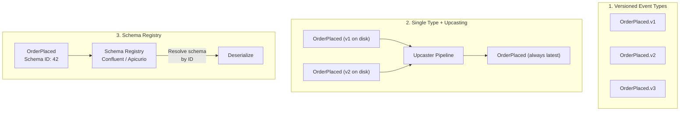
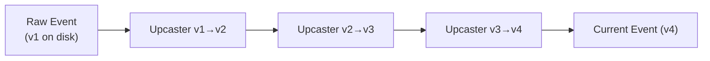
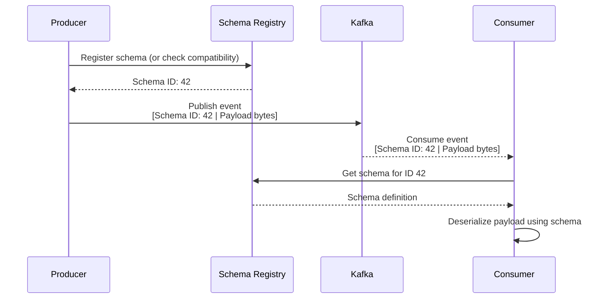
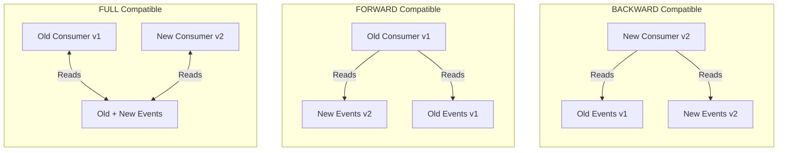
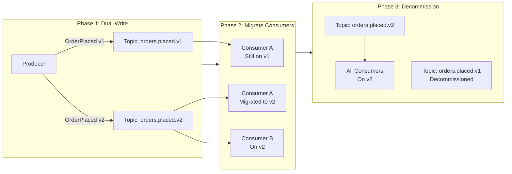

# Event Versioning

Events are immutable. Once published, an event in the log exists forever. But the schema that produced it will change — new fields, removed fields, renamed fields, restructured payloads. Event versioning is the discipline of making these changes without breaking consumers that are reading events produced by older (or newer) versions of the schema.

This page focuses on the practical mechanisms: upcasting transforms, schema registries, serialization format choices (Avro vs Protobuf vs JSON), and the compatibility rules that govern safe evolution.

For the foundational concepts (compatibility modes, evolution strategies, contract testing), see [Event Schema Evolution](/architecture-patterns/event-driven/event-schema-evolution).

**Related**: [Event Schema Evolution](/architecture-patterns/event-driven/event-schema-evolution) | [Event Types](/architecture-patterns/event-driven/event-types) | [gRPC Deep Dive](/system-design/api-design/grpc-deep-dive)

---

## Versioning Strategies

There are three main approaches to handling event schema changes:



| Strategy | Pros | Cons |
|----------|------|------|
| **Versioned event types** | Simple, explicit | Consumers must handle multiple types; topic proliferation |
| **Upcasting** | Consumers always see latest version | Upcaster chain can grow complex |
| **Schema Registry** | Automated compatibility checks; centralized governance | Adds infrastructure dependency |

---

## Upcasting

Upcasting transforms old event versions into the latest version at read time. The event log retains the original bytes, but consumers always see the current schema.

### Upcasting Pipeline



### TypeScript Implementation

```typescript
// Event versions as types
interface OrderPlacedV1 {
  version: 1;
  orderId: string;
  customerId: string;
  total: number;      // Always USD
  placedAt: string;
}

interface OrderPlacedV2 {
  version: 2;
  orderId: string;
  customerId: string;
  total: number;
  currency: string;   // Added: multi-currency support
  placedAt: string;
}

interface OrderPlacedV3 {
  version: 3;
  orderId: string;
  customerId: string;
  amount: {            // Changed: total → amount object
    value: number;
    currency: string;
  };
  placedAt: string;
  source: string;      // Added: order source channel
}

// Current version (what consumers work with)
type OrderPlaced = OrderPlacedV3;

// Upcaster functions — each transforms one version to the next
type Upcaster<From, To> = (event: From) => To;

const upcastV1ToV2: Upcaster<OrderPlacedV1, OrderPlacedV2> = (event) => ({
  ...event,
  version: 2,
  currency: 'USD',  // Default for v1 events (were always USD)
});

const upcastV2ToV3: Upcaster<OrderPlacedV2, OrderPlacedV3> = (event) => ({
  version: 3,
  orderId: event.orderId,
  customerId: event.customerId,
  amount: {
    value: event.total,
    currency: event.currency,
  },
  placedAt: event.placedAt,
  source: 'unknown',  // v1/v2 events did not track source
});

// Upcaster registry
class UpcasterPipeline {
  private upcasters = new Map<number, Upcaster<any, any>>();

  register<From, To>(fromVersion: number, upcaster: Upcaster<From, To>): this {
    this.upcasters.set(fromVersion, upcaster);
    return this;
  }

  upcast(event: { version: number; [key: string]: any }, targetVersion: number): any {
    let current = event;
    while (current.version < targetVersion) {
      const upcaster = this.upcasters.get(current.version);
      if (!upcaster) {
        throw new Error(`No upcaster registered for version ${current.version}`);
      }
      current = upcaster(current);
    }
    return current;
  }
}

// Setup
const pipeline = new UpcasterPipeline()
  .register(1, upcastV1ToV2)
  .register(2, upcastV2ToV3);

// Usage — read any version, always get v3
const rawEvent = { version: 1, orderId: 'ord-1', customerId: 'cust-1', total: 99.99, placedAt: '2024-01-15' };
const currentEvent = pipeline.upcast(rawEvent, 3);
// { version: 3, orderId: 'ord-1', customerId: 'cust-1',
//   amount: { value: 99.99, currency: 'USD' }, placedAt: '2024-01-15', source: 'unknown' }
```

::: tip
Upcasters should be pure functions with no side effects and no external dependencies (no database lookups, no API calls). They transform data shape only. If an upcaster needs external data, the migration should be done as a one-time batch job instead.
:::

---

## Schema Registry

A schema registry is a centralized service that stores, validates, and serves event schemas. Producers register schemas before publishing. Consumers retrieve schemas to deserialize. The registry enforces compatibility rules automatically.



### Confluent Schema Registry

```bash
# Register a new schema
curl -X POST http://schema-registry:8081/subjects/order-placed-value/versions \
  -H 'Content-Type: application/vnd.schemaregistry.v1+json' \
  -d '{
    "schemaType": "AVRO",
    "schema": "{\"type\":\"record\",\"name\":\"OrderPlaced\",\"fields\":[{\"name\":\"orderId\",\"type\":\"string\"},{\"name\":\"total\",\"type\":\"double\"}]}"
  }'

# Check compatibility before registering
curl -X POST http://schema-registry:8081/compatibility/subjects/order-placed-value/versions/latest \
  -H 'Content-Type: application/vnd.schemaregistry.v1+json' \
  -d '{ "schemaType": "AVRO", "schema": "..." }'

# Get latest schema
curl http://schema-registry:8081/subjects/order-placed-value/versions/latest

# Set compatibility mode
curl -X PUT http://schema-registry:8081/config/order-placed-value \
  -H 'Content-Type: application/vnd.schemaregistry.v1+json' \
  -d '{"compatibility": "BACKWARD"}'
```

### Compatibility Modes

| Mode | Rule | Safe Changes | Unsafe Changes |
|------|------|-------------|----------------|
| **BACKWARD** | New schema can read old data | Add optional fields, remove fields | Add required fields |
| **FORWARD** | Old schema can read new data | Remove optional fields, add fields | Remove required fields |
| **FULL** | Both backward and forward | Add/remove optional fields | Add/remove required fields |
| **NONE** | No checks | Anything | N/A |



::: warning
**BACKWARD compatibility is the minimum for Kafka consumers.** When you deploy a new consumer, it must be able to read events that were published before the deploy. Without backward compatibility, deploying a new consumer version can crash on old events.
:::

---

## Avro vs Protobuf vs JSON Schema

### Avro

Avro is the most common serialization format for event streaming (Kafka). It stores the schema ID with each message, enabling schema evolution without embedding the schema in every event.

```json
// order_placed.avsc
{
  "type": "record",
  "name": "OrderPlaced",
  "namespace": "com.myorg.events",
  "fields": [
    { "name": "orderId", "type": "string" },
    { "name": "customerId", "type": "string" },
    {
      "name": "amount",
      "type": {
        "type": "record",
        "name": "Money",
        "fields": [
          { "name": "value", "type": "double" },
          { "name": "currency", "type": "string", "default": "USD" }
        ]
      }
    },
    {
      "name": "placedAt",
      "type": { "type": "long", "logicalType": "timestamp-millis" }
    },
    {
      "name": "source",
      "type": "string",
      "default": "unknown"
    },
    {
      "name": "metadata",
      "type": ["null", { "type": "map", "values": "string" }],
      "default": null
    }
  ]
}
```

### Avro Evolution Rules

| Change | Backward | Forward | Full |
|--------|----------|---------|------|
| Add field with default | Yes | Yes | Yes |
| Add field without default | No | Yes | No |
| Remove field with default | Yes | Yes | Yes |
| Remove field without default | Yes | No | No |
| Rename field | No | No | No (use aliases) |
| Change type (int → long) | Depends (promotion rules) | Depends | Depends |
| Add enum value | No (backward) | Yes (forward) | No |
| Remove enum value | Yes | No | No |

```json
// Evolution: Adding a field with default (BACKWARD + FORWARD compatible)
{
  "type": "record",
  "name": "OrderPlaced",
  "namespace": "com.myorg.events",
  "fields": [
    { "name": "orderId", "type": "string" },
    { "name": "customerId", "type": "string" },
    { "name": "total", "type": "double" },
    { "name": "currency", "type": "string", "default": "USD" },
    { "name": "loyaltyPoints", "type": "int", "default": 0 }
  ]
}
```

### Protobuf for Events

```protobuf
// order_events.proto
syntax = "proto3";

package events.orders.v1;

import "google/protobuf/timestamp.proto";

message OrderPlaced {
  string order_id = 1;
  string customer_id = 2;
  Money amount = 3;
  google.protobuf.Timestamp placed_at = 4;
  string source = 5;
  map<string, string> metadata = 6;

  // Reserved fields — prevent reuse of removed field numbers
  reserved 7, 8;
  reserved "legacy_total", "old_currency";
}

message Money {
  int64 minor_units = 1;     // Amount in smallest currency unit (cents)
  string currency_code = 2;  // ISO 4217 (USD, EUR, GBP)
}
```

### Format Comparison

| Feature | Avro | Protobuf | JSON Schema |
|---------|------|----------|-------------|
| **Binary format** | Yes (compact) | Yes (compact) | No (text, large) |
| **Schema required for read** | Yes (reader schema) | Yes (.proto file) | Optional |
| **Schema evolution** | Excellent (reader/writer negotiation) | Good (additive only) | Limited |
| **Schema registry support** | First-class (Confluent) | Supported | Supported |
| **Code generation** | Optional | Required (protoc) | Optional |
| **Human readable** | No (binary wire format) | No (binary wire format) | Yes |
| **Dynamic typing** | Yes (GenericRecord) | Limited | Yes |
| **Default values** | In schema | Zero values (0, "", false) | In schema |
| **Union types** | Yes (`["null", "string"]`) | `oneof` | `oneOf`, `anyOf` |
| **Kafka ecosystem** | Dominant | Growing | Common |
| **Payload size (1K fields)** | ~0.3KB | ~0.3KB | ~1.5KB |

::: tip
Use **Avro** when you are in the Kafka ecosystem and need rich schema evolution with reader/writer negotiation. Use **Protobuf** when your services already use gRPC or you need strong code generation across many languages. Use **JSON Schema** when human readability matters more than performance (internal tools, low-throughput events).
:::

---

## Migration Patterns

### Copy-and-Replace (Safe Migration)

When a change is not backward-compatible, create a new event type and migrate:



### Lazy Migration (Event Sourcing)

In event-sourced systems, you can lazily migrate events when aggregates are loaded:

```typescript
class OrderAggregate {
  private state: OrderState;
  private currentSchemaVersion = 3;

  // When loading, upcast old events to current version
  loadFromHistory(events: StoredEvent[]): void {
    for (const event of events) {
      const upcasted = this.upcast(event);
      this.apply(upcasted);
    }
  }

  private upcast(event: StoredEvent): DomainEvent {
    const upcasted = upcasterPipeline.upcast(
      event.payload,
      this.currentSchemaVersion
    );
    return { ...event, payload: upcasted };
  }

  // When snapshotting, old events are "absorbed" into the snapshot
  // New events after the snapshot are always current version
  snapshot(): Snapshot {
    return {
      aggregateId: this.state.orderId,
      version: this.state.version,
      state: this.state,
      schemaVersion: this.currentSchemaVersion,
    };
  }
}
```

### Tombstone + Replay

For breaking changes in compacted topics:

```typescript
// 1. Publish tombstones for all old events
async function publishTombstones(topic: string, producer: Producer) {
  const consumer = kafka.consumer({ groupId: 'migration-reader' });
  await consumer.subscribe({ topic, fromBeginning: true });

  await consumer.run({
    eachMessage: async ({ message }) => {
      // Tombstone: same key, null value
      await producer.send({
        topic,
        messages: [{ key: message.key, value: null }],
      });
    },
  });
}

// 2. Republish with new schema
async function republishWithNewSchema(
  sourceTopic: string,
  targetTopic: string,
  transform: (old: any) => any,
) {
  // Read from source, transform, write to target
}
```

---

## Versioning Best Practices

| Practice | Rationale |
|----------|-----------|
| Always add new fields with defaults | Ensures backward compatibility |
| Never remove required fields | Breaks consumers expecting them |
| Never reuse field numbers (Protobuf) or names (Avro) | Corrupts data from old events |
| Use a schema registry in production | Automated compatibility checks prevent breaking changes |
| Set compatibility mode to BACKWARD minimum | Consumers can always be deployed independently |
| Include a `version` or `schemaVersion` field in events | Enables upcasting without external schema lookup |
| Test compatibility in CI | Catch breaking changes before merge |
| Reserve removed field names/numbers | Prevent accidental reuse |

### CI Compatibility Check

```yaml
# .github/workflows/schema-check.yml
name: Schema Compatibility Check

on:
  pull_request:
    paths:
      - 'schemas/**'

jobs:
  check:
    runs-on: ubuntu-latest
    steps:
      - uses: actions/checkout@v4
        with:
          fetch-depth: 0

      - name: Check Avro compatibility
        run: |
          # Compare new schema against latest registered version
          for schema in schemas/*.avsc; do
            SUBJECT=$(basename "$schema" .avsc)-value
            curl -sf -X POST \
              "http://schema-registry:8081/compatibility/subjects/$SUBJECT/versions/latest" \
              -H 'Content-Type: application/vnd.schemaregistry.v1+json' \
              -d "{\"schema\": $(cat "$schema" | jq -Rs .)}" \
            | jq -e '.is_compatible' || {
              echo "BREAKING: $schema is not compatible"
              exit 1
            }
          done
```

::: danger
**Never evolve event schemas without testing against the registry.** A schema change that looks harmless (renaming a field, changing an int to a long) can be a breaking change depending on the serialization format and compatibility mode. Always validate in CI before merging.
:::

---

## Further Reading

- [Event Schema Evolution](/architecture-patterns/event-driven/event-schema-evolution) — foundational concepts, compatibility modes, and contract testing
- [Event Types](/architecture-patterns/event-driven/event-types) — domain events, integration events, and event design
- [gRPC Deep Dive](/system-design/api-design/grpc-deep-dive) — Protobuf schema design and evolution rules
- [API Versioning](/system-design/api-design/api-versioning) — versioning strategies for synchronous APIs
- [Supply Chain Security](/security/supply-chain/) — ensuring schema registry integrity
