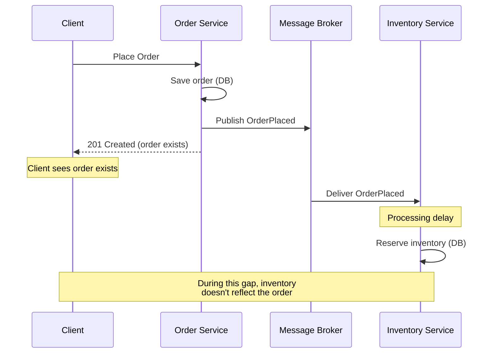
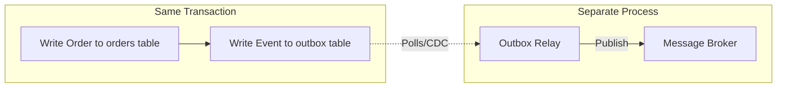
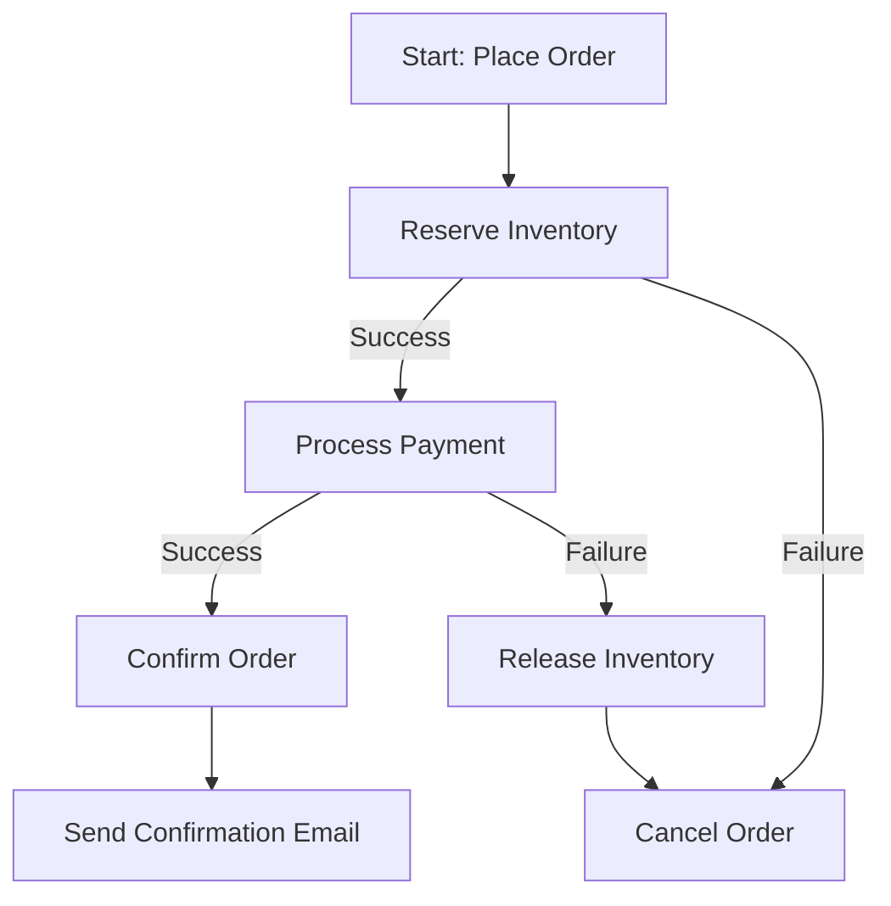
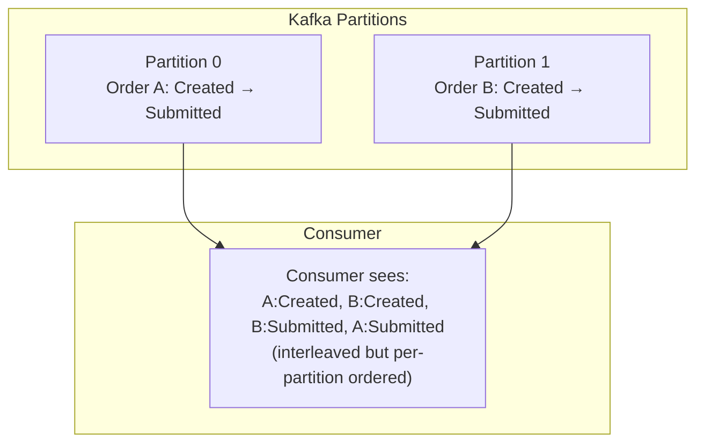
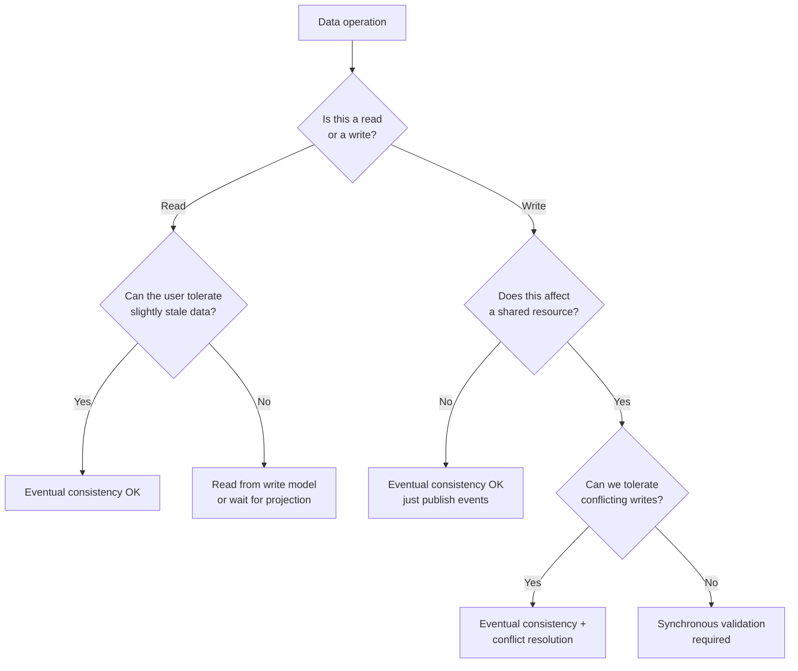

# Eventual Consistency

## Why It Exists

In a monolithic system with a single database, you get strong consistency for free — every read sees the result of the most recent write, and transactions are ACID-compliant. The moment you distribute your system across multiple services, databases, or data centers, strong consistency becomes either impossible or prohibitively expensive.

The CAP theorem (Brewer, 2000) formalized what practitioners already knew: in the presence of network partitions, you must choose between consistency and availability. Most real-world systems choose availability and accept eventual consistency as the trade-off.

**Eventual consistency** means: if no new updates are made to a piece of data, all replicas will *eventually* converge to the same value. The "eventually" is bounded by propagation delay, processing time, and failure recovery.

### The Problem Space

In an event-driven architecture, services communicate through events. When the Order Service publishes an `OrderPlaced` event and the Inventory Service processes it:



Between the order being saved and inventory being reserved, the system is **inconsistent**. The order references inventory that hasn't been reserved yet. This is a fundamental characteristic of event-driven architectures.

## First Principles

### Consistency Spectrum

Consistency is not binary. There is a spectrum from strong to weak:

| Model | Guarantee | Latency Cost | Use Case |
|-------|-----------|-------------|----------|
| **Linearizability** | Every read sees the most recent write | Highest (consensus required) | Financial transactions |
| **Sequential consistency** | All processes see operations in the same order | High | Shared counters |
| **Causal consistency** | Causally related operations are seen in order | Medium | Social media feeds |
| **Eventual consistency** | All replicas converge given no new writes | Lowest | Shopping carts, analytics |
| **Weak consistency** | No guarantee about when reads reflect writes | Lowest | Caches, metrics |

### Formal Definition

A system is eventually consistent if:

$$
\forall\, x,\; \exists\, \Delta t \text{ such that if no writes to } x \text{ occur after time } t,\text{ then } \forall\, t' > t + \Delta t: \text{read}(x, t') = \text{write}_{\text{last}}(x)
$$

Where $\Delta t$ is the **convergence window** — the maximum time for all replicas to reflect the latest value.

In practice, $\Delta t$ depends on:

$$
\Delta t = t_{\text{propagation}} + t_{\text{processing}} + t_{\text{retry}} \cdot n_{\text{failures}}
$$

Typical values:

| Component | Time | Notes |
|-----------|------|-------|
| Kafka propagation | 5-50 ms | Within same region |
| Consumer processing | 10-100 ms | Per event |
| Retry on failure | 1-60 sec | Exponential backoff |
| Cross-region replication | 50-300 ms | Network latency |
| **Typical convergence** | **50 ms - 5 sec** | **Happy path** |
| **Worst case (failures)** | **Minutes to hours** | **Multiple retries** |

### The CALM Theorem

The CALM theorem (Hellerstein, 2010) states: a program has a consistent, coordination-free distributed implementation if and only if it is **monotonic** — it never retracts a previous output.

Event-sourced systems are naturally monotonic (events are only appended, never deleted), which is why eventual consistency works well with event-driven architectures.

## Core Patterns

### Pattern 1: Eventual Consistency via Domain Events

The simplest pattern — publish events after state changes and let consumers update their own state:

```typescript
// order-service/application/use-cases/place-order.ts
export class PlaceOrderInteractor {
  constructor(
    private readonly orderRepo: OrderRepository,
    private readonly eventPublisher: EventPublisher,
  ) {}

  async execute(input: PlaceOrderInput): Promise<PlaceOrderOutput> {
    const order = Order.create(
      this.orderRepo.nextId(),
      CustomerId.of(input.customerId),
      input.items.map(i => OrderItem.create(
        ProductId.of(i.productId),
        i.quantity,
        Money.of(i.price, 'USD'),
      )),
    );

    // 1. Save to local DB (strong consistency within this service)
    await this.orderRepo.save(order);

    // 2. Publish events (eventual consistency with other services)
    await this.eventPublisher.publishAll(order.events);

    return { orderId: order.id.value, status: order.status };
  }
}
```

```typescript
// inventory-service/consumers/order-placed.consumer.ts
export class OrderPlacedConsumer {
  constructor(
    private readonly inventoryRepo: InventoryRepository,
    private readonly reservationService: ReservationService,
  ) {}

  async handle(event: OrderPlacedEvent): Promise<void> {
    for (const item of event.payload.items) {
      await this.reservationService.reserve(
        ProductId.of(item.productId),
        item.quantity,
        event.aggregateId, // orderId as reservation reference
      );
    }
  }
}
```

::: warning
The gap between step 1 (save order) and the inventory consumer processing the event is the **inconsistency window**. During this window, the order exists but inventory is not reserved. Handle this in the UI by showing "Processing..." status.
:::

### Pattern 2: The Outbox Pattern

The dual-write problem: if you save to the database AND publish to a message broker, one can succeed while the other fails. The Outbox Pattern solves this:



```typescript
// infrastructure/outbox/outbox-repository.ts
import type { Pool, PoolClient } from 'pg';
import type { DomainEvent } from '../../domain/events/domain-event';

export class OutboxRepository {
  constructor(private readonly pool: Pool) {}

  /**
   * Save order and events in the same database transaction.
   * This guarantees atomic write — either both succeed or both fail.
   */
  async saveWithEvents(
    orderRow: OrderRow,
    events: readonly DomainEvent[],
  ): Promise<void> {
    const client = await this.pool.connect();
    try {
      await client.query('BEGIN');

      // Save the order
      await client.query(
        `INSERT INTO orders (id, customer_id, status, total, created_at)
         VALUES ($1, $2, $3, $4, $5)`,
        [orderRow.id, orderRow.customer_id, orderRow.status,
         orderRow.total, orderRow.created_at],
      );

      // Save events to outbox (same transaction!)
      for (const event of events) {
        await client.query(
          `INSERT INTO outbox (id, aggregate_id, event_type, payload, created_at, published)
           VALUES ($1, $2, $3, $4, $5, false)`,
          [
            crypto.randomUUID(),
            event.aggregateId,
            event.type,
            JSON.stringify(event.payload),
            event.occurredAt,
          ],
        );
      }

      await client.query('COMMIT');
    } catch (error) {
      await client.query('ROLLBACK');
      throw error;
    } finally {
      client.release();
    }
  }
}
```

```typescript
// infrastructure/outbox/outbox-relay.ts
import type { Pool } from 'pg';
import type { EventPublisher } from '../../application/ports/event-publisher';

/**
 * Polls the outbox table and publishes unpublished events.
 * Runs as a background process.
 */
export class OutboxRelay {
  private running = false;
  private readonly pollIntervalMs: number;

  constructor(
    private readonly pool: Pool,
    private readonly publisher: EventPublisher,
    options: { pollIntervalMs?: number } = {},
  ) {
    this.pollIntervalMs = options.pollIntervalMs ?? 100;
  }

  async start(): Promise<void> {
    this.running = true;
    while (this.running) {
      try {
        const published = await this.publishBatch();
        if (published === 0) {
          // No events to publish — wait before polling again
          await this.sleep(this.pollIntervalMs);
        }
      } catch (error) {
        console.error('Outbox relay error:', error);
        await this.sleep(1000); // Back off on errors
      }
    }
  }

  stop(): void {
    this.running = false;
  }

  private async publishBatch(): Promise<number> {
    const client = await this.pool.connect();
    try {
      // Select unpublished events with row-level lock
      const result = await client.query(
        `SELECT id, aggregate_id, event_type, payload, created_at
         FROM outbox
         WHERE published = false
         ORDER BY created_at ASC
         LIMIT 100
         FOR UPDATE SKIP LOCKED`,
      );

      if (result.rows.length === 0) return 0;

      for (const row of result.rows) {
        await this.publisher.publish({
          type: row.event_type,
          aggregateId: row.aggregate_id,
          occurredAt: row.created_at,
          payload: JSON.parse(row.payload),
        });

        await client.query(
          `UPDATE outbox SET published = true, published_at = NOW() WHERE id = $1`,
          [row.id],
        );
      }

      return result.rows.length;
    } finally {
      client.release();
    }
  }

  private sleep(ms: number): Promise<void> {
    return new Promise((resolve) => setTimeout(resolve, ms));
  }
}
```

### Pattern 3: Saga Pattern for Distributed Transactions

When a business process spans multiple services, use a saga to coordinate and compensate:



```typescript
// application/sagas/order-saga.ts
import type { EventPublisher } from '../ports/event-publisher';
import type { OrderRepository } from '../ports/order.repository';

interface SagaStep {
  name: string;
  execute(): Promise<void>;
  compensate(): Promise<void>;
}

export class OrderSaga {
  private executedSteps: SagaStep[] = [];

  constructor(
    private readonly orderId: string,
    private readonly steps: SagaStep[],
  ) {}

  async run(): Promise<void> {
    for (const step of this.steps) {
      try {
        await step.execute();
        this.executedSteps.push(step);
      } catch (error) {
        console.error(`Saga step "${step.name}" failed:`, error);
        await this.compensate();
        throw new SagaFailedError(this.orderId, step.name, error as Error);
      }
    }
  }

  private async compensate(): Promise<void> {
    // Execute compensating actions in reverse order
    for (const step of [...this.executedSteps].reverse()) {
      try {
        await step.compensate();
      } catch (error) {
        // Compensating action failed — log for manual intervention
        console.error(
          `CRITICAL: Compensation for "${step.name}" failed in saga ${this.orderId}:`,
          error,
        );
      }
    }
  }
}

// Usage:
const saga = new OrderSaga(orderId, [
  {
    name: 'ReserveInventory',
    execute: () => inventoryService.reserve(orderId, items),
    compensate: () => inventoryService.release(orderId),
  },
  {
    name: 'ProcessPayment',
    execute: () => paymentService.charge(orderId, amount),
    compensate: () => paymentService.refund(orderId),
  },
  {
    name: 'ConfirmOrder',
    execute: () => orderService.confirm(orderId),
    compensate: () => orderService.cancel(orderId),
  },
]);

await saga.run();
```

### Pattern 4: Read Model Projections

Maintain denormalized read models that are eventually consistent with the write model:

```typescript
// read-side/projections/order-summary.projection.ts
export class OrderSummaryProjection {
  constructor(private readonly readDb: Pool) {}

  async handle(event: DomainEvent): Promise<void> {
    switch (event.type) {
      case 'OrderPlaced':
        await this.onOrderPlaced(event);
        break;
      case 'OrderConfirmed':
        await this.onOrderConfirmed(event);
        break;
      case 'OrderShipped':
        await this.onOrderShipped(event);
        break;
      case 'OrderCancelled':
        await this.onOrderCancelled(event);
        break;
    }
  }

  private async onOrderPlaced(event: DomainEvent): Promise<void> {
    await this.readDb.query(
      `INSERT INTO order_summaries (order_id, customer_id, status, total, item_count, placed_at, last_updated)
       VALUES ($1, $2, 'PLACED', $3, $4, $5, $5)
       ON CONFLICT (order_id) DO NOTHING`,
      [
        event.aggregateId,
        event.payload.customerId,
        event.payload.total,
        event.payload.itemCount,
        event.occurredAt,
      ],
    );
  }

  private async onOrderConfirmed(event: DomainEvent): Promise<void> {
    await this.readDb.query(
      `UPDATE order_summaries
       SET status = 'CONFIRMED', last_updated = $2
       WHERE order_id = $1`,
      [event.aggregateId, event.occurredAt],
    );
  }

  private async onOrderShipped(event: DomainEvent): Promise<void> {
    await this.readDb.query(
      `UPDATE order_summaries
       SET status = 'SHIPPED', tracking_number = $2, shipped_at = $3, last_updated = $3
       WHERE order_id = $1`,
      [event.aggregateId, event.payload.trackingNumber, event.occurredAt],
    );
  }

  private async onOrderCancelled(event: DomainEvent): Promise<void> {
    await this.readDb.query(
      `UPDATE order_summaries
       SET status = 'CANCELLED', cancellation_reason = $2, last_updated = $3
       WHERE order_id = $1`,
      [event.aggregateId, event.payload.reason, event.occurredAt],
    );
  }
}
```

## Conflict Resolution Strategies

### Last Writer Wins (LWW)

The simplest strategy — the most recent write wins based on timestamp:

```typescript
// Merge function for LWW
function mergeWithLWW<T extends { updatedAt: Date }>(local: T, remote: T): T {
  return local.updatedAt > remote.updatedAt ? local : remote;
}
```

$$
\text{resolve}(v_1, v_2) = \begin{cases} v_1 & \text{if } t_1 > t_2 \\ v_2 & \text{if } t_2 > t_1 \\ v_1 & \text{if } t_1 = t_2 \text{ (tie-break by ID)} \end{cases}
$$

::: warning
LWW silently drops concurrent updates. Acceptable for shopping carts, not for bank balances.
:::

### Merge Function (Application-Specific)

Define domain-specific merge logic:

```typescript
// Shopping cart merge: union of items, max of quantities
function mergeShoppingCarts(
  local: ShoppingCart,
  remote: ShoppingCart,
): ShoppingCart {
  const mergedItems = new Map<string, CartItem>();

  // Add all local items
  for (const item of local.items) {
    mergedItems.set(item.productId, item);
  }

  // Merge remote items
  for (const item of remote.items) {
    const existing = mergedItems.get(item.productId);
    if (existing) {
      // Take max quantity (both users wanted at least this many)
      mergedItems.set(item.productId, {
        ...item,
        quantity: Math.max(existing.quantity, item.quantity),
      });
    } else {
      mergedItems.set(item.productId, item);
    }
  }

  return { items: Array.from(mergedItems.values()) };
}
```

### CRDTs (Conflict-free Replicated Data Types)

For mathematically guaranteed convergence, use CRDTs:

```typescript
// G-Counter (Grow-only Counter)
export class GCounter {
  private counts: Map<string, number>; // nodeId → count

  constructor(private readonly nodeId: string) {
    this.counts = new Map();
  }

  increment(amount: number = 1): void {
    const current = this.counts.get(this.nodeId) ?? 0;
    this.counts.set(this.nodeId, current + amount);
  }

  get value(): number {
    let total = 0;
    for (const count of this.counts.values()) {
      total += count;
    }
    return total;
  }

  merge(other: GCounter): GCounter {
    const merged = new GCounter(this.nodeId);
    const allNodes = new Set([...this.counts.keys(), ...other.counts.keys()]);

    for (const node of allNodes) {
      merged.counts.set(
        node,
        Math.max(this.counts.get(node) ?? 0, other.counts.get(node) ?? 0),
      );
    }

    return merged;
  }
}
```

See [CRDTs](/system-design/distributed-systems/crdt-fundamentals) for a full treatment.

## Edge Cases & Failure Modes

### 1. Out-of-Order Events

Events may arrive out of order, especially across partitions:

```typescript
// Guard against out-of-order processing
class IdempotentProjection {
  private lastProcessedVersion = new Map<string, number>();

  async handle(event: VersionedEvent): Promise<void> {
    const lastVersion = this.lastProcessedVersion.get(event.aggregateId) ?? 0;

    if (event.version <= lastVersion) {
      // Already processed or out of order — skip
      console.warn(`Skipping out-of-order event: ${event.type} v${event.version}, last processed v${lastVersion}`);
      return;
    }

    if (event.version > lastVersion + 1) {
      // Gap detected — request replay from event store
      console.warn(`Gap detected: expected v${lastVersion + 1}, got v${event.version}`);
      await this.requestReplay(event.aggregateId, lastVersion + 1, event.version);
      return;
    }

    await this.apply(event);
    this.lastProcessedVersion.set(event.aggregateId, event.version);
  }
}
```

### 2. Consumer Failure Mid-Processing

If a consumer crashes after partially processing an event:

| Strategy | Approach | Trade-off |
|----------|----------|-----------|
| **At-least-once delivery** | Reprocess on failure; consumers must be idempotent | Possible duplicates |
| **Exactly-once semantics** | Kafka transactions + idempotent consumers | Higher latency, complexity |
| **Idempotency keys** | Track processed event IDs; skip duplicates | Storage for tracking |

```typescript
// Idempotent consumer
class IdempotentConsumer {
  constructor(
    private readonly processedStore: ProcessedEventStore,
    private readonly handler: EventHandler,
  ) {}

  async handle(event: DomainEvent): Promise<void> {
    const eventId = `${event.aggregateId}:${event.type}:${event.occurredAt.toISOString()}`;

    if (await this.processedStore.isProcessed(eventId)) {
      return; // Already handled — skip
    }

    await this.handler.handle(event);
    await this.processedStore.markProcessed(eventId);
  }
}
```

### 3. The Stale Read Problem

A user creates an order and immediately navigates to the order details page. The read model hasn't been updated yet:

```typescript
// Strategy 1: Read-your-writes consistency
// After writing, include the expected version in a response header
// The read endpoint waits for the projection to catch up

app.get('/api/orders/:id', async (req, res) => {
  const expectedVersion = parseInt(req.headers['x-expected-version'] as string);
  const maxWaitMs = 5000;

  const order = await waitForVersion(
    req.params.id,
    expectedVersion,
    maxWaitMs,
  );

  if (!order) {
    res.status(404).json({ error: 'Not found or not yet available' });
    return;
  }

  res.json({ data: order });
});

async function waitForVersion(
  orderId: string,
  expectedVersion: number,
  maxWaitMs: number,
): Promise<OrderView | null> {
  const deadline = Date.now() + maxWaitMs;

  while (Date.now() < deadline) {
    const order = await readDb.query(
      'SELECT * FROM order_summaries WHERE order_id = $1 AND version >= $2',
      [orderId, expectedVersion],
    );

    if (order.rows.length > 0) {
      return order.rows[0];
    }

    await new Promise((resolve) => setTimeout(resolve, 50));
  }

  return null;
}
```

```typescript
// Strategy 2: Read from write model as fallback
app.get('/api/orders/:id', async (req, res) => {
  // Try read model first (fast, denormalized)
  let order = await readDb.query(
    'SELECT * FROM order_summaries WHERE order_id = $1',
    [req.params.id],
  );

  if (!order.rows.length) {
    // Fallback to write model (slower, but consistent)
    order = await writeDb.query(
      'SELECT * FROM orders WHERE id = $1',
      [req.params.id],
    );
  }

  if (!order.rows.length) {
    res.status(404).json({ error: 'Not found' });
    return;
  }

  res.json({ data: order.rows[0] });
});
```

### 4. Event Ordering Across Aggregates

Events from different aggregates on different Kafka partitions have no ordering guarantee:



Per-aggregate ordering is guaranteed (same partition key). Cross-aggregate ordering is not. Design consumers to handle any interleaving.

## Performance Characteristics

### Convergence Time Benchmarks

Measured on a 3-service system with Kafka:

| Scenario | P50 Convergence | P99 Convergence | P99.9 Convergence |
|----------|----------------|----------------|-------------------|
| Happy path (no failures) | 45 ms | 120 ms | 250 ms |
| Consumer restart | 2.1 sec | 8.5 sec | 15 sec |
| Network partition (5 sec) | 5.2 sec | 6.8 sec | 12 sec |
| Broker failover | 8 sec | 25 sec | 45 sec |
| Full cluster restart | 30 sec | 90 sec | 180 sec |

### Throughput vs. Consistency Trade-off

$$
\text{Throughput} \propto \frac{1}{\text{Consistency Level}}
$$

| Consistency Level | Throughput (req/s) | Latency (p99) |
|-------------------|-------------------|---------------|
| Eventual (async events) | 50,000 | 15 ms |
| Causal (vector clocks) | 20,000 | 45 ms |
| Sequential (total order) | 5,000 | 200 ms |
| Linearizable (consensus) | 1,500 | 500 ms |

## Mathematical Foundations

### Convergence Probability

The probability that all replicas have converged after time $t$:

$$
P(\text{converged}, t) = \prod_{i=1}^{n} (1 - e^{-\lambda_i t})
$$

Where $\lambda_i$ is the event processing rate of replica $i$ and $n$ is the number of replicas.

For 3 replicas each processing at $\lambda = 100$ events/sec:

$$
P(\text{converged}, 0.05) = (1 - e^{-100 \cdot 0.05})^3 = (1 - e^{-5})^3 \approx (0.9933)^3 \approx 0.9800
$$

After 50 ms, there is a 98% chance all replicas have converged.

After 100 ms:

$$
P(\text{converged}, 0.1) = (1 - e^{-10})^3 \approx (0.99995)^3 \approx 0.99985
$$

99.985% convergence — effectively consistent.

### Inconsistency Window Analysis

Define the inconsistency window $W$ as the time during which reads may return stale data:

$$
W = t_{\text{write}} + t_{\text{publish}} + t_{\text{deliver}} + t_{\text{process}}
$$

With outbox pattern:

$$
W_{\text{outbox}} = t_{\text{tx\_commit}} + t_{\text{poll\_interval}} + t_{\text{deliver}} + t_{\text{process}}
$$

Typical values:

$$
W_{\text{outbox}} = 2\text{ms} + 100\text{ms} + 5\text{ms} + 10\text{ms} = 117\text{ms}
$$

With CDC (change data capture):

$$
W_{\text{cdc}} = 2\text{ms} + 1\text{ms} + 5\text{ms} + 10\text{ms} = 18\text{ms}
$$

CDC dramatically reduces the inconsistency window because it captures changes from the database WAL in near-real-time, eliminating the polling interval.

::: info War Story
**The Flash Sale That Oversold 10,000 Units**

An e-commerce platform ran a flash sale with 50,000 concurrent users. Their inventory service consumed `OrderPlaced` events from Kafka to decrement stock. The problem: Kafka consumer lag reached 45 seconds during the traffic spike. During those 45 seconds, the read model showed "in stock" while the actual inventory was depleted.

Result: 10,247 orders were placed for items that were already sold out. The company had to cancel those orders, resulting in customer complaints and a social media incident.

**The fix was multi-layered:**

1. **Reservation pattern**: Before confirming an order, synchronously call the inventory service to reserve stock (accepting the latency cost for correctness)
2. **Circuit breaker**: When inventory service response time exceeded 500 ms, stop accepting new orders
3. **Pessimistic stock display**: Show "Low stock" when quantity < 100, hiding the exact count to reduce psychological urgency
4. **Consumer scaling**: Auto-scale Kafka consumers based on lag metrics

After the fix, the next flash sale handled 80,000 concurrent users with zero oversells. The synchronous reservation call added 25 ms latency (acceptable for order placement) but provided strong consistency for the critical path.

The lesson: eventual consistency is fine for *reads*, but *writes that affect shared resources* often need stronger guarantees.
:::

## Decision Framework

### When to Accept Eventual Consistency



### Consistency Requirements by Domain

| Domain | Acceptable Inconsistency Window | Pattern |
|--------|-------------------------------|---------|
| Social media (likes, views) | Minutes | Async events, LWW |
| E-commerce (product catalog) | Seconds | CDC + projections |
| E-commerce (inventory) | Milliseconds | Synchronous reservation |
| Banking (account balance) | Zero | Distributed transaction |
| Analytics (dashboards) | Hours | Batch processing |
| Chat (message delivery) | Seconds | Causal consistency |

## Advanced Topics

### Consistency Boundaries

Draw explicit boundaries around what must be strongly consistent and what can be eventually consistent:

```
┌─ Strong Consistency Boundary ──────────────┐
│                                            │
│  Order Aggregate                           │
│  ├── Order status                          │
│  ├── Order lines (items, quantities)       │
│  └── Payment status                        │
│                                            │
│  Inventory Reservation (same TX as order)  │
│                                            │
└────────────────────────────────────────────┘

┌─ Eventual Consistency ─────────────────────┐
│                                            │
│  Order search index (Elasticsearch)        │
│  Recommendation engine update              │
│  Analytics pipeline                        │
│  Email notifications                       │
│  Shipping label generation                 │
│                                            │
└────────────────────────────────────────────┘
```

### Monitoring Eventual Consistency

Track consumer lag as a key metric:

```typescript
// monitoring/consistency-monitor.ts
export class ConsistencyMonitor {
  constructor(
    private readonly metrics: MetricsClient,
    private readonly kafka: KafkaAdmin,
  ) {}

  async checkLag(): Promise<ConsistencyReport> {
    const groups = await this.kafka.listGroups();
    const reports: GroupLagReport[] = [];

    for (const group of groups) {
      const offsets = await this.kafka.fetchOffsets({ groupId: group.groupId });
      const topicOffsets = await this.kafka.fetchTopicOffsets(group.topic);

      let totalLag = 0;
      for (let i = 0; i < offsets.length; i++) {
        const committed = parseInt(offsets[i].offset);
        const latest = parseInt(topicOffsets[i].offset);
        const lag = latest - committed;
        totalLag += lag;
      }

      reports.push({
        groupId: group.groupId,
        totalLag,
        estimatedConvergenceMs: totalLag * 10, // ~10ms per event
      });

      this.metrics.gauge('kafka.consumer.lag', totalLag, {
        group: group.groupId,
      });
    }

    return { groups: reports, overallHealthy: reports.every(r => r.totalLag < 1000) };
  }
}
```

## Further Reading

- [Event Types](/architecture-patterns/event-driven/event-types) — domain events, integration events, notification events
- [Event Choreography](/architecture-patterns/event-driven/event-choreography) — decentralized event coordination
- [Event Orchestration](/architecture-patterns/event-driven/event-orchestration) — centralized saga coordination
- [Sagas & Process Managers](/architecture-patterns/cqrs-event-sourcing/sagas-process-managers) — long-running processes
- [CQRS Deep Dive](/architecture-patterns/cqrs-event-sourcing/cqrs-deep-dive) — read/write model separation
- [CAP Theorem](/system-design/distributed-systems/cap-theorem) — the foundational theorem
- [Consistency Models](/system-design/distributed-systems/consistency-models) — formal consistency definitions
