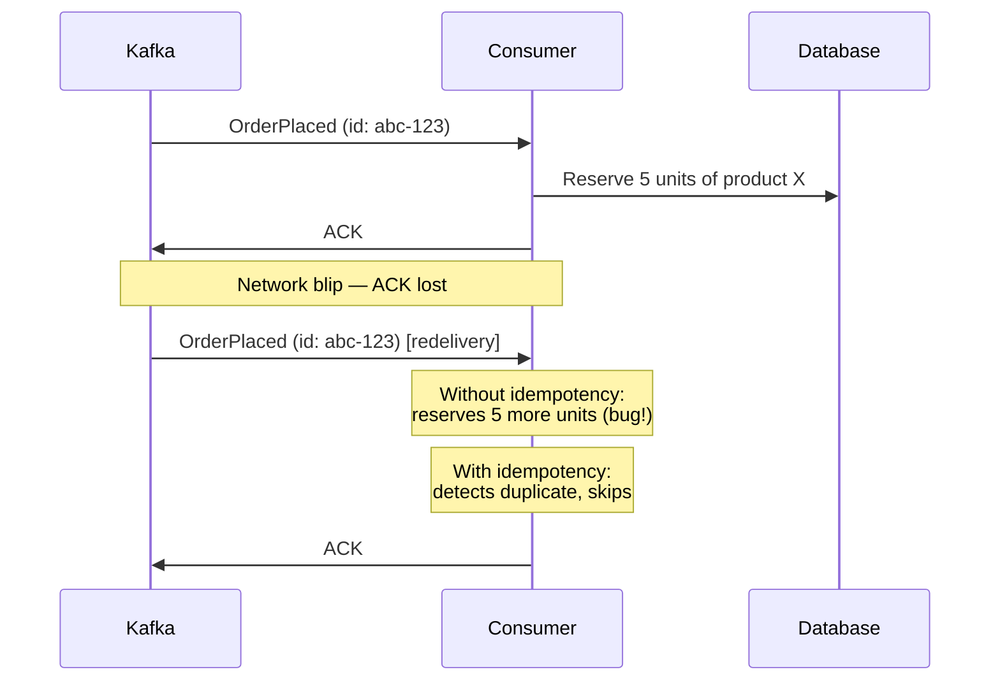
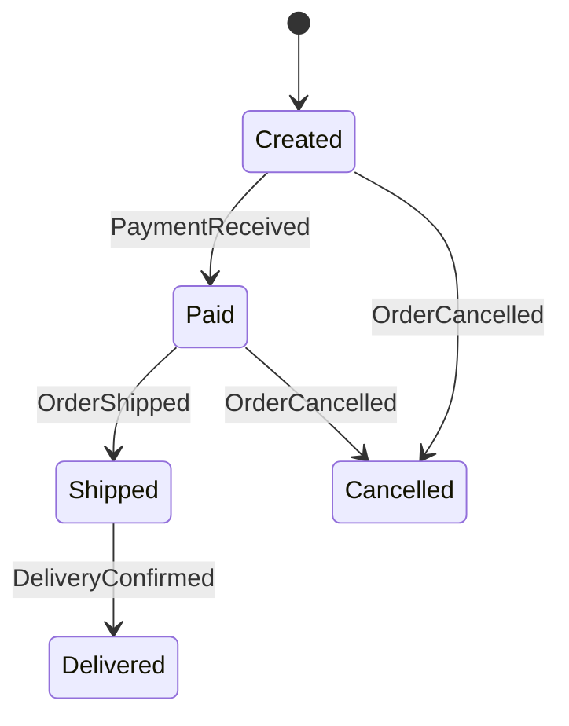
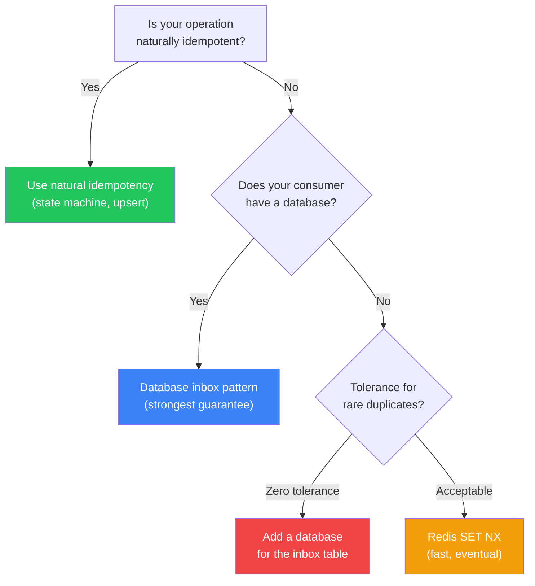

# Idempotent Consumers

## Why Idempotency Matters

In an event-driven system, messages are delivered **at least once**. Not exactly once. At least once. This is a fundamental property of distributed messaging — the only way to guarantee a message is not lost is to redeliver it when acknowledgment is missing. And acknowledgment can go missing for any number of reasons: consumer crashes after processing but before acknowledging, network partition between consumer and broker, broker failover, consumer group rebalance.

The consequence: your consumer **will** receive the same message multiple times. If processing that message twice produces a different result than processing it once, you have a bug. That bug may manifest as double-charging a customer, sending duplicate emails, over-reserving inventory, or corrupting aggregate counts.

An **idempotent consumer** produces the same result whether it processes a message once, twice, or a hundred times.



## The Idempotency Spectrum

Not all operations are equally easy to make idempotent. Operations fall on a spectrum:

| Category | Example | Naturally Idempotent? | Difficulty |
|----------|---------|----------------------|------------|
| **Absolute set** | `SET balance = 100` | Yes | Easy |
| **Conditional set** | `SET status = 'shipped' WHERE status = 'packed'` | Yes (state machine) | Easy |
| **Upsert** | `INSERT ... ON CONFLICT UPDATE` | Yes | Easy |
| **Relative increment** | `SET balance = balance + 50` | No | Medium |
| **External side effect** | Send email, call external API | No | Hard |
| **Non-deterministic** | Generate UUID, read current time | No | Hard |

The first three are naturally idempotent — applying them multiple times produces the same result. The last three require explicit deduplication logic.

## Natural Idempotency

Some operations are inherently safe to repeat. Design your consumers to use naturally idempotent operations wherever possible.

### State Machine Transitions

If your entity follows a state machine, transitions are naturally idempotent because a transition only applies when the entity is in the expected source state.



```typescript
// State machine transition — naturally idempotent
async function handlePaymentReceived(
  db: Pool,
  event: { orderId: string; amount: number }
): Promise<void> {
  const result = await db.query(
    `UPDATE orders
     SET status = 'PAID', paid_amount = $2, paid_at = NOW()
     WHERE id = $1 AND status = 'CREATED'`,
    //                    ^^^^^^^^^^^^^^^^
    //  This WHERE clause makes it idempotent:
    //  - First execution: status is 'CREATED' → update succeeds
    //  - Second execution: status is already 'PAID' → 0 rows affected, no-op
    [event.orderId, event.amount]
  );

  if (result.rowCount === 0) {
    // Either already processed (idempotent replay) or invalid state
    console.log(`Order ${event.orderId} not in CREATED state, skipping`);
  }
}
```

### Upsert (INSERT ON CONFLICT)

When the event carries the full state of an entity (event-carried state transfer), use an upsert:

```typescript
async function handleCustomerUpdated(
  db: Pool,
  event: { customerId: string; name: string; email: string; updatedAt: string }
): Promise<void> {
  await db.query(
    `INSERT INTO customers (id, name, email, updated_at)
     VALUES ($1, $2, $3, $4)
     ON CONFLICT (id) DO UPDATE
     SET name = EXCLUDED.name,
         email = EXCLUDED.email,
         updated_at = EXCLUDED.updated_at
     WHERE customers.updated_at < EXCLUDED.updated_at`,
    //    ^^^^^^^^^^^^^^^^^^^^^^^^^^^^^^^^^^^^^^^^^^^^^^^^^
    //    Only update if the incoming event is newer than what we have.
    //    This handles out-of-order delivery AND duplicate delivery.
    [event.customerId, event.name, event.email, event.updatedAt]
  );
}
```

::: tip Prefer Natural Idempotency
Natural idempotency is always better than artificial deduplication. It requires no additional storage (no inbox table, no Redis), adds no latency, and handles out-of-order delivery as a bonus. Design your data model and operations to be naturally idempotent wherever possible.
:::

## Artificial Idempotency: Deduplication Strategies

When natural idempotency is not possible (relative increments, external side effects), you must explicitly track which events have been processed and skip duplicates.

### Strategy 1: Idempotency Key in a Database Table

The most reliable approach. Store the event ID in a dedicated table (the "inbox") within the same transaction as the business logic. This is the [inbox pattern from the Transactional Outbox page](./transactional-outbox).

```sql
CREATE TABLE processed_events (
    event_id    UUID PRIMARY KEY,
    event_type  VARCHAR(255) NOT NULL,
    processed_at TIMESTAMP NOT NULL DEFAULT NOW()
);
```

```typescript
async function processEventIdempotently(
  pool: Pool,
  event: DomainEvent,
  handler: (client: PoolClient, payload: unknown) => Promise<void>
): Promise<void> {
  const client = await pool.connect();

  try {
    await client.query('BEGIN');

    // Check-and-insert atomically using INSERT ... ON CONFLICT DO NOTHING
    const result = await client.query(
      `INSERT INTO processed_events (event_id, event_type)
       VALUES ($1, $2)
       ON CONFLICT (event_id) DO NOTHING
       RETURNING event_id`,
      [event.eventId, event.eventType]
    );

    if (result.rowCount === 0) {
      // Already processed
      await client.query('ROLLBACK');
      return;
    }

    // Execute business logic
    await handler(client, event.payload);

    await client.query('COMMIT');
  } catch (error) {
    await client.query('ROLLBACK');
    throw error; // Will trigger redelivery
  } finally {
    client.release();
  }
}

// Usage
await processEventIdempotently(pool, event, async (client, payload) => {
  // This is the non-idempotent operation we're protecting:
  await client.query(
    `UPDATE accounts SET balance = balance + $1 WHERE id = $2`,
    [payload.amount, payload.accountId]
  );
});
```

**Advantages:** Strongest guarantee — the deduplication check and business logic are in the same transaction. If either fails, both roll back.

**Disadvantages:** Requires a database. The `processed_events` table grows over time and needs cleanup.

### Strategy 2: Redis-Based Deduplication

For consumers that do not have a database (or where database transactions are not feasible), Redis provides a fast deduplication layer.

```typescript
import Redis from 'ioredis';

class RedisDeduplicator {
  private redis: Redis;
  private ttlSeconds: number;

  constructor(redis: Redis, ttlSeconds: number = 7 * 24 * 3600) {
    // TTL should be longer than your Kafka retention period
    this.redis = redis;
    this.ttlSeconds = ttlSeconds;
  }

  /**
   * Returns true if this is the first time we've seen this event.
   * Returns false if it's a duplicate.
   */
  async tryAcquire(eventId: string): Promise<boolean> {
    // SET NX (set if not exists) + EX (expiration) — atomic
    const result = await this.redis.set(
      `idempotency:${eventId}`,
      'processing',
      'EX',
      this.ttlSeconds,
      'NX'
    );
    return result === 'OK';
  }

  async markComplete(eventId: string): Promise<void> {
    await this.redis.set(
      `idempotency:${eventId}`,
      'completed',
      'EX',
      this.ttlSeconds
    );
  }

  async markFailed(eventId: string): Promise<void> {
    // Delete the key so the event can be retried
    await this.redis.del(`idempotency:${eventId}`);
  }
}

// Usage
const dedup = new RedisDeduplicator(redis);

async function handleEvent(event: DomainEvent): Promise<void> {
  const isNew = await dedup.tryAcquire(event.eventId);
  if (!isNew) {
    console.log(`Duplicate event ${event.eventId}, skipping`);
    return;
  }

  try {
    await processBusinessLogic(event);
    await dedup.markComplete(event.eventId);
  } catch (error) {
    await dedup.markFailed(event.eventId); // Allow retry
    throw error;
  }
}
```

::: warning Redis Deduplication Is Not Transactional
With Redis, there is a window between the deduplication check and the business logic execution. If the process crashes after `tryAcquire` succeeds but before the business logic completes, the event is "locked" in Redis until the TTL expires. You must handle this with either a short TTL or a `markFailed` cleanup in your error handler.
:::

**Advantages:** Fast (sub-millisecond), no database dependency, automatic cleanup via TTL.

**Disadvantages:** Not transactional with business logic. Redis failure means duplicate processing. The TTL window creates a gap.

### Strategy 3: Kafka Consumer Offset Management

Kafka itself provides a form of deduplication through consumer offsets. If you commit offsets only after successfully processing a message, Kafka will redeliver from the last committed offset on restart.

However, this only prevents duplicates within a single consumer group. It does not help with:
- Messages redelivered due to consumer group rebalancing
- Messages replayed from a different consumer group
- Messages that are published more than once by the producer

Kafka offset management is necessary but not sufficient. You still need application-level idempotency.

### Strategy Comparison

| Strategy | Consistency | Latency | Complexity | Best For |
|----------|-------------|---------|------------|----------|
| **Database inbox** | Strong (transactional) | ~5ms | Medium | Services with a database, critical operations |
| **Redis SET NX** | Eventual (non-transactional) | ~1ms | Low | Stateless services, high-throughput consumers |
| **Kafka offsets** | Weak (rebalance gaps) | ~0ms | Low | Basic protection, combined with other strategies |
| **Natural idempotency** | Strong (by design) | ~0ms | Low | State machines, upserts, absolute sets |

## Idempotency for External Side Effects

The hardest idempotency problem: operations that call external systems (sending emails, charging credit cards, calling third-party APIs). You cannot roll these back if you detect a duplicate after the fact.

### Pattern: Check-Then-Act with Status Tracking

```typescript
async function handleOrderPlaced(
  db: Pool,
  emailService: EmailService,
  event: { orderId: string; customerEmail: string }
): Promise<void> {
  const client = await db.connect();

  try {
    await client.query('BEGIN');

    // 1. Check if already handled
    const existing = await client.query(
      `SELECT notification_status FROM order_notifications
       WHERE order_id = $1 AND notification_type = 'ORDER_CONFIRMATION'`,
      [event.orderId]
    );

    if (existing.rows.length > 0) {
      // Already sent (or in progress)
      await client.query('ROLLBACK');
      return;
    }

    // 2. Record intent BEFORE calling external service
    await client.query(
      `INSERT INTO order_notifications (order_id, notification_type, status)
       VALUES ($1, 'ORDER_CONFIRMATION', 'SENDING')`,
      [event.orderId]
    );
    await client.query('COMMIT');

    // 3. Call external service (outside transaction)
    try {
      await emailService.sendOrderConfirmation(event.customerEmail, event.orderId);

      // 4. Record success
      await db.query(
        `UPDATE order_notifications SET status = 'SENT', sent_at = NOW()
         WHERE order_id = $1 AND notification_type = 'ORDER_CONFIRMATION'`,
        [event.orderId]
      );
    } catch (emailError) {
      // 5. Record failure — a retry mechanism can pick this up later
      await db.query(
        `UPDATE order_notifications SET status = 'FAILED', error = $2
         WHERE order_id = $1 AND notification_type = 'ORDER_CONFIRMATION'`,
        [event.orderId, emailError.message]
      );
      throw emailError;
    }
  } finally {
    client.release();
  }
}
```

::: danger The At-Most-Once vs At-Least-Once Trade-off for Side Effects
With the pattern above, if the process crashes after sending the email but before recording `SENT`, the retry will see `SENDING` and may skip it (at-most-once) or re-send it (at-least-once). There is no perfect solution for external side effects. Choose based on the cost of duplication: duplicate emails are annoying but harmless; duplicate payment charges are unacceptable.

For payment operations, use the payment provider's own idempotency key (Stripe, for example, accepts an `Idempotency-Key` header that ensures the charge is applied at most once).
:::

## Implementing Idempotency Keys in APIs

When your service exposes an API that triggers non-idempotent operations, let the client supply an idempotency key:

```typescript
// POST /api/payments
// Headers: Idempotency-Key: client-generated-uuid

interface PaymentRequest {
  orderId: string;
  amount: number;
  currency: string;
}

async function createPayment(
  db: Pool,
  idempotencyKey: string,
  request: PaymentRequest
): Promise<PaymentResult> {
  // Check if this idempotency key has been used
  const existing = await db.query(
    `SELECT result FROM idempotency_keys
     WHERE key = $1 AND endpoint = 'create_payment'`,
    [idempotencyKey]
  );

  if (existing.rows.length > 0) {
    // Return the same result as the first call
    return JSON.parse(existing.rows[0].result);
  }

  // Process the payment
  const result = await processPayment(db, request);

  // Store the result for future duplicate requests
  await db.query(
    `INSERT INTO idempotency_keys (key, endpoint, result, created_at)
     VALUES ($1, 'create_payment', $2, NOW())`,
    [idempotencyKey, JSON.stringify(result)]
  );

  return result;
}
```

## Cleaning Up Deduplication State

All deduplication strategies accumulate state. Without cleanup, the processed events table or Redis keyspace grows unbounded.

| Strategy | Cleanup Approach | Retention Rule |
|----------|-----------------|----------------|
| **Database inbox** | Scheduled DELETE | Keep events longer than your message broker's retention period |
| **Redis SET NX** | TTL on keys | Set TTL to match broker retention |
| **Idempotency keys** | Scheduled DELETE | Keep for the duration a client might retry (24h-7d) |

```sql
-- Clean up processed events older than 14 days
-- (assumes Kafka retention is 7 days — 2x for safety margin)
DELETE FROM processed_events
WHERE processed_at < NOW() - INTERVAL '14 days';
```

::: warning Retention Must Exceed Broker Retention
If your Kafka topic retains messages for 7 days, your deduplication store must retain event IDs for at least 7 days. Otherwise, a consumer replaying from the beginning of the topic will re-process old events that were already cleaned from the deduplication store.
:::

## Decision Framework



## Further Reading

- Chris Richardson, *"Microservices Patterns"* — Chapter 3 on exactly-once processing
- Kafka documentation on idempotent producers and exactly-once semantics
- Stripe Idempotency Keys documentation: [stripe.com/docs/api/idempotent_requests](https://stripe.com/docs/api/idempotent_requests)
- Related Archon pages:
  - [Transactional Outbox](./transactional-outbox) — the producer-side pattern that pairs with idempotent consumers
  - [Eventual Consistency](./eventual-consistency) — the consistency model where idempotency is critical
  - [Event Types](./event-types) — designing events with deduplication-friendly fields
  - [Exactly-Once Semantics](/system-design/message-queues/exactly-once-semantics) — how message brokers approach exactly-once delivery
  - [Dead Letter Queues](/system-design/message-queues/dead-letter-queues) — where events go when processing fails permanently
  - [Distributed Transactions](/system-design/distributed-systems/distributed-transactions) — the alternative to idempotent consumers (and why it is usually worse)
