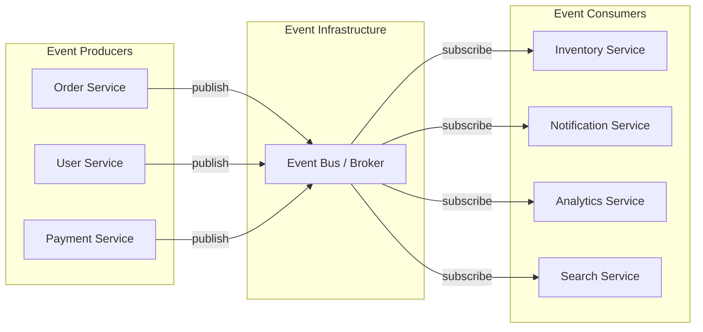

# Event-Driven Architecture

Event-driven architecture (EDA) is a design paradigm where the flow of the program is determined by events — state changes that are broadcast to interested parties. Instead of Service A calling Service B directly (command-driven), Service A publishes an event saying "something happened," and any number of services react independently. The publisher does not know or care who consumes the event.

This inverts the dependency. In command-driven architecture, the sender depends on the receiver. In event-driven architecture, nobody depends on anybody — services are coupled only through the event schema.

## Why Event-Driven Architecture Exists

Command-driven (synchronous) architecture has a fundamental problem: the sender must know the receiver, the receiver must be available, and adding a new reaction requires changing the sender.

```
Command-driven (sender depends on receivers):
  OrderService.placeOrder() {
    inventoryService.reserve();      // Must know about inventory
    paymentService.charge();          // Must know about payment
    notificationService.send();       // Must know about notification
    analyticsService.track();         // Must know about analytics
    // Adding a new reaction = changing OrderService
  }
```

```
Event-driven (nobody depends on nobody):
  OrderService.placeOrder() {
    eventBus.publish("order.placed", orderData);
    // Does not know or care who reacts
  }

  // Each service subscribes independently:
  InventoryService:    subscribe("order.placed") → reserve stock
  PaymentService:      subscribe("order.placed") → charge customer
  NotificationService: subscribe("order.placed") → send confirmation
  AnalyticsService:    subscribe("order.placed") → track conversion
  // Adding a new reaction = adding a new subscriber. Zero changes to OrderService.
```

## When Event-Driven Architecture Is the Right Choice

EDA is appropriate when:

1. **Multiple services need to react to the same event** — pub/sub naturally supports multiple subscribers
2. **You need temporal decoupling** — the producer and consumers don't need to be available simultaneously
3. **You need an audit trail** — events are a natural audit log of everything that happened
4. **Different parts of the system change at different rates** — adding subscribers doesn't require changing publishers
5. **You need to replay history** — events can be replayed to rebuild state or create new projections

EDA is NOT appropriate when:

1. **You need an immediate response** — events are async; the producer doesn't wait for consumers
2. **You need strong consistency** — events create eventual consistency, not strong consistency
3. **The flow is simple and linear** — a direct function call is simpler than publishing an event for a single consumer
4. **You have a small team** — the operational overhead of a message broker and event infrastructure may not be justified

## Core Concepts



| Concept | Definition |
|---|---|
| **Event** | An immutable record of something that happened in the past |
| **Producer** | A service that publishes events when its state changes |
| **Consumer** | A service that reacts to events from other services |
| **Event Bus / Broker** | Infrastructure that routes events from producers to consumers |
| **Topic / Channel** | A named stream of related events (e.g., "order.placed") |
| **Subscription** | A consumer's registration to receive events from a topic |
| **Event Schema** | The structure of an event (fields, types, versioning) |

## Section Contents

| Page | What You Will Learn |
|---|---|
| [Event Types](./event-types) | Domain events, integration events, notification events, event-carried state transfer, fat vs thin events |
| [Event Bus Patterns](./event-bus-patterns) | In-process mediator, message brokers (Kafka, RabbitMQ), event stores, choosing the right bus |
| [Event Choreography](./event-choreography) | Services reacting independently, choreography-based sagas, benefits and drawbacks |
| [Event Orchestration](./event-orchestration) | Central coordinator, orchestration-based sagas, comparison with choreography |
| [Event Schema Evolution](./event-schema-evolution) | Schema registry, backward/forward compatibility, versioned events, upcasting |
| [Eventual Consistency](./eventual-consistency) | Why eventual consistency is unavoidable, patterns for handling it, UI patterns |

## The Event Contract

An event is a first-class API. It should be versioned, documented, and treated with the same care as a REST endpoint. A good event has:

```typescript
interface DomainEvent<T = unknown> {
  // Identity
  eventId: string;           // Globally unique, for deduplication
  eventType: string;         // e.g., "order.placed", "payment.completed"
  eventVersion: number;      // Schema version (for evolution)

  // Timing
  timestamp: string;         // ISO 8601 — when the event occurred

  // Provenance
  source: string;            // Which service produced this event
  correlationId: string;     // Links related events in a business flow
  causationId: string;       // Which event or command caused this event

  // Payload
  data: T;                   // The event-specific data

  // Metadata
  metadata?: Record<string, string>;
}
```

Every field is intentional:
- `eventId` enables idempotent processing — consumers can detect and skip duplicate events
- `correlationId` enables distributed tracing — all events in a business flow share a correlation ID
- `causationId` enables causal ordering — you can reconstruct the cause-and-effect chain
- `eventVersion` enables schema evolution — consumers can handle multiple versions

## Decision Checklist

```
Is event-driven architecture right for your use case?

[ ] Multiple services need to react to the same state change
[ ] Reactions can happen asynchronously (no immediate response needed)
[ ] You want to add new reactions without modifying the producer
[ ] You need an audit trail of state changes
[ ] You can tolerate eventual consistency (seconds, not milliseconds)
[ ] You have or will set up a message broker (Kafka, RabbitMQ, etc.)
[ ] Your team understands async debugging (distributed tracing, log correlation)
[ ] You have a strategy for handling failed event processing (DLQ, retry)

Score: ___/8

6-8: Event-driven architecture is a strong fit
3-5: Use event-driven selectively (for specific flows, not everything)
0-2: Command-driven (synchronous) will serve you better
```

::: info War Story
A logistics company adopted event-driven architecture for their package tracking system. Every scan event (pickup, warehouse arrival, truck loaded, out for delivery, delivered) was published as an event. Over 30 services consumed these events: the customer-facing tracking page, internal dashboards, driver routing, warehouse capacity planning, SLA monitoring, billing (charges based on delivery time), insurance claims processing, and more. Adding a new consumer (e.g., carbon footprint tracking) required zero changes to the scanning system. The scanning system published events and never knew or cared how many services were listening. This is the ideal use case for EDA: a single source of truth (scans) with many diverse consumers that are added over time.
:::
