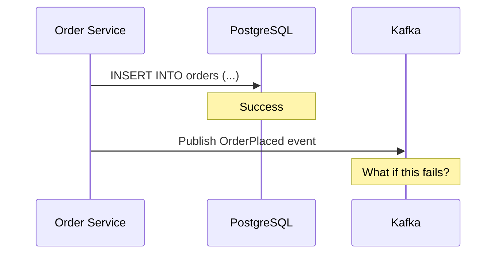
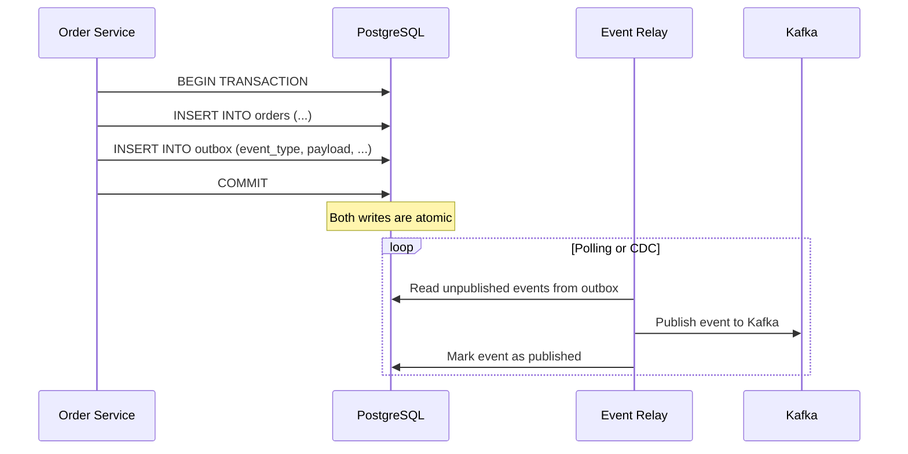
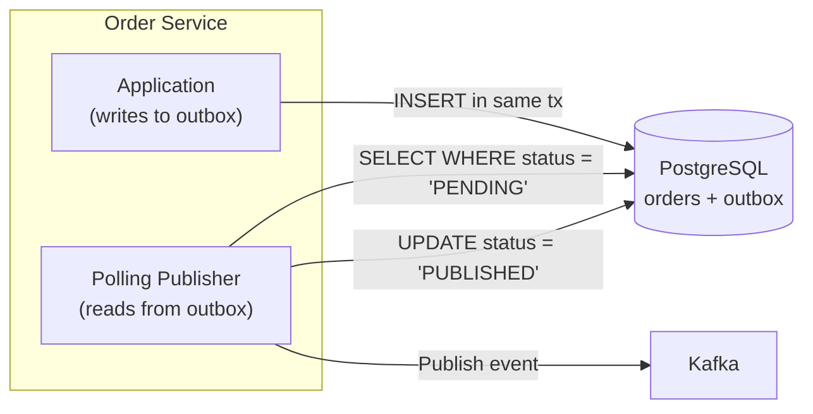
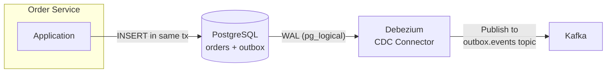
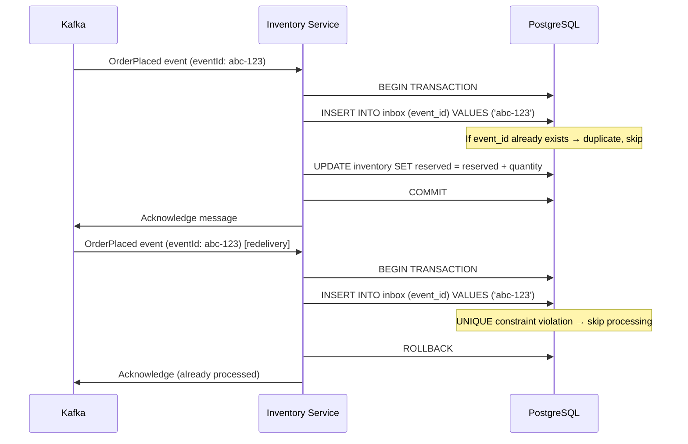
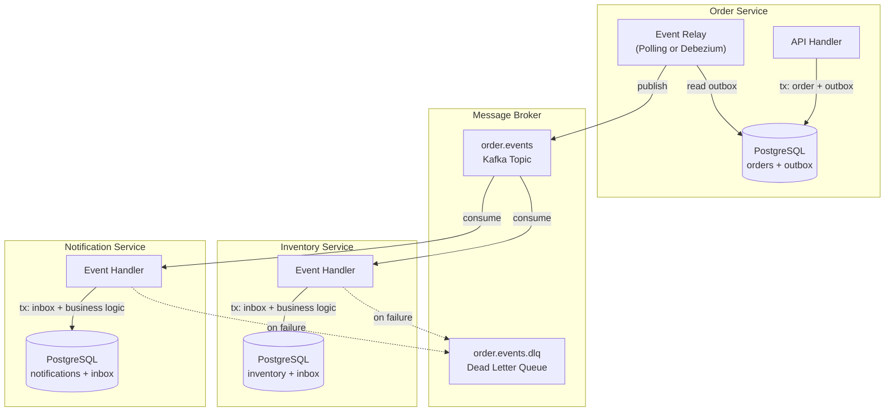

# Transactional Outbox Pattern

## The Dual-Write Problem

Every event-driven system faces the same fundamental problem: a service needs to update its database **and** publish an event. These are two separate operations targeting two separate systems. If either one fails after the other succeeds, the system becomes inconsistent.

Consider an order service that must save an order to its database and publish an `OrderPlaced` event to Kafka:



Three failure scenarios:

| Scenario | What Happens | Result |
|----------|-------------|--------|
| DB succeeds, Kafka fails | Order saved but event never published | Downstream services never learn about the order (inventory not reserved, email not sent) |
| DB fails, Kafka succeeds | Event published but order not saved | Downstream services react to a phantom order that doesn't exist |
| Both succeed, then DB rolls back | Transaction rolled back after event published | Same as above — phantom event |

You cannot wrap a database transaction and a Kafka publish in a single atomic operation. They are separate systems with separate transaction managers. Distributed transactions (2PC/XA) technically work but are fragile, slow, and most message brokers don't support them.

::: danger The Dual-Write Problem Is Not Theoretical
This is one of the most common bugs in event-driven systems. It often goes undetected for months because the failure rate is low (only happens during network blips or broker outages). Then during a Kafka upgrade or a database failover, hundreds of events are lost or duplicated. The transactional outbox pattern eliminates this class of bugs entirely.
:::

## The Solution: Transactional Outbox

Instead of writing to two systems, write to one system — the database — in a single transaction. Store the event in an **outbox table** within the same database, inside the same transaction as the business data change. A separate process reads the outbox table and publishes events to the message broker.



The atomicity guarantee comes from the database transaction. Either both the order and the outbox event are committed, or neither is. The event relay (publisher) is a separate process that handles the second write (to Kafka) independently, with its own retry logic.

## Outbox Table Design

### Schema

```sql
CREATE TABLE outbox (
    id              UUID PRIMARY KEY DEFAULT gen_random_uuid(),
    aggregate_type  VARCHAR(255) NOT NULL,     -- e.g., 'Order', 'Payment'
    aggregate_id    VARCHAR(255) NOT NULL,     -- e.g., the order_id
    event_type      VARCHAR(255) NOT NULL,     -- e.g., 'OrderPlaced', 'OrderCancelled'
    payload         JSONB NOT NULL,            -- the full event payload
    metadata        JSONB,                     -- correlation_id, causation_id, etc.
    created_at      TIMESTAMP NOT NULL DEFAULT NOW(),
    published_at    TIMESTAMP,                 -- NULL until published
    retry_count     INT NOT NULL DEFAULT 0,
    status          VARCHAR(20) NOT NULL DEFAULT 'PENDING'
        CHECK (status IN ('PENDING', 'PUBLISHED', 'FAILED'))
);

-- Index for the polling publisher
CREATE INDEX idx_outbox_pending ON outbox (created_at)
    WHERE status = 'PENDING';

-- Index for cleanup
CREATE INDEX idx_outbox_published ON outbox (published_at)
    WHERE status = 'PUBLISHED';
```

### Key Design Decisions

| Decision | Recommendation | Rationale |
|----------|---------------|-----------|
| **Payload format** | JSONB (PostgreSQL) | Allows querying event content for debugging without deserializing |
| **Ordering** | `created_at` + `id` | Guarantees deterministic ordering for the publisher |
| **Aggregate fields** | `aggregate_type` + `aggregate_id` | Enables routing events to different Kafka topics per aggregate |
| **Status tracking** | `PENDING` / `PUBLISHED` / `FAILED` | The publisher needs to know which events to process |
| **Retention** | Delete after 7 days of `PUBLISHED` | Outbox is transient, not an event store |

### Writing to the Outbox

```typescript
// order.service.ts
import { Pool } from 'pg';
import { v4 as uuidv4 } from 'uuid';

interface CreateOrderRequest {
  customerId: string;
  items: Array<{ productId: string; quantity: number; price: number }>;
}

async function createOrder(pool: Pool, request: CreateOrderRequest): Promise<string> {
  const client = await pool.connect();

  try {
    await client.query('BEGIN');

    // 1. Insert the order (business data)
    const orderId = uuidv4();
    const totalAmount = request.items.reduce((sum, item) => sum + item.price * item.quantity, 0);

    await client.query(
      `INSERT INTO orders (id, customer_id, total_amount, status, created_at)
       VALUES ($1, $2, $3, 'CREATED', NOW())`,
      [orderId, request.customerId, totalAmount]
    );

    // 2. Insert order items
    for (const item of request.items) {
      await client.query(
        `INSERT INTO order_items (order_id, product_id, quantity, price)
         VALUES ($1, $2, $3, $4)`,
        [orderId, item.productId, item.quantity, item.price]
      );
    }

    // 3. Insert the outbox event (SAME TRANSACTION)
    const eventPayload = {
      orderId,
      customerId: request.customerId,
      totalAmount,
      items: request.items,
      occurredAt: new Date().toISOString(),
    };

    await client.query(
      `INSERT INTO outbox (aggregate_type, aggregate_id, event_type, payload, metadata)
       VALUES ($1, $2, $3, $4, $5)`,
      [
        'Order',
        orderId,
        'OrderPlaced',
        JSON.stringify(eventPayload),
        JSON.stringify({
          correlationId: uuidv4(),
          userId: request.customerId,
        }),
      ]
    );

    await client.query('COMMIT');
    return orderId;
  } catch (error) {
    await client.query('ROLLBACK');
    throw error;
  } finally {
    client.release();
  }
}
```

::: tip The Outbox Write Must Be in the Same Transaction
This is the entire point of the pattern. If the outbox write is in a separate transaction (or worse, a separate database), you have reintroduced the dual-write problem. The outbox table must be in the same database as the business data, and the writes must share the same transaction.
:::

## Publishing: Polling vs CDC

There are two approaches to reading events from the outbox and publishing them to the message broker.

### Approach 1: Polling Publisher

The simplest approach. A background process periodically queries the outbox table for unpublished events and publishes them.



```typescript
// polling-publisher.ts
import { Pool } from 'pg';
import { Kafka, Producer } from 'kafkajs';

class PollingPublisher {
  private pool: Pool;
  private producer: Producer;
  private intervalMs: number;
  private batchSize: number;

  constructor(pool: Pool, producer: Producer, intervalMs = 1000, batchSize = 100) {
    this.pool = pool;
    this.producer = producer;
    this.intervalMs = intervalMs;
    this.batchSize = batchSize;
  }

  async start(): Promise<void> {
    await this.producer.connect();

    setInterval(async () => {
      try {
        await this.publishBatch();
      } catch (error) {
        console.error('Polling publisher error:', error);
      }
    }, this.intervalMs);
  }

  private async publishBatch(): Promise<void> {
    const client = await this.pool.connect();

    try {
      // SELECT FOR UPDATE SKIP LOCKED prevents concurrent publishers
      // from processing the same events
      await client.query('BEGIN');

      const result = await client.query(
        `SELECT id, aggregate_type, aggregate_id, event_type, payload, metadata
         FROM outbox
         WHERE status = 'PENDING'
         ORDER BY created_at ASC
         LIMIT $1
         FOR UPDATE SKIP LOCKED`,
        [this.batchSize]
      );

      if (result.rows.length === 0) {
        await client.query('COMMIT');
        return;
      }

      // Publish to Kafka
      const messages = result.rows.map(row => ({
        topic: `${row.aggregate_type.toLowerCase()}.events`,
        messages: [{
          key: row.aggregate_id,
          value: JSON.stringify({
            eventId: row.id,
            eventType: row.event_type,
            aggregateId: row.aggregate_id,
            payload: row.payload,
            metadata: row.metadata,
          }),
        }],
      }));

      await this.producer.sendBatch({ topicMessages: messages });

      // Mark as published
      const ids = result.rows.map(r => r.id);
      await client.query(
        `UPDATE outbox SET status = 'PUBLISHED', published_at = NOW()
         WHERE id = ANY($1)`,
        [ids]
      );

      await client.query('COMMIT');
    } catch (error) {
      await client.query('ROLLBACK');
      throw error;
    } finally {
      client.release();
    }
  }
}
```

**Polling Publisher Trade-offs:**

| Advantage | Disadvantage |
|-----------|-------------|
| Simple to implement | Adds latency (polling interval) |
| No external dependencies | Database load from frequent polling |
| Easy to debug and monitor | Ordering requires careful locking |
| Works with any database | Scaling requires `SKIP LOCKED` or partitioning |

### Approach 2: CDC with Debezium

Change Data Capture (CDC) reads the database's Write-Ahead Log (WAL) to capture inserts to the outbox table in real-time, without polling.



Debezium, the most popular open-source CDC tool, reads the PostgreSQL WAL and publishes every outbox insert as a Kafka message. This eliminates polling, reduces latency to near real-time, and adds zero load to the database.

**Debezium Connector Configuration:**

```json
{
  "name": "outbox-connector",
  "config": {
    "connector.class": "io.debezium.connector.postgresql.PostgresConnector",
    "database.hostname": "postgres",
    "database.port": "5432",
    "database.user": "debezium",
    "database.password": "secret",
    "database.dbname": "orderservice",
    "database.server.name": "orderservice",
    "table.include.list": "public.outbox",

    "transforms": "outbox",
    "transforms.outbox.type": "io.debezium.transforms.outbox.EventRouter",
    "transforms.outbox.table.fields.additional.placement": "event_type:header:eventType",
    "transforms.outbox.route.by.field": "aggregate_type",
    "transforms.outbox.route.topic.replacement": "${routedByValue}.events"
  }
}
```

Debezium's `EventRouter` transform is purpose-built for the outbox pattern. It extracts the event payload from the outbox row, routes it to the correct Kafka topic based on `aggregate_type`, and adds the `event_type` as a Kafka header.

**CDC Publisher Trade-offs:**

| Advantage | Disadvantage |
|-----------|-------------|
| Near real-time latency (<100ms) | Requires Debezium infrastructure (Kafka Connect) |
| Zero database polling load | More complex to operate and monitor |
| Guaranteed ordering (WAL order) | Database must support logical replication |
| Exactly the events that were committed | WAL retention must be managed |

::: warning Choosing Between Polling and CDC
Start with polling. It is simpler, easier to debug, and sufficient for most use cases. Move to CDC when: (a) you need sub-second latency, (b) polling frequency is causing database load, or (c) you already have Debezium/Kafka Connect in your infrastructure. Most teams never need CDC for the outbox — polling at 1-second intervals is fast enough.
:::

## The Inbox Pattern: Reliable Consumers

The outbox solves the producer side. The **inbox pattern** solves the consumer side: ensuring that events are processed exactly once, even if they are delivered multiple times (which is inevitable with at-least-once delivery).



### Inbox Table

```sql
CREATE TABLE inbox (
    event_id    UUID PRIMARY KEY,
    event_type  VARCHAR(255) NOT NULL,
    received_at TIMESTAMP NOT NULL DEFAULT NOW(),
    processed_at TIMESTAMP
);

-- Cleanup: delete entries older than 30 days
-- (events older than your Kafka retention period cannot be redelivered)
```

### Consumer Implementation

```typescript
// inbox-consumer.ts

async function handleEvent(pool: Pool, event: DomainEvent): Promise<void> {
  const client = await pool.connect();

  try {
    await client.query('BEGIN');

    // Attempt to insert into inbox (idempotency check)
    const insertResult = await client.query(
      `INSERT INTO inbox (event_id, event_type)
       VALUES ($1, $2)
       ON CONFLICT (event_id) DO NOTHING
       RETURNING event_id`,
      [event.eventId, event.eventType]
    );

    if (insertResult.rowCount === 0) {
      // Event already processed — skip
      await client.query('ROLLBACK');
      console.log(`Duplicate event ${event.eventId}, skipping`);
      return;
    }

    // Process the event (business logic)
    switch (event.eventType) {
      case 'OrderPlaced':
        await reserveInventory(client, event.payload);
        break;
      case 'OrderCancelled':
        await releaseInventory(client, event.payload);
        break;
      default:
        console.warn(`Unknown event type: ${event.eventType}`);
    }

    // Mark as processed
    await client.query(
      `UPDATE inbox SET processed_at = NOW() WHERE event_id = $1`,
      [event.eventId]
    );

    await client.query('COMMIT');
  } catch (error) {
    await client.query('ROLLBACK');
    throw error; // Will trigger redelivery from Kafka
  } finally {
    client.release();
  }
}
```

The inbox insert and the business logic are in the same transaction. If the business logic fails, the inbox entry is rolled back, and the event will be redelivered and retried. If the business logic succeeds, the inbox entry persists, and any redelivery is detected and skipped.

See [Idempotent Consumers](./idempotent-consumers) for a deeper exploration of idempotency strategies beyond the inbox pattern.

## Outbox Maintenance

The outbox table accumulates rows over time. Without maintenance, it will grow unbounded and degrade performance.

```sql
-- Delete published events older than 7 days
DELETE FROM outbox
WHERE status = 'PUBLISHED'
  AND published_at < NOW() - INTERVAL '7 days';

-- Alert on stuck events (pending for more than 5 minutes)
SELECT COUNT(*) AS stuck_events
FROM outbox
WHERE status = 'PENDING'
  AND created_at < NOW() - INTERVAL '5 minutes';

-- Move permanently failed events to a dead letter table
INSERT INTO outbox_dead_letter
SELECT * FROM outbox
WHERE status = 'FAILED'
  AND retry_count >= 5;

DELETE FROM outbox
WHERE status = 'FAILED'
  AND retry_count >= 5;
```

::: tip Monitor the Outbox
The outbox is a critical component. If the publisher stops working, events pile up and downstream systems go stale. Set up alerts on:
- Number of `PENDING` events (should stay near zero)
- Age of the oldest `PENDING` event (should be < polling interval)
- `FAILED` event count (should be zero)
- Outbox table size (should not grow unbounded)
:::

## End-to-End Architecture



## Common Pitfalls

| Pitfall | Problem | Solution |
|---------|---------|---------|
| **Outbox in a separate database** | Reintroduces dual-write problem | Outbox must be in the same database as business data |
| **Publishing before commit** | Event published but transaction rolls back | Always publish after commit (the relay reads committed data) |
| **No ordering guarantee** | Events arrive out of order at consumers | Partition by aggregate_id in Kafka (all events for the same order go to the same partition) |
| **Forgetting cleanup** | Outbox grows to millions of rows, slowing queries | Schedule daily cleanup of published events |
| **No dead letter handling** | Permanently failing events block the publisher | Move failed events to a DLQ after N retries |
| **Consumer processes before inbox check** | Side effects executed before idempotency check | Always check inbox first, then process |

## Further Reading

- Chris Richardson, *"Microservices Patterns"* — Chapter 3 covers the transactional outbox in detail
- Debezium documentation: [debezium.io/documentation/reference/transformations/outbox-event-router.html](https://debezium.io/documentation/reference/transformations/outbox-event-router.html)
- Related Archon pages:
  - [Idempotent Consumers](./idempotent-consumers) — deeper exploration of consumer-side idempotency
  - [Event Bus Patterns](./event-bus-patterns) — the message broker infrastructure that the outbox publishes to
  - [Eventual Consistency](./eventual-consistency) — the consistency model that the outbox pattern operates within
  - [Event Types](./event-types) — designing the events that flow through the outbox
  - [CDC Patterns](/data-engineering/pipeline-patterns/cdc-patterns) — change data capture as a general data engineering pattern
  - [Distributed Transactions](/system-design/distributed-systems/distributed-transactions) — why 2PC is not the answer
