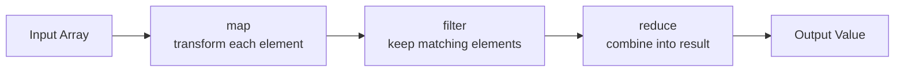

# FP Core Concepts

## Higher-Order Functions

A higher-order function (HOF) is a function that either **takes a function as an argument** or **returns a function as its result** (or both). HOFs are the fundamental tool for abstraction in FP — they let you parameterize behavior the way variables parameterize data.

```typescript
// Takes a function as argument
function filter<T>(arr: T[], predicate: (item: T) => boolean): T[] {
  const result: T[] = [];
  for (const item of arr) {
    if (predicate(item)) result.push(item);
  }
  return result;
}

// Returns a function as result
function multiplier(factor: number): (x: number) => number {
  return (x: number) => x * factor;
}

const double = multiplier(2);
const triple = multiplier(3);
console.log(double(5));  // 10
console.log(triple(5));  // 15

// Both: takes function, returns function
function compose<A, B, C>(
  f: (b: B) => C,
  g: (a: A) => B,
): (a: A) => C {
  return (a: A) => f(g(a));
}
```

### Common HOF Patterns

| Pattern | Description | Example |
|---------|------------|---------|
| **Callback** | Pass behavior to be executed later | `setTimeout(fn, 1000)` |
| **Predicate** | Pass a test function | `array.filter(x => x > 0)` |
| **Transformer** | Pass a mapping function | `array.map(x => x.name)` |
| **Reducer** | Pass an accumulator function | `array.reduce((sum, x) => sum + x, 0)` |
| **Factory** | Return a configured function | `createLogger(level)` returns a log function |
| **Decorator** | Wrap a function to add behavior | `withRetry(fetchData, 3)` |

### Real-World HOF: Middleware

Express/Koa middleware is a HOF pattern — each middleware is a function that receives the next handler:

```typescript
type Middleware = (ctx: Context, next: () => Promise<void>) => Promise<void>;

function withTiming(name: string): Middleware {
  return async (ctx, next) => {
    const start = performance.now();
    await next();
    const duration = performance.now() - start;
    ctx.setHeader(`X-Timing-${name}`, `${duration.toFixed(2)}ms`);
  };
}

function withAuth(verifier: TokenVerifier): Middleware {
  return async (ctx, next) => {
    const token = ctx.headers.authorization?.replace('Bearer ', '');
    if (!token) throw new UnauthorizedError();
    ctx.user = await verifier.verify(token);
    await next();
  };
}
```

## Closures

A closure is a function that **captures variables from its enclosing scope**. The captured variables remain alive as long as the closure exists, even after the enclosing scope has returned.

```typescript
function createCounter(initial: number = 0) {
  let count = initial;  // Captured by the closures below

  return {
    increment: () => ++count,
    decrement: () => --count,
    value: () => count,
  };
}

const counter = createCounter(10);
counter.increment(); // 11
counter.increment(); // 12
counter.value();     // 12
// `count` is not accessible directly — encapsulation via closure
```

### Closures for Configuration

Closures are the FP equivalent of constructor injection — they bind configuration to behavior:

::: code-group

```python
# Python: closure for database configuration
def create_user_repository(connection_pool):
    """Returns repository functions bound to a specific connection pool."""

    async def find_by_id(user_id: str) -> dict | None:
        async with connection_pool.acquire() as conn:
            return await conn.fetchrow(
                "SELECT * FROM users WHERE id = $1", user_id
            )

    async def save(user: dict) -> None:
        async with connection_pool.acquire() as conn:
            await conn.execute(
                "INSERT INTO users (id, name, email) VALUES ($1, $2, $3)",
                user["id"], user["name"], user["email"],
            )

    return {"find_by_id": find_by_id, "save": save}

# Usage
repo = create_user_repository(pool)
user = await repo["find_by_id"]("user_123")
```

```go
// Go: closure for retry logic
func withRetry(maxAttempts int, backoff time.Duration) func(func() error) error {
    return func(operation func() error) error {
        var lastErr error
        for attempt := 0; attempt < maxAttempts; attempt++ {
            if err := operation(); err != nil {
                lastErr = err
                time.Sleep(backoff * time.Duration(1<<attempt))
                continue
            }
            return nil
        }
        return fmt.Errorf("failed after %d attempts: %w", maxAttempts, lastErr)
    }
}

retry := withRetry(3, 100*time.Millisecond)
err := retry(func() error {
    return httpClient.Post(url, payload)
})
```

:::

## Currying

Currying transforms a function that takes multiple arguments into a chain of functions that each take a single argument.

$$f(a, b, c) \rightarrow f(a)(b)(c)$$

```typescript
// Non-curried
function add(a: number, b: number): number {
  return a + b;
}
add(2, 3); // 5

// Curried
function curriedAdd(a: number): (b: number) => number {
  return (b: number) => a + b;
}
const add2 = curriedAdd(2);
add2(3); // 5
add2(10); // 12
```

### Why Curry?

Currying enables **partial application** — creating specialized functions from general ones:

```typescript
// General-purpose curried logger
const log = (level: string) => (module: string) => (message: string) => {
  console.log(`[${level}] [${module}] ${message}`);
};

// Specialized loggers via partial application
const warn = log('WARN');
const warnAuth = warn('auth');
const warnDB = warn('database');

warnAuth('Invalid token received');     // [WARN] [auth] Invalid token received
warnDB('Connection pool exhausted');     // [WARN] [database] Connection pool exhausted
```

### Automatic Currying

Most FP libraries provide a `curry` utility that auto-curries any function:

```typescript
import { curry } from 'ramda';

const formatPrice = curry(
  (currency: string, decimals: number, amount: number): string => {
    return `${currency}${amount.toFixed(decimals)}`;
  }
);

// All of these work:
formatPrice('$', 2, 19.99);       // "$19.99"
formatPrice('$', 2)(19.99);       // "$19.99"
formatPrice('$')(2)(19.99);       // "$19.99"

const formatUSD = formatPrice('$', 2);
const formatEUR = formatPrice('\u20AC', 2);

[10, 20.5, 99.99].map(formatUSD); // ["$10.00", "$20.50", "$99.99"]
```

## Partial Application

Partial application fixes some arguments of a function, producing a new function with fewer parameters. Unlike currying (which always produces single-argument functions), partial application can fix any number of arguments at once.

::: code-group

```typescript
// Generic partial application
function partial<A, B extends unknown[], R>(
  fn: (a: A, ...rest: B) => R,
  a: A,
): (...rest: B) => R {
  return (...rest: B) => fn(a, ...rest);
}

// Real-world: API client with base URL baked in
function fetchFromAPI(baseUrl: string, path: string, options?: RequestInit) {
  return fetch(`${baseUrl}${path}`, options);
}

const fetchUsers = partial(fetchFromAPI, 'https://api.example.com');
// fetchUsers('/users')
// fetchUsers('/users/123')
```

```python
# Python: built-in partial application
from functools import partial

def power(base, exponent):
    return base ** exponent

square = partial(power, exponent=2)
cube = partial(power, exponent=3)

list(map(square, [1, 2, 3, 4]))  # [1, 4, 9, 16]
list(map(cube, [1, 2, 3, 4]))    # [1, 8, 27, 64]
```

:::

## Map, Filter, Reduce

The holy trinity of functional data transformation. These three operations can express almost any data pipeline.



### Map: Transform Each Element

```typescript
// Transform orders into summaries
const summaries = orders.map(order => ({
  id: order.id,
  total: order.lines.reduce((sum, l) => sum + l.price * l.qty, 0),
  itemCount: order.lines.length,
}));
```

### Filter: Keep Elements That Match

```typescript
// Keep only high-value, active orders
const highValue = orders
  .filter(order => order.status === 'active')
  .filter(order => order.total > 1000);
```

### Reduce: Combine into a Single Result

```typescript
// Group orders by customer
const byCustomer = orders.reduce<Record<string, Order[]>>(
  (groups, order) => ({
    ...groups,
    [order.customerId]: [...(groups[order.customerId] ?? []), order],
  }),
  {},
);
```

### Composing Map/Filter/Reduce

::: code-group

```typescript
// Full pipeline: calculate total revenue from active premium orders
const premiumRevenue = orders
  .filter(o => o.status === 'active')
  .filter(o => o.tier === 'premium')
  .map(o => o.total)
  .reduce((sum, total) => sum + total, 0);
```

```python
# Python equivalent with generators (lazy evaluation)
from functools import reduce

premium_revenue = reduce(
    lambda acc, total: acc + total,
    (o.total
     for o in orders
     if o.status == 'active' and o.tier == 'premium'),
    0,
)
```

:::

::: warning Performance Consideration
Chaining `.map().filter().reduce()` creates intermediate arrays. For large datasets, consider:
- **Transducers** — compose transformations without intermediate collections
- **Generators/iterators** — lazy evaluation, process one element at a time
- **Single reduce** — combine map+filter+reduce into one pass
:::

```typescript
// Single-pass alternative for performance
const premiumRevenue = orders.reduce((sum, order) => {
  if (order.status === 'active' && order.tier === 'premium') {
    return sum + order.total;
  }
  return sum;
}, 0);
```

## Function Composition

Composition is the act of combining simple functions to build complex ones. If `f: A → B` and `g: B → C`, then `g ∘ f: A → C`.

```typescript
// Manual composition
const compose = <A, B, C>(f: (b: B) => C, g: (a: A) => B) =>
  (a: A): C => f(g(a));

const toUpper = (s: string) => s.toUpperCase();
const exclaim = (s: string) => `${s}!`;
const greet = (name: string) => `Hello, ${name}`;

const enthusiasticGreet = compose(exclaim, compose(toUpper, greet));
enthusiasticGreet('world'); // "HELLO, WORLD!"
```

### Pipe and Flow

`compose` reads right-to-left (mathematical notation). `pipe` and `flow` read left-to-right (data flow order), which most developers find more intuitive:

```typescript
// pipe: applies value through a chain of functions
function pipe<A>(value: A): A;
function pipe<A, B>(value: A, f1: (a: A) => B): B;
function pipe<A, B, C>(value: A, f1: (a: A) => B, f2: (b: B) => C): C;
function pipe(value: unknown, ...fns: Function[]): unknown {
  return fns.reduce((acc, fn) => fn(acc), value);
}

// Usage: reads top-to-bottom like a pipeline
const result = pipe(
  rawUserInput,
  trim,
  toLowerCase,
  validateEmail,
  normalizeEmail,
  createUser,
);

// flow: creates a reusable pipeline (no initial value)
const processEmail = flow(
  trim,
  toLowerCase,
  validateEmail,
  normalizeEmail,
);

processEmail('  Alice@Example.COM  '); // "alice@example.com"
```

### Real-World Pipeline: Data Processing

::: code-group

```typescript
// Processing a CSV of transactions
const processTransactions = flow(
  parseCSV,                              // string → RawRow[]
  filterValid,                           // RawRow[] → ValidRow[]
  mapToTransactions,                     // ValidRow[] → Transaction[]
  groupByMerchant,                       // Transaction[] → Map<string, Transaction[]>
  calculateMerchantTotals,               // Map → MerchantSummary[]
  sortByTotal('desc'),                   // MerchantSummary[] → MerchantSummary[]
  take(10),                              // MerchantSummary[] → MerchantSummary[] (top 10)
);

const topMerchants = processTransactions(csvString);
```

```python
# Python: function composition with reduce
from functools import reduce

def pipe(value, *functions):
    return reduce(lambda acc, fn: fn(acc), functions, value)

result = pipe(
    raw_data,
    parse_json,
    extract_users,
    lambda users: [u for u in users if u["active"]],
    lambda users: sorted(users, key=lambda u: u["created_at"]),
    lambda users: users[:50],
)
```

:::

## Advanced Patterns

### Memoization

Memoization caches the results of pure function calls. Since pure functions always return the same output for the same input, caching is safe:

```typescript
function memoize<Args extends unknown[], Result>(
  fn: (...args: Args) => Result,
  keyFn: (...args: Args) => string = (...args) => JSON.stringify(args),
): (...args: Args) => Result {
  const cache = new Map<string, Result>();

  return (...args: Args): Result => {
    const key = keyFn(...args);
    if (cache.has(key)) return cache.get(key)!;

    const result = fn(...args);
    cache.set(key, result);
    return result;
  };
}

// Fibonacci: O(2^n) → O(n) with memoization
const fib = memoize((n: number): number => {
  if (n <= 1) return n;
  return fib(n - 1) + fib(n - 2);
});

fib(100); // Instant, not heat-death-of-universe
```

### Functors and Method Chaining

A functor is any type that implements `map` — allowing you to transform the value inside a container without unwrapping it:

```typescript
// Array is a functor
[1, 2, 3].map(x => x * 2); // [2, 4, 6]

// Promise is a functor (via .then)
fetch('/api/user')
  .then(res => res.json())
  .then(user => user.name);

// Optional/Maybe is a functor
const maybe = <T>(value: T | null | undefined) => ({
  map: <U>(fn: (val: T) => U) => value != null ? maybe(fn(value)) : maybe<U>(null),
  getOrElse: (defaultVal: T) => value ?? defaultVal,
});

maybe(user)
  .map(u => u.address)
  .map(a => a.zipCode)
  .getOrElse('unknown');
```

For a deep dive into functors, monads, and algebraic effects, see [Monads & Functors in Practice](./monads-functors).

### Transducers (Composable Reducers)

Transducers compose map/filter/reduce operations without creating intermediate arrays:

```typescript
type Reducer<A, R> = (acc: R, val: A) => R;
type Transducer<A, B> = <R>(reducer: Reducer<B, R>) => Reducer<A, R>;

const mapping = <A, B>(fn: (a: A) => B): Transducer<A, B> =>
  <R>(reducer: Reducer<B, R>): Reducer<A, R> =>
    (acc, val) => reducer(acc, fn(val));

const filtering = <A>(pred: (a: A) => boolean): Transducer<A, A> =>
  <R>(reducer: Reducer<A, R>): Reducer<A, R> =>
    (acc, val) => pred(val) ? reducer(acc, val) : acc;

// Compose transducers (single pass through data)
const xform = compose(
  filtering((x: number) => x % 2 === 0),
  mapping((x: number) => x * 10),
);

// Apply to any reducible collection
const result = [1, 2, 3, 4, 5, 6].reduce(
  xform((acc: number[], val: number) => [...acc, val]),
  [],
); // [20, 40, 60] — one pass, no intermediate arrays
```

## Summary Table

| Concept | What It Does | When to Use |
|---------|-------------|-------------|
| **Higher-order functions** | Abstract over behavior | Always — foundational |
| **Closures** | Capture and encapsulate state | Configuration, factories, event handlers |
| **Currying** | Convert multi-arg to single-arg chain | Creating specialized functions, point-free style |
| **Partial application** | Fix some arguments | API clients, configured operations |
| **Map/Filter/Reduce** | Transform collections | Data pipelines, aggregations |
| **Composition (pipe/flow)** | Chain functions into pipelines | Complex transformations, readability |
| **Memoization** | Cache pure function results | Expensive computations, recursive algorithms |
| **Transducers** | Compose reducers without intermediate data | Large datasets, performance-critical paths |

## Further Reading

- [Functional Programming Overview](./) — paradigm foundations, FP vs OOP
- [Monads & Functors](./monads-functors) — Option/Maybe, Result/Either, railway-oriented programming
- [FP in TypeScript](./fp-typescript) — fp-ts, Effect, production patterns
- [Design Patterns](/architecture-patterns/design-patterns/) — Strategy (HOF), Decorator (composition), Iterator (map/filter)
