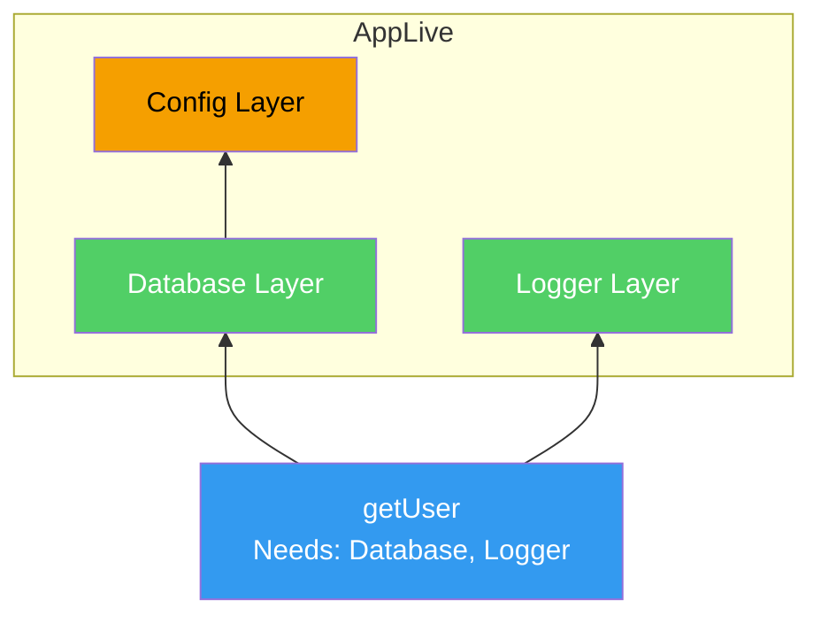
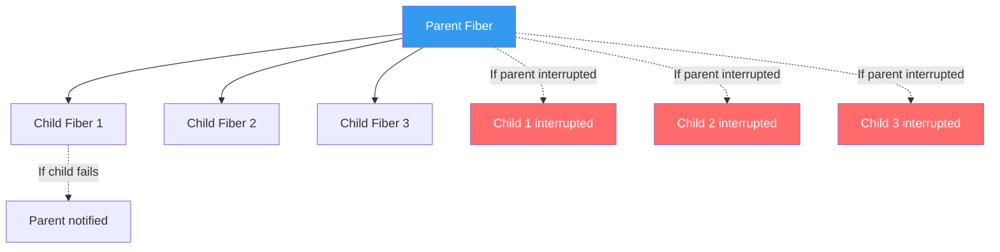

# Effect-TS

Effect is a TypeScript library for building type-safe, composable, concurrent applications. It provides a runtime system that tracks effects (success types, error types, and dependency requirements) in the type system, eliminating entire categories of bugs that TypeScript alone cannot catch.

If fp-ts brought Haskell's type classes to TypeScript, Effect brings Scala ZIO's full effect system — with typed errors, dependency injection, structured concurrency, retries, scheduling, streaming, and schema validation — all checked at compile time.

## The Problem Effect Solves

Consider a typical TypeScript function:

```typescript
// What can go wrong here? The type signature does not tell you.
async function getUser(id: string): Promise<User> {
  const response = await fetch(`/api/users/${id}`);
  if (!response.ok) throw new Error('Failed to fetch user');
  const data = await response.json();
  return UserSchema.parse(data); // Could throw ZodError
}
```

This function can fail in at least 5 ways — network error, HTTP 404, HTTP 500, JSON parse error, Zod validation error — but the type signature only says `Promise<User>`. The caller has no idea what errors to handle. The `try/catch` block catches `unknown`, so even when you do handle errors, you have no type safety.

This is not a minor inconvenience. It is a fundamental gap in TypeScript's type system: **thrown errors are invisible to the type checker.**

```typescript
// The caller has no guidance on what to catch
try {
  const user = await getUser('123');
} catch (e) {
  // e is `unknown` — you are flying blind
  // Is it a network error? A 404? A validation error?
  // The compiler cannot help you.
  if (e instanceof Error) {
    // Still no idea which error type
  }
}
```

### What Effect Changes

With Effect, the same function becomes:

```typescript
import { Effect } from 'effect';

class NetworkError {
  readonly _tag = 'NetworkError';
  constructor(readonly cause: unknown) {}
}

class HttpError {
  readonly _tag = 'HttpError';
  constructor(readonly status: number, readonly body: string) {}
}

class ValidationError {
  readonly _tag = 'ValidationError';
  constructor(readonly issues: Array<string>) {}
}

// The type signature tells you EVERYTHING:
// - Success: User
// - Errors: NetworkError | HttpError | ValidationError
// - Requirements: HttpClient (dependency injection)
declare function getUser(
  id: string
): Effect.Effect<User, NetworkError | HttpError | ValidationError, HttpClient>;
```

Now the caller knows exactly what can fail, the compiler enforces error handling, and the dependency on `HttpClient` is tracked in the type system.

---

## The Effect Type

The core of Effect is the `Effect<Success, Error, Requirements>` type (often abbreviated `Effect<A, E, R>`):

```
Effect<Success, Error, Requirements>
         │        │         │
         │        │         └── What services/dependencies this effect needs
         │        └──────────── What errors this effect can produce (union type)
         └───────────────────── What value this effect produces on success
```

```typescript
import { Effect } from 'effect';

// An effect that succeeds with a number, never fails, needs nothing
type Simple = Effect.Effect<number>;
// Equivalent to: Effect.Effect<number, never, never>

// An effect that succeeds with User, can fail with NotFound or DbError, needs Database
type GetUser = Effect.Effect<User, NotFoundError | DbError, Database>;

// An effect that always fails with AppError, needs Config and Logger
type Failing = Effect.Effect<never, AppError, Config | Logger>;
```

::: info Effect is Lazy
An `Effect` value is a description of a computation, not the execution of it. Creating an `Effect` does nothing — it is a blueprint. You must explicitly run it (with `Effect.runPromise`, `Effect.runSync`, etc.) to execute the computation. This is fundamentally different from `Promise`, which starts executing immediately upon creation.
:::

---

## Creating Effects

### From Values

```typescript
import { Effect } from 'effect';

// Succeed with a value
const succeed: Effect.Effect<number> = Effect.succeed(42);

// Fail with an error
const fail: Effect.Effect<never, Error> = Effect.fail(new Error('boom'));

// Succeed or fail based on a condition
const divide = (a: number, b: number): Effect.Effect<number, Error> =>
  b === 0
    ? Effect.fail(new Error('Division by zero'))
    : Effect.succeed(a / b);
```

### From Synchronous Code

```typescript
// Wrap synchronous code that might throw
const parseJson = (input: string): Effect.Effect<unknown, Error> =>
  Effect.try({
    try: () => JSON.parse(input),
    catch: (e) => new Error(`JSON parse failed: ${e}`),
  });

// Wrap synchronous code that cannot throw
const now: Effect.Effect<number> = Effect.sync(() => Date.now());

// Wrap synchronous code that WILL throw (you handle the error)
const readEnv = (key: string): Effect.Effect<string, Error> =>
  Effect.try({
    try: () => {
      const value = process.env[key];
      if (!value) throw new Error(`Missing env var: ${key}`);
      return value;
    },
    catch: (e) => e as Error,
  });
```

### From Asynchronous Code

```typescript
// Wrap a Promise-based function
const fetchUser = (id: string): Effect.Effect<User, NetworkError> =>
  Effect.tryPromise({
    try: () => fetch(`/api/users/${id}`).then(r => r.json()),
    catch: (e) => new NetworkError(e),
  });

// From an async function with typed error
const readFile = (path: string): Effect.Effect<string, FileError> =>
  Effect.tryPromise({
    try: () => fs.promises.readFile(path, 'utf-8'),
    catch: (e) => new FileError(path, e),
  });

// Wrap a callback-based API
const delay = (ms: number): Effect.Effect<void> =>
  Effect.async<void>((resume) => {
    const timer = setTimeout(() => resume(Effect.succeed(undefined)), ms);
    // Return cleanup function (optional)
    return Effect.sync(() => clearTimeout(timer));
  });
```

---

## Running Effects

Effects are lazy — you must run them to get results:

```typescript
import { Effect } from 'effect';

const program = Effect.succeed(42);

// Run and get a Promise
const result: Promise<number> = Effect.runPromise(program);
// result: 42

// Run synchronously (only if the effect is sync)
const syncResult: number = Effect.runSync(program);
// syncResult: 42

// Run and get an Exit (success or failure, never throws)
const exit: Exit<number, never> = Effect.runSyncExit(program);

// Run a program that can fail
const failing = Effect.fail(new Error('boom'));

// runPromise rejects on failure
Effect.runPromise(failing).catch(console.error);

// runPromiseExit never rejects — returns Exit<A, E>
const exitResult = await Effect.runPromiseExit(failing);
// exitResult: Exit.Failure(Error('boom'))
```

---

## Composing Effects with pipe and gen

### The pipe Style

```typescript
import { Effect, pipe } from 'effect';

const program = pipe(
  Effect.succeed('hello'),
  Effect.map((s) => s.toUpperCase()),                    // Transform success
  Effect.flatMap((s) => Effect.succeed(`${s}, WORLD`)),  // Chain effects
  Effect.tap((s) => Effect.sync(() => console.log(s))),  // Side effect, keep value
);

// Result: "HELLO, WORLD"
```

### The gen Style (Recommended)

Effect provides a generator-based syntax that looks like async/await but tracks errors and requirements:

```typescript
import { Effect } from 'effect';

// This looks like regular imperative code, but:
// - Error types are tracked
// - Dependencies are tracked
// - It is fully composable
const program = Effect.gen(function* () {
  const config = yield* getConfig;           // might need Config service
  const user = yield* fetchUser(config.id);  // might fail with NetworkError
  const posts = yield* fetchPosts(user.id);  // might fail with DbError

  return { user, posts };
});

// program: Effect.Effect<{ user: User; posts: Post[] }, NetworkError | DbError, Config>
// The type is INFERRED — all errors and requirements bubble up automatically
```

`Effect.gen` is the recommended way to write Effect code. It provides the readability of imperative code with the safety guarantees of the effect system. Each `yield*` is like `await` but for effects.

---

## Error Handling

### Tagged Errors

Effect uses discriminated unions (tagged errors) for type-safe error handling:

```typescript
// Define error types with _tag discriminant
class NotFoundError {
  readonly _tag = 'NotFoundError';
  constructor(readonly resource: string, readonly id: string) {}
}

class ValidationError {
  readonly _tag = 'ValidationError';
  constructor(readonly field: string, readonly message: string) {}
}

class DatabaseError {
  readonly _tag = 'DatabaseError';
  constructor(readonly query: string, readonly cause: unknown) {}
}

// Functions that fail with typed errors
const findUser = (id: string): Effect.Effect<User, NotFoundError | DatabaseError> =>
  Effect.gen(function* () {
    const row = yield* queryDb(`SELECT * FROM users WHERE id = $1`, [id]);
    if (!row) return yield* Effect.fail(new NotFoundError('User', id));
    return row as User;
  });
```

### catchTag — Handle Specific Errors

```typescript
const program = pipe(
  findUser('123'),
  // Handle only NotFoundError, let DatabaseError propagate
  Effect.catchTag('NotFoundError', (e) =>
    Effect.succeed({ id: e.id, name: 'Anonymous', fallback: true })
  ),
);
// program: Effect.Effect<User, DatabaseError>
// NotFoundError is handled, DatabaseError remains in the error channel
```

### catchTags — Handle Multiple Specific Errors

```typescript
const program = pipe(
  findUser('123'),
  Effect.catchTags({
    NotFoundError: (e) => Effect.succeed(defaultUser),
    DatabaseError: (e) => Effect.fail(new ServiceUnavailableError()),
  }),
);
// program: Effect.Effect<User, ServiceUnavailableError>
```

### catchAll — Handle All Errors

```typescript
const program = pipe(
  findUser('123'),
  Effect.catchAll((error) => {
    // error: NotFoundError | DatabaseError (union type)
    console.error('Failed:', error._tag);
    return Effect.succeed(defaultUser);
  }),
);
// program: Effect.Effect<User, never>
// All errors are handled
```

### mapError — Transform Errors

```typescript
// Convert internal errors to API-friendly errors
class ApiError {
  readonly _tag = 'ApiError';
  constructor(readonly status: number, readonly message: string) {}
}

const apiProgram = pipe(
  findUser('123'),
  Effect.mapError((error) => {
    switch (error._tag) {
      case 'NotFoundError':
        return new ApiError(404, `${error.resource} ${error.id} not found`);
      case 'DatabaseError':
        return new ApiError(500, 'Internal server error');
    }
  }),
);
// apiProgram: Effect.Effect<User, ApiError>
```

### orElse — Fallback to Another Effect

```typescript
const program = pipe(
  fetchFromCache(key),
  Effect.orElse(() => fetchFromDatabase(key)),
  Effect.orElse(() => fetchFromRemoteApi(key)),
);
```

---

## Dependency Injection with Context and Layer

Effect's dependency injection is the most powerful feature after typed errors. Dependencies are tracked in the `Requirements` (third) type parameter and resolved using `Context` and `Layer`.

### Defining a Service

```typescript
import { Effect, Context, Layer } from 'effect';

// 1. Define a service interface
class Database extends Context.Tag('Database')<
  Database,
  {
    readonly query: (sql: string, params: unknown[]) => Effect.Effect<unknown[]>;
    readonly execute: (sql: string, params: unknown[]) => Effect.Effect<void>;
  }
>() {}

class Logger extends Context.Tag('Logger')<
  Logger,
  {
    readonly info: (message: string) => Effect.Effect<void>;
    readonly error: (message: string, cause: unknown) => Effect.Effect<void>;
  }
>() {}

class Config extends Context.Tag('Config')<
  Config,
  {
    readonly databaseUrl: string;
    readonly logLevel: 'debug' | 'info' | 'warn' | 'error';
  }
>() {}
```

### Using Services

```typescript
// 2. Use services in your program
const getUser = (id: string) =>
  Effect.gen(function* () {
    const db = yield* Database;           // Access Database service
    const logger = yield* Logger;         // Access Logger service
    
    yield* logger.info(`Fetching user ${id}`);
    
    const rows = yield* db.query('SELECT * FROM users WHERE id = $1', [id]);
    
    if (rows.length === 0) {
      yield* logger.error(`User ${id} not found`, null);
      return yield* Effect.fail(new NotFoundError('User', id));
    }
    
    return rows[0] as User;
  });

// getUser: (id: string) => Effect.Effect<User, NotFoundError, Database | Logger>
// The Requirements type parameter tracks both dependencies
```

### Creating Layers

```typescript
// 3. Create implementations (Layers)
const ConsoleLoggerLive = Layer.succeed(Logger, {
  info: (msg) => Effect.sync(() => console.log(`[INFO] ${msg}`)),
  error: (msg, cause) => Effect.sync(() => console.error(`[ERROR] ${msg}`, cause)),
});

const ConfigLive = Layer.succeed(Config, {
  databaseUrl: process.env.DATABASE_URL!,
  logLevel: 'info',
});

// Layer that depends on another service
const PostgresDatabaseLive = Layer.effect(
  Database,
  Effect.gen(function* () {
    const config = yield* Config;  // This layer needs Config
    const pool = createPool(config.databaseUrl);
    
    return {
      query: (sql, params) =>
        Effect.tryPromise({
          try: () => pool.query(sql, params).then(r => r.rows),
          catch: (e) => new DatabaseError(sql, e),
        }),
      execute: (sql, params) =>
        Effect.tryPromise({
          try: () => pool.query(sql, params).then(() => undefined),
          catch: (e) => new DatabaseError(sql, e),
        }),
    };
  })
);
```

### Composing and Providing Layers

```typescript
// 4. Compose layers into a complete dependency graph
const AppLive = Layer.mergeAll(
  ConsoleLoggerLive,
  PostgresDatabaseLive.pipe(Layer.provide(ConfigLive)),
);
// AppLive provides: Database | Logger

// 5. Run the program with all dependencies provided
const main = getUser('123').pipe(
  Effect.provide(AppLive),
);
// main: Effect.Effect<User, NotFoundError>
// Requirements is now `never` — all dependencies are satisfied

Effect.runPromise(main).then(console.log);
```

### Layer Dependency Graph



### Testing with Layers

```typescript
// Swap implementations for testing — no mocking libraries needed
const TestDatabase = Layer.succeed(Database, {
  query: (sql, params) => Effect.succeed([{ id: '123', name: 'Test User' }]),
  execute: (sql, params) => Effect.succeed(undefined),
});

const TestLogger = Layer.succeed(Logger, {
  info: (msg) => Effect.succeed(undefined),  // Silence in tests
  error: (msg, cause) => Effect.succeed(undefined),
});

const TestLive = Layer.mergeAll(TestDatabase, TestLogger);

// Test runs with fake dependencies
const testResult = await Effect.runPromise(
  getUser('123').pipe(Effect.provide(TestLive))
);
expect(testResult.name).toBe('Test User');
```

---

## Concurrency

Effect provides structured concurrency primitives built on a fiber-based runtime.

### Parallel Execution

```typescript
import { Effect } from 'effect';

// Run effects in parallel, collect all results
const parallel = Effect.all([
  fetchUser('1'),
  fetchUser('2'),
  fetchUser('3'),
], { concurrency: 'unbounded' });
// parallel: Effect.Effect<[User, User, User], NetworkError>

// Run with limited concurrency
const limited = Effect.all(
  userIds.map(fetchUser),
  { concurrency: 5 }  // At most 5 concurrent requests
);

// Run effects in parallel, take the first to succeed
const fastest = Effect.race(
  fetchFromCacheEffect,
  fetchFromDbEffect,
);

// Run all, collecting both successes and failures
const settled = Effect.forEach(
  userIds,
  (id) => fetchUser(id).pipe(Effect.either),
  { concurrency: 10 },
);
// settled: Effect.Effect<Array<Either<User, NetworkError>>>
```

### Fibers

Effects run on fibers — lightweight green threads managed by the Effect runtime:

```typescript
import { Effect, Fiber } from 'effect';

const program = Effect.gen(function* () {
  // Fork an effect onto a new fiber (starts running immediately)
  const fiber = yield* Effect.fork(longRunningTask);
  
  // Do other work while the fiber runs
  yield* doOtherWork();
  
  // Wait for the fiber to complete
  const result = yield* Fiber.join(fiber);
  
  return result;
});

// Fork and forget (fire-and-forget)
const background = Effect.gen(function* () {
  yield* Effect.forkDaemon(sendAnalyticsEvent(event));
  // Does not wait — the daemon fiber runs independently
});

// Race two fibers — loser is automatically interrupted
const withTimeout = pipe(
  longRunningTask,
  Effect.timeout('5 seconds'),
);
```

### Structured Concurrency Guarantees



Effect guarantees:
- When a parent fiber is interrupted, all child fibers are automatically interrupted
- Resources acquired by fibers are always released (even on interruption)
- No orphaned fibers — the fiber tree is always consistent

---

## Scheduling and Retries

```typescript
import { Effect, Schedule } from 'effect';

// Retry with exponential backoff
const resilient = pipe(
  fetchFromApi(url),
  Effect.retry(
    Schedule.exponential('100 millis').pipe(
      Schedule.compose(Schedule.recurs(5)),  // Max 5 retries
    )
  ),
);

// Retry only on specific errors
const selective = pipe(
  fetchFromApi(url),
  Effect.retry({
    schedule: Schedule.exponential('200 millis'),
    while: (error) => error._tag === 'NetworkError',  // Only retry network errors
  }),
);

// Complex schedule: exponential backoff with jitter, capped at 30 seconds
const productionSchedule = Schedule.exponential('100 millis').pipe(
  Schedule.jittered,                       // Add randomness to prevent thundering herd
  Schedule.either(Schedule.spaced('30 seconds')),  // Cap at 30s between retries
  Schedule.compose(Schedule.recurs(10)),   // Max 10 attempts
);

// Repeat an effect on a schedule (not retry — repeat on success)
const polling = pipe(
  checkHealthEndpoint,
  Effect.repeat(Schedule.spaced('10 seconds')),
);
```

---

## Streaming with Stream

Effect includes a streaming module for processing potentially infinite sequences of values:

```typescript
import { Stream, Effect, Sink } from 'effect';

// Create streams
const numbers = Stream.range(1, 100);
const fromArray = Stream.fromIterable([1, 2, 3, 4, 5]);
const ticks = Stream.repeatEffectWithSchedule(
  Effect.sync(() => Date.now()),
  Schedule.spaced('1 second'),
);

// Transform streams
const processed = numbers.pipe(
  Stream.map((n) => n * 2),
  Stream.filter((n) => n > 10),
  Stream.take(5),
);

// Chunked processing for efficiency
const chunked = numbers.pipe(
  Stream.grouped(100),  // Group into chunks of 100
  Stream.mapEffect((chunk) => processBatch(chunk), { concurrency: 3 }),
);

// Consume a stream with a Sink
const sum = Stream.range(1, 100).pipe(
  Stream.run(Sink.sum),
);
// sum: Effect.Effect<number> — evaluates to 5050

// Real-world: process a large file line by line
const processFile = Stream.fromReadableStream(
  () => fs.createReadStream('large-file.csv'),
  (e) => new FileError(e),
).pipe(
  Stream.splitLines,
  Stream.map(parseCsvLine),
  Stream.filter((row) => row.amount > 1000),
  Stream.mapEffect((row) => saveToDatabase(row), { concurrency: 10 }),
  Stream.runCount,
);
```

---

## Schema — Runtime Validation

Effect Schema replaces Zod/io-ts/yup with a validation library that integrates natively with Effect:

```typescript
import { Schema } from 'effect';

// Define a schema (like Zod, but Effect-native)
const User = Schema.Struct({
  id: Schema.String,
  name: Schema.String.pipe(Schema.minLength(1)),
  email: Schema.String.pipe(Schema.pattern(/^[^\s@]+@[^\s@]+\.[^\s@]+$/)),
  age: Schema.Number.pipe(Schema.int(), Schema.between(0, 150)),
  role: Schema.Literal('admin', 'user', 'guest'),
  createdAt: Schema.Date,
});

// Infer the TypeScript type from the schema
type User = typeof User.Type;
// { id: string; name: string; email: string; age: number; role: "admin" | "user" | "guest"; createdAt: Date }

// Decode (parse + validate) returns an Effect
const decode = Schema.decodeUnknown(User);

const result = decode({
  id: '123',
  name: 'Alice',
  email: 'alice@example.com',
  age: 30,
  role: 'admin',
  createdAt: '2026-01-01T00:00:00Z',
});
// result: Effect.Effect<User, ParseError>

// Use in an Effect pipeline
const program = Effect.gen(function* () {
  const raw = yield* fetchRawData();
  const user = yield* Schema.decodeUnknown(User)(raw);
  // user is typed and validated
  return user;
});
```

### Schema Transformations

```typescript
// Schema that transforms during decode/encode
const UserFromApi = Schema.Struct({
  user_id: Schema.String,
  full_name: Schema.String,
  created_at: Schema.String.pipe(Schema.Date),  // String -> Date
}).pipe(
  Schema.rename({
    user_id: 'id',
    full_name: 'name',
    created_at: 'createdAt',
  })
);

// Decode: { user_id: "1", full_name: "Alice", created_at: "2026-01-01" }
// Becomes: { id: "1", name: "Alice", createdAt: Date }

// Encode: reverses the transformation
```

---

## Comparison to fp-ts and io-ts

| Feature | fp-ts + io-ts | Effect | Notes |
|---------|--------------|--------|-------|
| **Error tracking** | `Either<E, A>` (manual) | `Effect<A, E, R>` (automatic) | Effect propagates errors through `gen` automatically |
| **Dependency injection** | `Reader<R, A>` (manual) | `Context` + `Layer` (built-in) | Effect's DI is far more ergonomic |
| **Concurrency** | `Task.sequence` (basic) | Fibers, `Effect.all`, `Effect.race` | Effect has a full concurrent runtime |
| **Streaming** | No built-in | `Stream` module | fp-ts requires external libraries |
| **Validation** | io-ts (separate library) | `Schema` (built-in) | Schema is more feature-rich than io-ts |
| **Scheduling/retry** | Manual | `Schedule` module (built-in) | fp-ts has no retry/schedule support |
| **Learning curve** | Steep (category theory) | Moderate (pragmatic API) | Effect has better docs and more intuitive naming |
| **Bundle size** | ~40 KB | ~200 KB | Effect includes more functionality |
| **Ecosystem maturity** | Stable, maintenance mode | Active development, growing fast | fp-ts is in maintenance; Effect is the successor |

### Migration from fp-ts

```typescript
// fp-ts: manual error threading with pipe
import * as TE from 'fp-ts/TaskEither';
import { pipe } from 'fp-ts/function';

const getUserFpTs = (id: string): TE.TaskEither<AppError, User> =>
  pipe(
    TE.tryCatch(
      () => fetch(`/api/users/${id}`),
      (e) => new NetworkError(e),
    ),
    TE.chain((response) =>
      response.ok
        ? TE.tryCatch(() => response.json(), (e) => new ParseError(e))
        : TE.left(new HttpError(response.status))
    ),
    TE.chain((data) =>
      pipe(
        UserCodec.decode(data),
        E.mapLeft((e) => new ValidationError(e)),
        TE.fromEither,
      )
    ),
  );

// Effect: generator syntax, errors tracked automatically
const getUserEffect = (id: string) =>
  Effect.gen(function* () {
    const response = yield* Effect.tryPromise({
      try: () => fetch(`/api/users/${id}`),
      catch: (e) => new NetworkError(e),
    });

    if (!response.ok) {
      return yield* Effect.fail(new HttpError(response.status));
    }

    const data = yield* Effect.tryPromise({
      try: () => response.json(),
      catch: (e) => new ParseError(e),
    });

    return yield* Schema.decodeUnknown(User)(data);
  });
```

---

## Real-World Patterns

### Pattern 1: Service Layer with Effect

```typescript
// Define your service with typed operations
class UserService extends Context.Tag('UserService')<
  UserService,
  {
    readonly getById: (id: string) => Effect.Effect<User, NotFoundError | DatabaseError>;
    readonly create: (input: CreateUserInput) => Effect.Effect<User, ValidationError | DatabaseError>;
    readonly delete: (id: string) => Effect.Effect<void, NotFoundError | DatabaseError>;
  }
>() {}

// Implement the service
const UserServiceLive = Layer.effect(
  UserService,
  Effect.gen(function* () {
    const db = yield* Database;
    const logger = yield* Logger;

    return {
      getById: (id) =>
        Effect.gen(function* () {
          yield* logger.info(`Getting user ${id}`);
          const rows = yield* db.query('SELECT * FROM users WHERE id = $1', [id]);
          if (rows.length === 0) return yield* Effect.fail(new NotFoundError('User', id));
          return rows[0] as User;
        }),

      create: (input) =>
        Effect.gen(function* () {
          const validated = yield* Schema.decodeUnknown(CreateUserSchema)(input);
          yield* db.execute(
            'INSERT INTO users (name, email) VALUES ($1, $2)',
            [validated.name, validated.email],
          );
          yield* logger.info(`Created user: ${validated.email}`);
          return validated as User;
        }),

      delete: (id) =>
        Effect.gen(function* () {
          const result = yield* db.execute('DELETE FROM users WHERE id = $1', [id]);
          yield* logger.info(`Deleted user ${id}`);
        }),
    };
  })
);
```

### Pattern 2: HTTP Handler with Effect

```typescript
// Express/Hono-style handler using Effect
const getUserHandler = (req: Request): Effect.Effect<Response, never, UserService | Logger> =>
  Effect.gen(function* () {
    const userService = yield* UserService;
    const logger = yield* Logger;
    const id = new URL(req.url).searchParams.get('id');

    if (!id) {
      return new Response(JSON.stringify({ error: 'Missing id' }), { status: 400 });
    }

    const user = yield* userService.getById(id).pipe(
      Effect.catchTags({
        NotFoundError: (e) =>
          Effect.succeed(
            new Response(JSON.stringify({ error: `User ${e.id} not found` }), { status: 404 })
          ),
        DatabaseError: (e) => {
          // Log and return 500
          return Effect.gen(function* () {
            yield* logger.error('Database error', e.cause);
            return new Response(JSON.stringify({ error: 'Internal error' }), { status: 500 });
          });
        },
      }),
    );

    // If we got a Response from error handling, return it
    if (user instanceof Response) return user;

    return new Response(JSON.stringify(user), {
      status: 200,
      headers: { 'Content-Type': 'application/json' },
    });
  });
```

### Pattern 3: Resource Management

```typescript
import { Effect, Scope } from 'effect';

// Acquire and release resources safely (like try-with-resources or Python's `with`)
const managedPool = Effect.acquireRelease(
  // Acquire
  Effect.tryPromise({
    try: () => createDatabasePool({ connectionString: '...' }),
    catch: (e) => new DatabaseError('pool creation', e),
  }),
  // Release (always runs, even on error/interruption)
  (pool) => Effect.promise(() => pool.end()),
);

// Use the managed resource
const program = Effect.scoped(
  Effect.gen(function* () {
    const pool = yield* managedPool;
    const result = yield* queryWithPool(pool, 'SELECT 1');
    return result;
  })
);
// pool.end() is guaranteed to be called when the scope exits
```

### Pattern 4: Graceful Degradation

```typescript
const getProductPrice = (id: string) =>
  Effect.gen(function* () {
    // Try cache first
    const cached = yield* cacheService.get(`price:${id}`).pipe(
      Effect.catchAll(() => Effect.succeed(null)),  // Cache miss is not an error
    );

    if (cached) return cached;

    // Fallback to database
    const price = yield* dbService.getPrice(id).pipe(
      Effect.retry(Schedule.exponential('100 millis').pipe(Schedule.compose(Schedule.recurs(3)))),
      Effect.catchTag('DatabaseError', () =>
        // Final fallback: return stale price from backup
        backupService.getStalePrice(id),
      ),
    );

    // Cache for next time (fire-and-forget)
    yield* Effect.forkDaemon(cacheService.set(`price:${id}`, price, '5 minutes'));

    return price;
  });
```

---

## When to Adopt Effect

### Good Fit

- **Backend services** with complex error handling, multiple dependencies, and concurrency requirements
- **Teams tired of untyped errors** — `catch (e: unknown)` is error handling theater
- **Applications with complex dependency graphs** — Effect's Layer system replaces DI containers
- **Distributed systems** where retry, timeout, and circuit breaker logic is needed
- **Streaming data pipelines** that need backpressure and typed transformations

### Poor Fit

- **Simple scripts** or small utilities — the overhead is not justified
- **Teams unfamiliar with FP** — Effect has a learning curve; it is not beginner-friendly
- **Frontend-heavy applications** — Effect's bundle size (~200 KB) and patterns are more suited to backends
- **Legacy codebases** with no FP culture — incremental adoption is possible but requires team buy-in
- **Tight deadlines** — learning Effect while shipping features is a recipe for frustration

### Incremental Adoption Strategy

```typescript
// Phase 1: Use Effect for new service modules only
// Keep existing code as-is, wrap at boundaries
const legacyWrapper = (legacyFn: () => Promise<User>): Effect.Effect<User, AppError> =>
  Effect.tryPromise({
    try: legacyFn,
    catch: (e) => new AppError(String(e)),
  });

// Phase 2: Introduce typed errors in new code
// Existing error handling remains unchanged

// Phase 3: Migrate service layers to Effect services with Layer
// Testing improves immediately due to Layer-based DI

// Phase 4: Adopt Effect.gen for complex business logic
// Error types propagate automatically
```

---

## Key Takeaways

::: tip Key Takeaways

1. **Effect tracks errors in the type system.** `Effect<User, NotFoundError | DbError>` tells you exactly what can fail. No more `catch (e: unknown)`. This alone justifies adoption for backend services.

2. **Dependencies are type-checked, not injected at runtime.** The `Requirements` type parameter ensures you cannot run an effect without providing all its dependencies. Forgetting a dependency is a compile-time error, not a runtime crash.

3. **`Effect.gen` is the recommended way to write Effect code.** It looks like async/await but tracks errors and requirements. New adopters should use generators, not nested `pipe` chains.

4. **Layers replace DI containers.** You define service interfaces with `Context.Tag`, implement them with `Layer`, and compose them into dependency graphs. Testing is trivial — swap the Layer, no mocking libraries needed.

5. **Effect is the spiritual successor to fp-ts.** fp-ts is in maintenance mode. If you are starting a new TypeScript project with FP, Effect is the modern choice with better ergonomics, more features, and active development.
:::

---

## Misconceptions

::: danger 6 Effect-TS Misconceptions

**1. "Effect is just another fp-ts."**
fp-ts provides type classes (Functor, Monad, etc.) inspired by Haskell's category theory. Effect provides a complete runtime system inspired by Scala ZIO — typed errors, dependency injection, structured concurrency, streaming, scheduling, and schema validation, all as first-class features. They share the FP philosophy but differ vastly in scope and ergonomics.

**2. "You need to understand monads to use Effect."**
Effect.gen lets you write code that looks like regular imperative TypeScript. You use `yield*` instead of `await` and get typed errors as a bonus. The monadic machinery exists under the hood, but the generator syntax hides it. You do not need to understand functors, applicatives, or monads to be productive.

**3. "Effect is too heavy for production."**
Effect is used in production at companies processing millions of events per day. The runtime overhead is negligible compared to network I/O. The ~200 KB bundle size is a consideration for frontend, but backend services (where Effect shines) are not bundle-size-sensitive.

**4. "Typed errors are just discriminated unions — I can do that with plain TypeScript."**
You can define discriminated union error types in plain TypeScript, but you cannot make the compiler track which errors propagate through a call chain. Effect's `gen` syntax automatically unions error types as effects compose, so adding a new error to a deep function updates every caller's type signature automatically. Manual union tracking does not scale.

**5. "Effect replaces everything — I need to go all-in."**
Effect supports incremental adoption. You can wrap existing Promise-based code with `Effect.tryPromise`, use Effect for new service modules while keeping existing code unchanged, and gradually migrate. There is no big-bang rewrite required.

**6. "Effect.gen is slow because it uses generators."**
The generator overhead is microseconds per yield. For any real-world workload involving I/O (database queries, HTTP requests, file reads), the generator overhead is unmeasurable. Effect's runtime has been heavily optimized, and benchmarks show it is comparable to raw Promise performance for I/O-bound work.
:::

---

## When NOT to Use Effect-TS

| Scenario | Why Not | Better Alternative |
|----------|---------|-------------------|
| Simple CRUD API with basic error handling | Overhead not justified | Plain TypeScript + Zod |
| Frontend React components | Bundle size, wrong abstraction level | React hooks, TanStack Query |
| Small scripts / CLI tools | Too much ceremony for simple tasks | Plain TypeScript, tsx |
| Team with no FP experience, tight deadline | Learning curve will slow delivery | Ship first, consider Effect later |
| Library/SDK consumed by others | Forcing Effect on consumers is unfriendly | Plain TypeScript at public API, Effect internally (optional) |
| Already using NestJS or similar DI framework | Two DI systems create confusion | Stick with framework DI or migrate fully |

---

## In Production

::: warning Production Considerations

**Learning curve investment.** Budget 2-4 weeks for a team to become productive with Effect. The gen syntax is intuitive, but Layer composition, service design patterns, and fiber semantics take practice. Start with a non-critical service.

**Debugging.** Effect's stack traces include fiber information and effect boundaries. The `Effect.tap` and `Effect.tapError` combinators are your primary debugging tools — use them liberally. The Effect DevTools extension for VS Code provides visual fiber inspection.

**Testing.** Layer-based DI makes unit testing trivial — no `jest.mock()`, no dependency injection containers, no magic. Define a `TestLayer`, provide it to your effect, run it. Integration tests use `Live` layers. This alone can justify adoption.

**Telemetry.** Effect has built-in OpenTelemetry integration. Effects can be automatically traced, and spans are created at effect boundaries. This provides distributed tracing for free if your infrastructure supports it.

**Error reporting.** Map your typed errors to observability-friendly formats before they reach error reporting services (Sentry, Datadog). A `catchAll` at the top level that converts typed errors to error reports ensures nothing is swallowed silently.

**Versioning.** Effect follows semver but releases frequently. Pin your Effect version and test upgrades explicitly. Breaking changes between major versions can affect Layer APIs and Schema definitions.
:::

---

## Quiz

::: details Quiz — 5 Questions

**Q1: What are the three type parameters of `Effect<A, E, R>` and what does each represent?**
`A` (Success) is the type of the value produced when the effect succeeds. `E` (Error) is the union type of all errors the effect can produce. `R` (Requirements) is the union type of all services/dependencies the effect needs to run. An `Effect<User, NotFoundError | DbError, Database | Logger>` succeeds with `User`, can fail with `NotFoundError` or `DbError`, and requires `Database` and `Logger` services to be provided.

**Q2: How does `Effect.gen` differ from `async/await`?**
Both provide imperative-looking syntax for composing asynchronous operations. However, `async/await` loses error type information — `await` can throw `unknown` and the compiler does not track it. `Effect.gen` with `yield*` preserves the error types: each `yield*` merges the yielded effect's error type into the generator's error channel. Additionally, `Effect.gen` tracks dependency requirements in the `R` parameter, so missing dependencies are compile-time errors.

**Q3: What is a `Layer` in Effect and how does it relate to testing?**
A `Layer` is an implementation of a service that provides the runtime value matching a `Context.Tag` interface. For example, `PostgresDatabaseLive` is a Layer that provides the `Database` service using a real PostgreSQL connection. For testing, you create a `TestDatabase` Layer with mock/fake implementations. Since services are resolved through Layers (not runtime DI containers), swapping implementations requires no mocking library — just provide a different Layer to `Effect.provide()`.

**Q4: Why are Effect values described as "lazy" and how does this differ from Promises?**
An `Effect` value is a description of a computation — it does nothing when created. You must explicitly run it (`Effect.runPromise`, `Effect.runSync`) to execute it. A `Promise`, in contrast, starts executing immediately upon creation (`new Promise((resolve) => { /* runs NOW */ })`). Effect's laziness enables composition without side effects: you can build, transform, and combine effects without triggering any execution, then run the final composed effect once.

**Q5: How does Effect handle resource cleanup on interruption?**
Effect uses `Effect.acquireRelease` (similar to try-with-resources in Java) within a `Scope`. The acquire phase runs first, then the use phase runs with the acquired resource, and the release phase is guaranteed to run — even if the use phase fails or the fiber is interrupted. This prevents resource leaks (database connections, file handles, network sockets) in concurrent and error-prone code. `Effect.scoped` delimits the scope lifetime.
:::

---

## Exercise

::: details Build a Resilient Data Pipeline with Effect

**Scenario:** Build a data ingestion pipeline that reads events from an API, validates them, enriches them from a cache, and writes them to a database — all with typed errors, dependency injection, retries, and concurrency.

**Requirements:**

```typescript
// 1. Define these error types (tagged classes)
// - ApiError (status, message)
// - ValidationError (field, issue)
// - CacheError (key, cause)
// - DatabaseError (query, cause)

// 2. Define these services (Context.Tag)
// - EventApi: { fetchEvents(since: Date): Effect<RawEvent[], ApiError> }
// - Cache: { get(key: string): Effect<unknown, CacheError>; set(key, value, ttl): Effect<void, CacheError> }
// - EventStore: { save(events: EnrichedEvent[]): Effect<void, DatabaseError> }

// 3. Implement the pipeline
const pipeline = Effect.gen(function* () {
  // a. Fetch events from API (retry 3x with exponential backoff on ApiError)
  // b. Validate each event with Effect Schema (collect ValidationErrors, don't stop on first)
  // c. Enrich each valid event from cache (fall back to API if cache misses)
  // d. Save enriched events to database in batches of 100 (concurrency: 3)
  // e. Return summary: { fetched, valid, invalid, saved }
});

// 4. Create Live and Test Layers
// 5. Write tests using Test Layers

// 6. Run the pipeline on a schedule (every 30 seconds)
const scheduled = pipe(
  pipeline,
  Effect.repeat(Schedule.spaced('30 seconds')),
  Effect.provide(LiveLayers),
);
```

**Evaluation criteria:**
- All four error types are tracked in the type system
- Retry logic only retries ApiError, not ValidationError
- Cache failures fall back gracefully (do not stop the pipeline)
- Batch writes use bounded concurrency
- Test Layer provides deterministic, fast tests
- Scheduled execution is clean and cancellable
:::

---

## One-Liner Summary

Effect-TS brings type-safe errors, compile-time dependency injection, structured concurrency, and a full runtime to TypeScript — making invisible failures visible and untestable services trivially testable.

---

## Further Reading

- [FP Core Concepts](/architecture-patterns/functional-programming/core-concepts) — foundations that Effect builds on
- [FP in TypeScript](/architecture-patterns/functional-programming/fp-typescript) — fp-ts, purify-ts, and the ecosystem Effect lives in
- [Monads & Functors](/architecture-patterns/functional-programming/monads-functors) — theory behind Effect's composition model
- [Effect Documentation](https://effect.website/docs/introduction) — official Effect docs and tutorials
- [Structured Output](/ai-ml-engineering/structured-output) — using Effect Schema for AI response validation
