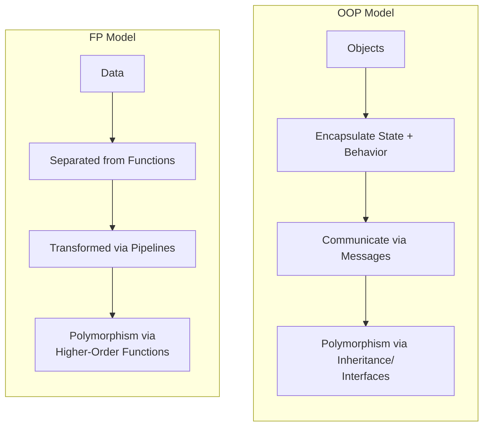
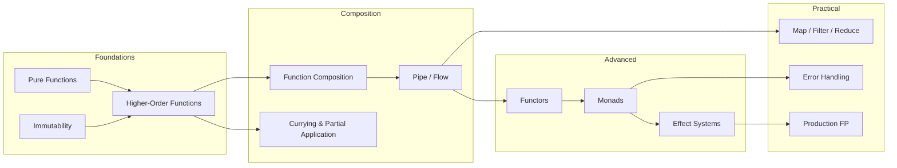

# Functional Programming

## What Is Functional Programming?

Functional programming is a paradigm that treats computation as the evaluation of mathematical functions. The core insight is deceptively simple: **if your functions have no side effects and always return the same output for the same input, your programs become dramatically easier to reason about, test, compose, and parallelize.**

While OOP organizes code around **objects that encapsulate state and behavior**, FP organizes code around **functions that transform data**. OOP asks "what things exist and what can they do?" FP asks "what transformations do I need to apply to my data?"

Neither paradigm is universally better. The best modern codebases blend both — using FP for data transformation pipelines, business rule computation, and concurrent workflows, while using OOP (or module systems) for organizing large-scale system structure.

## The Three Pillars

### 1. Pure Functions

A pure function has two properties:

- **Deterministic**: Given the same inputs, it always returns the same output
- **No side effects**: It does not modify any state outside its scope — no database writes, no console output, no mutating global variables

```typescript
// Pure: same input → same output, no side effects
function calculateTax(income: number, rate: number): number {
  return income * rate;
}

// Impure: reads external state (Date), modifies external state (log)
function calculateTax(income: number): number {
  console.log(`Calculating tax at ${new Date()}`);  // Side effect
  const rate = getCurrentTaxRate();                    // External state
  return income * rate;
}
```

Why do pure functions matter? Because they are:

| Property | Benefit |
|----------|---------|
| **Testable** | No mocking, no setup — just input and output |
| **Cacheable** | Same input always gives same output, so results can be memoized |
| **Parallelizable** | No shared mutable state means no race conditions |
| **Composable** | Pure functions can be freely combined without worrying about execution order |
| **Referentially transparent** | The function call can be replaced with its result without changing program behavior |

### 2. Immutability

In FP, data structures are never modified in place. Instead, transformations produce new data structures, leaving the originals untouched.

::: code-group

```typescript
// Mutable approach (imperative)
const users = [{ name: 'Alice', active: true }, { name: 'Bob', active: false }];
users[1].active = true;  // Mutation! Anyone holding a reference sees the change

// Immutable approach (functional)
const users = [{ name: 'Alice', active: true }, { name: 'Bob', active: false }];
const updatedUsers = users.map(user =>
  user.name === 'Bob' ? { ...user, active: true } : user
);
// `users` is unchanged; `updatedUsers` is a new array
```

```python
# Python: immutable data with dataclasses
from dataclasses import dataclass, replace

@dataclass(frozen=True)
class User:
    name: str
    email: str
    active: bool = True

alice = User(name="Alice", email="alice@example.com")
# alice.active = False  # Raises FrozenInstanceError
inactive_alice = replace(alice, active=False)  # New object
```

:::

### 3. Referential Transparency

An expression is referentially transparent if it can be replaced with its value without changing the program's behavior.

```typescript
// Referentially transparent
const double = (x: number) => x * 2;
const result = double(5) + double(5);
// Can safely replace with: 10 + 10 = 20

// NOT referentially transparent
let counter = 0;
const increment = () => ++counter;
const result2 = increment() + increment();
// Cannot replace: increment() returns 1, then 2 → result is 3, not 2
```

Referential transparency enables the compiler (or runtime) to:
- **Memoize** function results
- **Reorder** evaluations for optimization
- **Parallelize** independent computations
- **Eliminate** dead code with certainty

## FP vs OOP — An Honest Comparison



| Dimension | OOP | FP |
|-----------|-----|-----|
| **Primary abstraction** | Objects (state + behavior) | Functions (transformations) |
| **State management** | Mutable state encapsulated in objects | Immutable data, new copies on change |
| **Polymorphism** | Inheritance, interfaces | Higher-order functions, type classes |
| **Code reuse** | Inheritance, composition | Function composition, HOFs |
| **Side effects** | Managed by convention | Managed by structure (pushed to edges) |
| **Testing** | Requires mocking dependencies | Call function, assert result |
| **Concurrency** | Locks, synchronized, careful design | Natural — no shared mutable state |
| **Learning curve** | Objects are intuitive for modeling | Abstract concepts (monads, functors) |
| **Best for** | Modeling complex domains with rich behavior | Data transformation, pipelines, concurrency |

### When to Use FP

- **Data transformation pipelines** — ETL, API response mapping, report generation
- **Business rule computation** — pricing engines, eligibility checks, scoring
- **Concurrent/parallel workloads** — immutable data eliminates race conditions
- **Event processing** — streams of events transformed through pure functions
- **Configuration and validation** — composable validators, rule engines

### When to Use OOP

- **Complex domain models** — entities with rich behavior and lifecycle
- **Stateful systems** — UI components, game entities, device drivers
- **Framework design** — plugins, middleware, extensibility points
- **Team familiarity** — most engineers learn OOP first

### The Pragmatic Blend

Modern best practice is not "FP vs OOP" but "FP and OOP together":

```typescript
// OOP for structure: domain entity with encapsulated state
class Order {
  private lines: ReadonlyArray<OrderLine>;
  private status: OrderStatus;

  // FP for computation: pure method, no side effects
  get total(): Money {
    return this.lines.reduce(
      (sum, line) => sum.add(line.unitPrice.multiply(line.quantity)),
      Money.zero('USD'),
    );
  }

  // FP for validation: returns a Result instead of throwing
  validateForCheckout(): Result<Order, ValidationError[]> {
    const errors = [
      this.lines.length === 0 ? new EmptyOrderError() : null,
      this.status !== 'draft' ? new InvalidStatusError(this.status) : null,
    ].filter(Boolean) as ValidationError[];

    return errors.length > 0 ? Result.err(errors) : Result.ok(this);
  }
}

// FP for the pipeline: pure transformation chain
const processOrders = (orders: readonly Order[]) =>
  orders
    .filter(order => order.status === 'pending')
    .map(order => order.validateForCheckout())
    .filter(result => result.isOk())
    .map(result => result.unwrap());
```

## FP in Different Languages

| Language | FP Support | Key FP Features |
|----------|-----------|-----------------|
| **Haskell** | Pure FP | Type classes, monads, laziness, algebraic data types |
| **Elixir/Erlang** | FP + Actor model | Pattern matching, immutable data, OTP supervision |
| **Scala** | FP + OOP hybrid | Type classes, for-comprehensions, cats/ZIO |
| **TypeScript** | Multi-paradigm | Higher-order functions, fp-ts/Effect, readonly types |
| **Python** | Multi-paradigm | List comprehensions, functools, dataclasses(frozen) |
| **Go** | Procedural + FP features | First-class functions, closures, no generics until 1.18 |
| **Rust** | Systems + FP | Ownership (enforced immutability), iterators, pattern matching, Option/Result |
| **Java** | OOP + FP (since 8) | Streams, Optional, lambdas, records (since 16) |

## Core Concepts Roadmap



## Getting Started

If you are coming from an imperative or OOP background, start with these mental shifts:

1. **Stop mutating** — use `map`, `filter`, `reduce` instead of `for` loops with mutations
2. **Return, don't throw** — use `Result<T, E>` types instead of exceptions for expected errors
3. **Compose small functions** — build complex behavior by combining simple, pure functions
4. **Push side effects to the edges** — keep your core logic pure; handle I/O at the application boundary

::: tip The Functional Core, Imperative Shell Pattern
The most practical way to adopt FP in a real application: keep your **domain logic** purely functional (no I/O, no side effects, just data in → data out), and confine all side effects (database, HTTP, logging) to a thin **imperative shell** at the application boundary.
:::

## Further Reading

- [FP Core Concepts](./core-concepts) — higher-order functions, closures, currying, composition
- [Monads & Functors](./monads-functors) — Option, Result, Promise as monad, railway-oriented programming
- [FP in TypeScript](./fp-typescript) — fp-ts, Effect, practical production patterns
- [Design Patterns](/architecture-patterns/design-patterns/) — many GoF patterns are FP concepts in disguise
- [Clean Architecture](/architecture-patterns/clean-architecture/) — the functional core, imperative shell maps to inner/outer rings
