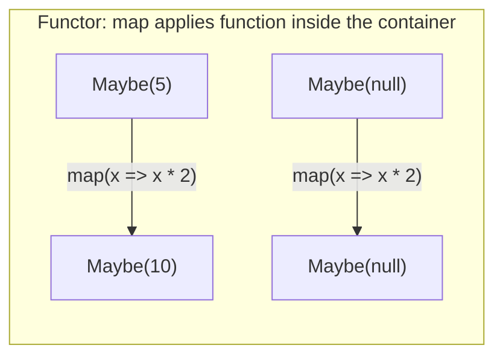
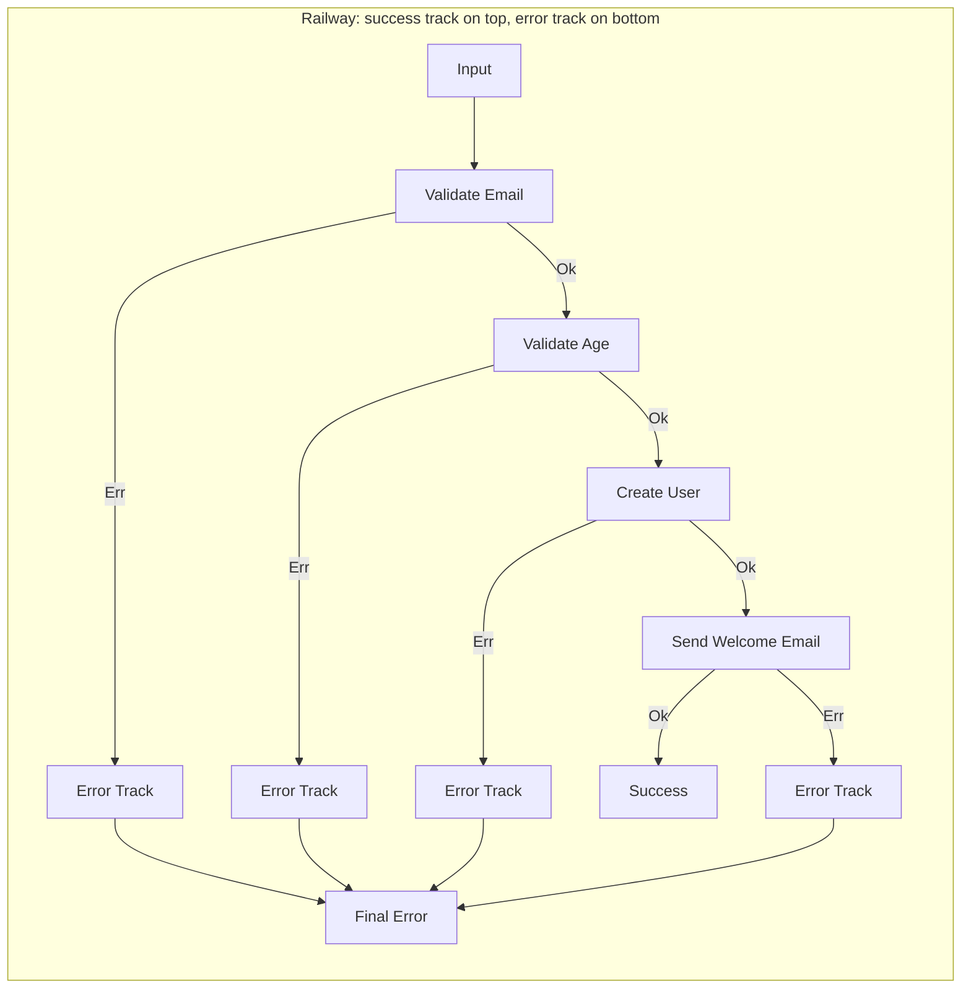

# Monads & Functors in Practice

## Why This Matters

Monads have a reputation for being impossible to explain. The internet is littered with metaphors — burritos, boxes, space suits — that obscure rather than illuminate. Here is the truth: **monads are a design pattern for chaining operations that produce wrapped values, while keeping the wrapping consistent.** You have already used monads — `Promise`, `Array`, and `Optional` are all monads. You just did not know the name.

Understanding monads gives you:
- **Error handling without exceptions** — explicit, composable, type-safe
- **Null-safe code** — eliminate `null`/`undefined` bugs at the type level
- **Composable async** — chain async operations cleanly
- **Railway-oriented programming** — elegant pipelines that handle success and failure

## Functors

A functor is a container that implements a `map` operation, allowing you to apply a function to the value inside without unwrapping it.

### The Functor Laws

A valid functor must satisfy two laws:

1. **Identity**: `container.map(x => x)` equals `container`
2. **Composition**: `container.map(f).map(g)` equals `container.map(x => g(f(x)))`

### Examples of Functors

```typescript
// Array is a functor
[1, 2, 3].map(x => x * 2);  // [2, 4, 6]

// Promise is a functor (via .then)
Promise.resolve(5).then(x => x * 2);  // Promise<10>

// Let's build our own: Maybe functor
class Maybe<T> {
  private constructor(private readonly value: T | null) {}

  static of<T>(value: T): Maybe<T> {
    return new Maybe(value);
  }

  static none<T>(): Maybe<T> {
    return new Maybe<T>(null);
  }

  static fromNullable<T>(value: T | null | undefined): Maybe<T> {
    return value != null ? Maybe.of(value) : Maybe.none();
  }

  map<U>(fn: (value: T) => U): Maybe<U> {
    if (this.value === null) return Maybe.none<U>();
    return Maybe.of(fn(this.value));
  }

  getOrElse(defaultValue: T): T {
    return this.value ?? defaultValue;
  }
}
```



## Monads

A monad is a functor that also implements `flatMap` (also called `chain` or `bind`). While `map` wraps the result in a new container, `flatMap` lets the function itself return a container, avoiding nested wrapping.

### The Monad Laws

1. **Left identity**: `Monad.of(a).flatMap(f)` equals `f(a)`
2. **Right identity**: `monad.flatMap(Monad.of)` equals `monad`
3. **Associativity**: `monad.flatMap(f).flatMap(g)` equals `monad.flatMap(x => f(x).flatMap(g))`

### The Key Difference: map vs flatMap

```typescript
// Problem: map causes nesting
function findUser(id: string): Maybe<User> { /* ... */ }
function getUserAddress(user: User): Maybe<Address> { /* ... */ }

// Using map: nested Maybe<Maybe<Address>> — not useful
const nested = findUser('123').map(user => getUserAddress(user));
// Type: Maybe<Maybe<Address>>

// Using flatMap: flattened to Maybe<Address>
const flat = findUser('123').flatMap(user => getUserAddress(user));
// Type: Maybe<Address>
```

## Option/Maybe Monad

The Maybe monad represents a value that may or may not exist. It replaces `null`/`undefined` with a type-safe container.

```typescript
class Maybe<T> {
  private constructor(private readonly value: T | null) {}

  static of<T>(value: T): Maybe<T> {
    return new Maybe(value);
  }

  static none<T>(): Maybe<T> {
    return new Maybe<T>(null);
  }

  static fromNullable<T>(value: T | null | undefined): Maybe<T> {
    return value != null ? Maybe.of(value) : Maybe.none();
  }

  isNone(): boolean {
    return this.value === null;
  }

  map<U>(fn: (value: T) => U): Maybe<U> {
    return this.isNone() ? Maybe.none() : Maybe.of(fn(this.value!));
  }

  flatMap<U>(fn: (value: T) => Maybe<U>): Maybe<U> {
    return this.isNone() ? Maybe.none() : fn(this.value!);
  }

  getOrElse(defaultValue: T): T {
    return this.value ?? defaultValue;
  }

  match<U>(patterns: { some: (value: T) => U; none: () => U }): U {
    return this.isNone() ? patterns.none() : patterns.some(this.value!);
  }
}
```

### Eliminating Null Chains

```typescript
// WITHOUT Maybe: null-check pyramid of doom
function getZipCode(user: User | null): string {
  if (user === null) return 'unknown';
  if (user.address === null) return 'unknown';
  if (user.address.zipCode === null) return 'unknown';
  return user.address.zipCode;
}

// WITH Maybe: clean chain
const zipCode = Maybe.fromNullable(user)
  .flatMap(u => Maybe.fromNullable(u.address))
  .flatMap(a => Maybe.fromNullable(a.zipCode))
  .getOrElse('unknown');
```

### Real-World: Configuration Lookup

```typescript
function getConfig(key: string): Maybe<string> {
  return Maybe.fromNullable(process.env[key]);
}

const dbUrl = getConfig('DATABASE_URL')
  .map(url => new URL(url))
  .map(url => ({ host: url.hostname, port: parseInt(url.port), db: url.pathname.slice(1) }))
  .getOrElse({ host: 'localhost', port: 5432, db: 'app_dev' });
```

## Result/Either Monad

The Result monad represents a computation that can either **succeed** with a value or **fail** with an error. It replaces exception-based error handling with explicit, composable error types.

```typescript
class Result<T, E> {
  private constructor(
    private readonly value: T | null,
    private readonly error: E | null,
    private readonly _isOk: boolean,
  ) {}

  static ok<T, E = never>(value: T): Result<T, E> {
    return new Result<T, E>(value, null, true);
  }

  static err<E, T = never>(error: E): Result<T, E> {
    return new Result<T, E>(null, error, false);
  }

  isOk(): boolean {
    return this._isOk;
  }

  isErr(): boolean {
    return !this._isOk;
  }

  map<U>(fn: (value: T) => U): Result<U, E> {
    return this._isOk
      ? Result.ok(fn(this.value!))
      : Result.err(this.error!);
  }

  mapErr<F>(fn: (error: E) => F): Result<T, F> {
    return this._isOk
      ? Result.ok(this.value!)
      : Result.err(fn(this.error!));
  }

  flatMap<U>(fn: (value: T) => Result<U, E>): Result<U, E> {
    return this._isOk ? fn(this.value!) : Result.err(this.error!);
  }

  match<U>(patterns: { ok: (value: T) => U; err: (error: E) => U }): U {
    return this._isOk
      ? patterns.ok(this.value!)
      : patterns.err(this.error!);
  }

  unwrapOr(defaultValue: T): T {
    return this._isOk ? this.value! : defaultValue;
  }
}
```

### Error Handling Without Exceptions

```typescript
// Define error types (not just strings)
type ValidationError =
  | { type: 'missing_field'; field: string }
  | { type: 'invalid_format'; field: string; expected: string }
  | { type: 'out_of_range'; field: string; min: number; max: number };

function validateEmail(email: string): Result<string, ValidationError> {
  if (!email) return Result.err({ type: 'missing_field', field: 'email' });
  if (!email.includes('@')) {
    return Result.err({ type: 'invalid_format', field: 'email', expected: 'user@domain.com' });
  }
  return Result.ok(email.toLowerCase().trim());
}

function validateAge(age: number): Result<number, ValidationError> {
  if (age < 0 || age > 150) {
    return Result.err({ type: 'out_of_range', field: 'age', min: 0, max: 150 });
  }
  return Result.ok(age);
}

// Compose validations
function validateUser(input: unknown): Result<ValidUser, ValidationError> {
  const data = input as Record<string, unknown>;

  return validateEmail(data.email as string)
    .flatMap(email =>
      validateAge(data.age as number)
        .map(age => ({ email, age }))
    );
}
```

## Promise as a Monad

JavaScript's `Promise` is a monad (with some caveats). Understanding it through the monad lens explains its behavior:

| Monad Operation | Promise Equivalent | Description |
|----------------|-------------------|-------------|
| `of` / `return` | `Promise.resolve(value)` | Wrap a value in a Promise |
| `map` | `.then(value => transform(value))` | Transform the resolved value |
| `flatMap` / `chain` | `.then(value => asyncOperation(value))` | Chain async operations (auto-flattens) |
| Error channel | `.catch(error => handle(error))` | The "Left" side of the Either |

```typescript
// Promise chain is monadic composition
const userProfile = fetchUser(userId)          // Promise<User>
  .then(user => fetchOrders(user.id))          // flatMap: Promise<Order[]>
  .then(orders => orders.filter(o => o.total > 100))  // map: Promise<Order[]>
  .then(orders => ({ userId, orders }));       // map: Promise<UserProfile>
```

::: warning Promise is not a perfect monad
Promise auto-flattens nested Promises (you can never have `Promise<Promise<T>>`), and `.then()` conflates `map` and `flatMap`. It also eagerly executes side effects. These deviations from the monad laws make it "monad-ish" rather than a strict monad.
:::

## Railway-Oriented Programming

Railway-oriented programming (ROP) is a metaphor from Scott Wlaschin that visualizes Result-based pipelines as a two-track railway:



Once a step fails, all subsequent steps are skipped — the computation "switches to the error track" and flows straight to the end. This is exactly what `flatMap` does with `Result.err`.

### Implementation

```typescript
// Railway-oriented user registration
type RegistrationError =
  | { type: 'validation'; errors: ValidationError[] }
  | { type: 'duplicate_email'; email: string }
  | { type: 'email_delivery_failed'; reason: string };

function registerUser(input: unknown): Result<User, RegistrationError> {
  return validateInput(input)                    // Step 1: validate
    .flatMap(valid => checkDuplicateEmail(valid)) // Step 2: check uniqueness
    .flatMap(valid => createUser(valid))          // Step 3: persist
    .flatMap(user => sendWelcomeEmail(user));     // Step 4: notify
}

// Each function returns Result — the chain short-circuits on any error
function validateInput(input: unknown): Result<ValidInput, RegistrationError> {
  const errors = validate(input);
  return errors.length > 0
    ? Result.err({ type: 'validation', errors })
    : Result.ok(input as ValidInput);
}

function checkDuplicateEmail(input: ValidInput): Result<ValidInput, RegistrationError> {
  const exists = userRepo.existsByEmail(input.email);
  return exists
    ? Result.err({ type: 'duplicate_email', email: input.email })
    : Result.ok(input);
}
```

### Async Railway

```typescript
// Async version using Promise<Result<T, E>>
type AsyncResult<T, E> = Promise<Result<T, E>>;

async function registerUserAsync(input: unknown): AsyncResult<User, RegistrationError> {
  const validated = validateInput(input);
  if (validated.isErr()) return validated;

  const unique = await checkDuplicateEmailAsync(validated.unwrap());
  if (unique.isErr()) return unique;

  const user = await createUserAsync(unique.unwrap());
  if (user.isErr()) return user;

  const emailed = await sendWelcomeEmailAsync(user.unwrap());
  return emailed;
}
```

::: tip For cleaner async railway code
Use libraries like [fp-ts](./fp-typescript) `TaskEither` or [Effect](./fp-typescript) which provide first-class support for async Result chaining without the manual unwrapping.
:::

## Combining Monads

### Traversal: Array of Results to Result of Array

A common problem: you have an array of values and a function that returns a `Result` for each. You want a single `Result` containing all successful values, or the first error.

```typescript
function traverse<T, U, E>(
  items: T[],
  fn: (item: T) => Result<U, E>,
): Result<U[], E> {
  const results: U[] = [];
  for (const item of items) {
    const result = fn(item);
    if (result.isErr()) return result as unknown as Result<U[], E>;
    results.push(result.unwrap());
  }
  return Result.ok(results);
}

// Validate all order lines — fail on first invalid line
const validatedLines = traverse(orderLines, validateOrderLine);
// Result<ValidOrderLine[], ValidationError>
```

### Combining Independent Results

```typescript
function combine<A, B, E>(
  resultA: Result<A, E>,
  resultB: Result<B, E>,
): Result<[A, B], E> {
  if (resultA.isErr()) return Result.err(resultA.unwrapErr());
  if (resultB.isErr()) return Result.err(resultB.unwrapErr());
  return Result.ok([resultA.unwrap(), resultB.unwrap()]);
}

// Validate email and age independently
const user = combine(
  validateEmail(input.email),
  validateAge(input.age),
).map(([email, age]) => ({ email, age }));
```

## Monads in Other Languages

| Language | Option/Maybe | Result/Either | Effect/IO |
|----------|-------------|---------------|-----------|
| **Rust** | `Option<T>` | `Result<T, E>` | N/A (ownership model) |
| **Haskell** | `Maybe a` | `Either e a` | `IO a` |
| **Scala** | `Option[T]` | `Either[E, T]` | `ZIO[R, E, A]` |
| **Swift** | `Optional<T>` (`T?`) | `Result<T, Error>` | Combine framework |
| **Kotlin** | `T?` (nullable) | `Result<T>` | Arrow `Either` |
| **Java** | `Optional<T>` | N/A (use Vavr `Either`) | N/A |
| **TypeScript** | fp-ts `Option` | fp-ts `Either` | Effect `Effect<A, E, R>` |

### Rust Example

```rust
// Rust has first-class Option and Result with the ? operator
fn parse_config(raw: &str) -> Result<Config, ConfigError> {
    let parsed: Value = serde_json::from_str(raw)
        .map_err(|e| ConfigError::ParseFailed(e.to_string()))?;

    let host = parsed.get("host")
        .and_then(|v| v.as_str())
        .ok_or(ConfigError::MissingField("host"))?;

    let port = parsed.get("port")
        .and_then(|v| v.as_u64())
        .ok_or(ConfigError::MissingField("port"))?;

    Ok(Config {
        host: host.to_string(),
        port: port as u16,
    })
}
// The ? operator is syntactic sugar for flatMap — it short-circuits on Err
```

## When to Use Which

| Pattern | Use When | Avoid When |
|---------|----------|------------|
| **Maybe/Option** | Value may be absent (lookup, first match, optional config) | You need to know *why* something failed |
| **Result/Either** | Operation can fail with a meaningful error | Errors are truly exceptional (OOM, stack overflow) |
| **Promise** | Async operations | You need synchronous monadic composition |
| **Validation** | Collecting *all* errors, not just the first | You want fast-fail behavior |
| **IO/Effect** | Managing side effects with referential transparency | Simple scripts where purity adds no value |

## Further Reading

- [FP Core Concepts](./core-concepts) — higher-order functions, closures, composition
- [FP in TypeScript](./fp-typescript) — fp-ts `Option`, `Either`, `TaskEither`, and Effect
- [Functional Programming Overview](./) — paradigm foundations
- [SOLID Principles](/architecture-patterns/solid-principles/) — DIP and OCP connect to monadic abstraction
