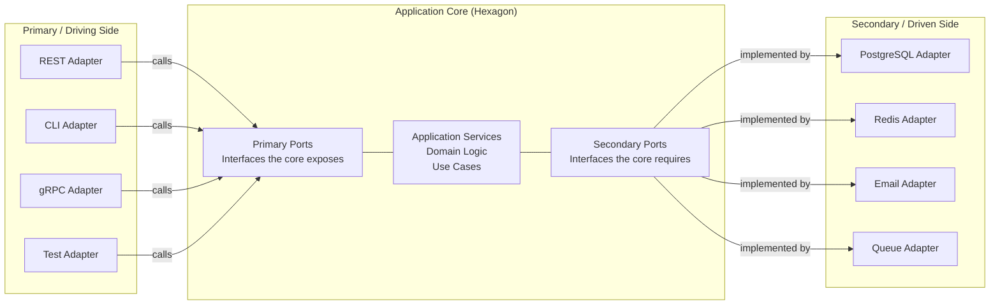

# Hexagonal Architecture

Hexagonal Architecture, formally named **Ports and Adapters**, was introduced by Alistair Cockburn in 2005 in a paper titled "Hexagonal Architecture" on his personal wiki. The driving observation was simple but devastating: most application codebases are permanently coupled to the technologies that deliver and store their data — HTTP frameworks, databases, message queues — and this coupling makes them expensive to test, fragile to change, and impossible to run outside their production environment.

The pattern's central idea is equally simple: **draw a hard boundary around your application's business logic and make everything else plug in through well-defined interfaces.** The application becomes a hexagon at the center of a diagram. Every external system — user interfaces, databases, email services, message queues — connects through a port on the hexagon's perimeter. Nothing crosses that boundary without going through the interface.

## The Problem with Layered Architecture

To understand why hexagonal architecture exists, you need to understand the problem it replaced.

Layered architecture (also called N-tier or three-tier architecture) was the dominant pattern from the late 1990s through the mid-2000s. It organizes code into horizontal layers:

```
┌────────────────────────────┐
│      Presentation Layer    │  Controllers, views, request/response
├────────────────────────────┤
│      Business Logic Layer  │  Services, domain logic
├────────────────────────────┤
│      Data Access Layer     │  Repositories, ORM, SQL
├────────────────────────────┤
│           Database         │  PostgreSQL, MySQL, Oracle
└────────────────────────────┘
```

The rule is that each layer depends only on the layer below it. Presentation calls Business Logic. Business Logic calls Data Access. Data Access calls the Database. This is better than spaghetti code where everything calls everything, but it has a fatal flaw: **dependencies flow downward, and the database is at the bottom.**

Your most valuable code — the business logic — depends on your database layer. This means:

- You cannot test business logic without a database
- You cannot swap databases without rewriting the business logic layer
- You cannot run the application from a CLI or a queue consumer without bringing up an HTTP framework
- Tests are slow and brittle because they require database setup and teardown
- The business logic layer quietly leaks database concepts (transaction management, lazy loading, column names) upward

Real codebases compound this problem. The business logic layer also ends up depending on the HTTP framework (for request context), the email library (for sending notifications), the file system (for uploads), and a dozen other external concerns. The "business logic" layer becomes a catch-all that knows about every external system.

Cockburn observed that the application had two fundamentally different kinds of external contact:
1. **Actors that drive the application** — users, API clients, automated tests, CLI scripts
2. **Actors that the application drives** — databases, email services, message queues, external APIs

Layered architecture conflated these. Hexagonal architecture separates them.

## The Port/Adapter Metaphor

The hexagon shape was chosen deliberately but somewhat arbitrarily — Cockburn needed a shape with multiple sides to draw ports on, and hexagons looked better than octagons. The geometry is not significant. What matters is the metaphor:

**A port is a purpose.** On the left side of the hexagon (the "primary" or "driving" side) are ports that represent ways the outside world initiates interaction with the application. On the right side (the "secondary" or "driven" side) are ports that represent ways the application initiates interaction with the outside world.

**An adapter is a translation layer.** An adapter implements a port by translating between the external technology's language and the application's language. A REST adapter translates HTTP requests into method calls on the application core. A PostgreSQL adapter translates the application's repository calls into SQL queries.



The critical insight is the direction of dependencies. **The application core has zero dependencies on any adapter.** The adapters depend on the core — they implement the ports the core defines, or they call the interfaces the core exposes. This is a deliberate inversion of the layered architecture's dependency direction.

## Primary Ports: Driving the Application

A primary port is an interface that the application exposes to the world. It defines what the application can do, in the application's own language, without any reference to how the caller will invoke it.

```typescript
// Primary port: what can the application do?
interface OrderService {
  placeOrder(customerId: CustomerId, items: OrderItem[]): Promise<OrderId>
  cancelOrder(orderId: OrderId, reason: string): Promise<void>
  getOrder(orderId: OrderId): Promise<Order | null>
}
```

A REST adapter implements an HTTP handler that translates the incoming HTTP request into a call to `orderService.placeOrder(...)`. A CLI adapter parses command-line arguments and calls the same `orderService.placeOrder(...)`. A test adapter calls `orderService.placeOrder(...)` directly in a unit test.

All three adapters call the same interface. The application core knows nothing about HTTP, command-line arguments, or test frameworks.

## Secondary Ports: What the Application Needs

A secondary port is an interface that the application defines to express a need it has — usually something that involves I/O. The application says "I need to be able to save orders" without specifying how or where.

```typescript
// Secondary port: what does the application need?
interface OrderRepository {
  save(order: Order): Promise<void>
  findById(id: OrderId): Promise<Order | null>
  findByCustomer(customerId: CustomerId): Promise<Order[]>
}
```

A PostgreSQL adapter implements this interface by writing SQL. An InMemory adapter implements it with a Map. The application core calls `this.orderRepository.save(order)` and does not care which adapter is plugged in.

## The Application Core Has Zero External Dependencies

This is the rule that makes everything else work. The application core — your domain entities, application services, use cases — must not import anything from:

- HTTP frameworks (Express, Fastify, NestJS HTTP module)
- Database libraries (TypeORM, Prisma, Knex)
- Email libraries (Nodemailer, SendGrid SDK)
- Queue libraries (Bull, RabbitMQ, Kafka client)
- File system libraries (beyond Node's built-in `fs`)
- Any external API SDK

If you look at the `package.json` dependencies of the application core, it should have essentially nothing — only TypeScript types and perhaps a few pure utility libraries.

This constraint is what enables testability. You can test the entire application core with zero infrastructure. No database to set up, no HTTP server to start, no external services to mock at the network level. You inject test doubles that implement the secondary ports and call the primary ports directly.

## Benefits of Hexagonal Architecture

### Testability

This is the most immediate and tangible benefit. Because the application core has no external dependencies, you can write fast, deterministic unit tests that exercise your business logic without touching a database or making HTTP calls.

A test for the order placement flow becomes:

```typescript
describe('PlaceOrder', () => {
  it('should reject orders from banned customers', async () => {
    const orderRepo = new InMemoryOrderRepository()
    const customerRepo = new InMemoryCustomerRepository()
    // Pre-populate: customer exists and is banned
    await customerRepo.save(new Customer({ id: 'customer-1', banned: true }))

    const service = new OrderService(orderRepo, customerRepo)

    await expect(
      service.placeOrder('customer-1', [{ productId: 'p1', qty: 2 }])
    ).rejects.toThrow(CustomerBannedError)
  })
})
```

No database. No HTTP server. The test runs in milliseconds.

### Flexibility and Replaceability

Because adapters are isolated behind port interfaces, you can swap them without touching the application core. Migrating from PostgreSQL to CockroachDB means writing a new adapter that implements the same repository interfaces. The application services, domain entities, and use cases remain untouched.

Real migrations that would take months in a tightly coupled codebase take days when the core is properly isolated.

### Multiple Delivery Mechanisms

You can expose the same application through multiple delivery mechanisms simultaneously. An e-commerce application might have:
- A REST API for the frontend
- A GraphQL API for a partner ecosystem
- A CLI for operations and data migrations
- A queue consumer for async order processing
- A gRPC API for a mobile app

All of these are adapters calling the same application core. There is no duplication of business logic.

### Isolation of Concerns

Each adapter handles exactly one concern: translating between one external system and the application's language. The REST adapter handles HTTP parsing, status code mapping, and JSON serialization. The PostgreSQL adapter handles SQL generation, connection pooling, and result mapping. Neither concern bleeds into the application core.

### Developer Experience

Working on application logic is pleasant when the core has no external dependencies. You can run use case tests at sub-100ms without a database. You can develop new features by writing application code and tests before writing any adapter code. You can explore ideas rapidly.

## Hexagonal vs Layered Architecture

| Dimension | Layered Architecture | Hexagonal Architecture |
|---|---|---|
| Dependency direction | Always downward | Inward (toward the core) |
| Business logic depends on | Database layer | Nothing external |
| Testing | Requires database | Fast unit tests possible |
| DB swap | Rewrite business layer | Write new adapter |
| Multiple UIs | Complicated | Natural (multiple primary adapters) |
| Complexity | Lower (simpler structure) | Higher (more files, more interfaces) |
| Learning curve | Low | Medium |

## Hexagonal vs Clean Architecture

Robert Martin's Clean Architecture (2017) is closely related and often confused with Hexagonal Architecture. They share the same core insight: **dependencies should point inward, toward the most stable business logic.** Both achieve the same goal: a testable, framework-independent application core.

The differences are organizational:

- **Hexagonal** is deliberately simple. Cockburn defined it with two concepts: ports (interfaces) and adapters (implementations). No layers, no circles.
- **Clean Architecture** adds organizational structure: four concentric circles (Entities, Use Cases, Interface Adapters, Frameworks & Drivers) with specific rules about what each circle can depend on.

In practice, many teams combine them. They use hexagonal architecture's port/adapter terminology and Clean Architecture's layer organization. The concepts complement each other.

## Hexagonal vs Domain-Driven Design

Hexagonal Architecture and Domain-Driven Design (DDD) are frequently used together, but they solve different problems:

- **DDD** addresses how to model complex business domains — bounded contexts, aggregates, domain events, ubiquitous language.
- **Hexagonal Architecture** addresses how to organize code so the domain model is isolated from external concerns.

DDD naturally fits inside hexagonal architecture's core. The domain entities and domain services live in the hexagon. The repositories (secondary ports) are defined in the domain layer. The application services (use cases) orchestrate the domain. Hexagonal architecture provides the structural pattern; DDD provides the modeling approach.

## When to Use Hexagonal Architecture

Use hexagonal architecture when:

- **The application will live for years** and will be maintained and extended repeatedly
- **Multiple integrations are likely** — you are already connecting to multiple external systems, or you anticipate adding more
- **Testing is a priority** — you want fast, reliable unit tests for business logic
- **The domain is non-trivial** — there is genuine business logic worth protecting from coupling
- **The team has at least 2-3 engineers** who can invest in the initial structure

Do not use hexagonal architecture for:

- **Prototypes and throwaway scripts** — the ceremony is not worth it
- **Simple CRUD applications** — if your "business logic" is just reading and writing records, the pattern adds complexity without value
- **Very small scope** — a lambda function that reads from S3 and writes to DynamoDB does not need hexagonal architecture
- **Teams without TypeScript discipline** — the pattern depends on interfaces being respected as hard boundaries; teams that routinely bypass interfaces will lose the benefits

## Mathematical Foundation: Dependency Inversion

The formal statement of hexagonal architecture's core principle comes from Robert Martin's Dependency Inversion Principle (DIP):

$$A \xrightarrow{\text{depends on}} B \implies \text{stability}(A) \leq \text{stability}(B)$$

More precisely, if module A depends on module B, then B must be at least as stable as A. "Stability" here means the probability that the module will not need to change.

In layered architecture, business logic (highly stable) depends on database code (volatile — SQL queries change with schema, ORMs get upgraded, databases get swapped). This violates the DIP.

In hexagonal architecture, this is corrected by introducing an abstraction:

$$\text{Business Logic} \xrightarrow{\text{depends on}} \text{Port (interface)} \xleftarrow{\text{implements}} \text{Adapter}$$

Both the business logic and the adapter depend on the port. The port is an abstraction that is defined in the application's own terms and changes only when the application's needs change — which is less volatile than the adapter's technology choices.

## War Story: The Database Migration

::: info War Story
A logistics company had a Node.js application built with hexagonal architecture that managed shipment tracking. The engineering team had built it with a PostgreSQL secondary adapter behind a `ShipmentRepository` port. Two years in, the business grew to a scale where PostgreSQL struggled with the query patterns for real-time shipment status lookups — essentially, thousands of concurrent reads on a timeline per shipment.

The team decided to migrate the read model to MongoDB. In a coupled codebase, this would have been months of work touching service code, adding conditional logic for old vs new queries, and running parallel data paths with feature flags.

In the hexagonal codebase, the migration was:
1. Write a `MongoShipmentRepository` implementing the existing `ShipmentRepository` port — 2 days
2. Write integration tests for the new adapter — 1 day
3. Build a data migration script — 1 day
4. Swap the adapter in the composition root — 30 minutes
5. Run integration tests against production data in staging — 1 day

Total migration time: about a week. Zero changes to application services. Zero changes to domain entities. The team was stunned that the approach Cockburn had described on his wiki in 2005 had just saved them what they estimated would have been two months of work.
:::

## Learning Path

This section is organized into three sub-pages that progressively deepen the concepts:

| Page | Topic | What You Will Learn |
|---|---|---|
| [Ports and Adapters](./ports-and-adapters) | Core pattern mechanics | How to define ports, implement adapters, wire them together |
| [Dependency Inversion](./dependency-inversion) | Theoretical foundation | DIP, IoC containers, DI patterns in TypeScript |
| [TypeScript Implementation](./typescript-implementation) | Complete working example | Full task management application with tests |

Start with Ports and Adapters if you are new to the pattern. Jump to TypeScript Implementation if you want to see everything assembled into a working project.

## Quick Reference

```typescript
// The three things you need to understand hexagonal architecture

// 1. A PORT is an interface defined by the core
interface UserRepository {
  findById(id: string): Promise<User | null>
  save(user: User): Promise<void>
}

// 2. An ADAPTER implements the port using real technology
class PostgresUserRepository implements UserRepository {
  async findById(id: string): Promise<User | null> {
    const row = await this.db.query('SELECT * FROM users WHERE id = $1', [id])
    return row ? UserMapper.toDomain(row) : null
  }
  async save(user: User): Promise<void> {
    await this.db.query(
      'INSERT INTO users (id, email) VALUES ($1, $2) ON CONFLICT (id) DO UPDATE SET email = $2',
      [user.id, user.email.value]
    )
  }
}

// 3. The APPLICATION CORE uses the port, never the adapter
class RegisterUserService {
  constructor(private userRepo: UserRepository) {}

  async register(email: string): Promise<UserId> {
    const existing = await this.userRepo.findById(email)
    if (existing) throw new UserAlreadyExistsError(email)
    const user = User.create({ email: new Email(email) })
    await this.userRepo.save(user)
    return user.id
  }
}
```

The entire pattern flows from this simple arrangement. The service does not know whether `userRepo` is backed by PostgreSQL, MongoDB, or an in-memory Map. It does not care. It calls the interface and trusts the adapter to fulfill the contract.
