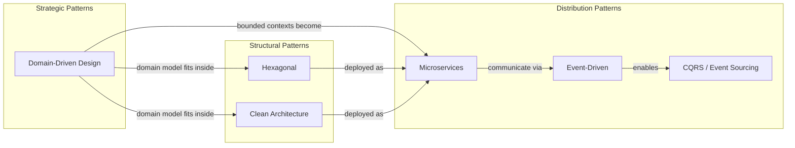

# Architecture Patterns

Choosing an architecture is the highest-leverage decision you make on a project. Get it right and your team ships features for years without drowning in complexity. Get it wrong and you spend eighteen months on a rewrite that was avoidable on day one.

The problem is that most architecture content either floats at 30,000 feet ("microservices are about bounded contexts!") or drowns in implementation details without explaining *when* or *why*. This section bridges that gap. Every pattern here includes a decision framework — the specific conditions under which it shines, the conditions under which it becomes a liability, and the migration path if you need to switch.

## The Architecture Decision Framework

Before diving into any pattern, ask these five questions about your system:

1. **Team size and structure** — How many engineers? How many teams? Are they co-located?
2. **Change velocity** — Which parts of the system change daily? Which parts are stable for months?
3. **Scale profile** — What needs to scale independently? Read-heavy? Write-heavy? Bursty?
4. **Consistency requirements** — Can you tolerate eventual consistency, or do you need strong guarantees?
5. **Operational maturity** — Do you have monitoring, CI/CD, and on-call in place?

## Decision Matrix

| Pattern | Best When | Avoid When | Team Size | Operational Overhead |
|---|---|---|---|---|
| [Microservices](/architecture-patterns/microservices) | Independent team scaling, polyglot needs, different release cadences | Small team, early-stage product, unclear domain boundaries | 20+ engineers | High |
| [Event-Driven](/architecture-patterns/event-driven) | Async workflows, audit trails, system decoupling, real-time reactions | Simple CRUD, strong consistency required everywhere | 5+ engineers | Medium-High |
| [CQRS & Event Sourcing](/architecture-patterns/cqrs-event-sourcing) | Complex domains with audit needs, different read/write scaling, temporal queries | Simple domains, small data sets, teams unfamiliar with eventual consistency | 5+ engineers | High |
| [Hexagonal Architecture](/architecture-patterns/hexagonal) | Long-lived applications, multiple integrations, high testability requirements | Prototypes, throwaway scripts, very small scope | 2+ engineers | Low |
| [Clean Architecture](/architecture-patterns/clean-architecture) | Complex business logic, framework independence, large codebases | Simple CRUD apps, tight framework coupling is acceptable | 3+ engineers | Low-Medium |
| [Domain-Driven Design](/architecture-patterns/ddd) | Complex business domains, domain expert collaboration, large systems | Well-understood simple domains, purely technical infrastructure | 5+ engineers | Medium |

## Concept Map

## How the Patterns Relate

These patterns are not mutually exclusive — they operate at different levels of abstraction. **Domain-Driven Design** is a strategic approach to understanding your problem space. **Hexagonal** and **Clean Architecture** are structural patterns for organizing code within a single deployable unit. **Microservices** is a deployment and team-scaling strategy. **Event-Driven** is a communication pattern. **CQRS and Event Sourcing** are data patterns.

The most effective architectures layer these together. A mature system might use DDD to discover bounded contexts, clean architecture inside each service, microservices for deployment, event-driven communication between them, and CQRS for the few services that genuinely need separate read and write models.

## How to Use This Section

Each pattern page includes: a first-principles explanation of the core idea, a TypeScript reference implementation, a decision checklist (should you use this?), common anti-patterns and pitfalls, and a migration guide for introducing the pattern into an existing codebase. Read the patterns that match your current needs first, then read the others to understand the trade-offs you are implicitly making.
