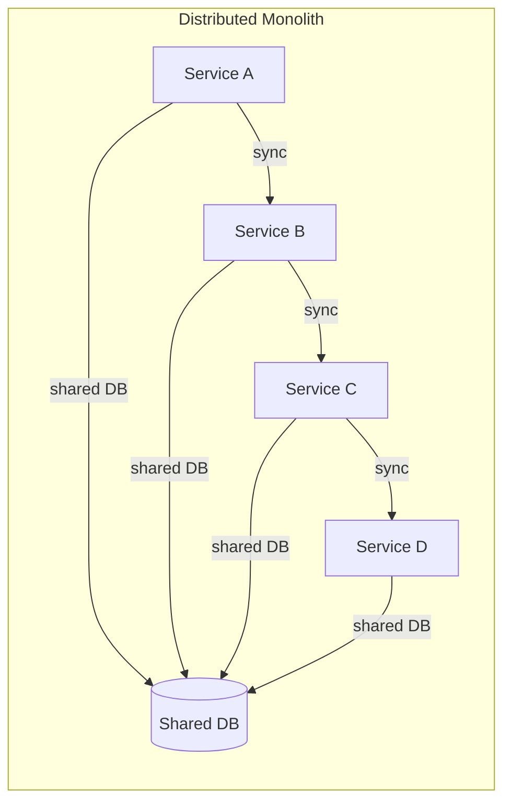
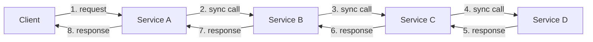
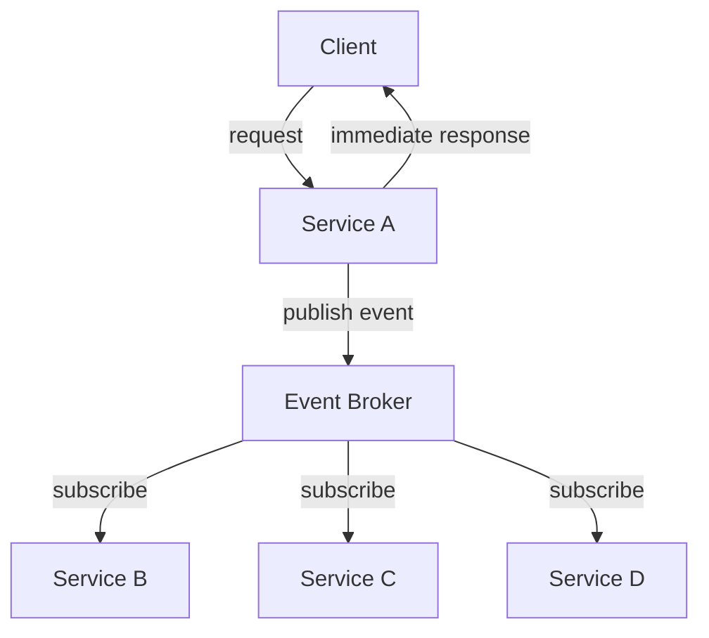
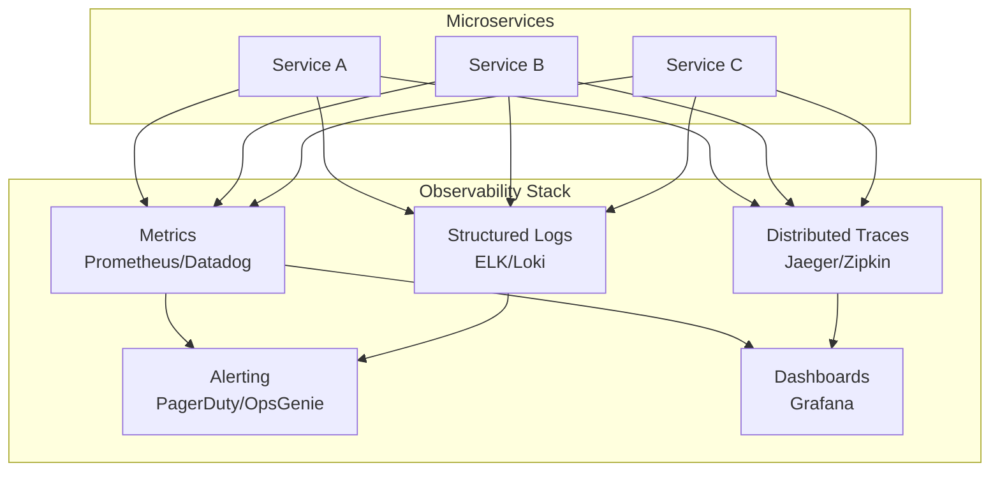
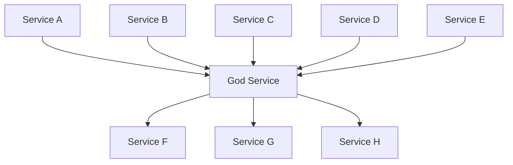

# Microservices Anti-Patterns

Anti-patterns are recurring solutions that appear sensible but create more problems than they solve. In microservices, anti-patterns are particularly insidious because the problems they create — increased latency, reduced reliability, deployment coupling — often don't manifest until the system reaches significant scale or until a production incident reveals the hidden coupling.

This page catalogs the most common microservices anti-patterns, explains why they occur, how to detect them, and how to fix them.

## Anti-Pattern 1: The Distributed Monolith

**What it is:** A system that has the deployment topology of microservices but the coupling characteristics of a monolith. Services cannot be deployed independently, changes require coordinated releases, and a failure in one service cascades to all others.

**Why it happens:** Teams adopt microservices for the technology (containers, Kubernetes) without adopting the organizational and architectural principles (bounded contexts, independent deployment, data ownership).

### Symptoms



| Symptom | Why It's a Problem |
|---|---|
| Services share a database | Schema changes require coordinated deployment |
| Services must deploy in a specific order | You have a monolith with network hops |
| A change in one service requires changes in 3+ other services | Coupling was not eliminated, just distributed |
| Services share code libraries with business logic | Shared library updates force all services to redeploy |
| Services communicate via synchronous chains | Availability drops exponentially with chain length |
| Integration tests require all services running | Testing is slower than a monolith |

### How to Detect It

```typescript
// Metric: Deployment coupling score
// If service A deploys, how often must service B deploy within 24 hours?

interface DeploymentEvent {
  service: string;
  timestamp: Date;
  version: string;
}

function calculateDeploymentCoupling(
  events: DeploymentEvent[],
  windowHours: number = 24,
): Map<string, Map<string, number>> {
  const coupling = new Map<string, Map<string, number>>();

  for (const event of events) {
    const windowStart = event.timestamp;
    const windowEnd = new Date(windowStart.getTime() + windowHours * 3600000);

    // Find other services that deployed within the window
    const correlated = events.filter(e =>
      e.service !== event.service &&
      e.timestamp >= windowStart &&
      e.timestamp <= windowEnd,
    );

    if (!coupling.has(event.service)) {
      coupling.set(event.service, new Map());
    }

    for (const corr of correlated) {
      const current = coupling.get(event.service)!.get(corr.service) || 0;
      coupling.get(event.service)!.set(corr.service, current + 1);
    }
  }

  return coupling;
  // If coupling[A][B] is high, A and B are likely a distributed monolith
}
```

### How to Fix It

1. **Database per service** — Each service gets its own database. Use events to synchronize data between services.
2. **Eliminate synchronous chains** — Replace sync calls with async events where possible.
3. **Extract shared libraries** — Move business logic out of shared libraries and into the owning service.
4. **Define API contracts** — Use consumer-driven contract testing to decouple deployment.
5. **Measure deployment independence** — Track how often services can deploy without coordinating.

## Anti-Pattern 2: Nano-Services

**What it is:** Services that are too small to justify the overhead of being a separate service. A service that wraps a single database table, exposes a single CRUD endpoint, or contains fewer than 100 lines of business logic.

**Why it happens:** Teams misunderstand "micro" to mean "as small as possible." They create one service per entity, per table, or per REST resource.

### Symptoms

```
nano-service-user-address       # Just manages addresses
nano-service-user-phone         # Just manages phone numbers
nano-service-user-preferences   # Just manages preferences
nano-service-user-avatar        # Just manages avatar images
```

These should all be part of a single User Profile service.

### The Math: Overhead per Service

Each service incurs fixed costs regardless of size:

| Overhead | Per Service |
|---|---|
| CI/CD pipeline | 30 min setup + maintenance |
| Monitoring & alerting | 5-10 dashboards/alerts |
| On-call rotation | 1 person minimum |
| Repository management | Code review, dependency updates |
| Infrastructure | Load balancer, scaling config, DNS |
| Documentation | API docs, runbooks |
| Cognitive overhead | Team must understand service purpose and interface |

For a nano-service with 50 lines of business logic, this overhead is absurd. The operational cost dwarfs the development cost.

### The Size Heuristic

A service is too small if:
- It cannot be meaningfully developed by one person for at least 2 weeks
- It has fewer than 3 distinct business operations
- It is always deployed alongside another specific service
- Every change to it requires a corresponding change in another service
- Its only callers are 1-2 other services that could absorb its logic

A service is the right size if:
- It encapsulates a coherent business capability
- A single team (2-8 people) can own it
- It can be deployed independently
- It has its own data store with meaningful business data
- It handles 5+ related business operations

### How to Fix It

Merge nano-services into cohesive services aligned to business capabilities:

```
BEFORE (nano-services):
  user-address-service
  user-phone-service
  user-preferences-service
  user-avatar-service
  user-auth-service

AFTER (right-sized service):
  user-profile-service    (addresses, phones, preferences, avatars)
  identity-service        (auth is a distinct capability)
```

## Anti-Pattern 3: Shared Database

**What it is:** Multiple services read from and write to the same database, sharing tables or even individual rows.

**Why it happens:** It is the path of least resistance. Sharing a database means you get joins, transactions, and consistency for free. The problems only appear later.

### Why It Is Dangerous

```typescript
// Service A's migration:
// ALTER TABLE products ADD COLUMN category_id INTEGER REFERENCES categories(id);

// This migration:
// 1. Locks the products table (blocking Service B's reads)
// 2. Adds a foreign key that Service B doesn't know about
// 3. Might break Service B's INSERT statements (new NOT NULL column)
// 4. Requires coordinated deployment with Service B
// 5. Makes the database schema a shared API contract — the worst kind of contract
```

### Detection: Identifying Shared Database Access

```sql
-- PostgreSQL: Find tables accessed by multiple applications
-- (assuming each service uses a different database user)

SELECT schemaname, tablename,
       array_agg(DISTINCT usename) AS accessing_users,
       count(DISTINCT usename) AS user_count
FROM pg_stat_user_tables t
JOIN pg_stat_activity a ON a.datid = (SELECT oid FROM pg_database WHERE datname = current_database())
GROUP BY schemaname, tablename
HAVING count(DISTINCT usename) > 1
ORDER BY user_count DESC;
```

### How to Fix It

**Step 1:** Identify which service is the "owner" of each table (the service that writes most frequently and has the deepest business logic).

**Step 2:** Create read APIs on the owning service so other services can access the data through a proper interface.

**Step 3:** Use events to replicate data that other services need for reads (denormalization via events).

**Step 4:** Migrate non-owning services to use the API or event-replicated data instead of direct database access.

**Step 5:** Revoke database access from non-owning services. Use different database users with restricted permissions.

## Anti-Pattern 4: Synchronous Call Chains

**What it is:** A request that must pass through multiple services sequentially, each waiting for the next one to respond before continuing.



### The Math: Availability Degradation

If each service has 99.9% availability (8.76 hours downtime/year), the chain availability is:

$$
A_{chain} = A_1 \times A_2 \times A_3 \times A_4 = 0.999^4 = 0.996 = 99.6\%
$$

That is 35 hours of downtime per year — 4x worse than any individual service. With 8 services in a chain:

$$
A_{chain} = 0.999^8 = 0.992 = 99.2\%
$$

That is 70 hours of downtime per year.

### The Math: Latency Accumulation

Each hop adds latency (network round trip + service processing + serialization):

$$
L_{total} = \sum_{i=1}^{n} (L_{network_i} + L_{processing_i} + L_{serialization_i})
$$

If each hop adds 20ms on average, a 4-hop chain adds 80ms. At p99, each hop might add 200ms, making the chain p99 = 800ms.

### How to Fix It

**Option 1: Replace sync with async**



**Option 2: Data denormalization**

Service A maintains a local copy of the data it needs from B, C, D, updated via events. It never makes synchronous calls.

**Option 3: API composition at the gateway**

The gateway calls B, C, D in parallel (fan-out) instead of sequentially.

```typescript
// BEFORE: Sequential chain (slow)
async function getOrderDetails(orderId: string): Promise<OrderDetails> {
  const order = await orderService.getOrder(orderId);           // 20ms
  const customer = await userService.getUser(order.customerId); // 20ms
  const products = [];
  for (const item of order.items) {
    products.push(await productService.getProduct(item.productId)); // 20ms each
  }
  const shipping = await shippingService.getTracking(orderId);  // 20ms
  // Total: 20 + 20 + (20 * N) + 20 = 80ms + 20ms per item
  return { order, customer, products, shipping };
}

// AFTER: Parallel fan-out (fast)
async function getOrderDetails(orderId: string): Promise<OrderDetails> {
  const order = await orderService.getOrder(orderId); // 20ms (need this first)

  // Fan out to all dependent services in parallel
  const [customer, products, shipping] = await Promise.all([
    userService.getUser(order.customerId),                      // 20ms
    productService.getProductsBatch(order.items.map(i => i.productId)), // 20ms (batch!)
    shippingService.getTracking(orderId),                       // 20ms
  ]);
  // Total: 20 + max(20, 20, 20) = 40ms — regardless of item count
  return { order, customer, products, shipping };
}
```

## Anti-Pattern 5: Chatty Services

**What it is:** Services that make many fine-grained calls to each other instead of fewer coarse-grained calls. This is the distributed equivalent of N+1 queries.

### Symptoms

```typescript
// ANTI-PATTERN: Chatty service — N+1 calls
async function getOrderSummaries(customerId: string): Promise<OrderSummary[]> {
  const orders = await orderService.getOrders(customerId); // 1 call

  const summaries = [];
  for (const order of orders) {
    // N calls — one per order!
    const customer = await userService.getUser(order.customerId);
    const products = [];
    for (const item of order.items) {
      // N*M calls — one per item per order!
      const product = await productService.getProduct(item.productId);
      products.push(product);
    }
    summaries.push({ order, customer, products });
  }

  return summaries;
  // For 10 orders with 3 items each: 1 + 10 + 30 = 41 HTTP requests!
}
```

### How to Fix It

**Solution 1: Batch APIs**

Design service APIs that accept multiple IDs:

```typescript
// GOOD: Batch API
async function getOrderSummaries(customerId: string): Promise<OrderSummary[]> {
  const orders = await orderService.getOrders(customerId);

  // Collect all unique IDs
  const productIds = [...new Set(orders.flatMap(o => o.items.map(i => i.productId)))];

  // Batch fetch — 2 calls total regardless of order count
  const [customer, products] = await Promise.all([
    userService.getUser(customerId),                    // 1 call
    productService.getProductsBatch(productIds),         // 1 call
  ]);

  const productMap = new Map(products.map(p => [p.id, p]));

  return orders.map(order => ({
    order,
    customer,
    products: order.items.map(item => productMap.get(item.productId)!),
  }));
  // Total: 3 HTTP requests — always, regardless of data size
}
```

**Solution 2: Denormalize via events**

Maintain a local cache of the data you need, updated via events. Zero cross-service calls for reads.

**Solution 3: GraphQL DataLoader pattern**

```typescript
// DataLoader batches and deduplicates requests within a single tick

import DataLoader from 'dataloader';

const productLoader = new DataLoader<string, Product>(async (productIds) => {
  // Called once with all IDs collected during this tick
  const products = await productService.getProductsBatch([...productIds]);
  const productMap = new Map(products.map(p => [p.id, p]));
  return productIds.map(id => productMap.get(id) || new Error(`Product ${id} not found`));
});

// Even if your code calls productLoader.load() 30 times,
// DataLoader batches them into a single HTTP request
```

## Anti-Pattern 6: Inadequate Monitoring

**What it is:** Deploying microservices without the observability infrastructure to understand system behavior, debug issues, or detect failures.

**Why it happens:** Teams focus on building services and defer monitoring. In a monolith, you can get by with application logs and a database dashboard. In microservices, you cannot.

### The Minimum Monitoring Stack



### What You Must Monitor

| Category | Metric | Alert Threshold |
|---|---|---|
| **RED metrics per service** | Request rate, Error rate, Duration | Error rate > 1%, p99 > 2x baseline |
| **USE metrics per host** | Utilization, Saturation, Errors (CPU, memory, disk, network) | CPU > 80%, memory > 85%, disk > 90% |
| **Business metrics** | Orders/minute, Revenue/hour, Cart abandonment | 2x standard deviation from rolling average |
| **Infrastructure** | Pod restarts, OOM kills, deployment failures | Any restart, any OOM, any deployment failure |
| **Dependencies** | Database connection pool utilization, message broker lag | Pool > 80%, lag > 1000 messages |

### Structured Logging Standard

Every log entry across all services must include:

```typescript
interface StructuredLog {
  timestamp: string;         // ISO 8601
  level: 'debug' | 'info' | 'warn' | 'error';
  service: string;           // Which service
  requestId: string;         // Unique per request
  correlationId: string;     // Spans the entire business operation
  userId?: string;           // Who triggered this
  message: string;           // Human-readable description
  error?: {
    name: string;
    message: string;
    stack: string;
  };
  duration?: number;         // Milliseconds
  metadata?: Record<string, unknown>;
}

// Example log output (JSON):
// {"timestamp":"2025-03-15T10:30:00.123Z","level":"error","service":"order-service",
//  "requestId":"req-abc123","correlationId":"corr-xyz789","userId":"user-456",
//  "message":"Payment processing failed","error":{"name":"PaymentDeclinedError",
//  "message":"Card declined","stack":"..."},"duration":1234,
//  "metadata":{"orderId":"order-789","amount":45.00,"paymentMethod":"credit_card"}}
```

Without consistent structured logging, correlating events across services is nearly impossible during an incident.

## Anti-Pattern 7: No API Versioning

**What it is:** Making breaking changes to a service's API without versioning, forcing all consumers to update simultaneously.

### How to Version APIs

```typescript
// URL-based versioning (most common)
// GET /api/v1/orders/123
// GET /api/v2/orders/123

app.get('/api/v1/orders/:id', async (req, res) => {
  const order = await orderRepo.findById(req.params.id);
  // V1 response format
  res.json({
    id: order.id,
    totalAmount: order.totalAmount, // V1: uses totalAmount
    items: order.items,
  });
});

app.get('/api/v2/orders/:id', async (req, res) => {
  const order = await orderRepo.findById(req.params.id);
  // V2 response format (breaking change: renamed field)
  res.json({
    id: order.id,
    total: order.totalAmount,       // V2: renamed to total
    lineItems: order.items,          // V2: renamed to lineItems
    currency: order.currency,        // V2: new field
  });
});

// Support both versions simultaneously
// Set a deprecation date for V1
// Notify all consumers of the deprecation
// Monitor V1 usage — only remove when traffic drops to zero
```

## Anti-Pattern 8: The God Service

**What it is:** One service that knows too much and does too much. It is called by (or calls) every other service. It is the hub in a hub-and-spoke topology.

### Symptoms



The God Service:
- Is the most frequently deployed service (because every feature touches it)
- Has the highest failure blast radius (when it goes down, everything goes down)
- Has the largest codebase (it absorbs logic that should be in other services)
- Has the most on-call incidents (because it handles the most traffic)
- Is a team bottleneck (only the God Service team can review changes)

### How to Fix It

Decompose the God Service by extracting cohesive subsets of functionality into separate services. This is essentially the same process as decomposing a monolith — the God Service IS a monolith that happens to be deployed as a microservice.

## Anti-Pattern 9: Hardcoded Service Addresses

**What it is:** Services communicate using hardcoded IP addresses or hostnames instead of using service discovery.

```typescript
// ANTI-PATTERN: Hardcoded addresses
const inventoryService = 'http://10.0.1.42:3002';
const paymentService = 'http://10.0.1.43:3003';

// CORRECT: Service discovery
const inventoryService = 'http://inventory-service:3002';  // DNS-based (Kubernetes)
const paymentService = await serviceRegistry.resolve('payment-service'); // Registry-based (Consul)
```

In Kubernetes, DNS-based service discovery is built-in. In non-Kubernetes environments, use Consul, etcd, or a similar service registry.

## Anti-Pattern Summary

| Anti-Pattern | Core Issue | Detection Signal | Fix |
|---|---|---|---|
| Distributed Monolith | Coupling not eliminated | Services deploy together | Database per service, async communication |
| Nano-Services | Services too small | More ops overhead than business logic | Merge into cohesive services |
| Shared Database | Data coupling | Multiple services access same tables | Database per service, API/event-based data access |
| Synchronous Chains | Temporal coupling | Availability drops exponentially | Async events, data denormalization |
| Chatty Services | Fine-grained coupling | N+1 cross-service calls | Batch APIs, denormalization, DataLoader |
| Inadequate Monitoring | Operational blindness | Can't trace requests across services | RED metrics, structured logs, distributed tracing |
| No API Versioning | Contract coupling | All consumers update for any API change | URL versioning, deprecation policy |
| God Service | Centralized coupling | One service is always in the critical path | Decompose into cohesive services |
| Hardcoded Addresses | Deployment coupling | Config changes for service moves | Service discovery (DNS, Consul) |

::: info War Story
A team I worked with detected their distributed monolith by accident. They measured how often each service deployed over a quarter and found that 4 of their 12 services always deployed within 2 hours of each other. When they investigated, they discovered these 4 services shared a common database schema, shared a business logic library, and had synchronous call chains between them. The team spent 3 months untangling the coupling: they split the shared database, replaced the shared library with events, and converted synchronous calls to async where possible. After the fix, each service could deploy independently, and the average number of deployments per week doubled because teams no longer had to coordinate releases. The key insight was measuring deployment coupling — it was the most objective signal that their microservices architecture was not actually microservices.
:::
