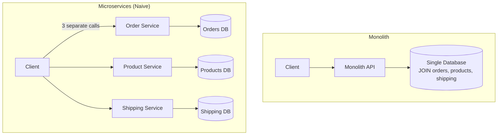
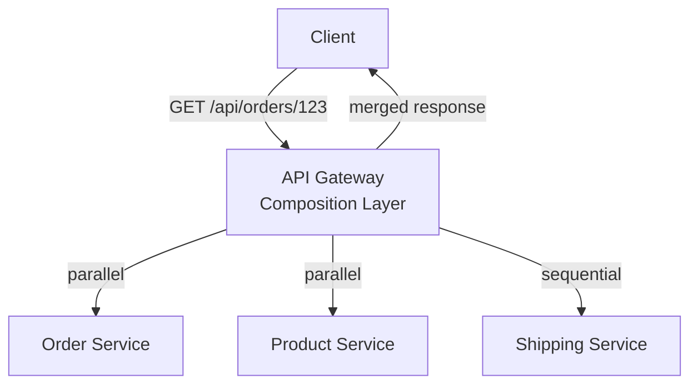
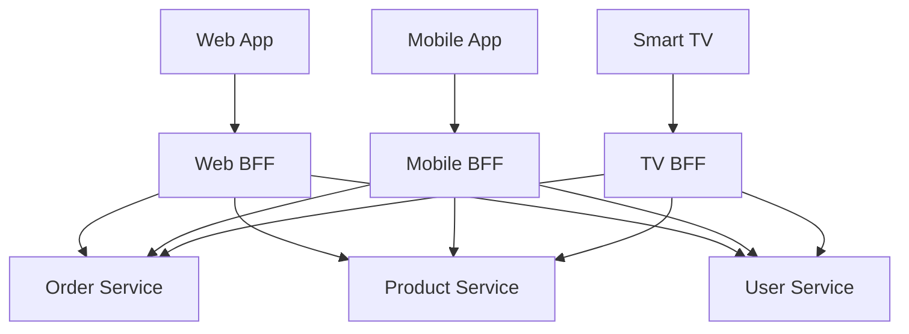
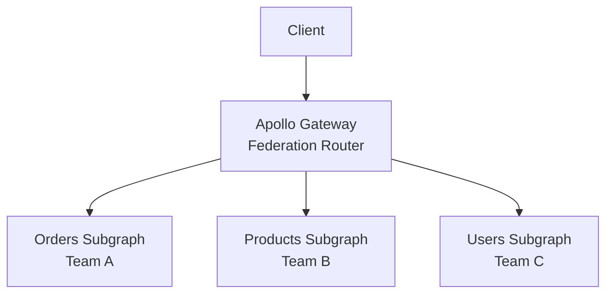

# API Composition Pattern

In a monolith, fetching a user's order history with product details and shipping status is a single SQL JOIN across three tables. In microservices, that same query requires calling the Order Service, the Product Catalog Service, and the Shipping Service — then merging the results. This is the API Composition pattern: a component that invokes multiple services and combines their responses into a single, unified result for the client.

The pattern is simple in concept and treacherous in practice. Partial failures, inconsistent data, N+1 query patterns, and latency amplification can turn a straightforward aggregation into a production nightmare.

**Related**: [API Gateway Pattern](/architecture-patterns/microservices/api-gateway-pattern) | [Communication Patterns](/architecture-patterns/microservices/communication-patterns) | [Service Mesh](/architecture-patterns/microservices/service-mesh)

---

## The Problem



Problems with the naive approach (client calls each service directly):

| Problem | Impact |
|---------|--------|
| **Multiple round trips** | Client makes 3+ HTTP calls; mobile on 3G suffers badly |
| **Client-side logic** | Every client (web, iOS, Android) must implement the same merging logic |
| **Over-fetching** | Each service returns its full response; client uses 20% of the fields |
| **Coupling** | Client knows about internal service topology |
| **Auth complexity** | Each service must validate tokens independently |

The API Composition pattern solves this by placing an intermediary that handles aggregation.

---

## Composition Approaches

### 1. API Gateway Composition

The API gateway handles aggregation as part of its routing logic.



```typescript
class OrderComposer {
  async getOrderDetails(orderId: string): Promise<ComposedOrderResponse> {
    // 1. Fetch order (must come first — we need product IDs)
    const order = await this.orderService.getOrder(orderId);

    // 2. Fetch product details and shipping status in parallel
    const [products, shipping] = await Promise.all([
      this.productService.getProducts(order.productIds),
      this.shippingService.getShipment(order.shipmentId),
    ]);

    // 3. Compose the response
    return {
      orderId: order.id,
      status: order.status,
      createdAt: order.createdAt,
      items: order.items.map(item => ({
        ...item,
        product: products.find(p => p.id === item.productId),
      })),
      shipping: {
        carrier: shipping.carrier,
        trackingNumber: shipping.trackingNumber,
        estimatedDelivery: shipping.eta,
        currentStatus: shipping.status,
      },
      total: order.total,
    };
  }
}
```

### 2. Backend for Frontend (BFF)

A dedicated backend for each client type (web, mobile, TV). Each BFF tailors the aggregated response to its client's needs.



```typescript
// Web BFF: returns full detail including review counts
class WebOrderBFF {
  async getOrderPage(orderId: string): Promise<WebOrderResponse> {
    const [order, products, reviews] = await Promise.all([
      this.orderService.getOrder(orderId),
      this.productService.getProducts(/* ids */),
      this.reviewService.getReviewCounts(/* ids */),
    ]);

    return {
      ...this.composeOrder(order, products),
      reviews: reviews, // Web shows review counts
      relatedProducts: await this.recService.getRelated(/* ids */),
    };
  }
}

// Mobile BFF: returns minimal data for bandwidth
class MobileOrderBFF {
  async getOrderSummary(orderId: string): Promise<MobileOrderResponse> {
    const order = await this.orderService.getOrder(orderId);

    return {
      orderId: order.id,
      status: order.status,
      itemCount: order.items.length,
      total: order.total,
      // No reviews, no related products — mobile doesn't show these
    };
  }
}
```

::: tip When to Use BFF vs. Shared Gateway
- **BFF**: When different clients need significantly different data shapes, response sizes, or aggregation patterns
- **Shared gateway**: When clients are similar and a single composed response works for all
- **Rule of thumb**: If your mobile response is < 50% of the fields in your web response, use a BFF
:::

### 3. GraphQL Composition

GraphQL naturally solves API composition: the client specifies exactly what it needs, and the GraphQL server resolves each field from the appropriate service.

```graphql
# Client query — ask for exactly what you need
query OrderDetails($orderId: ID!) {
  order(id: $orderId) {
    id
    status
    createdAt
    items {
      quantity
      product {
        name
        price
        imageUrl
      }
    }
    shipping {
      carrier
      trackingNumber
      estimatedDelivery
    }
  }
}
```

```typescript
// GraphQL resolvers — each field can call a different service
const resolvers = {
  Query: {
    order: async (_, { id }) => {
      return orderService.getOrder(id);
    },
  },
  Order: {
    items: async (order) => {
      return orderService.getOrderItems(order.id);
    },
    shipping: async (order) => {
      if (!order.shipmentId) return null;
      return shippingService.getShipment(order.shipmentId);
    },
  },
  OrderItem: {
    product: async (item) => {
      return productService.getProduct(item.productId);
    },
  },
};
```

#### GraphQL Federation (Apollo Federation)

For large organizations, each team owns their service's GraphQL subgraph. A gateway composes them automatically.



```graphql
# Orders subgraph — extends Product type from Products subgraph
type Order @key(fields: "id") {
  id: ID!
  items: [OrderItem!]!
}

type OrderItem {
  productId: ID!
  product: Product! # Resolved by Products subgraph
  quantity: Int!
}

extend type Product @key(fields: "id") {
  id: ID! @external
}
```

---

## Error Handling

Partial failures are the defining challenge of API composition. If the Product Service is down, should the entire order page fail?

### Strategies

| Strategy | Behavior | Use Case |
|----------|----------|----------|
| **Fail fast** | Return error if any service fails | Critical data (payment info) |
| **Partial response** | Return available data, mark failures | Non-critical enrichment |
| **Fallback** | Return cached/default data on failure | Product images, recommendations |
| **Circuit breaker** | Stop calling failed service | Protect against cascading failure |

```typescript
class ResilientComposer {
  async getOrderDetails(orderId: string): Promise<ComposedResponse> {
    const order = await this.orderService.getOrder(orderId);
    // Order is critical — if it fails, fail the whole request
    if (!order) throw new Error('Order not found');

    // Product and shipping are enrichment — use partial response
    const results = await Promise.allSettled([
      this.productService.getProducts(order.productIds),
      this.shippingService.getShipment(order.shipmentId),
    ]);

    const products = results[0].status === 'fulfilled'
      ? results[0].value
      : []; // Empty products — client shows "Product details unavailable"

    const shipping = results[1].status === 'fulfilled'
      ? results[1].value
      : null; // Null shipping — client shows "Tracking unavailable"

    return {
      order,
      products,
      shipping,
      _partial: results.some(r => r.status === 'rejected'),
      _errors: results
        .filter(r => r.status === 'rejected')
        .map(r => (r as PromiseRejectedResult).reason.message),
    };
  }
}
```

::: warning The Partial Response Contract
If you return partial responses, your API contract must declare it. Clients need to know which fields might be missing and how to render a degraded experience. Use a `_partial` flag or typed error fields — never silently omit data.
:::

---

## Performance Optimization

### The N+1 Problem

```typescript
// BAD: N+1 — fetches each product individually
async function getOrderWithProducts(orderId: string) {
  const order = await orderService.getOrder(orderId);
  const items = await Promise.all(
    order.items.map(item =>
      productService.getProduct(item.productId) // N calls!
    )
  );
  return { ...order, items };
}

// GOOD: Batch — single call with all product IDs
async function getOrderWithProducts(orderId: string) {
  const order = await orderService.getOrder(orderId);
  const productIds = order.items.map(i => i.productId);
  const products = await productService.getProducts(productIds); // 1 call
  return {
    ...order,
    items: order.items.map(item => ({
      ...item,
      product: products.find(p => p.id === item.productId),
    })),
  };
}
```

### DataLoader Pattern

For GraphQL resolvers, use DataLoader to batch and deduplicate requests within a single request lifecycle.

```typescript
import DataLoader from 'dataloader';

// Create per-request DataLoader instances
function createLoaders() {
  return {
    product: new DataLoader<string, Product>(async (ids) => {
      // Single batch call for all requested product IDs
      const products = await productService.getProducts([...ids]);
      // Return in same order as input IDs
      return ids.map(id => products.find(p => p.id === id) ?? null);
    }),
  };
}

// In resolver:
const resolvers = {
  OrderItem: {
    product: (item, _, { loaders }) => {
      return loaders.product.load(item.productId);
      // DataLoader batches all .load() calls in the same tick
    },
  },
};
```

### Parallel vs. Sequential Calls

```typescript
// SLOW: Sequential (total time = sum of all calls)
const order = await orderService.getOrder(id);       // 50ms
const products = await productService.getProducts(ids); // 80ms
const shipping = await shippingService.getShipment(sid); // 60ms
// Total: 190ms

// FAST: Parallel where possible (total time = max of parallel calls)
const order = await orderService.getOrder(id);            // 50ms
const [products, shipping] = await Promise.all([           // max(80, 60) = 80ms
  productService.getProducts(order.productIds),
  shippingService.getShipment(order.shipmentId),
]);
// Total: 130ms (32% faster)
```

### Caching Composed Responses

```typescript
class CachedComposer {
  private cache: Redis;
  private readonly CACHE_TTL = 60; // seconds

  async getOrderDetails(orderId: string): Promise<ComposedResponse> {
    const cacheKey = `composed:order:${orderId}`;
    const cached = await this.cache.get(cacheKey);
    if (cached) return JSON.parse(cached);

    const result = await this.compose(orderId);

    // Only cache if not partial (don't cache degraded responses)
    if (!result._partial) {
      await this.cache.setex(cacheKey, this.CACHE_TTL, JSON.stringify(result));
    }

    return result;
  }
}
```

---

## When to Use Which Approach

| Scenario | Recommended Approach |
|----------|---------------------|
| Simple aggregation, few services | API Gateway composition |
| Different clients need different data | BFF per client |
| Complex, nested data graphs | GraphQL with DataLoader |
| Team autonomy at scale | GraphQL Federation |
| Performance-critical, high volume | Pre-composed views (CQRS) |
| Occasional ad-hoc queries | Direct service calls with client-side merge |

::: tip CQRS as an Alternative
For read-heavy pages that aggregate many services, consider maintaining a pre-composed read model via events (CQRS pattern). Instead of querying 5 services on every request, each service publishes events, and a denormalized view is built and stored. The read is a single database query. See [CQRS Deep Dive](/architecture-patterns/cqrs-event-sourcing/cqrs-deep-dive).
:::

---

## Anti-Patterns

| Anti-Pattern | Problem | Solution |
|-------------|---------|----------|
| **Chatty composition** | 50+ downstream calls for one request | Batch endpoints, DataLoader |
| **Synchronous waterfall** | Sequential calls that could be parallel | `Promise.all` for independent calls |
| **No timeout** | One slow service blocks entire response | Per-service timeouts + circuit breaker |
| **God composer** | Single composer knows about all services | Separate composers per domain |
| **Missing partial response** | Entire page fails if reviews service is down | `Promise.allSettled` + fallbacks |
| **Cache everything** | Stale data, inconsistent views | Cache only non-critical enrichment |

---

## Summary

| Aspect | Detail |
|--------|--------|
| Pattern | Aggregate data from multiple microservices into a single response |
| Approaches | Gateway composition, BFF, GraphQL, Federation |
| Key challenge | Partial failures and latency amplification |
| Error handling | `Promise.allSettled` + fallback for non-critical data |
| Performance | Parallel calls, batch endpoints, DataLoader, caching |
| N+1 prevention | Batch APIs (`getProducts([id1, id2, ...])`) |
| Alternative | CQRS — pre-composed read models via events |

**Related**: [API Gateway Pattern](/architecture-patterns/microservices/api-gateway-pattern) | [CQRS Deep Dive](/architecture-patterns/cqrs-event-sourcing/cqrs-deep-dive) | [Communication Patterns](/architecture-patterns/microservices/communication-patterns)
