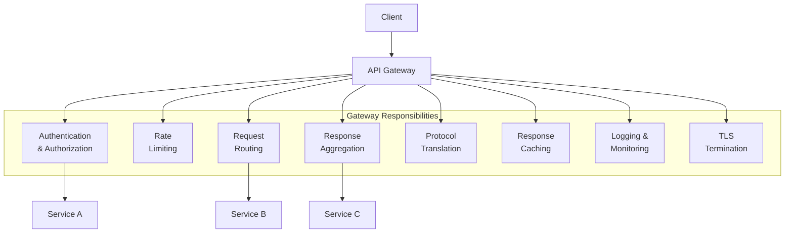
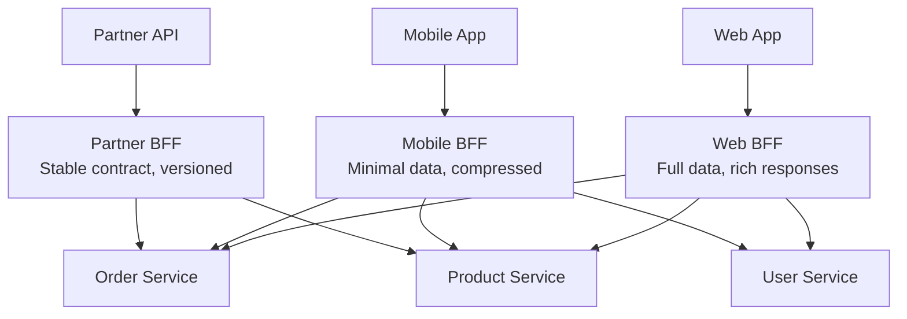
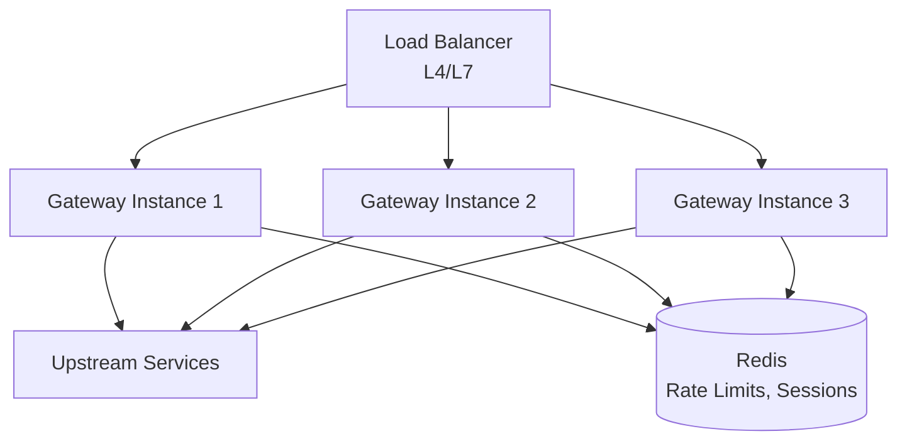

# API Gateway Pattern

An API gateway is a single entry point for all client requests to a microservices backend. It sits between clients and services, handling cross-cutting concerns — authentication, rate limiting, request routing, response aggregation, protocol translation, and observability — so that individual services do not have to.

Without a gateway, clients must know the network location of every service, handle authentication with each one, deal with different protocols, and make multiple round trips to compose a single view. The gateway eliminates this complexity for the client at the cost of introducing a new critical infrastructure component.

## Why API Gateways Exist — First Principles

In a monolith, the client makes one HTTP request to one server. The server handles authentication, authorization, routing, business logic, and response formatting. Simple.

In a microservices architecture, the client needs data from multiple services for a single page. Consider a mobile app showing an order detail page:

```
Without gateway (client calls services directly):
  Mobile App → Order Service:      GET /api/orders/123           (order details)
  Mobile App → Product Service:    GET /api/products/456         (product info)
  Mobile App → Product Service:    GET /api/products/789         (product info)
  Mobile App → User Service:       GET /api/users/321            (customer info)
  Mobile App → Shipping Service:   GET /api/shipments?order=123  (tracking)
  Mobile App → Review Service:     GET /api/reviews?product=456  (reviews)

  = 6 HTTP requests over a mobile network
  = 6 separate authentication handshakes
  = Client must know 5 different service URLs
  = Client must handle 5 different error formats
```

```
With gateway (single entry point):
  Mobile App → API Gateway:  GET /api/orders/123?include=products,customer,shipping,reviews

  = 1 HTTP request over a mobile network
  = 1 authentication handshake
  = Client knows 1 URL
  = Client handles 1 error format
  = Gateway fans out to services internally (fast, low-latency datacenter network)
```

The gateway exists because of the impedance mismatch between what clients need (aggregated, formatted, minimal data) and what microservices provide (fine-grained, service-specific APIs).

## Core Responsibilities



### 1. Authentication and Authorization

The gateway authenticates every incoming request and attaches identity information for downstream services. Individual services trust the gateway's authentication and focus on authorization (does this user have permission for THIS resource?).

```typescript
// gateway/src/middleware/authentication.ts

interface AuthenticatedRequest extends Request {
  user?: {
    id: string;
    email: string;
    roles: string[];
    tenantId: string;
    tokenExpiresAt: number;
  };
}

interface JwtPayload {
  sub: string;       // User ID
  email: string;
  roles: string[];
  tid: string;       // Tenant ID
  exp: number;       // Expiration timestamp
  iat: number;       // Issued at
  jti: string;       // JWT ID (for revocation checking)
}

class AuthenticationMiddleware {
  private readonly jwksClient: JwksClient;
  private readonly tokenBlacklist: TokenBlacklist;

  constructor(
    private readonly issuer: string,
    private readonly audience: string,
    jwksUri: string,
  ) {
    this.jwksClient = new JwksClient({ jwksUri, cache: true, cacheMaxAge: 600000 });
    this.tokenBlacklist = new RedisTokenBlacklist();
  }

  middleware() {
    return async (req: AuthenticatedRequest, res: Response, next: NextFunction) => {
      const authHeader = req.headers.authorization;

      if (!authHeader || !authHeader.startsWith('Bearer ')) {
        // Check if route requires authentication
        if (this.isPublicRoute(req.path, req.method)) {
          return next();
        }
        return res.status(401).json({
          error: 'missing_token',
          message: 'Authorization header with Bearer token is required',
        });
      }

      const token = authHeader.substring(7);

      try {
        // 1. Verify JWT signature and claims
        const decoded = await this.verifyToken(token);

        // 2. Check if token has been revoked (logout, password change, etc.)
        const isRevoked = await this.tokenBlacklist.isRevoked(decoded.jti);
        if (isRevoked) {
          return res.status(401).json({
            error: 'token_revoked',
            message: 'Token has been revoked',
          });
        }

        // 3. Attach user info to request for downstream services
        req.user = {
          id: decoded.sub,
          email: decoded.email,
          roles: decoded.roles,
          tenantId: decoded.tid,
          tokenExpiresAt: decoded.exp,
        };

        // 4. Forward user identity to downstream services via headers
        // Services trust these headers because they trust the gateway
        req.headers['x-user-id'] = decoded.sub;
        req.headers['x-user-email'] = decoded.email;
        req.headers['x-user-roles'] = decoded.roles.join(',');
        req.headers['x-tenant-id'] = decoded.tid;

        next();
      } catch (error) {
        if (error instanceof TokenExpiredError) {
          return res.status(401).json({
            error: 'token_expired',
            message: 'Token has expired',
          });
        }
        return res.status(401).json({
          error: 'invalid_token',
          message: 'Token is invalid',
        });
      }
    };
  }

  private async verifyToken(token: string): Promise<JwtPayload> {
    const decodedHeader = jwt.decode(token, { complete: true });
    if (!decodedHeader) throw new Error('Invalid token format');

    const key = await this.jwksClient.getSigningKey(decodedHeader.header.kid);
    const publicKey = key.getPublicKey();

    return jwt.verify(token, publicKey, {
      issuer: this.issuer,
      audience: this.audience,
      algorithms: ['RS256'],
    }) as JwtPayload;
  }

  private isPublicRoute(path: string, method: string): boolean {
    const publicRoutes = [
      { path: '/api/health', method: 'GET' },
      { path: '/api/auth/login', method: 'POST' },
      { path: '/api/auth/register', method: 'POST' },
      { path: '/api/products', method: 'GET' },  // Product listing is public
    ];

    return publicRoutes.some(route =>
      path.startsWith(route.path) && method === route.method
    );
  }
}
```

### 2. Rate Limiting

```typescript
// gateway/src/middleware/rateLimiter.ts

interface RateLimitConfig {
  windowMs: number;      // Time window in milliseconds
  maxRequests: number;   // Max requests per window
  keyGenerator: (req: Request) => string;  // How to identify the client
  skipFailedRequests?: boolean;
  headers?: boolean;     // Include rate limit headers in response
}

// Token bucket algorithm — allows bursts while maintaining average rate
class TokenBucketRateLimiter {
  constructor(
    private readonly store: RateLimitStore,  // Redis-backed for distributed gateway
  ) {}

  createMiddleware(config: RateLimitConfig) {
    return async (req: Request, res: Response, next: NextFunction) => {
      const key = config.keyGenerator(req);
      const now = Date.now();

      // Atomic operation in Redis (Lua script for thread safety)
      const result = await this.store.consumeToken(key, {
        capacity: config.maxRequests,
        refillRate: config.maxRequests / (config.windowMs / 1000), // tokens per second
        now,
      });

      if (config.headers) {
        res.set('X-RateLimit-Limit', config.maxRequests.toString());
        res.set('X-RateLimit-Remaining', Math.max(0, result.remaining).toString());
        res.set('X-RateLimit-Reset', result.resetAt.toString());
      }

      if (!result.allowed) {
        res.set('Retry-After', Math.ceil(result.retryAfter / 1000).toString());
        return res.status(429).json({
          error: 'rate_limit_exceeded',
          message: `Rate limit exceeded. Try again in ${Math.ceil(result.retryAfter / 1000)} seconds.`,
          limit: config.maxRequests,
          window: `${config.windowMs / 1000}s`,
          retryAfter: result.retryAfter,
        });
      }

      next();
    };
  }
}

// Different rate limits for different tiers
const rateLimiter = new TokenBucketRateLimiter(redisStore);

// Global rate limit — prevent abuse
const globalLimit = rateLimiter.createMiddleware({
  windowMs: 60000,        // 1 minute
  maxRequests: 1000,      // 1000 requests per minute
  keyGenerator: (req) => req.ip,
  headers: true,
});

// Per-user rate limit — fair usage
const userLimit = rateLimiter.createMiddleware({
  windowMs: 60000,
  maxRequests: 100,
  keyGenerator: (req) => (req as AuthenticatedRequest).user?.id ?? req.ip,
  headers: true,
});

// Expensive operations — tighter limit
const expensiveLimit = rateLimiter.createMiddleware({
  windowMs: 3600000,      // 1 hour
  maxRequests: 10,
  keyGenerator: (req) => `expensive:${(req as AuthenticatedRequest).user?.id}`,
  headers: true,
});

// Tiered rate limiting based on subscription plan
function tieredRateLimit(req: AuthenticatedRequest, res: Response, next: NextFunction) {
  const user = req.user;
  const tier = user?.roles.includes('premium') ? 'premium'
    : user?.roles.includes('enterprise') ? 'enterprise'
    : 'free';

  const limits: Record<string, RateLimitConfig> = {
    free:       { windowMs: 60000, maxRequests: 60,   keyGenerator: (r) => r.user?.id ?? r.ip, headers: true },
    premium:    { windowMs: 60000, maxRequests: 600,  keyGenerator: (r) => r.user?.id ?? r.ip, headers: true },
    enterprise: { windowMs: 60000, maxRequests: 6000, keyGenerator: (r) => r.user?.id ?? r.ip, headers: true },
  };

  return rateLimiter.createMiddleware(limits[tier])(req, res, next);
}
```

### 3. Request Aggregation

```typescript
// gateway/src/aggregation/OrderDetailAggregator.ts

interface OrderDetailResponse {
  order: {
    id: string;
    status: string;
    placedAt: string;
    totalAmount: number;
  };
  customer: {
    id: string;
    name: string;
    email: string;
  };
  items: Array<{
    quantity: number;
    unitPrice: number;
    product: {
      id: string;
      name: string;
      imageUrl: string;
    };
  }>;
  shipping?: {
    trackingNumber: string;
    carrier: string;
    estimatedDelivery: string;
    status: string;
  };
}

class OrderDetailAggregator {
  constructor(
    private readonly orderClient: OrderServiceClient,
    private readonly userClient: UserServiceClient,
    private readonly productClient: ProductServiceClient,
    private readonly shippingClient: ShippingServiceClient,
  ) {}

  async aggregate(orderId: string, userId: string): Promise<OrderDetailResponse> {
    // Step 1: Fetch the order (we need this first to know what else to fetch)
    const order = await this.orderClient.getOrder(orderId);

    // Authorization check — does this user own this order?
    if (order.customerId !== userId) {
      throw new ForbiddenError('You do not have access to this order');
    }

    // Step 2: Fan out to all dependent services IN PARALLEL
    // This is the key performance optimization — parallel fetches over
    // the internal datacenter network instead of sequential fetches
    // over the client's mobile network.
    const [customer, products, shipping] = await Promise.allSettled([
      this.userClient.getUser(order.customerId),
      this.productClient.getProductsBatch(order.items.map(i => i.productId)),
      order.status === 'shipped' || order.status === 'delivered'
        ? this.shippingClient.getShipmentByOrderId(orderId)
        : Promise.resolve(null),
    ]);

    // Step 3: Assemble response, handling partial failures gracefully
    const customerData = customer.status === 'fulfilled' ? customer.value : null;
    const productData = products.status === 'fulfilled' ? products.value : [];
    const shippingData = shipping.status === 'fulfilled' ? shipping.value : null;

    const productMap = new Map(productData.map(p => [p.id, p]));

    return {
      order: {
        id: order.id,
        status: order.status,
        placedAt: order.placedAt,
        totalAmount: order.totalAmount,
      },
      customer: customerData
        ? { id: customerData.id, name: customerData.name, email: customerData.email }
        : { id: order.customerId, name: 'Unknown', email: '' }, // Graceful degradation
      items: order.items.map(item => ({
        quantity: item.quantity,
        unitPrice: item.unitPrice,
        product: productMap.has(item.productId)
          ? {
              id: item.productId,
              name: productMap.get(item.productId)!.name,
              imageUrl: productMap.get(item.productId)!.imageUrl,
            }
          : {
              id: item.productId,
              name: item.productNameSnapshot, // Fallback to denormalized data
              imageUrl: '',
            },
      })),
      shipping: shippingData
        ? {
            trackingNumber: shippingData.trackingNumber,
            carrier: shippingData.carrier,
            estimatedDelivery: shippingData.estimatedDelivery,
            status: shippingData.status,
          }
        : undefined,
    };
  }
}
```

## Backend for Frontend (BFF) Pattern

The BFF pattern creates a separate gateway for each client type. A mobile app needs different data shapes, field sets, and response sizes than a web app or a third-party API consumer.



```typescript
// mobile-bff/src/routes/orders.ts
// Mobile BFF — optimized for mobile constraints

router.get('/orders/:id', async (req, res) => {
  const order = await orderClient.getOrder(req.params.id);

  // Mobile-specific optimizations:
  // 1. Return only fields the mobile UI needs
  // 2. Use smaller image URLs (thumbnails)
  // 3. Flatten nested structures to reduce parsing overhead
  // 4. Include all data for offline caching

  const response = {
    id: order.id,
    status: order.status,
    total: order.totalAmount,
    itemCount: order.items.length,
    date: order.placedAt,
    // Mobile only needs the first 3 items for the summary view
    items: order.items.slice(0, 3).map(item => ({
      name: item.productName,
      qty: item.quantity,
      price: item.unitPrice,
      thumb: item.productImageUrl?.replace('/large/', '/thumb/'), // Smaller images
    })),
    hasMoreItems: order.items.length > 3,
    // Include tracking info inline (mobile can't easily make additional requests)
    tracking: order.tracking ? {
      carrier: order.tracking.carrier,
      number: order.tracking.trackingNumber,
      eta: order.tracking.estimatedDelivery,
    } : null,
  };

  // Cache headers for offline support
  res.set('Cache-Control', 'private, max-age=60'); // 1 minute for order status
  res.json(response);
});

// web-bff/src/routes/orders.ts
// Web BFF — optimized for rich web UI

router.get('/orders/:id', async (req, res) => {
  const aggregator = new OrderDetailAggregator(/* ... */);
  const response = await aggregator.aggregate(req.params.id, req.user.id);

  // Web gets the full aggregated response with all details
  // including reviews, related products, return eligibility, etc.
  res.json(response);
});
```

### When to Use BFF

| Condition | BFF Appropriate? |
|---|---|
| One client type (web only) | No — single gateway is sufficient |
| Web + mobile with same data needs | No — single gateway with content negotiation |
| Web + mobile with different data shapes | Yes — separate BFFs |
| Web + mobile + partner APIs | Yes — three BFFs |
| Each BFF team owns their client + BFF | Ideal setup |
| One backend team owns all BFFs | Risk of BFFs becoming monolithic |

## API Gateway Comparison: Kong vs Envoy vs Custom

### Kong

Kong is a Lua/Nginx-based API gateway with a plugin architecture.

**Architecture:**
```
Client → Kong (Nginx + Lua plugins) → Upstream Services
                    ↕
              PostgreSQL/Cassandra (config store)
```

**Strengths:**
- Rich plugin ecosystem (200+ plugins)
- Admin API for programmatic configuration
- Enterprise features (developer portal, analytics)
- Easy to get started

**Weaknesses:**
- Lua plugin development is niche
- Nginx-based architecture limits advanced routing
- PostgreSQL dependency adds operational overhead
- Plugin ordering can be confusing

### Envoy

Envoy is a C++ proxy designed for service mesh and API gateway use cases.

**Architecture:**
```
Client → Envoy (L4/L7 proxy) → Upstream Services
                ↕
        Control Plane (xDS API)
```

**Strengths:**
- Extremely high performance (C++, non-blocking)
- Native support for gRPC, HTTP/2, WebSocket
- Dynamic configuration via xDS API
- Built-in observability (stats, tracing, logging)
- Foundation for Istio service mesh

**Weaknesses:**
- Steep learning curve (complex configuration)
- Custom filter development requires C++ or WASM
- No built-in admin UI
- Designed for infrastructure engineers, not application developers

### Custom (Node.js/Go)

Building your own gateway when off-the-shelf options don't fit.

**When custom makes sense:**
- Complex request aggregation logic specific to your domain
- Need tight integration with your authentication system
- BFF pattern where the gateway IS the application layer
- Team has strong Node.js/Go skills and ops maturity

**When custom is a mistake:**
- You need standard gateway features (rate limiting, auth, caching)
- You don't have dedicated gateway team
- You underestimate the operational burden

### Comparison Matrix

| Feature | Kong | Envoy | Custom (Node.js) |
|---|---|---|---|
| **Performance** | High | Very High | Medium |
| **Configuration** | Admin API + DB | xDS/YAML | Code |
| **Plugin ecosystem** | Extensive | Moderate (WASM) | npm |
| **Learning curve** | Medium | High | Low (if you know Node) |
| **gRPC support** | Plugin | Native | Library |
| **WebSocket** | Yes | Yes | Yes |
| **Service mesh** | Kong Mesh | Istio/Linkerd | No |
| **Best for** | Standard API gateway | High-perf, service mesh | BFF, custom aggregation |

## Complete TypeScript API Gateway Implementation

```typescript
// gateway/src/index.ts

import express from 'express';
import helmet from 'helmet';
import cors from 'cors';
import { createProxyMiddleware, Options } from 'http-proxy-middleware';

// --- Configuration ---

interface ServiceRoute {
  path: string;
  target: string;
  methods?: string[];
  rateLimit?: { windowMs: number; max: number };
  auth: boolean;
  timeout: number;
  rewrite?: (path: string) => string;
}

const services: ServiceRoute[] = [
  {
    path: '/api/orders',
    target: process.env.ORDER_SERVICE_URL || 'http://order-service:3001',
    auth: true,
    timeout: 5000,
  },
  {
    path: '/api/products',
    target: process.env.PRODUCT_SERVICE_URL || 'http://product-service:3002',
    auth: false, // Product catalog is public
    timeout: 3000,
    rateLimit: { windowMs: 60000, max: 200 },
  },
  {
    path: '/api/users',
    target: process.env.USER_SERVICE_URL || 'http://user-service:3003',
    auth: true,
    timeout: 3000,
  },
  {
    path: '/api/inventory',
    target: process.env.INVENTORY_SERVICE_URL || 'http://inventory-service:3004',
    auth: true,
    timeout: 3000,
    methods: ['GET'], // Read-only from gateway
  },
];

// --- App Setup ---

const app = express();
app.use(helmet());
app.use(cors({ origin: process.env.ALLOWED_ORIGINS?.split(',') || '*' }));
app.use(express.json({ limit: '1mb' }));

// --- Request ID ---
app.use((req, res, next) => {
  const requestId = req.headers['x-request-id'] as string || generateUUID();
  req.headers['x-request-id'] = requestId;
  res.set('X-Request-Id', requestId);
  next();
});

// --- Request Logging ---
app.use((req, res, next) => {
  const start = Date.now();
  res.on('finish', () => {
    const duration = Date.now() - start;
    console.log(JSON.stringify({
      timestamp: new Date().toISOString(),
      method: req.method,
      path: req.path,
      statusCode: res.statusCode,
      duration,
      requestId: req.headers['x-request-id'],
      userId: req.headers['x-user-id'] || 'anonymous',
      userAgent: req.headers['user-agent'],
      ip: req.ip,
    }));
  });
  next();
});

// --- Health Check ---
app.get('/health', (req, res) => {
  res.json({ status: 'healthy', timestamp: new Date().toISOString() });
});

// --- Authentication Middleware ---
const authMiddleware = new AuthenticationMiddleware(
  process.env.JWT_ISSUER || 'https://auth.example.com',
  process.env.JWT_AUDIENCE || 'api.example.com',
  process.env.JWKS_URI || 'https://auth.example.com/.well-known/jwks.json',
).middleware();

// --- Rate Limiter Setup ---
const defaultRateLimiter = rateLimiter.createMiddleware({
  windowMs: 60000,
  maxRequests: 100,
  keyGenerator: (req) => (req as AuthenticatedRequest).user?.id ?? req.ip,
  headers: true,
});

// --- Service Routes ---
for (const service of services) {
  const middlewares: express.RequestHandler[] = [];

  // Authentication
  if (service.auth) {
    middlewares.push(authMiddleware);
  }

  // Rate limiting
  if (service.rateLimit) {
    middlewares.push(rateLimiter.createMiddleware({
      windowMs: service.rateLimit.windowMs,
      maxRequests: service.rateLimit.max,
      keyGenerator: (req) => (req as AuthenticatedRequest).user?.id ?? req.ip,
      headers: true,
    }));
  } else {
    middlewares.push(defaultRateLimiter);
  }

  // Method filtering
  if (service.methods) {
    middlewares.push((req, res, next) => {
      if (!service.methods!.includes(req.method)) {
        return res.status(405).json({ error: 'method_not_allowed' });
      }
      next();
    });
  }

  // Proxy to upstream service
  const proxyOptions: Options = {
    target: service.target,
    changeOrigin: true,
    timeout: service.timeout,
    proxyTimeout: service.timeout,
    pathRewrite: service.rewrite
      ? { [service.path]: '' }
      : undefined,
    on: {
      error: (err, req, res) => {
        console.error(`Proxy error for ${service.path}:`, err.message);
        (res as express.Response).status(502).json({
          error: 'service_unavailable',
          message: 'The upstream service is temporarily unavailable',
          service: service.path,
        });
      },
      proxyReq: (proxyReq, req) => {
        // Forward correlation headers
        proxyReq.setHeader('X-Request-Id', req.headers['x-request-id'] || '');
        proxyReq.setHeader('X-Forwarded-For', req.ip || '');
        proxyReq.setHeader('X-Gateway-Timestamp', Date.now().toString());
      },
    },
  };

  app.use(service.path, ...middlewares, createProxyMiddleware(proxyOptions));
}

// --- Aggregation Endpoints ---
// These are gateway-specific endpoints that aggregate data from multiple services

app.get('/api/dashboard', authMiddleware, async (req, res) => {
  const userId = (req as AuthenticatedRequest).user!.id;

  try {
    const [orders, notifications, recommendations] = await Promise.allSettled([
      fetch(`${services[0].target}/api/orders?userId=${userId}&limit=5`).then(r => r.json()),
      fetch(`http://notification-service:3005/api/notifications?userId=${userId}&unread=true`).then(r => r.json()),
      fetch(`http://recommendation-service:3006/api/recommendations?userId=${userId}&limit=10`).then(r => r.json()),
    ]);

    res.json({
      recentOrders: orders.status === 'fulfilled' ? orders.value : [],
      notifications: notifications.status === 'fulfilled' ? notifications.value : [],
      recommendations: recommendations.status === 'fulfilled' ? recommendations.value : [],
      // Include metadata about which services responded
      _meta: {
        ordersAvailable: orders.status === 'fulfilled',
        notificationsAvailable: notifications.status === 'fulfilled',
        recommendationsAvailable: recommendations.status === 'fulfilled',
      },
    });
  } catch (error) {
    res.status(500).json({ error: 'aggregation_failed' });
  }
});

// --- 404 Handler ---
app.use((req, res) => {
  res.status(404).json({
    error: 'not_found',
    message: `No route matches ${req.method} ${req.path}`,
  });
});

// --- Error Handler ---
app.use((err: Error, req: express.Request, res: express.Response, next: express.NextFunction) => {
  console.error('Unhandled error:', err);
  res.status(500).json({
    error: 'internal_error',
    message: 'An unexpected error occurred',
    requestId: req.headers['x-request-id'],
  });
});

// --- Start Server ---
const port = parseInt(process.env.PORT || '8080', 10);
app.listen(port, () => {
  console.log(`API Gateway listening on port ${port}`);
  console.log(`Routes configured for ${services.length} services`);
});

function generateUUID(): string {
  return 'xxxxxxxx-xxxx-4xxx-yxxx-xxxxxxxxxxxx'.replace(/[xy]/g, (c) => {
    const r = (Math.random() * 16) | 0;
    const v = c === 'x' ? r : (r & 0x3) | 0x8;
    return v.toString(16);
  });
}
```

## Edge Cases and Production Concerns

### Request Size Limits

Large file uploads should bypass the gateway and go directly to the file storage service (S3 pre-signed URLs, for example). The gateway should enforce reasonable request size limits.

### Timeouts

The gateway's timeout must be longer than the upstream service's timeout, or the gateway will retry a request that the upstream is still processing:

```
Gateway timeout:     5000ms
Upstream timeout:    3000ms
Network overhead:    ~100ms

Gateway should timeout at: upstream timeout + network overhead + buffer
                         = 3000 + 100 + 500 = 3600ms

Rule: gateway_timeout ≥ upstream_timeout + network_overhead + buffer
```

### Gateway as Single Point of Failure

The gateway itself must be highly available:

- Run multiple gateway instances behind a load balancer
- Health checks on each gateway instance
- No in-memory state (stateless gateway → horizontal scaling)
- Configuration stored externally (database, config server)
- Circuit breakers on all upstream service calls



### Header Propagation

The gateway must propagate specific headers for distributed tracing and context:

| Header | Purpose |
|---|---|
| `X-Request-Id` | Unique request identifier for tracing |
| `X-Correlation-Id` | Business operation identifier (spans multiple requests) |
| `X-User-Id` | Authenticated user identity |
| `X-Tenant-Id` | Multi-tenant isolation |
| `X-Forwarded-For` | Original client IP |
| `X-Forwarded-Proto` | Original protocol (http/https) |
| `traceparent` | W3C Trace Context standard |

::: info War Story
A SaaS company had a single API gateway serving both their web app and their public API. The web app developers kept adding aggregation endpoints and BFF-style logic to the shared gateway. Over time, the gateway accumulated hundreds of lines of business logic, multiple database connections, and complex caching strategies. Deploys became risky because a bug in a web-specific aggregation endpoint could take down the public API. They split into three gateways: a thin public API gateway (rate limiting, auth, proxy only), a web BFF (aggregation, caching, web-specific formatting), and a mobile BFF. Public API stability immediately improved because it was no longer affected by web-specific changes. The lesson: gateways should be thin infrastructure layers unless they are explicitly designed as BFFs, in which case they should be per-client-type.
:::

## Anti-Patterns

### Gateway as Business Logic Layer

The gateway should NOT contain business rules, domain validation, or data transformation beyond simple aggregation. If your gateway has `if (order.total > 1000) { applyDiscount() }`, that logic belongs in a service.

### Gateway as Integration Layer

The gateway should NOT be the place where you integrate with third-party APIs. Create dedicated integration services. The gateway's job is routing and cross-cutting concerns, not business integration.

### Fat Gateway

Adding every possible feature to the gateway (caching, transformation, rate limiting, authentication, authorization, aggregation, monitoring, logging, A/B testing) creates a monolithic gateway that is hard to deploy and a single point of failure. Use a service mesh for per-service concerns and keep the gateway focused on client-facing concerns.

### Gateway Without Circuit Breakers

If any upstream service goes down and the gateway has no circuit breaker, the gateway's connection pool fills up with hanging connections, and ALL routes become slow or unresponsive. Always use circuit breakers on upstream connections.
