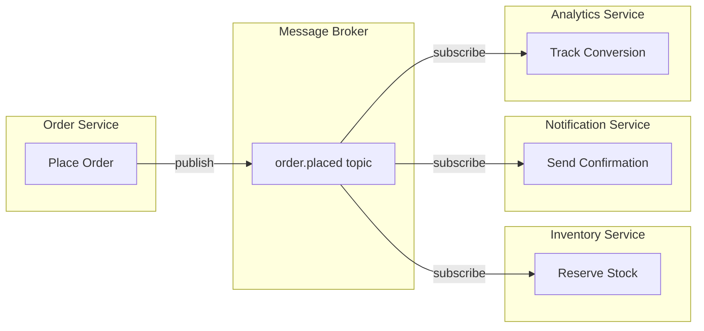
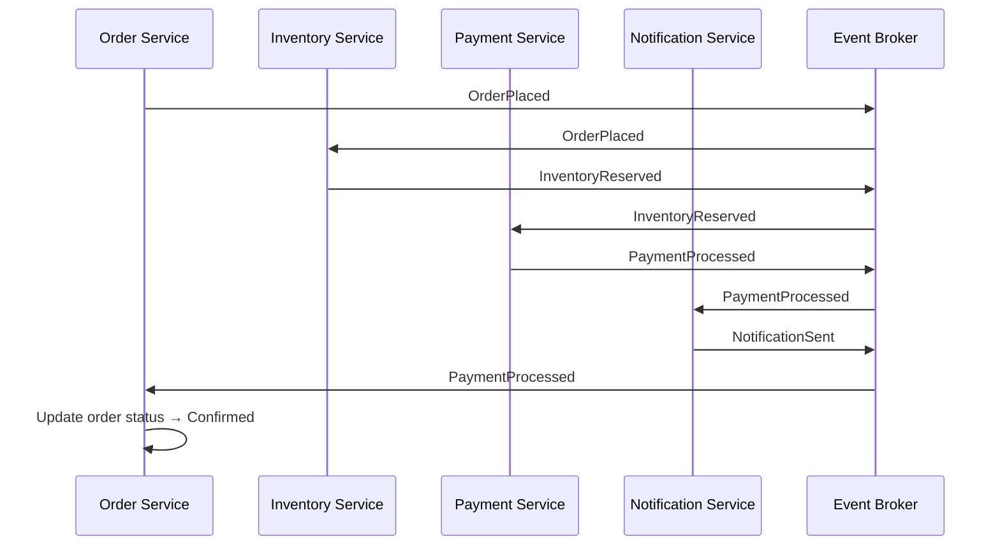
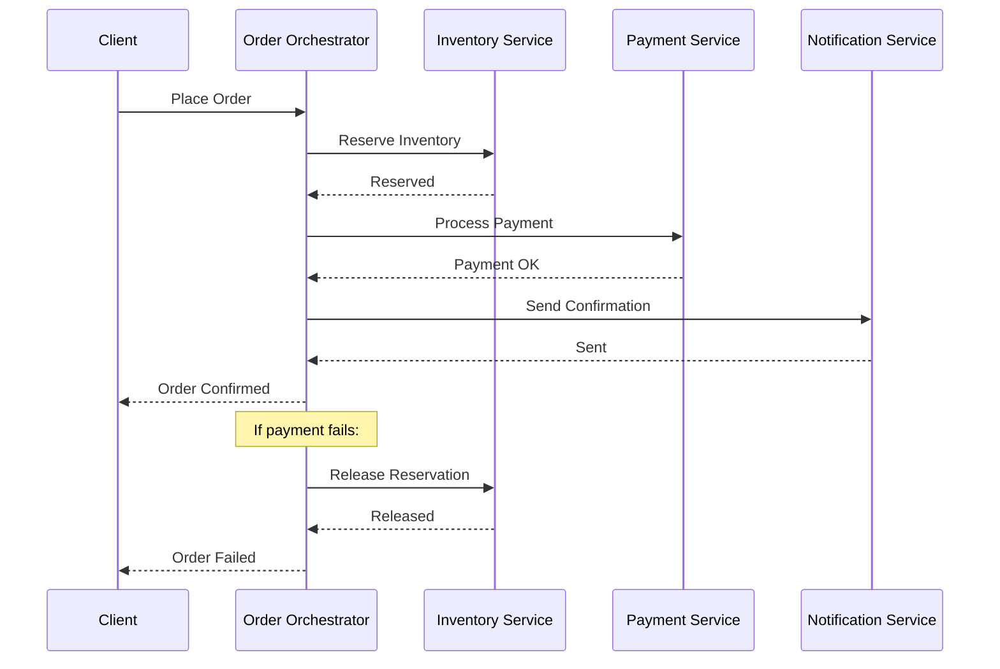
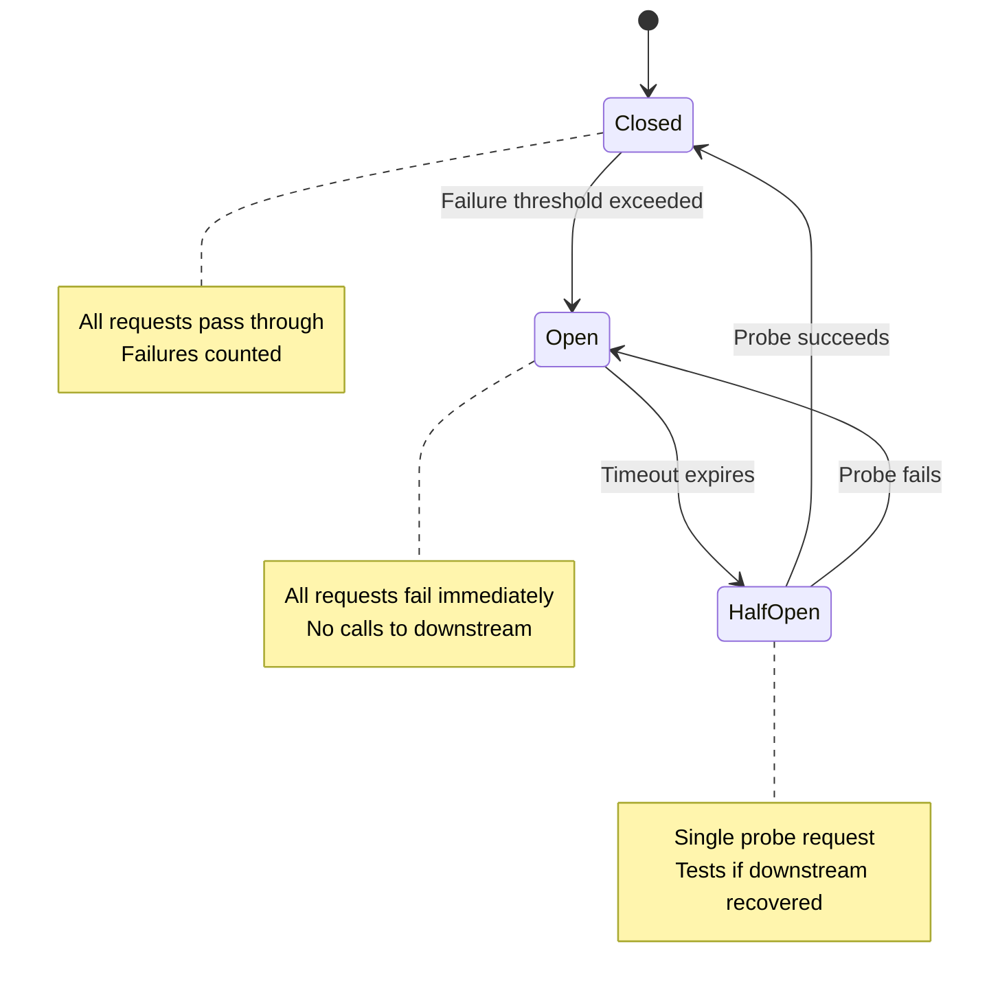
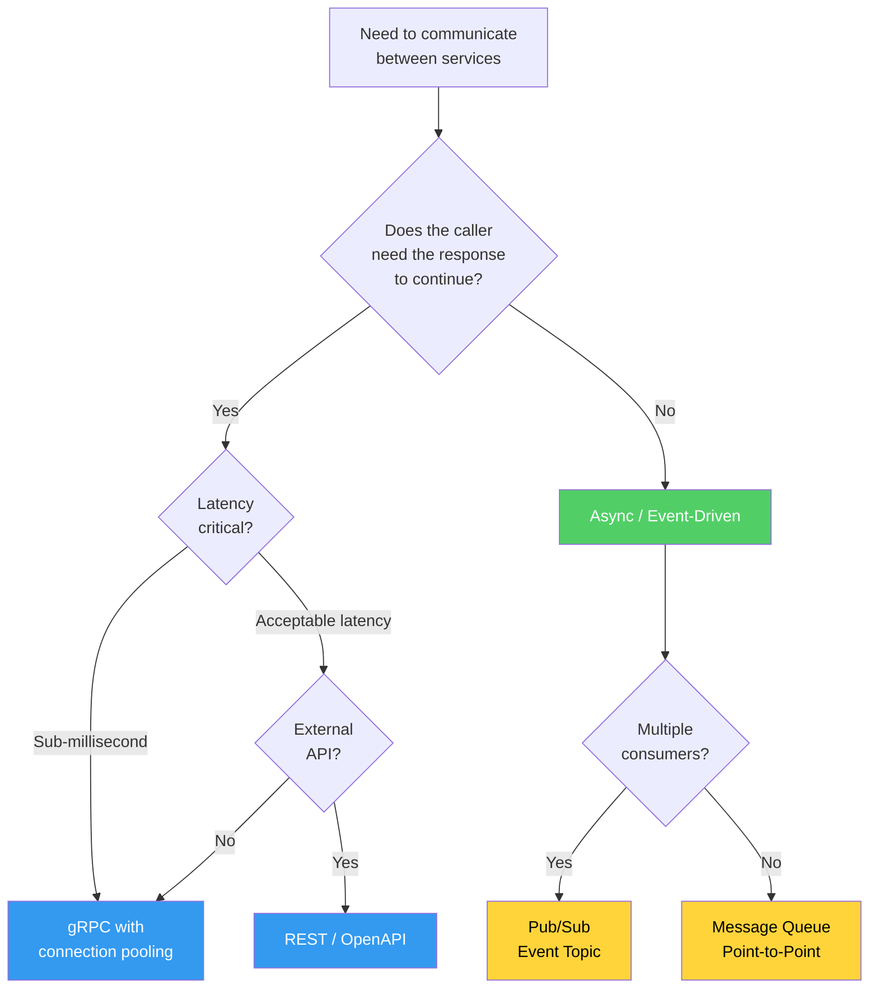

# Microservice Communication Patterns

Communication between microservices is where distributed systems theory meets engineering reality. Every call between services introduces latency, a failure point, and a coupling decision. The choice between synchronous and asynchronous communication, between REST and gRPC and events, determines your system's resilience profile, latency characteristics, and operational complexity.

The fundamental insight is this: the best microservice communication is no communication at all. Every cross-service call you can eliminate through better service boundaries, data denormalization, or event-driven state transfer makes your system simpler and more resilient. When communication is unavoidable, the choice of pattern determines whether a single service failure cascades through your entire system or is gracefully contained.

## First Principles: Why Communication Is the Hard Part

In a monolith, a function call is:
- **Instant** — nanoseconds, in-process
- **Reliable** — if the caller is running, the callee is running
- **Consistent** — shared memory, shared transactions
- **Free** — no serialization, no network, no retries

In microservices, a service call is:
- **Slow** — milliseconds at minimum, network round-trip
- **Unreliable** — the callee might be down, slow, or partitioned
- **Eventually consistent** — no shared transactions
- **Expensive** — serialization, deserialization, network I/O, retries, timeouts

The core tension in microservice communication:

$$
\text{Coupling} = \frac{\text{Shared Knowledge}}{\text{Service Independence}}
$$

Synchronous communication maximizes shared knowledge (the caller must know the callee's API, location, and availability). Asynchronous communication minimizes it (the publisher only knows the event schema, not who consumes it).

## Synchronous Communication Patterns

### REST (HTTP/JSON)

The default choice. REST uses HTTP verbs, JSON payloads, and URL-based routing. It is simple, well-understood, and supported by every language and framework.

```typescript
// order-service/src/infrastructure/clients/InventoryClient.ts

interface InventoryCheckResult {
  productId: string;
  available: boolean;
  currentStock: number;
  reservationId?: string;
}

class InventoryRestClient {
  constructor(
    private readonly baseUrl: string,
    private readonly httpClient: HttpClient,
    private readonly timeout: number = 3000,
  ) {}

  async checkAvailability(productId: string, quantity: number): Promise<InventoryCheckResult> {
    const response = await this.httpClient.get(
      `${this.baseUrl}/api/v1/inventory/${productId}/availability`,
      {
        params: { quantity: quantity.toString() },
        timeout: this.timeout,
        headers: {
          'Accept': 'application/json',
          'X-Request-Id': generateRequestId(),  // For distributed tracing
          'X-Caller-Service': 'order-service',  // Identify the caller
        },
      },
    );

    if (response.status === 200) {
      return response.data as InventoryCheckResult;
    }

    if (response.status === 404) {
      throw new ProductNotFoundError(productId);
    }

    throw new InventoryServiceError(`Unexpected status: ${response.status}`);
  }

  async reserveStock(productId: string, quantity: number, orderId: string): Promise<string> {
    const response = await this.httpClient.post(
      `${this.baseUrl}/api/v1/inventory/reservations`,
      {
        productId,
        quantity,
        orderId,
        expiresIn: 900, // 15-minute hold
      },
      {
        timeout: this.timeout,
        headers: {
          'Content-Type': 'application/json',
          'Idempotency-Key': `reserve-${orderId}-${productId}`, // Critical for retries
        },
      },
    );

    return response.data.reservationId;
  }
}
```

**REST strengths:**
- Universal support, every developer knows it
- Human-readable payloads (JSON)
- Rich ecosystem of tooling (Swagger/OpenAPI, Postman)
- Cacheable (HTTP caching headers)
- Firewall-friendly (port 80/443)

**REST weaknesses:**
- Verbose payloads (JSON is text-heavy)
- No built-in schema evolution (you must version your API)
- Request-response only (no streaming without SSE/WebSocket)
- No code generation (manual client/server implementation)
- Overhead of HTTP/1.1 (new connection per request without keep-alive)

### gRPC (HTTP/2 + Protocol Buffers)

gRPC uses HTTP/2 for transport, Protocol Buffers for serialization, and provides code generation for client and server stubs. It is significantly more efficient than REST for service-to-service communication.

```protobuf
// inventory.proto
syntax = "proto3";

package inventory;

service InventoryService {
  // Unary RPC — single request, single response
  rpc CheckAvailability(AvailabilityRequest) returns (AvailabilityResponse);

  // Unary RPC with idempotency
  rpc ReserveStock(ReservationRequest) returns (ReservationResponse);

  // Server streaming — real-time inventory updates
  rpc WatchInventory(WatchRequest) returns (stream InventoryUpdate);

  // Bidirectional streaming — batch availability checks
  rpc BatchCheckAvailability(stream AvailabilityRequest) returns (stream AvailabilityResponse);
}

message AvailabilityRequest {
  string product_id = 1;
  int32 quantity = 2;
}

message AvailabilityResponse {
  string product_id = 1;
  bool available = 2;
  int32 current_stock = 3;
  optional string reservation_id = 4;
}

message ReservationRequest {
  string product_id = 1;
  int32 quantity = 2;
  string order_id = 3;
  int32 expires_in_seconds = 4;
  string idempotency_key = 5;
}

message ReservationResponse {
  string reservation_id = 1;
  google.protobuf.Timestamp expires_at = 2;
}
```

```typescript
// order-service/src/infrastructure/clients/InventoryGrpcClient.ts
import * as grpc from '@grpc/grpc-js';
import { InventoryServiceClient } from '../generated/inventory_grpc_pb';
import { AvailabilityRequest, ReservationRequest } from '../generated/inventory_pb';

class InventoryGrpcClient {
  private readonly client: InventoryServiceClient;

  constructor(address: string) {
    this.client = new InventoryServiceClient(
      address,
      grpc.credentials.createSsl(), // mTLS in production
      {
        'grpc.keepalive_time_ms': 10000,
        'grpc.keepalive_timeout_ms': 5000,
        'grpc.max_receive_message_length': 4 * 1024 * 1024, // 4MB
      },
    );
  }

  async checkAvailability(productId: string, quantity: number): Promise<AvailabilityResponse> {
    const request = new AvailabilityRequest();
    request.setProductId(productId);
    request.setQuantity(quantity);

    return new Promise((resolve, reject) => {
      const metadata = new grpc.Metadata();
      metadata.set('x-request-id', generateRequestId());

      const deadline = new Date(Date.now() + 3000); // 3-second timeout

      this.client.checkAvailability(request, metadata, { deadline }, (error, response) => {
        if (error) {
          if (error.code === grpc.status.UNAVAILABLE) {
            reject(new ServiceUnavailableError('Inventory service unavailable'));
          } else if (error.code === grpc.status.DEADLINE_EXCEEDED) {
            reject(new TimeoutError('Inventory check timed out'));
          } else {
            reject(new InventoryServiceError(error.message));
          }
          return;
        }
        resolve(response!);
      });
    });
  }

  // Server streaming example — watch inventory changes in real time
  watchInventory(productIds: string[]): AsyncIterable<InventoryUpdate> {
    const request = new WatchRequest();
    request.setProductIdsList(productIds);

    const stream = this.client.watchInventory(request);

    return {
      [Symbol.asyncIterator]() {
        return {
          next(): Promise<IteratorResult<InventoryUpdate>> {
            return new Promise((resolve, reject) => {
              stream.once('data', (update: InventoryUpdate) => {
                resolve({ value: update, done: false });
              });
              stream.once('end', () => {
                resolve({ value: undefined as any, done: true });
              });
              stream.once('error', (error: Error) => {
                reject(error);
              });
            });
          },
        };
      },
    };
  }
}
```

**gRPC strengths:**
- 5-10x faster serialization than JSON (Protocol Buffers are binary)
- HTTP/2 multiplexing (multiple requests on one connection)
- Streaming support (server, client, and bidirectional)
- Code generation eliminates manual client code
- Strong typing through .proto files
- Built-in deadlines and cancellation

**gRPC weaknesses:**
- Not human-readable (binary protocol)
- Browser support requires gRPC-Web proxy
- Harder to debug (cannot use curl)
- Tighter coupling through shared .proto files
- Less mature tooling ecosystem than REST

### GraphQL for Service-to-Service

GraphQL is primarily a client-facing technology, but it can serve as a federation layer for microservices through Apollo Federation or similar.

```typescript
// api-gateway/src/schema/orders.ts
// Apollo Federation — each service defines its own subgraph

// Order service subgraph
const orderTypeDefs = gql`
  type Order @key(fields: "id") {
    id: ID!
    customerId: String!
    items: [OrderItem!]!
    status: OrderStatus!
    totalAmount: Float!
    placedAt: DateTime!
  }

  type OrderItem {
    productId: String!
    product: Product  # Resolved by Product service via federation
    quantity: Int!
    unitPrice: Float!
  }

  extend type Query {
    order(id: ID!): Order
    ordersByCustomer(customerId: String!): [Order!]!
  }
`;

// Product service subgraph
const productTypeDefs = gql`
  type Product @key(fields: "id") {
    id: ID!
    name: String!
    description: String!
    price: Float!
    imageUrl: String
  }

  extend type Query {
    product(id: ID!): Product
  }
`;

// The gateway federation automatically resolves cross-service references:
// When a client queries order.items.product, the gateway:
// 1. Fetches the order from Order Service
// 2. Extracts productId from each item
// 3. Batch-fetches products from Product Service
// 4. Merges the results
```

### Choosing Between REST, gRPC, and GraphQL

| Factor | REST | gRPC | GraphQL |
|---|---|---|---|
| **Use case** | General-purpose, external APIs | High-performance internal communication | Client-facing API aggregation |
| **Performance** | Good | Excellent | Good (with caching) |
| **Learning curve** | Low | Medium | High |
| **Browser support** | Native | Requires proxy | Native |
| **Streaming** | SSE/WebSocket (bolted on) | Native (first-class) | Subscriptions (WebSocket) |
| **Schema** | OpenAPI (optional) | .proto (required) | SDL (required) |
| **Tooling** | Excellent | Good | Good |
| **Best for** | Public APIs, simple services | Service-to-service, polyglot | API gateway, mobile clients |

## Asynchronous Communication Patterns

Asynchronous communication decouples services in time — the sender does not wait for the receiver to process the message. This is the preferred pattern for microservices because it eliminates temporal coupling and improves resilience.

### Event-Driven Communication



```typescript
// order-service/src/application/PlaceOrderUseCase.ts

interface OrderPlacedEvent {
  eventId: string;
  eventType: 'order.placed';
  timestamp: string;
  data: {
    orderId: string;
    customerId: string;
    items: Array<{
      productId: string;
      quantity: number;
      unitPrice: number;
    }>;
    totalAmount: number;
  };
  metadata: {
    correlationId: string;
    causationId: string;
    userId: string;
  };
}

class PlaceOrderUseCase {
  constructor(
    private readonly orderRepo: OrderRepository,
    private readonly eventPublisher: EventPublisher,
  ) {}

  async execute(command: PlaceOrderCommand): Promise<string> {
    // 1. Validate and create order (domain logic)
    const order = Order.create({
      customerId: command.customerId,
      items: command.items,
    });

    // 2. Persist the order
    await this.orderRepo.save(order);

    // 3. Publish event — other services react asynchronously
    const event: OrderPlacedEvent = {
      eventId: generateUUID(),
      eventType: 'order.placed',
      timestamp: new Date().toISOString(),
      data: {
        orderId: order.id,
        customerId: order.customerId,
        items: order.items.map(item => ({
          productId: item.productId,
          quantity: item.quantity,
          unitPrice: item.unitPrice,
        })),
        totalAmount: order.totalAmount,
      },
      metadata: {
        correlationId: command.correlationId,
        causationId: command.commandId,
        userId: command.userId,
      },
    };

    await this.eventPublisher.publish('order.placed', event);

    return order.id;
  }
}
```

```typescript
// inventory-service/src/application/handlers/OrderPlacedHandler.ts

class OrderPlacedHandler {
  constructor(
    private readonly inventoryRepo: InventoryRepository,
    private readonly eventPublisher: EventPublisher,
  ) {}

  async handle(event: OrderPlacedEvent): Promise<void> {
    for (const item of event.data.items) {
      try {
        // Attempt to reserve stock
        const reservation = await this.inventoryRepo.reserveStock(
          item.productId,
          item.quantity,
          event.data.orderId,
        );

        await this.eventPublisher.publish('inventory.reserved', {
          eventId: generateUUID(),
          eventType: 'inventory.reserved',
          timestamp: new Date().toISOString(),
          data: {
            orderId: event.data.orderId,
            productId: item.productId,
            quantity: item.quantity,
            reservationId: reservation.id,
          },
          metadata: {
            correlationId: event.metadata.correlationId,
            causationId: event.eventId,
          },
        });
      } catch (error) {
        if (error instanceof InsufficientStockError) {
          // Publish compensation event — the order saga will handle this
          await this.eventPublisher.publish('inventory.reservation_failed', {
            eventId: generateUUID(),
            eventType: 'inventory.reservation_failed',
            timestamp: new Date().toISOString(),
            data: {
              orderId: event.data.orderId,
              productId: item.productId,
              requestedQuantity: item.quantity,
              availableQuantity: error.availableQuantity,
              reason: 'insufficient_stock',
            },
            metadata: {
              correlationId: event.metadata.correlationId,
              causationId: event.eventId,
            },
          });
        } else {
          throw error; // Let the message broker retry
        }
      }
    }
  }
}
```

### Message Queue Communication

Unlike pub/sub (where all subscribers get every message), message queues deliver each message to exactly one consumer. This is used for task distribution.

```typescript
// notification-service/src/infrastructure/messaging/EmailQueueConsumer.ts

interface SendEmailMessage {
  messageId: string;
  to: string;
  subject: string;
  templateId: string;
  templateData: Record<string, unknown>;
  priority: 'high' | 'normal' | 'low';
  scheduledFor?: string; // ISO timestamp for delayed delivery
}

class EmailQueueConsumer {
  constructor(
    private readonly queue: MessageQueue,
    private readonly emailSender: EmailSender,
    private readonly deadLetterQueue: MessageQueue,
  ) {}

  async start(): Promise<void> {
    await this.queue.consume('email-send-queue', async (message: SendEmailMessage) => {
      try {
        await this.emailSender.send({
          to: message.to,
          subject: message.subject,
          html: await this.renderTemplate(message.templateId, message.templateData),
        });

        // Acknowledge the message — removes it from the queue
        return { ack: true };
      } catch (error) {
        if (error instanceof InvalidEmailAddressError) {
          // Permanent failure — send to dead letter queue, don't retry
          await this.deadLetterQueue.publish('email-dlq', {
            originalMessage: message,
            error: error.message,
            failedAt: new Date().toISOString(),
          });
          return { ack: true }; // Remove from main queue
        }

        // Transient failure — negative acknowledge, message will be retried
        return { ack: false, requeue: true };
      }
    }, {
      prefetchCount: 10,   // Process 10 messages concurrently
      maxRetries: 3,        // Retry up to 3 times before DLQ
      retryDelay: 5000,     // 5-second delay between retries
    });
  }
}
```

## Choreography vs Orchestration

These are the two fundamental approaches to coordinating multi-service workflows.

### Choreography

Each service reacts to events independently. There is no central coordinator.



**Advantages:**
- Loose coupling — services don't know about each other
- Easy to add new reactions to existing events
- No single point of failure (no orchestrator)
- Each service evolves independently

**Disadvantages:**
- Hard to understand the overall flow (logic is distributed)
- Hard to debug (follow the event chain across multiple services)
- Difficult to handle failures that require compensating actions across multiple services
- Can create cycles if not carefully designed

### Orchestration

A central orchestrator service directs the workflow by calling each service in sequence or parallel.



```typescript
// order-orchestrator/src/application/OrderSaga.ts

type OrderSagaState =
  | 'initiated'
  | 'inventory_reserved'
  | 'payment_processed'
  | 'notification_sent'
  | 'completed'
  | 'compensating'
  | 'failed';

interface SagaStep<TInput, TOutput> {
  name: string;
  execute(input: TInput): Promise<TOutput>;
  compensate(input: TInput): Promise<void>;
}

class OrderSaga {
  private state: OrderSagaState = 'initiated';
  private completedSteps: string[] = [];
  private reservationId?: string;
  private paymentId?: string;

  constructor(
    private readonly inventoryClient: InventoryClient,
    private readonly paymentClient: PaymentClient,
    private readonly notificationClient: NotificationClient,
    private readonly sagaLog: SagaLog,
  ) {}

  async execute(order: Order): Promise<SagaResult> {
    const sagaId = generateUUID();
    await this.sagaLog.start(sagaId, order);

    try {
      // Step 1: Reserve inventory
      this.state = 'initiated';
      const reservation = await this.inventoryClient.reserveStock(
        order.items,
        order.id,
      );
      this.reservationId = reservation.id;
      this.completedSteps.push('inventory_reserved');
      await this.sagaLog.stepCompleted(sagaId, 'inventory_reserved', reservation);

      // Step 2: Process payment
      this.state = 'inventory_reserved';
      const payment = await this.paymentClient.processPayment({
        orderId: order.id,
        amount: order.totalAmount,
        customerId: order.customerId,
        idempotencyKey: `payment-${order.id}`,
      });
      this.paymentId = payment.id;
      this.completedSteps.push('payment_processed');
      await this.sagaLog.stepCompleted(sagaId, 'payment_processed', payment);

      // Step 3: Send notification (non-critical, fire-and-forget)
      this.state = 'payment_processed';
      try {
        await this.notificationClient.sendOrderConfirmation(order);
        this.completedSteps.push('notification_sent');
        await this.sagaLog.stepCompleted(sagaId, 'notification_sent');
      } catch {
        // Notification failure is non-critical — log but continue
        await this.sagaLog.stepFailed(sagaId, 'notification_sent', 'non-critical');
      }

      this.state = 'completed';
      await this.sagaLog.completed(sagaId);
      return { success: true, orderId: order.id };

    } catch (error) {
      // Compensation: undo completed steps in reverse order
      this.state = 'compensating';
      await this.sagaLog.compensating(sagaId, error);
      await this.compensate(sagaId, order);
      this.state = 'failed';
      await this.sagaLog.failed(sagaId, error);
      return { success: false, error: error.message };
    }
  }

  private async compensate(sagaId: string, order: Order): Promise<void> {
    // Compensate in reverse order of completion
    const reversedSteps = [...this.completedSteps].reverse();

    for (const step of reversedSteps) {
      try {
        switch (step) {
          case 'payment_processed':
            if (this.paymentId) {
              await this.paymentClient.refundPayment(this.paymentId);
              await this.sagaLog.compensationCompleted(sagaId, 'payment_refunded');
            }
            break;

          case 'inventory_reserved':
            if (this.reservationId) {
              await this.inventoryClient.releaseReservation(this.reservationId);
              await this.sagaLog.compensationCompleted(sagaId, 'inventory_released');
            }
            break;

          case 'notification_sent':
            // Cannot un-send an email — but we can send a cancellation
            await this.notificationClient.sendOrderCancellation(order);
            await this.sagaLog.compensationCompleted(sagaId, 'cancellation_sent');
            break;
        }
      } catch (compensationError) {
        // Compensation failed — this is a critical situation
        // Log it for manual intervention
        await this.sagaLog.compensationFailed(sagaId, step, compensationError);
        // In production, page the on-call engineer
      }
    }
  }
}
```

### When to Choose Which

| Criterion | Choreography | Orchestration |
|---|---|---|
| **Coupling** | Very loose | Moderate (orchestrator knows all steps) |
| **Observability** | Hard (distributed logic) | Easy (orchestrator is the single source of truth) |
| **Complexity** | Increases with number of services | Concentrated in orchestrator |
| **Failure handling** | Hard (compensating events scattered) | Easier (compensation logic in one place) |
| **Adding new steps** | Easy (just subscribe to events) | Requires orchestrator change |
| **Best for** | Simple flows, few services, independent reactions | Complex flows, many steps, compensation needed |

**Rule of thumb:** Use choreography when services genuinely don't need to know about each other. Use orchestration when you need to guarantee a specific sequence of operations or when compensation logic is complex.

## Resilience Patterns

In a microservices architecture, you must assume that any service call can fail. The following patterns prevent failures from cascading.

### Circuit Breaker

The circuit breaker pattern prevents a service from repeatedly calling a failing downstream service, giving the downstream service time to recover.



```typescript
// shared/src/resilience/CircuitBreaker.ts

enum CircuitState {
  CLOSED = 'CLOSED',     // Normal operation — requests flow through
  OPEN = 'OPEN',         // Failing — requests rejected immediately
  HALF_OPEN = 'HALF_OPEN', // Testing — single request allowed through
}

interface CircuitBreakerOptions {
  failureThreshold: number;    // Number of failures before opening
  successThreshold: number;    // Number of successes in half-open before closing
  timeout: number;             // Milliseconds to wait before transitioning to half-open
  monitorInterval?: number;    // How often to check metrics (for sliding window)
  onStateChange?: (from: CircuitState, to: CircuitState) => void;
}

class CircuitBreaker {
  private state: CircuitState = CircuitState.CLOSED;
  private failureCount: number = 0;
  private successCount: number = 0;
  private lastFailureTime: number = 0;
  private readonly options: Required<CircuitBreakerOptions>;

  constructor(
    private readonly name: string,
    options: CircuitBreakerOptions,
  ) {
    this.options = {
      monitorInterval: 60000,
      onStateChange: () => {},
      ...options,
    };
  }

  async execute<T>(operation: () => Promise<T>): Promise<T> {
    if (this.state === CircuitState.OPEN) {
      if (this.shouldAttemptReset()) {
        this.transitionTo(CircuitState.HALF_OPEN);
      } else {
        throw new CircuitOpenError(
          `Circuit breaker '${this.name}' is OPEN. ` +
          `Will retry in ${this.remainingTimeout()}ms.`,
        );
      }
    }

    try {
      const result = await operation();
      this.onSuccess();
      return result;
    } catch (error) {
      this.onFailure();
      throw error;
    }
  }

  private onSuccess(): void {
    if (this.state === CircuitState.HALF_OPEN) {
      this.successCount++;
      if (this.successCount >= this.options.successThreshold) {
        this.transitionTo(CircuitState.CLOSED);
      }
    }

    if (this.state === CircuitState.CLOSED) {
      this.failureCount = 0; // Reset on success
    }
  }

  private onFailure(): void {
    this.failureCount++;
    this.lastFailureTime = Date.now();

    if (this.state === CircuitState.HALF_OPEN) {
      // Any failure in half-open → back to open
      this.transitionTo(CircuitState.OPEN);
      return;
    }

    if (this.state === CircuitState.CLOSED) {
      if (this.failureCount >= this.options.failureThreshold) {
        this.transitionTo(CircuitState.OPEN);
      }
    }
  }

  private shouldAttemptReset(): boolean {
    return Date.now() - this.lastFailureTime >= this.options.timeout;
  }

  private remainingTimeout(): number {
    return Math.max(0, this.options.timeout - (Date.now() - this.lastFailureTime));
  }

  private transitionTo(newState: CircuitState): void {
    const oldState = this.state;
    this.state = newState;

    if (newState === CircuitState.CLOSED) {
      this.failureCount = 0;
      this.successCount = 0;
    }

    if (newState === CircuitState.HALF_OPEN) {
      this.successCount = 0;
    }

    this.options.onStateChange(oldState, newState);

    // Emit metrics
    console.log(`Circuit breaker '${this.name}': ${oldState} → ${newState}`);
  }

  getState(): CircuitState {
    return this.state;
  }

  getMetrics(): CircuitBreakerMetrics {
    return {
      name: this.name,
      state: this.state,
      failureCount: this.failureCount,
      successCount: this.successCount,
      lastFailureTime: this.lastFailureTime,
    };
  }
}

class CircuitOpenError extends Error {
  constructor(message: string) {
    super(message);
    this.name = 'CircuitOpenError';
  }
}

// Usage
const inventoryCircuit = new CircuitBreaker('inventory-service', {
  failureThreshold: 5,     // Open after 5 failures
  successThreshold: 3,     // Close after 3 successes in half-open
  timeout: 30000,          // Try again after 30 seconds
  onStateChange: (from, to) => {
    metrics.gauge('circuit_breaker_state', to === CircuitState.OPEN ? 1 : 0, {
      service: 'inventory-service',
    });
    if (to === CircuitState.OPEN) {
      alerting.warn(`Circuit breaker opened for inventory-service`);
    }
  },
});

// In a client
async function checkInventory(productId: string): Promise<InventoryResult> {
  return inventoryCircuit.execute(() =>
    inventoryClient.checkAvailability(productId, 1)
  );
}
```

### Retry with Exponential Backoff and Jitter

```typescript
// shared/src/resilience/RetryPolicy.ts

interface RetryOptions {
  maxRetries: number;
  baseDelay: number;           // Milliseconds
  maxDelay: number;            // Maximum delay cap
  backoffMultiplier: number;   // Exponential factor
  jitter: boolean;             // Add randomness to prevent thundering herd
  retryableErrors?: Array<new (...args: any[]) => Error>;
  onRetry?: (error: Error, attempt: number, delay: number) => void;
}

async function retryWithBackoff<T>(
  operation: () => Promise<T>,
  options: RetryOptions,
): Promise<T> {
  let lastError: Error;

  for (let attempt = 0; attempt <= options.maxRetries; attempt++) {
    try {
      return await operation();
    } catch (error) {
      lastError = error as Error;

      // Check if error is retryable
      if (options.retryableErrors && options.retryableErrors.length > 0) {
        const isRetryable = options.retryableErrors.some(
          errorClass => lastError instanceof errorClass,
        );
        if (!isRetryable) {
          throw lastError; // Non-retryable error — fail immediately
        }
      }

      if (attempt === options.maxRetries) {
        break; // Last attempt failed — throw
      }

      // Calculate delay with exponential backoff
      let delay = Math.min(
        options.baseDelay * Math.pow(options.backoffMultiplier, attempt),
        options.maxDelay,
      );

      // Add jitter to prevent thundering herd
      // Full jitter: uniform random between 0 and calculated delay
      if (options.jitter) {
        delay = Math.random() * delay;
      }

      options.onRetry?.(lastError, attempt + 1, delay);

      await sleep(delay);
    }
  }

  throw lastError!;
}

// Decorrelated jitter (better distribution than full jitter)
// From AWS Architecture Blog
async function retryWithDecorrelatedJitter<T>(
  operation: () => Promise<T>,
  options: RetryOptions,
): Promise<T> {
  let lastError: Error;
  let previousDelay = options.baseDelay;

  for (let attempt = 0; attempt <= options.maxRetries; attempt++) {
    try {
      return await operation();
    } catch (error) {
      lastError = error as Error;

      if (attempt === options.maxRetries) break;

      // Decorrelated jitter formula
      const delay = Math.min(
        options.maxDelay,
        random(options.baseDelay, previousDelay * 3),
      );
      previousDelay = delay;

      options.onRetry?.(lastError, attempt + 1, delay);
      await sleep(delay);
    }
  }

  throw lastError!;
}

function random(min: number, max: number): number {
  return min + Math.random() * (max - min);
}

function sleep(ms: number): Promise<void> {
  return new Promise(resolve => setTimeout(resolve, ms));
}

// Usage
const result = await retryWithBackoff(
  () => inventoryClient.checkAvailability('product-123', 1),
  {
    maxRetries: 3,
    baseDelay: 1000,           // Start at 1s
    maxDelay: 30000,           // Cap at 30s
    backoffMultiplier: 2,      // 1s, 2s, 4s (before jitter)
    jitter: true,
    retryableErrors: [TimeoutError, ServiceUnavailableError],
    onRetry: (error, attempt, delay) => {
      console.warn(`Retry ${attempt}: ${error.message} (waiting ${delay}ms)`);
    },
  },
);
```

The math behind exponential backoff:

$$
\text{delay}(n) = \min\left(\text{baseDelay} \times \text{multiplier}^n, \text{maxDelay}\right)
$$

With full jitter:

$$
\text{delay}(n) = \text{random}\left(0, \min(\text{baseDelay} \times \text{multiplier}^n, \text{maxDelay})\right)
$$

With decorrelated jitter (AWS recommendation):

$$
\text{delay}(n) = \min\left(\text{maxDelay}, \text{random}(\text{baseDelay}, \text{previousDelay} \times 3)\right)
$$

### Bulkhead Pattern

The bulkhead pattern isolates failures by partitioning resources so that a failure in one partition does not consume resources from another.

```typescript
// shared/src/resilience/Bulkhead.ts

class Bulkhead {
  private activeCount: number = 0;
  private queueSize: number = 0;
  private readonly waitQueue: Array<{
    resolve: () => void;
    reject: (error: Error) => void;
    timer: NodeJS.Timeout;
  }> = [];

  constructor(
    private readonly name: string,
    private readonly maxConcurrent: number,   // Max parallel executions
    private readonly maxQueue: number,         // Max waiting in queue
    private readonly queueTimeout: number,     // Max time to wait in queue (ms)
  ) {}

  async execute<T>(operation: () => Promise<T>): Promise<T> {
    if (this.activeCount < this.maxConcurrent) {
      // Capacity available — execute immediately
      return this.doExecute(operation);
    }

    if (this.queueSize >= this.maxQueue) {
      // Queue full — reject immediately
      throw new BulkheadFullError(
        `Bulkhead '${this.name}' is full. ` +
        `Active: ${this.activeCount}/${this.maxConcurrent}, ` +
        `Queued: ${this.queueSize}/${this.maxQueue}`,
      );
    }

    // Wait in queue for capacity
    await this.waitForCapacity();
    return this.doExecute(operation);
  }

  private async doExecute<T>(operation: () => Promise<T>): Promise<T> {
    this.activeCount++;
    try {
      return await operation();
    } finally {
      this.activeCount--;
      this.releaseFromQueue();
    }
  }

  private waitForCapacity(): Promise<void> {
    return new Promise((resolve, reject) => {
      this.queueSize++;

      const timer = setTimeout(() => {
        this.queueSize--;
        const index = this.waitQueue.findIndex(w => w.resolve === resolve);
        if (index >= 0) this.waitQueue.splice(index, 1);
        reject(new BulkheadTimeoutError(
          `Bulkhead '${this.name}' queue timeout after ${this.queueTimeout}ms`,
        ));
      }, this.queueTimeout);

      this.waitQueue.push({ resolve, reject, timer });
    });
  }

  private releaseFromQueue(): void {
    if (this.waitQueue.length > 0) {
      const waiter = this.waitQueue.shift()!;
      this.queueSize--;
      clearTimeout(waiter.timer);
      waiter.resolve();
    }
  }

  getMetrics(): BulkheadMetrics {
    return {
      name: this.name,
      activeCount: this.activeCount,
      maxConcurrent: this.maxConcurrent,
      queueSize: this.queueSize,
      maxQueue: this.maxQueue,
    };
  }
}

// Usage: isolate different downstream services
const inventoryBulkhead = new Bulkhead('inventory', 10, 20, 5000);
const paymentBulkhead = new Bulkhead('payment', 5, 10, 10000);
const notificationBulkhead = new Bulkhead('notification', 20, 50, 3000);

// If the inventory service is slow, it can consume at most 10 concurrent
// connections. It will NOT starve the payment or notification bulkheads.
async function processOrder(order: Order): Promise<void> {
  const [inventory, payment] = await Promise.all([
    inventoryBulkhead.execute(() => checkInventory(order)),
    paymentBulkhead.execute(() => processPayment(order)),
  ]);

  // Notification is non-critical — don't fail the order if it fails
  notificationBulkhead.execute(() => sendConfirmation(order)).catch(error => {
    console.warn('Notification failed (non-critical):', error.message);
  });
}
```

### Timeout Pattern

```typescript
// shared/src/resilience/Timeout.ts

class TimeoutError extends Error {
  constructor(
    public readonly operation: string,
    public readonly timeoutMs: number,
  ) {
    super(`Operation '${operation}' timed out after ${timeoutMs}ms`);
    this.name = 'TimeoutError';
  }
}

async function withTimeout<T>(
  operation: () => Promise<T>,
  timeoutMs: number,
  operationName: string = 'unknown',
): Promise<T> {
  let timeoutId: NodeJS.Timeout;

  const timeoutPromise = new Promise<never>((_, reject) => {
    timeoutId = setTimeout(() => {
      reject(new TimeoutError(operationName, timeoutMs));
    }, timeoutMs);
  });

  try {
    return await Promise.race([operation(), timeoutPromise]);
  } finally {
    clearTimeout(timeoutId!);
  }
}

// Cascading timeouts — each service reduces the timeout budget
// to ensure the overall request completes within the user's timeout
function calculateDownstreamTimeout(
  upstreamTimeout: number,
  overhead: number = 100, // Processing + network overhead
): number {
  const remaining = upstreamTimeout - overhead;
  if (remaining <= 0) {
    throw new TimeoutError('cascade', 0);
  }
  return remaining;
}

// Example: API Gateway → Order Service → Inventory Service
// User timeout: 5000ms
// Gateway processing: 100ms overhead → passes 4900ms to Order Service
// Order processing: 200ms overhead → passes 4700ms to Inventory Service
// Inventory processing: must complete within 4700ms
```

## Combining Resilience Patterns

In production, you combine circuit breaker, retry, bulkhead, and timeout together:

```typescript
// shared/src/resilience/ResilientClient.ts

class ResilientClient<T> {
  private readonly circuitBreaker: CircuitBreaker;
  private readonly bulkhead: Bulkhead;

  constructor(
    private readonly name: string,
    private readonly config: {
      circuitBreaker: CircuitBreakerOptions;
      bulkhead: { maxConcurrent: number; maxQueue: number; queueTimeout: number };
      retry: RetryOptions;
      timeout: number;
    },
  ) {
    this.circuitBreaker = new CircuitBreaker(name, config.circuitBreaker);
    this.bulkhead = new Bulkhead(
      name,
      config.bulkhead.maxConcurrent,
      config.bulkhead.maxQueue,
      config.bulkhead.queueTimeout,
    );
  }

  async execute(operation: () => Promise<T>): Promise<T> {
    // Layer 1: Bulkhead limits concurrency
    return this.bulkhead.execute(async () => {
      // Layer 2: Circuit breaker prevents calling failing services
      return this.circuitBreaker.execute(async () => {
        // Layer 3: Retry handles transient failures
        return retryWithBackoff(async () => {
          // Layer 4: Timeout prevents hanging
          return withTimeout(operation, this.config.timeout, this.name);
        }, this.config.retry);
      });
    });
  }
}

// Usage
const inventoryClient = new ResilientClient<InventoryResult>('inventory-service', {
  circuitBreaker: {
    failureThreshold: 5,
    successThreshold: 3,
    timeout: 30000,
  },
  bulkhead: {
    maxConcurrent: 10,
    maxQueue: 20,
    queueTimeout: 5000,
  },
  retry: {
    maxRetries: 2,
    baseDelay: 500,
    maxDelay: 5000,
    backoffMultiplier: 2,
    jitter: true,
    retryableErrors: [TimeoutError, ServiceUnavailableError],
  },
  timeout: 3000,
});

const result = await inventoryClient.execute(() =>
  httpClient.get('http://inventory-service/api/v1/check/product-123')
);
```

::: info War Story
A ride-sharing company learned the importance of bulkheads the hard way. Their driver matching service called three downstream services: a mapping service (for distance calculations), a pricing service, and a driver availability service. The mapping service had a bug that caused it to respond extremely slowly (30-second responses instead of 200ms). Because they had no bulkhead isolation, the slow mapping calls consumed all available HTTP connections in the driver matching service's connection pool. This meant that calls to the pricing and availability services — which were perfectly healthy — also started timing out because there were no free connections. The result: the entire matching system went down because of a bug in ONE downstream service. After implementing bulkheads with 10 connections per downstream service, a slow mapping service only degraded map-based features while pricing and availability continued working normally.
:::

## Communication Pattern Decision Framework



| Question | If Yes | If No |
|---|---|---|
| Does the caller need a response to continue? | Synchronous (REST/gRPC) | Asynchronous (events/messages) |
| Are there multiple consumers? | Pub/Sub topic | Point-to-point queue |
| Is latency critical (< 10ms)? | gRPC with persistent connections | REST is fine |
| Do you need streaming? | gRPC streaming or WebSocket | Request/response |
| Is the client a browser? | REST or GraphQL | gRPC |
| Do you need schema evolution? | gRPC (protobuf) or Avro events | JSON with versioned endpoints |
| Is ordering important? | Partitioned topic (Kafka) | Standard queue |
| Is exactly-once processing required? | Transactional outbox + idempotent consumers | At-least-once with retries |
