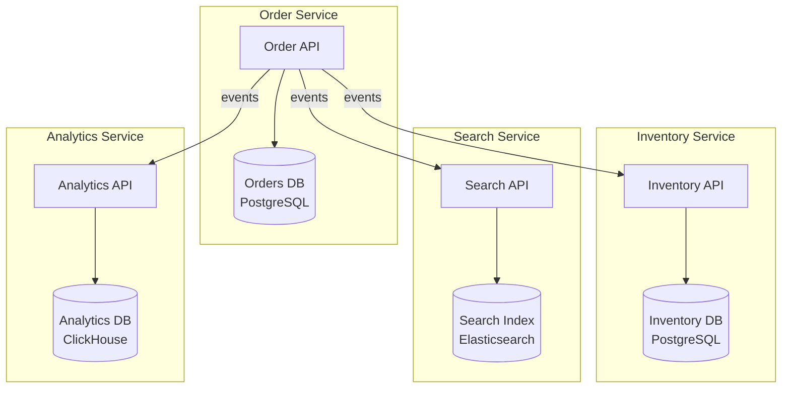
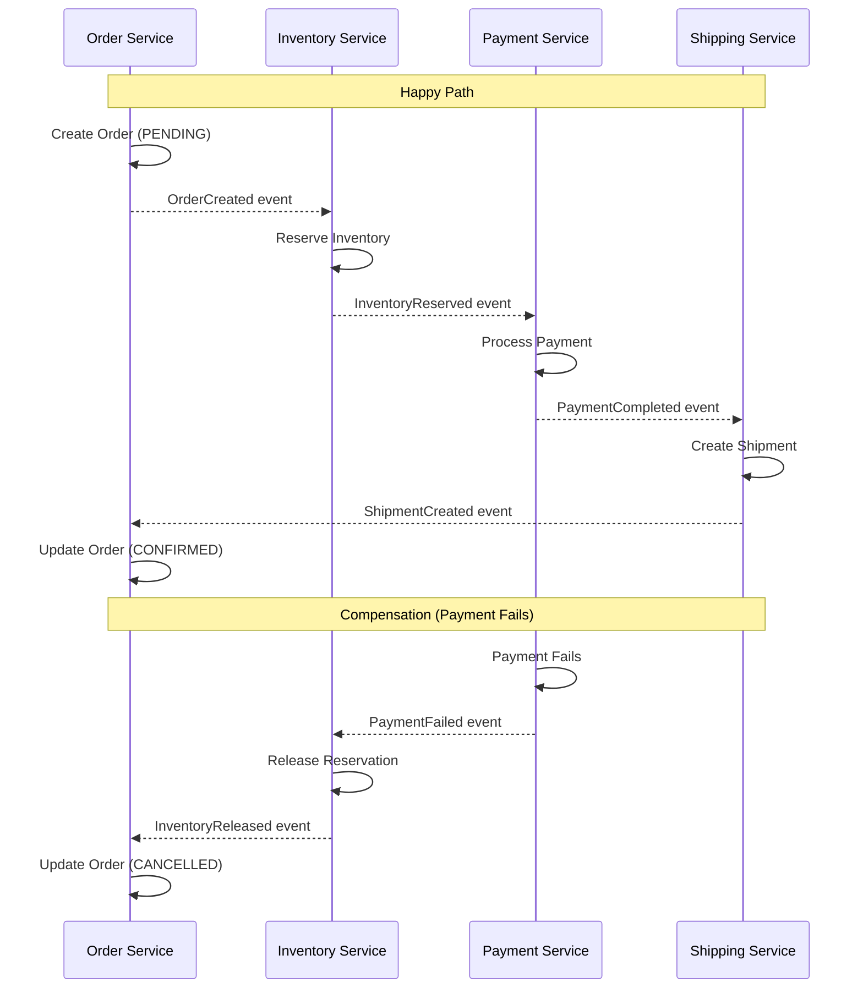
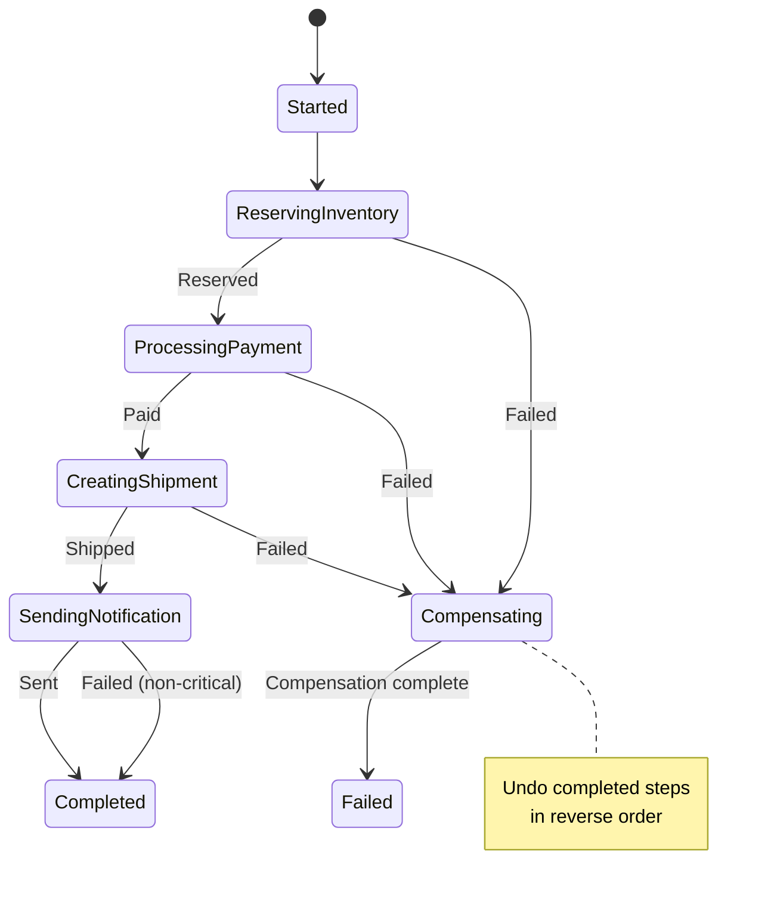
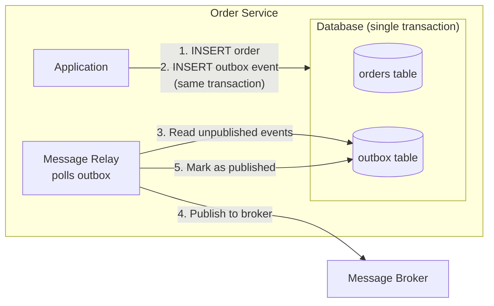
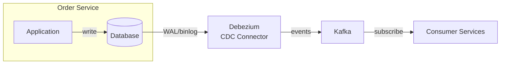
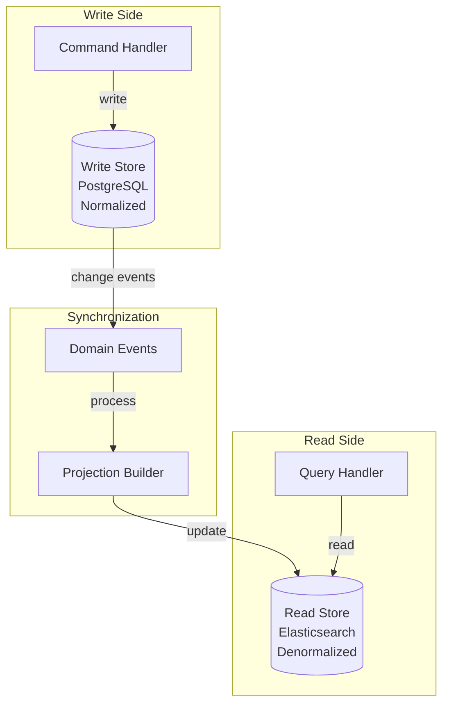
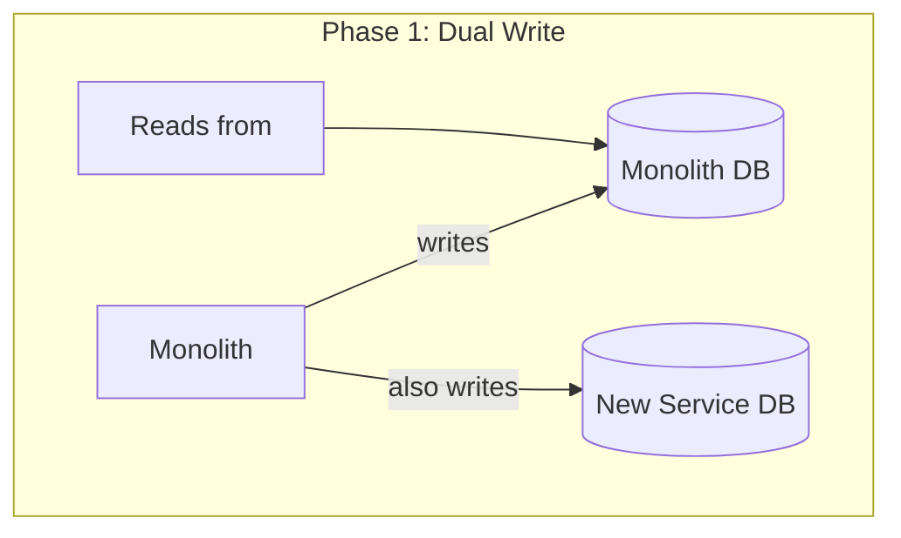
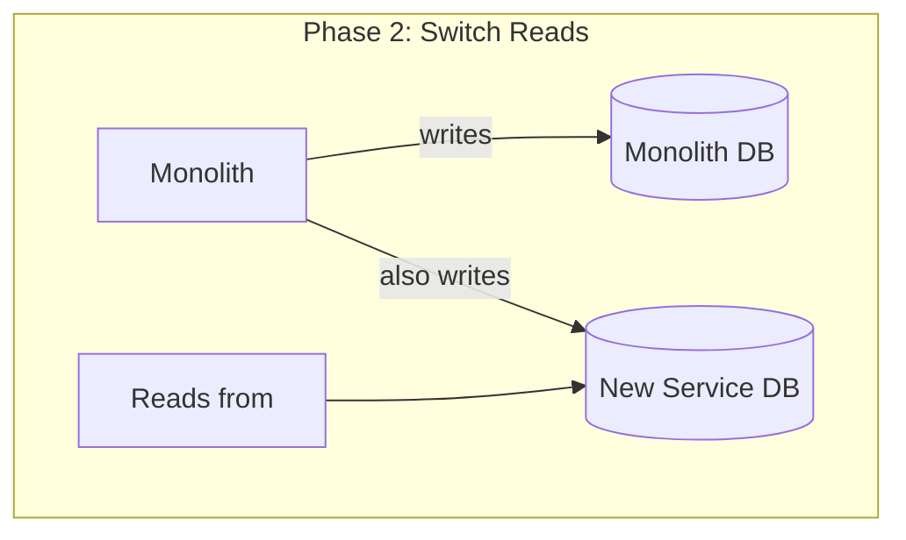
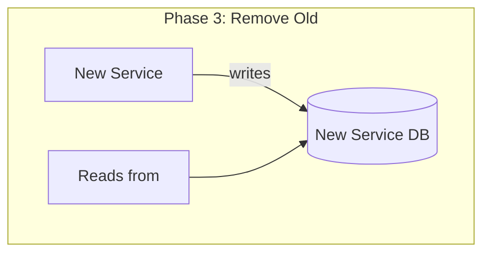

# Microservices Data Management

Data management is the hardest problem in microservices architecture. In a monolith, you have one database, one transaction manager, and ACID guarantees that let you reason about consistency trivially. In microservices, every service owns its data, there is no shared database, and cross-service consistency requires explicit coordination. This page covers the patterns for managing data across service boundaries without losing your mind or your data.

## Why Data Management Is the Hardest Part — First Principles

A monolith with a single database gives you transactions:

```sql
BEGIN;
  UPDATE accounts SET balance = balance - 100 WHERE id = 'alice';
  UPDATE accounts SET balance = balance + 100 WHERE id = 'bob';
  INSERT INTO transfers (from_id, to_id, amount) VALUES ('alice', 'bob', 100);
COMMIT;
```

If any statement fails, the entire transaction rolls back. ACID guarantees mean that the database is always in a consistent state. This is trivially correct.

In microservices, Alice's account might be in the Account Service and Bob's account might be in the Payment Service. There is no distributed transaction manager that can atomically update both databases. You must use patterns that achieve eventual consistency through coordination.

The fundamental theorem at play:

$$
\text{Distributed Transactions} \Leftrightarrow \text{Reduced Availability}
$$

Two-phase commit (2PC) can provide distributed transactions, but it requires all participating services to be available simultaneously and locks resources until all parties agree. In a microservices architecture with dozens of services, this is impractical — a single unavailable service blocks the entire transaction.

## Database per Service

The foundational data management pattern for microservices: each service owns its database and no other service can access it directly.



### Why Not Share a Database?

A shared database creates hidden coupling:

```typescript
// ANTI-PATTERN: Two services sharing the same database

// Order Service directly queries the inventory table
class OrderService {
  async placeOrder(order: OrderRequest): Promise<Order> {
    return this.db.transaction(async (tx) => {
      // Check inventory — directly reading Inventory Service's table
      const stock = await tx.query('SELECT quantity FROM inventory WHERE product_id = $1', [order.productId]);
      if (stock.rows[0].quantity < order.quantity) {
        throw new Error('Insufficient stock');
      }

      // Update inventory — directly modifying Inventory Service's table
      await tx.query('UPDATE inventory SET quantity = quantity - $1 WHERE product_id = $2', [order.quantity, order.productId]);

      // Create order
      const result = await tx.query('INSERT INTO orders (...) VALUES (...) RETURNING *');
      return result.rows[0];
    });
  }
}

// Problems with this approach:
// 1. Schema coupling — Inventory Service can't change its schema without breaking Order Service
// 2. Deployment coupling — Both services must deploy in lockstep for schema changes
// 3. Performance coupling — Order Service's queries affect Inventory Service's table performance
// 4. The database IS the API contract — the worst kind of contract
// 5. No encapsulation — Order Service can bypass all Inventory Service validation
```

### Choosing the Right Database per Service

Different services have different data access patterns. One of the benefits of database-per-service is that each service can use the database best suited to its needs:

| Service | Access Pattern | Best Database | Why |
|---|---|---|---|
| **User Profiles** | Key-value lookups, flexible schema | MongoDB, DynamoDB | Flexible schema, fast reads |
| **Orders** | Relational data, transactions | PostgreSQL | ACID transactions, joins |
| **Search** | Full-text search, faceting | Elasticsearch | Inverted index, relevance scoring |
| **Recommendations** | Graph traversal | Neo4j | Relationship queries |
| **Session Store** | Fast reads/writes, TTL | Redis | In-memory, sub-millisecond |
| **Analytics** | Columnar aggregation | ClickHouse, BigQuery | Columnar storage, fast aggregation |
| **Time Series** | Append-heavy, range queries | TimescaleDB, InfluxDB | Time-partitioned storage |

## The Saga Pattern

Sagas are the primary pattern for maintaining data consistency across multiple services without distributed transactions. A saga is a sequence of local transactions, each in a different service. If any step fails, compensating transactions undo the work of preceding steps.

### Choreography-Based Saga

Each service publishes events and reacts to events from other services. There is no central coordinator.



```typescript
// inventory-service/src/application/sagas/OrderSaga.ts

class InventoryOrderSagaHandler {
  constructor(
    private readonly inventoryRepo: InventoryRepository,
    private readonly eventPublisher: EventPublisher,
  ) {}

  // React to OrderCreated event
  async onOrderCreated(event: OrderCreatedEvent): Promise<void> {
    const reservations: InventoryReservation[] = [];

    try {
      // Reserve inventory for each item in the order
      for (const item of event.data.items) {
        const reservation = await this.inventoryRepo.reserve(
          item.productId,
          item.quantity,
          event.data.orderId,
          new Date(Date.now() + 15 * 60 * 1000), // 15-minute hold
        );
        reservations.push(reservation);
      }

      // All items reserved — publish success event
      await this.eventPublisher.publish('inventory.reserved', {
        eventId: generateUUID(),
        eventType: 'inventory.reserved',
        timestamp: new Date().toISOString(),
        data: {
          orderId: event.data.orderId,
          reservations: reservations.map(r => ({
            reservationId: r.id,
            productId: r.productId,
            quantity: r.quantity,
          })),
        },
        metadata: {
          correlationId: event.metadata.correlationId,
          causationId: event.eventId,
        },
      });
    } catch (error) {
      // Partial failure — compensate by releasing any reservations made
      for (const reservation of reservations) {
        await this.inventoryRepo.releaseReservation(reservation.id);
      }

      // Publish failure event so other services can compensate
      await this.eventPublisher.publish('inventory.reservation_failed', {
        eventId: generateUUID(),
        eventType: 'inventory.reservation_failed',
        timestamp: new Date().toISOString(),
        data: {
          orderId: event.data.orderId,
          reason: error instanceof InsufficientStockError
            ? `Insufficient stock for ${error.productId}`
            : 'Internal error during reservation',
        },
        metadata: {
          correlationId: event.metadata.correlationId,
          causationId: event.eventId,
        },
      });
    }
  }

  // React to PaymentFailed event — compensate by releasing inventory
  async onPaymentFailed(event: PaymentFailedEvent): Promise<void> {
    await this.inventoryRepo.releaseReservationsByOrderId(event.data.orderId);

    await this.eventPublisher.publish('inventory.released', {
      eventId: generateUUID(),
      eventType: 'inventory.released',
      timestamp: new Date().toISOString(),
      data: { orderId: event.data.orderId },
      metadata: {
        correlationId: event.metadata.correlationId,
        causationId: event.eventId,
      },
    });
  }
}
```

### Orchestration-Based Saga

A central orchestrator manages the saga's state machine and directs each service step by step.

```typescript
// saga-orchestrator/src/sagas/OrderSaga.ts

interface SagaStepDefinition {
  name: string;
  execute: (context: SagaContext) => Promise<StepResult>;
  compensate: (context: SagaContext) => Promise<void>;
  timeout: number;
  retryPolicy?: RetryPolicy;
}

type SagaState =
  | 'STARTED'
  | 'RESERVING_INVENTORY'
  | 'PROCESSING_PAYMENT'
  | 'CREATING_SHIPMENT'
  | 'SENDING_NOTIFICATION'
  | 'COMPLETED'
  | 'COMPENSATING'
  | 'FAILED';

class OrderSagaOrchestrator {
  private readonly steps: SagaStepDefinition[];

  constructor(
    private readonly inventoryClient: InventoryClient,
    private readonly paymentClient: PaymentClient,
    private readonly shippingClient: ShippingClient,
    private readonly notificationClient: NotificationClient,
    private readonly sagaStore: SagaStore,
  ) {
    this.steps = [
      {
        name: 'RESERVING_INVENTORY',
        execute: async (ctx) => {
          const result = await this.inventoryClient.reserveStock(
            ctx.order.items,
            ctx.order.id,
          );
          ctx.reservationIds = result.reservationIds;
          return { success: true, data: result };
        },
        compensate: async (ctx) => {
          if (ctx.reservationIds) {
            for (const id of ctx.reservationIds) {
              await this.inventoryClient.releaseReservation(id);
            }
          }
        },
        timeout: 5000,
        retryPolicy: { maxRetries: 3, backoff: 'exponential', baseDelay: 1000 },
      },
      {
        name: 'PROCESSING_PAYMENT',
        execute: async (ctx) => {
          const result = await this.paymentClient.processPayment({
            orderId: ctx.order.id,
            amount: ctx.order.totalAmount,
            customerId: ctx.order.customerId,
            idempotencyKey: `payment-${ctx.sagaId}`,
          });
          ctx.paymentId = result.paymentId;
          return { success: true, data: result };
        },
        compensate: async (ctx) => {
          if (ctx.paymentId) {
            await this.paymentClient.refundPayment(ctx.paymentId, {
              idempotencyKey: `refund-${ctx.sagaId}`,
            });
          }
        },
        timeout: 10000,
        retryPolicy: { maxRetries: 2, backoff: 'exponential', baseDelay: 2000 },
      },
      {
        name: 'CREATING_SHIPMENT',
        execute: async (ctx) => {
          const result = await this.shippingClient.createShipment({
            orderId: ctx.order.id,
            items: ctx.order.items,
            shippingAddress: ctx.order.shippingAddress,
          });
          ctx.shipmentId = result.shipmentId;
          return { success: true, data: result };
        },
        compensate: async (ctx) => {
          if (ctx.shipmentId) {
            await this.shippingClient.cancelShipment(ctx.shipmentId);
          }
        },
        timeout: 5000,
      },
      {
        name: 'SENDING_NOTIFICATION',
        execute: async (ctx) => {
          // Non-critical step — failure doesn't trigger compensation
          await this.notificationClient.sendOrderConfirmation(ctx.order);
          return { success: true };
        },
        compensate: async () => {
          // Cannot unsend a notification — no-op
        },
        timeout: 3000,
      },
    ];
  }

  async execute(order: Order): Promise<SagaResult> {
    const sagaId = generateUUID();
    const context: SagaContext = {
      sagaId,
      order,
      completedSteps: [],
    };

    // Persist saga state for crash recovery
    await this.sagaStore.create(sagaId, 'STARTED', context);

    for (const step of this.steps) {
      try {
        await this.sagaStore.updateState(sagaId, step.name as SagaState);

        const result = await this.executeWithRetry(
          () => withTimeout(
            () => step.execute(context),
            step.timeout,
            step.name,
          ),
          step.retryPolicy,
        );

        context.completedSteps.push(step.name);
        await this.sagaStore.stepCompleted(sagaId, step.name, result.data);

      } catch (error) {
        // Step failed — begin compensation
        await this.sagaStore.updateState(sagaId, 'COMPENSATING');

        await this.compensate(sagaId, context);

        await this.sagaStore.updateState(sagaId, 'FAILED');
        return {
          success: false,
          sagaId,
          failedStep: step.name,
          error: (error as Error).message,
        };
      }
    }

    await this.sagaStore.updateState(sagaId, 'COMPLETED');
    return { success: true, sagaId };
  }

  private async compensate(sagaId: string, context: SagaContext): Promise<void> {
    // Compensate in reverse order
    const stepsToCompensate = [...context.completedSteps].reverse();

    for (const stepName of stepsToCompensate) {
      const step = this.steps.find(s => s.name === stepName)!;
      try {
        await step.compensate(context);
        await this.sagaStore.compensationCompleted(sagaId, stepName);
      } catch (compensationError) {
        // Compensation failure — this is a critical problem
        // Log for manual intervention
        await this.sagaStore.compensationFailed(sagaId, stepName, compensationError);
        // In production: alert on-call engineer, create incident
        console.error(
          `CRITICAL: Compensation failed for saga ${sagaId}, step ${stepName}:`,
          compensationError,
        );
      }
    }
  }

  private async executeWithRetry<T>(
    operation: () => Promise<T>,
    policy?: RetryPolicy,
  ): Promise<T> {
    if (!policy) return operation();

    return retryWithBackoff(operation, {
      maxRetries: policy.maxRetries,
      baseDelay: policy.baseDelay,
      maxDelay: 30000,
      backoffMultiplier: 2,
      jitter: true,
    });
  }
}
```

### Saga State Machine Visualization



## Transactional Outbox Pattern

A critical pattern for ensuring that database writes and event publications are atomic. Without it, you can have situations where the database is updated but the event is never published (or vice versa).



```typescript
// order-service/src/infrastructure/OutboxRepository.ts

interface OutboxEvent {
  id: string;
  aggregateType: string;
  aggregateId: string;
  eventType: string;
  payload: string;         // JSON serialized
  createdAt: Date;
  publishedAt: Date | null;
}

class OrderRepository {
  constructor(private readonly db: DatabasePool) {}

  async createOrder(order: Order): Promise<void> {
    // CRITICAL: Both writes happen in the SAME database transaction
    await this.db.transaction(async (tx) => {
      // 1. Write the order
      await tx.query(
        'INSERT INTO orders (id, customer_id, status, total_amount, created_at) VALUES ($1, $2, $3, $4, $5)',
        [order.id, order.customerId, order.status, order.totalAmount, order.createdAt],
      );

      for (const item of order.items) {
        await tx.query(
          'INSERT INTO order_items (order_id, product_id, quantity, unit_price) VALUES ($1, $2, $3, $4)',
          [order.id, item.productId, item.quantity, item.unitPrice],
        );
      }

      // 2. Write the event to the outbox (same transaction!)
      const event: OrderPlacedEvent = {
        eventId: generateUUID(),
        eventType: 'order.placed',
        timestamp: new Date().toISOString(),
        data: {
          orderId: order.id,
          customerId: order.customerId,
          items: order.items,
          totalAmount: order.totalAmount,
        },
      };

      await tx.query(
        `INSERT INTO outbox (id, aggregate_type, aggregate_id, event_type, payload, created_at)
         VALUES ($1, $2, $3, $4, $5, NOW())`,
        [event.eventId, 'Order', order.id, event.eventType, JSON.stringify(event)],
      );

      // If the transaction commits, BOTH the order AND the outbox event are saved.
      // If the transaction rolls back, NEITHER is saved.
      // There is no window where the order exists without its event.
    });
  }
}

// Message Relay — polls the outbox and publishes events
class OutboxRelay {
  private isRunning = false;

  constructor(
    private readonly db: DatabasePool,
    private readonly publisher: EventPublisher,
    private readonly pollInterval: number = 1000,
    private readonly batchSize: number = 100,
  ) {}

  async start(): Promise<void> {
    this.isRunning = true;
    while (this.isRunning) {
      try {
        const published = await this.publishBatch();
        if (published === 0) {
          // No events to publish — wait before polling again
          await sleep(this.pollInterval);
        }
        // If we published events, immediately check for more (don't wait)
      } catch (error) {
        console.error('Outbox relay error:', error);
        await sleep(this.pollInterval * 2); // Back off on error
      }
    }
  }

  private async publishBatch(): Promise<number> {
    // Fetch unpublished events ordered by creation time
    const events = await this.db.query<OutboxEvent>(
      `SELECT id, aggregate_type, aggregate_id, event_type, payload, created_at
       FROM outbox
       WHERE published_at IS NULL
       ORDER BY created_at ASC
       LIMIT $1
       FOR UPDATE SKIP LOCKED`, // SKIP LOCKED for multiple relay instances
      [this.batchSize],
    );

    if (events.rows.length === 0) return 0;

    for (const event of events.rows) {
      try {
        // Publish to message broker
        await this.publisher.publish(event.event_type, JSON.parse(event.payload));

        // Mark as published
        await this.db.query(
          'UPDATE outbox SET published_at = NOW() WHERE id = $1',
          [event.id],
        );
      } catch (error) {
        // Publishing failed — the event will be retried on the next poll
        // Events are published in order, so we stop here to maintain ordering
        console.error(`Failed to publish outbox event ${event.id}:`, error);
        break;
      }
    }

    return events.rows.length;
  }

  stop(): void {
    this.isRunning = false;
  }
}
```

### Change Data Capture (CDC) Alternative

Instead of polling the outbox table, use database change data capture to stream changes from the outbox table to the message broker:



Debezium reads the database's write-ahead log (WAL in PostgreSQL, binlog in MySQL) and publishes each change as an event to Kafka. This eliminates polling, reduces latency, and handles ordering guarantees automatically.

## CQRS for Microservices

CQRS (Command Query Responsibility Segregation) separates read and write models. In a microservices context, this means having different services (or different data stores within a service) optimized for reads vs writes.



```typescript
// order-service/src/application/commands/PlaceOrderCommandHandler.ts

class PlaceOrderCommandHandler {
  constructor(
    private readonly orderRepo: OrderWriteRepository,
    private readonly eventPublisher: EventPublisher,
  ) {}

  async handle(command: PlaceOrderCommand): Promise<string> {
    // Write side: validate and persist
    const order = Order.create({
      customerId: command.customerId,
      items: command.items,
      shippingAddress: command.shippingAddress,
    });

    // Write to normalized relational store
    await this.orderRepo.save(order);

    // Publish event for read side to consume
    await this.eventPublisher.publish('order.placed', {
      orderId: order.id,
      customerId: order.customerId,
      items: order.items,
      totalAmount: order.totalAmount,
      placedAt: order.placedAt,
    });

    return order.id;
  }
}

// order-service/src/application/projections/OrderReadProjection.ts

class OrderReadProjection {
  constructor(private readonly readStore: ElasticsearchClient) {}

  // Build denormalized read model from events
  async onOrderPlaced(event: OrderPlacedEvent): Promise<void> {
    await this.readStore.index('orders', event.data.orderId, {
      orderId: event.data.orderId,
      customerId: event.data.customerId,
      customerName: event.data.customerName,     // Denormalized
      items: event.data.items.map(item => ({
        productId: item.productId,
        productName: item.productName,           // Denormalized
        quantity: item.quantity,
        unitPrice: item.unitPrice,
      })),
      totalAmount: event.data.totalAmount,
      status: 'pending',
      placedAt: event.timestamp,
      // Denormalized fields for efficient querying
      itemCount: event.data.items.length,
      productIds: event.data.items.map(i => i.productId),
    });
  }

  async onOrderShipped(event: OrderShippedEvent): Promise<void> {
    await this.readStore.update('orders', event.data.orderId, {
      status: 'shipped',
      shippedAt: event.timestamp,
      trackingNumber: event.data.trackingNumber,
      carrier: event.data.carrier,
    });
  }

  async onOrderDelivered(event: OrderDeliveredEvent): Promise<void> {
    await this.readStore.update('orders', event.data.orderId, {
      status: 'delivered',
      deliveredAt: event.timestamp,
    });
  }
}

// Query handler reads from the denormalized read store
class OrderQueryHandler {
  constructor(private readonly readStore: ElasticsearchClient) {}

  async getCustomerOrders(customerId: string, options: QueryOptions): Promise<OrderListResponse> {
    // Read from denormalized Elasticsearch index
    // Fast, no JOINs, no cross-service calls
    const result = await this.readStore.search('orders', {
      query: {
        bool: {
          must: [{ term: { customerId } }],
          filter: options.status ? [{ term: { status: options.status } }] : [],
        },
      },
      sort: [{ placedAt: 'desc' }],
      from: options.offset,
      size: options.limit,
    });

    return {
      orders: result.hits,
      total: result.total,
      hasMore: result.total > options.offset + options.limit,
    };
  }
}
```

## Data Consistency Strategies

### Strategy 1: Eventual Consistency with Events

The default strategy. Services publish events when their data changes, and consuming services update their local copies asynchronously.

**Consistency delay:** Typically milliseconds to seconds.

**Use when:** The business can tolerate short periods of inconsistency.

### Strategy 2: Read-Your-Writes Consistency

After a user writes data to Service A, they can read it back immediately from Service A (not from a read model that might be stale).

```typescript
// After creating an order, redirect the user to the order detail page
// that reads from the write store, not the read store

async function placeOrder(req: Request, res: Response) {
  const orderId = await commandHandler.handle(req.body);

  // Option 1: Read from write store immediately
  const order = await orderWriteRepo.findById(orderId);
  res.json(order);

  // Option 2: Include a version token so the read side can wait for consistency
  // res.json({ orderId, consistencyToken: `order:${orderId}:v1` });
  // Client sends this token with subsequent read requests
  // Read store blocks until it has processed this version
}
```

### Strategy 3: Saga with Compensating Transactions

For operations that span multiple services and require all-or-nothing semantics (or as close as possible).

**Use when:** Cross-service operations where partial completion is unacceptable (order placement, money transfer).

### Strategy 4: Event-Carried State Transfer

Instead of publishing thin events and requiring consumers to call back for details, publish fat events that carry the full state needed by consumers.

```typescript
// Thin event — requires callback
interface OrderPlacedThinEvent {
  eventType: 'order.placed';
  data: {
    orderId: string;
    // Consumer must call Order Service to get items, total, etc.
  };
}

// Fat event — self-contained
interface OrderPlacedFatEvent {
  eventType: 'order.placed';
  data: {
    orderId: string;
    customerId: string;
    customerName: string;
    customerEmail: string;
    items: Array<{
      productId: string;
      productName: string;
      quantity: number;
      unitPrice: number;
    }>;
    totalAmount: number;
    shippingAddress: Address;
    placedAt: string;
  };
}

// Fat events trade increased event size for reduced coupling.
// The consumer does not need to know about the producer's API.
// The consumer does not need to be able to call the producer.
// The consumer can build its complete read model from events alone.
```

## The Dual-Write Problem

The dual-write problem occurs when a service needs to update its database AND publish an event, but these are two separate operations that cannot be done atomically.

```typescript
// DANGEROUS: dual-write problem
async function placeOrder(order: Order): Promise<void> {
  // Step 1: Write to database
  await database.save(order);

  // CRASH POINT: If the process crashes here, the order is saved
  // but the event is never published. Other services never learn
  // about the order. Data is permanently inconsistent.

  // Step 2: Publish event
  await eventBus.publish('order.placed', { orderId: order.id });
}
```

**Solutions:**
1. **Transactional Outbox** (recommended) — write the event to an outbox table in the same database transaction
2. **Event Sourcing** — make events the source of truth, derive database state from events
3. **Change Data Capture** — use CDC (Debezium) to capture database changes and publish them as events
4. **Listen to Yourself** — publish the event first, then consume your own event to update the database

::: info War Story
An e-commerce company discovered the dual-write problem when they noticed that approximately 0.1% of orders were missing from their analytics dashboard. The order would be saved in the database, but the event that fed the analytics pipeline was never published because the application crashed (or the message broker was briefly unavailable) between the database write and the event publish. At their scale of 100,000 orders per day, that was 100 lost orders per day — invisible to customers but destroying the accuracy of business reports. They implemented the transactional outbox pattern and the data discrepancy dropped to zero. The outbox relay adds about 50ms of end-to-end latency (the time between the database write and the event being published to the broker), which was perfectly acceptable for their analytics use case.
:::

## Data Migration Strategies

When extracting a service from a monolith, you need to migrate data from the monolith's database to the new service's database.

### Strategy 1: Data Synchronization During Migration







### Strategy 2: Event-Sourced Migration

Replay historical events to populate the new service's database, then switch to consuming live events.

```typescript
// migration/src/ReplayHistoricalEvents.ts

class HistoricalEventReplayer {
  constructor(
    private readonly eventStore: EventStore,
    private readonly projection: ReadModelProjection,
  ) {}

  async replay(fromDate: Date, toDate: Date): Promise<ReplayResult> {
    let processedCount = 0;
    let errorCount = 0;
    const batchSize = 1000;

    let cursor = await this.eventStore.openCursor({
      from: fromDate,
      to: toDate,
      batchSize,
    });

    while (cursor.hasMore()) {
      const batch = await cursor.nextBatch();

      for (const event of batch) {
        try {
          await this.projection.handleEvent(event);
          processedCount++;
        } catch (error) {
          errorCount++;
          console.error(`Failed to replay event ${event.id}:`, error);
        }
      }

      console.log(`Progress: ${processedCount} events replayed, ${errorCount} errors`);
    }

    return { processedCount, errorCount };
  }
}
```

## Decision Framework: Choosing a Data Consistency Strategy

| Requirement | Strategy | Trade-off |
|---|---|---|
| Single-service operation | Local ACID transaction | None — just use your database |
| Cross-service, compensation acceptable | Choreography saga | Hard to trace, eventual consistency |
| Cross-service, complex coordination | Orchestration saga | Central point of failure, but easier to reason about |
| Read-heavy with different read patterns | CQRS | Eventual consistency between read and write models |
| Need complete audit trail | Event Sourcing | Complex implementation, storage growth |
| Must avoid dual-write | Transactional Outbox | Slight latency for event delivery |
| Real-time data sync | CDC (Debezium) | Infrastructure dependency, operational complexity |
