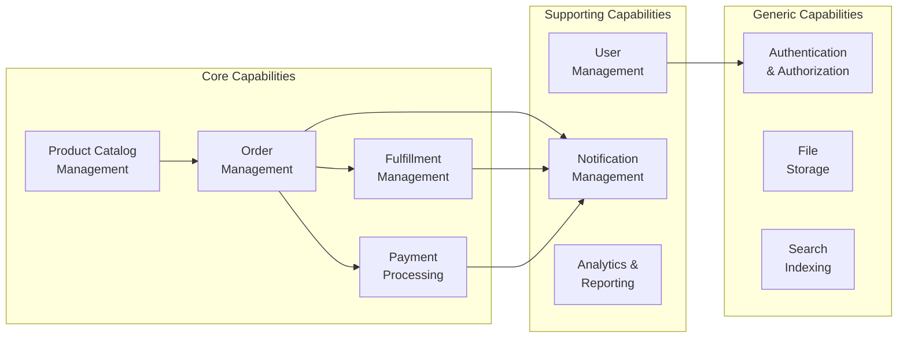
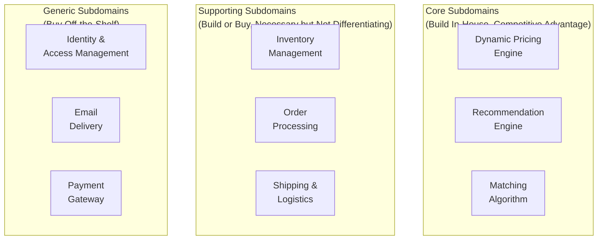
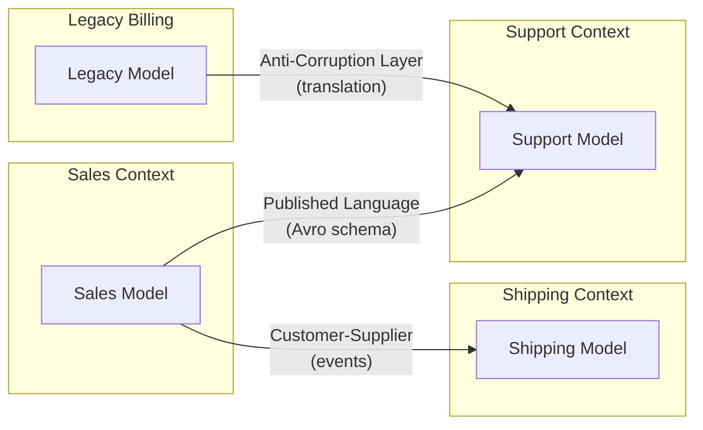
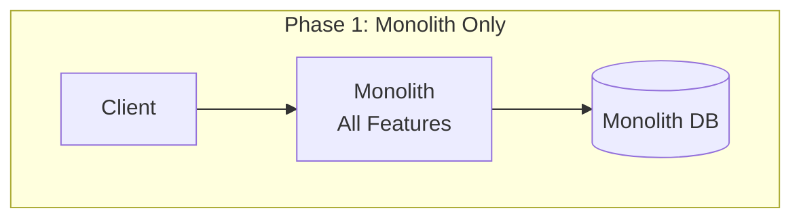
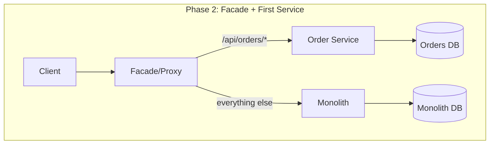
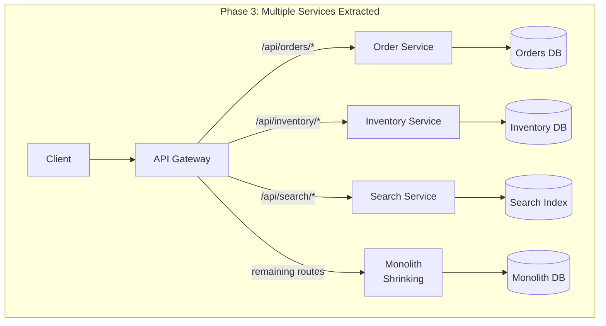
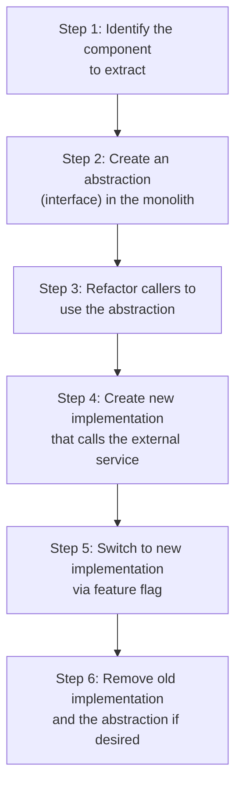
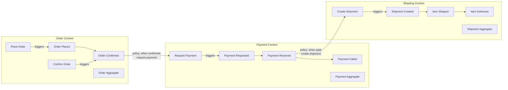
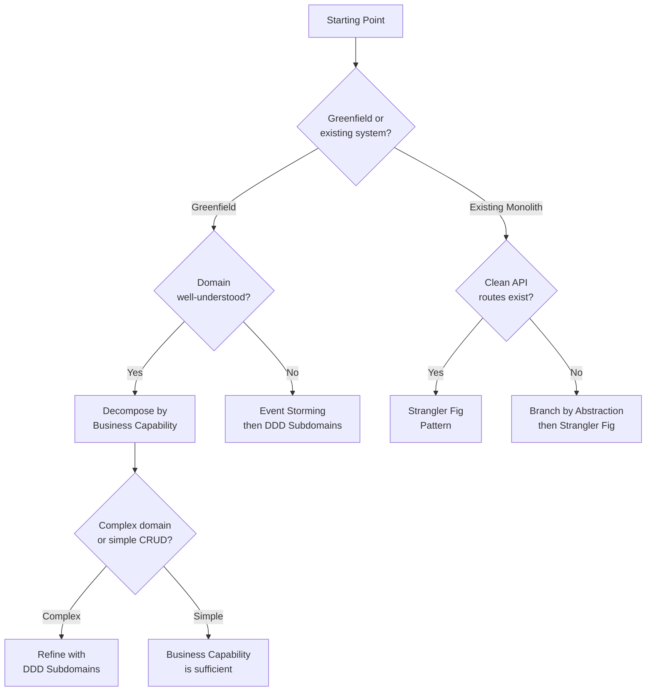

# Microservice Decomposition Strategies

Drawing service boundaries is the single most consequential decision in a microservices architecture. Get the boundaries right and teams ship independently for years. Get them wrong and you end up with a distributed monolith — all the complexity of microservices with none of the benefits.

The core challenge is this: a service boundary is simultaneously a team boundary, a data boundary, a deployment boundary, and a consistency boundary. When you split a monolith along the wrong seam, you create cross-service transactions that should have been in-process calls, you create data synchronization problems that should have been simple JOINs, and you create coordination overhead that should have been a function call.

## Why Decomposition Is Hard — First Principles

Software systems encode two kinds of coupling:

1. **Domain coupling** — concepts that are inherently related in the business domain (an Order always references a Customer)
2. **Implementation coupling** — concepts that are related because of how we built the system (the OrderService and the EmailService share a database table)

Good service boundaries cut along lines of low domain coupling. Bad boundaries cut across high domain coupling. Implementation coupling can be refactored away; domain coupling cannot.

The fundamental tension:

$$
\text{Service Independence} \propto \frac{1}{\text{Cross-Service Communication}}
$$

Every cross-service call is a potential point of failure, a source of latency, and a coordination burden. The goal of decomposition is to minimize the number of cross-service calls required to fulfill a business operation.

## Strategy 1: Decomposition by Business Capability

**The idea:** Identify the core business capabilities of the organization and create one service per capability.

A business capability is something the organization does to generate value, regardless of how it is currently implemented. "Process Payments" is a business capability. "Manage the payments table in PostgreSQL" is an implementation detail.

### Identifying Business Capabilities

Map your organization's value chain:



Each box becomes a candidate service. The arrows represent the inter-service communication that will replace in-process calls.

### The Process

1. **Interview domain experts.** Ask "what does your department do?" not "what does your software do?" Business capabilities are stable across technology changes.
2. **Map the value chain.** Trace how value flows from customer request to delivery. Each stage is a candidate capability.
3. **Identify capability hierarchies.** Large capabilities decompose into sub-capabilities. "Order Management" includes "Order Placement," "Order Tracking," and "Order Cancellation."
4. **Validate independence.** For each candidate service, ask: "Can this capability operate if the others are temporarily unavailable?" If not, the boundary may be wrong.

### TypeScript Example: Service Structure

```typescript
// order-service/src/domain/Order.ts
// Each service owns its complete domain model

interface OrderItem {
  productId: string;     // Reference to Product Catalog service — just an ID, not the full product
  productName: string;   // Denormalized at order time — immune to future catalog changes
  quantity: number;
  unitPrice: number;     // Captured at order time — price may change later in catalog
}

interface Order {
  id: string;
  customerId: string;    // Reference to User Management service — just an ID
  items: OrderItem[];
  status: OrderStatus;
  totalAmount: number;
  placedAt: Date;
  shippedAt?: Date;
}

type OrderStatus =
  | 'pending'
  | 'confirmed'
  | 'payment_processing'
  | 'paid'
  | 'shipped'
  | 'delivered'
  | 'cancelled';

// The Order service does NOT query the Product Catalog at read time.
// It captured everything it needs at order placement time.
// This is intentional denormalization that enables service independence.
```

### When This Strategy Works Well

- Organizations with clear departmental boundaries (e-commerce, banking, insurance)
- Stable business domains where capabilities rarely change
- Teams already aligned to business capabilities

### When This Strategy Fails

- Startups where business capabilities are still being discovered
- Cross-cutting concerns that don't map to a single capability (search, recommendations)
- When a single business operation requires tight coordination across many capabilities

::: info War Story
An insurance company decomposed by business capability: Underwriting, Claims, Policy Management, Billing. Each became a service. The problem was that a single customer interaction — filing a claim — required synchronous calls across all four services. The claim needed policy details (Policy Management), coverage verification (Underwriting), payment information (Billing), and claim processing logic (Claims). A single user action resulted in a chain of four synchronous calls with no tolerance for any service being down. They solved it by denormalizing: the Claims service maintained a read-only projection of the policy and coverage data it needed, updated via events. This eliminated three of the four synchronous calls.
:::

## Strategy 2: Decomposition by Subdomain (DDD-Aligned)

**The idea:** Use Domain-Driven Design's bounded context concept to identify service boundaries.

This is the most rigorous decomposition strategy and produces the best results when done well. The key insight from DDD is that different parts of the business have different models of the same concepts, and those models should be kept separate.

### Core, Supporting, and Generic Subdomains



- **Core subdomains** are where your competitive advantage lives. Build them in-house with your best engineers. These deserve microservice treatment.
- **Supporting subdomains** are necessary but not differentiating. They can be simpler services or even part of a monolith.
- **Generic subdomains** are solved problems. Use third-party services (Auth0, Stripe, SendGrid).

### Identifying Bounded Contexts

A bounded context is a boundary within which a particular domain model is consistent and complete. The same real-world concept (e.g., "Customer") has different meanings in different contexts:

```typescript
// In the Sales bounded context:
interface Customer {
  id: string;
  name: string;
  email: string;
  creditLimit: number;
  paymentTerms: 'net30' | 'net60' | 'prepaid';
  salesRepId: string;
  totalLifetimeValue: number;
}

// In the Shipping bounded context:
interface Customer {
  id: string;
  name: string;
  shippingAddresses: Address[];
  preferredCarrier: string;
  deliveryInstructions: string;
}

// In the Support bounded context:
interface Customer {
  id: string;
  name: string;
  email: string;
  phone: string;
  supportTier: 'basic' | 'premium' | 'enterprise';
  openTickets: number;
  accountManager: string;
}

// These are THREE different models of the same real-world entity.
// Each bounded context keeps only the attributes it needs.
// They share an ID for correlation but are otherwise independent.
```

### Context Mapping Patterns

When two bounded contexts need to communicate, you must define the relationship between them:

| Pattern | Description | When to Use |
|---|---|---|
| **Shared Kernel** | Two contexts share a small common model | Tightly coupled teams, small shared domain |
| **Customer-Supplier** | Upstream context provides what downstream needs | Clear dependency direction, willing upstream |
| **Conformist** | Downstream adopts upstream's model as-is | No leverage to influence upstream (e.g., third-party API) |
| **Anti-Corruption Layer** | Downstream translates upstream's model | Legacy systems, third-party APIs, different ubiquitous languages |
| **Open Host Service** | Upstream provides a well-defined protocol | Multiple consumers with different needs |
| **Published Language** | Shared schema/format (e.g., Avro, Protobuf) | Event-driven communication, schema evolution needed |



### Implementation: Anti-Corruption Layer

```typescript
// support-service/src/infrastructure/acl/LegacyBillingTranslator.ts

// The legacy billing system has a completely different model.
// The ACL translates between the legacy model and our domain model.

interface LegacyBillingRecord {
  CUST_NO: string;         // Legacy customer number
  ACCT_STAT: number;       // 1=active, 2=suspended, 3=closed, 99=unknown
  BAL_DUE: string;         // String representation of balance (legacy COBOL system)
  LAST_PMT_DT: string;     // YYYYMMDD format
  PMT_TERMS_CD: string;    // 'N30', 'N60', 'PPD'
}

interface CustomerBillingStatus {
  customerId: string;
  accountStatus: 'active' | 'suspended' | 'closed';
  balanceDue: number;
  lastPaymentDate: Date;
  paymentTerms: 'net30' | 'net60' | 'prepaid';
}

class LegacyBillingACL {
  constructor(private readonly legacyClient: LegacyBillingClient) {}

  async getCustomerBillingStatus(customerId: string): Promise<CustomerBillingStatus> {
    const legacyRecord = await this.legacyClient.fetchRecord(customerId);
    return this.translate(legacyRecord);
  }

  private translate(record: LegacyBillingRecord): CustomerBillingStatus {
    return {
      customerId: record.CUST_NO,
      accountStatus: this.translateStatus(record.ACCT_STAT),
      balanceDue: this.parseBalance(record.BAL_DUE),
      lastPaymentDate: this.parseDate(record.LAST_PMT_DT),
      paymentTerms: this.translatePaymentTerms(record.PMT_TERMS_CD),
    };
  }

  private translateStatus(code: number): CustomerBillingStatus['accountStatus'] {
    const statusMap: Record<number, CustomerBillingStatus['accountStatus']> = {
      1: 'active',
      2: 'suspended',
      3: 'closed',
    };
    const status = statusMap[code];
    if (!status) {
      // Unknown status codes from legacy system — log and default to suspended
      // (safe default: don't give access to unknown accounts)
      console.warn(`Unknown legacy billing status code: ${code}`);
      return 'suspended';
    }
    return status;
  }

  private parseBalance(balanceStr: string): number {
    // Legacy COBOL system stores amounts as strings with implied decimal
    // "000012345" means $123.45
    const cleaned = balanceStr.replace(/[^0-9-]/g, '');
    return parseInt(cleaned, 10) / 100;
  }

  private parseDate(dateStr: string): Date {
    // YYYYMMDD format
    const year = parseInt(dateStr.substring(0, 4), 10);
    const month = parseInt(dateStr.substring(4, 6), 10) - 1;
    const day = parseInt(dateStr.substring(6, 8), 10);
    return new Date(year, month, day);
  }

  private translatePaymentTerms(code: string): CustomerBillingStatus['paymentTerms'] {
    const termsMap: Record<string, CustomerBillingStatus['paymentTerms']> = {
      'N30': 'net30',
      'N60': 'net60',
      'PPD': 'prepaid',
    };
    return termsMap[code] ?? 'net30'; // Default to net30 for unknown codes
  }
}
```

## Strategy 3: Strangler Fig Pattern

**The idea:** Gradually replace a monolith by routing new functionality to new services while keeping the monolith running. Named after strangler fig trees that grow around a host tree, eventually replacing it.

This is not a decomposition strategy in the same sense as the previous two — it is a migration strategy that uses one of the other strategies to decide where to draw boundaries, then implements the migration incrementally.

### The Mechanism







### Implementation: Route-Level Strangler

```typescript
// strangler-proxy/src/proxy.ts
import express from 'express';
import httpProxy from 'http-proxy-middleware';

const app = express();

// Route configuration — this is the strangler fig's growth point.
// As we extract services, we add routes here and remove them from the monolith.

interface RouteConfig {
  path: string;
  target: string;
  extracted: boolean;     // true = new service, false = still in monolith
  extractedDate?: string; // When we moved it — useful for rollback decisions
}

const routes: RouteConfig[] = [
  // Extracted services
  { path: '/api/orders',    target: 'http://order-service:3001',     extracted: true, extractedDate: '2025-06-15' },
  { path: '/api/inventory', target: 'http://inventory-service:3002', extracted: true, extractedDate: '2025-08-20' },
  { path: '/api/search',    target: 'http://search-service:3003',    extracted: true, extractedDate: '2025-10-01' },

  // Still in monolith — future extraction candidates
  { path: '/api/users',     target: 'http://monolith:3000',          extracted: false },
  { path: '/api/billing',   target: 'http://monolith:3000',          extracted: false },
  { path: '/api/reports',   target: 'http://monolith:3000',          extracted: false },
];

// Feature flag for gradual rollout
interface StranglerFlags {
  orderServicePercentage: number;  // 0-100, percentage of traffic to new service
}

async function getFlags(): Promise<StranglerFlags> {
  // In production, fetch from LaunchDarkly, Split, or similar
  return { orderServicePercentage: 100 };
}

for (const route of routes) {
  if (route.extracted) {
    app.use(route.path, async (req, res, next) => {
      const flags = await getFlags();

      // Canary routing: send a percentage of traffic to the new service
      const shouldUseNewService = Math.random() * 100 < flags.orderServicePercentage;

      if (shouldUseNewService) {
        // Route to extracted service
        httpProxy.createProxyMiddleware({
          target: route.target,
          changeOrigin: true,
        })(req, res, next);
      } else {
        // Fall back to monolith
        httpProxy.createProxyMiddleware({
          target: 'http://monolith:3000',
          changeOrigin: true,
        })(req, res, next);
      }
    });
  } else {
    // Route to monolith
    app.use(route.path, httpProxy.createProxyMiddleware({
      target: route.target,
      changeOrigin: true,
    }));
  }
}

// Default: everything else goes to monolith
app.use('/', httpProxy.createProxyMiddleware({
  target: 'http://monolith:3000',
  changeOrigin: true,
}));

app.listen(8080, () => {
  console.log('Strangler proxy listening on port 8080');
});
```

### Critical Success Factors for Strangler Fig

1. **Extract the easiest, most independent service first.** Build confidence and tooling before tackling hard extractions.
2. **Run the monolith and new service in parallel with shadow traffic** before cutting over.
3. **Never do a big-bang cutover.** Use feature flags to gradually shift traffic.
4. **Keep the monolith running as fallback** until the new service has proven itself in production for weeks.
5. **Do not try to extract and rewrite simultaneously.** First extract with identical behavior, then refactor the extracted service.

## Strategy 4: Branch by Abstraction

**The idea:** Introduce an abstraction layer within the monolith that allows you to swap implementations without changing callers. Then implement the new version as a separate service behind the abstraction.

This is particularly useful when the strangler fig pattern cannot work because the functionality is deeply embedded in the monolith rather than being accessible through clean API routes.

### The Process



### Implementation

```typescript
// Step 1: Current state — notification logic is scattered throughout the monolith
// order-handler.ts (BEFORE)
class OrderHandler {
  async placeOrder(order: Order): Promise<void> {
    await this.orderRepo.save(order);

    // Notification logic directly embedded — can't extract easily
    const emailBody = `Your order ${order.id} has been placed...`;
    await this.smtpClient.send(order.customerEmail, 'Order Confirmation', emailBody);

    if (order.customer.smsEnabled) {
      await this.twilioClient.sendSms(order.customer.phone, `Order ${order.id} confirmed`);
    }

    await this.slackClient.postToChannel('#orders', `New order: ${order.id}`);
  }
}

// Step 2: Create the abstraction
interface NotificationService {
  notifyOrderPlaced(order: Order): Promise<void>;
  notifyOrderShipped(order: Order, trackingNumber: string): Promise<void>;
  notifyOrderDelivered(order: Order): Promise<void>;
  notifyPaymentFailed(order: Order, reason: string): Promise<void>;
}

// Step 3: Move existing logic behind the abstraction
class InProcessNotificationService implements NotificationService {
  constructor(
    private readonly smtpClient: SmtpClient,
    private readonly twilioClient: TwilioClient,
    private readonly slackClient: SlackClient,
  ) {}

  async notifyOrderPlaced(order: Order): Promise<void> {
    const emailBody = `Your order ${order.id} has been placed...`;
    await this.smtpClient.send(order.customerEmail, 'Order Confirmation', emailBody);

    if (order.customer.smsEnabled) {
      await this.twilioClient.sendSms(order.customer.phone, `Order ${order.id} confirmed`);
    }

    await this.slackClient.postToChannel('#orders', `New order: ${order.id}`);
  }

  // ... other methods
}

// Step 4: Create new implementation that calls external service
class RemoteNotificationService implements NotificationService {
  constructor(
    private readonly httpClient: HttpClient,
    private readonly notificationServiceUrl: string,
  ) {}

  async notifyOrderPlaced(order: Order): Promise<void> {
    await this.httpClient.post(`${this.notificationServiceUrl}/notifications`, {
      type: 'order_placed',
      orderId: order.id,
      customerId: order.customerId,
      // Send only the data the notification service needs
      // NOT the entire order — that would create tight coupling
    });
  }

  // ... other methods
}

// Step 5: Feature flag to switch implementations
class NotificationServiceFactory {
  static create(featureFlags: FeatureFlags): NotificationService {
    if (featureFlags.isEnabled('use-remote-notification-service')) {
      return new RemoteNotificationService(
        new HttpClient(),
        config.notificationServiceUrl,
      );
    }
    return new InProcessNotificationService(
      new SmtpClient(),
      new TwilioClient(),
      new SlackClient(),
    );
  }
}

// Refactored order handler — uses the abstraction
class OrderHandler {
  constructor(
    private readonly orderRepo: OrderRepository,
    private readonly notifications: NotificationService,
  ) {}

  async placeOrder(order: Order): Promise<void> {
    await this.orderRepo.save(order);
    await this.notifications.notifyOrderPlaced(order);
  }
}
```

## Strategy 5: Event Storming for Boundary Discovery

**The idea:** Use collaborative workshops with domain experts to discover events, commands, and aggregates, then use those to draw service boundaries.

Event Storming (created by Alberto Brandolini) is the most effective technique for discovering service boundaries in complex domains. It works by mapping the flow of domain events on a timeline, then grouping related events into bounded contexts.

### The Process

1. **Put domain events on orange sticky notes** along a timeline. Events are past-tense ("Order Placed," "Payment Received," "Item Shipped").
2. **Identify commands (blue)** that cause each event ("Place Order," "Process Payment").
3. **Identify aggregates (yellow)** that handle each command ("Order," "Payment").
4. **Identify policies (purple)** that react to events and trigger new commands ("When Payment Received, then Ship Order").
5. **Draw boundaries** around clusters of related events, commands, and aggregates.



### Boundary Heuristics

After Event Storming, use these heuristics to validate your boundaries:

| Heuristic | What It Tells You |
|---|---|
| **Pivot events** — events where the responsibility shifts between teams | Strong candidate for a service boundary |
| **Swimlanes** — events that belong to different departments | Each swimlane is a candidate bounded context |
| **Temporal coupling** — events that must happen in sequence within milliseconds | These should be in the same service |
| **Data locality** — events that reference the same aggregate | Same service |
| **Change frequency** — groups of events that change together | Same service |
| **Team ownership** — events owned by the same team | Same service |

## Comparing Strategies

| Strategy | Best For | Risks | Effort |
|---|---|---|---|
| **By Business Capability** | Clear organizational structure, stable domains | May split tightly coupled logic across services | Low |
| **By Subdomain (DDD)** | Complex domains, domain expert availability | Requires DDD expertise, upfront investment | High |
| **Strangler Fig** | Incremental migration from existing monolith | Dual maintenance, long migration periods | Medium |
| **Branch by Abstraction** | Deeply embedded functionality, no clean API routes | Abstraction overhead, complexity during transition | Medium |
| **Event Storming** | Unknown or complex domains, team alignment needed | Requires skilled facilitation, domain expert time | High (discovery), Low (implementation) |

## Decision Framework



## Common Mistakes in Decomposition

### Mistake 1: Decomposing by Technical Layer

Do not create services like "DatabaseService," "APIService," "CacheService." This creates coupling across every business feature and guarantees that every change requires modifying multiple services.

### Mistake 2: Making Services Too Small

A service that wraps a single database table or exposes a single CRUD endpoint is not a microservice — it is a distributed function call. The overhead of service-to-service communication, deployment, monitoring, and on-call rotation is not justified for something that simple. A good heuristic: if a service cannot be meaningfully developed and deployed by one team, it is too small.

### Mistake 3: Ignoring Data Ownership

If two services need the same data for their core operations, they probably should not be separate services. Data that must be strongly consistent across two services is a strong signal that those services should be one service.

### Mistake 4: Not Accounting for Transactions

Before splitting, map every database transaction that spans the tables you plan to split. Each cross-service transaction becomes a saga, and sagas add significant complexity. If you have 20 transactions that would become sagas, the split is probably wrong.

### Mistake 5: Splitting Before Understanding

If you cannot articulate the bounded context in two sentences, you do not understand it well enough to extract it. Premature extraction leads to wrong boundaries, and wrong boundaries are extremely expensive to fix in a microservices architecture.

::: info War Story
A retail company Event Stormed their entire order lifecycle and discovered something surprising: what they called "Order Management" was actually three distinct bounded contexts with different lifecycle phases, different domain experts, and different change velocities. "Order Placement" was owned by the e-commerce team and changed weekly. "Order Fulfillment" was owned by the warehouse team and changed monthly. "Order Returns" was owned by the customer service team and changed quarterly. They had been deploying all three together in a single service, causing unnecessary deployment coordination. After splitting into three services aligned to these bounded contexts, each team's deployment frequency doubled because they no longer had to wait for each other.
:::
