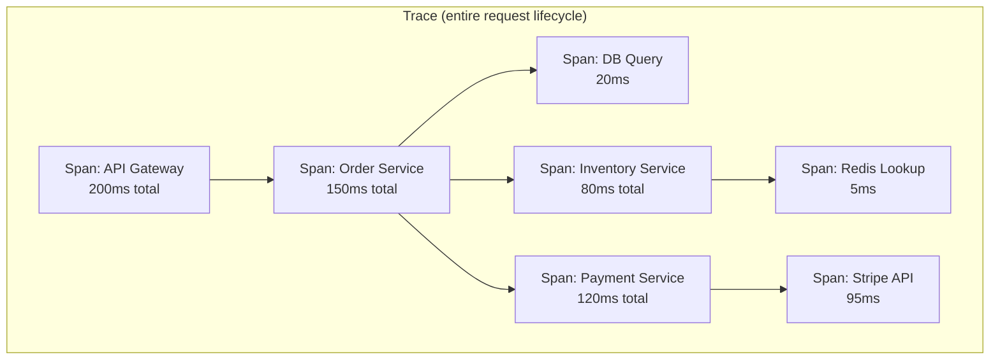
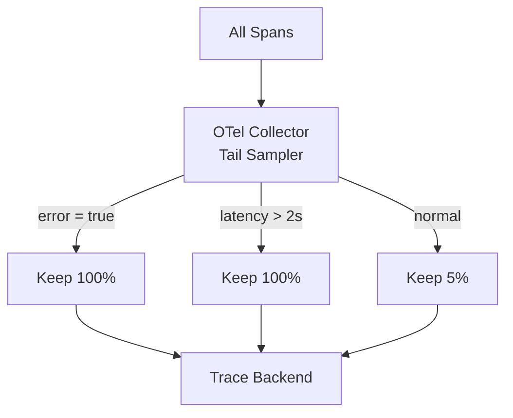
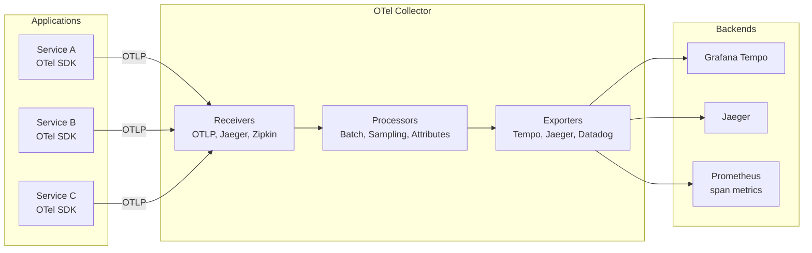

# Distributed Tracing

In a monolith, a stack trace tells you everything: which function called which, how long each took, and where an error originated. In microservices, a single user request may traverse 10+ services across multiple networks, languages, and teams. A stack trace in one service shows only a fragment. Distributed tracing reconstructs the full picture — a tree of spans representing every service call, database query, and queue message in the lifecycle of a request.

Without tracing, debugging a slow request in a microservices architecture is guesswork. With tracing, you open a waterfall diagram and immediately see: "The Order Service took 50ms, but it waited 800ms for the Inventory Service, which was blocked on a database lock."

**Related**: [Service Mesh](/architecture-patterns/microservices/service-mesh) | [Communication Patterns](/architecture-patterns/microservices/communication-patterns) | [Continuous Profiling](/performance/profiling/continuous-profiling)

---

## Core Concepts

### Traces, Spans, and Context



| Concept | Definition |
|---------|-----------|
| **Trace** | The entire journey of a request, identified by a unique `trace_id` |
| **Span** | A single unit of work (service call, DB query, function execution) |
| **Parent span** | The span that initiated this span |
| **Root span** | The first span in the trace (no parent) |
| **Span context** | The metadata propagated between services (`trace_id`, `span_id`, `trace_flags`) |
| **Baggage** | User-defined key-value pairs propagated with the trace context |

### The Waterfall View

```
Trace ID: abc123def456

Service           Span                 Duration    Timeline
──────────────────────────────────────────────────────────────
API Gateway       handle-request       200ms       ████████████████████
  Order Service   create-order         150ms        ███████████████
    PostgreSQL    INSERT orders         20ms         ██
    Inventory     check-stock           80ms          ████████
      Redis       GET inventory:sku     5ms           █
    Payment       charge-card          120ms              ████████████
      Stripe      POST /charges         95ms               █████████
```

This waterfall immediately reveals that the Payment Service (120ms, with 95ms in Stripe) is the latency bottleneck — not your code.

---

## W3C Trace Context Standard

The W3C Trace Context specification defines how trace context is propagated between services via HTTP headers. It replaced vendor-specific headers (Zipkin's `X-B3-*`, Jaeger's `uber-trace-id`) with a universal standard.

### The Headers

```http
traceparent: 00-4bf92f3577b34da6a3ce929d0e0e4736-00f067aa0ba902b7-01
tracestate: vendor1=value1,vendor2=value2
```

#### `traceparent` Format

```
00-4bf92f3577b34da6a3ce929d0e0e4736-00f067aa0ba902b7-01
│   │                                │                  │
│   │                                │                  └─ trace-flags (01 = sampled)
│   │                                └─ parent-id (8 bytes, hex)
│   └─ trace-id (16 bytes, hex)
└─ version (always 00)
```

#### `tracestate` Format

Vendor-specific data that rides along with the trace. Each vendor adds its own key-value pair:

```http
tracestate: dd=s:1;o:rum,rojo=t61rcWkgMzE
```

### Context Propagation in Code

```typescript
// OpenTelemetry handles this automatically, but understanding the mechanism:

// Outgoing request — inject context into headers
async function callOrderService(orderId: string, parentContext: Context): Promise<Order> {
  const headers: Record<string, string> = {};
  propagator.inject(parentContext, headers, {
    set: (carrier, key, value) => { carrier[key] = value; },
  });

  // Headers now contain traceparent and tracestate
  return fetch(`http://order-service/orders/${orderId}`, { headers });
}

// Incoming request — extract context from headers
function handleRequest(req: Request): Context {
  return propagator.extract(ROOT_CONTEXT, req.headers, {
    get: (carrier, key) => carrier[key],
    keys: (carrier) => Object.keys(carrier),
  });
}
```

---

## OpenTelemetry Instrumentation

OpenTelemetry (OTel) is the standard for telemetry instrumentation. It provides SDKs for all major languages and auto-instrumentation for common frameworks.

### Node.js Setup

```typescript
// tracing.ts — initialize before any other imports
import { NodeSDK } from '@opentelemetry/sdk-node';
import { OTLPTraceExporter } from '@opentelemetry/exporter-trace-otlp-http';
import { getNodeAutoInstrumentations } from '@opentelemetry/auto-instrumentations-node';
import { Resource } from '@opentelemetry/resources';
import { ATTR_SERVICE_NAME, ATTR_SERVICE_VERSION } from '@opentelemetry/semantic-conventions';

const sdk = new NodeSDK({
  resource: new Resource({
    [ATTR_SERVICE_NAME]: 'order-service',
    [ATTR_SERVICE_VERSION]: process.env.APP_VERSION ?? '0.0.0',
  }),
  traceExporter: new OTLPTraceExporter({
    url: 'http://otel-collector:4318/v1/traces',
  }),
  instrumentations: [
    getNodeAutoInstrumentations({
      // Auto-instrument HTTP, Express, pg, Redis, etc.
      '@opentelemetry/instrumentation-http': {
        ignoreIncomingRequestHook: (req) => req.url === '/health',
      },
      '@opentelemetry/instrumentation-pg': {
        enhancedDatabaseReporting: true,
      },
    }),
  ],
});

sdk.start();
process.on('SIGTERM', () => sdk.shutdown());
```

### Custom Spans

```typescript
import { trace, SpanStatusCode } from '@opentelemetry/api';

const tracer = trace.getTracer('order-service');

async function processOrder(orderId: string): Promise<Order> {
  return tracer.startActiveSpan('process-order', async (span) => {
    try {
      span.setAttribute('order.id', orderId);

      // Nested span for inventory check
      const stock = await tracer.startActiveSpan('check-inventory', async (childSpan) => {
        const result = await inventoryService.checkStock(orderId);
        childSpan.setAttribute('inventory.available', result.available);
        childSpan.end();
        return result;
      });

      if (!stock.available) {
        span.setStatus({ code: SpanStatusCode.ERROR, message: 'Out of stock' });
        throw new Error('Out of stock');
      }

      // Nested span for payment
      const payment = await tracer.startActiveSpan('charge-payment', async (childSpan) => {
        const result = await paymentService.charge(orderId);
        childSpan.setAttribute('payment.amount', result.amount);
        childSpan.setAttribute('payment.currency', result.currency);
        childSpan.end();
        return result;
      });

      span.setStatus({ code: SpanStatusCode.OK });
      return { orderId, payment, stock };
    } catch (err) {
      span.recordException(err as Error);
      span.setStatus({ code: SpanStatusCode.ERROR, message: (err as Error).message });
      throw err;
    } finally {
      span.end();
    }
  });
}
```

### Go Setup

```go
package main

import (
    "context"
    "go.opentelemetry.io/otel"
    "go.opentelemetry.io/otel/exporters/otlp/otlptrace/otlptracehttp"
    "go.opentelemetry.io/otel/sdk/resource"
    sdktrace "go.opentelemetry.io/otel/sdk/trace"
    semconv "go.opentelemetry.io/otel/semconv/v1.24.0"
)

func initTracer() (*sdktrace.TracerProvider, error) {
    exporter, err := otlptracehttp.New(context.Background(),
        otlptracehttp.WithEndpoint("otel-collector:4318"),
        otlptracehttp.WithInsecure(),
    )
    if err != nil {
        return nil, err
    }

    tp := sdktrace.NewTracerProvider(
        sdktrace.WithBatcher(exporter),
        sdktrace.WithResource(resource.NewWithAttributes(
            semconv.SchemaURL,
            semconv.ServiceNameKey.String("order-service"),
            semconv.ServiceVersionKey.String("1.2.3"),
        )),
        sdktrace.WithSampler(sdktrace.TraceIDRatioBased(0.1)), // 10% sampling
    )

    otel.SetTracerProvider(tp)
    return tp, nil
}
```

---

## Sampling Strategies

At high throughput, tracing every request is prohibitively expensive. Sampling reduces cost while maintaining observability.

### Head-Based Sampling

The sampling decision is made at the start of the trace (at the root span). All downstream services respect this decision.

```mermaid
graph LR
    REQ[Request] --> DECISION{Sample?}
    DECISION -->|10% chance| SAMPLED[Trace collected]
    DECISION -->|90% chance| DROPPED[Trace dropped]
    SAMPLED --> S1[Service A] --> S2[Service B] --> S3[Service C]
    Note over S1,S3: All services record spans<br/>because root decided to sample
```

| Strategy | Description | Use Case |
|----------|-------------|----------|
| `AlwaysOn` | Sample 100% | Development, low-traffic services |
| `AlwaysOff` | Sample 0% | Disabled |
| `TraceIDRatioBased(0.1)` | Sample 10% based on trace ID | Production default |
| `ParentBased` | Respect parent's sampling decision | Downstream services |

### Tail-Based Sampling

The sampling decision is made **after** the trace completes, based on its characteristics. This captures all interesting traces (errors, slow requests) while dropping boring ones.



```yaml
# OTel Collector config — tail-based sampling
processors:
  tail_sampling:
    decision_wait: 30s  # Wait for all spans to arrive
    policies:
      - name: errors
        type: status_code
        status_code: { status_codes: [ERROR] }
      - name: slow-requests
        type: latency
        latency: { threshold_ms: 2000 }
      - name: default
        type: probabilistic
        probabilistic: { sampling_percentage: 5 }
```

::: warning Tail Sampling Trade-offs
- **Pro**: Captures 100% of errors and slow requests (the traces you actually need)
- **Con**: Requires buffering all spans until the trace completes (memory-intensive)
- **Con**: Multi-collector setups need all spans from a trace to reach the same collector (use trace-ID-based routing)
:::

---

## Tracing Backends

| Backend | Storage | Query | Hosted Option | Best For |
|---------|---------|-------|---------------|----------|
| **Jaeger** | Cassandra, Elasticsearch, Kafka | Good | Managed by some vendors | Standalone tracing |
| **Grafana Tempo** | Object storage (S3, GCS) | Excellent (TraceQL) | Grafana Cloud | Cost-effective at scale |
| **Zipkin** | Cassandra, Elasticsearch, MySQL | Basic | No | Simple setups |
| **AWS X-Ray** | Managed | Good | AWS | AWS-native apps |
| **Datadog APM** | Managed | Excellent | Datadog | Full-stack observability |

### The OTel Collector Architecture



::: tip The Collector as a Decoupling Layer
The OTel Collector decouples your application instrumentation from your backend choice. You can switch from Jaeger to Tempo without changing any application code — just update the Collector's exporter config.
:::

---

## Trace-Based Testing

Use recorded traces to verify system behavior in integration tests.

```typescript
// Test: verify that order creation produces expected trace structure
describe('Order creation trace', () => {
  it('should call inventory and payment services', async () => {
    // 1. Create order (traces are exported to in-memory exporter)
    await createOrder({ productId: 'prod-1', quantity: 2 });

    // 2. Retrieve recorded spans
    const spans = inMemoryExporter.getFinishedSpans();

    // 3. Verify trace structure
    const rootSpan = spans.find(s => s.name === 'POST /api/orders');
    expect(rootSpan).toBeDefined();
    expect(rootSpan!.status.code).toBe(SpanStatusCode.OK);

    // 4. Verify downstream calls
    const inventorySpan = spans.find(s => s.name === 'check-inventory');
    expect(inventorySpan).toBeDefined();
    expect(inventorySpan!.parentSpanId).toBe(rootSpan!.spanContext().spanId);

    const paymentSpan = spans.find(s => s.name === 'charge-payment');
    expect(paymentSpan).toBeDefined();
    expect(paymentSpan!.attributes['payment.amount']).toBeGreaterThan(0);

    // 5. Verify no unexpected service calls
    const externalCalls = spans.filter(s =>
      s.attributes['http.url']?.toString().includes('external')
    );
    expect(externalCalls).toHaveLength(0);
  });
});
```

### Contract Testing with Traces

Verify that service interactions match expected patterns:

```typescript
class TraceContractVerifier {
  verify(traces: Span[], contract: TraceContract): VerificationResult {
    const errors: string[] = [];

    for (const expected of contract.expectedSpans) {
      const matching = traces.filter(s => s.name === expected.name);

      if (matching.length === 0) {
        errors.push(`Expected span "${expected.name}" not found`);
        continue;
      }

      if (expected.maxDuration) {
        const slow = matching.filter(s => s.duration > expected.maxDuration!);
        if (slow.length > 0) {
          errors.push(`Span "${expected.name}" exceeded max duration: ${slow[0].duration}ms > ${expected.maxDuration}ms`);
        }
      }

      if (expected.requiredAttributes) {
        for (const attr of expected.requiredAttributes) {
          const missing = matching.filter(s => !s.attributes[attr]);
          if (missing.length > 0) {
            errors.push(`Span "${expected.name}" missing required attribute: ${attr}`);
          }
        }
      }
    }

    return { passed: errors.length === 0, errors };
  }
}
```

---

## Production Rollout Checklist

| Step | Action | Why |
|------|--------|-----|
| 1 | Start with auto-instrumentation only | Zero code changes, immediate value |
| 2 | Deploy OTel Collector as a sidecar or DaemonSet | Decouples apps from backend |
| 3 | Set sampling to 10% head-based | Control costs |
| 4 | Add custom spans to critical paths | Better resolution on hot paths |
| 5 | Add tail-based sampling for errors | Never miss error traces |
| 6 | Integrate with Grafana/dashboards | Correlate metrics + traces |
| 7 | Add trace IDs to log output | Connect logs to traces |
| 8 | Set up trace-based alerts | Alert on latency anomalies |

### Connecting Traces to Logs

```typescript
import { trace } from '@opentelemetry/api';

function logger(message: string, data?: Record<string, unknown>): void {
  const span = trace.getActiveSpan();
  const traceId = span?.spanContext().traceId ?? 'no-trace';
  const spanId = span?.spanContext().spanId ?? 'no-span';

  console.log(JSON.stringify({
    message,
    traceId,      // Links this log to the trace
    spanId,
    timestamp: new Date().toISOString(),
    ...data,
  }));
}
```

::: tip The Three Pillars, Connected
The goal is to move seamlessly between signals:
1. **Metric alert fires** (p99 latency > 500ms)
2. **Click through to exemplar traces** (specific slow requests)
3. **Click through to logs** within those traces (error messages, stack traces)
4. **Click through to profiles** (why is this function slow?)

This requires consistent `trace_id` across all three signals.
:::

---

## Summary

| Aspect | Detail |
|--------|--------|
| Standard | W3C Trace Context (`traceparent` header) |
| Instrumentation | OpenTelemetry SDK (auto + manual) |
| Propagation | HTTP headers, gRPC metadata, message queue attributes |
| Sampling | Head-based (10% ratio) + tail-based (100% errors/slow) |
| Backends | Tempo (cost-effective), Jaeger (standalone), Datadog (managed) |
| Collector | OTel Collector — decouples instrumentation from backend |
| Key integration | Trace ID in logs, metrics exemplars, profile tags |
| Testing | Trace-based assertions, contract verification |

**Related**: [Service Mesh](/architecture-patterns/microservices/service-mesh) | [Continuous Profiling](/performance/profiling/continuous-profiling) | [Structured Logging](/devops/logging/structured-logging) | [Correlation IDs](/devops/logging/correlation-ids)
