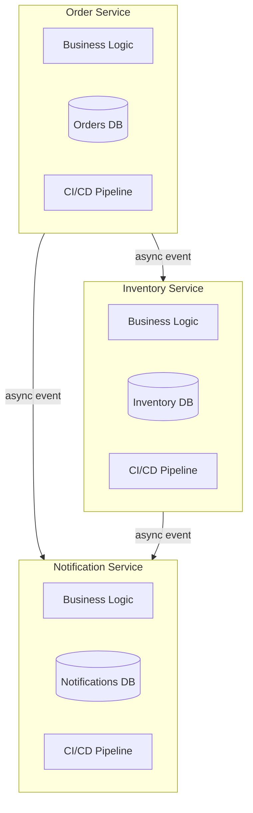
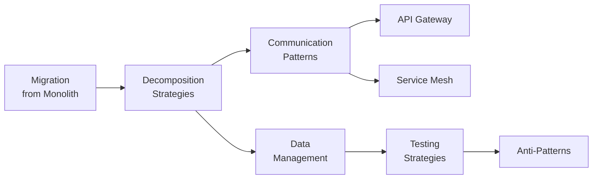

# Microservices Architecture

Microservices is a deployment and team-scaling strategy that decomposes a system into independently deployable services, each owning a bounded slice of business capability. It is not a silver bullet, it is not about having small services, and it is emphatically not about technology choices. Microservices is a response to a specific organizational problem: how do you let multiple teams ship independently without stepping on each other?

The term was popularized by James Lewis and Martin Fowler in 2014, but the ideas behind it trace back to Unix philosophy ("do one thing well"), SOA (service-oriented architecture), and Conway's Law. What microservices added was the emphasis on independent deployability, team ownership, and decentralized data management.

## Why Microservices Exist

Every successful software system eventually hits a scaling wall — not a technical scaling wall but an organizational one. When you have 5 engineers working on a monolith, everyone understands the whole codebase, merge conflicts are manageable, and deploys are straightforward. When you have 50 engineers on the same monolith, you get:

- **Merge conflicts** on every pull request because everyone touches shared code
- **Deploy fear** because any change might break an unrelated feature
- **Long build times** because the entire system must compile and test
- **Team coupling** because teams cannot release without coordinating with every other team
- **Knowledge silos** because nobody can understand the whole system anymore

Microservices solve these problems by giving each team a service they own completely — their own codebase, their own database, their own deploy pipeline, their own on-call rotation. The team can ship features without coordinating with anyone else, as long as they honor their API contract.

## When Microservices Are the Right Choice

Microservices are appropriate when ALL of the following conditions hold:

1. **You have multiple teams** (typically 20+ engineers) that need to ship independently
2. **Your domain boundaries are well-understood** — you know where the seams are
3. **Different parts of the system have different scaling requirements** — the search service needs 50 instances while the billing service needs 3
4. **Different parts of the system have different change velocities** — the recommendation engine changes daily while the payment integration changes quarterly
5. **You have the operational maturity** to run distributed systems — monitoring, alerting, distributed tracing, CI/CD for dozens of services
6. **You can tolerate eventual consistency** for most cross-service operations

## When Microservices Are the Wrong Choice

Do not adopt microservices when:

- **You have fewer than 10 engineers.** The operational overhead will consume more engineering time than you save from independent deployment. A well-structured monolith is dramatically simpler.
- **Your domain boundaries are unclear.** If you don't know where to draw the lines, you will draw them wrong, and moving logic between microservices is orders of magnitude harder than moving logic between modules in a monolith.
- **You are an early-stage startup.** Your business model will pivot. Your domain model will change radically. Microservices make pivoting extremely expensive because every boundary change requires rewriting service APIs, migrating data, and updating communication patterns.
- **Your team lacks operational maturity.** If you do not have monitoring, CI/CD, and distributed tracing, microservices will make your system less reliable, not more.
- **Strong consistency is required across most operations.** Microservices push you toward eventual consistency. If your domain requires most operations to be strongly consistent across multiple entities, a monolith with a single database is dramatically simpler.

::: info War Story
A fintech startup I consulted for adopted microservices at 8 engineers because "that's what Netflix does." They had 12 services, each owned by 0.67 engineers on average. Nobody could run the full system locally. Integration tests took 45 minutes because they required spinning up all 12 services. A single feature that touched 3 services required coordinating PRs across 3 repos, deploying in a specific order, and hoping the timing worked. After a year of pain, they consolidated back to a modular monolith with clear internal boundaries. Their deployment frequency went from twice a month to twice a day. The lesson: microservices are a scaling strategy, not a starting architecture.
:::

## The Key Characteristics



Each service has:

| Characteristic | What It Means |
|---|---|
| **Own codebase** | Separate repository or independent module in a monorepo |
| **Own data store** | No shared databases — each service owns its data |
| **Own deploy pipeline** | Can deploy without coordinating with other services |
| **Own team** | A single team owns the service end-to-end (dev, test, ops) |
| **API contract** | Communicates with other services only through well-defined APIs |
| **Independent scaling** | Can scale horizontally without scaling other services |

## Concept Map



## Section Contents

| Page | What You Will Learn |
|---|---|
| [Decomposition Strategies](./decomposition-strategies) | How to identify service boundaries — by business capability, by subdomain, strangler fig, branch by abstraction |
| [Communication Patterns](./communication-patterns) | Sync vs async, REST vs gRPC vs GraphQL, choreography vs orchestration, resilience patterns |
| [API Gateway Pattern](./api-gateway-pattern) | Gateway responsibilities, BFF pattern, rate limiting, auth, implementation |
| [Service Mesh](./service-mesh) | Sidecar proxy, data plane vs control plane, Istio, Linkerd, mTLS |
| [Data Management](./data-management) | Database per service, saga pattern, CQRS, event-driven data sync |
| [Testing Strategies](./testing-strategies) | Contract testing, component testing, testing pyramid for microservices |
| [Migration from Monolith](./migration-from-monolith) | Strangler fig implementation, identifying seams, data migration |
| [Anti-Patterns](./anti-patterns) | Distributed monolith, nano-services, chatty services, and other traps |

## Decision Checklist

Before adopting microservices, score your organization on each criterion:

```
[ ] We have 20+ engineers or expect to reach that within 12 months
[ ] Our domain boundaries are well-understood (we have a domain model)
[ ] We have CI/CD for automated deployments
[ ] We have centralized logging and monitoring
[ ] We have distributed tracing (or will implement it before going live)
[ ] We have a container orchestration platform (Kubernetes, ECS, etc.)
[ ] We are comfortable with eventual consistency for most operations
[ ] Each proposed service can be owned by a single team (2-8 people)
[ ] We have defined API versioning and deprecation policies
[ ] Our team has experience operating distributed systems

Score: ___/10

8-10: Microservices are likely a good fit
5-7:  Consider a modular monolith first, plan for microservices later
0-4:  A monolith will serve you better — focus on clean internal architecture
```

Start with the decomposition strategies page to learn how to identify the right service boundaries.
