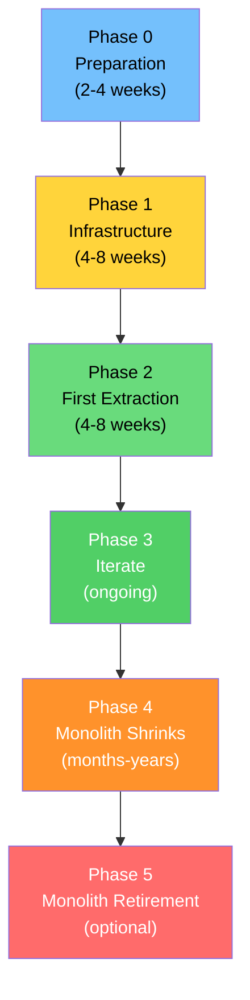
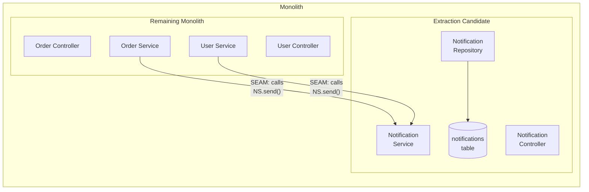
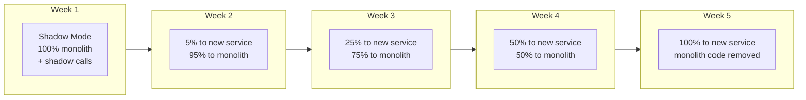
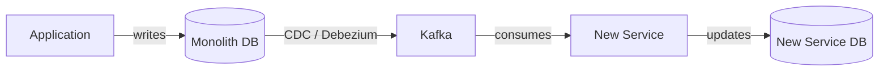

# Migration from Monolith to Microservices

Migrating from a monolith to microservices is not a technical project — it is an organizational transformation that happens to require technical work. The migration will take months or years, it will coexist with feature development, and it must be done incrementally with zero downtime. There is no big-bang cutover. Every step must be reversible.

This page is the tactical guide: how to identify extraction candidates, how to separate data, how to route traffic, and how to avoid the pitfalls that cause most migrations to fail.

## Why Most Migrations Fail — First Principles

The three most common failure modes:

### 1. Big-Bang Rewrite

Attempting to rewrite the entire monolith as microservices from scratch. This fails because:
- The rewrite takes 12-18 months during which no features are shipped
- The team must maintain both systems simultaneously
- Requirements change during the rewrite, making the new system obsolete before it launches
- The rewrite team lacks the domain knowledge embedded in the monolith's code

### 2. Extracting the Wrong Service First

Starting with the most complex, most coupled, or most critical part of the system. This fails because:
- High coupling means you must change dozens of call sites in the monolith
- Data migration is complex and risky
- The team has not built the operational maturity needed for distributed systems
- If the first extraction fails, it discourages the entire effort

### 3. Extracting Without Addressing Data

Extracting the service code but leaving it connected to the monolith's database. This creates a distributed monolith — the service cannot deploy independently because it shares a schema with the monolith.

## The Migration Framework



## Phase 0: Preparation

Before writing any code, you need to understand your monolith's structure and identify extraction candidates.

### Step 1: Map the Domain

Use Event Storming or domain analysis to understand the monolith's bounded contexts. Map which modules talk to which, and how tightly they are coupled.

```typescript
// Tools like Madge (JavaScript), Lattix (Java), or custom dependency analysis
// can generate dependency maps

// Example: Analyzing module coupling in a Node.js monolith
interface ModuleDependency {
  from: string;        // Module that depends
  to: string;          // Module depended upon
  type: 'import' | 'database' | 'event' | 'shared-state';
  frequency: number;   // How often this dependency is exercised (requests/hour)
}

// Results of analysis:
const dependencies: ModuleDependency[] = [
  { from: 'orders',        to: 'products',      type: 'import',   frequency: 5000 },
  { from: 'orders',        to: 'users',         type: 'import',   frequency: 5000 },
  { from: 'orders',        to: 'inventory',     type: 'database', frequency: 5000 },
  { from: 'orders',        to: 'payments',      type: 'import',   frequency: 3000 },
  { from: 'orders',        to: 'notifications', type: 'import',   frequency: 2000 },
  { from: 'search',        to: 'products',      type: 'database', frequency: 50000 },
  { from: 'recommendations', to: 'orders',      type: 'database', frequency: 10000 },
  { from: 'recommendations', to: 'products',    type: 'database', frequency: 10000 },
  { from: 'notifications', to: 'users',         type: 'import',   frequency: 8000 },
  { from: 'reports',       to: 'orders',        type: 'database', frequency: 100 },
  { from: 'reports',       to: 'payments',      type: 'database', frequency: 100 },
];
```

### Step 2: Score Extraction Candidates

Rate each module on four axes:

```typescript
interface ExtractionCandidate {
  module: string;
  scores: {
    coupling: number;     // 1 (tightly coupled) to 5 (loosely coupled)
    complexity: number;   // 1 (very complex) to 5 (simple)
    businessValue: number; // 1 (low value from extraction) to 5 (high value)
    risk: number;         // 1 (high risk) to 5 (low risk)
  };
  totalScore: number;     // Sum of scores
  recommendation: 'extract-first' | 'extract-later' | 'keep-in-monolith';
}

const candidates: ExtractionCandidate[] = [
  {
    module: 'notifications',
    scores: { coupling: 5, complexity: 4, businessValue: 3, risk: 5 },
    totalScore: 17,
    recommendation: 'extract-first',
    // Low coupling (other modules call it but it doesn't call them)
    // Simple (just sends emails/SMS)
    // Moderate business value (independent scaling)
    // Low risk (failure = delayed notification, not data loss)
  },
  {
    module: 'search',
    scores: { coupling: 4, complexity: 3, businessValue: 4, risk: 4 },
    totalScore: 15,
    recommendation: 'extract-first',
    // Low coupling (reads data but doesn't write to shared tables)
    // Moderate complexity (search indexing, relevance scoring)
    // High business value (needs independent scaling)
    // Moderate risk (search downtime is visible but not critical)
  },
  {
    module: 'orders',
    scores: { coupling: 1, complexity: 1, businessValue: 5, risk: 1 },
    totalScore: 8,
    recommendation: 'extract-later',
    // Very high coupling (everything depends on orders)
    // Very complex (transactions, inventory, payments, shipping)
    // Very high business value (core business capability)
    // Very high risk (order flow is revenue-critical)
  },
  {
    module: 'reports',
    scores: { coupling: 4, complexity: 3, businessValue: 2, risk: 5 },
    totalScore: 14,
    recommendation: 'extract-first',
    // Low coupling (reads data, doesn't write)
    // Moderate complexity (aggregations, joins)
    // Low business value (internal tool)
    // Low risk (report delay is acceptable)
  },
];

// Sort by total score descending — highest score = best candidate to extract first
candidates.sort((a, b) => b.totalScore - a.totalScore);
```

### Step 3: Identify Seams

A seam is a place in the monolith where you can cleanly separate functionality. Look for:

- **Module boundaries** — directories, packages, namespaces that already separate concerns
- **Database table ownership** — tables that are only written by one module
- **API boundaries** — URL prefixes that map to a single module
- **Event flows** — places where one module triggers another through a queue or event



The seam is the interface between the Notification module and its callers. If that interface is clean (a few well-defined methods), extraction is straightforward. If callers reach into Notification internals (direct database queries, shared data structures), you must first refactor the seam.

## Phase 1: Infrastructure

Before extracting any service, build the infrastructure that all microservices will need.

### Required Infrastructure Checklist

```
[ ] Container orchestration (Kubernetes, ECS)
[ ] Container registry (ECR, GCR, Docker Hub)
[ ] CI/CD pipeline for building and deploying individual services
[ ] Service discovery (Kubernetes DNS, Consul)
[ ] API Gateway or reverse proxy
[ ] Centralized logging (ELK, Datadog, Grafana Loki)
[ ] Distributed tracing (Jaeger, Zipkin, Datadog APT)
[ ] Metrics and monitoring (Prometheus + Grafana, Datadog)
[ ] Message broker (Kafka, RabbitMQ) if using async communication
[ ] Secret management (Vault, AWS Secrets Manager)
```

### Build the Strangler Facade

The facade sits in front of the monolith and routes requests. Initially, it routes everything to the monolith. As services are extracted, it routes specific paths to the new services.

```typescript
// strangler-facade/src/router.ts

interface ServiceRoute {
  pathPrefix: string;
  target: string;
  isExtracted: boolean;
  featureFlag?: string;     // Optional feature flag for gradual rollout
}

class StranglerRouter {
  private routes: ServiceRoute[] = [];

  constructor(
    private readonly monolithUrl: string,
    private readonly featureFlagClient: FeatureFlagClient,
  ) {}

  addRoute(route: ServiceRoute): void {
    this.routes.push(route);
    // Sort by path length descending so more specific paths match first
    this.routes.sort((a, b) => b.pathPrefix.length - a.pathPrefix.length);
  }

  async resolveTarget(path: string, context: RequestContext): Promise<string> {
    for (const route of this.routes) {
      if (path.startsWith(route.pathPrefix)) {
        if (!route.isExtracted) {
          return this.monolithUrl;
        }

        // Check feature flag for gradual rollout
        if (route.featureFlag) {
          const isEnabled = await this.featureFlagClient.isEnabled(
            route.featureFlag,
            {
              userId: context.userId,
              percentage: context.rolloutPercentage,
            },
          );

          if (!isEnabled) {
            return this.monolithUrl; // Fall back to monolith
          }
        }

        return route.target;
      }
    }

    // Default: monolith handles everything not explicitly routed
    return this.monolithUrl;
  }
}

// Configuration
const router = new StranglerRouter('http://monolith:3000', featureFlagClient);

router.addRoute({
  pathPrefix: '/api/notifications',
  target: 'http://notification-service:3010',
  isExtracted: true,
  featureFlag: 'use-notification-service', // Gradual rollout
});

router.addRoute({
  pathPrefix: '/api/search',
  target: 'http://search-service:3011',
  isExtracted: true,
  // No feature flag — fully migrated
});

router.addRoute({
  pathPrefix: '/api/orders',
  target: 'http://monolith:3000',
  isExtracted: false, // Still in monolith
});
```

## Phase 2: First Extraction — Detailed Walkthrough

Let's walk through extracting the Notification service from a monolith step by step.

### Step 1: Create the Abstraction in the Monolith

Before extracting any code, create an interface within the monolith that isolates the notification functionality.

```typescript
// monolith/src/notifications/NotificationService.interface.ts

export interface NotificationService {
  sendOrderConfirmation(params: {
    orderId: string;
    customerEmail: string;
    customerName: string;
    orderTotal: number;
    items: Array<{ name: string; quantity: number; price: number }>;
  }): Promise<void>;

  sendShipmentNotification(params: {
    orderId: string;
    customerEmail: string;
    trackingNumber: string;
    carrier: string;
  }): Promise<void>;

  sendPasswordReset(params: {
    email: string;
    resetToken: string;
    expiresAt: Date;
  }): Promise<void>;
}
```

### Step 2: Refactor All Callers to Use the Interface

```typescript
// monolith/src/orders/OrderHandler.ts — BEFORE
class OrderHandler {
  async placeOrder(order: Order): Promise<void> {
    await this.orderRepo.save(order);
    // Direct dependency on email implementation details
    await this.emailClient.send(order.customer.email, 'Order Confirmed', renderTemplate('order-confirmation', order));
    await this.smsClient.send(order.customer.phone, `Order ${order.id} confirmed`);
  }
}

// monolith/src/orders/OrderHandler.ts — AFTER
class OrderHandler {
  constructor(
    private readonly orderRepo: OrderRepository,
    private readonly notifications: NotificationService, // Uses the interface
  ) {}

  async placeOrder(order: Order): Promise<void> {
    await this.orderRepo.save(order);
    await this.notifications.sendOrderConfirmation({
      orderId: order.id,
      customerEmail: order.customer.email,
      customerName: order.customer.name,
      orderTotal: order.totalAmount,
      items: order.items.map(i => ({ name: i.name, quantity: i.quantity, price: i.unitPrice })),
    });
  }
}
```

### Step 3: Create Two Implementations

```typescript
// monolith/src/notifications/InProcessNotificationService.ts
// The existing logic, wrapped in the interface

export class InProcessNotificationService implements NotificationService {
  constructor(
    private readonly emailClient: EmailClient,
    private readonly smsClient: SmsClient,
    private readonly templateRenderer: TemplateRenderer,
  ) {}

  async sendOrderConfirmation(params: OrderConfirmationParams): Promise<void> {
    const html = await this.templateRenderer.render('order-confirmation', params);
    await this.emailClient.send(params.customerEmail, 'Order Confirmed', html);
  }

  // ... other methods
}

// monolith/src/notifications/RemoteNotificationService.ts
// Calls the new microservice via HTTP

export class RemoteNotificationService implements NotificationService {
  constructor(
    private readonly httpClient: HttpClient,
    private readonly serviceUrl: string,
  ) {}

  async sendOrderConfirmation(params: OrderConfirmationParams): Promise<void> {
    await this.httpClient.post(`${this.serviceUrl}/api/notifications/order-confirmation`, params, {
      timeout: 5000,
      retries: 2,
    });
  }

  // ... other methods
}
```

### Step 4: Use Feature Flags to Switch

```typescript
// monolith/src/config/serviceFactory.ts

export function createNotificationService(
  featureFlags: FeatureFlags,
  config: AppConfig,
): NotificationService {
  if (featureFlags.isEnabled('use-remote-notification-service')) {
    const remote = new RemoteNotificationService(
      new HttpClient(),
      config.notificationServiceUrl,
    );

    if (featureFlags.isEnabled('notification-service-shadow-mode')) {
      // Shadow mode: call both, use the monolith response, compare results
      return new ShadowNotificationService(
        new InProcessNotificationService(/* ... */),  // Primary
        remote,                                        // Shadow
      );
    }

    return remote;
  }

  return new InProcessNotificationService(/* ... */);
}

// Shadow mode implementation — critical for safe migration
class ShadowNotificationService implements NotificationService {
  constructor(
    private readonly primary: NotificationService,
    private readonly shadow: NotificationService,
  ) {}

  async sendOrderConfirmation(params: OrderConfirmationParams): Promise<void> {
    // Always use the primary (monolith) result
    const result = await this.primary.sendOrderConfirmation(params);

    // Fire-and-forget: also call the shadow (new service)
    // Compare results in the background
    this.shadow.sendOrderConfirmation(params)
      .then(() => {
        metrics.increment('notification_shadow.success');
      })
      .catch((error) => {
        metrics.increment('notification_shadow.failure');
        console.warn('Shadow notification failed:', error.message);
      });

    return result;
  }
}
```

### Step 5: Migrate the Data

The notification service needs its own data store for templates, notification history, and user notification preferences.

```typescript
// migration/src/NotificationDataMigrator.ts

class NotificationDataMigrator {
  constructor(
    private readonly monolithDb: DatabasePool,
    private readonly notificationDb: DatabasePool,
  ) {}

  async migrate(): Promise<MigrationResult> {
    let migratedCount = 0;
    let errorCount = 0;

    // Step 1: Migrate notification templates
    const templates = await this.monolithDb.query(
      'SELECT * FROM notification_templates ORDER BY id',
    );

    for (const template of templates.rows) {
      try {
        await this.notificationDb.query(
          `INSERT INTO templates (id, name, subject, body, channel, created_at)
           VALUES ($1, $2, $3, $4, $5, $6)
           ON CONFLICT (id) DO NOTHING`,
          [template.id, template.name, template.subject, template.body,
           template.channel, template.created_at],
        );
        migratedCount++;
      } catch (error) {
        errorCount++;
        console.error(`Failed to migrate template ${template.id}:`, error);
      }
    }

    // Step 2: Migrate notification preferences
    const preferences = await this.monolithDb.query(
      'SELECT * FROM user_notification_preferences ORDER BY user_id',
    );

    for (const pref of preferences.rows) {
      try {
        await this.notificationDb.query(
          `INSERT INTO notification_preferences (user_id, email_enabled, sms_enabled, push_enabled)
           VALUES ($1, $2, $3, $4)
           ON CONFLICT (user_id) DO NOTHING`,
          [pref.user_id, pref.email_enabled, pref.sms_enabled, pref.push_enabled],
        );
        migratedCount++;
      } catch (error) {
        errorCount++;
      }
    }

    // Step 3: Set up ongoing synchronization
    // Use CDC (Debezium) or polling to keep data in sync during the transition period
    await this.setupCDCSync('notification_templates');
    await this.setupCDCSync('user_notification_preferences');

    return { migratedCount, errorCount };
  }

  private async setupCDCSync(table: string): Promise<void> {
    // Configure Debezium connector to stream changes from monolith DB
    // to the notification service's database during the transition period
    console.log(`CDC sync configured for table: ${table}`);
  }
}
```

### Step 6: Gradual Rollout



At each stage, monitor:
- Error rate (should be equal to or lower than monolith baseline)
- Latency (p50, p99 should be comparable)
- Notification delivery rate (should not drop)
- Business metrics (customer satisfaction, support tickets about missing notifications)

### Step 7: Clean Up the Monolith

After the new service has been running at 100% for at least 2 weeks with no issues:

1. Remove the `InProcessNotificationService` implementation
2. Remove the `ShadowNotificationService`
3. Remove the feature flag
4. Keep the `NotificationService` interface and `RemoteNotificationService` — these are now the permanent integration point
5. Drop the notification tables from the monolith database (after confirming CDC is stopped)
6. Remove the notification-related dependencies from the monolith (email library, SMS library)

## The Dual-Write Problem During Migration

During migration, you often need to write data to both the monolith database and the new service's database. This creates the dual-write problem.

### The Problem

```typescript
// DANGEROUS: Writing to two databases
async function updateNotificationPreferences(userId: string, prefs: Preferences): Promise<void> {
  // Write to monolith DB
  await monolithDb.query(
    'UPDATE user_notification_preferences SET email_enabled = $1 WHERE user_id = $2',
    [prefs.emailEnabled, userId],
  );

  // CRASH POINT: If we crash here, monolith has the update but new service doesn't
  // Or the network call fails, creating data inconsistency

  // Write to new notification service
  await notificationService.updatePreferences(userId, prefs);
}
```

### Solutions

**Solution 1: Single Writer with CDC**

Only write to one database. Use change data capture to propagate changes to the other:



**Solution 2: Transactional Outbox**

Write to the monolith database and an outbox table in the same transaction. A relay publishes the outbox event to the new service.

**Solution 3: Event-Sourced Migration**

Make the monolith publish events for all changes. The new service consumes these events to build its own state.

```typescript
// Monolith publishes events for notification preference changes
class NotificationPreferencesHandler {
  async update(userId: string, prefs: Preferences): Promise<void> {
    await this.db.transaction(async (tx) => {
      // Update the database
      await tx.query(
        'UPDATE user_notification_preferences SET email_enabled = $1 WHERE user_id = $2',
        [prefs.emailEnabled, userId],
      );

      // Write event to outbox (same transaction)
      await tx.query(
        `INSERT INTO outbox (id, event_type, aggregate_id, payload)
         VALUES ($1, 'notification_preferences.updated', $2, $3)`,
        [generateUUID(), userId, JSON.stringify(prefs)],
      );
    });
  }
}
```

## Feature Flags for Migration

Feature flags are essential for making each migration step reversible. If the new service has problems, flip the flag and fall back to the monolith instantly.

```typescript
// Feature flag configuration for a typical extraction

interface MigrationFeatureFlags {
  // Phase 1: Shadow mode — call both, use monolith result
  'notification-service.shadow-mode': boolean;

  // Phase 2: Percentage rollout — gradually shift traffic
  'notification-service.rollout-percentage': number; // 0-100

  // Phase 3: Full migration — all traffic to new service
  'notification-service.fully-migrated': boolean;

  // Kill switch — immediately route everything back to monolith
  'notification-service.kill-switch': boolean;

  // Per-feature flags — migrate individual notification types separately
  'notification-service.order-confirmation': boolean;
  'notification-service.shipment-notification': boolean;
  'notification-service.password-reset': boolean;
}

class MigrationRouter {
  async shouldUseNewService(
    featureType: string,
    userId: string,
  ): Promise<boolean> {
    // Kill switch overrides everything
    if (await this.flags.isEnabled('notification-service.kill-switch')) {
      return false; // Fall back to monolith
    }

    // Check if fully migrated
    if (await this.flags.isEnabled('notification-service.fully-migrated')) {
      return true;
    }

    // Check per-feature flag
    const featureFlagKey = `notification-service.${featureType}`;
    if (await this.flags.isEnabled(featureFlagKey, { userId })) {
      return true;
    }

    // Check percentage rollout
    const percentage = await this.flags.getNumber('notification-service.rollout-percentage');
    return this.isInPercentage(userId, percentage);
  }

  private isInPercentage(userId: string, percentage: number): boolean {
    // Deterministic: same user always gets the same result for a given percentage
    const hash = hashCode(userId);
    return (hash % 100) < percentage;
  }
}
```

## Common Migration Pitfalls

### Pitfall 1: Migrating Code Without Migrating Data

If the new service still reads from the monolith's database, you have a distributed monolith with extra network hops. The data must migrate with the code.

### Pitfall 2: Not Running the Monolith and New Service in Parallel

Always run both simultaneously during migration. The monolith is your safety net. Removing it before the new service is proven in production is the highest-risk decision you can make.

### Pitfall 3: Changing Behavior During Extraction

Extract first, then refactor. If you extract the notification service AND redesign the notification templates AND add push notification support simultaneously, you cannot tell whether bugs are from the extraction or from the new features.

### Pitfall 4: Not Having a Rollback Plan

Every migration step must be instantly reversible. Feature flags enable this. If a step cannot be reversed, it is too big — break it into smaller steps.

### Pitfall 5: Ignoring Shared Libraries

Monoliths often have shared libraries that multiple modules depend on. When you extract a service, you must decide: does the library go with the service, stay in the monolith, or become a shared package? Shared packages between microservices create coupling — use them sparingly and only for truly generic utilities (logging, metrics, common data types).

::: info War Story
A large e-commerce company spent 3 years migrating from a PHP monolith to Node.js microservices. They learned several hard lessons. First, they tried to extract the order processing system first (their most complex module) and spent 6 months before abandoning the attempt due to data migration complexity. When they restarted with the notification system (their simplest module), the extraction took 4 weeks. Second, they underestimated the dual-write problem — during the migration of user profiles, they had a 48-hour period where some users' profile changes were lost because the CDC pipeline had a bug. They added shadow mode comparisons that would have caught this. Third, they discovered that their monolith had 47 direct database JOINs between the orders and products tables. Each JOIN represented a potential cross-service call in the microservices architecture. They reduced these to 3 by denormalizing order data before extracting the product service. The lesson: measure coupling before extracting, extract the easiest things first, and always have shadow mode and rollback capability.
:::

## Migration Timeline Template

| Phase | Duration | Activities | Exit Criteria |
|---|---|---|---|
| **Preparation** | 2-4 weeks | Domain mapping, candidate scoring, team alignment | Extraction candidate selected, team trained |
| **Infrastructure** | 4-8 weeks | K8s setup, CI/CD, monitoring, message broker | Can deploy and monitor a hello-world service |
| **First Extraction** | 4-8 weeks | Interface creation, implementation, data migration, shadow mode, rollout | Service at 100%, monolith code removed |
| **Second Extraction** | 2-4 weeks | Repeat with lessons learned | Faster — tooling and process are established |
| **Ongoing Extractions** | 1-3 weeks each | Progressively extract modules | Each extraction is smaller and faster |
| **Monolith Retirement** | 4-12 weeks | Remove remaining code, drop tables, shut down | Monolith is either gone or a tiny core |

## Decision Framework: When to Stop Migrating

Not everything needs to be extracted. Stop migrating when:

1. **The remaining monolith is small enough** that one team can own and maintain it
2. **The remaining modules have low change velocity** — they rarely need updates
3. **The remaining modules are tightly coupled** to each other and would require extensive refactoring to separate
4. **The cost of extraction exceeds the benefit** — the monolith is not causing team scaling problems for the remaining modules
5. **You have achieved the organizational goals** that motivated the migration — independent team deployment, independent scaling, etc.

A "residual monolith" that handles a few stable, tightly-coupled modules is a perfectly acceptable end state. Microservices are a means, not an end.
