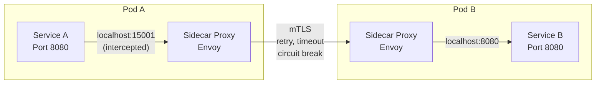
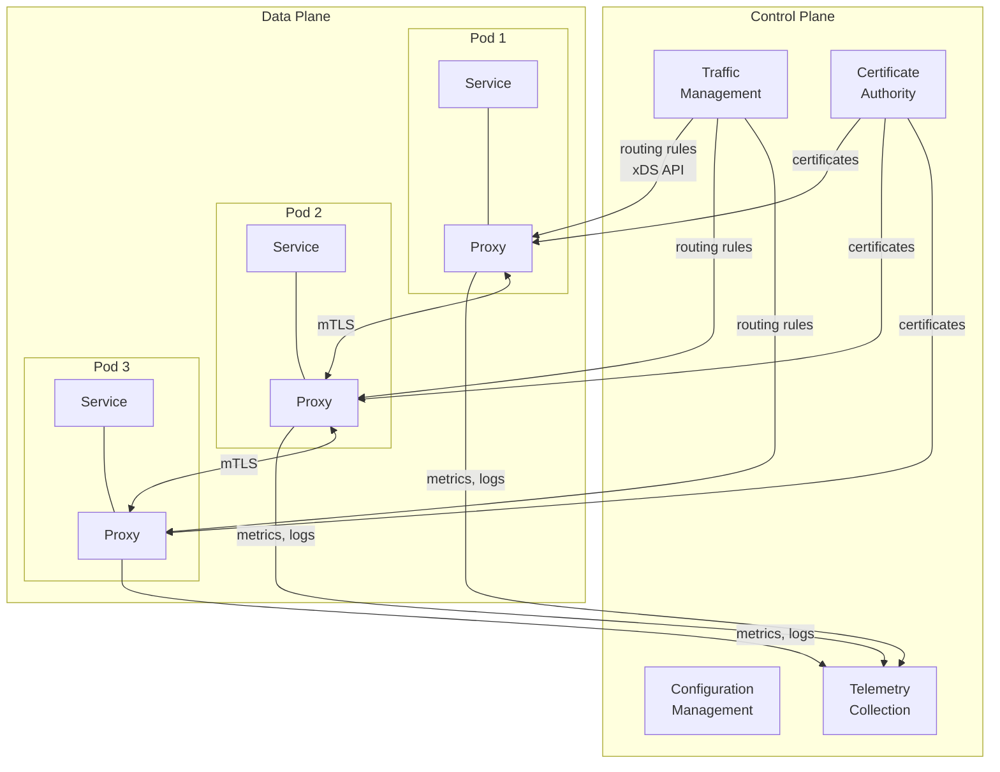
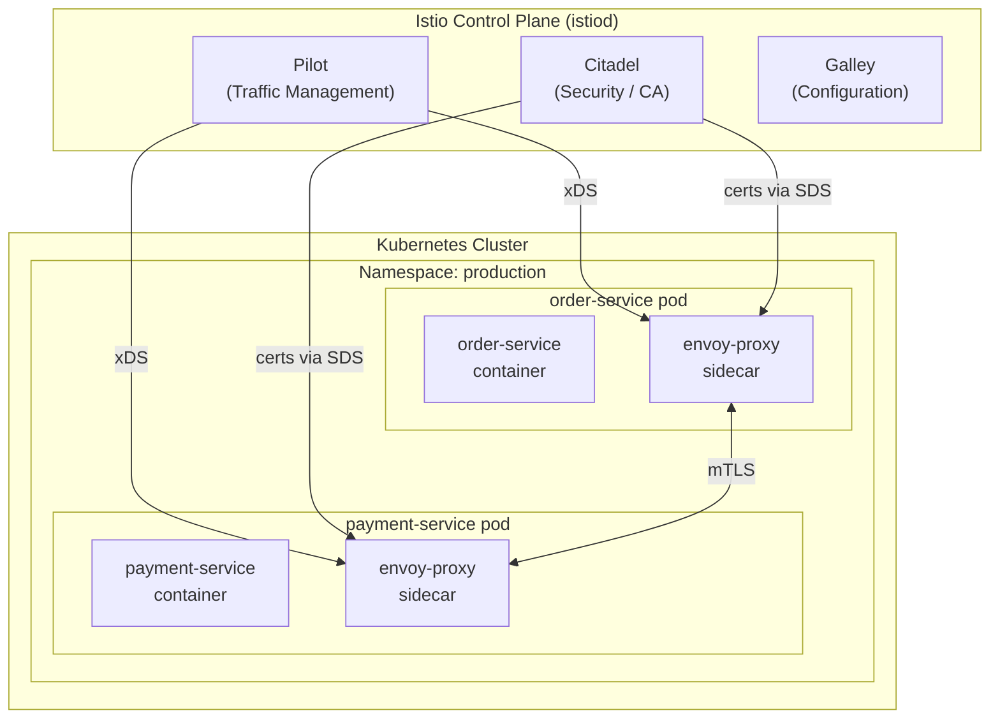
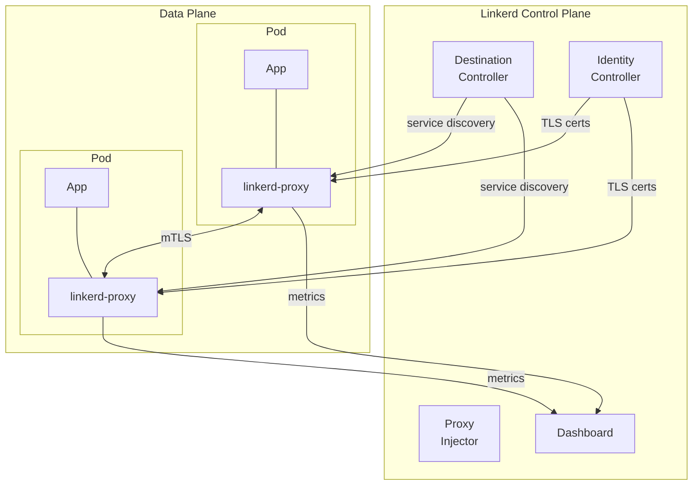
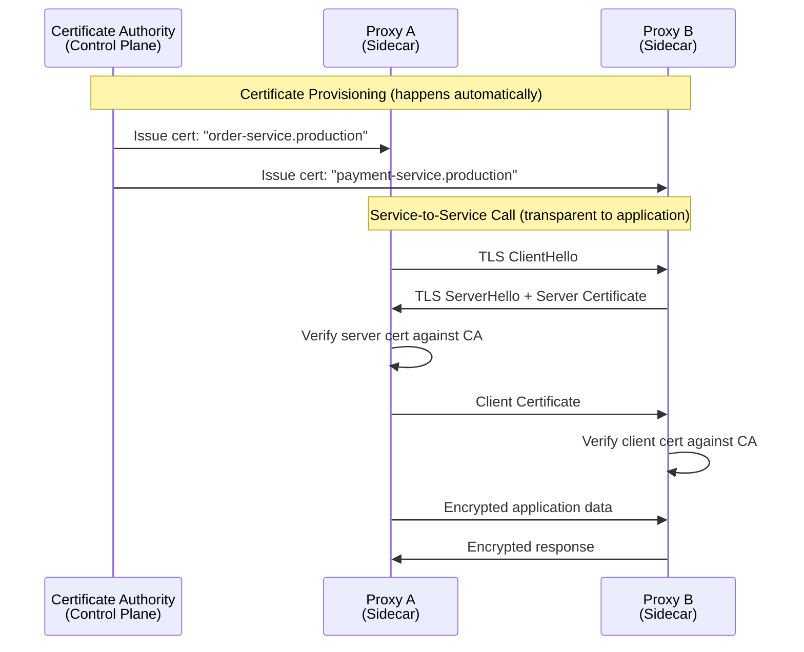
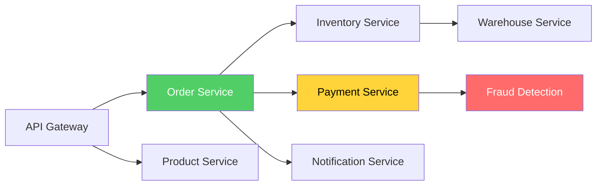
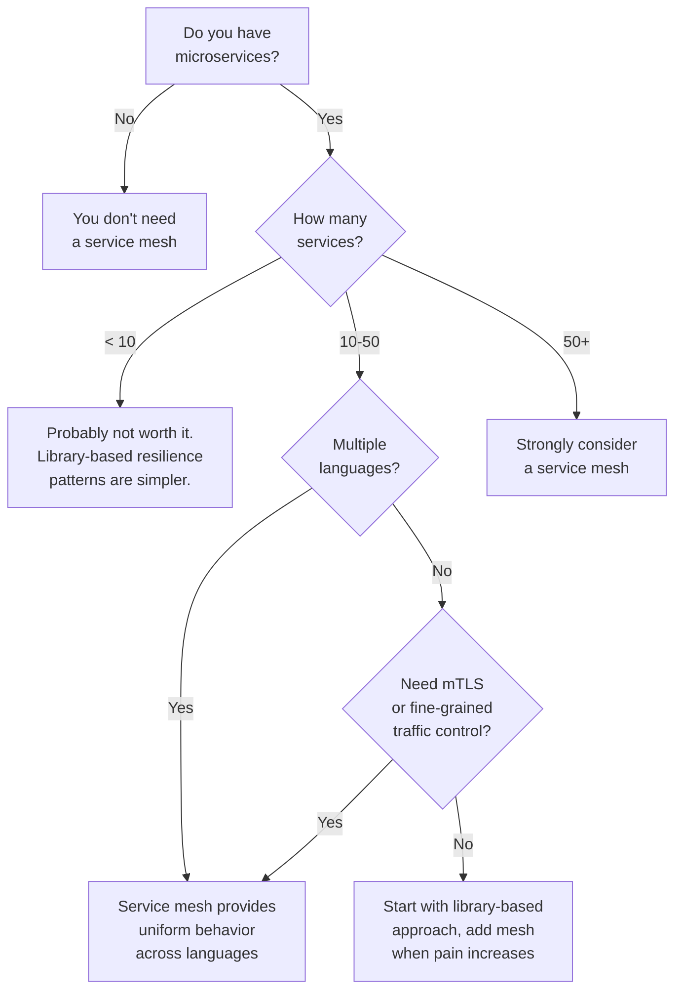

# Service Mesh

A service mesh is a dedicated infrastructure layer that handles service-to-service communication. It moves networking concerns — retries, timeouts, circuit breaking, mutual TLS, load balancing, observability — out of application code and into infrastructure. Every service gets a sidecar proxy that intercepts all inbound and outbound network traffic, applying policies consistently without any code changes to the application.

The service mesh exists because, at scale, implementing resilience patterns, security policies, and observability in every service independently becomes untenable. When you have 200 microservices written in 5 languages by 30 teams, you cannot rely on every team correctly implementing circuit breakers, TLS certificate rotation, and distributed tracing.

## Why Service Meshes Exist — First Principles

As microservices architectures grow, three categories of cross-cutting concerns become increasingly painful:

### 1. Reliability

Every service needs retries, timeouts, circuit breakers, and load balancing. Without a mesh, every team implements these differently (or not at all), leading to inconsistent behavior and cascading failures.

### 2. Security

Every service-to-service connection should use mutual TLS (mTLS). Without a mesh, managing certificates, rotating them, and enforcing encryption across hundreds of services is a massive operational burden.

### 3. Observability

Every request between services should be traced, metered, and logged. Without a mesh, you depend on every team instrumenting their code with the same tracing library, emitting metrics in the same format, and logging in the same structure.

The service mesh solves all three by moving these concerns into the infrastructure layer where they can be managed centrally and applied uniformly.

## The Sidecar Proxy Pattern

The sidecar proxy is the fundamental building block of a service mesh. It is a separate process (typically Envoy) that runs alongside every service instance, intercepting all network traffic.



### How Traffic Interception Works

On Kubernetes, the sidecar proxy uses iptables rules (or eBPF in newer implementations) to redirect all inbound and outbound traffic through the proxy:

```
Without mesh:
  Service A → [network] → Service B

With mesh:
  Service A → [iptables redirect] → Envoy Proxy A → [mTLS, policies] → Envoy Proxy B → [iptables redirect] → Service B
```

The application code in Service A makes a normal HTTP request to Service B. It has no idea the sidecar is there. The iptables rules intercept the outbound connection and redirect it to the local Envoy proxy, which applies policies, encrypts the traffic, and forwards it to Service B's Envoy proxy, which decrypts, applies inbound policies, and forwards to Service B.

```typescript
// Service A code — completely unaware of the mesh
// This is the point: no code changes needed

import axios from 'axios';

async function getOrderDetails(orderId: string) {
  // This looks like a direct call, but the mesh intercepts it
  // and adds: mTLS, retries, timeout, circuit breaking, tracing headers
  const response = await axios.get(`http://order-service:3001/api/orders/${orderId}`);
  return response.data;
}
```

## Data Plane vs Control Plane

A service mesh has two distinct components:



### Data Plane

The data plane consists of all the sidecar proxies. It handles the actual network traffic between services. Each proxy:

- Intercepts all inbound and outbound traffic
- Applies routing rules, retries, timeouts, and circuit breakers
- Terminates and originates mTLS connections
- Collects metrics, logs, and traces
- Reports telemetry to the control plane

### Control Plane

The control plane manages and configures the data plane proxies. It:

- Distributes routing rules and policies to all proxies
- Issues and rotates TLS certificates
- Collects telemetry from all proxies
- Provides APIs for operators to configure the mesh

## Istio Architecture

Istio is the most widely adopted service mesh. It uses Envoy as its data plane proxy and provides a comprehensive control plane.

### Components



**Pilot** translates high-level routing rules into Envoy-specific configuration and distributes it to all proxies via the xDS (discovery service) API.

**Citadel** acts as the certificate authority. It issues SPIFFE-compliant X.509 certificates to every proxy and automatically rotates them (typically every hour). This is what makes mTLS transparent — no application code or manual certificate management required.

**Galley** validates configuration and distributes it to other control plane components.

Since Istio 1.5, these components are consolidated into a single binary called `istiod` for operational simplicity.

### Traffic Management with Istio

Istio uses two core resources for traffic management:

**VirtualService** — defines how requests are routed to a service:

```yaml
# Canary deployment: 90% to v1, 10% to v2
apiVersion: networking.istio.io/v1beta1
kind: VirtualService
metadata:
  name: order-service
spec:
  hosts:
    - order-service
  http:
    - match:
        - headers:
            x-canary:
              exact: "true"
      route:
        - destination:
            host: order-service
            subset: v2
          weight: 100
    - route:
        - destination:
            host: order-service
            subset: v1
          weight: 90
        - destination:
            host: order-service
            subset: v2
          weight: 10
      retries:
        attempts: 3
        perTryTimeout: 2s
        retryOn: connect-failure,refused-stream,unavailable,cancelled,retriable-status-codes
      timeout: 10s
```

**DestinationRule** — defines policies that apply after routing (load balancing, connection pool, outlier detection):

```yaml
apiVersion: networking.istio.io/v1beta1
kind: DestinationRule
metadata:
  name: order-service
spec:
  host: order-service
  trafficPolicy:
    connectionPool:
      tcp:
        maxConnections: 100
      http:
        h2UpgradePolicy: UPGRADE
        http1MaxPendingRequests: 100
        http2MaxRequests: 1000
        maxRequestsPerConnection: 10
    outlierDetection:
      consecutive5xxErrors: 5
      interval: 30s
      baseEjectionTime: 30s
      maxEjectionPercent: 50
    loadBalancer:
      simple: LEAST_REQUEST
  subsets:
    - name: v1
      labels:
        version: v1
    - name: v2
      labels:
        version: v2
```

### Fault Injection for Testing

Istio can inject faults to test resilience without modifying application code:

```yaml
# Inject 5-second delay on 10% of requests to test timeout handling
apiVersion: networking.istio.io/v1beta1
kind: VirtualService
metadata:
  name: payment-service
spec:
  hosts:
    - payment-service
  http:
    - fault:
        delay:
          percentage:
            value: 10.0
          fixedDelay: 5s
        abort:
          percentage:
            value: 5.0
          httpStatus: 503
      route:
        - destination:
            host: payment-service
```

## Linkerd

Linkerd is an alternative to Istio that prioritizes simplicity and operational ease. It uses its own purpose-built proxy (linkerd2-proxy, written in Rust) instead of Envoy.

### Linkerd vs Istio

| Aspect | Istio | Linkerd |
|---|---|---|
| **Proxy** | Envoy (C++) | linkerd2-proxy (Rust) |
| **Resource usage** | Higher (Envoy is feature-rich) | Lower (purpose-built, minimal) |
| **Complexity** | High (many configuration options) | Low (opinionated defaults) |
| **Features** | Comprehensive (traffic management, security, observability, extensibility) | Focused (security, observability, reliability) |
| **Learning curve** | Steep | Gentle |
| **mTLS** | Configurable (can be off) | On by default |
| **Multi-cluster** | Supported (complex setup) | Supported (simpler) |
| **WASM extensibility** | Yes | No (intentional — keep it simple) |
| **Best for** | Complex traffic management, policy enforcement | Teams wanting mesh benefits with minimal complexity |

### Linkerd Architecture



## Mutual TLS (mTLS) in a Service Mesh

mTLS is perhaps the most valuable feature of a service mesh. It provides:

1. **Encryption** — all traffic between services is encrypted
2. **Authentication** — each service proves its identity with a certificate
3. **Authorization** — policies can restrict which services can communicate

### How mTLS Works in the Mesh



### SPIFFE Identity

Both Istio and Linkerd use the SPIFFE (Secure Production Identity Framework for Everyone) standard for workload identity. Each service gets a SPIFFE ID:

```
spiffe://cluster.local/ns/production/sa/order-service
```

This identity is embedded in the X.509 certificate issued by the mesh's certificate authority. Authorization policies reference these identities:

```yaml
# Only allow order-service to call payment-service
apiVersion: security.istio.io/v1beta1
kind: AuthorizationPolicy
metadata:
  name: payment-service-policy
  namespace: production
spec:
  selector:
    matchLabels:
      app: payment-service
  rules:
    - from:
        - source:
            principals:
              - "cluster.local/ns/production/sa/order-service"
      to:
        - operation:
            methods: ["POST"]
            paths: ["/api/payments"]
    - from:
        - source:
            principals:
              - "cluster.local/ns/production/sa/refund-service"
      to:
        - operation:
            methods: ["POST"]
            paths: ["/api/refunds"]
```

### Certificate Rotation

The mesh automatically rotates certificates (Istio default: every 1 hour, Linkerd default: every 24 hours). This happens transparently:

1. Proxy's certificate is approaching expiration
2. Proxy requests a new certificate from the control plane's CA
3. CA issues a new certificate with the same SPIFFE identity
4. Proxy starts using the new certificate for new connections
5. Existing connections continue with the old certificate until they close

No downtime. No application code changes. No manual certificate management.

## Observability Through the Mesh

Because every request passes through sidecar proxies, the mesh has complete visibility into all service-to-service communication.

### Metrics (Automatic)

The mesh automatically collects:

| Metric | Description |
|---|---|
| Request rate | Requests per second to each service |
| Error rate | Percentage of requests that fail (5xx) |
| Latency distribution | p50, p90, p95, p99 latency |
| Request size | Bytes sent/received |
| Connection count | Active connections per service |
| TCP errors | Connection failures, resets |

These are the RED metrics (Rate, Errors, Duration) that form the foundation of microservice monitoring. The mesh provides them without any instrumentation code.

### Distributed Tracing

The mesh injects trace headers (W3C Trace Context or Zipkin B3) into every request:

```
traceparent: 00-4bf92f3577b34da6a3ce929d0e0e4736-00f067aa0ba902b7-01
```

For tracing to work end-to-end, the application must propagate these headers when making outbound calls. The mesh handles injecting them on the first hop and collecting spans from each proxy, but the application must pass them through.

```typescript
// Application code must propagate trace headers
// This is the ONE thing you still need to do in your application code

import { context, trace, SpanKind } from '@opentelemetry/api';

async function handleRequest(req: Request) {
  // OpenTelemetry SDK extracts the traceparent header automatically
  // and creates a span for this operation
  const span = trace.getTracer('order-service').startSpan('processOrder', {
    kind: SpanKind.SERVER,
  });

  try {
    // When making outbound calls, the SDK injects traceparent automatically
    // if you use an instrumented HTTP client
    const inventory = await fetch('http://inventory-service/api/check', {
      headers: {
        // If not using auto-instrumentation, manually propagate:
        'traceparent': req.headers.get('traceparent') || '',
      },
    });

    span.setStatus({ code: SpanStatusCode.OK });
  } catch (error) {
    span.setStatus({ code: SpanStatusCode.ERROR, message: error.message });
    throw error;
  } finally {
    span.end();
  }
}
```

### Service Topology Visualization

The mesh can automatically generate a service dependency graph:



Kiali (for Istio) and Linkerd's dashboard provide real-time service topology maps with traffic flow, error rates, and latency overlaid on the graph.

## Traffic Management Patterns

### Canary Deployments

Route a small percentage of traffic to the new version:

```yaml
# Start with 5% to canary, increase gradually
http:
  - route:
      - destination:
          host: order-service
          subset: stable
        weight: 95
      - destination:
          host: order-service
          subset: canary
        weight: 5
```

### A/B Testing

Route traffic based on headers (user segment, device type):

```yaml
http:
  - match:
      - headers:
          x-user-segment:
            exact: "beta"
    route:
      - destination:
          host: order-service
          subset: experimental
  - route:
      - destination:
          host: order-service
          subset: stable
```

### Traffic Mirroring (Shadow Traffic)

Send a copy of production traffic to a test service without affecting production responses:

```yaml
http:
  - route:
      - destination:
          host: order-service
          subset: v1
    mirror:
      host: order-service
      subset: v2-test
    mirrorPercentage:
      value: 100.0
```

The mirrored traffic is fire-and-forget — the response from the mirror is discarded. This is invaluable for testing a new version with real production traffic patterns before routing any real users to it.

### Circuit Breaking via Mesh

Instead of implementing circuit breakers in application code:

```yaml
trafficPolicy:
  outlierDetection:
    consecutive5xxErrors: 5      # Eject after 5 consecutive 5xx errors
    interval: 10s                # Check every 10 seconds
    baseEjectionTime: 30s        # Eject for 30 seconds minimum
    maxEjectionPercent: 50       # Never eject more than 50% of hosts
  connectionPool:
    http:
      http1MaxPendingRequests: 100
      http2MaxRequests: 1000
    tcp:
      maxConnections: 100
```

## Performance Considerations

Adding a sidecar proxy to every service introduces latency overhead. Measuring and minimizing this overhead is critical.

### Latency Overhead

| Component | Added Latency | Notes |
|---|---|---|
| iptables interception | ~0.1ms | Per-hop, negligible |
| Envoy processing (no TLS) | ~0.5ms | Routing, load balancing |
| mTLS handshake (first request) | ~1-3ms | TLS 1.3 (1-RTT) |
| mTLS per-request (session reuse) | ~0.1ms | Symmetric encryption only |
| Total per-hop overhead | ~1-3ms first, ~0.5ms subsequent | With connection reuse |

For a request that traverses 5 services (4 hops), the mesh adds approximately 2-4ms of total latency with warm connections. This is negligible for most applications but may matter for latency-critical paths (financial trading, real-time gaming).

### Resource Overhead

Each sidecar proxy consumes CPU and memory:

| Proxy | Memory (idle) | Memory (active) | CPU (1000 RPS) |
|---|---|---|---|
| Envoy (Istio) | ~50MB | ~100-200MB | ~0.5 vCPU |
| linkerd2-proxy | ~20MB | ~50-100MB | ~0.2 vCPU |

For 200 services with 3 replicas each, that is 600 sidecar proxies. At 100MB each, that is 60GB of memory just for the mesh. This is real overhead that must be budgeted.

### Optimization Strategies

1. **Connection pooling** — Envoy reuses connections, amortizing the TLS handshake cost
2. **HTTP/2** — Multiplexing reduces connection count and eliminates head-of-line blocking
3. **Locality-aware routing** — Route to the closest instance (same zone, same region) to minimize network latency
4. **eBPF-based interception** — Replace iptables with eBPF for lower per-packet overhead (Cilium)
5. **Selective injection** — Don't inject sidecars into services that don't need mesh features (batch jobs, CronJobs)

## When to Use a Service Mesh



### Service Mesh Readiness Checklist

```
[ ] Running on Kubernetes (or equivalent container orchestration)
[ ] 10+ microservices in production
[ ] Multiple programming languages across services
[ ] Need for mTLS between all services
[ ] Need for fine-grained traffic management (canary, A/B)
[ ] Team has Kubernetes operational experience
[ ] Can afford the resource overhead (CPU, memory, latency)
[ ] Have monitoring in place to observe mesh behavior
```

::: info War Story
A fintech company deployed Istio across their 45-service Kubernetes cluster. The initial deployment went smoothly, but they quickly discovered that their custom gRPC health checks were being intercepted by the Envoy sidecar before Kubernetes could use them for readiness probes. Pods that were perfectly healthy were being marked as unready because the sidecar was not yet initialized when the kubelet sent the first health check. The fix was configuring `holdApplicationUntilProxyStarts: true` in the Istio configuration, which delays the application container startup until the sidecar is ready. They also discovered that their batch processing jobs, which processed millions of records and rarely made network calls, were wasting 100MB of memory per pod on sidecars that did nothing. They excluded batch job namespaces from sidecar injection with `sidecar.istio.io/inject: "false"`. The lesson: a service mesh is not an all-or-nothing decision. Be selective about which workloads get sidecars.
:::

## Common Mistakes

### Mistake 1: Mesh Without Kubernetes Maturity

A service mesh adds a layer on top of Kubernetes. If your team is still learning Kubernetes (debugging pod scheduling, understanding network policies, managing resources), adding a service mesh will multiply the complexity. Master Kubernetes first.

### Mistake 2: Treating the Mesh as a Silver Bullet

The mesh handles network-level concerns (retries, timeouts, mTLS). It does NOT handle application-level concerns (idempotency, saga coordination, business validation). Services still need application-level resilience.

### Mistake 3: Not Monitoring the Mesh Itself

The mesh is critical infrastructure. If the control plane goes down, proxies continue working with their last-known configuration, but new deployments, certificate rotations, and policy changes stop working. Monitor the mesh's health as closely as any other critical service.

### Mistake 4: Injecting Sidecars Everywhere

Not every workload needs a sidecar. Batch jobs, CronJobs, database migration scripts, and init containers typically don't benefit from mesh features and waste resources. Use annotation-based injection to be selective.

### Mistake 5: Ignoring mTLS Debugging

When mTLS is enabled, you can no longer use simple `tcpdump` to inspect traffic between services. You need mesh-specific debugging tools (Istio's `istioctl proxy-config` or Linkerd's `linkerd diagnostics`) to inspect traffic. Train your on-call engineers on these tools before they need them at 3 AM.
