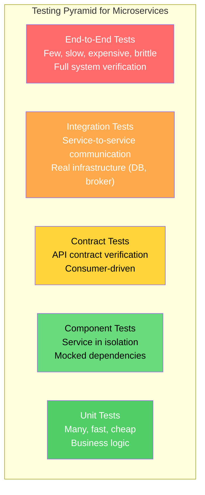
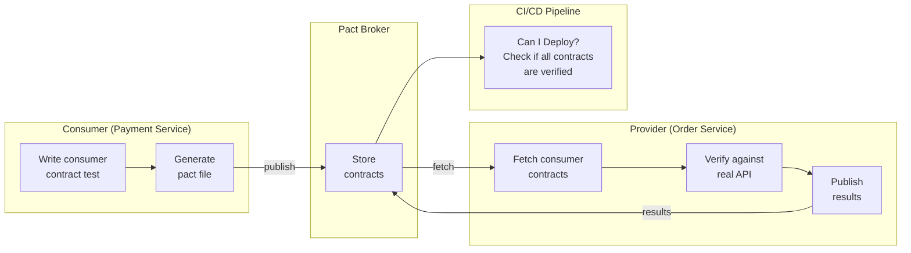

# Microservices Testing Strategies

Testing microservices is qualitatively different from testing a monolith. In a monolith, you have one codebase, one database, and integration tests are straightforward — everything runs in one process. In microservices, every test that crosses a service boundary requires network calls, test data coordination, and service availability. The testing pyramid must be adapted, and new categories of tests — particularly contract tests — become essential.

The core insight is that microservice testing is primarily about testing the boundaries. The business logic within a single service is tested the same way as any application. What changes is how you verify that services can communicate correctly and that the overall system behaves as expected when all services work together.

## Why Microservice Testing Is Different — First Principles

In a monolith:

```
Test scope: Single process, single database
Boundary: Module interface (function calls)
Failure modes: Logic errors, null references, SQL errors
Confidence from: Unit tests + integration tests against the database
```

In microservices:

```
Test scope: Multiple processes, multiple databases, network
Boundary: API contracts (HTTP, gRPC, events)
Failure modes: Logic errors + network failures + contract mismatches +
               serialization bugs + version incompatibility + timeout +
               eventual consistency issues
Confidence from: Unit + contract + component + integration + E2E
```

The failure surface area expands dramatically. You need tests that verify:

1. Each service works correctly in isolation (unit + component tests)
2. Each service honors its API contract (contract tests)
3. Services can communicate correctly through the network (integration tests)
4. The overall system achieves business goals (end-to-end tests)

## The Microservices Testing Pyramid



| Level | Scope | Speed | Reliability | What It Catches |
|---|---|---|---|---|
| **Unit** | Single class/function | Milliseconds | Very high | Logic errors, edge cases |
| **Component** | Single service (mocked deps) | Seconds | High | Service behavior, API correctness |
| **Contract** | API interface compatibility | Seconds | High | Contract mismatches between services |
| **Integration** | Service + real infrastructure | Seconds-minutes | Medium | Database queries, broker messages, network |
| **End-to-End** | Full system | Minutes | Low | System-level flows, business scenarios |

**Ratio guideline:** 70% unit / 15% component / 10% contract / 4% integration / 1% E2E

## Unit Tests

Unit tests for microservices are identical to unit tests for any software — test business logic in isolation with mocked dependencies. The key principle: domain logic should have ZERO infrastructure dependencies.

```typescript
// order-service/src/domain/Order.test.ts

import { Order, OrderItem, InvalidOrderError } from './Order';

describe('Order', () => {
  const validItems: OrderItem[] = [
    { productId: 'prod-1', productName: 'Widget', quantity: 2, unitPrice: 10.00 },
    { productId: 'prod-2', productName: 'Gadget', quantity: 1, unitPrice: 25.00 },
  ];

  describe('create', () => {
    it('should calculate total amount from items', () => {
      const order = Order.create({
        customerId: 'customer-1',
        items: validItems,
      });

      expect(order.totalAmount).toBe(45.00); // (2 * 10) + (1 * 25)
    });

    it('should set initial status to pending', () => {
      const order = Order.create({
        customerId: 'customer-1',
        items: validItems,
      });

      expect(order.status).toBe('pending');
    });

    it('should reject empty order', () => {
      expect(() => Order.create({
        customerId: 'customer-1',
        items: [],
      })).toThrow(InvalidOrderError);
    });

    it('should reject order with zero quantity', () => {
      expect(() => Order.create({
        customerId: 'customer-1',
        items: [{ productId: 'prod-1', productName: 'Widget', quantity: 0, unitPrice: 10 }],
      })).toThrow(InvalidOrderError);
    });

    it('should reject order with negative price', () => {
      expect(() => Order.create({
        customerId: 'customer-1',
        items: [{ productId: 'prod-1', productName: 'Widget', quantity: 1, unitPrice: -5 }],
      })).toThrow(InvalidOrderError);
    });

    it('should enforce maximum items limit', () => {
      const tooManyItems = Array.from({ length: 101 }, (_, i) => ({
        productId: `prod-${i}`,
        productName: `Product ${i}`,
        quantity: 1,
        unitPrice: 1,
      }));

      expect(() => Order.create({
        customerId: 'customer-1',
        items: tooManyItems,
      })).toThrow(InvalidOrderError);
    });
  });

  describe('confirm', () => {
    it('should transition from pending to confirmed', () => {
      const order = Order.create({ customerId: 'c-1', items: validItems });
      order.confirm();
      expect(order.status).toBe('confirmed');
    });

    it('should reject confirmation of cancelled order', () => {
      const order = Order.create({ customerId: 'c-1', items: validItems });
      order.cancel('customer requested');
      expect(() => order.confirm()).toThrow('Cannot confirm a cancelled order');
    });

    it('should be idempotent', () => {
      const order = Order.create({ customerId: 'c-1', items: validItems });
      order.confirm();
      order.confirm(); // Should not throw
      expect(order.status).toBe('confirmed');
    });
  });

  describe('calculateTotal', () => {
    it('should handle floating point correctly', () => {
      const items: OrderItem[] = [
        { productId: 'p1', productName: 'A', quantity: 3, unitPrice: 0.1 },
        { productId: 'p2', productName: 'B', quantity: 3, unitPrice: 0.2 },
      ];
      const order = Order.create({ customerId: 'c-1', items });
      // 3 * 0.1 + 3 * 0.2 = 0.3 + 0.6 = 0.9
      // Without proper handling: 0.30000000000000004 + 0.6000000000000001
      expect(order.totalAmount).toBe(0.90);
    });
  });
});
```

## Component Tests

Component tests verify a single service's behavior in isolation, with external dependencies (other services, databases) replaced by test doubles. The service is tested through its real API (HTTP, gRPC) but with mocked downstream services.

```typescript
// order-service/test/component/placeOrder.component.test.ts

import { createApp } from '../../src/app';
import { TestDatabase } from '../helpers/TestDatabase';
import { MockEventPublisher } from '../helpers/MockEventPublisher';
import { MockInventoryClient } from '../helpers/MockInventoryClient';
import supertest from 'supertest';

describe('Place Order (Component Test)', () => {
  let app: Express;
  let db: TestDatabase;
  let eventPublisher: MockEventPublisher;
  let inventoryClient: MockInventoryClient;
  let request: supertest.SuperTest<supertest.Test>;

  beforeAll(async () => {
    db = await TestDatabase.create(); // Real PostgreSQL with test schema
    eventPublisher = new MockEventPublisher();
    inventoryClient = new MockInventoryClient();

    app = createApp({
      database: db.pool,
      eventPublisher,
      inventoryClient, // Mocked — no real calls to Inventory Service
    });

    request = supertest(app);
  });

  afterAll(async () => {
    await db.cleanup();
  });

  beforeEach(async () => {
    await db.truncateAll();
    eventPublisher.reset();
    inventoryClient.reset();
  });

  it('should create an order and publish OrderPlaced event', async () => {
    // Arrange
    inventoryClient.setAvailable('prod-1', 100);
    inventoryClient.setAvailable('prod-2', 50);

    // Act
    const response = await request
      .post('/api/orders')
      .set('Authorization', 'Bearer test-token')
      .set('X-User-Id', 'user-123')
      .send({
        items: [
          { productId: 'prod-1', quantity: 2, unitPrice: 10.00 },
          { productId: 'prod-2', quantity: 1, unitPrice: 25.00 },
        ],
        shippingAddress: {
          street: '123 Main St',
          city: 'Springfield',
          state: 'IL',
          zipCode: '62701',
        },
      });

    // Assert — HTTP response
    expect(response.status).toBe(201);
    expect(response.body).toMatchObject({
      orderId: expect.any(String),
      status: 'pending',
      totalAmount: 45.00,
    });

    // Assert — database state
    const orderInDb = await db.query(
      'SELECT * FROM orders WHERE id = $1',
      [response.body.orderId],
    );
    expect(orderInDb.rows).toHaveLength(1);
    expect(orderInDb.rows[0].status).toBe('pending');
    expect(parseFloat(orderInDb.rows[0].total_amount)).toBe(45.00);

    // Assert — event published
    expect(eventPublisher.publishedEvents).toHaveLength(1);
    expect(eventPublisher.publishedEvents[0]).toMatchObject({
      eventType: 'order.placed',
      data: {
        orderId: response.body.orderId,
        customerId: 'user-123',
        totalAmount: 45.00,
      },
    });
  });

  it('should return 400 when items are empty', async () => {
    const response = await request
      .post('/api/orders')
      .set('Authorization', 'Bearer test-token')
      .set('X-User-Id', 'user-123')
      .send({ items: [], shippingAddress: { street: '123 Main', city: 'X', state: 'IL', zipCode: '62701' } });

    expect(response.status).toBe(400);
    expect(response.body.error).toBe('validation_error');
    expect(eventPublisher.publishedEvents).toHaveLength(0);
  });

  it('should return 409 when inventory is insufficient', async () => {
    inventoryClient.setAvailable('prod-1', 1); // Only 1 available, requesting 2

    const response = await request
      .post('/api/orders')
      .set('Authorization', 'Bearer test-token')
      .set('X-User-Id', 'user-123')
      .send({
        items: [{ productId: 'prod-1', quantity: 2, unitPrice: 10.00 }],
        shippingAddress: { street: '123 Main', city: 'X', state: 'IL', zipCode: '62701' },
      });

    expect(response.status).toBe(409);
    expect(response.body.error).toBe('insufficient_inventory');
  });

  it('should handle concurrent order placement', async () => {
    inventoryClient.setAvailable('prod-1', 5);

    // Place 10 orders simultaneously for 1 unit each
    // Only 5 should succeed
    const promises = Array.from({ length: 10 }, () =>
      request
        .post('/api/orders')
        .set('Authorization', 'Bearer test-token')
        .set('X-User-Id', 'user-123')
        .send({
          items: [{ productId: 'prod-1', quantity: 1, unitPrice: 10.00 }],
          shippingAddress: { street: '123 Main', city: 'X', state: 'IL', zipCode: '62701' },
        }),
    );

    const responses = await Promise.all(promises);
    const successes = responses.filter(r => r.status === 201);
    const failures = responses.filter(r => r.status === 409);

    expect(successes.length).toBe(5);
    expect(failures.length).toBe(5);
  });
});
```

## Contract Tests (Consumer-Driven Contract Testing)

Contract tests verify that a service's API matches what its consumers expect. They catch breaking changes before they reach production.

### The Problem Contract Tests Solve

```
Without contract tests:
  Team A changes Order Service API: renames "totalAmount" to "total"
  Team A runs their tests → all pass (they updated their tests)
  Team B's Payment Service still expects "totalAmount"
  Team B's tests don't run Order Service → they don't catch the break
  Deployment to staging → everything breaks
  Hours of debugging to find the root cause
```

```
With contract tests:
  Team A changes Order Service API: renames "totalAmount" to "total"
  Team A runs provider verification → FAILS
  Contract test says: "Payment Service expects field 'totalAmount' in response"
  Team A knows they need to coordinate with Team B before changing the API
  Break caught in seconds, not hours
```

### Pact: Consumer-Driven Contract Testing

```typescript
// payment-service/test/contracts/orderService.pact.test.ts
// CONSUMER side — Payment Service defines what it needs from Order Service

import { PactV3, MatchersV3 } from '@pact-foundation/pact';
import { OrderClient } from '../../src/infrastructure/clients/OrderClient';

const { like, eachLike, string, integer, decimal, iso8601DateTimeWithMillis } = MatchersV3;

const provider = new PactV3({
  consumer: 'PaymentService',
  provider: 'OrderService',
  logLevel: 'warn',
});

describe('Order Service Contract (Consumer: Payment Service)', () => {
  it('should return order details for a valid order ID', async () => {
    // Define the interaction — what Payment Service expects
    await provider
      .given('an order with ID order-123 exists')
      .uponReceiving('a request for order details')
      .withRequest({
        method: 'GET',
        path: '/api/orders/order-123',
        headers: {
          'Accept': 'application/json',
          'Authorization': like('Bearer valid-token'),
        },
      })
      .willRespondWith({
        status: 200,
        headers: {
          'Content-Type': 'application/json',
        },
        body: {
          id: string('order-123'),
          customerId: string('customer-456'),
          status: string('pending'),
          totalAmount: decimal(45.00),         // Payment Service needs this field
          items: eachLike({
            productId: string('prod-1'),
            quantity: integer(2),
            unitPrice: decimal(10.00),
          }),
          placedAt: iso8601DateTimeWithMillis('2025-01-15T10:30:00.000Z'),
        },
      })
      .executeTest(async (mockServer) => {
        // Create a real client pointing at the mock server
        const client = new OrderClient(mockServer.url);
        const order = await client.getOrder('order-123');

        // Verify the client can parse the expected response
        expect(order.id).toBe('order-123');
        expect(order.totalAmount).toBe(45.00);
        expect(order.items).toHaveLength(1);
      });
  });

  it('should return 404 for non-existent order', async () => {
    await provider
      .given('no order with ID order-999 exists')
      .uponReceiving('a request for a non-existent order')
      .withRequest({
        method: 'GET',
        path: '/api/orders/order-999',
        headers: {
          'Accept': 'application/json',
          'Authorization': like('Bearer valid-token'),
        },
      })
      .willRespondWith({
        status: 404,
        headers: { 'Content-Type': 'application/json' },
        body: {
          error: string('not_found'),
          message: string('Order not found'),
        },
      })
      .executeTest(async (mockServer) => {
        const client = new OrderClient(mockServer.url);
        await expect(client.getOrder('order-999')).rejects.toThrow('Order not found');
      });
  });
});
```

```typescript
// order-service/test/contracts/orderService.provider.test.ts
// PROVIDER side — Order Service verifies it can satisfy all consumer contracts

import { Verifier } from '@pact-foundation/pact';
import { createApp } from '../../src/app';
import { TestDatabase } from '../helpers/TestDatabase';

describe('Order Service Provider Verification', () => {
  let server: http.Server;
  let db: TestDatabase;

  beforeAll(async () => {
    db = await TestDatabase.create();
    const app = createApp({ database: db.pool });
    server = app.listen(0); // Random port
  });

  afterAll(async () => {
    server.close();
    await db.cleanup();
  });

  it('should satisfy all consumer contracts', async () => {
    const port = (server.address() as AddressInfo).port;

    const verifier = new Verifier({
      providerBaseUrl: `http://localhost:${port}`,
      provider: 'OrderService',

      // Fetch contracts from Pact Broker (or local files)
      pactBrokerUrl: process.env.PACT_BROKER_URL || 'http://localhost:9292',
      publishVerificationResult: process.env.CI === 'true',
      providerVersion: process.env.GIT_COMMIT || 'local',

      // Set up provider states (test data)
      stateHandlers: {
        'an order with ID order-123 exists': async () => {
          await db.truncateAll();
          await db.query(
            `INSERT INTO orders (id, customer_id, status, total_amount, placed_at)
             VALUES ('order-123', 'customer-456', 'pending', 45.00, NOW())`,
          );
          await db.query(
            `INSERT INTO order_items (order_id, product_id, quantity, unit_price)
             VALUES ('order-123', 'prod-1', 2, 10.00)`,
          );
        },

        'no order with ID order-999 exists': async () => {
          await db.truncateAll();
          // Intentionally empty — no order with this ID
        },
      },
    });

    await verifier.verifyProvider();
  });
});
```

### Contract Testing for Events

```typescript
// notification-service/test/contracts/orderEvents.pact.test.ts
// Consumer of order.placed events

import { MessageConsumerPact, synchronousBodyHandler } from '@pact-foundation/pact';

describe('Order Events Contract (Consumer: Notification Service)', () => {
  const messagePact = new MessageConsumerPact({
    consumer: 'NotificationService',
    provider: 'OrderService',
    logLevel: 'warn',
  });

  it('should handle order.placed event', () => {
    return messagePact
      .given('an order has been placed')
      .expectsToReceive('an order.placed event')
      .withContent({
        eventType: 'order.placed',
        timestamp: like('2025-01-15T10:30:00.000Z'),
        data: {
          orderId: like('order-123'),
          customerId: like('customer-456'),
          customerEmail: like('customer@example.com'),
          totalAmount: like(45.00),
          items: eachLike({
            productName: like('Widget'),
            quantity: like(2),
          }),
        },
      })
      .verify(synchronousBodyHandler(async (event: OrderPlacedEvent) => {
        // Verify our handler can process this event shape
        const handler = new OrderPlacedNotificationHandler(mockEmailSender);
        await handler.handle(event);
        expect(mockEmailSender.sentEmails).toHaveLength(1);
        expect(mockEmailSender.sentEmails[0].to).toBe('customer@example.com');
      }));
  });
});
```

### Contract Testing Workflow



The "Can I Deploy?" check is the critical integration point:

```bash
# Before deploying Order Service v2.3.1:
pact-broker can-i-deploy \
  --pacticipant OrderService \
  --version 2.3.1 \
  --to production

# Output:
# RESULT: FAILED
# PaymentService (v1.5.0) has a contract that OrderService (v2.3.1) has NOT verified.
# Cannot deploy OrderService v2.3.1 to production.
```

## Integration Tests

Integration tests verify that a service works correctly with real infrastructure — real databases, real message brokers, real external services (or realistic stubs).

```typescript
// order-service/test/integration/orderRepository.integration.test.ts

import { OrderRepository } from '../../src/infrastructure/OrderRepository';
import { TestDatabase } from '../helpers/TestDatabase';

describe('OrderRepository (Integration)', () => {
  let db: TestDatabase;
  let repo: OrderRepository;

  beforeAll(async () => {
    // Real PostgreSQL instance (Docker via testcontainers)
    db = await TestDatabase.create();
    await db.runMigrations();
    repo = new OrderRepository(db.pool);
  });

  afterAll(async () => {
    await db.cleanup();
  });

  beforeEach(async () => {
    await db.truncateAll();
  });

  it('should persist and retrieve an order with items', async () => {
    const order = Order.create({
      customerId: 'customer-1',
      items: [
        { productId: 'prod-1', productName: 'Widget', quantity: 2, unitPrice: 10.00 },
      ],
    });

    await repo.save(order);

    const retrieved = await repo.findById(order.id);
    expect(retrieved).not.toBeNull();
    expect(retrieved!.customerId).toBe('customer-1');
    expect(retrieved!.items).toHaveLength(1);
    expect(retrieved!.totalAmount).toBe(20.00);
  });

  it('should handle concurrent updates with optimistic locking', async () => {
    const order = Order.create({
      customerId: 'customer-1',
      items: [{ productId: 'prod-1', productName: 'Widget', quantity: 1, unitPrice: 10.00 }],
    });
    await repo.save(order);

    // Two processes load the same order
    const order1 = await repo.findById(order.id);
    const order2 = await repo.findById(order.id);

    // First update succeeds
    order1!.confirm();
    await repo.save(order1!);

    // Second update should fail (optimistic locking)
    order2!.cancel('customer request');
    await expect(repo.save(order2!)).rejects.toThrow('Concurrent modification');
  });
});

// order-service/test/integration/outbox.integration.test.ts

describe('Transactional Outbox (Integration)', () => {
  it('should atomically save order and outbox event', async () => {
    const order = Order.create({
      customerId: 'customer-1',
      items: [{ productId: 'prod-1', productName: 'Widget', quantity: 1, unitPrice: 10.00 }],
    });

    await repo.createOrder(order); // Uses transactional outbox

    // Verify both are saved
    const savedOrder = await db.query('SELECT * FROM orders WHERE id = $1', [order.id]);
    const outboxEvent = await db.query(
      "SELECT * FROM outbox WHERE aggregate_id = $1 AND event_type = 'order.placed'",
      [order.id],
    );

    expect(savedOrder.rows).toHaveLength(1);
    expect(outboxEvent.rows).toHaveLength(1);
    expect(outboxEvent.rows[0].published_at).toBeNull(); // Not yet published
  });

  it('should not save outbox event if order save fails', async () => {
    // Create an order that will fail validation at the database level
    const invalidOrder = Order.create({
      customerId: null as any, // Will violate NOT NULL constraint
      items: [{ productId: 'prod-1', productName: 'Widget', quantity: 1, unitPrice: 10.00 }],
    });

    await expect(repo.createOrder(invalidOrder)).rejects.toThrow();

    // Neither the order nor the outbox event should exist
    const savedOrder = await db.query('SELECT * FROM orders WHERE id = $1', [invalidOrder.id]);
    const outboxEvent = await db.query('SELECT * FROM outbox WHERE aggregate_id = $1', [invalidOrder.id]);

    expect(savedOrder.rows).toHaveLength(0);
    expect(outboxEvent.rows).toHaveLength(0);
  });
});
```

## End-to-End Tests

E2E tests verify complete business flows across all services. They are the most expensive, slowest, and most brittle tests. Use them sparingly for critical business paths.

```typescript
// e2e/test/orderFlow.e2e.test.ts

describe('Order Flow (E2E)', () => {
  // This test requires ALL services to be running
  const apiGateway = process.env.GATEWAY_URL || 'http://localhost:8080';

  beforeAll(async () => {
    // Wait for all services to be healthy
    await waitForService(`${apiGateway}/health`);
    await waitForService('http://order-service:3001/health');
    await waitForService('http://inventory-service:3002/health');
    await waitForService('http://payment-service:3003/health');
  });

  it('should complete full order lifecycle', async () => {
    // 1. Ensure product exists in inventory
    await setupTestData({
      inventory: [{ productId: 'e2e-product-1', quantity: 100 }],
    });

    // 2. Place order through API Gateway
    const orderResponse = await fetch(`${apiGateway}/api/orders`, {
      method: 'POST',
      headers: {
        'Content-Type': 'application/json',
        'Authorization': `Bearer ${testUserToken}`,
      },
      body: JSON.stringify({
        items: [{ productId: 'e2e-product-1', quantity: 2, unitPrice: 10.00 }],
        shippingAddress: { street: '123 E2E St', city: 'Test', state: 'TS', zipCode: '00000' },
      }),
    });

    expect(orderResponse.status).toBe(201);
    const { orderId } = await orderResponse.json();

    // 3. Wait for order to be confirmed (async processing)
    await waitForCondition(
      async () => {
        const res = await fetch(`${apiGateway}/api/orders/${orderId}`, {
          headers: { 'Authorization': `Bearer ${testUserToken}` },
        });
        const order = await res.json();
        return order.status === 'confirmed';
      },
      { timeout: 30000, interval: 1000, description: 'order confirmation' },
    );

    // 4. Verify inventory was reserved
    const inventoryRes = await fetch(
      `http://inventory-service:3002/api/inventory/e2e-product-1`,
    );
    const inventory = await inventoryRes.json();
    expect(inventory.availableQuantity).toBe(98); // 100 - 2

    // 5. Verify notification was sent (check notification service)
    const notifRes = await fetch(
      `http://notification-service:3005/api/notifications?orderId=${orderId}`,
    );
    const notifications = await notifRes.json();
    expect(notifications).toHaveLength(1);
    expect(notifications[0].type).toBe('order_confirmation');
  }, 60000); // 60-second timeout for full flow

  afterAll(async () => {
    await cleanupTestData();
  });
});

// Helper: Wait for a condition with timeout
async function waitForCondition(
  check: () => Promise<boolean>,
  options: { timeout: number; interval: number; description: string },
): Promise<void> {
  const start = Date.now();
  while (Date.now() - start < options.timeout) {
    if (await check()) return;
    await sleep(options.interval);
  }
  throw new Error(`Timed out waiting for: ${options.description}`);
}
```

## Testing in Production

Testing in production is not a replacement for pre-production testing — it is an additional layer that catches issues that only manifest with real traffic, real data, and real scale.

### Canary Testing

Deploy the new version to a small percentage of traffic and monitor for errors:

```yaml
# Istio VirtualService for canary
apiVersion: networking.istio.io/v1beta1
kind: VirtualService
metadata:
  name: order-service-canary
spec:
  hosts:
    - order-service
  http:
    - route:
        - destination:
            host: order-service
            subset: stable
          weight: 95
        - destination:
            host: order-service
            subset: canary
          weight: 5
```

### Synthetic Monitoring

Run automated test transactions against production on a schedule:

```typescript
// synthetic-monitor/src/monitors/orderFlow.ts

class OrderFlowMonitor {
  async run(): Promise<MonitorResult> {
    const start = Date.now();

    try {
      // Use a dedicated test account with a test credit card
      const orderId = await this.placeTestOrder();
      await this.waitForConfirmation(orderId);
      await this.cancelTestOrder(orderId); // Clean up

      const duration = Date.now() - start;

      return {
        success: true,
        duration,
        checks: ['order_placed', 'order_confirmed', 'order_cancelled'],
      };
    } catch (error) {
      return {
        success: false,
        duration: Date.now() - start,
        error: error.message,
      };
    }
  }
}

// Run every 5 minutes
setInterval(async () => {
  const monitor = new OrderFlowMonitor();
  const result = await monitor.run();

  metrics.recordMonitorResult('order_flow', result);

  if (!result.success) {
    alerting.fire('synthetic_monitor_failed', {
      monitor: 'order_flow',
      error: result.error,
    });
  }
}, 5 * 60 * 1000);
```

### Feature Flags for Gradual Rollout

```typescript
// Use feature flags to test new behavior with specific users or percentages

async function processOrder(order: Order): Promise<void> {
  const useNewPricingEngine = await featureFlags.isEnabled(
    'new-pricing-engine',
    { userId: order.customerId },
  );

  if (useNewPricingEngine) {
    await newPricingEngine.calculate(order);
  } else {
    await legacyPricingEngine.calculate(order);
  }
}
```

## Decision Framework

| Situation | Test Type |
|---|---|
| Testing business logic (pure functions, domain model) | Unit tests |
| Testing a service's HTTP API behavior | Component tests |
| Testing database queries and transactions | Integration tests |
| Verifying API compatibility between services | Contract tests (Pact) |
| Verifying critical end-to-end business flows | E2E tests (sparingly) |
| Catching issues only visible at production scale | Canary + synthetic monitoring |
| Verifying event schemas between services | Message contract tests |

::: info War Story
A payments company had 2,000 end-to-end tests that took 4 hours to run. Tests were flaky — about 10% failed on every run due to timing issues, test data contamination, and infrastructure instability. The team spent more time debugging test failures than debugging production issues. They replaced 90% of the E2E tests with contract tests and component tests. The remaining 200 E2E tests covered only the critical payment flows. Test suite runtime dropped from 4 hours to 12 minutes. Flakiness dropped from 10% to under 1%. Paradoxically, their confidence in deployments INCREASED because the faster test suite ran on every commit (the 4-hour suite had been running only nightly, meaning bugs were found a day late).
:::
