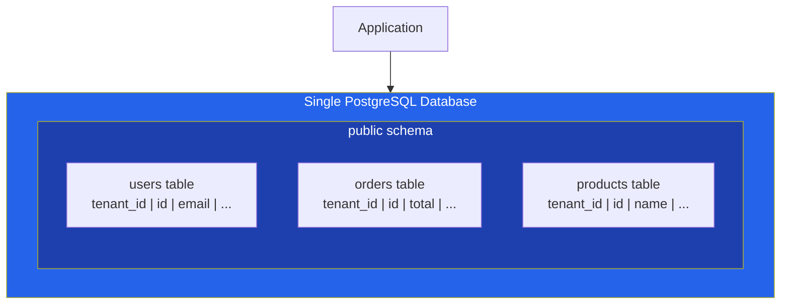
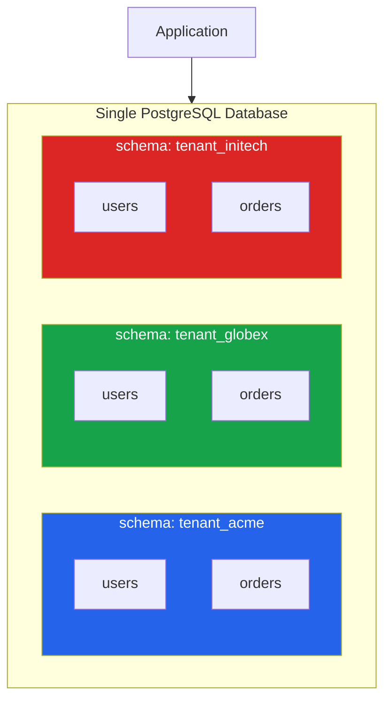
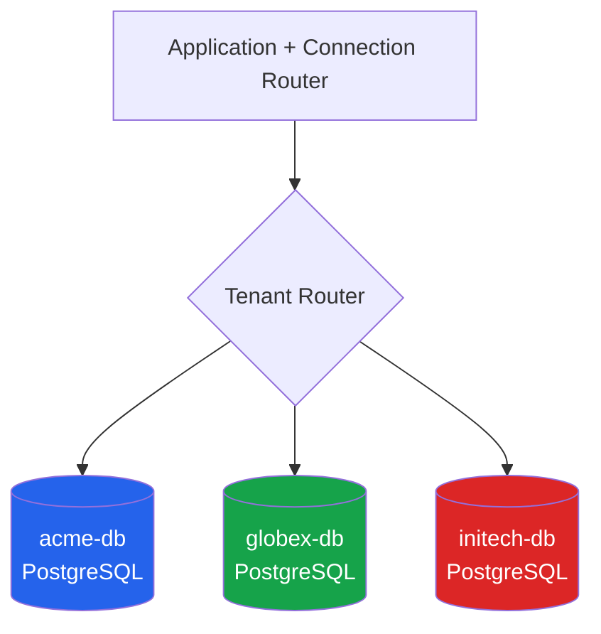
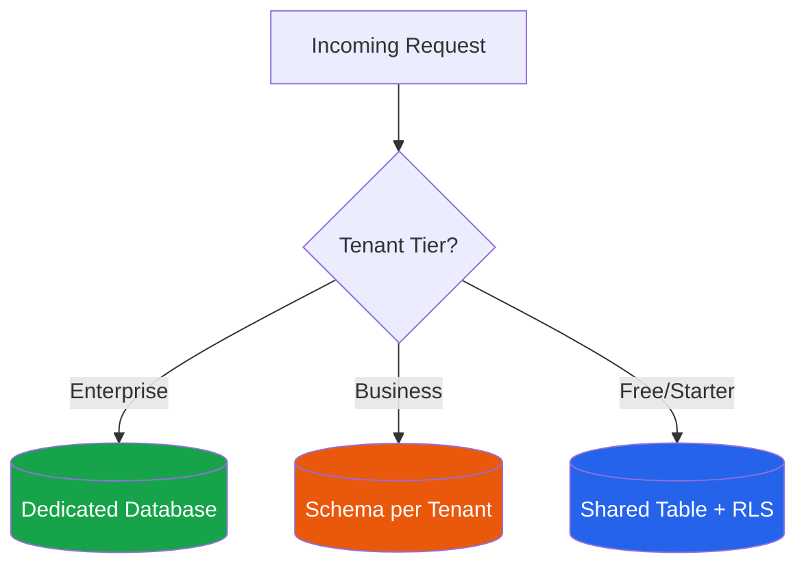

# Multi-Tenant Database Strategies

The database is where multi-tenancy gets real. Your API layer can be beautifully tenant-aware, but if a single SQL query forgets a `WHERE tenant_id = ?` clause, you have a data breach. The database strategy you choose determines your isolation guarantees, your operational complexity, your cost structure, and your ability to scale.

There are three fundamental strategies. Every multi-tenant system uses one of them or a hybrid. Each involves a different trade-off between isolation, cost, and operational burden.

## Strategy 1: Shared Database, Shared Schema (Pool Model)

All tenants share the same database and the same tables. Tenant data is differentiated by a `tenant_id` column on every row.



### Implementation

```sql
-- Every table includes tenant_id as part of its primary key
CREATE TABLE orders (
    tenant_id UUID NOT NULL,
    id UUID NOT NULL DEFAULT gen_random_uuid(),
    customer_id UUID NOT NULL,
    total_cents BIGINT NOT NULL,
    currency TEXT NOT NULL DEFAULT 'USD',
    status TEXT NOT NULL DEFAULT 'pending',
    created_at TIMESTAMPTZ NOT NULL DEFAULT now(),
    updated_at TIMESTAMPTZ NOT NULL DEFAULT now(),
    PRIMARY KEY (tenant_id, id)
);

-- Composite indexes always lead with tenant_id
CREATE INDEX idx_orders_tenant_status
    ON orders (tenant_id, status, created_at DESC);

CREATE INDEX idx_orders_tenant_customer
    ON orders (tenant_id, customer_id);

-- Foreign keys reference within tenant scope
ALTER TABLE orders ADD CONSTRAINT fk_orders_customer
    FOREIGN KEY (tenant_id, customer_id)
    REFERENCES customers (tenant_id, id);
```

::: tip Composite Primary Keys
Making `tenant_id` part of the composite primary key ensures that the partition key is always present in index lookups. It also enables table partitioning by `tenant_id` later without schema changes.
:::

### Row-Level Security (PostgreSQL)

Application-level filtering is necessary but not sufficient. A missed WHERE clause, a raw SQL query, a new ORM method — any of these can bypass your application filtering. PostgreSQL Row-Level Security (RLS) provides a database-level safety net.

```sql
-- Enable RLS on the table
ALTER TABLE orders ENABLE ROW LEVEL SECURITY;

-- Force RLS even for table owners (critical for security)
ALTER TABLE orders FORCE ROW LEVEL SECURITY;

-- Policy: rows are visible only when tenant_id matches the session variable
CREATE POLICY tenant_isolation ON orders
    USING (tenant_id = current_setting('app.current_tenant_id')::UUID);

-- Policy for INSERT: ensure new rows match the current tenant
CREATE POLICY tenant_insert ON orders
    FOR INSERT
    WITH CHECK (tenant_id = current_setting('app.current_tenant_id')::UUID);
```

Setting the tenant context per connection:

```typescript
import { Pool, PoolClient } from 'pg';

const pool = new Pool({ connectionString: process.env.DATABASE_URL });

export async function withTenant<T>(
  tenantId: string,
  fn: (client: PoolClient) => Promise<T>
): Promise<T> {
  const client = await pool.connect();
  try {
    // Set the tenant context for this connection
    await client.query(
      `SET app.current_tenant_id = $1`,
      [tenantId]
    );

    const result = await fn(client);
    return result;
  } finally {
    // Reset before returning to pool
    await client.query(`RESET app.current_tenant_id`);
    client.release();
  }
}

// Usage
app.get('/api/orders', async (req, res) => {
  const orders = await withTenant(req.tenant.tenantId, async (client) => {
    // RLS automatically filters — no WHERE tenant_id needed
    const result = await client.query(
      'SELECT * FROM orders WHERE status = $1 ORDER BY created_at DESC',
      ['active']
    );
    return result.rows;
  });

  res.json(orders);
});
```

::: warning RLS Performance Considerations
RLS policies add a filter to every query. For simple equality checks like `tenant_id = current_setting(...)`, the performance impact is negligible — PostgreSQL pushes the filter into the index scan. For complex policies with subqueries, test carefully.
:::

### Table Partitioning by Tenant

For large-scale shared-table deployments, PostgreSQL's native partitioning can improve query performance and simplify data management:

```sql
-- Create partitioned parent table
CREATE TABLE events (
    tenant_id UUID NOT NULL,
    id UUID NOT NULL DEFAULT gen_random_uuid(),
    event_type TEXT NOT NULL,
    payload JSONB NOT NULL,
    created_at TIMESTAMPTZ NOT NULL DEFAULT now(),
    PRIMARY KEY (tenant_id, id)
) PARTITION BY HASH (tenant_id);

-- Create partitions (e.g., 16 hash partitions)
CREATE TABLE events_p0 PARTITION OF events FOR VALUES WITH (MODULUS 16, REMAINDER 0);
CREATE TABLE events_p1 PARTITION OF events FOR VALUES WITH (MODULUS 16, REMAINDER 1);
CREATE TABLE events_p2 PARTITION OF events FOR VALUES WITH (MODULUS 16, REMAINDER 2);
-- ... through events_p15
```

::: tip Hash vs. List Partitioning
Use **hash partitioning** when you have many tenants and want even distribution. Use **list partitioning** when you have a few large tenants that need dedicated partitions for performance isolation or compliance.
:::

### Shared Schema Pros and Cons

| Pros | Cons |
|---|---|
| Simplest to operate — one database to back up, monitor, upgrade | One missed WHERE clause = data breach |
| Lowest cost — maximal resource sharing | Hard to offer per-tenant backup/restore |
| Easy cross-tenant queries for analytics | Noisy neighbor at database level |
| Schema migrations apply once | Large table sizes can affect performance |
| Simplest connection pooling | Cannot offer per-tenant database config |

## Strategy 2: Schema Per Tenant

Each tenant gets their own PostgreSQL schema within a shared database. Tables have the same structure, but each tenant's data lives in a separate namespace.



### Implementation

```sql
-- Tenant provisioning: create schema and tables
CREATE OR REPLACE FUNCTION provision_tenant(p_tenant_slug TEXT)
RETURNS VOID AS $$
DECLARE
    schema_name TEXT := 'tenant_' || p_tenant_slug;
BEGIN
    -- Create the schema
    EXECUTE format('CREATE SCHEMA IF NOT EXISTS %I', schema_name);

    -- Create tables within the tenant schema
    EXECUTE format('
        CREATE TABLE %I.users (
            id UUID PRIMARY KEY DEFAULT gen_random_uuid(),
            email TEXT NOT NULL UNIQUE,
            name TEXT NOT NULL,
            created_at TIMESTAMPTZ NOT NULL DEFAULT now()
        )', schema_name);

    EXECUTE format('
        CREATE TABLE %I.orders (
            id UUID PRIMARY KEY DEFAULT gen_random_uuid(),
            customer_id UUID NOT NULL REFERENCES %I.users(id),
            total_cents BIGINT NOT NULL,
            status TEXT NOT NULL DEFAULT ''pending'',
            created_at TIMESTAMPTZ NOT NULL DEFAULT now()
        )', schema_name, schema_name);

    -- Create tenant-specific role with limited permissions
    EXECUTE format('CREATE ROLE %I', schema_name || '_role');
    EXECUTE format('GRANT USAGE ON SCHEMA %I TO %I',
                   schema_name, schema_name || '_role');
    EXECUTE format('GRANT SELECT, INSERT, UPDATE, DELETE ON ALL TABLES IN SCHEMA %I TO %I',
                   schema_name, schema_name || '_role');
END;
$$ LANGUAGE plpgsql;

SELECT provision_tenant('acme');
SELECT provision_tenant('globex');
```

### Schema Routing in Application Code

```typescript
import { Pool, PoolClient } from 'pg';

const pool = new Pool({ connectionString: process.env.DATABASE_URL });

export async function withTenantSchema<T>(
  tenantSlug: string,
  fn: (client: PoolClient) => Promise<T>
): Promise<T> {
  const client = await pool.connect();
  const schemaName = `tenant_${tenantSlug}`;

  try {
    // Set search_path to tenant schema
    await client.query(
      `SET search_path TO ${schemaName}, public`
    );

    const result = await fn(client);
    return result;
  } finally {
    await client.query('RESET search_path');
    client.release();
  }
}

// Usage — queries hit the tenant's schema automatically
app.get('/api/orders', async (req, res) => {
  const orders = await withTenantSchema(req.tenant.tenantSlug, async (client) => {
    // No tenant_id needed — query hits tenant-specific table
    const result = await client.query(
      'SELECT * FROM orders WHERE status = $1',
      ['active']
    );
    return result.rows;
  });
  res.json(orders);
});
```

### Schema Migration Management

The biggest operational challenge of schema-per-tenant is running migrations. Every schema change must be applied to every tenant:

```typescript
// Migration runner for schema-per-tenant
async function runMigrationAllTenants(
  migrationSql: string
): Promise<void> {
  const client = await pool.connect();

  try {
    // Get all tenant schemas
    const { rows: tenants } = await client.query(`
      SELECT schema_name
      FROM information_schema.schemata
      WHERE schema_name LIKE 'tenant_%'
    `);

    for (const { schema_name } of tenants) {
      console.log(`Migrating ${schema_name}...`);
      await client.query(`SET search_path TO ${schema_name}`);
      await client.query(migrationSql);
    }

    console.log(`Migration complete: ${tenants.length} schemas updated`);
  } finally {
    await client.query('RESET search_path');
    client.release();
  }
}
```

::: danger Schema Sprawl
At 10,000 tenants, you have 10,000 schemas. PostgreSQL's catalog tables become large, `pg_dump` becomes slow, and migration runs take hours. Most teams hit practical limits around 1,000-5,000 schemas per database instance. Beyond that, consider sharding across multiple database instances.
:::

### Schema Per Tenant Pros and Cons

| Pros | Cons |
|---|---|
| Strong logical isolation without separate instances | Schema migrations run N times |
| Per-tenant backup and restore is possible | PostgreSQL catalog bloat at scale |
| No risk of missing WHERE clause | Connection pooling is more complex |
| Natural data separation for compliance | Cross-tenant queries require UNION across schemas |
| Can drop entire schema for tenant offboarding | Provisioning is slower than adding a row |

## Strategy 3: Database Per Tenant

Each tenant gets a completely separate database instance. This provides the strongest isolation but the highest operational cost.



### Connection Routing

```typescript
import { Pool } from 'pg';

// Connection pool per tenant
const tenantPools = new Map<string, Pool>();

function getTenantPool(tenantId: string): Pool {
  if (!tenantPools.has(tenantId)) {
    const config = getTenantDatabaseConfig(tenantId);
    const pool = new Pool({
      host: config.host,
      port: config.port,
      database: config.database,
      user: config.user,
      password: config.password,
      max: 10,  // Limit per-tenant pool size
      idleTimeoutMillis: 30_000,
    });
    tenantPools.set(tenantId, pool);
  }
  return tenantPools.get(tenantId)!;
}

// Middleware: attach tenant pool to request
app.use(async (req, res, next) => {
  const tenantId = req.tenant.tenantId;
  req.db = getTenantPool(tenantId);
  next();
});

// Usage
app.get('/api/orders', async (req, res) => {
  const { rows } = await req.db.query(
    'SELECT * FROM orders WHERE status = $1',
    ['active']
  );
  res.json(rows);
});
```

::: warning Connection Pool Explosion
With database-per-tenant, each tenant needs its own connection pool. At 500 tenants with 10 connections each, your application server holds 5,000 database connections. Use connection poolers like PgBouncer or PgCat in front of each database to manage this.
:::

### Database Per Tenant Pros and Cons

| Pros | Cons |
|---|---|
| Physical isolation — strongest guarantee | Highest infrastructure cost |
| Independent backups, restores, scaling | Operational burden scales with tenant count |
| Per-tenant performance tuning | Connection pool management is complex |
| Easy compliance demonstration | Cross-tenant analytics requires ETL |
| Simple tenant offboarding (drop database) | Migrations must run against every instance |

## Comparison Matrix

| Factor | Shared Table + RLS | Schema Per Tenant | Database Per Tenant |
|---|---|---|---|
| Isolation strength | Logical (row) | Logical (schema) | Physical |
| Cost efficiency | Best | Good | Worst |
| Max practical tenants | Millions | ~5,000 per instance | ~500 per ops team |
| Migration complexity | Run once | Run N times | Run N times |
| Backup granularity | Full database | Per schema | Per database |
| Noisy neighbor risk | High | Medium | None |
| Cross-tenant queries | Easy | Complex (UNIONs) | Requires ETL |
| Compliance readiness | Requires controls | Good | Excellent |
| Connection pooling | Simple | Moderate | Complex |

## Hybrid Strategies

Most production systems do not use a single strategy. They tier their tenants:



```typescript
// Tenant tier routing
interface TenantConfig {
  tenantId: string;
  tier: 'free' | 'business' | 'enterprise';
  databaseStrategy: 'shared' | 'schema' | 'dedicated';
  connectionConfig: {
    host: string;
    database: string;
    schema?: string;
  };
}

async function getConnection(tenant: TenantConfig): Promise<PoolClient> {
  switch (tenant.databaseStrategy) {
    case 'shared':
      const sharedClient = await sharedPool.connect();
      await sharedClient.query(
        `SET app.current_tenant_id = $1`,
        [tenant.tenantId]
      );
      return sharedClient;

    case 'schema':
      const schemaClient = await sharedPool.connect();
      await schemaClient.query(
        `SET search_path TO tenant_${tenant.tenantId}, public`
      );
      return schemaClient;

    case 'dedicated':
      return getTenantPool(tenant.tenantId).connect();
  }
}
```

## Tenant Data Lifecycle

### Provisioning

```sql
-- Fast tenant provisioning for shared-table model
INSERT INTO tenants (id, slug, name, plan, created_at)
VALUES (
    gen_random_uuid(),
    'acme-corp',
    'Acme Corporation',
    'business',
    now()
);

-- For schema-per-tenant, additionally:
SELECT provision_tenant('acme-corp');
```

### Offboarding (Data Deletion)

```sql
-- Shared table: delete all tenant data (cascade carefully)
BEGIN;
    DELETE FROM orders WHERE tenant_id = $1;
    DELETE FROM users WHERE tenant_id = $1;
    DELETE FROM tenants WHERE id = $1;
COMMIT;

-- Schema per tenant: drop the entire schema
DROP SCHEMA tenant_acme_corp CASCADE;

-- Database per tenant: drop the database
DROP DATABASE acme_corp_db;
```

### Tenant Data Export (GDPR Compliance)

```sql
-- Export all tenant data as JSON
SELECT json_build_object(
    'tenant', (SELECT row_to_json(t) FROM tenants t WHERE id = $1),
    'users', (SELECT json_agg(row_to_json(u)) FROM users u WHERE tenant_id = $1),
    'orders', (SELECT json_agg(row_to_json(o)) FROM orders o WHERE tenant_id = $1)
) AS tenant_data;
```

## Testing Multi-Tenant Isolation

Automated tests should verify that tenant isolation actually works:

```typescript
describe('Tenant Isolation', () => {
  it('should not leak data between tenants', async () => {
    // Create data in tenant A's context
    await withTenant('tenant-a', async (client) => {
      await client.query(
        "INSERT INTO orders (tenant_id, total_cents) VALUES ('tenant-a', 5000)"
      );
    });

    // Query from tenant B's context — should see nothing
    const orders = await withTenant('tenant-b', async (client) => {
      const { rows } = await client.query('SELECT * FROM orders');
      return rows;
    });

    expect(orders).toHaveLength(0);
  });

  it('should prevent cross-tenant INSERT', async () => {
    await expect(
      withTenant('tenant-b', async (client) => {
        await client.query(
          "INSERT INTO orders (tenant_id, total_cents) VALUES ('tenant-a', 9999)"
        );
      })
    ).rejects.toThrow(); // RLS WITH CHECK blocks this
  });
});
```

## Further Reading

- [Multi-Tenancy Overview](/architecture-patterns/multi-tenancy/) — Isolation models and decision framework
- [Noisy Neighbor Problem](/architecture-patterns/multi-tenancy/noisy-neighbor) — Resource isolation and fair queuing
- [Payment Engineering: Ledger Design](/production-blueprints/payment-engineering/ledger-design) — Multi-tenant ledger considerations
- [Authorization Patterns](/security/authorization/) — Tenant-scoped access control
- PostgreSQL documentation on Row-Level Security
- Citus Data (distributed PostgreSQL for multi-tenant workloads)
- "Building Multi-Tenant SaaS Architectures" — AWS Whitepaper
