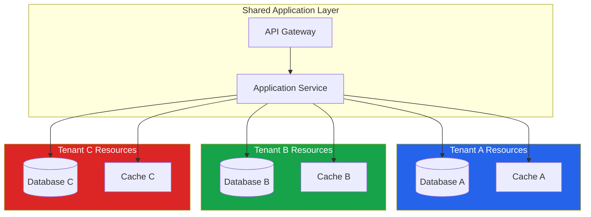
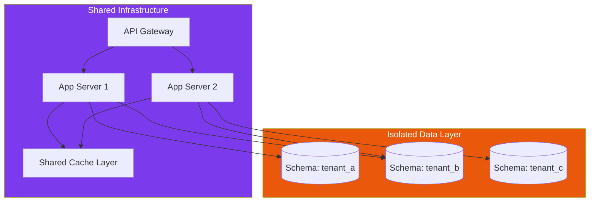
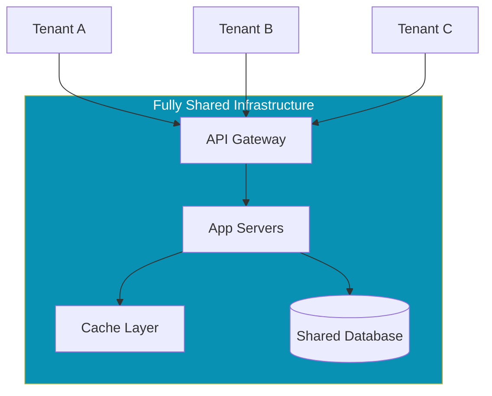
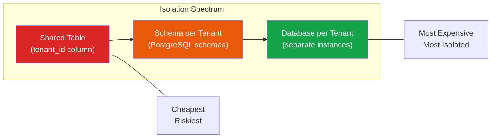

# Multi-Tenancy Overview

Multi-tenancy is the architectural principle that allows a single instance of software to serve multiple customers — called tenants — simultaneously. Every SaaS product you use is multi-tenant. Slack, Stripe, Datadog, GitHub — all of them run one codebase, one deployment, and one operational surface that serves thousands of organizations without those organizations seeing, touching, or affecting each other's data.

The alternative — single-tenancy — means deploying a separate instance of the entire stack for each customer. This is how on-premise software works. It is also how early cloud products worked before teams figured out that managing 500 separate deployments is an operational nightmare that does not scale.

Multi-tenancy is not merely a deployment optimization. It is a fundamental architectural decision that affects your database schema, your API design, your security model, your billing system, your CI/CD pipeline, and your team's operational burden. Get it right and you have a platform that scales to 10,000 customers with the same ops team. Get it wrong and you have a distributed monolith with data leakage risks and cascading failures.

## Why Multi-Tenancy Matters

The economics are straightforward:

| Factor | Single-Tenant | Multi-Tenant |
|---|---|---|
| Infrastructure cost per customer | High (dedicated resources) | Low (shared resources) |
| Operational overhead | Scales linearly with customers | Nearly constant |
| Deployment complexity | One pipeline per customer | One pipeline total |
| Time to onboard new customer | Hours to days | Seconds to minutes |
| Data isolation | Strong (physical) | Requires explicit enforcement |
| Customization flexibility | High (per-instance config) | Constrained (feature flags) |
| Upgrade management | Per-customer rollout | Single rollout |

The inflection point is clear. Single-tenancy works when you have 5 enterprise customers each paying $500K/year. It falls apart at 50 customers and becomes completely unmanageable at 500.

## The Three Isolation Models

Every multi-tenant architecture falls somewhere on a spectrum between full isolation and full sharing. There are three primary models, and most real systems use a hybrid.

### Model 1: Silo (Full Isolation)

Each tenant gets dedicated infrastructure — separate databases, separate compute, separate networking. The application is shared, but the underlying resources are not.



**When to use:** Regulated industries (healthcare, finance), customers with strict compliance requirements, enterprise customers who demand it contractually.

**Trade-off:** Maximum isolation but highest cost and operational complexity. You still manage per-tenant resources.

### Model 2: Bridge (Hybrid Isolation)

Some resources are shared, some are dedicated. Typically, compute is shared but data storage is isolated — each tenant gets its own database schema or database instance, but the application servers are shared.



**When to use:** Most B2B SaaS products. Gives you cost efficiency on compute while maintaining data isolation guarantees.

**Trade-off:** Good balance of cost and isolation. Database management is more complex than full pooling, but much simpler than full silo.

### Model 3: Pool (Full Sharing)

All tenants share everything — same database, same tables, same compute. Tenant isolation is enforced through application logic and row-level security.



**When to use:** High-volume, low-touch products (developer tools, analytics platforms). When you need to support thousands of tenants with minimal operational overhead.

**Trade-off:** Lowest cost, simplest operations, but highest risk. A bug in your tenant filtering logic means data leakage. A single tenant's query can slow down everyone (the [noisy neighbor problem](/architecture-patterns/multi-tenancy/noisy-neighbor)).

## Isolation Model Decision Matrix

| Criteria | Silo | Bridge | Pool |
|---|---|---|---|
| Data isolation | Physical | Logical (schema) | Logical (row) |
| Cost per tenant | Highest | Medium | Lowest |
| Onboarding speed | Slow | Medium | Fast |
| Noisy neighbor risk | None | Low | High |
| Compliance suitability | Excellent | Good | Requires extra controls |
| Operational complexity | High | Medium | Low |
| Max tenant count | Hundreds | Thousands | Millions |
| Customization | Per-instance | Per-schema | Feature flags only |

## Tenant Context: The Foundation

Regardless of which isolation model you choose, every request in a multi-tenant system must carry a **tenant context** — the identity of the tenant making the request. This context flows through every layer of the stack.

```typescript
// Tenant context middleware — extract tenant from request
import { Request, Response, NextFunction } from 'express';

interface TenantContext {
  tenantId: string;
  tenantSlug: string;
  plan: 'free' | 'pro' | 'enterprise';
  region: string;
}

declare global {
  namespace Express {
    interface Request {
      tenant: TenantContext;
    }
  }
}

export function tenantMiddleware() {
  return async (req: Request, res: Response, next: NextFunction) => {
    // Strategy 1: Subdomain-based (acme.app.com)
    const host = req.hostname;
    const subdomain = host.split('.')[0];

    // Strategy 2: Header-based (X-Tenant-ID)
    const headerTenantId = req.headers['x-tenant-id'] as string;

    // Strategy 3: JWT claim
    const jwtTenantId = req.user?.tenantId;

    const tenantSlug = subdomain || headerTenantId || jwtTenantId;

    if (!tenantSlug) {
      return res.status(400).json({ error: 'Tenant context required' });
    }

    // Resolve tenant from cache/database
    const tenant = await resolveTenant(tenantSlug);
    if (!tenant) {
      return res.status(404).json({ error: 'Tenant not found' });
    }

    req.tenant = tenant;
    next();
  };
}
```

::: warning Tenant Context Must Be Immutable
Once the tenant context is set on a request, it should never be modified. If an internal service needs to act on behalf of a different tenant (e.g., cross-tenant reporting), use an explicit service account with audit logging rather than swapping the tenant context.
:::

## Tenant Identification Strategies

How you identify which tenant a request belongs to is a critical early decision:

| Strategy | Example | Pros | Cons |
|---|---|---|---|
| Subdomain | `acme.yourapp.com` | Clean UX, natural isolation | DNS/TLS complexity, wildcard certs |
| Path prefix | `yourapp.com/acme/...` | Simple routing, no DNS changes | Messy URLs, harder to isolate |
| Header | `X-Tenant-ID: acme` | Flexible, API-friendly | Not user-facing, easy to forget |
| JWT claim | `{ "tenant": "acme" }` | Tied to auth, hard to forge | Requires token refresh for tenant switch |
| Custom domain | `app.acme.com` | Premium feel for enterprise | Complex certificate management |

Most SaaS products start with subdomain-based identification and add custom domains as an enterprise feature later.

## Data Architecture Considerations

The choice of data isolation model is the most impactful multi-tenancy decision. See [Multi-Tenant Database Strategies](/architecture-patterns/multi-tenancy/database-strategies) for a deep dive, but here is the summary:



## Cross-Cutting Concerns

Multi-tenancy is not just a database problem. Every layer of your stack needs tenant awareness:

### 1. Caching

Every cache key must include the tenant identifier. Forgetting this is one of the most common multi-tenancy bugs.

```typescript
// WRONG - cache key collision across tenants
const key = `user:${userId}`;

// RIGHT - tenant-scoped cache key
const key = `tenant:${tenantId}:user:${userId}`;
```

### 2. Background Jobs

Jobs must carry tenant context. When a job runs outside of a request, there is no middleware to set the tenant.

```typescript
// Enqueue with tenant context
await queue.add('send-invoice', {
  tenantId: req.tenant.tenantId,
  invoiceId: invoice.id,
});

// Process with tenant context restored
queue.process('send-invoice', async (job) => {
  const { tenantId, invoiceId } = job.data;
  await withTenantContext(tenantId, async () => {
    // All database queries scoped to this tenant
    const invoice = await Invoice.findById(invoiceId);
    await sendInvoiceEmail(invoice);
  });
});
```

### 3. Logging and Observability

Every log line, metric, and trace should include the tenant identifier. Without this, debugging production issues for a specific tenant becomes impossible.

```typescript
// Structured logging with tenant context
logger.info('Invoice generated', {
  tenantId: req.tenant.tenantId,
  invoiceId: invoice.id,
  amount: invoice.total,
  currency: invoice.currency,
});
```

### 4. Rate Limiting

Rate limits must be per-tenant, not global. See the [Noisy Neighbor Problem](/architecture-patterns/multi-tenancy/noisy-neighbor) for detailed strategies.

## Common Anti-Patterns

::: danger Avoid These Multi-Tenancy Mistakes
1. **Filtering in application code only** — Always enforce tenant isolation at the database level (RLS, schema separation) as well. Application bugs happen.
2. **Global cache keys** — Every cache key must be tenant-scoped. A single missed key leaks data.
3. **Shared sequences** — Auto-incrementing IDs across tenants leak information (tenant B can estimate tenant A's order volume).
4. **Tenant context in global state** — Never store tenant context in module-level variables. Use request-scoped or async-local-storage contexts.
5. **No tenant in background jobs** — Jobs that forget to carry tenant context will either fail or, worse, operate on the wrong tenant's data.
:::

## Migration Path: Monolith to Multi-Tenant

If you are retrofitting multi-tenancy into an existing single-tenant application, here is a phased approach:

1. **Add tenant_id column** to every table — this is the hardest part
2. **Implement tenant middleware** — extract tenant from every request
3. **Enable row-level security** — database-level enforcement as a safety net
4. **Audit all queries** — ensure every query includes tenant filtering
5. **Scope all caches** — prefix every cache key with tenant ID
6. **Scope all background jobs** — carry tenant context through job payloads
7. **Add per-tenant rate limiting** — prevent noisy neighbors
8. **Build tenant provisioning** — automate onboarding

## Section Contents

| Page | What You'll Learn |
|---|---|
| [Database Strategies](/architecture-patterns/multi-tenancy/database-strategies) | Shared tables, schema-per-tenant, database-per-tenant, and PostgreSQL RLS |
| [Noisy Neighbor Problem](/architecture-patterns/multi-tenancy/noisy-neighbor) | Resource isolation, fair queuing, detection, and mitigation |

## Further Reading

- [Microservices Architecture](/architecture-patterns/microservices/) — Multi-tenancy intersects heavily with service decomposition
- [Event-Driven Architecture](/architecture-patterns/event-driven/) — Tenant-scoped event streams and message routing
- [Rate Limiter Blueprint](/production-blueprints/rate-limiter/) — Per-tenant rate limiting implementation
- [Zero Trust Security](/security/zero-trust/) — Tenant isolation as a zero-trust boundary
- Microsoft Azure SaaS tenancy patterns documentation
- AWS SaaS Factory reference architectures
- "Designing Multi-Tenant Solutions" by Bohdan Petryshyn
