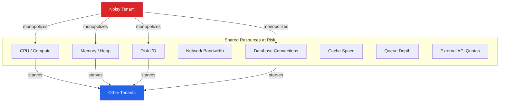
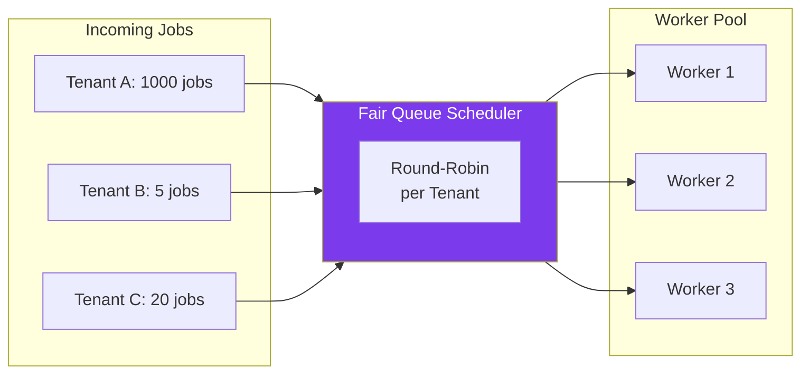
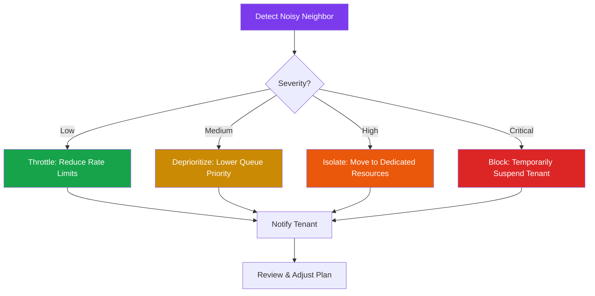

# Noisy Neighbor Problem

The noisy neighbor problem is the defining challenge of shared-resource multi-tenancy. It occurs when one tenant's workload consumes a disproportionate share of shared resources — CPU, memory, I/O, network bandwidth, database connections — degrading performance for every other tenant on the same infrastructure.

This is not a theoretical concern. It is the reason SaaS outage postmortems so often read: "A single customer ran a data export that saturated the database connection pool, causing timeouts for all tenants." It is also the reason cloud providers invented resource quotas, and why Kubernetes has resource limits, and why every mature SaaS platform has per-tenant rate limiting.

The fundamental tension is economic. Multi-tenancy saves money precisely because resources are shared. But sharing resources means one tenant can monopolize them. The engineering challenge is to share resources efficiently while preventing any single tenant from degrading the experience for others.

## What Causes Noisy Neighbor Issues

Every shared resource in your stack is a potential noisy neighbor vector:



### Common Scenarios

| Scenario | Resource Affected | Impact |
|---|---|---|
| Large CSV export query | Database CPU + connections | All tenants see slow queries |
| Bulk API import (100K records) | Application memory + I/O | OOM kills, request timeouts |
| Unoptimized search query (full table scan) | Database I/O + CPU | Shared database becomes unresponsive |
| Webhook retry storm | Outbound network + thread pool | Other tenants' webhooks delayed |
| Large file upload | Network bandwidth + disk I/O | Upload timeouts for other tenants |
| Cache stampede (cold start) | Cache + database | Cache eviction affects other tenants |
| Runaway background job | CPU + memory | Job queue backs up for all tenants |

## Resource Isolation Strategies

### 1. Per-Tenant Rate Limiting

The first line of defense. Rate limits cap the number of requests a single tenant can make within a time window.

```typescript
import { Redis } from 'ioredis';

const redis = new Redis(process.env.REDIS_URL);

interface RateLimitConfig {
  windowMs: number;
  maxRequests: number;
}

const TIER_LIMITS: Record<string, RateLimitConfig> = {
  free:       { windowMs: 60_000, maxRequests: 60 },
  pro:        { windowMs: 60_000, maxRequests: 600 },
  enterprise: { windowMs: 60_000, maxRequests: 6000 },
};

async function checkRateLimit(
  tenantId: string,
  tier: string
): Promise<{ allowed: boolean; remaining: number; resetAt: number }> {
  const config = TIER_LIMITS[tier];
  const windowKey = Math.floor(Date.now() / config.windowMs);
  const key = `ratelimit:${tenantId}:${windowKey}`;

  const current = await redis.incr(key);
  if (current === 1) {
    await redis.pexpire(key, config.windowMs);
  }

  const remaining = Math.max(0, config.maxRequests - current);
  const resetAt = (windowKey + 1) * config.windowMs;

  return {
    allowed: current <= config.maxRequests,
    remaining,
    resetAt,
  };
}

// Express middleware
export function rateLimitMiddleware() {
  return async (req, res, next) => {
    const { allowed, remaining, resetAt } = await checkRateLimit(
      req.tenant.tenantId,
      req.tenant.plan
    );

    res.setHeader('X-RateLimit-Remaining', remaining);
    res.setHeader('X-RateLimit-Reset', resetAt);

    if (!allowed) {
      return res.status(429).json({
        error: 'Rate limit exceeded',
        retryAfter: Math.ceil((resetAt - Date.now()) / 1000),
      });
    }

    next();
  };
}
```

::: tip Granular Rate Limits
Do not use a single global rate limit. Different operations have different costs. Rate limit expensive operations (exports, bulk writes, search) more aggressively than cheap ones (reads, health checks).
:::

### 2. Database Connection Isolation

A single tenant should not be able to exhaust the database connection pool:

```typescript
import { Pool } from 'pg';

// Global pool with tenant-aware connection management
const globalPool = new Pool({
  connectionString: process.env.DATABASE_URL,
  max: 100,  // Total connections
});

// Per-tenant connection semaphore
const tenantConnectionLimits = new Map<string, number>();
const tenantActiveConnections = new Map<string, number>();

const MAX_CONNECTIONS_PER_TENANT: Record<string, number> = {
  free: 5,
  pro: 15,
  enterprise: 40,
};

async function acquireTenantConnection(
  tenantId: string,
  tier: string
): Promise<PoolClient> {
  const maxConn = MAX_CONNECTIONS_PER_TENANT[tier] || 5;
  const active = tenantActiveConnections.get(tenantId) || 0;

  if (active >= maxConn) {
    throw new Error(
      `Tenant ${tenantId} exceeded max connections (${maxConn})`
    );
  }

  tenantActiveConnections.set(tenantId, active + 1);

  const client = await globalPool.connect();

  // Wrap release to decrement counter
  const originalRelease = client.release.bind(client);
  client.release = () => {
    const current = tenantActiveConnections.get(tenantId) || 1;
    tenantActiveConnections.set(tenantId, current - 1);
    return originalRelease();
  };

  return client;
}
```

### 3. Query Timeout Per Tenant

Prevent long-running queries from blocking shared database resources:

```sql
-- Set statement timeout per tenant tier
-- Free tier: 5 second query timeout
SET statement_timeout = '5s';

-- Pro tier: 30 second timeout
SET statement_timeout = '30s';

-- Enterprise: 120 second timeout
SET statement_timeout = '120s';
```

```typescript
async function withTenantQueryLimits(
  tenantId: string,
  tier: string,
  fn: (client: PoolClient) => Promise<any>
) {
  const timeouts: Record<string, string> = {
    free: '5s',
    pro: '30s',
    enterprise: '120s',
  };

  const client = await acquireTenantConnection(tenantId, tier);
  try {
    await client.query(
      `SET statement_timeout = '${timeouts[tier] || '5s'}'`
    );
    await client.query(
      `SET app.current_tenant_id = '${tenantId}'`
    );
    return await fn(client);
  } finally {
    await client.query('RESET statement_timeout');
    client.release();
  }
}
```

### 4. CPU and Memory Isolation

For compute-intensive workloads, use Kubernetes resource limits to cap per-tenant resource consumption:

```yaml
# Kubernetes pod with per-tenant resource limits
apiVersion: v1
kind: Pod
metadata:
  name: tenant-worker-acme
  labels:
    tenant: acme
    tier: enterprise
spec:
  containers:
    - name: worker
      image: myapp/worker:latest
      resources:
        requests:
          cpu: "500m"
          memory: "512Mi"
        limits:
          cpu: "2000m"
          memory: "2Gi"
      env:
        - name: TENANT_ID
          value: "acme"
```

For shared application servers, use worker thread pools or process isolation:

```typescript
// Worker pool with per-tenant concurrency limits
import { Worker } from 'worker_threads';

class TenantWorkerPool {
  private activeTasks = new Map<string, number>();
  private maxConcurrency: Record<string, number> = {
    free: 1,
    pro: 4,
    enterprise: 16,
  };

  async execute(
    tenantId: string,
    tier: string,
    task: () => Promise<any>
  ): Promise<any> {
    const max = this.maxConcurrency[tier] || 1;
    const active = this.activeTasks.get(tenantId) || 0;

    if (active >= max) {
      throw new Error('Tenant concurrency limit reached');
    }

    this.activeTasks.set(tenantId, active + 1);
    try {
      return await task();
    } finally {
      this.activeTasks.set(
        tenantId,
        (this.activeTasks.get(tenantId) || 1) - 1
      );
    }
  }
}
```

### 5. Fair Queuing

When tenants share a job queue, a single tenant submitting thousands of jobs can starve others. Fair queuing ensures each tenant gets an equitable share of processing capacity.



```typescript
import { Redis } from 'ioredis';

class FairTenantQueue {
  private redis: Redis;

  constructor(redis: Redis) {
    this.redis = redis;
  }

  async enqueue(tenantId: string, job: object): Promise<void> {
    // Each tenant has its own queue
    await this.redis.rpush(
      `queue:tenant:${tenantId}`,
      JSON.stringify(job)
    );
    // Track active tenant queues
    await this.redis.sadd('queue:active_tenants', tenantId);
  }

  async dequeue(): Promise<{ tenantId: string; job: object } | null> {
    // Round-robin across tenant queues
    const tenants = await this.redis.smembers('queue:active_tenants');

    if (tenants.length === 0) return null;

    // Rotate tenant list for fairness
    const nextTenant = await this.redis.rpoplpush(
      'queue:tenant_order',
      'queue:tenant_order'
    );

    const tenantId = nextTenant || tenants[0];
    const raw = await this.redis.lpop(`queue:tenant:${tenantId}`);

    if (!raw) {
      // This tenant's queue is empty — remove from active set
      await this.redis.srem('queue:active_tenants', tenantId);
      return this.dequeue(); // Try next tenant
    }

    return { tenantId, job: JSON.parse(raw) };
  }
}
```

### 6. Network and Bandwidth Throttling

For file uploads, data exports, and webhook deliveries:

```typescript
import { Transform, TransformCallback } from 'stream';

// Bandwidth throttling transform stream
class ThrottleStream extends Transform {
  private bytesPerSecond: number;
  private lastTime: number = Date.now();
  private bytesSent: number = 0;

  constructor(bytesPerSecond: number) {
    super();
    this.bytesPerSecond = bytesPerSecond;
  }

  _transform(
    chunk: Buffer,
    encoding: string,
    callback: TransformCallback
  ): void {
    this.bytesSent += chunk.length;
    const elapsed = (Date.now() - this.lastTime) / 1000;
    const expectedTime = this.bytesSent / this.bytesPerSecond;

    if (elapsed < expectedTime) {
      setTimeout(() => {
        this.push(chunk);
        callback();
      }, (expectedTime - elapsed) * 1000);
    } else {
      this.push(chunk);
      callback();
    }
  }
}

// Apply per-tenant bandwidth limits
const BANDWIDTH_LIMITS: Record<string, number> = {
  free: 1 * 1024 * 1024,       // 1 MB/s
  pro: 10 * 1024 * 1024,       // 10 MB/s
  enterprise: 100 * 1024 * 1024, // 100 MB/s
};

app.get('/api/export', async (req, res) => {
  const limit = BANDWIDTH_LIMITS[req.tenant.plan] || BANDWIDTH_LIMITS.free;
  const throttle = new ThrottleStream(limit);

  const dataStream = generateExportStream(req.tenant.tenantId);
  dataStream.pipe(throttle).pipe(res);
});
```

## Monitoring and Detection

You cannot fix what you cannot see. Detecting noisy neighbors requires per-tenant observability.

### Key Metrics to Track Per Tenant

```typescript
import { Counter, Histogram, Gauge } from 'prom-client';

// Request count per tenant
const requestCounter = new Counter({
  name: 'http_requests_total',
  help: 'Total HTTP requests',
  labelNames: ['tenant_id', 'method', 'status', 'endpoint'],
});

// Request latency per tenant
const latencyHistogram = new Histogram({
  name: 'http_request_duration_seconds',
  help: 'HTTP request latency',
  labelNames: ['tenant_id', 'endpoint'],
  buckets: [0.01, 0.05, 0.1, 0.25, 0.5, 1, 2.5, 5, 10],
});

// Active database connections per tenant
const dbConnectionGauge = new Gauge({
  name: 'db_connections_active',
  help: 'Active database connections',
  labelNames: ['tenant_id'],
});

// Query duration per tenant
const queryDuration = new Histogram({
  name: 'db_query_duration_seconds',
  help: 'Database query duration',
  labelNames: ['tenant_id', 'query_type'],
  buckets: [0.001, 0.01, 0.05, 0.1, 0.5, 1, 5, 30],
});
```

### Automated Noisy Neighbor Detection

```python
# Prometheus alerting rules for noisy neighbor detection
# prometheus/rules/noisy_neighbor.yml

"""
groups:
  - name: noisy_neighbor
    interval: 30s
    rules:
      # Alert when a single tenant uses >40% of total requests
      - alert: TenantRequestDominance
        expr: |
          (
            sum(rate(http_requests_total[5m])) by (tenant_id)
            /
            sum(rate(http_requests_total[5m]))
          ) > 0.4
        for: 5m
        labels:
          severity: warning
        annotations:
          summary: "Tenant {​{ $labels.tenant_id }} consuming >40% of requests"

      # Alert when a tenant's p99 latency is 5x the global p50
      - alert: TenantLatencyAnomaly
        expr: |
          histogram_quantile(0.99,
            sum(rate(http_request_duration_seconds_bucket[5m])) by (tenant_id, le)
          ) > 5 * histogram_quantile(0.5,
            sum(rate(http_request_duration_seconds_bucket[5m])) by (le)
          )
        for: 5m
        labels:
          severity: warning

      # Alert when a tenant holds >30% of database connections
      - alert: TenantConnectionHog
        expr: |
          db_connections_active / ignoring(tenant_id) group_left
          sum(db_connections_active) > 0.3
        for: 2m
        labels:
          severity: critical
"""
```

### Real-Time Noisy Neighbor Dashboard

Build a dashboard that shows resource consumption broken down by tenant:

```sql
-- Top 10 tenants by database time consumed (PostgreSQL)
SELECT
    tenant_id,
    count(*) AS query_count,
    round(sum(duration_ms)::numeric, 2) AS total_ms,
    round(avg(duration_ms)::numeric, 2) AS avg_ms,
    round(max(duration_ms)::numeric, 2) AS max_ms,
    round(
        100.0 * sum(duration_ms) /
        sum(sum(duration_ms)) OVER (), 2
    ) AS pct_of_total
FROM query_log
WHERE logged_at > now() - interval '1 hour'
GROUP BY tenant_id
ORDER BY total_ms DESC
LIMIT 10;
```

## Remediation Strategies

When you detect a noisy neighbor, you have several options, ordered from least to most disruptive:



### Automated Throttling

```typescript
// Adaptive rate limiting — automatically tighten limits
// when system load is high
async function adaptiveRateLimit(
  tenantId: string,
  baseLimitPerMinute: number
): Promise<{ allowed: boolean }> {
  // Check system-wide load
  const systemLoad = await getSystemLoadFactor(); // 0.0 to 1.0

  // As system load increases, reduce per-tenant limits
  let effectiveLimit = baseLimitPerMinute;
  if (systemLoad > 0.8) {
    effectiveLimit = Math.floor(baseLimitPerMinute * 0.5);
  } else if (systemLoad > 0.6) {
    effectiveLimit = Math.floor(baseLimitPerMinute * 0.75);
  }

  // Check tenant's current usage
  const currentUsage = await redis.get(`usage:${tenantId}`);
  const usage = parseInt(currentUsage || '0', 10);

  return { allowed: usage < effectiveLimit };
}
```

### Tenant Isolation Escalation

```typescript
// Automated escalation: move noisy tenant to dedicated resources
async function escalateTenant(tenantId: string): Promise<void> {
  const metrics = await getTenantMetrics(tenantId);

  if (metrics.resourceConsumptionPct > 40) {
    // Step 1: Tighten rate limits
    await setTenantRateLimit(tenantId, 'restricted');
    await notifyTenant(tenantId, 'rate_limit_reduced', {
      reason: 'Unusual resource consumption detected',
    });
  }

  if (metrics.resourceConsumptionPct > 60) {
    // Step 2: Move to isolated compute
    await migrateTenantToIsolatedPool(tenantId);
    await notifyOpsTeam('tenant_isolated', { tenantId, metrics });
  }

  if (metrics.isAffectingOtherTenants) {
    // Step 3: Emergency throttle
    await emergencyThrottle(tenantId);
    await notifyOpsTeam('tenant_emergency_throttled', {
      tenantId,
      metrics,
      affectedTenants: metrics.affectedTenantIds,
    });
  }
}
```

## Prevention: Design Patterns That Avoid Noisy Neighbors

::: tip Proactive Prevention Is Better Than Reactive Detection
The best noisy neighbor strategies prevent the problem from occurring rather than detecting and mitigating it after the fact.
:::

### 1. Async-First for Heavy Operations

Never let an export, import, or report generation run synchronously in the request path:

```typescript
// BAD: Synchronous export blocks a thread
app.get('/api/export', async (req, res) => {
  const data = await db.query('SELECT * FROM events WHERE tenant_id = $1', [req.tenant.tenantId]);
  res.json(data.rows); // Could be 10M rows
});

// GOOD: Async export with background processing
app.post('/api/exports', async (req, res) => {
  const exportJob = await queue.add('tenant-export', {
    tenantId: req.tenant.tenantId,
    filters: req.body.filters,
  }, {
    priority: getPriorityForTier(req.tenant.plan),
  });

  res.status(202).json({
    exportId: exportJob.id,
    status: 'processing',
    pollUrl: `/api/exports/${exportJob.id}`,
  });
});
```

### 2. Pagination and Cursor Limits

Never return unbounded result sets:

```typescript
const MAX_PAGE_SIZE: Record<string, number> = {
  free: 50,
  pro: 200,
  enterprise: 1000,
};

app.get('/api/events', async (req, res) => {
  const maxSize = MAX_PAGE_SIZE[req.tenant.plan] || 50;
  const pageSize = Math.min(
    parseInt(req.query.limit as string) || 20,
    maxSize
  );

  const events = await db.query(
    `SELECT * FROM events
     WHERE tenant_id = $1 AND id > $2
     ORDER BY id
     LIMIT $3`,
    [req.tenant.tenantId, req.query.cursor || '', pageSize + 1]
  );

  const hasMore = events.rows.length > pageSize;
  const results = events.rows.slice(0, pageSize);

  res.json({
    data: results,
    cursor: hasMore ? results[results.length - 1].id : null,
    hasMore,
  });
});
```

### 3. Request Costing

Not all requests are equal. A GET that hits a cache costs 1 unit. A complex search costs 100 units. A bulk import costs 10,000 units. Weight your rate limits accordingly:

```typescript
const OPERATION_COSTS: Record<string, number> = {
  'GET /api/users': 1,
  'GET /api/search': 10,
  'POST /api/users': 5,
  'POST /api/import': 100,
  'POST /api/export': 200,
};

async function costBasedRateLimit(
  tenantId: string,
  operation: string,
  budgetPerMinute: number
): Promise<boolean> {
  const cost = OPERATION_COSTS[operation] || 1;
  const key = `cost:${tenantId}:${Math.floor(Date.now() / 60000)}`;

  const current = await redis.incrby(key, cost);
  if (current === cost) {
    await redis.expire(key, 120);
  }

  return current <= budgetPerMinute;
}
```

## Further Reading

- [Multi-Tenancy Overview](/architecture-patterns/multi-tenancy/) — Isolation models and architecture decisions
- [Multi-Tenant Database Strategies](/architecture-patterns/multi-tenancy/database-strategies) — Database-level isolation patterns
- [Rate Limiter Blueprint](/production-blueprints/rate-limiter/) — Complete rate limiting implementation
- [Observability](/infrastructure/observability/) — Monitoring and alerting infrastructure
- [Kubernetes Resource Management](/infrastructure/kubernetes/) — Container-level resource isolation
- Google Cloud "Noisy Neighbor" anti-pattern documentation
- "Release It!" by Michael Nygard — Stability patterns for production systems
